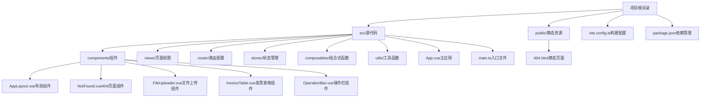
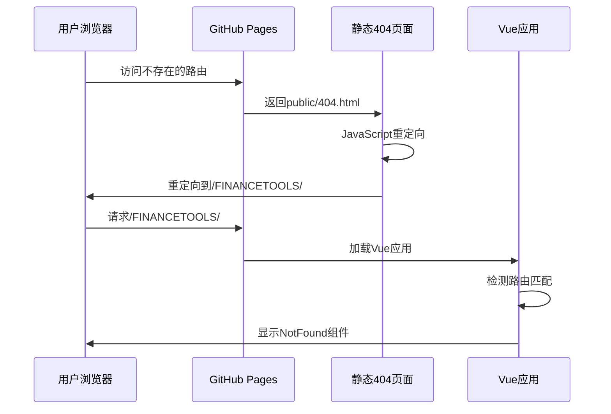
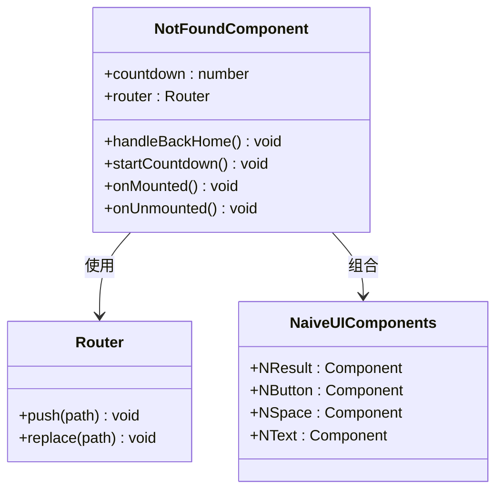
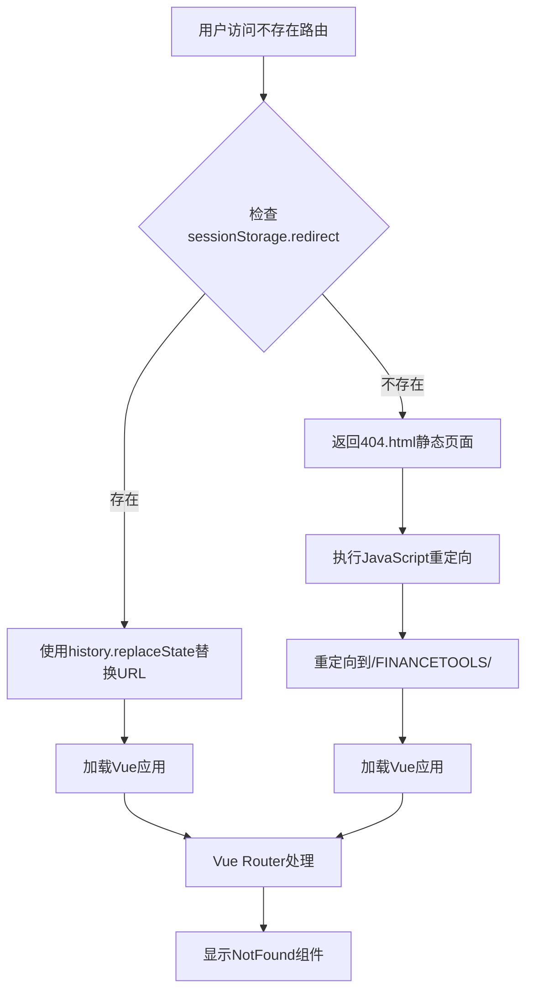
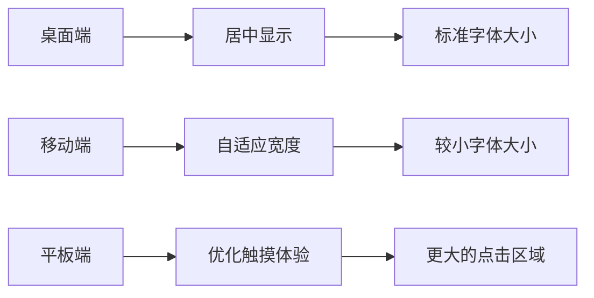
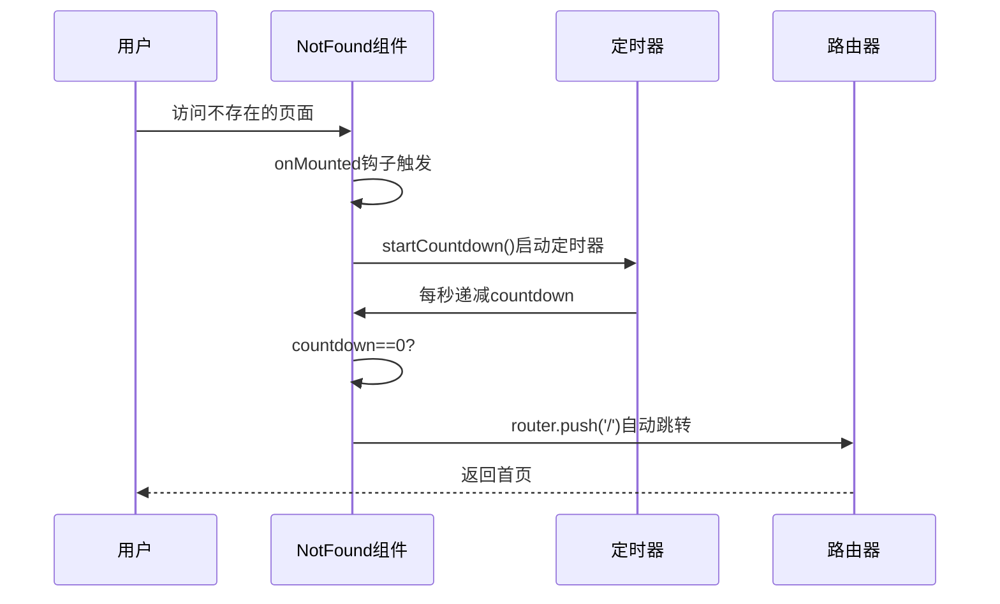
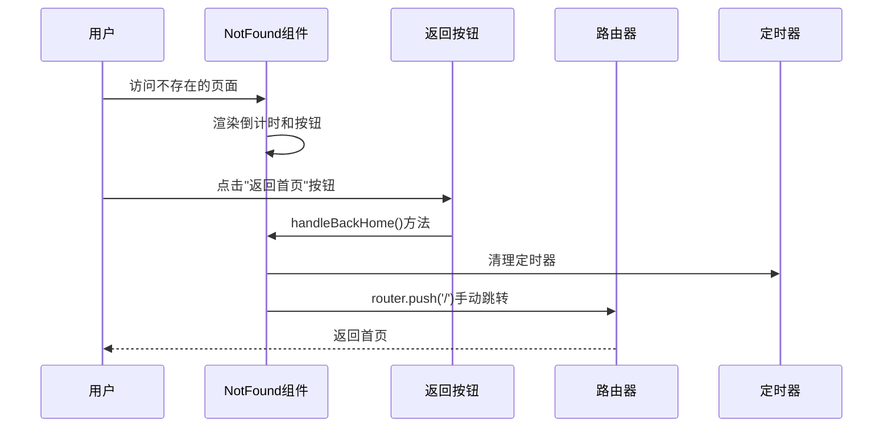
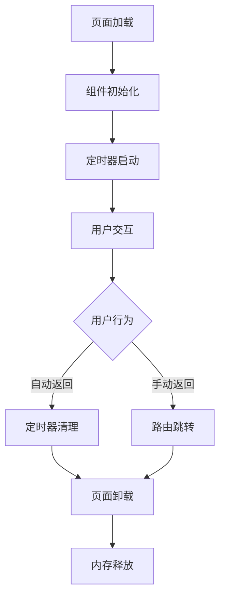

# 404 页面

<cite>
**本文档引用的文件**
- [public/404.html](file://public/404.html)
- [src/components/NotFound.vue](file://src/components/NotFound.vue)
- [src/router/index.ts](file://src/router/index.ts)
- [src/App.vue](file://src/App.vue)
- [index.html](file://index.html)
- [src/views/HomePage.vue](file://src/views/HomePage.vue)
- [src/views/Home.vue](file://src/views/Home.vue)
- [src/components/AppLayout.vue](file://src/components/AppLayout.vue)
- [src/stores/invoice.ts](file://src/stores/invoice.ts)
- [src/composables/useTheme.ts](file://src/composables/useTheme.ts)
- [package.json](file://package.json)
- [README.md](file://README.md)
</cite>

## 目录
1. [简介](#简介)
2. [项目结构](#项目结构)
3. [404 页面架构](#404-页面架构)
4. [GitHub Pages 支持机制](#github-pages-支持机制)
5. [用户界面设计](#用户界面设计)
6. [交互流程分析](#交互流程分析)
7. [性能考虑](#性能考虑)
8. [故障排除指南](#故障排除指南)
9. [总结](#总结)

## 简介

财务工具箱是一个基于 Vue 3 的财务工具集合应用，提供了发票处理等实用工具。该项目采用现代前端技术栈，包括 Vue 3、Naive UI 组件库、Pinia 状态管理等。404 页面作为应用的重要组成部分，负责处理用户访问不存在页面时的用户体验。

该应用主要功能包括：
- 发票重命名：批量处理发票文件，智能提取信息并重命名
- 响应式设计：适配不同屏幕尺寸的设备
- 主题切换：支持明暗主题模式
- 文件处理：支持 PDF 和 XML 格式的发票文件

## 项目结构

财务工具箱采用模块化的项目结构，主要目录组织如下：

**图表来源**
- [src/App.vue](file://src/App.vue#L1-L44)
- [src/router/index.ts](file://src/router/index.ts#L1-L33)

**章节来源**
- [package.json](file://package.json#L1-L32)
- [README.md](file://README.md#L1-L38)

## 404 页面架构

404 页面采用了多层次的设计架构，结合了静态 HTML 页面和动态 Vue 组件：

### 静态页面层

应用包含两个层面的 404 处理机制：

1. **GitHub Pages 静态重定向页面** (`public/404.html`)
2. **Vue 应用动态 404 组件** (`src/components/NotFound.vue`)

### 静态重定向机制

GitHub Pages SPA 应用需要特殊的重定向处理机制：

**图表来源**
- [public/404.html](file://public/404.html#L7-L16)
- [index.html](file://index.html#L9-L17)

### 动态组件层

Vue 应用中的 404 组件提供了丰富的交互体验：

**图表来源**
- [src/components/NotFound.vue](file://src/components/NotFound.vue#L22-L56)

**章节来源**
- [public/404.html](file://public/404.html#L1-L25)
- [src/components/NotFound.vue](file://src/components/NotFound.vue#L1-L66)

## GitHub Pages 支持机制

为了在 GitHub Pages 上正确运行 SPA 应用，项目实现了双层重定向机制：

### 服务器端重定向

GitHub Pages 无法直接处理前端路由，因此需要服务器端的特殊处理：

**图表来源**
- [index.html](file://index.html#L9-L17)
- [public/404.html](file://public/404.html#L7-L16)

### 客户端路由处理

Vue Router 配置了通配符路由来捕获所有未匹配的路由：

**章节来源**
- [index.html](file://index.html#L1-L24)
- [src/router/index.ts](file://src/router/index.ts#L20-L24)

## 用户界面设计

404 页面采用了简洁而友好的设计原则：

### 视觉设计元素

| 设计元素 | 实现方式 | 功能说明 |
|---------|---------|----------|
| **状态图标** | 使用 Naive UI 的 `NResult` 组件 | 显示404状态，提供视觉反馈 |
| **倒计时计数器** | `ref(5)` 响应式变量 | 自动返回首页的倒计时功能 |
| **按钮交互** | `NButton` 组件和事件处理器 | 提供手动返回首页选项 |
| **布局容器** | `not-found-container` 类 | 居中显示内容，全屏高度 |

### 响应式设计

404 页面完全支持响应式布局：

**图表来源**
- [src/components/NotFound.vue](file://src/components/NotFound.vue#L58-L66)

**章节来源**
- [src/components/NotFound.vue](file://src/components/NotFound.vue#L1-L66)

## 交互流程分析

404 页面的交互流程设计得非常直观和用户友好：

### 自动返回流程

**图表来源**
- [src/components/NotFound.vue](file://src/components/NotFound.vue#L38-L45)
- [src/components/NotFound.vue](file://src/components/NotFound.vue#L31-L36)

### 手动返回流程

**图表来源**
- [src/components/NotFound.vue](file://src/components/NotFound.vue#L31-L36)
- [src/components/NotFound.vue](file://src/components/NotFound.vue#L51-L55)

### 生命周期管理

组件实现了完整的生命周期管理：

**章节来源**
- [src/components/NotFound.vue](file://src/components/NotFound.vue#L47-L55)

## 性能考虑

404 页面在性能方面采用了多项优化策略：

### 资源优化

1. **最小化依赖**：仅使用必要的 Naive UI 组件
2. **懒加载**：组件按需加载，不影响主应用性能
3. **内存管理**：及时清理定时器，防止内存泄漏

### 用户体验优化

1. **快速响应**：倒计时从5秒开始，提供即时反馈
2. **优雅降级**：即使 JavaScript 失效，仍能正常工作
3. **无障碍访问**：支持键盘导航和屏幕阅读器

### 性能监控

**图表来源**
- [src/components/NotFound.vue](file://src/components/NotFound.vue#L29-L55)

**章节来源**
- [src/components/NotFound.vue](file://src/components/NotFound.vue#L1-L66)

## 故障排除指南

### 常见问题及解决方案

#### 1. 404 页面不显示

**症状**：访问不存在的路由时显示 GitHub 默认 404 页面

**可能原因**：
- `public/404.html` 文件缺失或路径错误
- GitHub Pages 配置问题
- 缓存问题

**解决步骤**：
1. 确认 `public/404.html` 文件存在且可访问
2. 检查 GitHub Pages 设置中的自定义 404 页面路径
3. 清除浏览器缓存或使用无痕模式测试

#### 2. 自动跳转功能失效

**症状**：倒计时停止但页面不自动跳转

**可能原因**：
- JavaScript 错误阻止了定时器执行
- 路由器实例创建失败
- 浏览器安全设置阻止了自动跳转

**解决步骤**：
1. 打开浏览器开发者工具查看控制台错误
2. 检查 `router.push('/')` 是否能正常执行
3. 确认用户代理设置允许自动跳转

#### 3. 手动返回按钮无效

**症状**：点击"返回首页"按钮无反应

**可能原因**：
- 事件处理器绑定失败
- 路由器实例未正确注入
- 组件卸载时的清理逻辑问题

**解决步骤**：
1. 检查 `handleBackHome()` 方法的调用链
2. 确认 `useRouter()` 钩子正确返回路由器实例
3. 验证定时器清理逻辑是否正确执行

#### 4. GitHub Pages 重定向问题

**症状**：页面在 GitHub Pages 上无法正确重定向

**可能原因**：
- `sessionStorage.redirect` 未正确设置
- URL 处理逻辑错误
- 基础路径配置问题

**解决步骤**：
1. 检查 `sessionStorage.redirect` 的设置和读取
2. 验证 URL 路径的拼接逻辑
3. 确认 `import.meta.env.BASE_URL` 配置正确

**章节来源**
- [public/404.html](file://public/404.html#L7-L16)
- [src/components/NotFound.vue](file://src/components/NotFound.vue#L31-L36)

## 总结

财务工具箱的 404 页面设计体现了现代前端应用的最佳实践：

### 核心特性

1. **多层重定向机制**：结合静态 HTML 页面和动态 Vue 组件
2. **用户友好设计**：提供倒计时自动返回和手动返回两种方式
3. **响应式布局**：适配各种设备和屏幕尺寸
4. **性能优化**：最小化依赖，及时清理资源
5. **GitHub Pages 优化**：专门针对 GitHub Pages SPA 的特殊需求

### 技术亮点

- **双层架构**：静态重定向 + 动态组件的组合方案
- **生命周期管理**：完善的定时器管理和内存清理
- **错误处理**：健壮的异常处理和降级策略
- **用户体验**：直观的交互设计和及时的反馈机制

### 最佳实践

该 404 页面为类似项目提供了优秀的参考模板，特别是在以下方面：
- SPA 应用的 404 处理策略
- GitHub Pages 的特殊配置要求
- 用户体验的细节优化
- 性能和可维护性的平衡

通过这种精心设计的 404 页面，用户在遇到不存在的页面时能够获得清晰的指导和流畅的体验，这体现了现代 Web 应用的专业性和用户体验的重要性。