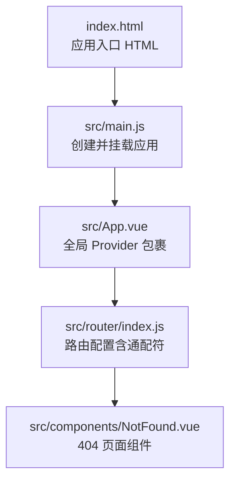
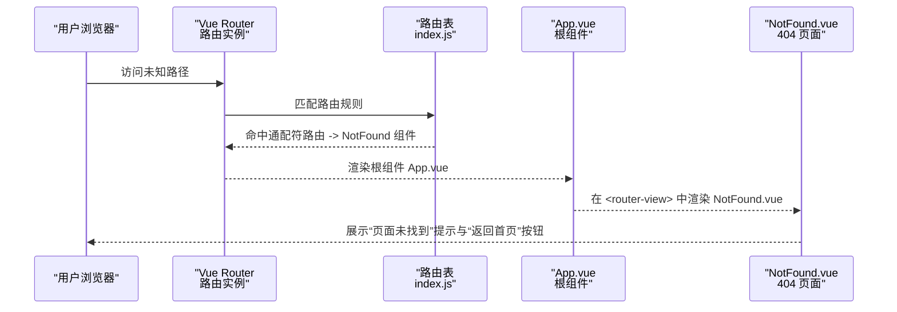
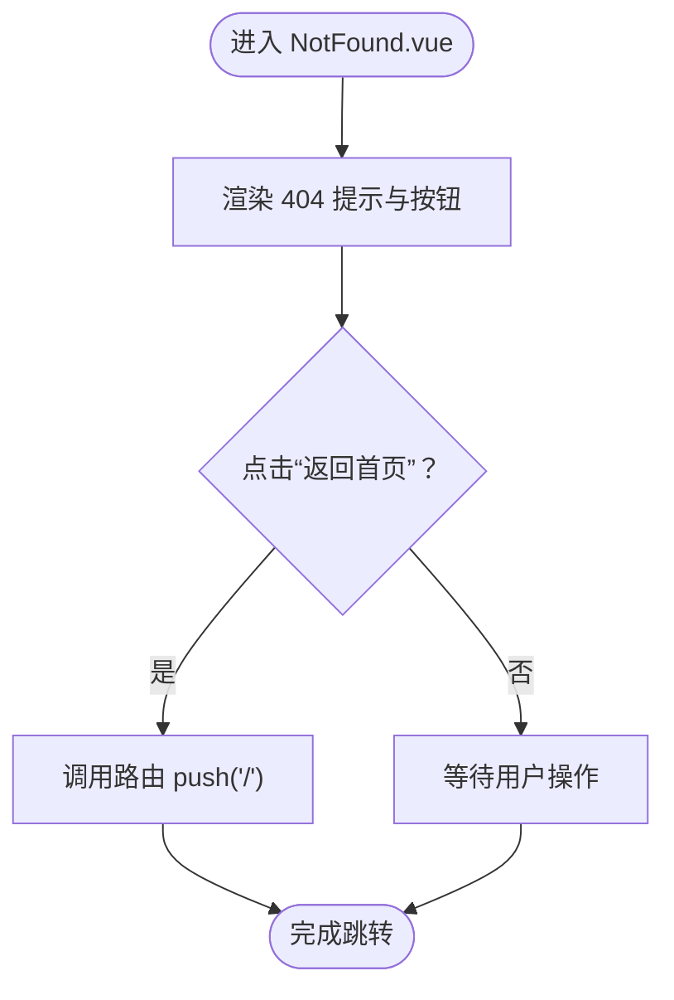
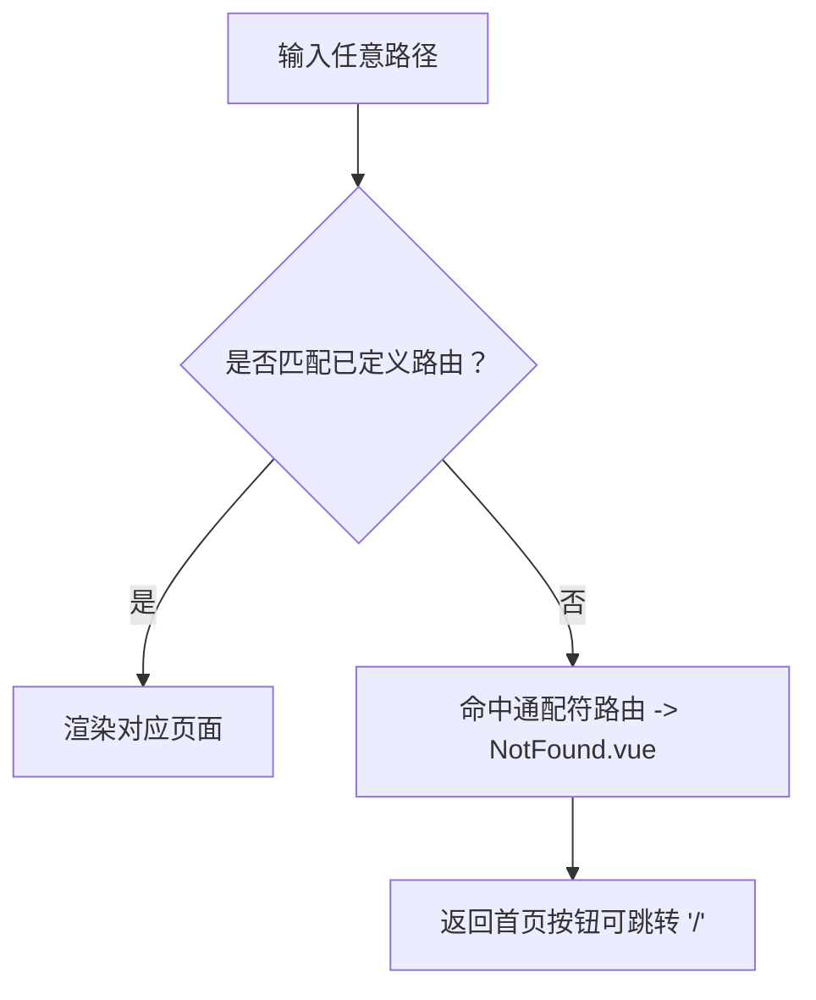
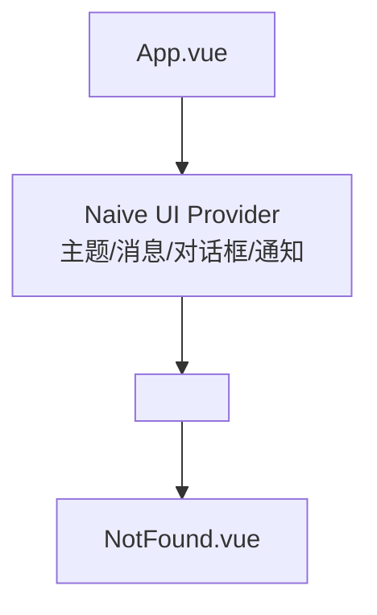
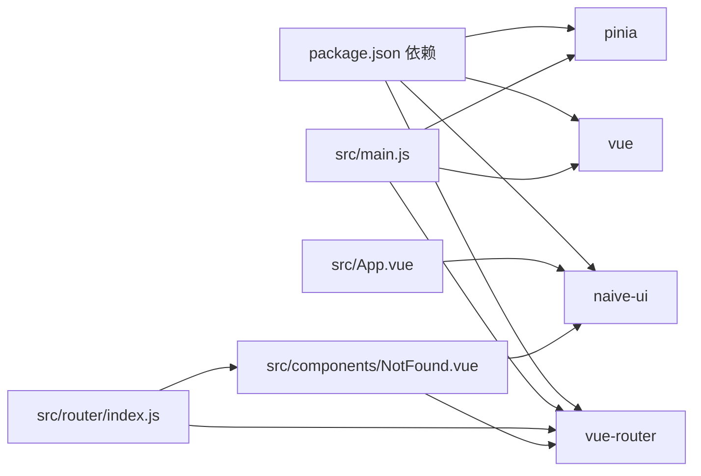

# 404 页面

<cite>
**本文引用的文件**
- [src/components/NotFound.vue](file://src/components/NotFound.vue)
- [src/router/index.js](file://src/router/index.js)
- [src/App.vue](file://src/App.vue)
- [src/main.js](file://src/main.js)
- [index.html](file://index.html)
- [package.json](file://package.json)
</cite>

## 目录
1. [简介](#简介)
2. [项目结构](#项目结构)
3. [核心组件](#核心组件)
4. [架构总览](#架构总览)
5. [详细组件分析](#详细组件分析)
6. [依赖分析](#依赖分析)
7. [性能考虑](#性能考虑)
8. [故障排查指南](#故障排查指南)
9. [结论](#结论)

## 简介
本节介绍“404 页面”的整体目标与实现方式。在该应用中，当用户访问不存在的路由时，会自动跳转至一个专门的“页面未找到”组件，并提供返回首页的操作入口。该页面采用简洁直观的提示与按钮交互，确保用户能快速回到正确的功能路径。

## 项目结构
围绕 404 页面的关键文件与职责如下：
- 路由配置：定义通配符路由以捕获所有未匹配路径，并指向“页面未找到”组件。
- 应用根组件：承载全局主题、消息与对话框等 Provider，保证 404 页面也能使用统一的 UI 主题与交互体验。
- 根入口：初始化 Vue 应用、挂载 Pinia 与路由，确保路由守卫与全局 UI Provider 生效。
- 页面组件：提供“页面未找到”的展示与返回首页的交互逻辑。

```mermaid
graph TB
A["index.html<br/>应用入口 HTML"] --> B["src/main.js<br/>创建并挂载应用"]
B --> C["src/App.vue<br/>全局 Provider 包裹"]
C --> D["src/router/index.js<br/>路由配置含通配符"]
D --> E["src/components/NotFound.vue<br/>404 页面组件"]
```

图表来源
- [index.html](file://index.html#L1-L14)
- [src/main.js](file://src/main.js#L1-L12)
- [src/App.vue](file://src/App.vue#L1-L90)
- [src/router/index.js](file://src/router/index.js#L1-L33)
- [src/components/NotFound.vue](file://src/components/NotFound.vue#L1-L36)

章节来源
- [src/router/index.js](file://src/router/index.js#L1-L33)
- [src/App.vue](file://src/App.vue#L1-L90)
- [src/main.js](file://src/main.js#L1-L12)
- [index.html](file://index.html#L1-L14)

## 核心组件
- 404 页面组件：负责渲染“页面未找到”的提示信息与返回首页按钮；点击后通过路由跳转回到首页。
- 路由配置：使用通配符路由捕获所有未匹配路径，并将这些路径映射到 404 组件。
- 应用根组件：为整个应用提供统一的主题、消息与对话框等 UI 能力，使 404 页面具备一致的视觉与交互风格。

章节来源
- [src/components/NotFound.vue](file://src/components/NotFound.vue#L1-L36)
- [src/router/index.js](file://src/router/index.js#L1-L33)
- [src/App.vue](file://src/App.vue#L1-L90)

## 架构总览
下图展示了从用户访问未知路径到最终呈现 404 页面的整体流程，以及各模块之间的关系。

```mermaid
sequenceDiagram
participant U as "用户浏览器"
participant R as "Vue Router<br/>路由实例"
participant RT as "路由表<br/>index.js"
participant V as "App.vue<br/>根组件"
participant NF as "NotFound.vue<br/>404 页面"
U->>R : 访问未知路径
R->>RT : 匹配路由规则
RT-->>R : 命中通配符路由 -> NotFound 组件
R-->>V : 渲染根组件 App.vue
V-->>NF : 在 <router-view> 中渲染 NotFound.vue
NF-->>U : 展示“页面未找到”提示与“返回首页”按钮
```

图表来源
- [src/router/index.js](file://src/router/index.js#L1-L33)
- [src/App.vue](file://src/App.vue#L1-L90)
- [src/components/NotFound.vue](file://src/components/NotFound.vue#L1-L36)

## 详细组件分析

### 404 页面组件（NotFound.vue）
- 功能要点
  - 使用统一的 UI 组件库展示“页面未找到”的状态与描述。
  - 提供“返回首页”按钮，点击后通过路由跳转回到首页。
  - 通过样式设置容器高度与居中布局，确保页面在不同屏幕尺寸下保持良好的视觉效果。
- 关键行为
  - 事件绑定：按钮点击触发路由跳转。
  - 路由依赖：使用路由实例进行页面跳转。
- 可能的优化点
  - 可增加“刷新页面”或“查看历史记录”等辅助操作，提升用户体验。
  - 可根据环境变量或配置动态调整提示文案或返回路径。

```mermaid
flowchart TD
Start(["进入 NotFound.vue"]) --> Render["渲染 404 提示与按钮"]
Render --> Click{"点击“返回首页”？"}
Click --> |是| GoHome["调用路由 push('/')"]
Click --> |否| Wait["等待用户操作"]
GoHome --> End(["完成跳转"])
Wait --> End
```

图表来源
- [src/components/NotFound.vue](file://src/components/NotFound.vue#L1-L36)

章节来源
- [src/components/NotFound.vue](file://src/components/NotFound.vue#L1-L36)

### 路由配置（router/index.js）
- 功能要点
  - 定义首页与发票重命名页面的路由。
  - 使用通配符路由捕获所有未匹配路径，并将其映射到 404 页面组件。
  - 设置每个路由的元信息（如标题），便于后续 SEO 或页面标题管理。
- 关键行为
  - 通配符路由规则确保任何未显式声明的路径都会落到 404 页面。
  - 路由历史模式使用 Web History，结合基础路径配置支持部署场景。
- 可能的优化点
  - 可在通配符路由中加入更细粒度的错误日志或统计上报。
  - 可为 404 页面添加面包屑或上下文信息，帮助用户理解当前所处位置。

```mermaid
flowchart TD
A["输入任意路径"] --> B{"是否匹配已定义路由？"}
B --> |是| C["渲染对应页面"]
B --> |否| D["命中通配符路由 -> NotFound.vue"]
D --> E["返回首页按钮可跳转 '/'"]
```

图表来源
- [src/router/index.js](file://src/router/index.js#L1-L33)

章节来源
- [src/router/index.js](file://src/router/index.js#L1-L33)

### 应用根组件（App.vue）
- 功能要点
  - 通过全局 Provider 包裹应用，提供统一的主题、消息与通知能力。
  - 将 404 页面置于统一的主题与交互体系之下，确保一致性。
- 关键行为
  - 主题持久化：读取本地存储并响应主题切换。
  - 全局 UI 覆盖：计算并注入主题覆盖项，影响所有子组件。
- 对 404 页面的影响
  - 404 页面继承自根组件的 Provider，因此能直接使用统一的 UI 主题与交互风格。

```mermaid
graph TB
Root["App.vue"] --> Prov["Naive UI Provider<br/>主题/消息/对话框/通知"]
Prov --> View["<router-view>"]
View --> NF["NotFound.vue"]
```

图表来源
- [src/App.vue](file://src/App.vue#L1-L90)
- [src/components/NotFound.vue](file://src/components/NotFound.vue#L1-L36)

章节来源
- [src/App.vue](file://src/App.vue#L1-L90)

### 根入口（main.js）
- 功能要点
  - 创建并挂载 Vue 应用，注册 Pinia 与路由插件。
  - 保证路由守卫与全局 Provider 在应用启动时生效。
- 对 404 页面的影响
  - 应用启动后，路由系统开始工作，通配符路由才能正确捕获未知路径并渲染 404 页面。

章节来源
- [src/main.js](file://src/main.js#L1-L12)

## 依赖分析
- 外部依赖
  - Vue 3 与 Vue Router：提供组件框架与路由能力。
  - Naive UI：提供统一的 UI 组件库，用于 404 页面的提示与按钮。
  - Pinia：状态管理（与 404 页面无直接耦合，但影响全局 Provider）。
- 内部依赖
  - NotFound.vue 依赖路由实例进行页面跳转。
  - App.vue 作为根组件，为 404 页面提供统一的主题与交互能力。
  - router/index.js 通过通配符路由将未知路径映射到 NotFound.vue。

```mermaid
graph LR
Pkg["package.json 依赖"] --> Vue["vue"]
Pkg --> Router["vue-router"]
Pkg --> UI["naive-ui"]
Pkg --> Store["pinia"]
M["src/main.js"] --> Vue
M --> Router
M --> Store
R["src/router/index.js"] --> Router
R --> NF["src/components/NotFound.vue"]
A["src/App.vue"] --> UI
NF --> UI
NF --> Router
```

图表来源
- [package.json](file://package.json#L1-L27)
- [src/main.js](file://src/main.js#L1-L12)
- [src/router/index.js](file://src/router/index.js#L1-L33)
- [src/components/NotFound.vue](file://src/components/NotFound.vue#L1-L36)
- [src/App.vue](file://src/App.vue#L1-L90)

章节来源
- [package.json](file://package.json#L1-L27)
- [src/main.js](file://src/main.js#L1-L12)
- [src/router/index.js](file://src/router/index.js#L1-L33)
- [src/components/NotFound.vue](file://src/components/NotFound.vue#L1-L36)
- [src/App.vue](file://src/App.vue#L1-L90)

## 性能考虑
- 路由匹配开销：通配符路由仅在未匹配到其他路由时触发，通常不会引入额外的性能负担。
- 组件体积：404 页面组件结构简单，依赖较少，加载与渲染成本低。
- UI Provider：根组件的 Provider 在应用启动时一次性初始化，对 404 页面无额外开销。
- 建议
  - 如需扩展 404 页面功能（例如统计或日志），建议在路由层统一处理，避免在组件内重复实现。

## 故障排查指南
- 问题：访问未知路径未显示 404 页面
  - 排查要点
    - 确认路由配置中存在通配符路由并指向 404 组件。
    - 确认应用已正确挂载路由插件。
    - 确认未在更高优先级的路由中意外拦截未知路径。
  - 相关文件
    - [src/router/index.js](file://src/router/index.js#L1-L33)
    - [src/main.js](file://src/main.js#L1-L12)
- 问题：点击“返回首页”无效
  - 排查要点
    - 确认 404 组件中按钮事件绑定了正确的路由跳转逻辑。
    - 确认路由实例可用且未被外部覆盖。
  - 相关文件
    - [src/components/NotFound.vue](file://src/components/NotFound.vue#L1-L36)
- 问题：404 页面主题或交互不一致
  - 排查要点
    - 确认根组件 Provider 正常包裹应用。
    - 确认未在 404 组件内覆盖全局主题或 UI 行为。
  - 相关文件
    - [src/App.vue](file://src/App.vue#L1-L90)

章节来源
- [src/router/index.js](file://src/router/index.js#L1-L33)
- [src/main.js](file://src/main.js#L1-L12)
- [src/components/NotFound.vue](file://src/components/NotFound.vue#L1-L36)
- [src/App.vue](file://src/App.vue#L1-L90)

## 结论
该应用的 404 页面通过简洁的设计与明确的返回路径，为用户提供清晰的引导。其核心实现依赖于路由的通配符匹配与根组件的 Provider 支持，确保在任何未知路径下都能稳定呈现一致的 UI 体验。若未来需要增强用户体验，可在路由层增加统计与日志，在 404 页面增加更多辅助操作，同时保持现有实现的简洁性与可维护性。