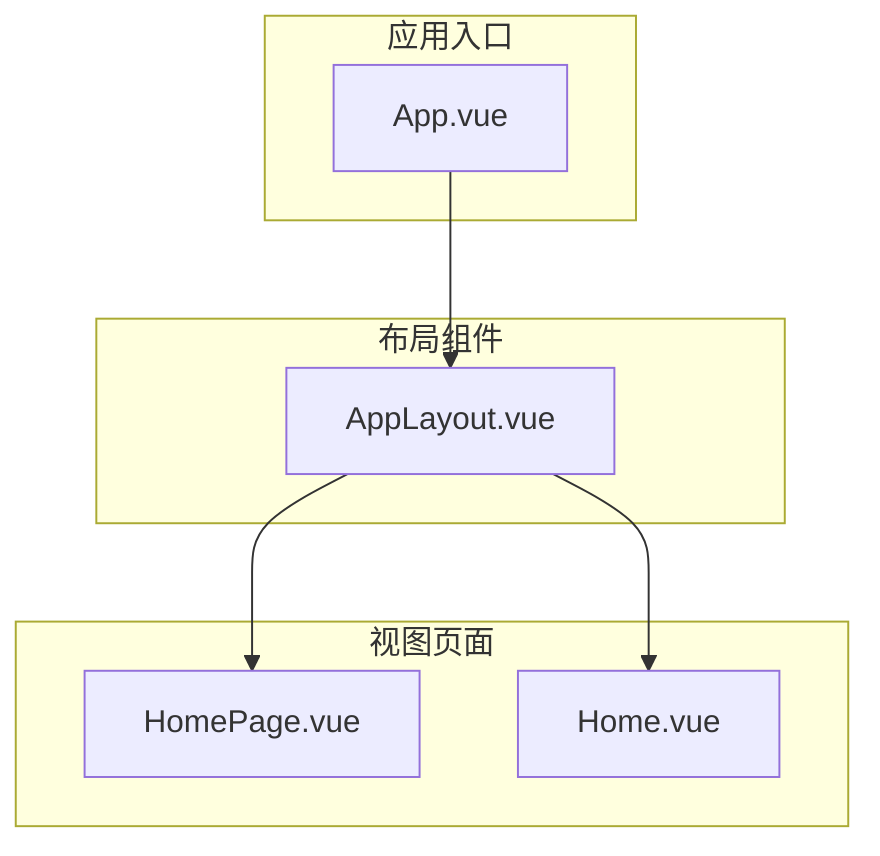
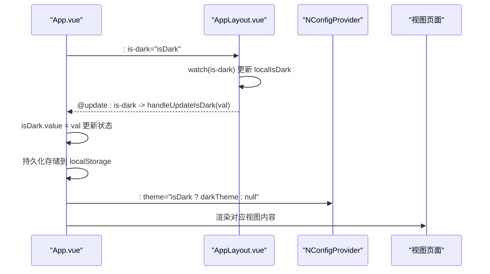
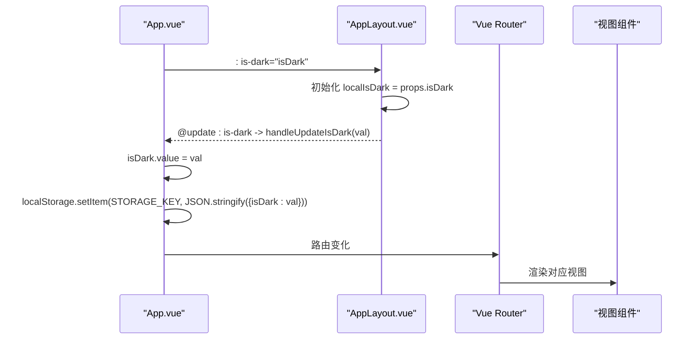
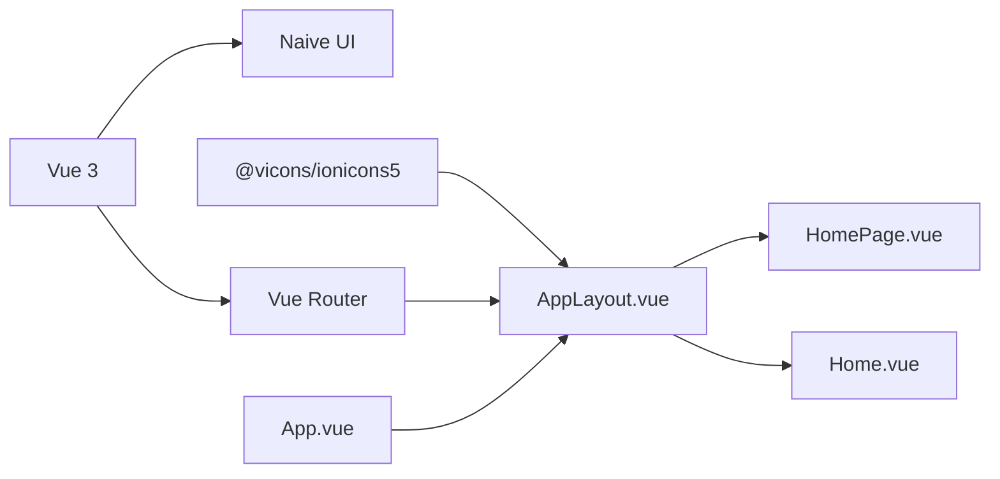

# AppLayout 布局组件

<cite>
**本文引用的文件**
- [AppLayout.vue](file://src/components/AppLayout.vue)
- [App.vue](file://src/App.vue)
- [router/index.js](file://src/router/index.js)
- [main.js](file://src/main.js)
</cite>

## 更新摘要
**已更新内容**
- 将 AppLayout 组件的导航状态管理从基于 prop 的 activeKey 模式更新为基于 Vue Router 的路由同步模式
- 新增暗色模式切换功能，添加暗色模式按钮并重构头部布局为 header-left 和 header-right 两个部分
- 更新了 App.vue 中的主题管理逻辑，实现暗色模式状态的持久化存储
- 重构了 AppLayout 的 props 和事件系统，移除了 update:activeKey 事件，新增了 is-dark prop 和 update:is-dark 事件

## 目录
1. [简介](#简介)
2. [项目结构](#项目结构)
3. [核心组件](#核心组件)
4. [架构总览](#架构总览)
5. [详细组件分析](#详细组件分析)
6. [依赖关系分析](#依赖关系分析)
7. [性能考量](#性能考量)
8. [故障排查指南](#故障排查指南)
9. [结论](#结论)
10. [附录](#附录)

## 简介
AppLayout 是本项目的根布局容器，负责整体页面的四段式结构：侧边栏、头部、内容区与页脚。它基于 Naive UI 的布局组件体系（NLayout、NLayoutSider、NLayoutHeader、NLayoutContent、NLayoutFooter）构建，提供响应式布局与可折叠侧边栏交互；同时内置导航菜单与面包屑联动，通过 Vue Router 实现路由与菜单状态的自动同步。组件新增了暗色模式切换功能，重构了头部布局为 header-left 和 header-right 两个部分，并通过 scoped 样式确保布局适配与视觉一致性。

## 项目结构
本项目采用按功能模块组织的目录结构，AppLayout 位于组件层，App.vue 作为根组件进行全局主题与 Provider 包裹，视图层由 HomePage.vue 与 Home.vue 提供具体页面内容。

**图表来源**
- [App.vue](file://src/App.vue#L1-L14)
- [AppLayout.vue](file://src/components/AppLayout.vue#L1-L73)
- [HomePage.vue](file://src/views/HomePage.vue#L1-L100)
- [Home.vue](file://src/views/Home.vue#L1-L64)

**章节来源**
- [App.vue](file://src/App.vue#L1-L14)
- [AppLayout.vue](file://src/components/AppLayout.vue#L1-L73)

## 核心组件
- 组件角色与职责
  - 根布局容器：统一管理侧边栏、头部、内容区与页脚的布局与交互。
  - 导航系统：提供菜单树与面包屑联动，通过 Vue Router 实现路由与菜单状态的自动同步。
  - 主题管理：新增暗色模式切换功能，支持用户自定义界面主题。
  - 交互行为：支持侧边栏折叠/展开、头部 GitHub 图标跳转、页脚版权信息。

- 关键属性与事件
  - 属性：is-dark（布尔值，默认值为 false）
  - 事件：update:is-dark（当用户点击暗色模式按钮时触发）

- 内部状态与计算
  - collapsed：侧边栏折叠状态。
  - localIsDark：内部管理的暗色模式状态，与父组件传递的 is-dark prop 同步。
  - activeKey：基于当前路由计算的激活菜单项键值。
  - currentTitle：根据当前激活键计算标题文本。
  - breadcrumbs：根据当前激活键动态生成面包屑路径数组。

**章节来源**
- [AppLayout.vue](file://src/components/AppLayout.vue#L132-L137)
- [AppLayout.vue](file://src/components/AppLayout.vue#L144-L145)
- [AppLayout.vue](file://src/components/AppLayout.vue#L148-L153)

## 架构总览
下图展示了从 App.vue 到 AppLayout.vue，再到各视图页面的数据流与事件流，重点突出了暗色模式的状态管理。

**图表来源**
- [App.vue](file://src/App.vue#L3-L12)
- [AppLayout.vue](file://src/components/AppLayout.vue#L132-L157)
- [App.vue](file://src/App.vue#L38-L70)

## 详细组件分析

### 结构与布局
- 四段式布局
  - 侧边栏：包含品牌标识与菜单树，支持折叠/展开与图标渲染。
  - 头部：重构为 header-left 和 header-right 两个部分，左侧展示面包屑与当前页面标题，右侧放置暗色模式切换按钮和 GitHub 图标。
  - 内容区：插槽承载具体页面内容。
  - 页脚：版权信息与作者链接。

- 响应式与适配
  - 容器高度设置为 100vh，配合 flex 与 min-height 防止溢出。
  - 内容区使用 flex: 1 与 min-height: 0，保证滚动与自适应。
  - 页脚固定高度与分隔线，避免被压缩。

**章节来源**
- [AppLayout.vue](file://src/components/AppLayout.vue#L1-L73)
- [AppLayout.vue](file://src/components/AppLayout.vue#L262-L315)

### 导航与菜单
- 菜单数据结构（menuOptions）
  - 顶层项：首页（key: home）、发票工具（key: invoice-tools）。
  - 子项：发票重命名（key: invoice-rename）。
  - 图标：通过 renderIcon 包装 Naive UI 的 NIcon 组件。

- 基于路由的激活项管理
  - activeKey：计算属性，根据当前路由路径（route.path）动态计算激活的菜单项键值。
  - 移除了基于 prop 的 activeKey 管理，不再需要父组件传递 activeKey 和监听 update:activeKey 事件。

- 当前激活项与标题
  - currentTitle：根据当前激活键在菜单树中查找匹配项标签。
  - 若未找到则默认返回“首页”。

- 面包屑联动
  - breadcrumbs：当激活键为 home 时不显示面包屑；否则递归查找路径，首项固定为“首页”，其余层级按规则生成。
  - 面包屑项 click 事件仅对可点击项生效，且仅在目标键不同于当前激活键时触发更新。

- 事件通信
  - handleMenuSelect：当点击菜单项时，使用 useRouter 进行路由跳转。
  - handleBreadcrumbClick：当点击可点击的面包屑项时，同样使用 router.push 进行路由跳转。

**章节来源**
- [AppLayout.vue](file://src/components/AppLayout.vue#L108-L110)
- [AppLayout.vue](file://src/components/AppLayout.vue#L141-L153)
- [AppLayout.vue](file://src/components/AppLayout.vue#L159-L176)
- [AppLayout.vue](file://src/components/AppLayout.vue#L178-L192)
- [AppLayout.vue](file://src/components/AppLayout.vue#L194-L229)
- [AppLayout.vue](file://src/components/AppLayout.vue#L235-L242)
- [AppLayout.vue](file://src/components/AppLayout.vue#L244-L249)

### 交互行为与细节
- 侧边栏折叠
  - collapse-mode 设为 width，collapsed-width 与 width 控制尺寸。
  - @collapse 与 @expand 事件切换 collapsed 状态，影响菜单图标大小与布局。

- 暗色模式切换
  - 新增 header-right 区域，包含暗色模式切换按钮。
  - 使用 MoonOutline 和 SunnyOutline 图标表示暗色/浅色模式状态。
  - 点击按钮切换 localIsDark 状态，并通过 emit 触发 update:is-dark 事件。

- GitHub 图标跳转
  - 点击图标在新窗口打开仓库地址。

- 页脚版权信息
  - 版权年份与作者链接，使用 Naive UI 文本组件渲染。

**章节来源**
- [AppLayout.vue](file://src/components/AppLayout.vue#L9-L13)
- [AppLayout.vue](file://src/components/AppLayout.vue#L50-L68)
- [AppLayout.vue](file://src/components/AppLayout.vue#L71-L84)
- [AppLayout.vue](file://src/components/AppLayout.vue#L97-L102)

### 在 App.vue 中的集成示例
- 全局 Provider 包裹：NConfigProvider、NMessageProvider、NDialogProvider、NNotificationProvider。
- 布局容器：AppLayout 接收 :is-dark prop 并监听 update:is-dark 事件。
- 主题管理：App.vue 维护 isDark 状态，从 localStorage 读取初始值，并在状态变化时持久化存储。
- 使用 router-view 插槽渲染当前路由对应的视图组件。

**图表来源**
- [App.vue](file://src/App.vue#L9-L13)
- [AppLayout.vue](file://src/components/AppLayout.vue#L132-L157)
- [App.vue](file://src/App.vue#L28-L70)

**章节来源**
- [App.vue](file://src/App.vue#L9-L13)
- [AppLayout.vue](file://src/components/AppLayout.vue#L132-L157)
- [App.vue](file://src/App.vue#L28-L70)

### 样式设计与响应式
- 布局适配
  - 容器高度 100vh，flex 方向列，主布局 flex: 1 且 min-height: 0。
  - 内容区 flex: 1、min-height: 0、overflow-y: auto，确保滚动与自适应。
  - 页脚 flex-shrink: 0 与分隔线，防止被压缩。

- 悬停效果
  - GitHub 图标与作者链接 hover 效果，颜色过渡平滑。

- 响应式断点
  - 视图层（如 HomePage.vue、Home.vue）包含媒体查询，针对小屏设备调整网格与间距。
  - App.vue 顶层 body 设置最小高度与字体族，保证基础排版一致。

**章节来源**
- [AppLayout.vue](file://src/components/AppLayout.vue#L262-L315)
- [HomePage.vue](file://src/views/HomePage.vue#L94-L99)
- [Home.vue](file://src/views/Home.vue#L230-L235)
- [App.vue](file://src/App.vue#L74-L89)

## 依赖关系分析
- 外部依赖
  - Vue 3 与 Naive UI：提供布局、菜单、面包屑、图标等 UI 组件。
  - Vue Router：提供路由管理与导航功能。
  - @vicons/ionicons5：提供图标资源（首页、文档、GitHub、月亮、太阳等）。
  - 其他工具库：PDF 解析、ZIP 导出、文件保存、状态管理等（与布局无直接耦合）。

- 内部依赖
  - App.vue 依赖 AppLayout.vue；AppLayout.vue 依赖 Vue Router 与 Naive UI 组件。
  - main.js 注册 Vue Router 插件，确保路由功能可用。

**图表来源**
- [package.json](file://package.json#L11-L20)
- [AppLayout.vue](file://src/components/AppLayout.vue#L108-L130)
- [App.vue](file://src/App.vue#L23-L24)
- [main.js](file://src/main.js#L4-L10)

**章节来源**
- [package.json](file://package.json#L11-L20)
- [AppLayout.vue](file://src/components/AppLayout.vue#L108-L130)
- [App.vue](file://src/App.vue#L23-L24)
- [main.js](file://src/main.js#L4-L10)

## 性能考量
- 计算属性优化
  - activeKey、currentTitle 与 breadcrumbs 使用计算属性，基于 Vue Router 的响应式系统自动更新。
  - 避免了不必要的重复计算，提升性能。
- 事件去抖
  - handleMenuSelect 与 handleBreadcrumbClick 已在点击时通过路由跳转实现导航，避免了不必要的状态更新。
- 滚动性能
  - 内容区启用垂直滚动，避免布局重排；侧边栏折叠时仅改变宽度，减少重绘。

[本节为通用指导，无需特定文件引用]

## 故障排查指南
- 无法切换暗色模式
  - 确认父组件已正确监听 update:is-dark 事件并更新 is-dark prop。
  - 检查 handleDarkModeClick 是否被调用，且 emit 事件是否正确触发。
  - 确认 localStorage 是否正确存储了主题状态。

- 菜单激活状态不正确
  - 确认 Vue Router 的路由配置与菜单项的 key 值匹配。
  - 检查 activeKey 计算属性的逻辑是否正确处理了所有路由路径。

- 侧边栏无法折叠
  - 检查 @collapse 与 @expand 事件是否触发 collapsed 状态变化；确认 collapse-mode 与 collapsed-width/width 设置合理。

- GitHub 图标点击无效
  - 确认 handleGithubClick 是否被调用，浏览器是否允许弹窗；检查 window.open 的 URL 是否正确。

**章节来源**
- [AppLayout.vue](file://src/components/AppLayout.vue#L251-L258)
- [AppLayout.vue](file://src/components/AppLayout.vue#L148-L153)
- [AppLayout.vue](file://src/components/AppLayout.vue#L9-L13)

## 结论
AppLayout 以清晰的四段式布局与 Naive UI 组件为核心，实现了稳定的导航与内容承载能力。通过集成 Vue Router，实现了路由与菜单状态的自动同步，简化了组件间的通信。新增的暗色模式功能提升了用户体验，重构的头部布局使界面更加现代化。配合响应式样式与交互细节（如侧边栏折叠、GitHub 跳转、页脚版权），整体布局具备良好的可用性、扩展性与用户友好性。

[本节为总结，无需特定文件引用]

## 附录

### Props 与事件定义
- Props
  - is-dark: 布尔值，表示当前是否为暗色模式，默认值为 false。
- Emits
  - update:is-dark: 当用户点击暗色模式切换按钮时触发，参数为新的布尔值。

**章节来源**
- [AppLayout.vue](file://src/components/AppLayout.vue#L132-L137)
- [AppLayout.vue](file://src/components/AppLayout.vue#L139-L140)

### 菜单选项数据结构
- 顶层项
  - 首页：label 为“首页”，key 为 home。
  - 发票工具：label 为“发票工具”，key 为 invoice-tools，包含子项。
- 子项
  - 发票重命名：label 为“📝 发票重命名”，key 为 invoice-rename。

**章节来源**
- [AppLayout.vue](file://src/components/AppLayout.vue#L159-L176)

### 面包屑联动逻辑
- 当 activeKey 为 home 时不显示面包屑。
- 否则递归查找路径，首项固定为“🏠 首页”，其余层级按规则生成，且仅首层可点击。

**章节来源**
- [AppLayout.vue](file://src/components/AppLayout.vue#L194-L229)

### 在 App.vue 中的使用要点
- 使用 NConfigProvider/NMessageProvider/NDialogProvider/NNotificationProvider 包裹布局。
- 通过 :is-dark 与 @update:is-dark 完成暗色模式状态同步。
- 使用 router-view 插槽渲染当前路由对应的视图组件。
- 实现主题状态的持久化存储与读取。

**章节来源**
- [App.vue](file://src/App.vue#L9-L13)
- [App.vue](file://src/App.vue#L28-L70)