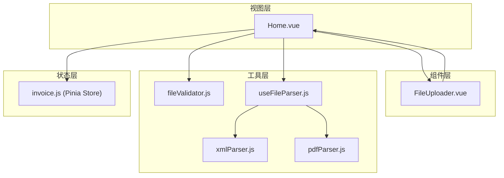
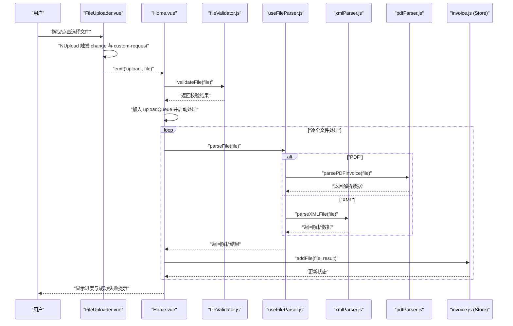
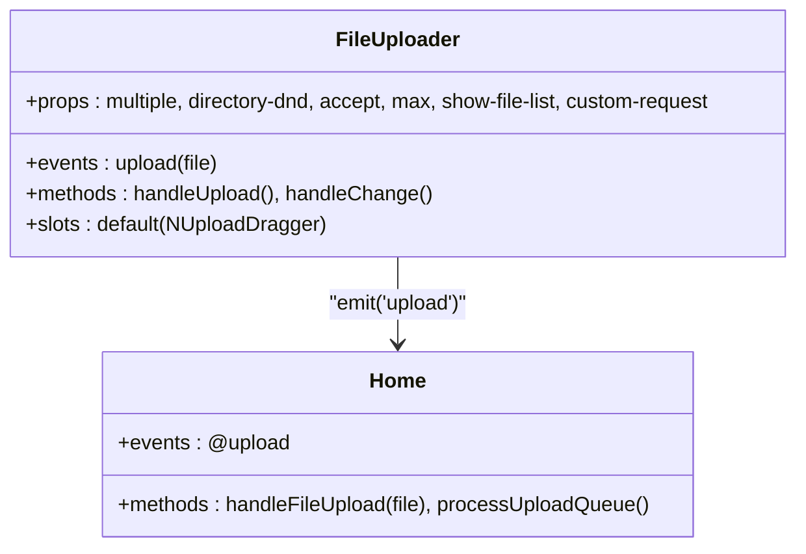
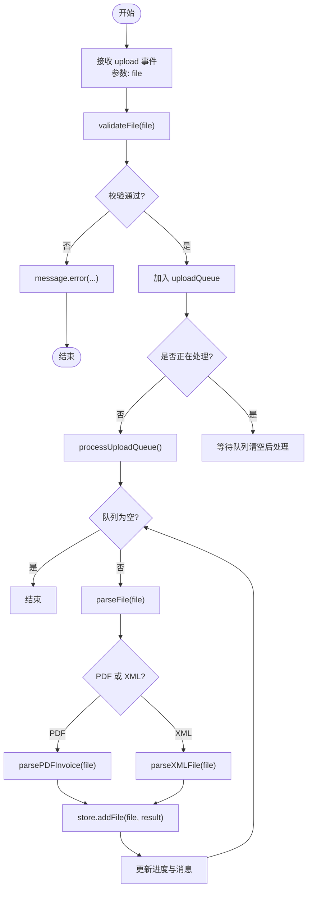
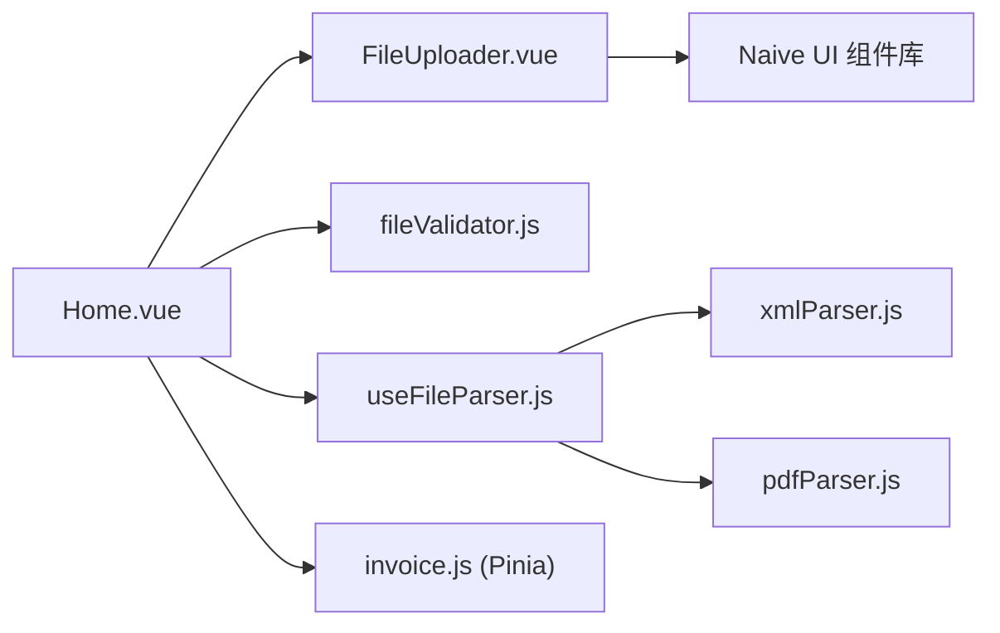

# FileUploader 文件上传组件

<cite>
**本文引用的文件**
- [FileUploader.vue](file://src/components/FileUploader.vue)
- [Home.vue](file://src/views/Home.vue)
- [fileValidator.js](file://src/utils/fileValidator.js)
- [useFileParser.js](file://src/composables/useFileParser.js)
- [xmlParser.js](file://src/utils/xmlParser.js)
- [pdfParser.js](file://src/utils/pdfParser.js)
- [invoice.js](file://src/stores/invoice.js)
</cite>

## 目录
1. [简介](#简介)
2. [项目结构](#项目结构)
3. [核心组件](#核心组件)
4. [架构总览](#架构总览)
5. [详细组件分析](#详细组件分析)
6. [依赖关系分析](#依赖关系分析)
7. [性能考量](#性能考量)
8. [故障排查指南](#故障排查指南)
9. [结论](#结论)
10. [附录](#附录)

## 简介
本文件针对 FileUploader.vue 组件进行系统化技术文档编写，重点说明其基于 Naive UI 的 NUpload/NUploadDragger 实现的拖拽上传能力，支持 PDF 与 XML 格式文件的多文件、目录拖拽上传；通过 accept 属性限定文件类型、max 属性限制最多 100 个文件；通过 custom-request 自定义上传行为，实际不发送网络请求，而是通过 emit('upload') 将 File 对象传递给父组件进行本地解析与入库。文档还涵盖用户界面提示信息（支持格式、大小限制）、handleChange 事件监听机制、在 Home.vue 中监听 upload 事件并触发解析流程的集成示例，以及样式定制建议（通过 deep 选择器调整拖拽区域内边距）。

## 项目结构
FileUploader.vue 位于组件层，Home.vue 作为视图层负责接收上传事件并驱动解析流程；二者通过事件通信解耦，配合工具层的文件校验与解析组合式函数共同完成端到端的发票文件处理链路。

图表来源
- [FileUploader.vue](file://src/components/FileUploader.vue#L1-L50)
- [Home.vue](file://src/views/Home.vue#L1-L236)
- [fileValidator.js](file://src/utils/fileValidator.js#L1-L90)
- [useFileParser.js](file://src/composables/useFileParser.js#L1-L102)
- [xmlParser.js](file://src/utils/xmlParser.js#L1-L118)
- [pdfParser.js](file://src/utils/pdfParser.js#L1-L227)
- [invoice.js](file://src/stores/invoice.js#L1-L204)

章节来源
- [FileUploader.vue](file://src/components/FileUploader.vue#L1-L50)
- [Home.vue](file://src/views/Home.vue#L1-L236)

## 核心组件
- FileUploader.vue
  - 使用 NUpload/NUploadDragger 构建拖拽上传区，支持多文件与目录拖拽。
  - 通过 accept 限定可接受的文件类型为 PDF 与 XML。
  - 通过 max 限制最多 100 个文件。
  - 通过 custom-request 自定义上传行为，不发起网络请求，而是 emit('upload', file) 将 File 对象交给父组件。
  - 在模板中提供用户提示信息，明确支持格式与大小限制。
  - 通过 scoped 样式结合 :deep 选择器调整拖拽区域内边距，提升可用性。
  - handleChange 事件用于监听文件列表变化，便于扩展后续逻辑。

- Home.vue
  - 注册 FileUploader，并监听 @upload 事件。
  - 在 handleFileUpload 中调用 validateFile 进行格式与大小校验，错误则提示；通过 uploadQueue 队列化处理，避免并发冲突。
  - 调用 useFileParser 的 parseFile 对单个文件进行解析，依据文件后缀区分 PDF/XML，分别调用对应解析器。
  - 将解析结果通过 Pinia Store 的 addFile 写入状态，驱动 UI 表格展示与操作栏更新。
  - 提供进度对话框与消息提示，增强用户反馈。

章节来源
- [FileUploader.vue](file://src/components/FileUploader.vue#L1-L50)
- [Home.vue](file://src/views/Home.vue#L1-L236)

## 架构总览
FileUploader 与 Home 之间采用事件驱动的松耦合设计：上传侧只负责触发事件，消费侧负责验证、解析与状态更新。解析侧进一步拆分为通用解析组合式函数与具体格式解析器，形成清晰的职责边界。

图表来源
- [FileUploader.vue](file://src/components/FileUploader.vue#L1-L50)
- [Home.vue](file://src/views/Home.vue#L1-L236)
- [fileValidator.js](file://src/utils/fileValidator.js#L1-L90)
- [useFileParser.js](file://src/composables/useFileParser.js#L1-L102)
- [xmlParser.js](file://src/utils/xmlParser.js#L1-L118)
- [pdfParser.js](file://src/utils/pdfParser.js#L1-L227)
- [invoice.js](file://src/stores/invoice.js#L1-L204)

## 详细组件分析

### FileUploader.vue 组件分析
- 组件职责
  - 提供拖拽上传入口，约束文件类型与数量，屏蔽网络传输细节，将原始 File 对象交由父组件处理。
- 关键属性与行为
  - multiple 与 directory-dnd：启用多文件与目录拖拽。
  - accept="'.pdf,.xml'"：限定文件类型为 PDF 与 XML。
  - max="100"：限制最多 100 个文件。
  - show-file-list="false"：隐藏默认文件列表，避免重复展示。
  - custom-request="handleUpload"：自定义上传行为，内部仅触发事件并调用 onFinish。
  - @change="handleChange"：监听文件列表变化，便于扩展后续逻辑。
- 用户界面提示
  - 模板中包含“支持 PDF 和 XML 格式的发票文件，单个文件不超过 10MB，最多 100 个文件”的提示文本。
- 样式定制
  - 通过 :deep(.n-upload-dragger) 调整拖拽区域内边距，提升点击与拖拽体验。

图表来源
- [FileUploader.vue](file://src/components/FileUploader.vue#L1-L50)
- [Home.vue](file://src/views/Home.vue#L1-L236)

章节来源
- [FileUploader.vue](file://src/components/FileUploader.vue#L1-L50)

### 事件监听与处理流程（Home.vue）
- 监听 upload 事件
  - 在模板中通过 @upload="handleFileUpload" 接收来自 FileUploader 的 File 对象。
- 校验与队列化
  - 调用 validateFile 对文件进行格式与大小校验，错误时提示并终止。
  - 将文件加入 uploadQueue，若当前未处于处理中则启动 processUploadQueue。
- 解析与入库
  - 逐个文件调用 parseFile，依据后缀区分 PDF/XML，分别调用对应解析器。
  - 将解析结果通过 store.addFile 写入状态，驱动 UI 更新。
- 进度与提示
  - 通过进度条与消息提示反馈处理进度与结果。

图表来源
- [Home.vue](file://src/views/Home.vue#L1-L236)
- [fileValidator.js](file://src/utils/fileValidator.js#L1-L90)
- [useFileParser.js](file://src/composables/useFileParser.js#L1-L102)
- [xmlParser.js](file://src/utils/xmlParser.js#L1-L118)
- [pdfParser.js](file://src/utils/pdfParser.js#L1-L227)
- [invoice.js](file://src/stores/invoice.js#L1-L204)

章节来源
- [Home.vue](file://src/views/Home.vue#L1-L236)

### 文件解析与验证（useFileParser.js）
- 解析策略
  - 根据文件后缀判断类型，PDF 走 parsePDFInvoice，XML 走 parseXMLFile。
  - 返回统一结构：success、data、errors、type，便于上层统一处理。
- 批量解析
  - parseFiles 支持分批并行处理，每批 10 个，提升吞吐量。
- 错误兜底
  - 捕获异常并返回包含错误信息的结果，保证流程稳定。

章节来源
- [useFileParser.js](file://src/composables/useFileParser.js#L1-L102)

### 文件格式与大小限制（fileValidator.js）
- 支持格式
  - PDF、XML（含 text/xml 与 application/xml）。
- 大小限制
  - 单文件最大 10MB。
- 数量限制
  - 单次最多 100 个文件。
- 校验逻辑
  - validateFileFormat 与 validateFileSize 组合校验，返回 errors 数组。
  - validateFiles 支持批量校验并统计无效数量。

章节来源
- [fileValidator.js](file://src/utils/fileValidator.js#L1-L90)

### 具体格式解析（xmlParser.js / pdfParser.js）
- XML 解析
  - 读取文件为文本，使用 fast-xml-parser 解析为结构化数据。
  - extractInvoiceData 从 XML 中抽取发票关键字段（类型、代码、购买方、销售方、金额、日期），并进行基础校验。
- PDF 解析
  - 使用 pdfjs-dist 读取 PDF 文本内容，遍历页面提取全文。
  - 通过正则匹配发票关键字段，兼容多种格式变体。
  - validatePDFInvoiceData 校验必填字段，确保数据完整性。

章节来源
- [xmlParser.js](file://src/utils/xmlParser.js#L1-L118)
- [pdfParser.js](file://src/utils/pdfParser.js#L1-L227)

### 状态管理（invoice.js）
- 数据模型
  - 存储原始文件、解析结果、新文件名、状态与错误信息。
- 名称生成
  - 成功解析后调用 generateFileName 生成规范化的新文件名。
- 交互能力
  - 支持编辑、删除、全选、导出等操作，配合 Home.vue 的 UI 控件使用。

章节来源
- [invoice.js](file://src/stores/invoice.js#L1-L204)

## 依赖关系分析
- 组件依赖
  - FileUploader 依赖 Naive UI 的 NUpload/NUploadDragger/NIcon/NText/NP。
  - Home 依赖 FileUploader、useFileParser、useFileExport、useInvoiceStore、fileValidator。
- 工具依赖
  - useFileParser 依赖 xmlParser 与 pdfParser。
  - xmlParser 依赖 fast-xml-parser 与 FileReader。
  - pdfParser 依赖 pdfjs-dist 与 FileReader。
- 状态依赖
  - Home 通过 Pinia Store 维护全局状态，FileUploader 不直接依赖 Store。

图表来源
- [FileUploader.vue](file://src/components/FileUploader.vue#L1-L50)
- [Home.vue](file://src/views/Home.vue#L1-L236)
- [fileValidator.js](file://src/utils/fileValidator.js#L1-L90)
- [useFileParser.js](file://src/composables/useFileParser.js#L1-L102)
- [xmlParser.js](file://src/utils/xmlParser.js#L1-L118)
- [pdfParser.js](file://src/utils/pdfParser.js#L1-L227)
- [invoice.js](file://src/stores/invoice.js#L1-L204)

章节来源
- [FileUploader.vue](file://src/components/FileUploader.vue#L1-L50)
- [Home.vue](file://src/views/Home.vue#L1-L236)

## 性能考量
- 解析吞吐
  - useFileParser 的 parseFiles 采用分批并行处理（每批 10 个），在浏览器端提升整体吞吐，同时避免一次性占用过多资源。
- I/O 优化
  - PDF 文本提取按页读取并拼接，避免一次性处理大文档导致卡顿。
- UI 响应
  - 通过进度条与消息提示及时反馈处理状态，改善长任务体验。
- 建议
  - 对于超大文件或大量文件，可考虑增加节流/防抖与后台线程处理，减少主线程阻塞风险。

[本节为通用性能建议，不直接分析具体文件，故无章节来源]

## 故障排查指南
- 常见问题与定位
  - 文件格式不被识别：检查 accept 是否正确，确认文件后缀与 MIME 类型是否符合要求。
  - 文件过大：确认单文件大小不超过 10MB。
  - 文件数量超限：确认一次上传不超过 100 个文件。
  - 解析失败：查看控制台错误信息，确认 PDF 文本提取与 XML 解析是否正常。
- 定位步骤
  - 在 Home.vue 的 handleFileUpload 中打印 file.name 与 file.size，核对校验结果。
  - 在 useFileParser 的 parseFile 中捕获异常，记录错误类型与堆栈。
  - 在 invoice.js 的 addFile 中观察状态变化，确认错误信息是否正确写入。
- 建议
  - 在开发模式下开启更详细的日志输出，便于快速定位问题。

章节来源
- [Home.vue](file://src/views/Home.vue#L1-L236)
- [useFileParser.js](file://src/composables/useFileParser.js#L1-L102)
- [invoice.js](file://src/stores/invoice.js#L1-L204)

## 结论
FileUploader.vue 通过 Naive UI 的 NUpload/NUploadDragger 提供简洁易用的拖拽上传体验，并以事件驱动的方式将文件对象交由 Home.vue 进行本地解析与状态管理。组件本身不承担网络传输职责，而是专注于上传交互与约束条件设置。结合 fileValidator 与 useFileParser 的严格校验与解析策略，系统实现了对 PDF 与 XML 发票文件的可靠处理，配合 Pinia Store 与 UI 控件形成完整的端到端工作流。

[本节为总结性内容，不直接分析具体文件，故无章节来源]

## 附录

### 集成示例要点（Home.vue）
- 在模板中引入 FileUploader，并绑定 @upload="handleFileUpload"。
- 在脚本中实现 handleFileUpload 与 processUploadQueue，调用 validateFile 与 parseFile。
- 通过 store.addFile 写入解析结果，驱动 UI 更新。

章节来源
- [Home.vue](file://src/views/Home.vue#L1-L236)

### 样式定制建议
- 通过 :deep 选择器调整拖拽区域的内边距，提升点击与拖拽区域的可用性。
- 可根据设计规范进一步微调图标、文字与提示信息的排版与颜色。

章节来源
- [FileUploader.vue](file://src/components/FileUploader.vue#L1-L50)