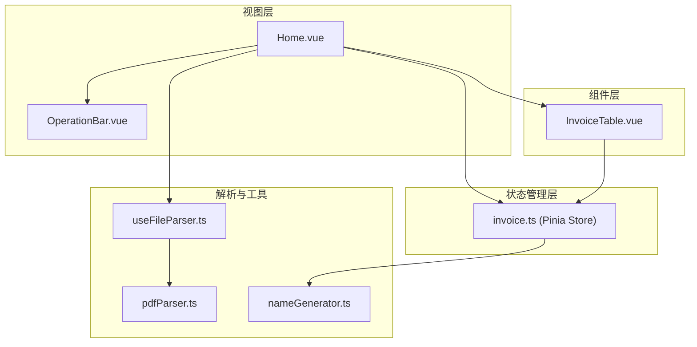
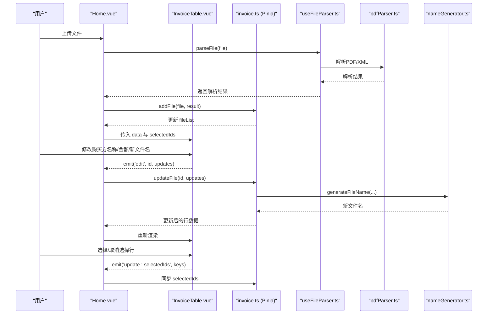
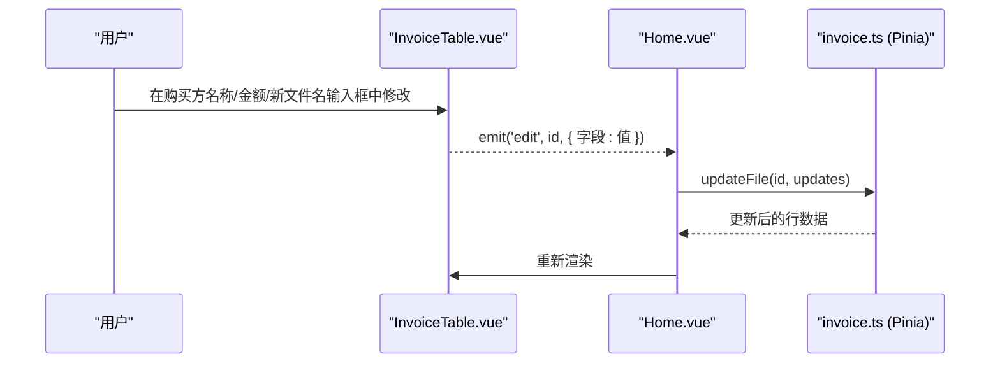
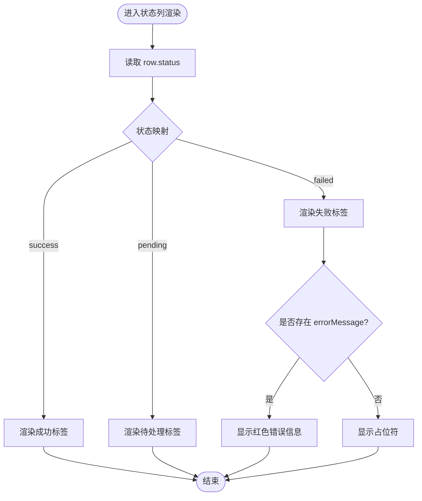
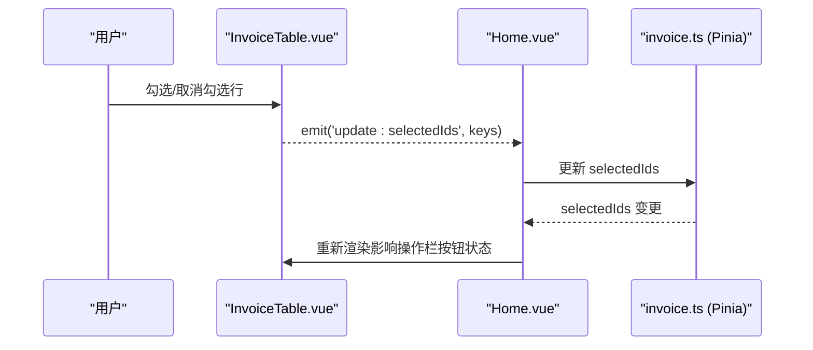
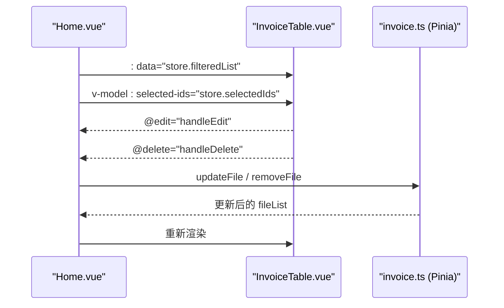
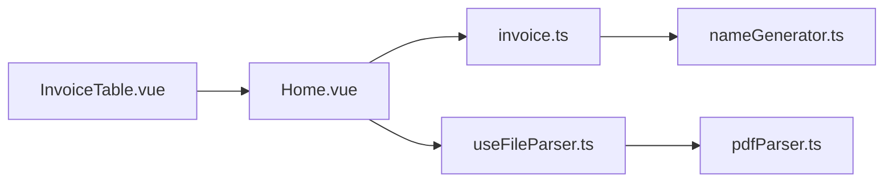

# InvoiceTable 发票表格组件

<cite>
**本文引用的文件**
- [InvoiceTable.vue](file://src/components/InvoiceTable.vue)
- [Home.vue](file://src/views/Home.vue)
- [invoice.ts](file://src/stores/invoice.ts)
- [useFileParser.ts](file://src/composables/useFileParser.ts)
- [nameGenerator.ts](file://src/utils/nameGenerator.ts)
- [OperationBar.vue](file://src/components/OperationBar.vue)
- [pdfParser.ts](file://src/utils/pdfParser.ts)
</cite>

## 更新摘要
**已更新内容**
- 将文档中所有 `.js` 文件引用更新为 `.ts`，反映项目已迁移至 TypeScript 的事实
- 在简介和详细组件分析中添加了对 `InvoiceRow` 接口和 `DataTableColumns` 类型的说明
- 更新了架构总览和依赖关系分析中的文件引用后缀
- 修正了故障排查指南中的文件引用

## 目录
1. [简介](#简介)
2. [项目结构](#项目结构)
3. [核心组件](#核心组件)
4. [架构总览](#架构总览)
5. [详细组件分析](#详细组件分析)
6. [依赖关系分析](#依赖关系分析)
7. [性能考量](#性能考量)
8. [故障排查指南](#故障排查指南)
9. [结论](#结论)
10. [附录](#附录)

## 简介
InvoiceTable 是一个基于 Naive UI 的复杂表格组件，用于展示所有已上传发票的解析结果。它通过 NDataTable 实现以下能力：
- 展示发票的序号、原文件名、发票类型、购买方名称、金额、新文件名、状态、失败原因和操作列
- 支持内联编辑：购买方名称、金额、新文件名三列通过 render 函数嵌入 NInput 组件，用户输入后通过 emit('edit') 将修改字段值与 ID 通知父组件，由父组件驱动 Pinia Store 更新
- 状态列使用 NTag 显示不同颜色标签（成功、失败、待处理），失败原因列在状态为失败且存在错误信息时进行条件渲染
- 行选择通过 selection 列与 update:checked-row-keys 事件实现，与父组件的 selectedIds 同步
- 分页配置支持每页 10、20、50、100 条切换，默认 20 条
- 在 Home.vue 中作为子组件被使用，负责数据绑定与事件监听

该组件已迁移至 TypeScript，定义了 `InvoiceRow` 接口和 `DataTableColumns` 类型，使组件 API 更加清晰和安全。

## 项目结构
InvoiceTable 所在目录与相关模块如下图所示：

图表来源
- [Home.vue](file://src/views/Home.vue#L1-L236)
- [InvoiceTable.vue](file://src/components/InvoiceTable.vue#L1-L174)
- [invoice.ts](file://src/stores/invoice.ts#L1-L256)
- [useFileParser.ts](file://src/composables/useFileParser.ts#L1-L102)
- [pdfParser.ts](file://src/utils/pdfParser.ts#L1-L200)
- [nameGenerator.ts](file://src/utils/nameGenerator.ts#L1-L225)

章节来源
- [Home.vue](file://src/views/Home.vue#L1-L236)
- [InvoiceTable.vue](file://src/components/InvoiceTable.vue#L1-L174)
- [invoice.ts](file://src/stores/invoice.ts#L1-L256)

## 核心组件
- InvoiceTable.vue：负责表格列定义、内联编辑、状态标签、失败原因条件渲染、行选择与分页配置
- Home.vue：父组件，向 InvoiceTable 传递数据与双向绑定 selectedIds，监听 edit/delete 事件并调用 Pinia Store 更新
- invoice.ts：Pinia Store，维护 fileList、selectedIds、过滤与搜索、文件增删改、文件名生成与状态更新
- useFileParser.ts：封装 PDF/XML 文件解析流程，返回解析结果供 Home.vue 使用
- pdfParser.ts：PDF 解析与发票信息提取的具体实现
- nameGenerator.ts：发票文件名生成与冲突处理

章节来源
- [InvoiceTable.vue](file://src/components/InvoiceTable.vue#L1-L174)
- [Home.vue](file://src/views/Home.vue#L1-L236)
- [invoice.ts](file://src/stores/invoice.ts#L1-L256)
- [useFileParser.ts](file://src/composables/useFileParser.ts#L1-L102)
- [pdfParser.ts](file://src/utils/pdfParser.ts#L1-L200)
- [nameGenerator.ts](file://src/utils/nameGenerator.ts#L1-L225)

## 架构总览
下图展示了 InvoiceTable 与父组件 Home、Pinia Store 之间的交互关系：

图表来源
- [Home.vue](file://src/views/Home.vue#L1-L236)
- [InvoiceTable.vue](file://src/components/InvoiceTable.vue#L1-L174)
- [invoice.ts](file://src/stores/invoice.ts#L1-L256)
- [useFileParser.ts](file://src/composables/useFileParser.ts#L1-L102)
- [pdfParser.ts](file://src/utils/pdfParser.ts#L1-L200)
- [nameGenerator.ts](file://src/utils/nameGenerator.ts#L1-L225)

## 详细组件分析

### 列定义与渲染策略
- 序号列：通过 render 函数返回 index + 1，实现从 1 开始的序号显示
- 原文件名与发票类型列：普通文本展示，支持 ellipsis 和 tooltip，避免内容溢出
- 购买方名称、金额、新文件名列：通过 render 函数嵌入 NInput，使用 small 尺寸，绑定 value 并监听 onUpdateValue，触发 emit('edit', id, { 字段: 值 }) 通知父组件
- 状态列：根据 status 字段映射为 NTag，分别对应成功、失败、待处理三种类型；默认回退到待处理
- 失败原因列：当状态为 failed 且存在 errorMessage 时，以红色字体显示错误信息；否则显示占位符
- 操作列：右侧固定，包含删除按钮，点击触发 emit('delete', id)

章节来源
- [InvoiceTable.vue](file://src/components/InvoiceTable.vue#L1-L174)

### 内联编辑流程（购买方名称、金额、新文件名）
- render 函数内部创建 NInput，绑定 row 对应字段的值
- 监听 onUpdateValue 事件，将变更值与 row.id 一起通过 emit('edit', id, updates) 传递给父组件
- 父组件收到 edit 事件后调用 store.updateFile(id, updates)，触发 Pinia Store 更新
- 若更新的是购买方名称或金额，Store 内部会重新生成新文件名并更新状态与错误信息，随后 Home.vue 重新渲染表格

图表来源
- [InvoiceTable.vue](file://src/components/InvoiceTable.vue#L1-L174)
- [Home.vue](file://src/views/Home.vue#L157-L163)
- [invoice.ts](file://src/stores/invoice.ts#L101-L124)

章节来源
- [InvoiceTable.vue](file://src/components/InvoiceTable.vue#L57-L104)
- [Home.vue](file://src/views/Home.vue#L157-L163)
- [invoice.ts](file://src/stores/invoice.ts#L101-L124)

### 状态列与失败原因列
- 状态列使用 NTag 标签，根据 status 值映射为 success/error/warning 类型，并显示中文文案
- 失败原因列在 row.status === 'failed' 且 row.errorMessage 存在时显示错误信息，否则显示占位符
- 该逻辑确保用户能快速识别处理结果与失败原因

图表来源
- [InvoiceTable.vue](file://src/components/InvoiceTable.vue#L105-L132)

章节来源
- [InvoiceTable.vue](file://src/components/InvoiceTable.vue#L105-L132)

### 行选择与 selectedIds 同步
- selection 列类型为 'selection'，用于多选
- 监听 update:checked-row-keys 事件，将选中行的键数组通过 emit('update:selectedIds', keys) 通知父组件
- 父组件通过 v-model:selected-ids="store.selectedIds" 将 selectedIds 与 Pinia Store 的 selectedIds 同步，实现全选/清空/删除选中等功能

图表来源
- [InvoiceTable.vue](file://src/components/InvoiceTable.vue#L1-L174)
- [Home.vue](file://src/views/Home.vue#L1-L236)
- [invoice.ts](file://src/stores/invoice.ts#L143-L163)

章节来源
- [InvoiceTable.vue](file://src/components/InvoiceTable.vue#L1-L174)
- [Home.vue](file://src/views/Home.vue#L1-L236)
- [invoice.ts](file://src/stores/invoice.ts#L143-L163)

### 分页配置
- pagination 对象包含 pageSize 默认值 20，开启 showSizePicker，pageSizes 支持 10、20、50、100
- 用户可在表格底部切换每页数量，实现灵活的数据浏览体验

章节来源
- [InvoiceTable.vue](file://src/components/InvoiceTable.vue#L164-L168)

### 在 Home.vue 中的使用示例
- 数据绑定：通过 :data="store.filteredList" 将过滤后的发票列表传入表格
- 行选择：通过 v-model:selected-ids="store.selectedIds" 实现双向绑定
- 事件监听：
  - @edit="handleEdit"：接收内联编辑事件，调用 store.updateFile 更新数据
  - @delete="handleDelete"：接收删除事件，弹窗确认后调用 store.removeFile
- OperationBar 与 InvoiceTable 协作：通过 v-model:filter-status、v-model:search-keyword 控制过滤与搜索，selectedCount 用于显示选中数量

图表来源
- [Home.vue](file://src/views/Home.vue#L1-L236)
- [InvoiceTable.vue](file://src/components/InvoiceTable.vue#L1-L174)
- [invoice.ts](file://src/stores/invoice.ts#L1-L256)

章节来源
- [Home.vue](file://src/views/Home.vue#L1-L236)
- [OperationBar.vue](file://src/components/OperationBar.vue#L1-L119)

## 依赖关系分析
- 组件耦合
  - InvoiceTable 与 Home：通过 props 传入数据，通过 emit 事件与父组件通信
  - Home 与 Pinia Store：通过 store 方法管理数据与状态
  - Home 与 useFileParser：负责文件解析与进度反馈
  - Store 与 nameGenerator：负责文件名生成与冲突处理
- 外部依赖
  - Naive UI：NDataTable、NTag、NInput、NButton、NSpace、NCheckbox 等组件
  - pdfParser：PDF 解析与发票信息提取

图表来源
- [InvoiceTable.vue](file://src/components/InvoiceTable.vue#L1-L174)
- [Home.vue](file://src/views/Home.vue#L1-L236)
- [invoice.ts](file://src/stores/invoice.ts#L1-L256)
- [useFileParser.ts](file://src/composables/useFileParser.ts#L1-L102)
- [pdfParser.ts](file://src/utils/pdfParser.ts#L1-L200)
- [nameGenerator.ts](file://src/utils/nameGenerator.ts#L1-L225)

章节来源
- [InvoiceTable.vue](file://src/components/InvoiceTable.vue#L1-L174)
- [Home.vue](file://src/views/Home.vue#L1-L236)
- [invoice.ts](file://src/stores/invoice.ts#L1-L256)

## 性能考量
- 渲染优化
  - 使用 ellipsis 与 tooltip 避免长文本导致的布局抖动
  - 行高宽固定，减少重排
- 事件处理
  - 内联编辑采用 onUpdateValue，避免频繁触发不必要的计算
- 分页策略
  - 支持 10/20/50/100 条每页，用户可根据数据规模选择合适密度
- 解析与生成
  - useFileParser.ts 采用批处理与并行解析，提升大文件集处理效率
  - nameGenerator.ts 在更新购买方名称或金额时才重新生成文件名，避免无谓计算

[本节为通用建议，无需特定文件来源]

## 故障排查指南
- 编辑无效
  - 检查父组件是否监听 @edit 事件并调用 store.updateFile
  - 确认传入的 row.id 是否正确
- 状态标签不显示
  - 检查 row.status 是否为 success/failed/pending 之一
  - 若状态为 failed 且 errorMessage 为空，失败原因列会显示占位符
- 删除确认
  - 删除操作需用户二次确认，检查对话框是否正常弹出
- 文件名未更新
  - 更新购买方名称或金额后，Store 会重新生成文件名；若抛出异常，状态会变为 failed 并记录错误信息
- 选择不同步
  - 确保父组件通过 v-model:selected-ids 与 store.selectedIds 同步
  - 检查 update:checked-row-keys 事件是否触发

章节来源
- [Home.vue](file://src/views/Home.vue#L157-L178)
- [invoice.ts](file://src/stores/invoice.ts#L101-L124)
- [InvoiceTable.vue](file://src/components/InvoiceTable.vue#L1-L174)

## 结论
InvoiceTable 通过 Naive UI 的 NDataTable 实现了发票数据的可视化与交互编辑，结合 Pinia Store 完成状态管理与文件名生成，配合 Home.vue 的上传与导出流程，形成完整的发票处理工作流。其内联编辑、状态标签、失败原因条件渲染与行选择机制，使用户能够高效地查看、修正与批量处理发票数据。

[本节为总结性内容，无需特定文件来源]

## 附录

### 列定义与职责对照表
- 序号：显示行号，便于定位
- 原文件名：展示原始文件名，支持 tooltip
- 发票类型：展示发票类型，支持 tooltip
- 购买方名称：内联编辑，修改后触发 edit 事件
- 金额：内联编辑，修改后触发 edit 事件
- 新文件名：内联编辑，修改后触发 edit 事件
- 状态：根据 status 渲染不同颜色标签
- 失败原因：状态为失败时显示错误信息
- 操作：删除单个文件

章节来源
- [InvoiceTable.vue](file://src/components/InvoiceTable.vue#L1-L174)