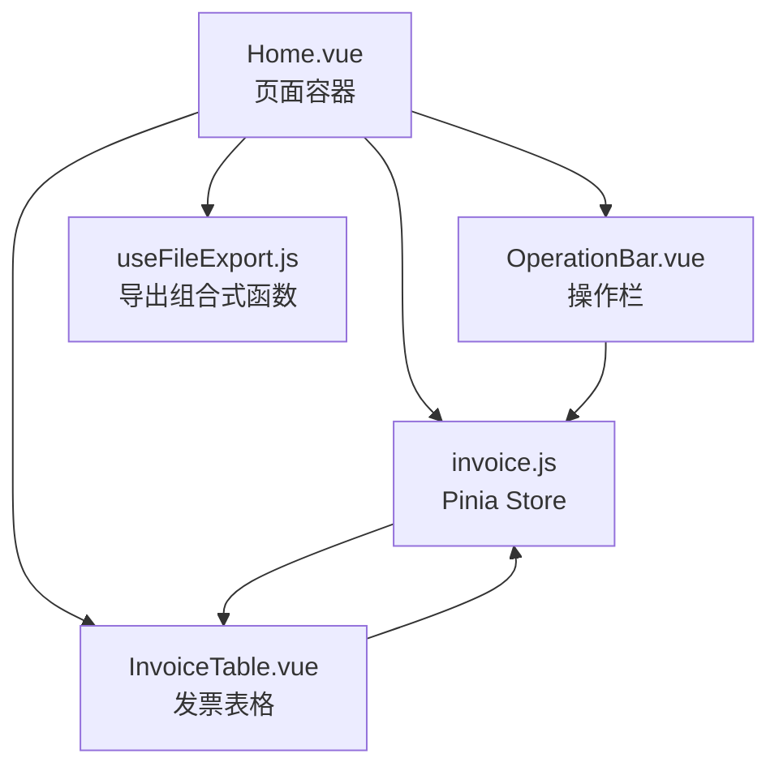
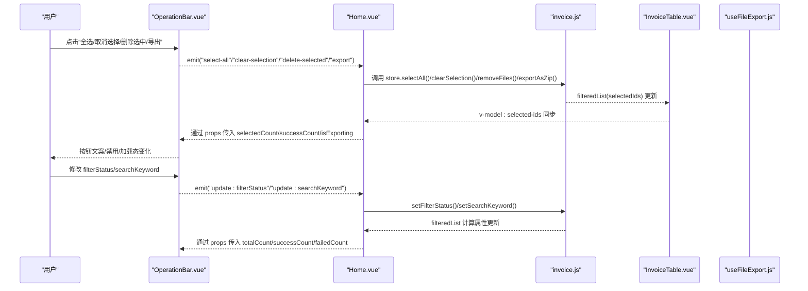
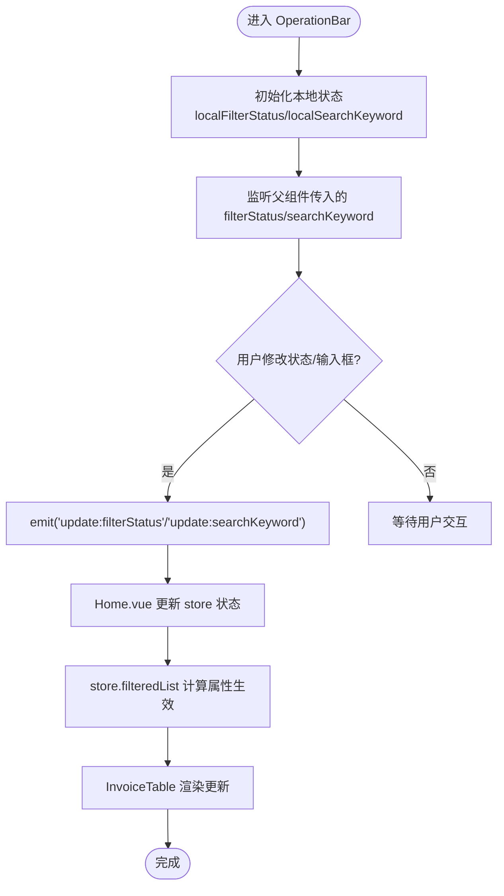
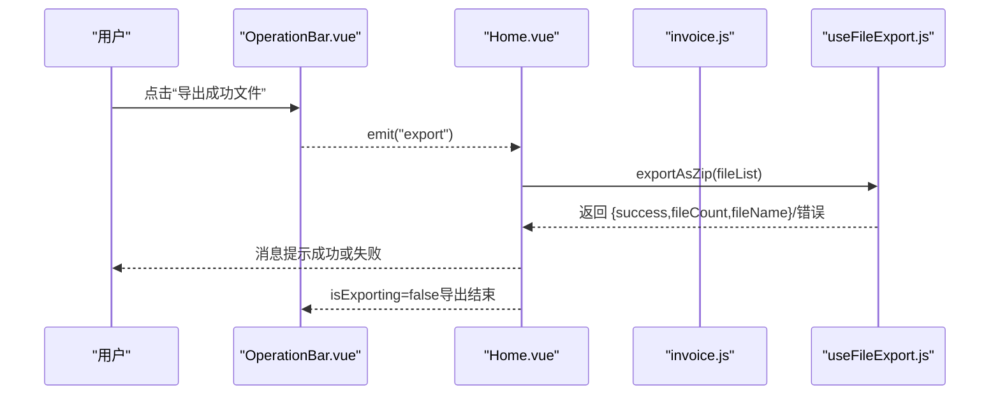
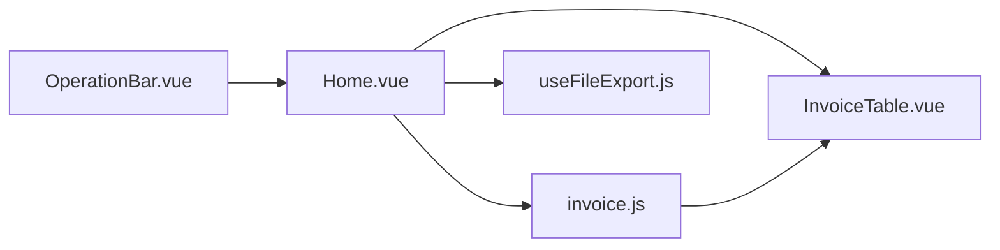

# OperationBar 操作栏组件

<cite>
**本文引用的文件**
- [OperationBar.vue](file://src/components/OperationBar.vue)
- [Home.vue](file://src/views/Home.vue)
- [InvoiceTable.vue](file://src/components/InvoiceTable.vue)
- [invoice.js](file://src/stores/invoice.js)
- [useFileExport.js](file://src/composables/useFileExport.js)
</cite>

## 目录
1. [简介](#简介)
2. [项目结构](#项目结构)
3. [核心组件](#核心组件)
4. [架构总览](#架构总览)
5. [详细组件分析](#详细组件分析)
6. [依赖关系分析](#依赖关系分析)
7. [性能考虑](#性能考虑)
8. [故障排查指南](#故障排查指南)
9. [结论](#结论)

## 简介
本文件为 OperationBar.vue 组件的详细技术文档，聚焦于其提供的发票列表批量操作与过滤功能。组件分为左右两部分：
- 左侧过滤与搜索区：通过状态单选按钮实现“全部/成功/失败”的筛选，并通过输入框进行文件名关键词搜索；两者均通过事件向父组件同步状态。
- 右侧批量操作按钮组：包含全选、取消选择、删除选中、导出成功文件四个按钮，按钮文案与禁用/加载态由传入的状态 props 决定。

此外，文档还分析了 OperationBar 与 InvoiceTable 在 Home.vue 中的协同工作流程，以及与 Pinia 状态管理、导出组合式函数的集成方式。

## 项目结构
OperationBar 位于组件层，Home.vue 作为页面容器负责状态传递与事件绑定，InvoiceTable 提供表格与选择能力，Pinia store 负责数据与计算属性，导出组合式函数提供导出能力。



图表来源
- [Home.vue](file://src/views/Home.vue#L1-L236)
- [OperationBar.vue](file://src/components/OperationBar.vue#L1-L119)
- [InvoiceTable.vue](file://src/components/InvoiceTable.vue#L1-L162)
- [invoice.js](file://src/stores/invoice.js#L1-L204)
- [useFileExport.js](file://src/composables/useFileExport.js#L1-L80)

章节来源
- [Home.vue](file://src/views/Home.vue#L1-L236)
- [OperationBar.vue](file://src/components/OperationBar.vue#L1-L119)
- [InvoiceTable.vue](file://src/components/InvoiceTable.vue#L1-L162)
- [invoice.js](file://src/stores/invoice.js#L1-L204)
- [useFileExport.js](file://src/composables/useFileExport.js#L1-L80)

## 核心组件
- OperationBar.vue
  - 左侧：状态单选按钮组与搜索输入框，双向绑定本地状态并通过事件向父组件同步。
  - 右侧：批量操作按钮，根据传入状态控制文案与禁用/加载态。
  - Props 接收：filterStatus、searchKeyword、totalCount、successCount、failedCount、selectedCount、isExporting。
  - Emits：update:filterStatus、update:searchKeyword、select-all、clear-selection、delete-selected、export。

章节来源
- [OperationBar.vue](file://src/components/OperationBar.vue#L1-L119)

## 架构总览
OperationBar 与 Home.vue 的交互采用 v-model 与事件的方式，实现双向数据流与事件驱动的批量操作。



图表来源
- [Home.vue](file://src/views/Home.vue#L1-L236)
- [OperationBar.vue](file://src/components/OperationBar.vue#L1-L119)
- [InvoiceTable.vue](file://src/components/InvoiceTable.vue#L1-L162)
- [invoice.js](file://src/stores/invoice.js#L1-L204)
- [useFileExport.js](file://src/composables/useFileExport.js#L1-L80)

## 详细组件分析

### 左侧过滤与搜索区域
- 状态筛选
  - 使用状态单选按钮组展示“全部/成功/失败”，显示对应计数。
  - 本地状态与父组件 v-model:filter-status 同步，内部使用 watch 监听父组件传入值以保持一致。
  - 用户切换后通过 update:value 事件向父组件发出 update:filterStatus，父组件据此调用 store.setFilterStatus 并由 store 的 filteredList 计算属性影响表格渲染。
- 关键词搜索
  - 输入框支持清空与前缀图标，实时监听输入值并通过 update:value 事件发出 update:searchKeyword。
  - 父组件调用 store.setSearchKeyword，同样由 filteredList 计算属性生效。



图表来源
- [OperationBar.vue](file://src/components/OperationBar.vue#L1-L119)
- [Home.vue](file://src/views/Home.vue#L1-L236)
- [invoice.js](file://src/stores/invoice.js#L1-L204)
- [InvoiceTable.vue](file://src/components/InvoiceTable.vue#L1-L162)

章节来源
- [OperationBar.vue](file://src/components/OperationBar.vue#L1-L119)
- [Home.vue](file://src/views/Home.vue#L1-L236)
- [invoice.js](file://src/stores/invoice.js#L1-L204)
- [InvoiceTable.vue](file://src/components/InvoiceTable.vue#L1-L162)

### 右侧批量操作按钮组
- 全选
  - 文案固定为“全选”，当 totalCount 为 0 时禁用。
  - 点击后向父组件发出 select-all 事件，父组件调用 store.selectAll 将 filteredList 中的 id 全部加入 selectedIds。
- 取消选择
  - 文案固定为“取消选择”，当 selectedCount 为 0 时禁用。
  - 点击后发出 clear-selection，父组件调用 store.clearSelection 清空选中。
- 删除选中
  - 文案包含已选数量，当 selectedCount 为 0 时禁用。
  - 点击后发出 delete-selected，父组件弹窗确认后调用 store.removeFiles 删除所选项。
- 导出成功文件
  - 文案固定为“导出成功的文件”，当 successCount 为 0 或 isExporting 为真时禁用且显示加载态。
  - 点击后发出 export，父组件调用 useFileExport.exportAsZip 导出状态为“成功”的文件。



图表来源
- [OperationBar.vue](file://src/components/OperationBar.vue#L1-L119)
- [Home.vue](file://src/views/Home.vue#L1-L236)
- [useFileExport.js](file://src/composables/useFileExport.js#L1-L80)
- [invoice.js](file://src/stores/invoice.js#L1-L204)

章节来源
- [OperationBar.vue](file://src/components/OperationBar.vue#L1-L119)
- [Home.vue](file://src/views/Home.vue#L1-L236)
- [useFileExport.js](file://src/composables/useFileExport.js#L1-L80)
- [invoice.js](file://src/stores/invoice.js#L1-L204)

### 与 InvoiceTable 的协同
- 选中状态同步
  - Home.vue 通过 v-model:selected-ids 将 store.selectedIds 与 InvoiceTable 绑定，表格的勾选变更会回写 selectedIds。
  - OperationBar 读取 selectedCount 以控制“取消选择”“删除选中”按钮的禁用态与文案。
- 表格数据渲染
  - Home.vue 将 store.filteredList 传给 InvoiceTable，使表格只渲染当前筛选后的数据。
- 交互闭环
  - OperationBar 的筛选与搜索通过 update:filterStatus/update:searchKeyword 影响 store 的计算属性，从而改变 filteredList，最终驱动表格渲染。

```mermaid
classDiagram
class Home {
+v-model : filter-status
+v-model : search-keyword
+props : totalCount/successCount/failedCount/selectedCount/isExporting
+@select-all/@clear-selection/@delete-selected/@export
}
class OperationBar {
+props : filterStatus/searchKeyword/totalCount/successCount/failedCount/selectedCount/isExporting
+emits : update : filterStatus/update : searchKeyword/select-all/clear-selection/delete-selected/export
}
class InvoiceTable {
+props : data/selectedIds
+emits : update : selectedIds
}
class Store {
+filteredList
+selectedIds
+setFilterStatus/setSearchKeyword
+selectAll/clearSelection/removeFiles
}
Home --> OperationBar : "传入 props/接收事件"
Home --> InvoiceTable : "传入 data/selectedIds"
OperationBar --> Store : "update : filterStatus/update : searchKeyword"
InvoiceTable --> Store : "update : selectedIds"
Store --> Home : "filteredList/selectedIds"
```

图表来源
- [Home.vue](file://src/views/Home.vue#L1-L236)
- [OperationBar.vue](file://src/components/OperationBar.vue#L1-L119)
- [InvoiceTable.vue](file://src/components/InvoiceTable.vue#L1-L162)
- [invoice.js](file://src/stores/invoice.js#L1-L204)

章节来源
- [Home.vue](file://src/views/Home.vue#L1-L236)
- [OperationBar.vue](file://src/components/OperationBar.vue#L1-L119)
- [InvoiceTable.vue](file://src/components/InvoiceTable.vue#L1-L162)
- [invoice.js](file://src/stores/invoice.js#L1-L204)

## 依赖关系分析
- 组件耦合
  - OperationBar 与 Home 通过 v-model 与事件解耦，职责清晰：前者负责 UI 交互与状态同步，后者负责业务逻辑与状态管理。
  - OperationBar 与 InvoiceTable 通过 store 的 selectedIds 间接耦合，形成“选择-操作-渲染”的闭环。
- 外部依赖
  - 导出功能依赖 useFileExport.js 的异步导出流程与 loading 状态。
  - 状态计算依赖 Pinia store 的计算属性与方法。



图表来源
- [OperationBar.vue](file://src/components/OperationBar.vue#L1-L119)
- [Home.vue](file://src/views/Home.vue#L1-L236)
- [InvoiceTable.vue](file://src/components/InvoiceTable.vue#L1-L162)
- [invoice.js](file://src/stores/invoice.js#L1-L204)
- [useFileExport.js](file://src/composables/useFileExport.js#L1-L80)

章节来源
- [OperationBar.vue](file://src/components/OperationBar.vue#L1-L119)
- [Home.vue](file://src/views/Home.vue#L1-L236)
- [InvoiceTable.vue](file://src/components/InvoiceTable.vue#L1-L162)
- [invoice.js](file://src/stores/invoice.js#L1-L204)
- [useFileExport.js](file://src/composables/useFileExport.js#L1-L80)

## 性能考虑
- 实时搜索
  - 搜索输入通过实时事件触发，建议在父组件对 update:searchKeyword 做节流/防抖，避免高频更新导致的重渲染压力。
- 筛选计算
  - store.filteredList 会在 filterStatus 或 searchKeyword 变化时重新计算，建议确保 fileList 规模可控或在上层做分页/懒加载。
- 导出流程
  - 导出为 ZIP 为异步操作，isExporting 控制按钮加载态，避免重复点击；导出完成后及时复位状态。

## 故障排查指南
- 按钮无法点击
  - 全选/取消选择/删除选中：检查 selectedCount 是否为 0；确认 Home.vue 是否正确将 store.selectedIds 通过 v-model:selected-ids 传入。
  - 导出成功文件：检查 successCount 是否为 0 或 isExporting 是否为真；确认 Home.vue 是否正确传入 isExporting。
- 筛选无效
  - 检查 Home.vue 是否正确处理 update:filterStatus/update:searchKeyword 并调用 store.setFilterStatus/setSearchKeyword。
  - 确认 store.filteredList 是否被正确传入 InvoiceTable 的 data。
- 选中状态不同步
  - 检查 InvoiceTable 的 update:checked-row-keys 是否正确回写到 selectedIds；确认 Home.vue 的 v-model:selected-ids 绑定是否生效。

章节来源
- [Home.vue](file://src/views/Home.vue#L1-L236)
- [OperationBar.vue](file://src/components/OperationBar.vue#L1-L119)
- [InvoiceTable.vue](file://src/components/InvoiceTable.vue#L1-L162)
- [invoice.js](file://src/stores/invoice.js#L1-L204)

## 结论
OperationBar 通过简洁的 UI 与明确的事件契约，将发票列表的筛选、搜索与批量操作整合在一个统一的操作栏中。结合 Pinia 的状态管理与导出组合式函数，实现了从 UI 到数据与业务流程的完整闭环。建议在高频交互场景下增加输入事件的节流/防抖与导出流程的错误提示优化，以进一步提升用户体验与稳定性。