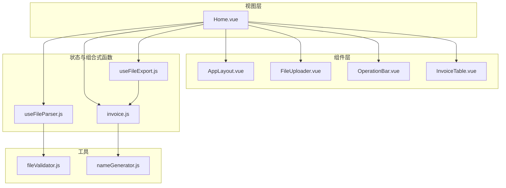
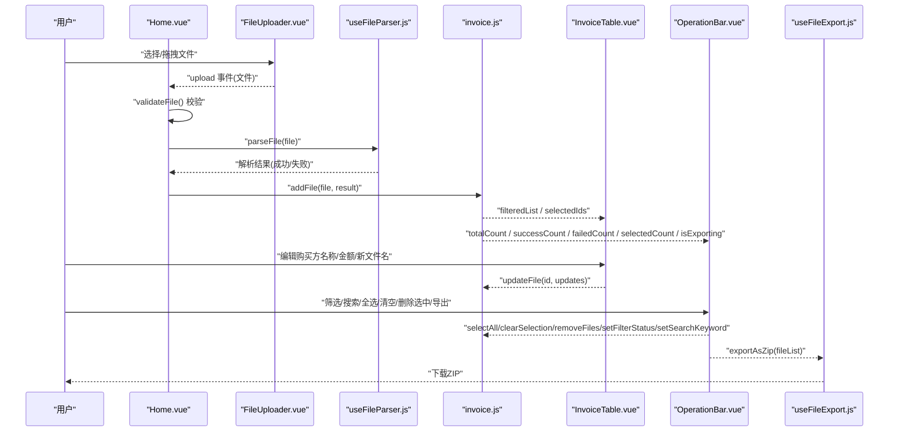
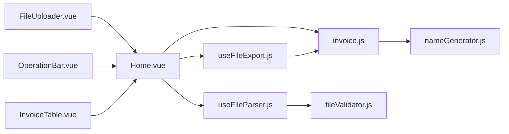

# UI组件

<cite>
**本文引用的文件**
- [AppLayout.vue](file://src/components/AppLayout.vue)
- [FileUploader.vue](file://src/components/FileUploader.vue)
- [InvoiceTable.vue](file://src/components/InvoiceTable.vue)
- [OperationBar.vue](file://src/components/OperationBar.vue)
- [Home.vue](file://src/views/Home.vue)
- [invoice.js](file://src/stores/invoice.js)
- [useFileParser.js](file://src/composables/useFileParser.js)
- [useFileExport.js](file://src/composables/useFileExport.js)
- [fileValidator.js](file://src/utils/fileValidator.js)
- [nameGenerator.js](file://src/utils/nameGenerator.js)
</cite>

## 目录
1. [简介](#简介)
2. [项目结构](#项目结构)
3. [核心组件](#核心组件)
4. [架构总览](#架构总览)
5. [组件详解](#组件详解)
6. [依赖关系分析](#依赖关系分析)
7. [性能与体验](#性能与体验)
8. [故障排查指南](#故障排查指南)
9. [结论](#结论)
10. [附录：使用示例与最佳实践](#附录使用示例与最佳实践)

## 简介
本文件面向项目中的核心UI组件，系统性梳理以下四个组件的职责、接口、内部状态与交互行为：
- AppLayout.vue：整体布局与导航，包含侧边菜单、面包屑、标题与页脚。
- FileUploader.vue：文件选择与上传交互，支持拖拽、多文件与格式校验。
- InvoiceTable.vue：发票信息表格展示，支持行内编辑、状态标签与删除操作。
- OperationBar.vue：批量操作区，提供筛选、搜索、全选/清空、删除选中与导出。

这些组件均基于 Naive UI 构建，遵循统一的视觉设计语言；并在 Home.vue 中协同工作，完成“上传-解析-展示-编辑-导出”的完整流程。文档同时覆盖响应式设计与用户体验细节（加载状态、错误提示等）。

## 项目结构
围绕核心组件，项目采用按功能分层的组织方式：
- 组件层：src/components 下的四个核心组件
- 视图层：src/views/Home.vue 作为主页面，编排组件与状态
- 状态层：src/stores/invoice.js 管理发票列表、筛选、选中态与处理状态
- 组合式函数：src/composables/useFileParser.js、useFileExport.js 提供解析与导出能力
- 工具层：src/utils/fileValidator.js、nameGenerator.js 提供文件校验与命名规则

图表来源
- [Home.vue](file://src/views/Home.vue#L1-L236)
- [AppLayout.vue](file://src/components/AppLayout.vue#L1-L292)
- [FileUploader.vue](file://src/components/FileUploader.vue#L1-L50)
- [OperationBar.vue](file://src/components/OperationBar.vue#L1-L119)
- [InvoiceTable.vue](file://src/components/InvoiceTable.vue#L1-L162)
- [invoice.js](file://src/stores/invoice.js#L1-L204)
- [useFileParser.js](file://src/composables/useFileParser.js#L1-L102)
- [useFileExport.js](file://src/composables/useFileExport.js#L1-L80)
- [fileValidator.js](file://src/utils/fileValidator.js#L1-L90)
- [nameGenerator.js](file://src/utils/nameGenerator.js#L1-L225)

章节来源
- [Home.vue](file://src/views/Home.vue#L1-L236)

## 核心组件
本节概述四个组件的职责与边界：
- AppLayout.vue：提供全局布局容器、侧边菜单、面包屑导航、头部标题与页脚，负责路由/页面切换的事件通知。
- FileUploader.vue：封装 Naive UI 的上传组件，实现本地化“上传”逻辑（实际只触发处理），并提供拖拽与格式约束。
- InvoiceTable.vue：基于 Naive UI 的数据表格，展示发票列表，支持行内编辑（购买方名称、金额、新文件名）、状态标签、失败原因与删除操作。
- OperationBar.vue：提供筛选（全部/成功/失败）、搜索、全选/清空、删除选中、导出成功文件等批量操作，绑定到 Pinia store 的状态。

章节来源
- [AppLayout.vue](file://src/components/AppLayout.vue#L1-L292)
- [FileUploader.vue](file://src/components/FileUploader.vue#L1-L50)
- [InvoiceTable.vue](file://src/components/InvoiceTable.vue#L1-L162)
- [OperationBar.vue](file://src/components/OperationBar.vue#L1-L119)

## 架构总览
下图展示了组件在 Home.vue 中的组合关系与数据流方向。

图表来源
- [Home.vue](file://src/views/Home.vue#L1-L236)
- [FileUploader.vue](file://src/components/FileUploader.vue#L1-L50)
- [useFileParser.js](file://src/composables/useFileParser.js#L1-L102)
- [invoice.js](file://src/stores/invoice.js#L1-L204)
- [InvoiceTable.vue](file://src/components/InvoiceTable.vue#L1-L162)
- [OperationBar.vue](file://src/components/OperationBar.vue#L1-L119)
- [useFileExport.js](file://src/composables/useFileExport.js#L1-L80)

## 组件详解

### AppLayout.vue
- 职责
  - 提供全局布局容器与主内容区，左侧为可折叠侧边栏，右侧为主内容区。
  - 内置菜单与面包屑导航，根据 activeKey 动态计算当前标题与路径。
  - 顶部包含标题与 GitHub 链接，底部为版权信息。
- Props
  - activeKey: 字符串，默认值为 home，用于标识当前激活的菜单项。
- Emits
  - update:activeKey: 当用户点击菜单或面包屑时，向父组件发出新的 activeKey。
- 内部状态
  - collapsed: 布尔值，控制侧边栏折叠状态。
  - localActiveKey: 本地双向绑定的激活键，用于模板渲染与 watch 同步。
- 用户交互
  - 侧边栏折叠/展开事件回调更新 collapsed。
  - 菜单选择与面包屑点击触发 update:activeKey。
  - GitHub 图标点击在新窗口打开仓库地址。
- 设计要点
  - 使用 Naive UI 的布局、菜单、面包屑、图标组件，保持一致的视觉风格。
  - 响应式布局通过容器高度与 flex 布局实现，确保内容区自适应。

章节来源
- [AppLayout.vue](file://src/components/AppLayout.vue#L1-L292)

### FileUploader.vue
- 职责
  - 提供文件上传入口，支持多文件与目录拖拽，限制文件类型为 PDF/XML，单个不超过 10MB，最多 100 个文件。
  - 采用自定义请求钩子，实际不上传至服务器，而是触发 upload 事件交由上层处理。
- Props
  - 无
- Emits
  - upload: 传递单个文件对象，用于后续解析与入库。
- 内部状态
  - 无
- 用户交互
  - 点击或拖拽进入上传区域后，触发自定义上传逻辑，立即发出 upload 事件。
  - change 事件可用于记录文件列表变化（当前未做持久化处理）。
- 设计要点
  - 使用 Naive UI 的上传与拖拽组件，统一图标与文案提示。
  - 通过 accept 与 max 属性约束用户输入，提升可用性。

章节来源
- [FileUploader.vue](file://src/components/FileUploader.vue#L1-L50)

### InvoiceTable.vue
- 职责
  - 以表格形式展示发票列表，支持勾选、行内编辑、状态标签、失败原因与删除操作。
- Props
  - data: 数组，默认空数组，传入表格数据。
  - selectedIds: 数组，默认空数组，用于受控选中态。
- Emits
  - update:selectedIds: 当勾选状态变化时，向上游同步选中项 id 列表。
  - edit: 当用户编辑购买方名称、金额或新文件名时，发出 {id, updates}。
  - delete: 当用户点击删除按钮时，发出要删除的 id。
- 内部状态
  - 无
- 用户交互
  - 选择列：勾选/取消勾选，触发 update:selectedIds。
  - 行内编辑：对购买方名称、金额、新文件名使用小型输入框，实时触发 edit。
  - 状态标签：根据状态映射为不同类型的标签，失败时显示失败原因。
  - 删除：点击操作列的删除按钮，触发 delete。
- 设计要点
  - 使用 Naive UI 的数据表格与输入组件，保证一致的交互与样式。
  - 固定列与横向滚动配置，适配宽表场景。

章节来源
- [InvoiceTable.vue](file://src/components/InvoiceTable.vue#L1-L162)

### OperationBar.vue
- 职责
  - 提供筛选（全部/成功/失败）、搜索、全选/清空、删除选中、导出成功文件等批量操作。
- Props
  - filterStatus: 字符串，默认 all，用于受控筛选状态。
  - searchKeyword: 字符串，默认空，用于受控搜索关键字。
  - totalCount/successCount/failedCount/selectedCount: 数字，用于显示统计与禁用状态。
  - isExporting: 布尔值，用于导出按钮的加载态。
- Emits
  - update:filterStatus/update:searchKeyword: 当筛选或搜索变化时，向上游同步。
  - select-all/clear-selection/delete-selected/export: 触发对应批量操作。
- 内部状态
  - localFilterStatus/localSearchKeyword: 本地双向绑定，与 props 同步。
- 用户交互
  - 筛选：单选按钮组切换 filterStatus。
  - 搜索：输入框变更触发 update:searchKeyword。
  - 全选/清空：触发 select-all/clear-selection。
  - 删除选中：触发 delete-selected。
  - 导出：触发 export，导出按钮处于 loading 状态。
- 设计要点
  - 使用 Naive UI 的空间、单选组、输入与按钮组件，统一风格与尺寸。
  - 按钮禁用态与 loading 态直观反馈当前可用性。

章节来源
- [OperationBar.vue](file://src/components/OperationBar.vue#L1-L119)

## 依赖关系分析
- 组件间耦合
  - Home.vue 是编排者，向下传递状态与事件，向上接收子组件事件，协调 store 与组合式函数。
  - InvoiceTable 与 OperationBar 依赖 store 的计算属性与方法，形成松耦合的数据驱动。
- 外部依赖
  - Naive UI：布局、菜单、表格、上传、模态框、进度条等组件。
  - JSZip 与 file-saver：用于导出 ZIP。
  - 组合式函数：useFileParser 与 useFileExport 提供解析与导出能力。
- 数据流向
  - 文件经 FileUploader -> Home -> useFileParser -> store.addFile -> InvoiceTable/OperationBar 渲染。
  - 用户编辑与批量操作经 OperationBar/InvoiceTable -> store.updateFile/removeFile 等方法更新状态。

图表来源
- [Home.vue](file://src/views/Home.vue#L1-L236)
- [FileUploader.vue](file://src/components/FileUploader.vue#L1-L50)
- [OperationBar.vue](file://src/components/OperationBar.vue#L1-L119)
- [InvoiceTable.vue](file://src/components/InvoiceTable.vue#L1-L162)
- [invoice.js](file://src/stores/invoice.js#L1-L204)
- [useFileParser.js](file://src/composables/useFileParser.js#L1-L102)
- [useFileExport.js](file://src/composables/useFileExport.js#L1-L80)
- [fileValidator.js](file://src/utils/fileValidator.js#L1-L90)
- [nameGenerator.js](file://src/utils/nameGenerator.js#L1-L225)

## 性能与体验
- 性能
  - 批量解析采用分批并发处理，减少长时间阻塞，提升大文件集合的处理效率。
  - 表格使用固定列与横向滚动，避免 DOM 过度膨胀。
- 体验
  - 加载与进度：解析过程中弹出进度对话框，实时显示百分比，避免用户误以为卡顿。
  - 错误提示：统一使用消息与对话框组件进行错误与确认提示，增强可感知性。
  - 响应式：卡片与表格容器在移动端适当调整间距与滚动策略，保证可读性。
  - 状态反馈：导出按钮的 loading 态、按钮禁用态与统计数字联动，清晰表达当前可用性。

章节来源
- [Home.vue](file://src/views/Home.vue#L1-L236)
- [useFileParser.js](file://src/composables/useFileParser.js#L1-L102)
- [useFileExport.js](file://src/composables/useFileExport.js#L1-L80)

## 故障排查指南
- 上传失败
  - 现象：上传后无反应或报错。
  - 排查：检查文件格式与大小限制；查看 Home.vue 中的校验与错误消息提示。
- 解析失败
  - 现象：文件状态为失败，失败原因显示。
  - 排查：查看解析结果与错误信息；确认 PDF/XML 解析器是否正常工作。
- 导出失败
  - 现象：导出按钮无响应或报错。
  - 排查：确认是否有成功状态的文件；检查导出过程中的异常返回。
- 编辑无效
  - 现象：编辑输入后未生效。
  - 排查：确认事件是否正确传递到 store.updateFile；检查字段格式化规则。

章节来源
- [Home.vue](file://src/views/Home.vue#L1-L236)
- [fileValidator.js](file://src/utils/fileValidator.js#L1-L90)
- [useFileParser.js](file://src/composables/useFileParser.js#L1-L102)
- [useFileExport.js](file://src/composables/useFileExport.js#L1-L80)
- [invoice.js](file://src/stores/invoice.js#L1-L204)

## 结论
四个核心组件围绕 Home.vue 实现了“上传-解析-展示-编辑-导出”的闭环流程。通过 Pinia 状态管理与组合式函数解耦业务逻辑，组件职责清晰、接口稳定、交互一致。配合 Naive UI 的统一设计语言与响应式布局，整体具备良好的可用性与可维护性。

## 附录：使用示例与最佳实践
- 在 Home.vue 中的组合方式
  - 上传区：在 Card 中放置 FileUploader，并监听 upload 事件进行校验与解析。
  - 操作区：当存在文件时显示 OperationBar，绑定筛选、搜索、选中态与导出状态。
  - 表格区：在 Card 中放置 InvoiceTable，绑定数据与选中态，监听 edit 与 delete 事件。
  - 空状态：当无文件时显示占位提示。
  - 进度对话框：解析期间显示进度与百分比。
- 最佳实践
  - 严格遵守 props 与 emits 的契约，避免跨组件直接修改状态。
  - 对用户输入进行及时校验与反馈，减少无效操作。
  - 使用 loading 与禁用态明确当前操作的可用性。
  - 对于大文件集合，采用分批并发解析，优化用户体验。

章节来源
- [Home.vue](file://src/views/Home.vue#L1-L236)