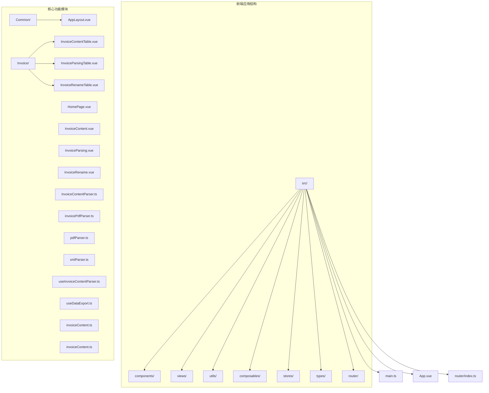
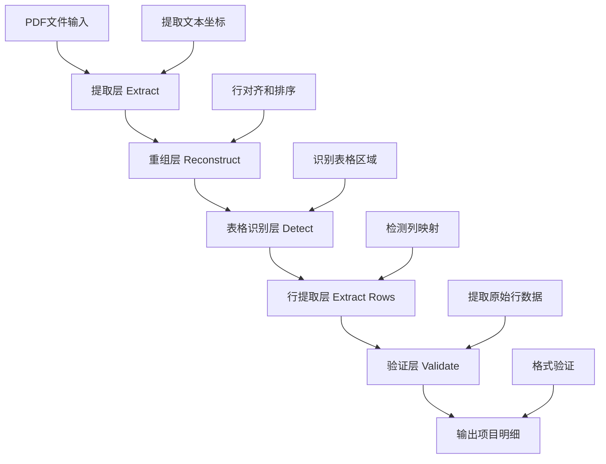
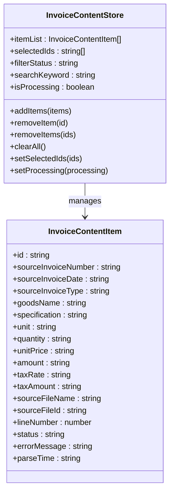
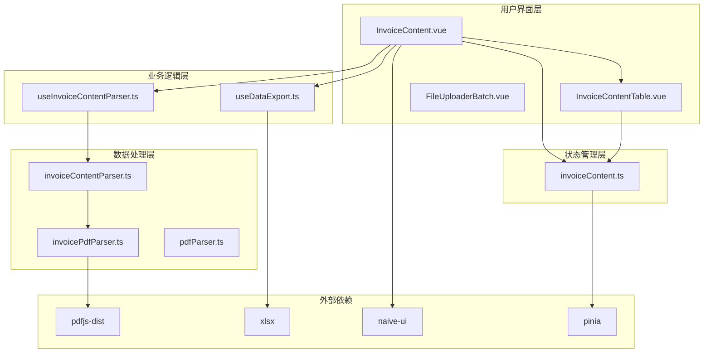
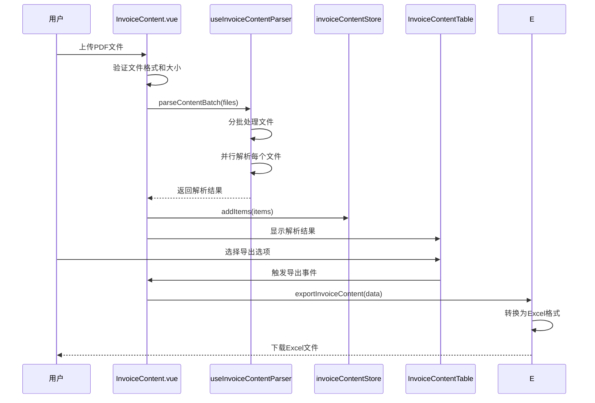
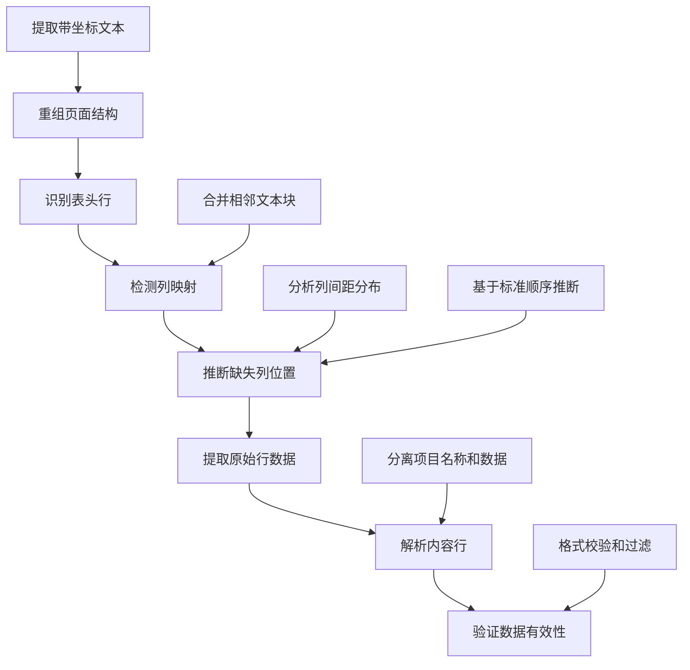
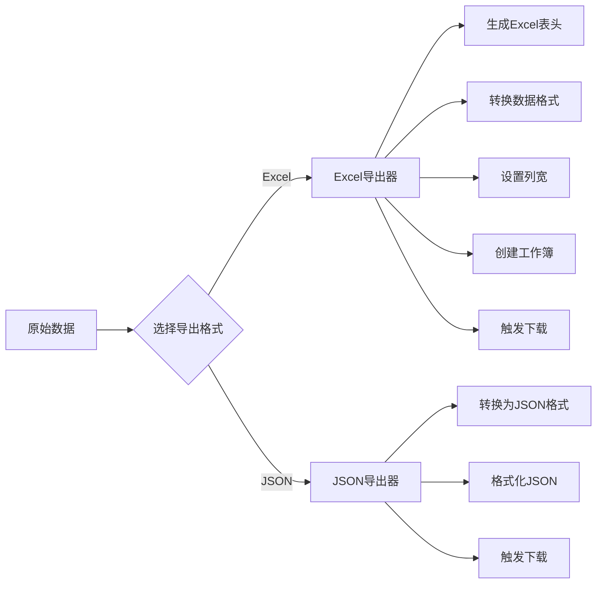

# 发票内容解析

<cite>
**本文档引用的文件**
- [README.md](file://README.md)
- [package.json](file://package.json)
- [src/main.ts](file://src/main.ts)
- [src/App.vue](file://src/App.vue)
- [src/router/index.ts](file://src/router/index.ts)
- [src/views/InvoiceContent.vue](file://src/views/InvoiceContent.vue)
- [src/composables/useInvoiceContentParser.ts](file://src/composables/useInvoiceContentParser.ts)
- [src/utils/invoiceContentParser.ts](file://src/utils/invoiceContentParser.ts)
- [src/stores/invoiceContent.ts](file://src/stores/invoiceContent.ts)
- [src/types/invoiceContent.ts](file://src/types/invoiceContent.ts)
- [src/components/Invoice/InvoiceContentTable.vue](file://src/components/Invoice/InvoiceContentTable.vue)
- [src/utils/invoicePdfParser.ts](file://src/utils/invoicePdfParser.ts)
- [src/utils/pdfParser.ts](file://src/utils/pdfParser.ts)
- [src/utils/xmlParser.ts](file://src/utils/xmlParser.ts)
- [src/composables/useDataExport.ts](file://src/composables/useDataExport.ts)
</cite>

## 目录
1. [项目概述](#项目概述)
2. [项目结构](#项目结构)
3. [核心组件](#核心组件)
4. [架构概览](#架构概览)
5. [详细组件分析](#详细组件分析)
6. [依赖关系分析](#依赖关系分析)
7. [性能考虑](#性能考虑)
8. [故障排除指南](#故障排除指南)
9. [结论](#结论)

## 项目概述

这是一个基于 Vue 3 的财务工具集合，专注于发票处理。项目提供了发票重命名和发票解析两大核心功能，其中发票内容解析功能能够批量处理发票文件，提取项目明细行并支持 Excel 导出。

### 主要特性
- **批量发票处理**: 支持同时处理多个发票文件
- **智能内容提取**: 基于坐标系统的表格识别和解析
- **多格式支持**: 支持 PDF 发票文件解析
- **数据导出**: 支持 Excel 和 JSON 格式导出
- **响应式界面**: 基于 Naive UI 的现代化用户界面

## 项目结构



**图表来源**
- [src/main.ts](file://src/main.ts#L1-L12)
- [src/App.vue](file://src/App.vue#L1-L44)
- [src/router/index.ts](file://src/router/index.ts#L1-L47)

**章节来源**
- [README.md](file://README.md#L1-L41)
- [package.json](file://package.json#L1-L33)

## 核心组件

### 发票内容解析器 (Invoice Content Parser)

发票内容解析器是整个系统的核心组件，负责从 PDF 发票中提取项目明细行数据。它采用 ETL（提取-转换-加载）流水线架构：



**图表来源**
- [src/utils/invoiceContentParser.ts](file://src/utils/invoiceContentParser.ts#L1-L1791)

### 状态管理 (Pinia Store)

系统使用 Pinia 进行状态管理，提供响应式的数据存储和操作：



**图表来源**
- [src/stores/invoiceContent.ts](file://src/stores/invoiceContent.ts#L1-L189)
- [src/types/invoiceContent.ts](file://src/types/invoiceContent.ts#L1-L62)

**章节来源**
- [src/composables/useInvoiceContentParser.ts](file://src/composables/useInvoiceContentParser.ts#L1-L178)
- [src/stores/invoiceContent.ts](file://src/stores/invoiceContent.ts#L1-L189)

## 架构概览

系统采用模块化架构设计，各组件职责清晰分离：



**图表来源**
- [src/views/InvoiceContent.vue](file://src/views/InvoiceContent.vue#L1-L311)
- [src/components/Invoice/InvoiceContentTable.vue](file://src/components/Invoice/InvoiceContentTable.vue#L1-L321)
- [package.json](file://package.json#L12-L23)

## 详细组件分析

### 发票内容解析视图 (InvoiceContent.vue)

这是发票内容解析功能的主要用户界面，提供了完整的文件上传、解析、展示和导出流程：



**图表来源**
- [src/views/InvoiceContent.vue](file://src/views/InvoiceContent.vue#L162-L206)
- [src/composables/useInvoiceContentParser.ts](file://src/composables/useInvoiceContentParser.ts#L106-L168)
- [src/composables/useDataExport.ts](file://src/composables/useDataExport.ts#L303-L410)

### 表格识别算法

系统采用先进的表格识别算法，能够准确识别发票中的项目明细表格：



**图表来源**
- [src/utils/invoiceContentParser.ts](file://src/utils/invoiceContentParser.ts#L513-L652)
- [src/utils/invoiceContentParser.ts](file://src/utils/invoiceContentParser.ts#L672-L783)

### 数据导出功能

系统提供灵活的数据导出功能，支持 Excel 和 JSON 格式：



**图表来源**
- [src/composables/useDataExport.ts](file://src/composables/useDataExport.ts#L44-L124)
- [src/composables/useDataExport.ts](file://src/composables/useDataExport.ts#L303-L410)

**章节来源**
- [src/views/InvoiceContent.vue](file://src/views/InvoiceContent.vue#L1-L311)
- [src/components/Invoice/InvoiceContentTable.vue](file://src/components/Invoice/InvoiceContentTable.vue#L1-L321)

## 依赖关系分析

系统依赖关系清晰，主要外部依赖包括：

```mermaid
graph TB
subgraph "核心依赖"
A[vue@^3.5.13]
B[pinia@^2.2.8]
C[vue-router@^4.6.3]
D[naive-ui@^2.40.1]
end
subgraph "PDF处理"
E[pdfjs-dist@^4.9.155]
F[xlsx@^0.18.5]
end
subgraph "解析工具"
G[fast-xml-parser@^4.5.0]
H[file-saver@^2.0.5]
end
subgraph "构建工具"
I[vite@^6.0.3]
J[typescript@^5.9.3]
end
A --> D
A --> B
A --> C
F --> H
E --> A
G --> A
I --> A
J --> A
```

**图表来源**
- [package.json](file://package.json#L12-L31)

**章节来源**
- [package.json](file://package.json#L1-L33)

## 性能考虑

系统在性能方面采用了多项优化策略：

### 批量处理优化
- **分批处理**: 默认每批处理 10 个文件，避免内存溢出
- **并行解析**: 同一批次内的文件采用并行处理方式
- **进度跟踪**: 实时显示解析进度和当前处理文件

### 内存管理
- **文件大小限制**: 单个文件最大 10MB
- **增量存储**: 解析结果按批次添加到存储中
- **及时清理**: 处理完成后及时清理临时数据

### 算法优化
- **坐标系统**: 基于坐标定位提高准确性
- **自适应阈值**: 根据文本特征动态调整识别阈值
- **缓存机制**: 对重复操作进行结果缓存

## 故障排除指南

### 常见问题及解决方案

#### PDF 文件解析失败
**问题症状**: 上传 PDF 文件后解析失败
**可能原因**:
- 文件格式不支持
- 文件损坏或加密
- 文件过大超限

**解决方案**:
1. 确认文件为标准 PDF 格式
2. 检查文件大小是否超过 10MB 限制
3. 尝试重新生成 PDF 文件

#### 表格识别错误
**问题症状**: 项目明细表格未被正确识别
**可能原因**:
- 发票模板变化
- 文字识别质量差
- 表格布局复杂

**解决方案**:
1. 检查发票清晰度
2. 确认发票为标准格式
3. 联系技术支持获取更新

#### 导出功能异常
**问题症状**: Excel 或 JSON 导出失败
**可能原因**:
- 浏览器兼容性问题
- 文件过大导致内存不足
- 网络连接问题

**解决方案**:
1. 更换浏览器尝试
2. 减少导出数据量
3. 检查网络连接稳定性

**章节来源**
- [src/utils/invoiceContentParser.ts](file://src/utils/invoiceContentParser.ts#L106-L168)
- [src/views/InvoiceContent.vue](file://src/views/InvoiceContent.vue#L162-L206)

## 结论

发票内容解析系统是一个功能完整、架构清晰的财务工具应用。系统采用模块化设计，具有以下优势：

### 技术优势
- **先进的算法**: 基于坐标系统的表格识别技术
- **良好的扩展性**: 模块化架构便于功能扩展
- **用户体验**: 响应式界面和实时进度反馈

### 应用价值
- **提高效率**: 自动化处理大量发票文件
- **降低成本**: 减少人工录入和校验成本
- **保证质量**: 统一的数据格式和质量标准

### 发展方向
- **AI增强**: 集成机器学习提升识别准确率
- **云端集成**: 支持云存储和协作功能
- **多格式支持**: 扩展对更多发票格式的支持

该系统为财务数字化转型提供了强有力的技术支撑，能够显著提升企业的发票处理效率和准确性。