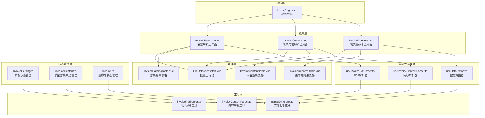
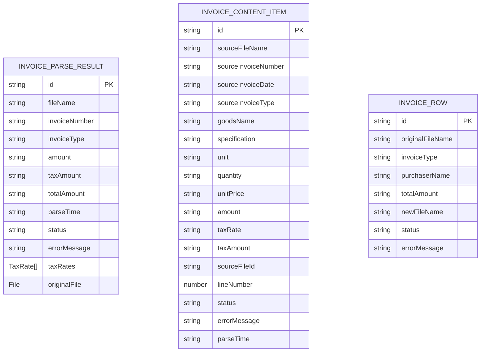
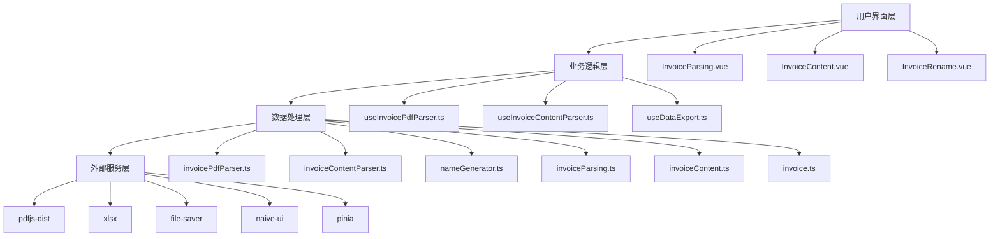
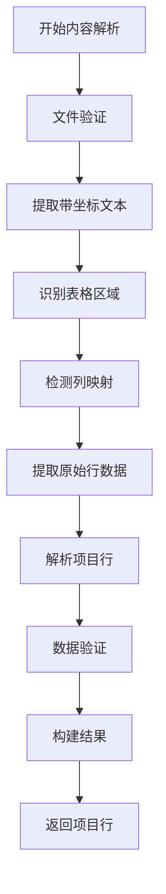
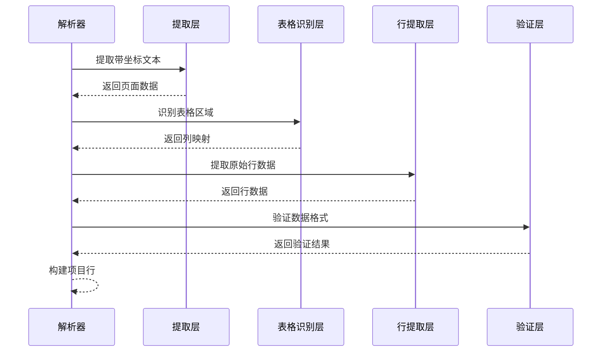
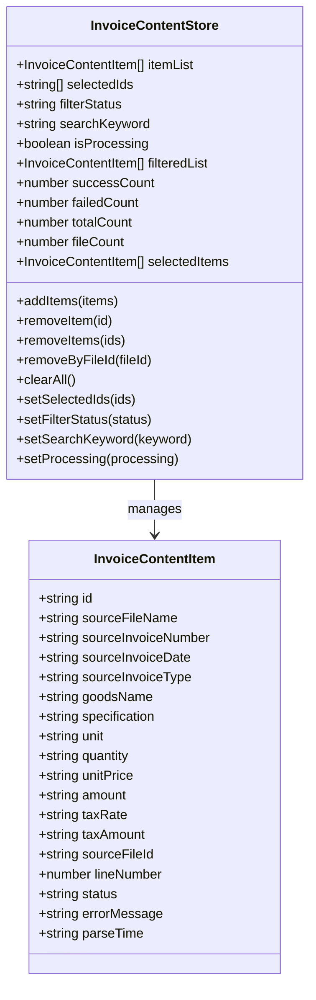
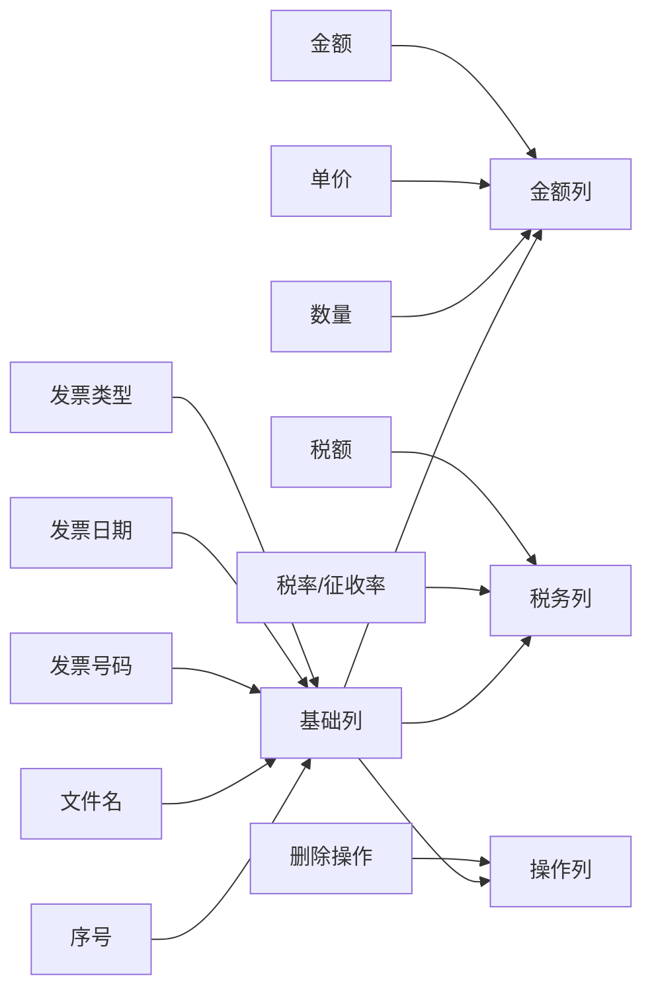
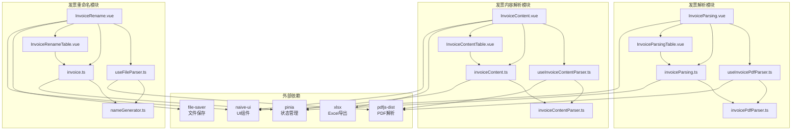

# 发票解析功能

<cite>
**本文档引用的文件**
- [InvoiceParsing.vue](file://src/views/InvoiceParsing.vue)
- [InvoiceContent.vue](file://src/views/InvoiceContent.vue)
- [InvoiceRename.vue](file://src/views/InvoiceRename.vue)
- [FileUploaderBatch.vue](file://src/components/FileUploaderBatch.vue)
- [useInvoicePdfParser.ts](file://src/composables/useInvoicePdfParser.ts)
- [useInvoiceContentParser.ts](file://src/composables/useInvoiceContentParser.ts)
- [useDataExport.ts](file://src/composables/useDataExport.ts)
- [invoiceParsing.ts](file://src/stores/invoiceParsing.ts)
- [invoiceContent.ts](file://src/stores/invoiceContent.ts)
- [invoicePdfParser.ts](file://src/utils/invoicePdfParser.ts)
- [invoiceContentParser.ts](file://src/utils/invoiceContentParser.ts)
- [InvoiceParsingTable.vue](file://src/components/InvoiceParsingTable.vue)
- [InvoiceContentTable.vue](file://src/components/Invoice/InvoiceContentTable.vue)
- [InvoiceRenameTable.vue](file://src/components/Invoice/InvoiceRenameTable.vue)
- [nameGenerator.ts](file://src/utils/nameGenerator.ts)
- [invoice.ts](file://src/types/invoice.ts)
- [invoiceContent.ts](file://src/types/invoiceContent.ts)
- [router/index.ts](file://src/router/index.ts)
- [HomePage.vue](file://src/views/HomePage.vue)
- [README.md](file://README.md)
- [package.json](file://package.json)
</cite>

## 更新摘要
**变更内容**
- 新增发票内容解析系统的详细说明和架构分析
- 增加与现有发票重命名功能的区别和协作关系
- 补充新的数据模型和解析算法逻辑
- 更新组件间的集成关系和协作模式
- 增强异常捕获机制和内存优化策略说明

## 目录
1. [简介](#简介)
2. [项目结构](#项目结构)
3. [核心组件](#核心组件)
4. [架构概览](#架构概览)
5. [详细组件分析](#详细组件分析)
6. [依赖关系分析](#依赖关系分析)
7. [性能考虑](#性能考虑)
8. [故障排除指南](#故障排除指南)
9. [结论](#结论)

## 简介

发票解析功能是一个基于Vue 3构建的现代化发票处理系统，专门设计用于批量处理PDF格式的发票文件。该系统现已发展为三个核心功能模块：发票解析、发票内容解析和发票重命名，每个模块都针对不同的发票处理需求提供专业化的解决方案。

### 功能模块对比

| 功能模块 | 主要用途 | 解析对象 | 输出格式 | 特色功能 |
|---------|----------|----------|----------|----------|
| 发票解析 | 提取发票基本信息 | 发票整体信息 | 关键字段 | 多税率支持、批量处理 |
| 发票内容解析 | 提取项目明细行 | 项目明细行 | Excel表格 | 坐标识别、表格解析 |
| 发票重命名 | 智能重命名文件 | 文件元数据 | 原始文件 | 文件名生成、批量导出 |

该系统提供了强大的多税率支持、实时进度监控、数据验证和导出功能。用户可以通过直观的界面上传多个发票文件，系统会并行解析PDF内容，提取关键字段如金额、税额、价税合计等，并通过表格形式高效展示解析结果。

## 项目结构

发票解析功能采用模块化的架构设计，现已发展为三个独立但相互关联的功能模块：

**图表来源**
- [HomePage.vue](file://src/views/HomePage.vue#L11-L79)
- [InvoiceParsing.vue](file://src/views/InvoiceParsing.vue#L1-L311)
- [InvoiceContent.vue](file://src/views/InvoiceContent.vue#L1-L311)
- [InvoiceRename.vue](file://src/views/InvoiceRename.vue#L1-L309)

## 核心组件

### 数据模型定义

发票解析系统现包含三种不同的数据模型，分别服务于不同的解析场景：

**图表来源**
- [invoice.ts](file://src/types/invoice.ts#L28-L41)
- [invoiceContent.ts](file://src/types/invoiceContent.ts#L7-L30)

#### 发票解析结果结构

- **基础信息**：唯一标识符、文件名、解析时间戳
- **发票信息**：发票号码、发票类型（专票/普票）
- **金额信息**：不含税金额、税额、价税合计
- **税率信息**：支持多税率的完整列表
- **状态信息**：解析状态（success/failed/pending）、错误信息

#### 发票内容项目行结构

- **来源信息**：发票号码、日期、类型、文件名
- **商品信息**：货物名称、规格型号、单位
- **数量信息**：数量、单价、金额
- **税务信息**：税率/征收率、税额
- **元数据**：文件ID、行号、状态、解析时间

#### 发票重命名行结构

- **文件信息**：原文件名、新文件名
- **发票信息**：发票类型、购买方名称、总金额
- **状态信息**：处理状态、错误信息

**章节来源**
- [invoice.ts](file://src/types/invoice.ts#L15-L41)
- [invoiceContent.ts](file://src/types/invoiceContent.ts#L6-L30)

## 架构概览

发票解析功能采用分层架构设计，现已发展为三个独立的功能模块，每个模块都有专门的解析算法和数据处理流程：

**图表来源**
- [InvoiceParsing.vue](file://src/views/InvoiceParsing.vue#L122-L144)
- [InvoiceContent.vue](file://src/views/InvoiceContent.vue#L123-L132)
- [InvoiceRename.vue](file://src/views/InvoiceRename.vue#L123-L127)

## 详细组件分析

### 发票内容解析系统

#### useInvoiceContentParser 组合式函数

新的发票内容解析系统提供了专业的项目明细行提取能力，采用基于坐标的表格识别算法：

**图表来源**
- [useInvoiceContentParser.ts](file://src/composables/useInvoiceContentParser.ts#L106-L168)

#### 解析算法特点

- **坐标识别**：基于PDF文本坐标进行精确的表格区域识别
- **自适应列检测**：自动检测和推断缺失的列位置
- **项目行分组**：基于项目起始标记进行智能分组
- **格式验证**：严格的数字格式和内容特征验证

**章节来源**
- [useInvoiceContentParser.ts](file://src/composables/useInvoiceContentParser.ts#L1-L178)

### 发票内容解析工具

#### invoiceContentParser 工具

内容解析工具采用ETL流水线架构，包含三个核心处理阶段：

**图表来源**
- [invoiceContentParser.ts](file://src/utils/invoiceContentParser.ts#L84-L167)

#### 表格识别算法

系统采用先进的表格识别算法，能够处理复杂的发票布局：

- **表头识别**：基于关键词匹配和坐标分析
- **列映射推断**：通过相邻列位置推断缺失列
- **行数据提取**：基于项目起始标记进行智能分组
- **边界计算**：动态计算字段边界避免硬编码偏移

**章节来源**
- [invoiceContentParser.ts](file://src/utils/invoiceContentParser.ts#L513-L652)

### invoiceContent Store

内容解析状态管理器专门处理项目明细行的存储和操作：

**图表来源**
- [invoiceContent.ts](file://src/stores/invoiceContent.ts#L9-L189)

#### 状态管理特性

- **文件维度统计**：支持按文件去重统计
- **内容搜索**：支持按文件名、发票号、货物名称搜索
- **批量操作**：支持按文件ID批量删除
- **实时过滤**：支持状态和关键词的组合过滤

**章节来源**
- [invoiceContent.ts](file://src/stores/invoiceContent.ts#L1-L189)

### InvoiceContentTable 组件

内容解析表格组件提供了专业的项目明细行展示功能：

**图表来源**
- [InvoiceContentTable.vue](file://src/components/Invoice/InvoiceContentTable.vue#L61-L231)

#### 表格特性

- **专业样式**：采用灰色层次设计的专业表格风格
- **金额格式化**：千分位分隔符和货币符号显示
- **响应式设计**：支持移动端的横向滚动
- **分页功能**：支持20/50/100条记录分页

**章节来源**
- [InvoiceContentTable.vue](file://src/components/Invoice/InvoiceContentTable.vue#L1-L321)

### 发票重命名功能

#### 与内容解析的区别

发票重命名功能专注于文件层面的处理，与内容解析功能形成互补：

| 方面 | 发票重命名 | 发票内容解析 |
|------|------------|--------------|
| 处理对象 | 文件本身 | 发票内容 |
| 输出结果 | 新文件名 | 项目明细行 |
| 技术原理 | 正则表达式匹配 | 坐标识别算法 |
| 数据结构 | InvoiceRow | InvoiceContentItem |
| 导出方式 | ZIP压缩包 | Excel表格 |

#### 协作关系

两个功能模块可以在同一个工作流中协作使用：
1. **内容解析**：先解析发票获取项目明细
2. **重命名**：根据解析结果重命名原始文件
3. **数据导出**：分别导出Excel和ZIP文件

**章节来源**
- [InvoiceRename.vue](file://src/views/InvoiceRename.vue#L1-L309)

## 依赖关系分析

发票解析功能的依赖关系现已扩展为三个独立的功能模块：

**图表来源**
- [package.json](file://package.json#L12-L22)
- [router/index.ts](file://src/router/index.ts#L1-L47)

**章节来源**
- [package.json](file://package.json#L1-L33)
- [router/index.ts](file://src/router/index.ts#L1-L47)

## 性能考虑

### 内存优化策略

三个功能模块都采用了类似的内存优化策略：

1. **分批处理**：每批10个文件，避免一次性加载过多文件
2. **及时清理**：解析完成后及时释放文件引用
3. **增量渲染**：表格组件支持分页，避免一次性渲染大量数据
4. **缓存策略**：合理使用浏览器缓存，减少重复解析

### 并发控制

- **批次大小限制**：防止过度并发导致内存溢出
- **进度监控**：实时显示解析进度，避免用户困惑
- **错误隔离**：单个文件解析失败不影响整体流程

### 数据结构优化

- **扁平化存储**：使用简单数组存储解析结果
- **响应式更新**：精确的状态更新，避免不必要的重渲染
- **类型安全**：严格的TypeScript类型定义确保数据完整性

## 故障排除指南

### 常见问题及解决方案

#### 内容解析失败

当发票内容无法正确解析时：
1. 检查发票是否为扫描版PDF
2. 确认发票清晰度足够
3. 尝试重新拍摄或扫描发票
4. 系统会自动标记为失败状态

#### 坐标识别错误

当表格坐标识别出现偏差时：
1. 检查发票字体是否为标准字体
2. 确认发票格式符合标准模板
3. 调整PDF缩放比例重新解析
4. 系统会尝试自动推断缺失列

#### 重命名冲突

当文件重命名发生冲突时：
1. 检查目标文件夹是否已有同名文件
2. 修改命名规则或文件夹路径
3. 手动处理冲突文件
4. 系统会自动跳过冲突文件

**章节来源**
- [invoiceContentParser.ts](file://src/utils/invoiceContentParser.ts#L118-L123)
- [useInvoiceContentParser.ts](file://src/composables/useInvoiceContentParser.ts#L55-L66)

## 结论

发票解析功能通过精心设计的架构和优化的算法，成功实现了高效的多维度发票处理能力。系统现已发展为三个专业化的功能模块，能够满足不同层次的发票处理需求：

### 主要成就

1. **强大的批量处理能力**：通过智能分批并发策略，能够高效处理大量发票文件
2. **专业的内容解析**：基于坐标的表格识别算法，准确提取项目明细行
3. **完善的多税率支持**：准确识别和处理复杂的多税率发票结构
4. **用户友好的界面**：直观的操作界面和实时进度反馈
5. **灵活的导出选项**：支持多种格式和模式的导出需求
6. **模块化架构设计**：三个功能模块相互独立又可以协作使用

### 技术创新

- **坐标识别算法**：突破了传统OCR识别的局限性
- **自适应表格检测**：能够处理各种发票布局变化
- **ETL流水线架构**：清晰分离提取、识别、验证三个阶段
- **类型安全设计**：严格的TypeScript类型定义确保数据完整性

该系统为财务管理和发票处理提供了强有力的技术支撑，能够显著提高工作效率并减少人工错误。通过持续的优化和改进，该功能将继续为企业用户提供更好的服务体验。