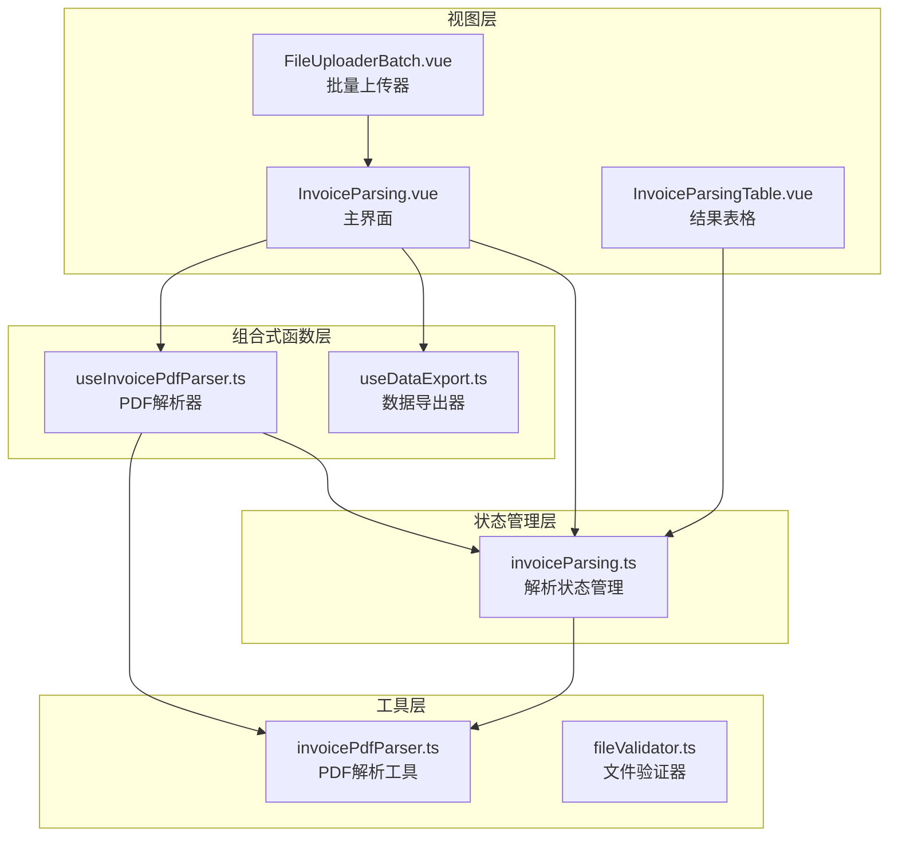
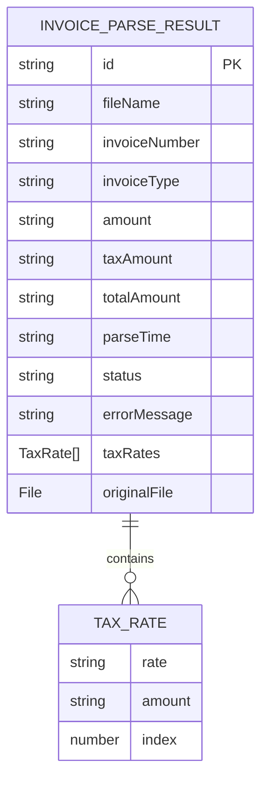
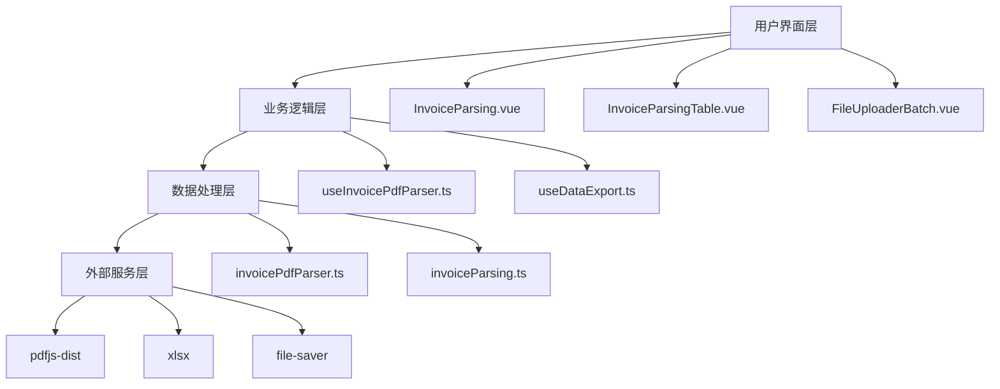
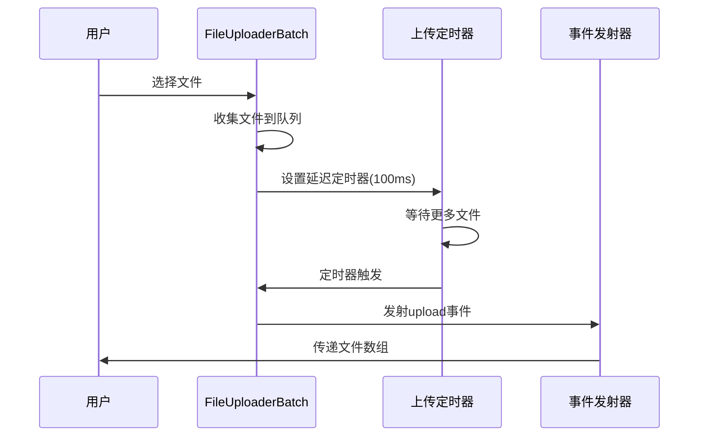
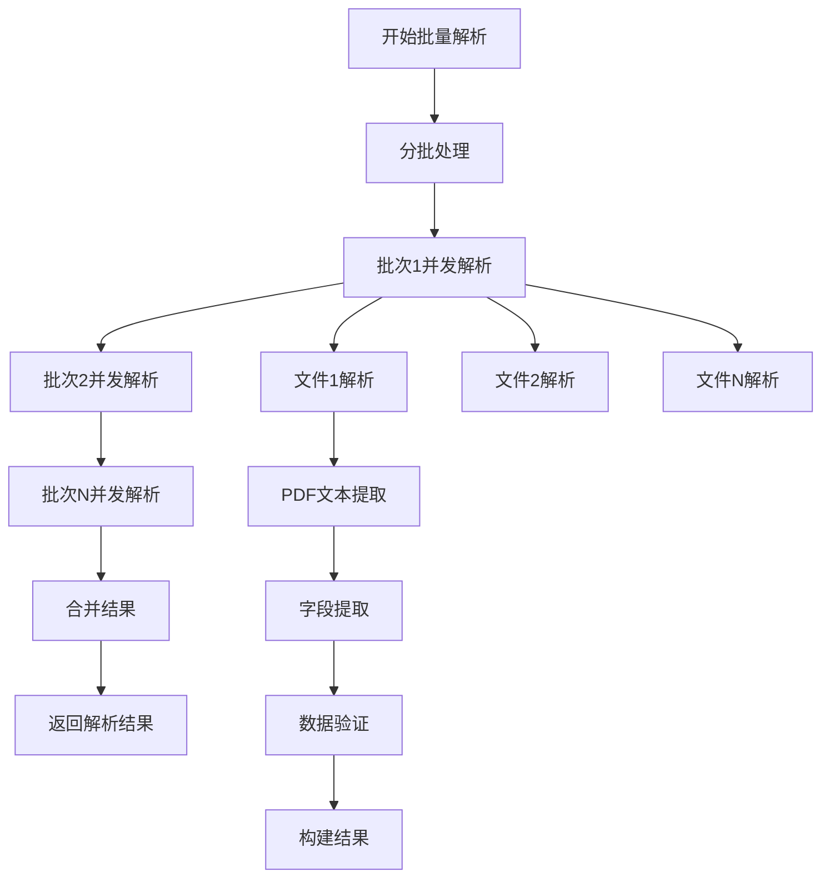
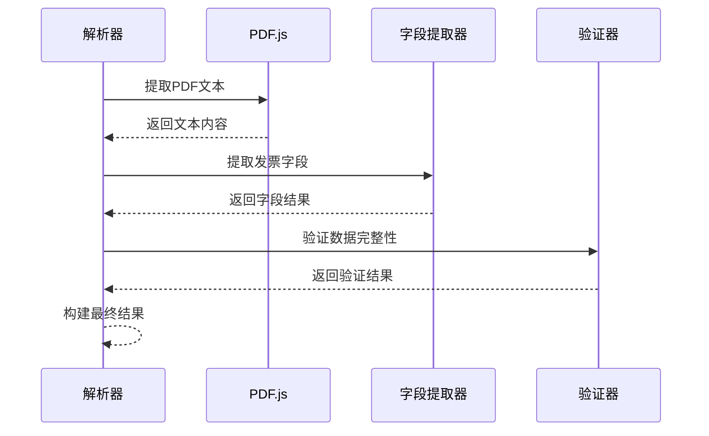
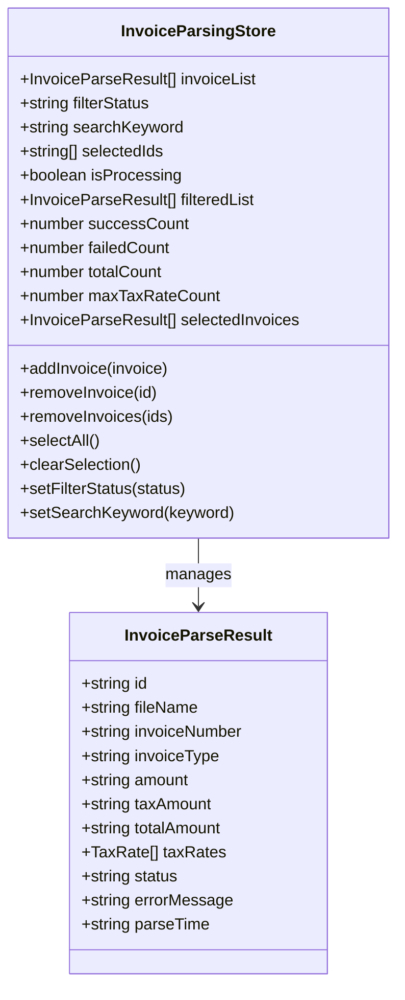
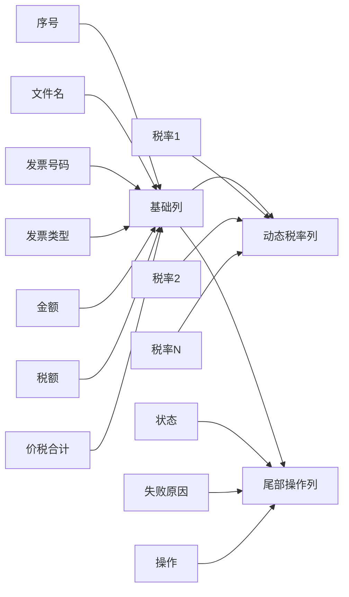
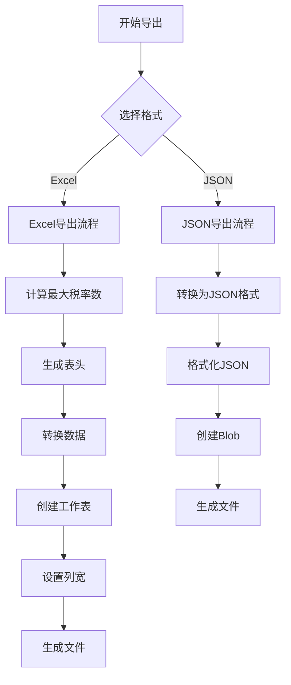
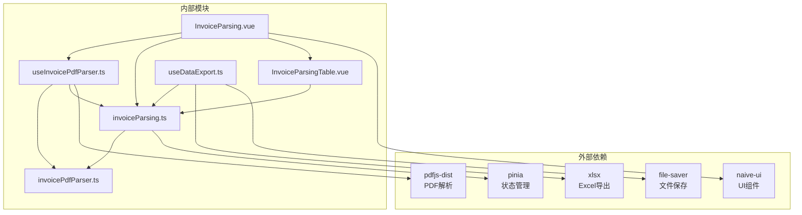

# 发票解析功能

<cite>
**本文档引用的文件**
- [InvoiceParsing.vue](file://src/views/InvoiceParsing.vue)
- [FileUploaderBatch.vue](file://src/components/FileUploaderBatch.vue)
- [useInvoicePdfParser.ts](file://src/composables/useInvoicePdfParser.ts)
- [invoiceParsing.ts](file://src/stores/invoiceParsing.ts)
- [invoicePdfParser.ts](file://src/utils/invoicePdfParser.ts)
- [InvoiceParsingTable.vue](file://src/components/InvoiceParsingTable.vue)
- [useDataExport.ts](file://src/composables/useDataExport.ts)
- [README.md](file://README.md)
- [package.json](file://package.json)
</cite>

## 目录
1. [简介](#简介)
2. [项目结构](#项目结构)
3. [核心组件](#核心组件)
4. [架构概览](#架构概览)
5. [详细组件分析](#详细组件分析)
6. [依赖关系分析](#依赖关系分析)
7. [性能考虑](#性能考虑)
8. [故障排除指南](#故障排除指南)
9. [结论](#结论)

## 简介

发票解析功能是一个基于Vue 3构建的现代化发票处理系统，专门设计用于批量处理PDF格式的发票文件。该系统提供了强大的多税率支持、实时进度监控、数据验证和导出功能。用户可以通过直观的界面上传多个发票文件，系统会并行解析PDF内容，提取关键字段如金额、税额、价税合计等，并通过表格形式高效展示解析结果。

该功能的核心优势包括：
- **批量处理能力**：支持同时处理多个发票文件，采用智能分批并发策略
- **多税率支持**：能够识别和处理复杂的多税率发票结构
- **实时进度监控**：提供详细的解析进度反馈和当前文件状态
- **数据验证机制**：内置严格的数据验证确保解析结果的准确性
- **灵活导出选项**：支持Excel和JSON格式的多种导出模式

## 项目结构

发票解析功能采用模块化的架构设计，主要由以下核心模块组成：

**图表来源**
- [InvoiceParsing.vue](file://src/views/InvoiceParsing.vue#L1-L328)
- [useInvoicePdfParser.ts](file://src/composables/useInvoicePdfParser.ts#L1-L173)
- [invoiceParsing.ts](file://src/stores/invoiceParsing.ts#L1-L241)

**章节来源**
- [README.md](file://README.md#L1-L41)
- [package.json](file://package.json#L1-L33)

## 核心组件

### 数据模型定义

发票解析系统的核心数据结构如下：

**图表来源**
- [invoiceParsing.ts](file://src/stores/invoiceParsing.ts#L17-L31)

#### 发票解析结果结构

- **基础信息**：唯一标识符、文件名、解析时间戳
- **发票信息**：发票号码、发票类型（专票/普票）
- **金额信息**：不含税金额、税额、价税合计
- **税率信息**：支持多税率的完整列表
- **状态信息**：解析状态（success/failed/pending）、错误信息

#### 税率数据结构

- **rate**：税率值（如"13%"）
- **amount**：对应金额（可选）
- **index**：序号（用于动态列展示）

**章节来源**
- [invoiceParsing.ts](file://src/stores/invoiceParsing.ts#L10-L31)

## 架构概览

发票解析功能采用分层架构设计，确保各组件职责清晰、耦合度低：

**图表来源**
- [InvoiceParsing.vue](file://src/views/InvoiceParsing.vue#L122-L144)
- [useInvoicePdfParser.ts](file://src/composables/useInvoicePdfParser.ts#L1-L173)
- [invoicePdfParser.ts](file://src/utils/invoicePdfParser.ts#L1-L349)

## 详细组件分析

### FileUploaderBatch 组件

FileUploaderBatch组件提供了强大的批量文件上传功能，支持拖拽上传和目录选择：

**图表来源**
- [FileUploaderBatch.vue](file://src/components/FileUploaderBatch.vue#L49-L67)

#### 关键特性
- **批量收集**：智能收集多个文件，避免重复触发
- **延迟处理**：100ms延迟确保所有文件被收集
- **最大限制**：支持最多100个文件同时上传
- **格式验证**：默认只接受PDF格式

**章节来源**
- [FileUploaderBatch.vue](file://src/components/FileUploaderBatch.vue#L1-L79)

### useInvoicePdfParser 组合式函数

useInvoicePdfParser提供了完整的发票PDF解析能力，包括单文件和批量解析：

**图表来源**
- [useInvoicePdfParser.ts](file://src/composables/useInvoicePdfParser.ts#L96-L153)

#### 批量处理策略

系统采用智能的分批并发策略：
- **批次大小**：每批10个文件，平衡内存使用和处理效率
- **批次间串行**：避免过多并发导致内存压力
- **批次内并发**：充分利用CPU资源并行处理

#### 解析流程

**图表来源**
- [useInvoicePdfParser.ts](file://src/composables/useInvoicePdfParser.ts#L37-L91)

**章节来源**
- [useInvoicePdfParser.ts](file://src/composables/useInvoicePdfParser.ts#L1-L173)

### invoiceParsing Store

invoiceParsing store是状态管理的核心，负责管理所有解析结果和用户交互状态：

**图表来源**
- [invoiceParsing.ts](file://src/stores/invoiceParsing.ts#L33-L60)

#### 状态管理特性

- **响应式状态**：所有状态都是响应式的，自动更新UI
- **计算属性**：过滤列表、统计信息等都是基于计算属性
- **选择管理**：支持单选、全选、批量操作
- **搜索功能**：支持按文件名、发票号、金额等关键词搜索

**章节来源**
- [invoiceParsing.ts](file://src/stores/invoiceParsing.ts#L1-L241)

### InvoiceParsingTable 组件

InvoiceParsingTable组件提供了动态的发票结果展示功能：

**图表来源**
- [InvoiceParsingTable.vue](file://src/components/InvoiceParsingTable.vue#L34-L136)

#### 动态列生成

系统根据最高税率数量动态生成列：
- **基础列**：固定的基础信息列
- **动态列**：根据发票最高税率数量生成的税率列
- **操作列**：状态显示和删除操作

**章节来源**
- [InvoiceParsingTable.vue](file://src/components/InvoiceParsingTable.vue#L1-L157)

### useDataExport 组合式函数

useDataExport提供了灵活的数据导出功能，支持多种格式和模式：

**图表来源**
- [useDataExport.ts](file://src/composables/useDataExport.ts#L191-L201)

#### 导出模式

- **全部导出**：导出所有解析结果
- **成功导出**：仅导出解析成功的记录
- **选中导出**：导出用户选中的记录

**章节来源**
- [useDataExport.ts](file://src/composables/useDataExport.ts#L1-L308)

## 依赖关系分析

发票解析功能的依赖关系清晰明确，遵循单一职责原则：

**图表来源**
- [package.json](file://package.json#L12-L22)
- [InvoiceParsing.vue](file://src/views/InvoiceParsing.vue#L140-L144)

**章节来源**
- [package.json](file://package.json#L1-L33)

## 性能考虑

### 内存优化策略

1. **分批处理**：每批10个文件，避免一次性加载过多文件
2. **及时清理**：解析完成后及时释放文件引用
3. **增量渲染**：表格组件支持分页，避免一次性渲染大量数据
4. **缓存策略**：合理使用浏览器缓存，减少重复解析

### 并发控制

- **批次大小限制**：防止过度并发导致内存溢出
- **进度监控**：实时显示解析进度，避免用户困惑
- **错误隔离**：单个文件解析失败不影响整体流程

### 数据结构优化

- **扁平化存储**：使用简单数组存储解析结果
- **动态列生成**：只生成必要的列，减少DOM节点
- **响应式更新**：精确的状态更新，避免不必要的重渲染

## 故障排除指南

### 常见问题及解决方案

#### OCR识别失败

当发票内容无法通过文本提取识别时：
1. 检查发票是否为扫描版PDF
2. 确认发票清晰度足够
3. 尝试重新拍摄或扫描发票
4. 系统会自动标记为失败状态

#### 内存不足错误

当处理大量发票文件时：
1. 减少同时处理的文件数量
2. 关闭其他占用内存的应用程序
3. 增加系统内存容量
4. 系统会自动进行内存优化

#### 导出失败

当导出文件时出现问题：
1. 检查浏览器是否阻止弹窗
2. 确认有足够的磁盘空间
3. 尝试不同的浏览器
4. 检查文件格式兼容性

**章节来源**
- [invoicePdfParser.ts](file://src/utils/invoicePdfParser.ts#L125-L128)
- [useInvoicePdfParser.ts](file://src/composables/useInvoicePdfParser.ts#L77-L90)

## 结论

发票解析功能通过精心设计的架构和优化的算法，成功实现了高效的批量发票处理能力。系统的主要成就包括：

1. **强大的批量处理能力**：通过智能分批并发策略，能够高效处理大量发票文件
2. **完善的多税率支持**：准确识别和处理复杂的多税率发票结构
3. **用户友好的界面**：直观的操作界面和实时进度反馈
4. **可靠的数据验证**：严格的验证机制确保解析结果的准确性
5. **灵活的导出选项**：支持多种格式和模式的导出需求

该系统为财务管理和发票处理提供了强有力的技术支撑，能够显著提高工作效率并减少人工错误。通过持续的优化和改进，该功能将继续为企业用户提供更好的服务体验。