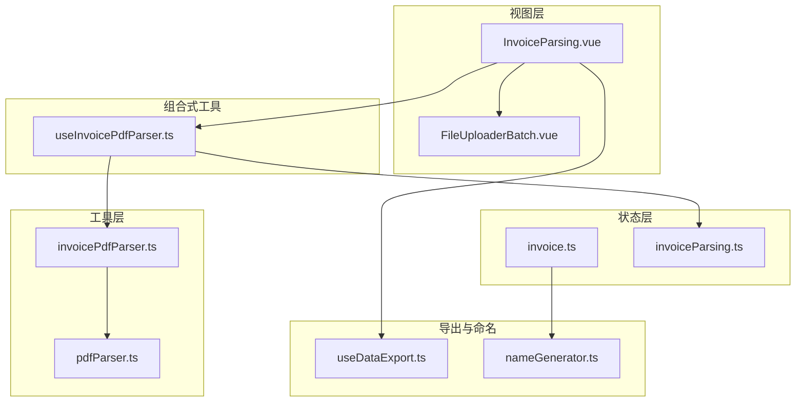
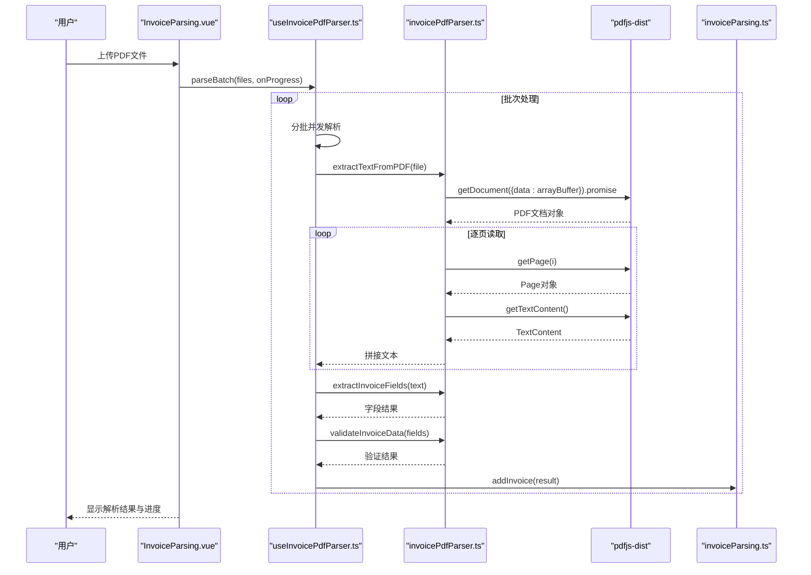
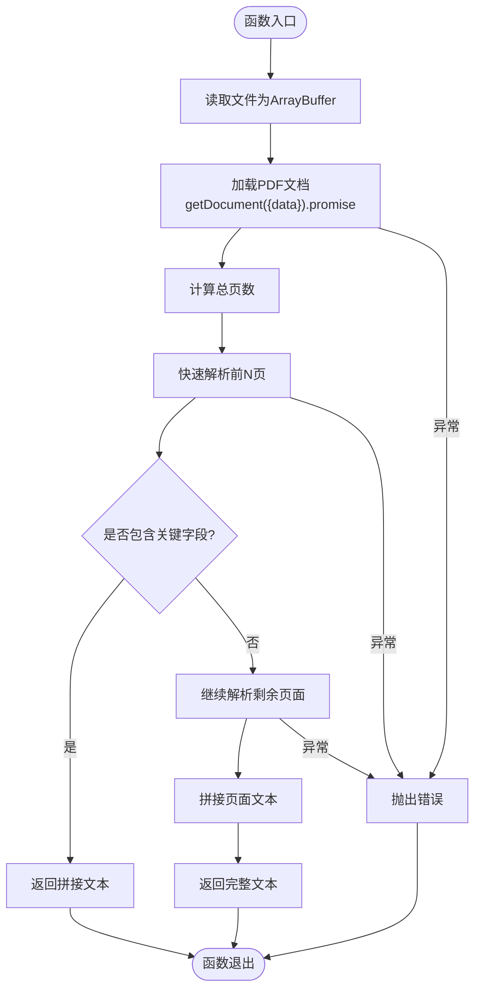
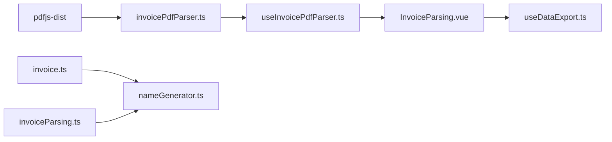

# PDF文本提取

<cite>
**本文引用的文件**
- [useInvoicePdfParser.ts](file://src/composables/useInvoicePdfParser.ts)
- [invoicePdfParser.ts](file://src/utils/invoicePdfParser.ts)
- [pdfParser.ts](file://src/utils/pdfParser.ts)
- [invoice.ts](file://src/stores/invoice.ts)
- [invoiceParsing.ts](file://src/stores/invoiceParsing.ts)
- [InvoiceParsing.vue](file://src/views/InvoiceParsing.vue)
- [FileUploaderBatch.vue](file://src/components/FileUploaderBatch.vue)
- [nameGenerator.ts](file://src/utils/nameGenerator.ts)
- [useDataExport.ts](file://src/composables/useDataExport.ts)
- [package.json](file://package.json)
- [README.md](file://README.md)
</cite>

## 目录
1. [简介](#简介)
2. [项目结构](#项目结构)
3. [核心组件](#核心组件)
4. [架构总览](#架构总览)
5. [详细组件分析](#详细组件分析)
6. [依赖关系分析](#依赖关系分析)
7. [性能考量](#性能考量)
8. [故障排查指南](#故障排查指南)
9. [结论](#结论)
10. [附录](#附录)

## 简介
本文件深入解析基于 pdfjs-dist 的发票PDF文本提取技术实现，重点聚焦于 useInvoicePdfParser 中的 extractTextFromPDF 函数如何利用 PDF.js 的 Promise-based API 实现逐页读取、异步加载与文本拼接。文档涵盖：
- 异步加载与页面遍历流程
- Promise-based API 的封装与错误处理
- 文本提取调用流程示例路径
- 内存管理策略与性能优化
- OCR 模糊与加密文档场景下的异常捕获机制
- 文本提取质量对后续字段识别的影响及最佳实践

## 项目结构
该项目采用 Vue 3 + Vite + Naive UI + Pinia 的前端架构，围绕“发票解析”功能组织模块：
- 视图层：InvoiceParsing.vue 展示上传、解析与导出流程
- 组合式工具：useInvoicePdfParser.ts 提供解析状态与批量处理能力
- 工具层：invoicePdfParser.ts 封装 PDF 文本提取与字段识别；pdfParser.ts 提供通用 PDF 文本提取
- 状态层：invoice.ts 与 invoiceParsing.ts 管理发票数据与解析结果
- 导出与命名：useDataExport.ts 与 nameGenerator.ts 支持导出与文件命名

图表来源
- [InvoiceParsing.vue](file://src/views/InvoiceParsing.vue#L122-L232)
- [useInvoicePdfParser.ts](file://src/composables/useInvoicePdfParser.ts#L29-L171)
- [invoicePdfParser.ts](file://src/utils/invoicePdfParser.ts#L97-L129)
- [pdfParser.ts](file://src/utils/pdfParser.ts#L31-L65)
- [invoice.ts](file://src/stores/invoice.ts#L63-L255)
- [invoiceParsing.ts](file://src/stores/invoiceParsing.ts#L62-L240)
- [useDataExport.ts](file://src/composables/useDataExport.ts#L39-L209)
- [nameGenerator.ts](file://src/utils/nameGenerator.ts#L143-L170)

章节来源
- [README.md](file://README.md#L1-L41)
- [package.json](file://package.json#L12-L22)

## 核心组件
- useInvoicePdfParser：提供单文件与批量解析、进度反馈与状态管理
- invoicePdfParser：封装 PDF 文本提取、字段提取与数据验证
- pdfParser：通用 PDF 文本提取工具（对比参考）
- stores：管理发票数据与解析结果的状态
- 导出与命名：统一导出与文件命名策略

章节来源
- [useInvoicePdfParser.ts](file://src/composables/useInvoicePdfParser.ts#L29-L171)
- [invoicePdfParser.ts](file://src/utils/invoicePdfParser.ts#L97-L129)
- [pdfParser.ts](file://src/utils/pdfParser.ts#L31-L65)
- [invoice.ts](file://src/stores/invoice.ts#L63-L255)
- [invoiceParsing.ts](file://src/stores/invoiceParsing.ts#L62-L240)
- [useDataExport.ts](file://src/composables/useDataExport.ts#L39-L209)
- [nameGenerator.ts](file://src/utils/nameGenerator.ts#L143-L170)

## 架构总览
以下序列图展示了从用户上传到解析完成的完整流程，重点体现 extractTextFromPDF 的异步加载与页面遍历过程。

图表来源
- [InvoiceParsing.vue](file://src/views/InvoiceParsing.vue#L188-L232)
- [useInvoicePdfParser.ts](file://src/composables/useInvoicePdfParser.ts#L96-L153)
- [invoicePdfParser.ts](file://src/utils/invoicePdfParser.ts#L97-L129)

## 详细组件分析

### extractTextFromPDF 函数：基于 pdfjs-dist 的逐页读取
该函数负责将 PDF 文件读取为 ArrayBuffer，使用 PDF.js 加载文档并逐页提取文本，最终拼接为完整文本。其核心流程如下：
- 文件读取：通过 FileReader 将 File 转为 ArrayBuffer
- 文档加载：pdfjsLib.getDocument({ data }) 返回 Promise，await 其 .promise 获取 PDF 文档对象
- 页面遍历：循环从 1 到页数，逐页调用 getPage(i)，再调用 getTextContent() 获取文本项，拼接为字符串
- 快速解析策略：默认仅解析前若干页，若未命中关键字段则继续解析剩余页面
- 错误处理：捕获异常并抛出带上下文的错误信息

图表来源
- [invoicePdfParser.ts](file://src/utils/invoicePdfParser.ts#L97-L129)

章节来源
- [invoicePdfParser.ts](file://src/utils/invoicePdfParser.ts#L97-L129)

### Promise-based API 封装与错误处理
- PDF.js 的 Promise API：getDocument 返回的对象具有 promise 属性，需 await 其 .promise 获取文档对象
- 页面内容获取：getPage(i) 与 getTextContent() 均返回 Promise，需 await
- 错误处理：在 extractTextFromPDF 中统一 try/catch，捕获底层异常并抛出带上下文的错误消息，便于上层定位问题

章节来源
- [invoicePdfParser.ts](file://src/utils/invoicePdfParser.ts#L97-L129)

### 文本提取调用流程示例路径
- 视图层触发：InvoiceParsing.vue 在 handleUpload 中调用 parseBatch，并传入进度回调
- 组合式工具：useInvoicePdfParser.ts 的 parseBatch 内部并发调用 parseInvoice
- 工具层：parseInvoice 调用 extractTextFromPDF 提取文本，随后提取字段并验证

章节来源
- [InvoiceParsing.vue](file://src/views/InvoiceParsing.vue#L188-L232)
- [useInvoicePdfParser.ts](file://src/composables/useInvoicePdfParser.ts#L96-L153)
- [invoicePdfParser.ts](file://src/utils/invoicePdfParser.ts#L97-L129)

### 内存管理策略与性能优化
- 快速解析策略：MAX_PAGES_QUICK_PARSE 控制仅解析前若干页，若未命中关键字段再解析剩余页面，降低首屏耗时
- 批量处理：parseBatch 将文件分批（BATCH_SIZE），批次间串行、批次内并发，平衡吞吐与资源占用
- 进度反馈：在每个文件解析完成后更新进度，避免长时间无反馈
- 资源释放：原始文件对象 originalFile 可选择性释放，减少内存压力（在 store 中可控制）

章节来源
- [invoicePdfParser.ts](file://src/utils/invoicePdfParser.ts#L16-L14)
- [useInvoicePdfParser.ts](file://src/composables/useInvoicePdfParser.ts#L13-L14)
- [useInvoicePdfParser.ts](file://src/composables/useInvoicePdfParser.ts#L96-L153)
- [invoiceParsing.ts](file://src/stores/invoiceParsing.ts#L18-L31)

### OCR 模糊与加密文档场景下的异常捕获机制
- OCR 模糊：PDF 文本可能缺失或错乱，导致字段匹配失败。系统通过“快速解析 + 剩余页面解析”的策略提升覆盖率；字段提取函数对金额、税率等进行数值校验，避免错误文本误导
- 加密文档：PDF.js 默认不支持密码保护的文档。若遇到无法加载的情况，将在 extractTextFromPDF 抛出错误，上层可据此提示用户或引导重新处理
- 通用对比：pdfParser.ts 提供更全面的文本提取与字段识别，适合通用发票场景；invoicePdfParser.ts 更聚焦发票关键字段与验证

章节来源
- [invoicePdfParser.ts](file://src/utils/invoicePdfParser.ts#L97-L129)
- [pdfParser.ts](file://src/utils/pdfParser.ts#L31-L65)

### 文本提取质量对后续字段识别的影响与最佳实践
- 关键字段命中率：快速解析阶段优先匹配发票号码、价税合计等关键字段，提升成功率
- 正则表达式优先级：字段提取模式按优先级排序，先匹配高置信度模式，再逐步放宽
- 数值范围校验：金额、税额、税率均进行数值合法性检查，避免异常文本污染
- 最佳实践建议：
  - 保持正则模式简洁且覆盖常见格式
  - 对金额与税率进行单位与范围校验
  - 对免税发票进行特殊处理
  - 在大规模解析时结合快速解析与全量解析策略

章节来源
- [invoicePdfParser.ts](file://src/utils/invoicePdfParser.ts#L22-L70)
- [invoicePdfParser.ts](file://src/utils/invoicePdfParser.ts#L138-L152)
- [invoicePdfParser.ts](file://src/utils/invoicePdfParser.ts#L294-L334)

## 依赖关系分析
- 外部依赖：pdfjs-dist 提供 PDF 文档解析能力；naive-ui、pinia、vue-router 等支撑 UI 与状态管理
- 内部依赖：useInvoicePdfParser 依赖 invoicePdfParser；InvoiceParsing.vue 依赖 useInvoicePdfParser 与 useDataExport；stores 依赖 nameGenerator

图表来源
- [package.json](file://package.json#L18-L22)
- [invoicePdfParser.ts](file://src/utils/invoicePdfParser.ts#L5-L6)
- [useInvoicePdfParser.ts](file://src/composables/useInvoicePdfParser.ts#L6-L11)
- [InvoiceParsing.vue](file://src/views/InvoiceParsing.vue#L142-L151)
- [useDataExport.ts](file://src/composables/useDataExport.ts#L6-L8)
- [invoice.ts](file://src/stores/invoice.ts#L6-L7)
- [invoiceParsing.ts](file://src/stores/invoiceParsing.ts#L4-L5)

章节来源
- [package.json](file://package.json#L12-L22)

## 性能考量
- 并发与批处理：parseBatch 使用 Promise.all 在批次内并发解析，提高吞吐；批次间串行避免资源争用
- 快速解析：仅解析前 N 页，若未命中关键字段再解析剩余页面，显著降低平均解析时间
- 进度反馈：细粒度进度更新，改善用户体验
- 导出性能：Excel 导出根据最大税率数量动态生成列宽，避免无效渲染

章节来源
- [useInvoicePdfParser.ts](file://src/composables/useInvoicePdfParser.ts#L96-L153)
- [invoicePdfParser.ts](file://src/utils/invoicePdfParser.ts#L16-L14)
- [useDataExport.ts](file://src/composables/useDataExport.ts#L62-L90)

## 故障排查指南
- PDF 文本提取失败：检查文件格式与大小限制；查看错误日志中的具体异常信息
- 字段提取失败：确认正则模式是否覆盖目标发票格式；检查金额与税率的数值范围
- 加密/受保护 PDF：PDF.js 默认不支持密码保护，需先解密或更换文档
- 性能问题：适当调整批次大小与快速解析页数；避免同时解析过多文件

章节来源
- [useInvoicePdfParser.ts](file://src/composables/useInvoicePdfParser.ts#L42-L49)
- [invoicePdfParser.ts](file://src/utils/invoicePdfParser.ts#L125-L128)
- [pdfParser.ts](file://src/utils/pdfParser.ts#L61-L64)

## 结论
本项目通过 pdfjs-dist 的 Promise-based API 实现了稳定高效的发票PDF文本提取与字段识别。核心优势在于：
- 明确的异步流程与完善的错误处理
- 快速解析与全量解析相结合的策略
- 严格的字段校验与多正则模式优先级
- 良好的并发与进度反馈机制

建议在实际部署中结合业务场景进一步优化正则模式与阈值，并对异常文档建立标准化的提示与回退流程。

## 附录
- 相关文件路径与职责概览
  - useInvoicePdfParser.ts：解析状态、批量处理、进度反馈
  - invoicePdfParser.ts：PDF 文本提取、字段提取、数据验证
  - pdfParser.ts：通用 PDF 文本提取与字段识别
  - invoice.ts / invoiceParsing.ts：发票数据与解析结果状态管理
  - InvoiceParsing.vue：上传、解析与导出的视图交互
  - FileUploaderBatch.vue：批量上传组件
  - useDataExport.ts：Excel/JSON 导出
  - nameGenerator.ts：文件命名策略

章节来源
- [useInvoicePdfParser.ts](file://src/composables/useInvoicePdfParser.ts#L29-L171)
- [invoicePdfParser.ts](file://src/utils/invoicePdfParser.ts#L97-L129)
- [pdfParser.ts](file://src/utils/pdfParser.ts#L31-L65)
- [invoice.ts](file://src/stores/invoice.ts#L63-L255)
- [invoiceParsing.ts](file://src/stores/invoiceParsing.ts#L62-L240)
- [InvoiceParsing.vue](file://src/views/InvoiceParsing.vue#L122-L232)
- [FileUploaderBatch.vue](file://src/components/FileUploaderBatch.vue#L49-L67)
- [useDataExport.ts](file://src/composables/useDataExport.ts#L39-L209)
- [nameGenerator.ts](file://src/utils/nameGenerator.ts#L143-L170)