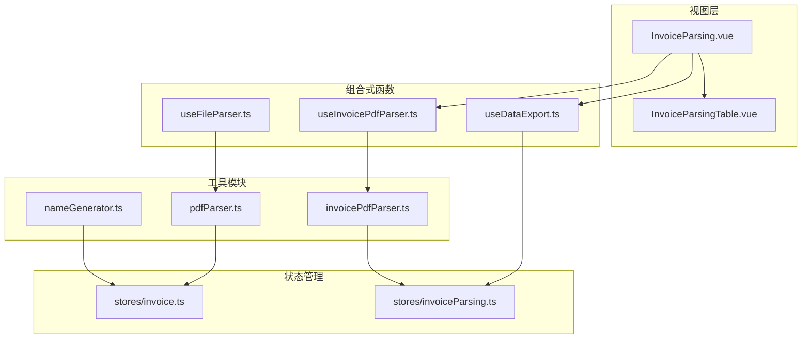
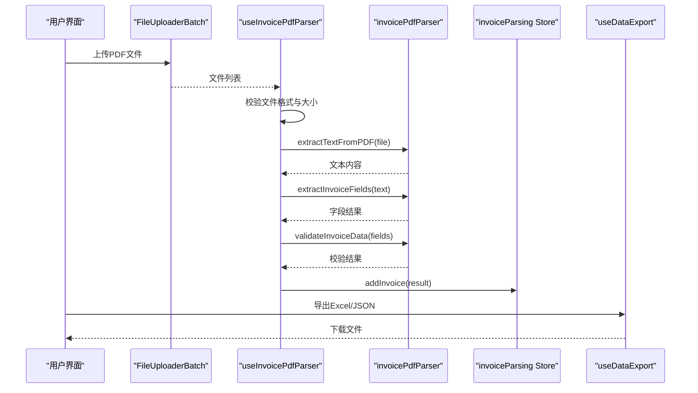
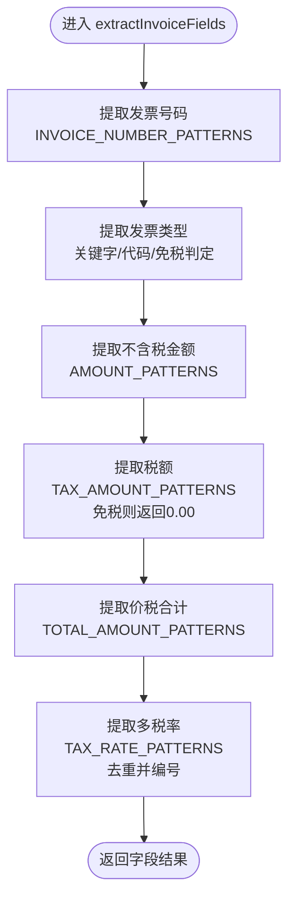
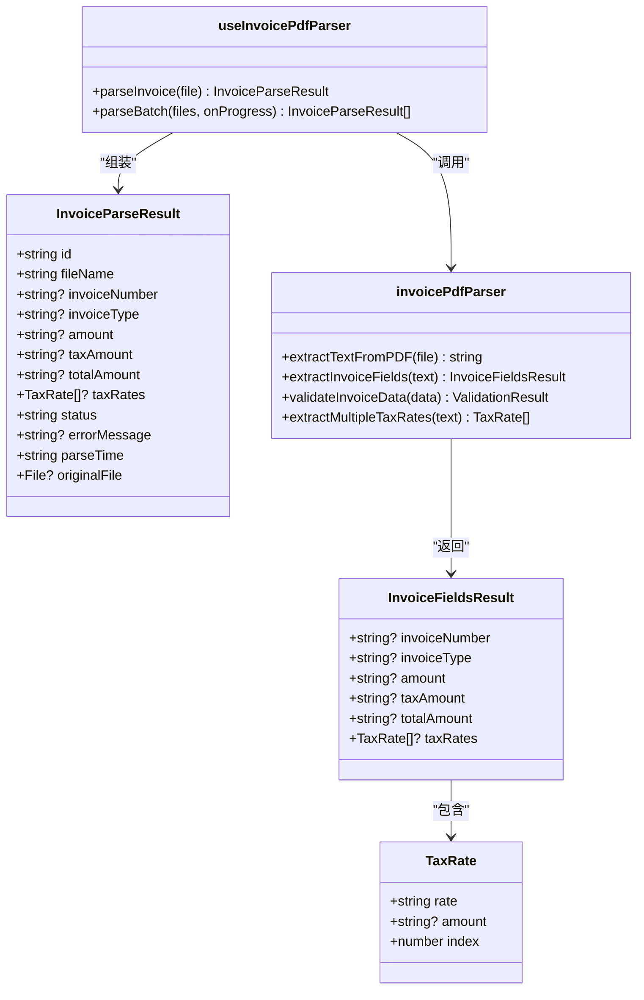

# 发票字段提取

<cite>
**本文档引用的文件**
- [invoicePdfParser.ts](file://src/utils/invoicePdfParser.ts)
- [useInvoicePdfParser.ts](file://src/composables/useInvoicePdfParser.ts)
- [pdfParser.ts](file://src/utils/pdfParser.ts)
- [invoice.ts](file://src/stores/invoice.ts)
- [invoiceParsing.ts](file://src/stores/invoiceParsing.ts)
- [nameGenerator.ts](file://src/utils/nameGenerator.ts)
- [useFileParser.ts](file://src/composables/useFileParser.ts)
- [InvoiceParsing.vue](file://src/views/InvoiceParsing.vue)
- [InvoiceParsingTable.vue](file://src/components/InvoiceParsingTable.vue)
- [useDataExport.ts](file://src/composables/useDataExport.ts)
- [README.md](file://README.md)
</cite>

## 目录
1. [简介](#简介)
2. [项目结构](#项目结构)
3. [核心组件](#核心组件)
4. [架构总览](#架构总览)
5. [详细组件分析](#详细组件分析)
6. [依赖关系分析](#依赖关系分析)
7. [性能考量](#性能考量)
8. [故障排查指南](#故障排查指南)
9. [结论](#结论)

## 简介
本项目提供发票字段提取能力，聚焦于从PDF发票中提取关键字段：发票号码、发票类型、不含税金额、税额、价税合计以及多税率行项目。系统采用正则表达式匹配与文本位置分析相结合的方式，针对中国增值税发票的常见格式特征进行解析，并支持不同开票软件生成的格式差异与动态税率识别。同时提供批量解析、进度反馈、数据校验与导出功能，便于在实际业务场景中快速落地。

## 项目结构
项目采用前端单页应用架构，核心解析逻辑集中在工具模块与组合式函数中，状态管理由Pinia Store承载，UI层通过Vue组件展示与交互。

图表来源
- [InvoiceParsing.vue](file://src/views/InvoiceParsing.vue#L1-L328)
- [useInvoicePdfParser.ts](file://src/composables/useInvoicePdfParser.ts#L1-L173)
- [invoicePdfParser.ts](file://src/utils/invoicePdfParser.ts#L1-L349)
- [pdfParser.ts](file://src/utils/pdfParser.ts#L1-L243)
- [InvoiceParsingTable.vue](file://src/components/InvoiceParsingTable.vue#L1-L157)
- [useDataExport.ts](file://src/composables/useDataExport.ts#L1-L308)
- [invoice.ts](file://src/stores/invoice.ts#L1-L256)
- [invoiceParsing.ts](file://src/stores/invoiceParsing.ts#L1-L241)
- [nameGenerator.ts](file://src/utils/nameGenerator.ts#L1-L250)

章节来源
- [README.md](file://README.md#L1-L41)
- [InvoiceParsing.vue](file://src/views/InvoiceParsing.vue#L1-L328)

## 核心组件
- 发票PDF解析工具：负责从PDF中抽取纯文本、构建字段提取模式、执行字段提取与验证。
- 发票PDF解析Composable：封装批量解析流程、进度反馈与结果组装。
- PDF解析工具：通用PDF文本抽取与基础发票信息提取（兼容电子发票格式）。
- 状态管理：维护发票解析结果列表、筛选与搜索、选中状态与导出数据准备。
- UI组件：表格展示解析结果，支持动态税率列、状态标签与操作按钮。
- 数据导出：支持Excel与JSON格式导出，自动计算列宽与动态税率列。

章节来源
- [invoicePdfParser.ts](file://src/utils/invoicePdfParser.ts#L1-L349)
- [useInvoicePdfParser.ts](file://src/composables/useInvoicePdfParser.ts#L1-L173)
- [pdfParser.ts](file://src/utils/pdfParser.ts#L1-L243)
- [invoiceParsing.ts](file://src/stores/invoiceParsing.ts#L1-L241)
- [InvoiceParsingTable.vue](file://src/components/InvoiceParsingTable.vue#L1-L157)
- [useDataExport.ts](file://src/composables/useDataExport.ts#L1-L308)

## 架构总览
系统围绕“文件上传 -> 文本抽取 -> 字段提取 -> 数据校验 -> 结果展示/导出”的主流程展开。解析器通过正则表达式优先匹配关键字段，结合金额有效性与逻辑一致性进行容错；多税率行项目通过全局匹配与去重策略识别并排序。

图表来源
- [InvoiceParsing.vue](file://src/views/InvoiceParsing.vue#L188-L232)
- [useInvoicePdfParser.ts](file://src/composables/useInvoicePdfParser.ts#L37-L91)
- [invoicePdfParser.ts](file://src/utils/invoicePdfParser.ts#L97-L152)
- [invoiceParsing.ts](file://src/stores/invoiceParsing.ts#L122-L128)
- [useDataExport.ts](file://src/composables/useDataExport.ts#L191-L201)

## 详细组件分析

### 发票字段提取主流程与extractInvoiceFields函数
- 输入：PDF文本字符串
- 输出：发票关键字段结构体（发票号码、发票类型、不含税金额、税额、价税合计、税率列表）
- 关键步骤：
  - 发票号码：按优先级匹配多种模式，最终校验20位数字
  - 发票类型：优先匹配“专票/普票”关键字，其次依据发票代码首数字判断，最后根据免税标记判定
  - 不含税金额/税额/价税合计：使用对应模式列表匹配首个有效金额，去除千分位与空白后转为数值
  - 多税率识别：遍历多个正则模式，提取所有合法税率（限定在中国税法常见范围），去重并按出现顺序编号

图表来源
- [invoicePdfParser.ts](file://src/utils/invoicePdfParser.ts#L138-L152)
- [invoicePdfParser.ts](file://src/utils/invoicePdfParser.ts#L159-L202)
- [invoicePdfParser.ts](file://src/utils/invoicePdfParser.ts#L205-L221)
- [invoicePdfParser.ts](file://src/utils/invoicePdfParser.ts#L224-L234)

章节来源
- [invoicePdfParser.ts](file://src/utils/invoicePdfParser.ts#L138-L152)
- [invoicePdfParser.ts](file://src/utils/invoicePdfParser.ts#L159-L202)
- [invoicePdfParser.ts](file://src/utils/invoicePdfParser.ts#L205-L221)
- [invoicePdfParser.ts](file://src/utils/invoicePdfParser.ts#L224-L234)

### 正则表达式匹配与字段映射规则
- 发票号码：支持中文冒号、英文冒号、无符号等多种书写方式，最终严格校验20位数字
- 不含税金额：覆盖“不含税金额/金额/小计/合计”等常见表述，支持多页发票与单页发票的不同金额位置
- 税额：覆盖“税额/税金”，并能从多金额行中识别第二或第三个金额
- 价税合计：覆盖“价税合计/合计”及其大小写金额形式，支持中文大写金额与小写金额
- 税率：支持“X%”、“税率: X%”、“税率/征收率 X%”等多样表述，动态识别并去重

章节来源
- [invoicePdfParser.ts](file://src/utils/invoicePdfParser.ts#L22-L67)

### 容错机制与多行项目聚合算法
- 容错策略：
  - 金额匹配时去除千分位与空白，转换为浮点数并校验非负或非负边界
  - 发票类型通过多路径判定，优先关键字，其次代码，最后免税
  - 税额为免税发票时强制返回0.00
- 多税率聚合：
  - 使用全局正则匹配所有税率，去重集合避免重复
  - 按首次出现顺序编号，形成有序列表
  - 限定合法税率集合（0/1/3/5/6/9/10/11/13/16/17）

章节来源
- [invoicePdfParser.ts](file://src/utils/invoicePdfParser.ts#L240-L283)
- [invoicePdfParser.ts](file://src/utils/invoicePdfParser.ts#L294-L334)

### 文本位置分析与布局辅助
- PDF文本抽取：使用pdf.js按页提取文本，拼接为全文本，前3页优先解析以提升性能
- 关键字段定位：通过正则表达式在文本中定位，无需复杂坐标计算
- 多页发票：若前3页未命中关键字段，继续解析剩余页面

章节来源
- [invoicePdfParser.ts](file://src/utils/invoicePdfParser.ts#L97-L129)

### 发票类型识别与格式差异处理
- 优先匹配“专票/普票”关键字，去除空格后匹配
- 依据发票代码首数字判断：专票通常以1开头，普票以2/3/4开头
- 免税发票默认视为普票

章节来源
- [invoicePdfParser.ts](file://src/utils/invoicePdfParser.ts#L169-L202)

### 动态税率识别与多行项目支持
- 通过全局正则模式扫描全文，提取所有可能的税率
- 去重并保持出现顺序，形成动态列展示
- 在UI层根据最大税率数量动态生成列宽与列标题

章节来源
- [invoicePdfParser.ts](file://src/utils/invoicePdfParser.ts#L224-L234)
- [InvoiceParsingTable.vue](file://src/components/InvoiceParsingTable.vue#L82-L98)
- [invoiceParsing.ts](file://src/stores/invoiceParsing.ts#L105-L114)

### 数据验证与质量控制
- 发票号码：必须为20位数字
- 金额/价税合计：必须为正数
- 税额：必须为非负数且不大于价税合计
- 税率：必须在0%-100%范围内，或为“免税”

章节来源
- [invoicePdfParser.ts](file://src/utils/invoicePdfParser.ts#L294-L334)

### 批量解析与进度反馈
- 批次大小：每批10个文件，批次间串行、批次内并发
- 进度回调：每个文件完成后更新进度百分比与当前文件名
- 结果组装：包含唯一ID、文件名、字段、状态与错误信息

章节来源
- [useInvoicePdfParser.ts](file://src/composables/useInvoicePdfParser.ts#L96-L153)

### UI展示与导出
- 表格列：基础列（文件名、发票号码、类型、金额、税额、价税合计）+ 动态税率列 + 状态与失败原因 + 操作
- 导出：Excel自动设置列宽与动态税率列，JSON格式化输出
- 交互：全选/清空、删除、导出多种模式

章节来源
- [InvoiceParsing.vue](file://src/views/InvoiceParsing.vue#L1-L328)
- [InvoiceParsingTable.vue](file://src/components/InvoiceParsingTable.vue#L1-L157)
- [useDataExport.ts](file://src/composables/useDataExport.ts#L1-L308)

## 依赖关系分析

图表来源
- [invoicePdfParser.ts](file://src/utils/invoicePdfParser.ts#L76-L88)
- [invoicePdfParser.ts](file://src/utils/invoicePdfParser.ts#L138-L152)
- [invoicePdfParser.ts](file://src/utils/invoicePdfParser.ts#L224-L234)
- [useInvoicePdfParser.ts](file://src/composables/useInvoicePdfParser.ts#L29-L91)
- [invoiceParsing.ts](file://src/stores/invoiceParsing.ts#L18-L31)

章节来源
- [invoicePdfParser.ts](file://src/utils/invoicePdfParser.ts#L1-L349)
- [useInvoicePdfParser.ts](file://src/composables/useInvoicePdfParser.ts#L1-L173)
- [invoiceParsing.ts](file://src/stores/invoiceParsing.ts#L1-L241)

## 性能考量
- PDF文本抽取：仅解析前3页作为快速通道，若未命中再解析剩余页面，平衡准确性与性能
- 批量解析：批次大小为10，批次间串行、批次内并发，避免内存峰值过高
- 正则匹配：按优先级顺序匹配，命中即返回，减少无效匹配
- UI渲染：动态列根据最大税率数量计算宽度，避免列溢出

章节来源
- [invoicePdfParser.ts](file://src/utils/invoicePdfParser.ts#L97-L129)
- [useInvoicePdfParser.ts](file://src/composables/useInvoicePdfParser.ts#L96-L153)
- [InvoiceParsingTable.vue](file://src/components/InvoiceParsingTable.vue#L137-L137)

## 故障排查指南
- PDF文本提取失败：检查文件是否为PDF、大小是否超过限制（10MB）、网络与worker配置
- 字段提取失败：确认发票模板是否包含关键字段文本；必要时调整正则模式
- 数据校验失败：核对金额与税率范围、免税发票的税额是否为0.00
- 导出异常：确保有可导出数据、浏览器支持Blob与file-saver

章节来源
- [useInvoicePdfParser.ts](file://src/composables/useInvoicePdfParser.ts#L42-L49)
- [invoicePdfParser.ts](file://src/utils/invoicePdfParser.ts#L125-L128)
- [invoicePdfParser.ts](file://src/utils/invoicePdfParser.ts#L294-L334)
- [useDataExport.ts](file://src/composables/useDataExport.ts#L58-L60)

## 结论
本系统通过精心设计的正则表达式模式与稳健的容错策略，实现了对中国增值税发票关键字段的高准确率提取，并具备良好的扩展性与可维护性。结合动态税率识别与多行项目聚合，能够适配不同开票软件的格式差异。配合批量解析、进度反馈与导出功能，满足企业级发票处理的实际需求。