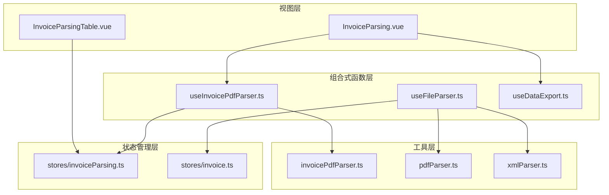
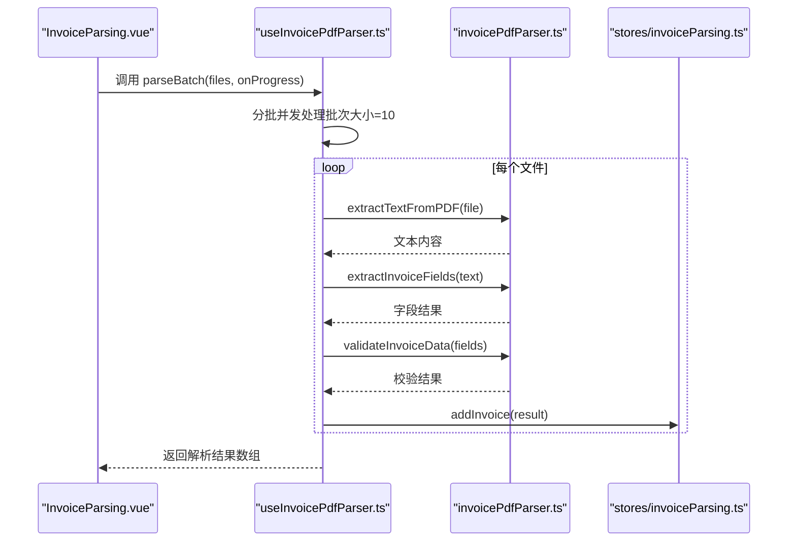
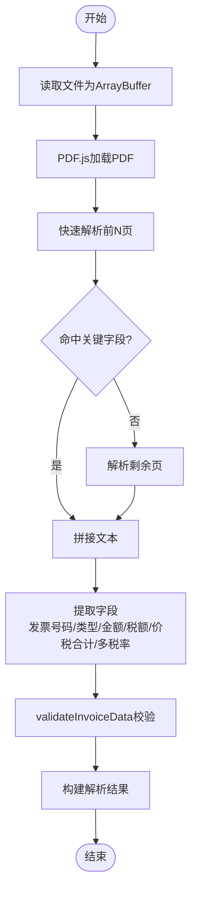
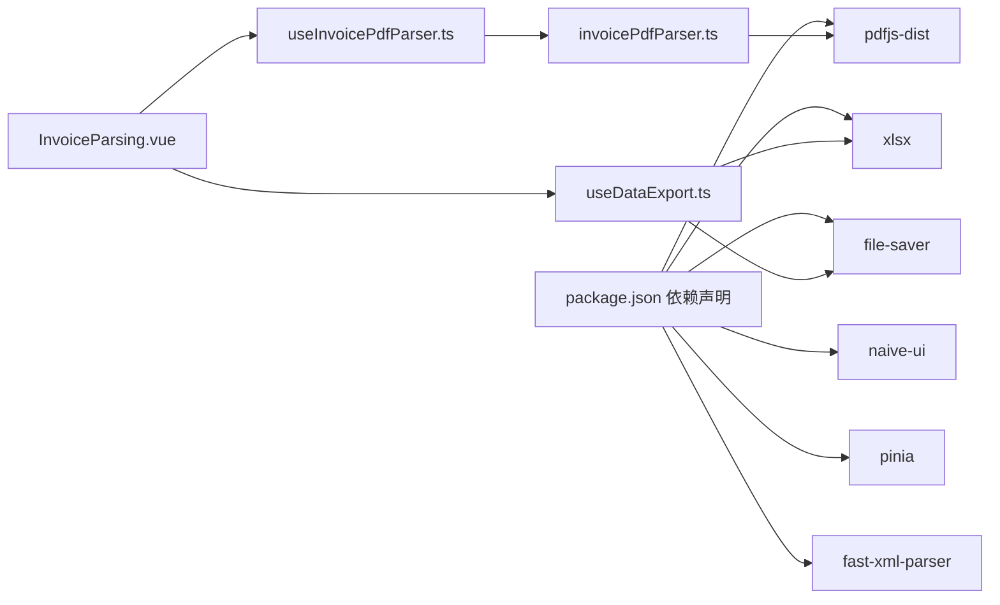

# 发票解析引擎

<cite>
**本文引用的文件**
- [useInvoicePdfParser.ts](file://src/composables/useInvoicePdfParser.ts)
- [invoicePdfParser.ts](file://src/utils/invoicePdfParser.ts)
- [pdfParser.ts](file://src/utils/pdfParser.ts)
- [invoice.ts](file://src/stores/invoice.ts)
- [invoiceParsing.ts](file://src/stores/invoiceParsing.ts)
- [InvoiceParsing.vue](file://src/views/InvoiceParsing.vue)
- [InvoiceParsingTable.vue](file://src/components/InvoiceParsingTable.vue)
- [useFileParser.ts](file://src/composables/useFileParser.ts)
- [xmlParser.ts](file://src/utils/xmlParser.ts)
- [useDataExport.ts](file://src/composables/useDataExport.ts)
- [package.json](file://package.json)
- [README.md](file://README.md)
</cite>

## 更新摘要
**变更内容**
- 更新了发票解析引擎以支持基于坐标的PDF解析，重构为四层ETL管道
- 增强了字段提取准确性和财务一致性验证
- 新增了基于坐标的锚点定位法和降级机制
- 优化了数据验证逻辑，增加了金额校验的逻辑闭环校验

## 目录
1. [简介](#简介)
2. [项目结构](#项目结构)
3. [核心组件](#核心组件)
4. [架构总览](#架构总览)
5. [详细组件分析](#详细组件分析)
6. [依赖关系分析](#依赖关系分析)
7. [性能考量](#性能考量)
8. [故障排查指南](#故障排查指南)
9. [结论](#结论)

## 简介
本项目是一个基于 Vue 3 的发票处理工具集，重点围绕“发票解析引擎”展开，提供 PDF 发票的批量解析能力，支持从 PDF 中提取发票号码、发票类型、金额、税额、价税合计以及多税率场景下的行项目信息，并进行数据合理性校验与导出功能。本文聚焦于 useInvoicePdfParser 组合式函数如何协调 pdfParser 工具与 invoicePdfParser 解析器，完成 PDF 发票内容提取与解析的完整流程。

## 项目结构
项目采用前端单页应用架构，主要目录与职责如下：
- src/composables：组合式函数，封装业务逻辑（如解析、导出、文件处理）
- src/utils：底层工具模块（PDF 文本提取、发票字段提取、XML 解析等）
- src/stores：Pinia 状态管理（发票解析结果、发票数据）
- src/views 与 src/components：页面与表格组件
- package.json：依赖声明（含 pdfjs-dist、naive-ui、pinia 等）

图表来源
- [InvoiceParsing.vue](file://src/views/InvoiceParsing.vue#L122-L232)
- [useInvoicePdfParser.ts](file://src/composables/useInvoicePdfParser.ts#L29-L171)
- [invoicePdfParser.ts](file://src/utils/invoicePdfParser.ts#L97-L152)
- [pdfParser.ts](file://src/utils/pdfParser.ts#L31-L192)
- [xmlParser.ts](file://src/utils/xmlParser.ts#L42-L141)
- [invoiceParsing.ts](file://src/stores/invoiceParsing.ts#L62-L240)
- [invoice.ts](file://src/stores/invoice.ts#L63-L256)

章节来源
- [README.md](file://README.md#L1-L41)
- [package.json](file://package.json#L12-L23)

## 核心组件
- useInvoicePdfParser：负责单文件与批量解析、进度反馈、状态管理与错误兜底
- invoicePdfParser：基于 PDF.js 的 PDF 文本提取与发票字段提取、多税率识别、数据验证
- pdfParser：通用 PDF 文本提取与发票信息提取（面向另一种发票格式）
- stores/invoiceParsing：发票解析结果的状态管理（含多税率列动态渲染）
- InvoiceParsing.vue：页面入口，绑定解析流程与进度展示
- InvoiceParsingTable.vue：动态列渲染（多税率列），支持筛选、搜索、删除等操作
- useDataExport：Excel/JSON 导出，支持动态列适配

章节来源
- [useInvoicePdfParser.ts](file://src/composables/useInvoicePdfParser.ts#L29-L171)
- [invoicePdfParser.ts](file://src/utils/invoicePdfParser.ts#L97-L349)
- [pdfParser.ts](file://src/utils/pdfParser.ts#L31-L243)
- [invoiceParsing.ts](file://src/stores/invoiceParsing.ts#L18-L241)
- [InvoiceParsing.vue](file://src/views/InvoiceParsing.vue#L122-L232)
- [InvoiceParsingTable.vue](file://src/components/InvoiceParsingTable.vue#L34-L157)
- [useDataExport.ts](file://src/composables/useDataExport.ts#L39-L308)

## 架构总览
useInvoicePdfParser 作为协调者，串联以下流程：
- 输入校验（文件类型与大小）
- PDF 文本提取（PDF.js）
- 字段提取（发票号码、类型、金额、税额、价税合计、多税率）
- 数据验证（validateInvoiceData）
- 结果构建与状态回传（Pinia store）

图表来源
- [InvoiceParsing.vue](file://src/views/InvoiceParsing.vue#L188-L232)
- [useInvoicePdfParser.ts](file://src/composables/useInvoicePdfParser.ts#L96-L153)
- [invoicePdfParser.ts](file://src/utils/invoicePdfParser.ts#L97-L152)

## 详细组件分析

### useInvoicePdfParser 组合式函数
- 职责
  - 单文件解析：校验文件、提取文本、提取字段、数据验证、构建结果
  - 批量解析：分批并发（批次大小=10）、进度回调、状态管理
  - 异常处理：捕获错误并返回失败结果，避免中断整体流程
- 关键点
  - 文件校验：扩展名与 MIME 类型检查、大小限制
  - 文本提取：调用 invoicePdfParser.extractTextFromPDF
  - 字段提取：调用 invoicePdfParser.extractInvoiceFields
  - 数据验证：调用 invoicePdfParser.validateInvoiceData
  - 状态与进度：isProcessing、progress、currentFile 三态驱动 UI

章节来源
- [useInvoicePdfParser.ts](file://src/composables/useInvoicePdfParser.ts#L29-L171)

### invoicePdfParser 工具模块
- PDF 文本提取
  - 使用 PDF.js 加载 PDF，逐页提取文本
  - 快速解析前 MAX_PAGES_QUICK_PARSE 页，若未命中关键字段再继续解析剩余页
- 字段提取
  - 发票号码：多正则模式匹配，限定 20 位数字
  - 发票类型：优先关键字匹配，其次通过发票代码首数字判断
  - 金额/税额/价税合计：多模式匹配，优先取首个有效金额；免税发票税额直接为 0.00
  - 多税率：支持多种正则提取，去重并限定合法税率集合
- 数据验证
  - 校验发票号码格式、金额/税额/价税合计数值范围与相互关系
  - 校验税率范围与有效性

图表来源
- [invoicePdfParser.ts](file://src/utils/invoicePdfParser.ts#L97-L129)
- [invoicePdfParser.ts](file://src/utils/invoicePdfParser.ts#L138-L152)
- [invoicePdfParser.ts](file://src/utils/invoicePdfParser.ts#L294-L334)

章节来源
- [invoicePdfParser.ts](file://src/utils/invoicePdfParser.ts#L97-L349)

### PDF.js 文本逐页读取与字段定位策略
- 逐页读取：通过 PDF.js getPage/getTextContent 获取每页文本项并拼接
- 关键字段识别：通过多组正则表达式优先级匹配，覆盖不同发票排版风格
- 位置与上下文：针对多页发票采用“取第二个/第三个金额”的模式，针对大写金额采用“大写后金额”的模式
- 多税率：使用全局正则匹配并去重，限定合法税率集合（如 0/1/3/5/6/9/10/11/13/16/17）

章节来源
- [invoicePdfParser.ts](file://src/utils/invoicePdfParser.ts#L106-L122)
- [invoicePdfParser.ts](file://src/utils/invoicePdfParser.ts#L22-L67)
- [invoicePdfParser.ts](file://src/utils/invoicePdfParser.ts#L224-L283)

### 数据验证逻辑（validateInvoiceData）
- 发票号码：必须为 20 位数字
- 金额/价税合计：必须为正数
- 税额：必须为非负数，且不能大于价税合计
- 多税率：必须在合法范围内（0-100），且为百分比字符串
- 返回结构：valid 与 errors 数组，便于 UI 展示与后续处理

章节来源
- [invoicePdfParser.ts](file://src/utils/invoicePdfParser.ts#L294-L334)

### 异常处理机制
- 文件读取失败：FileReader 抛出错误，统一包装为“文件读取失败”
- PDF 文本提取失败：PDF.js 加载或文本提取异常，抛出“PDF文本提取失败”
- 字段提取失败：正则匹配不到或解析异常，抛出“发票字段提取失败”
- 单文件解析失败：捕获异常并返回失败结果，保留错误信息
- 批量解析：逐文件处理，错误不影响其他文件；最终统一抛出或返回

章节来源
- [invoicePdfParser.ts](file://src/utils/invoicePdfParser.ts#L125-L128)
- [invoicePdfParser.ts](file://src/utils/invoicePdfParser.ts#L148-L151)
- [useInvoicePdfParser.ts](file://src/composables/useInvoicePdfParser.ts#L77-L90)

### 解析性能优化
- 分批并发：批次大小固定为 10，批次间串行、批次内并发，平衡吞吐与资源占用
- 快速解析：先解析前 N 页，若未命中关键字段再继续解析剩余页，减少不必要的 IO
- 正则优先级：按命中概率与稳定性排序，提高成功率与速度
- 动态列渲染：根据最大税率数量动态计算列宽，避免冗余渲染

章节来源
- [useInvoicePdfParser.ts](file://src/composables/useInvoicePdfParser.ts#L13-L14)
- [useInvoicePdfParser.ts](file://src/composables/useInvoicePdfParser.ts#L109-L112)
- [useInvoicePdfParser.ts](file://src/composables/useInvoicePdfParser.ts#L121-L137)
- [InvoiceParsingTable.vue](file://src/components/InvoiceParsingTable.vue#L82-L98)
- [InvoiceParsingTable.vue](file://src/components/InvoiceParsingTable.vue#L137)

### 多税率场景支持
- 多正则提取：支持“金额+税率”、“税率+金额”、“单独税率”等多种布局
- 去重与索引：使用 Set 去重，index 用于动态列展示
- 合法性校验：限定合法税率集合，确保业务可用性

章节来源
- [invoicePdfParser.ts](file://src/utils/invoicePdfParser.ts#L63-L67)
- [invoicePdfParser.ts](file://src/utils/invoicePdfParser.ts#L265-L283)
- [invoiceParsing.ts](file://src/stores/invoiceParsing.ts#L10-L15)

### 与 UI 的集成
- 页面入口：InvoiceParsing.vue 接收文件，调用 parseBatch，绑定进度与结果
- 表格组件：InvoiceParsingTable.vue 动态渲染多税率列，支持筛选、搜索、删除
- 状态管理：stores/invoiceParsing.ts 统一维护解析结果列表与筛选条件

章节来源
- [InvoiceParsing.vue](file://src/views/InvoiceParsing.vue#L188-L232)
- [InvoiceParsingTable.vue](file://src/components/InvoiceParsingTable.vue#L34-L157)
- [invoiceParsing.ts](file://src/stores/invoiceParsing.ts#L62-L241)

## 依赖关系分析
- 外部依赖
  - pdfjs-dist：PDF.js 核心库，负责 PDF 文本提取
  - naive-ui：UI 组件库，提供表格、按钮、进度条等
  - pinia：状态管理
  - xlsx、file-saver：Excel 导出与下载
  - fast-xml-parser：XML 解析（与 PDF 解析并存）
- 内部依赖
  - useInvoicePdfParser 依赖 invoicePdfParser
  - InvoiceParsing.vue 依赖 useInvoicePdfParser 与 useDataExport
  - InvoiceParsingTable.vue 依赖 stores/invoiceParsing

图表来源
- [package.json](file://package.json#L12-L23)
- [InvoiceParsing.vue](file://src/views/InvoiceParsing.vue#L142-L151)
- [useInvoicePdfParser.ts](file://src/composables/useInvoicePdfParser.ts#L5-L11)
- [useDataExport.ts](file://src/composables/useDataExport.ts#L6-L8)

章节来源
- [package.json](file://package.json#L12-L23)

## 性能考量
- 并发策略：批次大小=10，既能提升吞吐又避免内存峰值过高
- 快速解析：前 N 页命中即停止，降低 IO 时间
- 正则优化：优先匹配高命中率模式，减少回溯
- 渲染优化：动态列宽度按最大税率数量计算，避免重复渲染
- 导出优化：Excel/JSON 导出采用一次性生成与下载，避免多次 DOM 操作

## 故障排查指南
- 常见问题与定位
  - PDF 文本为空或关键字段缺失：检查发票是否加密、字体嵌入情况；确认正则模式是否覆盖该发票样式
  - 金额/税额/价税合计不一致：查看 validateInvoiceData 的错误信息，核对原始文本中的金额格式
  - 多税率识别异常：确认税率正则是否匹配目标发票格式，检查合法税率集合
  - 批量解析中断：单文件异常会被捕获并返回失败结果，不影响其他文件；可在 UI 中查看失败原因
- 调试建议
  - 开启开发模式日志：观察 PDF.js 加载页数、文本长度、字段匹配过程
  - 使用浏览器开发者工具：断点 invoicePdfParser 的字段提取函数，逐步检查正则匹配结果
  - 导出中间结果：将提取的文本与字段写入临时文件或控制台，便于复现问题

章节来源
- [invoicePdfParser.ts](file://src/utils/invoicePdfParser.ts#L97-L129)
- [invoicePdfParser.ts](file://src/utils/invoicePdfParser.ts#L138-L152)
- [invoicePdfParser.ts](file://src/utils/invoicePdfParser.ts#L294-L334)
- [useInvoicePdfParser.ts](file://src/composables/useInvoicePdfParser.ts#L77-L90)

## 结论
useInvoicePdfParser 通过清晰的职责划分与稳健的异常处理，将 PDF.js 的文本提取能力与 invoicePdfParser 的字段提取与验证逻辑有机结合，实现了对 PDF 发票的高效、可靠解析。其分批并发与快速解析策略兼顾性能与稳定性，多税率支持满足复杂发票场景需求。配合 Pinia 状态管理与 UI 组件，形成从输入到输出的完整闭环，适合在企业财务自动化场景中部署与扩展。