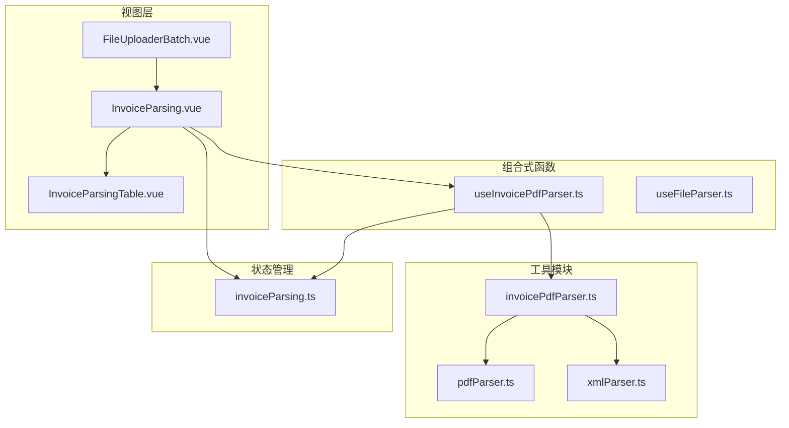
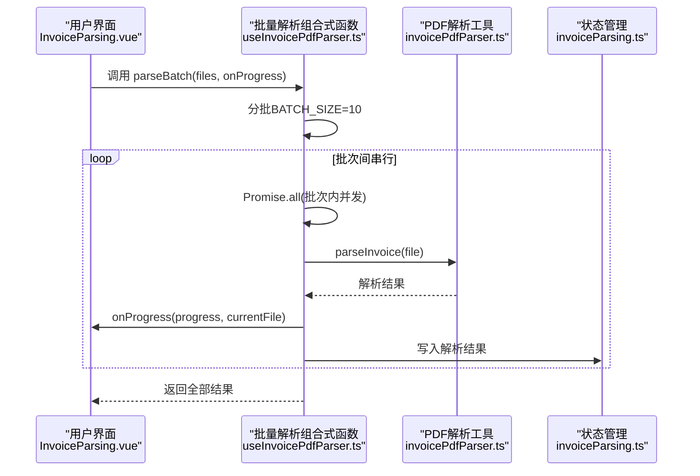
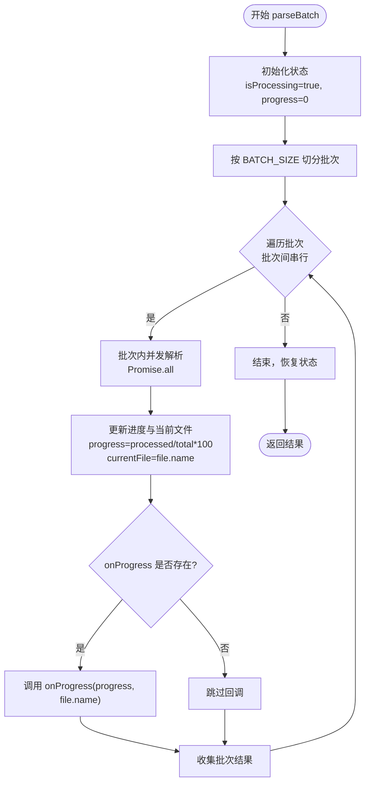
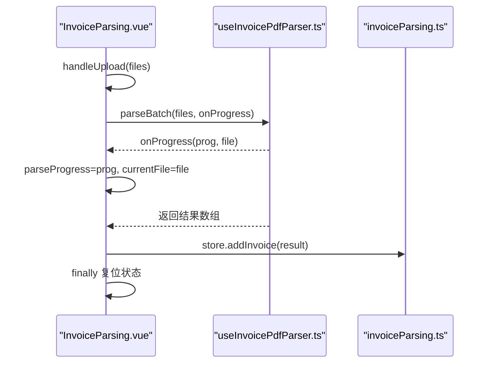
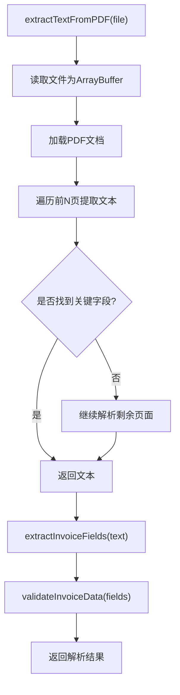
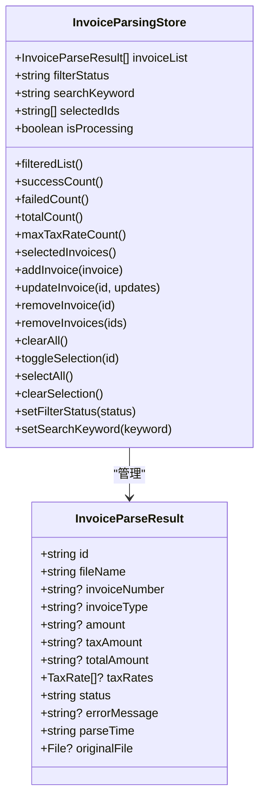
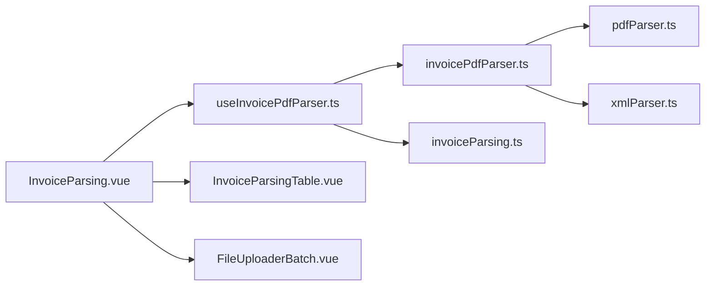

# 批量处理引擎

<cite>
**本文档引用的文件**
- [useInvoicePdfParser.ts](file://src/composables/useInvoicePdfParser.ts)
- [InvoiceParsing.vue](file://src/views/InvoiceParsing.vue)
- [invoicePdfParser.ts](file://src/utils/invoicePdfParser.ts)
- [invoiceParsing.ts](file://src/stores/invoiceParsing.ts)
- [FileUploaderBatch.vue](file://src/components/FileUploaderBatch.vue)
- [InvoiceParsingTable.vue](file://src/components/InvoiceParsingTable.vue)
- [pdfParser.ts](file://src/utils/pdfParser.ts)
- [xmlParser.ts](file://src/utils/xmlParser.ts)
</cite>

## 目录
1. [简介](#简介)
2. [项目结构](#项目结构)
3. [核心组件](#核心组件)
4. [架构总览](#架构总览)
5. [详细组件分析](#详细组件分析)
6. [依赖关系分析](#依赖关系分析)
7. [性能考量](#性能考量)
8. [故障排查指南](#故障排查指南)
9. [结论](#结论)

## 简介
本项目是一个基于 Vue 3 的发票批量解析工具，重点围绕“批次间串行、批次内并发”的处理模式，通过分批策略（BATCH_SIZE）在性能与浏览器内存压力之间取得平衡。本文档深入剖析批量发票解析的并发控制机制，详细说明：
- parseBatch 函数如何实现“批次间串行、批次内并发”
- Promise.all 在并发解析中的应用
- 进度计算逻辑（progress.value 更新）
- 当前处理文件的追踪（currentFile）
- onProgress 回调的触发时机
- 性能调优建议（如调整批大小以适配不同设备）

## 项目结构
项目采用前端单页应用架构，主要由视图层、组合式函数（Composables）、工具模块和状态管理组成。批量解析流程的关键路径如下：
- 视图层负责用户交互与进度展示
- 组合式函数封装解析逻辑与并发控制
- 工具模块提供 PDF/XML 解析与字段提取
- 状态管理维护解析结果与筛选条件

图表来源
- [InvoiceParsing.vue](file://src/views/InvoiceParsing.vue#L122-L232)
- [useInvoicePdfParser.ts](file://src/composables/useInvoicePdfParser.ts#L29-L172)
- [invoicePdfParser.ts](file://src/utils/invoicePdfParser.ts#L1-L349)
- [pdfParser.ts](file://src/utils/pdfParser.ts#L1-L243)
- [xmlParser.ts](file://src/utils/xmlParser.ts#L1-L141)
- [invoiceParsing.ts](file://src/stores/invoiceParsing.ts#L1-L241)
- [InvoiceParsingTable.vue](file://src/components/InvoiceParsingTable.vue#L1-L157)
- [FileUploaderBatch.vue](file://src/components/FileUploaderBatch.vue#L1-L79)

章节来源
- [InvoiceParsing.vue](file://src/views/InvoiceParsing.vue#L1-L328)
- [useInvoicePdfParser.ts](file://src/composables/useInvoicePdfParser.ts#L1-L173)
- [invoicePdfParser.ts](file://src/utils/invoicePdfParser.ts#L1-L349)
- [invoiceParsing.ts](file://src/stores/invoiceParsing.ts#L1-L241)
- [FileUploaderBatch.vue](file://src/components/FileUploaderBatch.vue#L1-L79)
- [InvoiceParsingTable.vue](file://src/components/InvoiceParsingTable.vue#L1-L157)

## 核心组件
- 批量解析组合式函数：提供 parseBatch 与 parseInvoice，实现“批次间串行、批次内并发”的解析策略，并提供进度与当前文件追踪。
- 视图层：负责触发批量解析、接收进度回调、更新 UI 进度与当前文件显示。
- 工具模块：封装 PDF 文本提取、字段提取与数据验证，以及 XML 解析与验证。
- 状态管理：维护解析结果列表、筛选状态、搜索关键词与选中项，支撑表格渲染与导出功能。

章节来源
- [useInvoicePdfParser.ts](file://src/composables/useInvoicePdfParser.ts#L29-L172)
- [InvoiceParsing.vue](file://src/views/InvoiceParsing.vue#L122-L232)
- [invoicePdfParser.ts](file://src/utils/invoicePdfParser.ts#L1-L349)
- [xmlParser.ts](file://src/utils/xmlParser.ts#L1-L141)
- [invoiceParsing.ts](file://src/stores/invoiceParsing.ts#L1-L241)

## 架构总览
批量解析的整体流程如下：
- 用户上传文件后，视图层调用批量解析函数
- 批量解析函数将文件按固定批次大小切分为多个批次
- 每个批次内部使用 Promise.all 并发解析文件
- 每个文件解析完成后，立即更新进度与当前文件信息
- 最终将结果汇总并写入状态管理，驱动 UI 展示

图表来源
- [InvoiceParsing.vue](file://src/views/InvoiceParsing.vue#L208-L212)
- [useInvoicePdfParser.ts](file://src/composables/useInvoicePdfParser.ts#L96-L153)
- [invoicePdfParser.ts](file://src/utils/invoicePdfParser.ts#L1-L349)
- [invoiceParsing.ts](file://src/stores/invoiceParsing.ts#L1-L241)

## 详细组件分析

### 批量解析组合式函数（useInvoicePdfParser）
该组合式函数是批量处理引擎的核心，负责：
- 定义批次大小常量（BATCH_SIZE=10），平衡性能与内存占用
- 实现 parseInvoice：对单个文件进行格式校验、文本提取、字段提取与数据验证
- 实现 parseBatch：将文件分批、批次间串行、批次内并发，实时更新进度与当前文件

关键实现要点：
- 分批策略：通过循环步进 BATCH_SIZE 将文件数组切分为多个批次
- 并发控制：批次内使用 Promise.all 对每个文件异步解析，提升吞吐
- 进度计算：每完成一个文件，累计 processedFiles 并计算百分比进度
- 实时反馈：每次文件解析完成后触发 onProgress 回调，传入当前进度与文件名
- 状态管理：维护 isProcessing、progress、currentFile 三类状态

图表来源
- [useInvoicePdfParser.ts](file://src/composables/useInvoicePdfParser.ts#L96-L153)

章节来源
- [useInvoicePdfParser.ts](file://src/composables/useInvoicePdfParser.ts#L13-L153)

### 视图层集成（InvoiceParsing.vue）
视图层负责：
- 接收用户上传的文件列表
- 调用 parseBatch 并传入进度回调
- 将解析结果写入状态管理，驱动表格渲染
- 显示进度模态框，包含进度百分比与当前文件名

关键实现要点：
- 通过 onProgress 回调更新 parseProgress 与 currentFile
- finally 中统一复位 isProcessing、进度与当前文件
- 将解析结果逐条添加到状态管理，触发 UI 更新

图表来源
- [InvoiceParsing.vue](file://src/views/InvoiceParsing.vue#L188-L232)
- [useInvoicePdfParser.ts](file://src/composables/useInvoicePdfParser.ts#L96-L153)
- [invoiceParsing.ts](file://src/stores/invoiceParsing.ts#L212-L239)

章节来源
- [InvoiceParsing.vue](file://src/views/InvoiceParsing.vue#L188-L232)

### PDF 解析工具（invoicePdfParser.ts）
该工具模块提供：
- PDF 文本提取：读取文件为 ArrayBuffer，加载 PDF 文档，按页提取文本
- 字段提取：从文本中提取发票号码、发票类型、金额、税额、价税合计与税率
- 数据验证：对提取字段进行格式与范围校验，生成验证结果

图表来源
- [invoicePdfParser.ts](file://src/utils/invoicePdfParser.ts#L97-L129)
- [invoicePdfParser.ts](file://src/utils/invoicePdfParser.ts#L138-L152)
- [invoicePdfParser.ts](file://src/utils/invoicePdfParser.ts#L294-L334)

章节来源
- [invoicePdfParser.ts](file://src/utils/invoicePdfParser.ts#L97-L129)
- [invoicePdfParser.ts](file://src/utils/invoicePdfParser.ts#L138-L152)
- [invoicePdfParser.ts](file://src/utils/invoicePdfParser.ts#L294-L334)

### 状态管理（invoiceParsing.ts）
状态管理负责：
- 维护发票解析结果列表、筛选状态、搜索关键词与选中项
- 提供计算属性：过滤后的列表、成功/失败/总数统计、最大税率数量
- 提供增删改查与清空等方法，支撑 UI 交互与导出功能

图表来源
- [invoiceParsing.ts](file://src/stores/invoiceParsing.ts#L17-L60)
- [invoiceParsing.ts](file://src/stores/invoiceParsing.ts#L62-L240)

章节来源
- [invoiceParsing.ts](file://src/stores/invoiceParsing.ts#L17-L60)
- [invoiceParsing.ts](file://src/stores/invoiceParsing.ts#L62-L240)

### 文件上传组件（FileUploaderBatch.vue）
该组件提供：
- 多文件上传与拖拽支持
- 收集文件并在短延迟后统一触发上传事件
- 限制最大上传数量与文件类型

章节来源
- [FileUploaderBatch.vue](file://src/components/FileUploaderBatch.vue#L49-L67)

### 解析结果表格（InvoiceParsingTable.vue）
该组件提供：
- 动态列渲染：根据最大税率数量动态生成“税率N”列
- 基础列：序号、文件名、发票号码、发票类型、金额、税额、价税合计
- 状态列与失败原因列，支持删除操作
- 分页与滚动宽度自适应

章节来源
- [InvoiceParsingTable.vue](file://src/components/InvoiceParsingTable.vue#L34-L136)

## 依赖关系分析
批量解析引擎的依赖关系如下：
- 视图层依赖组合式函数提供的 parseBatch 与状态管理
- 组合式函数依赖工具模块的 PDF/文本解析与字段提取
- 工具模块依赖 PDF.js 与 fast-xml-parser 等第三方库
- 状态管理被视图层与组合式函数共同消费

图表来源
- [InvoiceParsing.vue](file://src/views/InvoiceParsing.vue#L140-L151)
- [useInvoicePdfParser.ts](file://src/composables/useInvoicePdfParser.ts#L5-L11)
- [invoicePdfParser.ts](file://src/utils/invoicePdfParser.ts#L1-L349)
- [pdfParser.ts](file://src/utils/pdfParser.ts#L1-L243)
- [xmlParser.ts](file://src/utils/xmlParser.ts#L1-L141)
- [invoiceParsing.ts](file://src/stores/invoiceParsing.ts#L1-L241)
- [InvoiceParsingTable.vue](file://src/components/InvoiceParsingTable.vue#L1-L157)
- [FileUploaderBatch.vue](file://src/components/FileUploaderBatch.vue#L1-L79)

章节来源
- [InvoiceParsing.vue](file://src/views/InvoiceParsing.vue#L140-L151)
- [useInvoicePdfParser.ts](file://src/composables/useInvoicePdfParser.ts#L5-L11)
- [invoicePdfParser.ts](file://src/utils/invoicePdfParser.ts#L1-L349)
- [pdfParser.ts](file://src/utils/pdfParser.ts#L1-L243)
- [xmlParser.ts](file://src/utils/xmlParser.ts#L1-L141)
- [invoiceParsing.ts](file://src/stores/invoiceParsing.ts#L1-L241)
- [InvoiceParsingTable.vue](file://src/components/InvoiceParsingTable.vue#L1-L157)
- [FileUploaderBatch.vue](file://src/components/FileUploaderBatch.vue#L1-L79)

## 性能考量
- 批次大小（BATCH_SIZE）的选择
  - 默认值为 10，兼顾并发吞吐与内存占用
  - 在低端设备上可适当降低批次大小，避免内存峰值过高
  - 在高性能设备上可适度提高批次大小，提升整体吞吐
- Promise.all 的并发策略
  - 批次内并发解析可显著缩短总耗时
  - 但需注意浏览器对并发请求的限制与内存峰值
- 进度更新频率
  - 每个文件完成后即更新进度，保证实时反馈
  - 对于超大文件列表，可考虑节流或合并更新以减少 UI 抖动
- PDF 文本提取优化
  - 通过快速解析前 N 页再决定是否继续解析剩余页面，减少不必要的 IO
- 内存管理
  - 解析完成后及时释放原始文件引用（如可选释放 originalFile）
  - 大量结果写入状态管理时，注意分页与虚拟化渲染

章节来源
- [useInvoicePdfParser.ts](file://src/composables/useInvoicePdfParser.ts#L13-L153)
- [invoicePdfParser.ts](file://src/utils/invoicePdfParser.ts#L97-L129)

## 故障排查指南
- 常见问题与定位
  - 文件格式不支持：检查文件扩展名与 MIME 类型
  - 文件过大：默认限制为 10MB，超出会抛出错误
  - PDF 文本提取失败：检查 PDF.js worker 加载与文档结构
  - 字段提取异常：确认发票模板与正则表达式匹配
- 错误处理与回退
  - 解析失败时返回失败结果，包含错误信息
  - 视图层捕获异常并提示用户
- 调试建议
  - 开启开发模式下的日志输出，观察解析流程
  - 使用进度回调监控当前文件与进度，便于定位卡顿环节

章节来源
- [useInvoicePdfParser.ts](file://src/composables/useInvoicePdfParser.ts#L42-L49)
- [useInvoicePdfParser.ts](file://src/composables/useInvoicePdfParser.ts#L77-L89)
- [InvoiceParsing.vue](file://src/views/InvoiceParsing.vue#L223-L231)

## 结论
本批量处理引擎通过“批次间串行、批次内并发”的策略，在保证稳定性的同时最大化解析吞吐。parseBatch 函数以固定批次大小为边界，结合 Promise.all 实现高效并发；进度与当前文件的实时反馈确保用户体验；状态管理与视图层协同，提供完整的解析结果展示与导出能力。针对不同设备性能，可通过调整批次大小实现更佳的性能与稳定性平衡。