# 数据验证机制

<cite>
**本文档引用的文件**
- [invoicePdfParser.ts](file://src/utils/invoicePdfParser.ts)
- [useInvoicePdfParser.ts](file://src/composables/useInvoicePdfParser.ts)
- [invoiceParsing.ts](file://src/stores/invoiceParsing.ts)
- [InvoiceParsingTable.vue](file://src/components/InvoiceParsingTable.vue)
- [InvoiceParsing.vue](file://src/views/InvoiceParsing.vue)
- [fileValidator.ts](file://src/utils/fileValidator.ts)
- [xmlParser.ts](file://src/utils/xmlParser.ts)
</cite>

## 目录
1. [简介](#简介)
2. [项目结构](#项目结构)
3. [核心组件](#核心组件)
4. [架构概览](#架构概览)
5. [详细组件分析](#详细组件分析)
6. [依赖关系分析](#依赖关系分析)
7. [性能考虑](#性能考虑)
8. [故障排除指南](#故障排除指南)
9. [结论](#结论)

## 简介

本项目是一个基于Vue 3的财务工具集合，专注于发票数据的自动解析和验证。本文档深入分析发票数据验证流程，特别是`validateInvoiceData`函数如何确保金额、税额与价税合计之间的数学关系正确性，以及如何检测关键字段的完整性和格式合规性。

系统采用模块化设计，包含PDF发票解析、XML数据验证、状态管理和UI反馈等多个层面，为财务人员提供了完整的发票数据处理解决方案。

## 项目结构

项目采用Vue 3 + TypeScript + Vite的现代前端技术栈，主要目录结构如下：

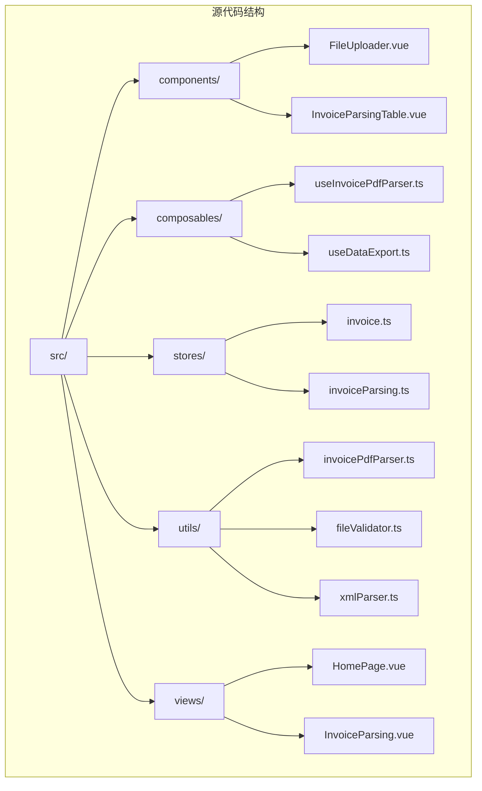

**图表来源**
- [invoicePdfParser.ts](file://src/utils/invoicePdfParser.ts#L1-L349)
- [useInvoicePdfParser.ts](file://src/composables/useInvoicePdfParser.ts#L1-L173)

**章节来源**
- [invoicePdfParser.ts](file://src/utils/invoicePdfParser.ts#L1-L349)
- [useInvoicePdfParser.ts](file://src/composables/useInvoicePdfParser.ts#L1-L173)

## 核心组件

### 发票数据验证器

系统的核心验证逻辑集中在`validateInvoiceData`函数中，该函数负责检查发票数据的关键字段和数学关系：

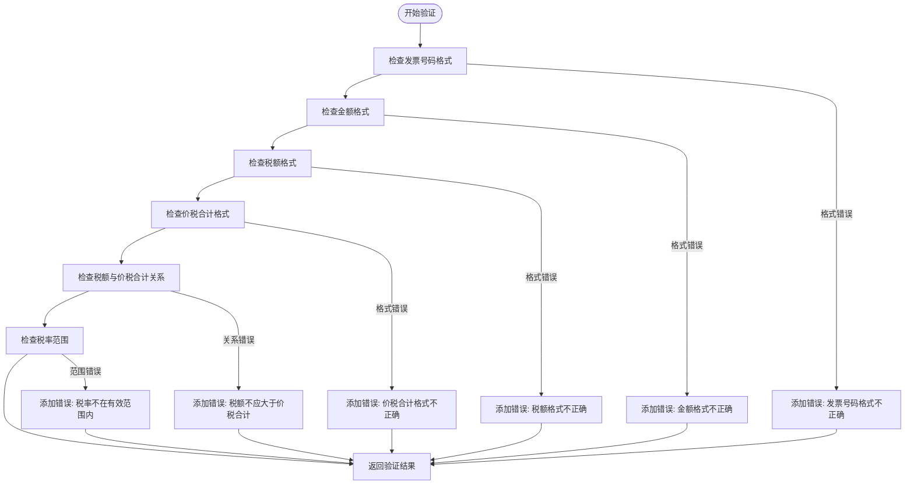

**图表来源**
- [invoicePdfParser.ts](file://src/utils/invoicePdfParser.ts#L294-L334)

### 数据结构定义

系统定义了多个关键接口来描述发票数据的不同阶段：

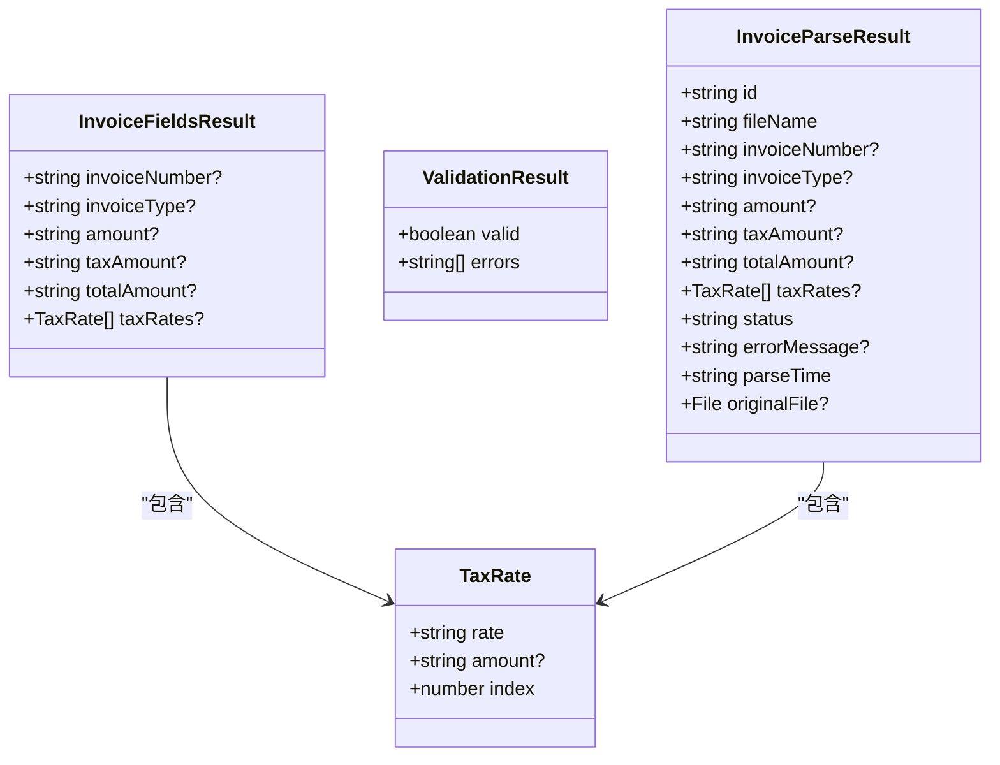

**图表来源**
- [invoicePdfParser.ts](file://src/utils/invoicePdfParser.ts#L76-L83)
- [invoiceParsing.ts](file://src/stores/invoiceParsing.ts#L11-L31)

**章节来源**
- [invoicePdfParser.ts](file://src/utils/invoicePdfParser.ts#L76-L88)
- [invoiceParsing.ts](file://src/stores/invoiceParsing.ts#L11-L31)

## 架构概览

系统采用分层架构设计，从底层的数据提取到上层的用户界面展示：

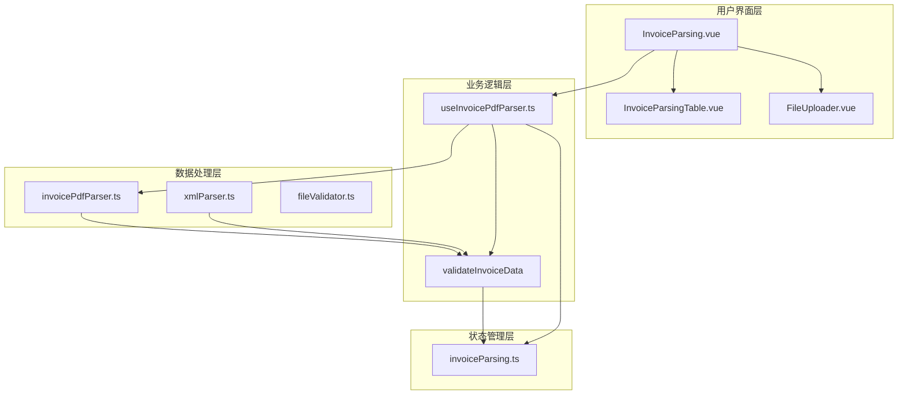

**图表来源**
- [InvoiceParsing.vue](file://src/views/InvoiceParsing.vue#L1-L328)
- [useInvoicePdfParser.ts](file://src/composables/useInvoicePdfParser.ts#L1-L173)
- [invoicePdfParser.ts](file://src/utils/invoicePdfParser.ts#L1-L349)

### 数学关系验证流程

系统特别关注金额、税额与价税合计之间的数学关系验证：

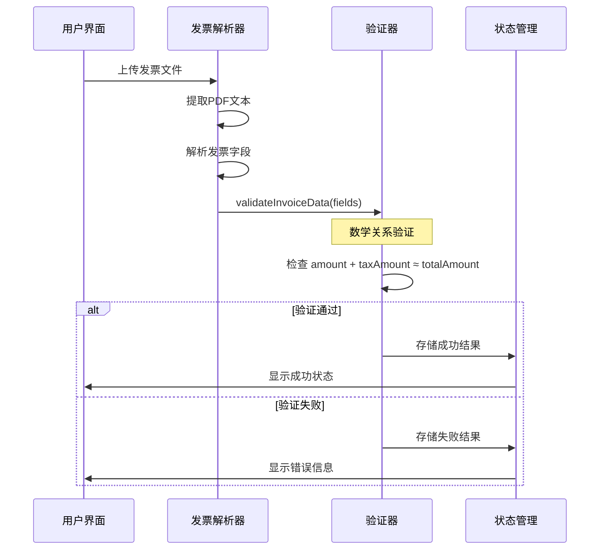

**图表来源**
- [useInvoicePdfParser.ts](file://src/composables/useInvoicePdfParser.ts#L37-L91)
- [invoicePdfParser.ts](file://src/utils/invoicePdfParser.ts#L294-L334)

**章节来源**
- [InvoiceParsing.vue](file://src/views/InvoiceParsing.vue#L188-L232)
- [useInvoicePdfParser.ts](file://src/composables/useInvoicePdfParser.ts#L37-L91)

## 详细组件分析

### validateInvoiceData 函数详解

`validateInvoiceData`函数是整个验证系统的核心，它实现了以下验证规则：

#### 字段完整性检查

1. **发票号码格式验证**
   - 必须是20位数字
   - 使用正则表达式`/^\d{20}$/`进行验证

2. **金额字段验证**
   - 必须能转换为有效的数字
   - 数值必须大于0（正数）

3. **税额字段验证**
   - 必须能转换为有效的数字
   - 数值必须大于等于0（非负数）

4. **价税合计字段验证**
   - 必须能转换为有效的数字
   - 数值必须大于0（正数）

#### 数学关系验证

系统实现了严格的数学关系验证，确保发票数据的逻辑一致性：

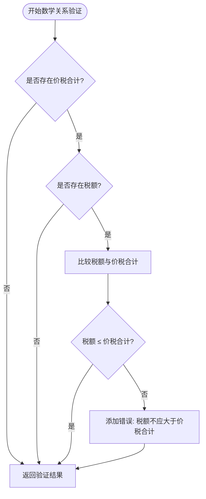

**图表来源**
- [invoicePdfParser.ts](file://src/utils/invoicePdfParser.ts#L311-L321)

#### 税率验证

系统支持多种税率格式的验证：

1. **标准税率验证**
   - 白名单包含常见税率：0, 1, 3, 5, 6, 9, 10, 11, 13, 16, 17
   - 税率值必须在0-100之间

2. **免税发票特殊处理**
   - 自动识别免税发票
   - 免税发票的税额设置为'0.00'

**章节来源**
- [invoicePdfParser.ts](file://src/utils/invoicePdfParser.ts#L294-L334)

### 发票解析流程

系统提供了完整的发票解析流程，从文件上传到结果展示：

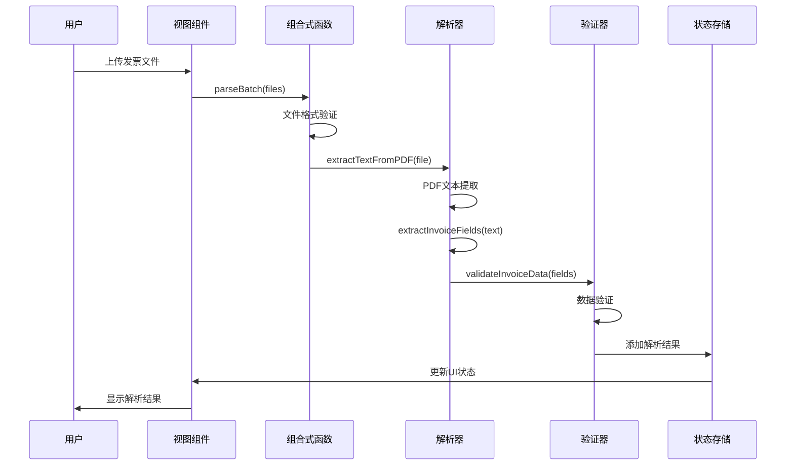

**图表来源**
- [useInvoicePdfParser.ts](file://src/composables/useInvoicePdfParser.ts#L96-L153)
- [InvoiceParsing.vue](file://src/views/InvoiceParsing.vue#L188-L232)

**章节来源**
- [useInvoicePdfParser.ts](file://src/composables/useInvoicePdfParser.ts#L37-L173)
- [InvoiceParsing.vue](file://src/views/InvoiceParsing.vue#L188-L232)

### UI层反馈机制

系统提供了多层次的用户界面反馈：

#### 实时进度显示

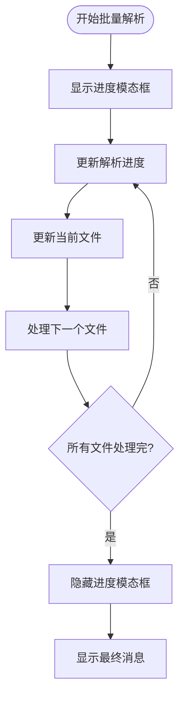

**图表来源**
- [InvoiceParsing.vue](file://src/views/InvoiceParsing.vue#L100-L119)
- [useInvoicePdfParser.ts](file://src/composables/useInvoicePdfParser.ts#L116-L153)

#### 错误信息展示

系统在表格中清晰地展示了失败原因：

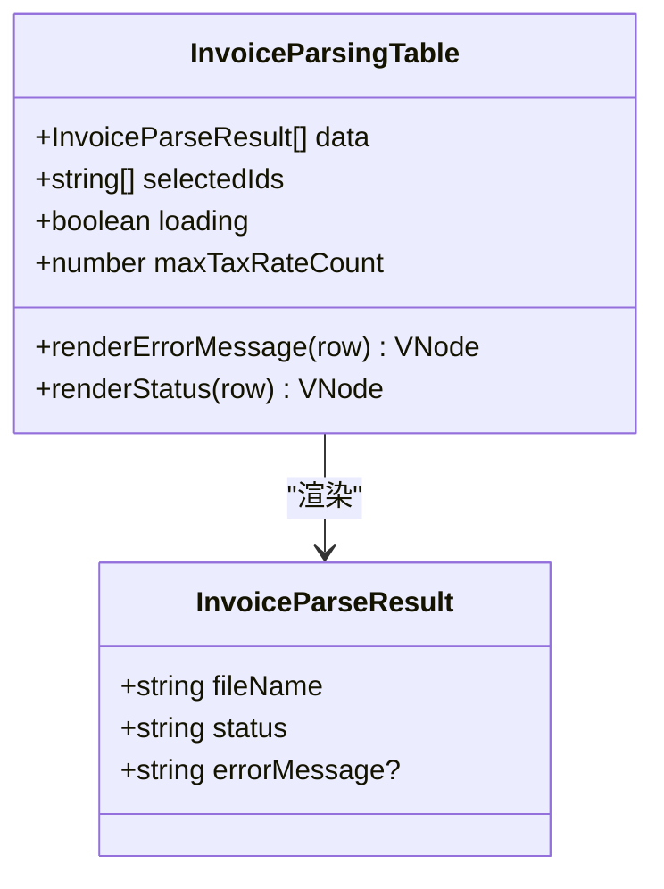

**图表来源**
- [InvoiceParsingTable.vue](file://src/components/InvoiceParsingTable.vue#L100-L134)

**章节来源**
- [InvoiceParsingTable.vue](file://src/components/InvoiceParsingTable.vue#L100-L134)

## 依赖关系分析

系统采用了清晰的依赖层次结构：

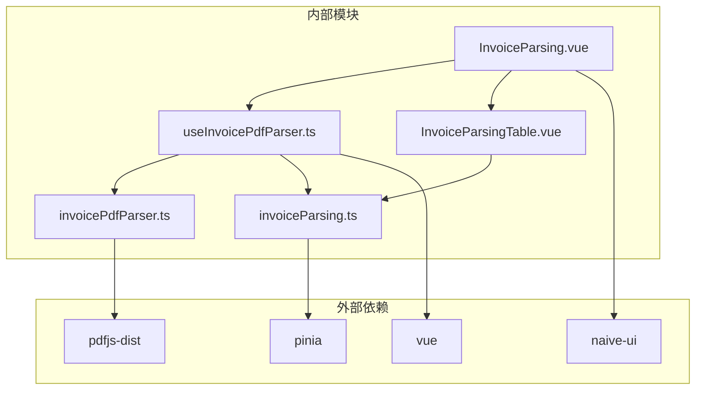

**图表来源**
- [invoicePdfParser.ts](file://src/utils/invoicePdfParser.ts#L5-L7)
- [useInvoicePdfParser.ts](file://src/composables/useInvoicePdfParser.ts#L5-L11)

**章节来源**
- [invoicePdfParser.ts](file://src/utils/invoicePdfParser.ts#L5-L13)
- [useInvoicePdfParser.ts](file://src/composables/useInvoicePdfParser.ts#L5-L11)

## 性能考虑

系统在设计时充分考虑了性能优化：

### 并发处理

- **批量解析优化**：采用分批并发处理，每批10个文件
- **进度跟踪**：实时更新解析进度，提供良好的用户体验
- **内存管理**：及时释放解析完成的文件引用

### 解析效率

- **快速预解析**：默认只解析前3页，提高响应速度
- **智能回退**：如果关键字段未找到，自动解析剩余页面
- **缓存机制**：避免重复解析相同内容

### 内存优化

- **流式处理**：PDF文本按页读取，避免一次性加载大文件
- **及时清理**：解析完成后及时清理临时数据

## 故障排除指南

### 常见问题及解决方案

#### 发票号码格式错误

**问题描述**：发票号码不是20位数字
**解决方案**：
- 检查发票原始文件是否完整
- 确认发票号码提取算法是否正确
- 验证正则表达式`/^\d{20}$/`的匹配逻辑

#### 金额格式不正确

**问题描述**：金额无法转换为有效数字或小于等于0
**解决方案**：
- 检查金额提取模式是否正确
- 验证金额字符串的格式（支持千分位分隔符）
- 确认数值转换过程中的异常处理

#### 税额不应大于价税合计

**问题描述**：税额计算值大于价税合计值
**解决方案**：
- 检查发票数据的数学关系
- 验证税额提取算法的准确性
- 确认浮点数运算的精度处理

#### 税率范围错误

**问题描述**：税率值不在0-100范围内
**解决方案**：
- 检查税率提取模式的正则表达式
- 验证税率白名单的完整性
- 确认税率字符串的格式处理

**章节来源**
- [invoicePdfParser.ts](file://src/utils/invoicePdfParser.ts#L294-L334)

### 错误收集与报告

系统实现了完善的错误收集机制：

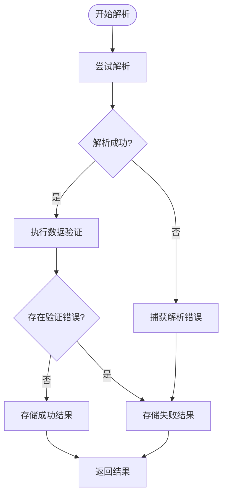

**图表来源**
- [useInvoicePdfParser.ts](file://src/composables/useInvoicePdfParser.ts#L37-L91)

## 结论

本项目构建了一个完整且高效的发票数据验证系统，具有以下特点：

### 技术优势

1. **模块化设计**：清晰的分层架构便于维护和扩展
2. **严格验证**：实现了多维度的数据验证机制
3. **用户友好**：提供实时进度反馈和详细的错误信息
4. **性能优化**：采用并发处理和智能缓存策略

### 验证机制特色

1. **数学关系验证**：确保金额、税额与价税合计的逻辑一致性
2. **格式合规性检查**：验证关键字段的格式正确性
3. **错误收集机制**：统一收集和管理验证错误
4. **UI层反馈**：直观展示解析结果和错误信息

### 扩展性设计

系统为未来的功能扩展预留了良好的接口：
- 可配置的验证规则
- 插件化的验证器
- 灵活的错误处理机制
- 可扩展的数据模型

该系统为财务人员提供了可靠的发票数据处理工具，能够有效提高工作效率并减少人工错误。