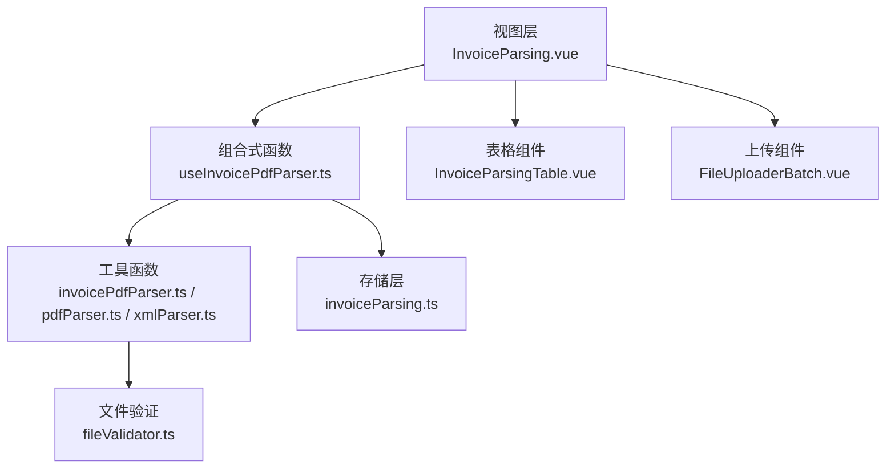
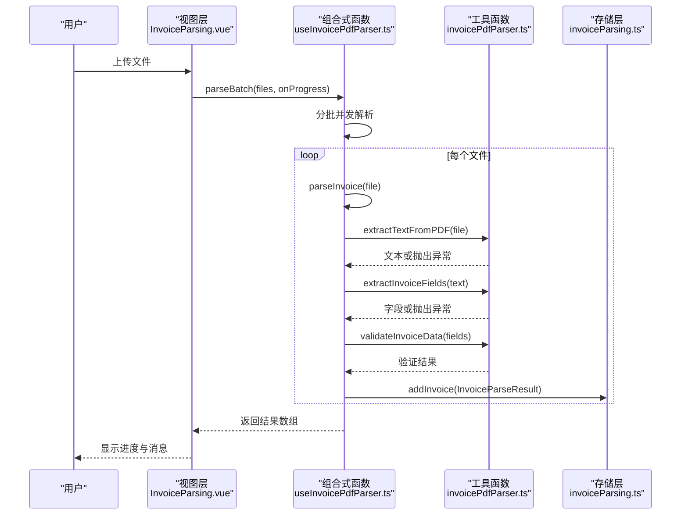
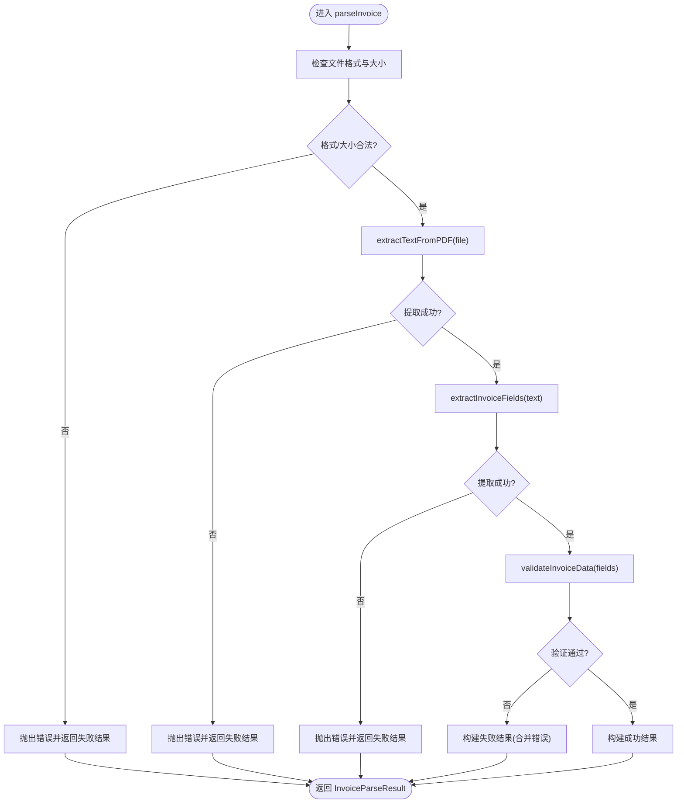
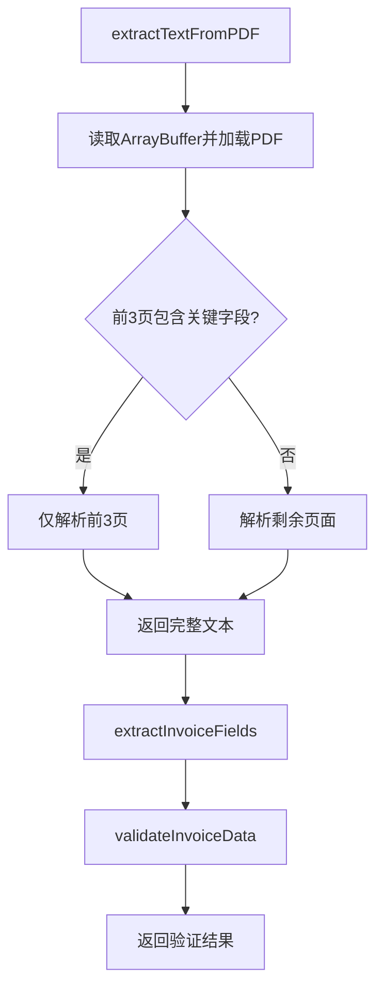
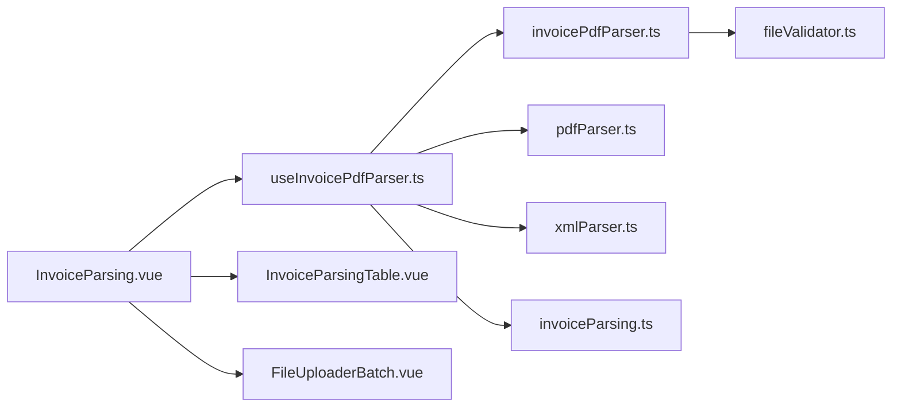

# 错误处理策略

<cite>
**本文引用的文件**
- [useInvoicePdfParser.ts](file://src/composables/useInvoicePdfParser.ts)
- [invoicePdfParser.ts](file://src/utils/invoicePdfParser.ts)
- [pdfParser.ts](file://src/utils/pdfParser.ts)
- [xmlParser.ts](file://src/utils/xmlParser.ts)
- [fileValidator.ts](file://src/utils/fileValidator.ts)
- [invoiceParsing.ts](file://src/stores/invoiceParsing.ts)
- [InvoiceParsing.vue](file://src/views/InvoiceParsing.vue)
- [InvoiceParsingTable.vue](file://src/components/InvoiceParsingTable.vue)
- [FileUploaderBatch.vue](file://src/components/FileUploaderBatch.vue)
</cite>

## 目录
1. [引言](#引言)
2. [项目结构](#项目结构)
3. [核心组件](#核心组件)
4. [架构总览](#架构总览)
5. [详细组件分析](#详细组件分析)
6. [依赖关系分析](#依赖关系分析)
7. [性能考量](#性能考量)
8. [故障排查指南](#故障排查指南)
9. [结论](#结论)

## 引言
本文系统化梳理发票解析过程中的错误处理机制，覆盖文件格式校验失败、PDF读取异常、字段提取缺失、验证不通过等常见错误场景；阐述在 parseInvoice 与 parseBatch 中的分层捕获策略；说明错误信息如何被封装为标准化的 InvoiceParseResult 返回结构；解释控制台日志输出规范与用户提示信息的生成逻辑，并提供调试建议，帮助开发者快速定位特定发票的失败原因。

## 项目结构
围绕发票解析的错误处理，主要涉及以下层次：
- 视图层：负责用户交互、进度提示与最终结果展示
- 组合式函数层：封装解析流程、状态管理与进度回调
- 工具函数层：具体执行 PDF/文本解析、字段提取与数据验证
- 存储层：统一管理解析结果与筛选统计

图表来源
- [InvoiceParsing.vue](file://src/views/InvoiceParsing.vue#L188-L232)
- [useInvoicePdfParser.ts](file://src/composables/useInvoicePdfParser.ts#L29-L91)
- [invoicePdfParser.ts](file://src/utils/invoicePdfParser.ts#L97-L129)
- [pdfParser.ts](file://src/utils/pdfParser.ts#L31-L65)
- [xmlParser.ts](file://src/utils/xmlParser.ts#L42-L62)
- [invoiceParsing.ts](file://src/stores/invoiceParsing.ts#L18-L31)
- [InvoiceParsingTable.vue](file://src/components/InvoiceParsingTable.vue#L100-L134)
- [FileUploaderBatch.vue](file://src/components/FileUploaderBatch.vue#L49-L67)

章节来源
- [InvoiceParsing.vue](file://src/views/InvoiceParsing.vue#L1-L328)
- [useInvoicePdfParser.ts](file://src/composables/useInvoicePdfParser.ts#L1-L173)
- [invoicePdfParser.ts](file://src/utils/invoicePdfParser.ts#L1-L349)
- [pdfParser.ts](file://src/utils/pdfParser.ts#L1-L243)
- [xmlParser.ts](file://src/utils/xmlParser.ts#L1-L141)
- [invoiceParsing.ts](file://src/stores/invoiceParsing.ts#L1-L241)
- [InvoiceParsingTable.vue](file://src/components/InvoiceParsingTable.vue#L1-L157)
- [FileUploaderBatch.vue](file://src/components/FileUploaderBatch.vue#L1-L79)

## 核心组件
- 组合式函数 useInvoicePdfParser：提供单文件解析与批量解析能力，内置分层错误捕获与进度反馈
- 工具函数 invoicePdfParser：PDF文本提取、字段提取与数据验证
- 工具函数 pdfParser：通用PDF解析流程（对比参考）
- 工具函数 xmlParser：XML解析与验证（对比参考）
- 存储层 invoiceParsing：统一的解析结果结构与状态管理
- 视图层 InvoiceParsing：进度弹窗、消息提示与结果展示
- 组件 InvoiceParsingTable：失败原因列展示与交互
- 组件 FileUploaderBatch：文件上传与基础格式限制

章节来源
- [useInvoicePdfParser.ts](file://src/composables/useInvoicePdfParser.ts#L29-L173)
- [invoicePdfParser.ts](file://src/utils/invoicePdfParser.ts#L97-L334)
- [pdfParser.ts](file://src/utils/pdfParser.ts#L31-L242)
- [xmlParser.ts](file://src/utils/xmlParser.ts#L42-L140)
- [invoiceParsing.ts](file://src/stores/invoiceParsing.ts#L18-L31)
- [InvoiceParsing.vue](file://src/views/InvoiceParsing.vue#L188-L232)
- [InvoiceParsingTable.vue](file://src/components/InvoiceParsingTable.vue#L100-L134)
- [FileUploaderBatch.vue](file://src/components/FileUploaderBatch.vue#L49-L67)

## 架构总览
错误处理遵循“分层捕获、统一封装、可视化反馈”的设计原则：
- 在 parseInvoice 层捕获并包装错误，保证每个文件都有标准的 InvoiceParseResult
- 在 parseBatch 层进行批次级容错与进度反馈，避免单个文件异常影响整体流程
- 在视图层通过进度弹窗与消息提示向用户反馈解析状态与结果
- 在表格层展示失败原因，便于定位问题

图表来源
- [InvoiceParsing.vue](file://src/views/InvoiceParsing.vue#L188-L232)
- [useInvoicePdfParser.ts](file://src/composables/useInvoicePdfParser.ts#L96-L153)
- [invoicePdfParser.ts](file://src/utils/invoicePdfParser.ts#L97-L334)
- [invoiceParsing.ts](file://src/stores/invoiceParsing.ts#L122-L128)

## 详细组件分析

### 组件A：useInvoicePdfParser（分层错误捕获与结果封装）
- 单文件解析 parseInvoice
  - 文件格式与大小校验：仅允许PDF且不超过10MB
  - 文本提取：调用 extractTextFromPDF
  - 字段提取：调用 extractInvoiceFields
  - 数据验证：调用 validateInvoiceData
  - 结果封装：构建 InvoiceParseResult，成功时 status 为 success，失败时 status 为 failed，errorMessage 由验证错误拼接
  - 异常捕获：catch 中记录控制台日志并返回失败的 InvoiceParseResult
- 批量解析 parseBatch
  - 分批并发：每批10个文件，批次间串行、批次内并发
  - 进度回调：每个文件完成后更新进度与当前文件名
  - 容错处理：外层 try/catch 记录错误并重新抛出，finally 清理状态
- 控制台日志：统一以“[发票解析]”前缀输出，包含文件名与错误信息

图表来源
- [useInvoicePdfParser.ts](file://src/composables/useInvoicePdfParser.ts#L37-L91)
- [invoicePdfParser.ts](file://src/utils/invoicePdfParser.ts#L97-L152)

章节来源
- [useInvoicePdfParser.ts](file://src/composables/useInvoicePdfParser.ts#L37-L153)
- [invoicePdfParser.ts](file://src/utils/invoicePdfParser.ts#L97-L152)

### 组件B：invoicePdfParser（PDF文本提取、字段提取与验证）
- PDF文本提取 extractTextFromPDF
  - 读取文件为 ArrayBuffer，加载 PDF，逐页提取文本
  - 若前3页未发现关键字段，继续解析剩余页面
  - 异常捕获：记录控制台日志并抛出带上下文的错误
- 字段提取 extractInvoiceFields
  - 提取发票号码、发票类型、金额、税额、价税合计、税率
  - 异常捕获：记录控制台日志并抛出带上下文的错误
- 数据验证 validateInvoiceData
  - 校验发票号码格式、金额/税额/价税合计数值范围与相互关系
  - 校验税率范围与有效性
  - 返回布尔值与错误列表

图表来源
- [invoicePdfParser.ts](file://src/utils/invoicePdfParser.ts#L97-L129)
- [invoicePdfParser.ts](file://src/utils/invoicePdfParser.ts#L138-L152)
- [invoicePdfParser.ts](file://src/utils/invoicePdfParser.ts#L294-L334)

章节来源
- [invoicePdfParser.ts](file://src/utils/invoicePdfParser.ts#L97-L334)

### 组件C：pdfParser 与 xmlParser（对比参考）
- pdfParser：提供通用PDF解析流程，包含更详细的控制台日志与备用提取策略
- xmlParser：提供XML解析与验证，包含字段提取与错误封装

章节来源
- [pdfParser.ts](file://src/utils/pdfParser.ts#L31-L242)
- [xmlParser.ts](file://src/utils/xmlParser.ts#L42-L140)

### 组件D：InvoiceParsing（视图层错误处理与用户提示）
- 上传前本地校验：若存在非PDF或超限文件，直接提示用户
- 批量解析：显示进度弹窗，实时更新百分比与当前文件名
- 结果汇总：统计成功/失败数量并提示
- 异常处理：catch 中记录控制台日志并提示用户

章节来源
- [InvoiceParsing.vue](file://src/views/InvoiceParsing.vue#L188-L232)

### 组件E：InvoiceParsingTable（失败原因展示）
- 失败状态以标签形式展示
- 失败原因列在失败记录中显示，便于定位问题

章节来源
- [InvoiceParsingTable.vue](file://src/components/InvoiceParsingTable.vue#L100-L134)

## 依赖关系分析
- 组合式函数依赖工具函数执行具体解析任务
- 视图层通过组合式函数与存储层交互
- 工具函数内部依赖第三方库（如 pdfjs）进行PDF解析
- 存储层提供统一的结果结构与筛选统计

图表来源
- [InvoiceParsing.vue](file://src/views/InvoiceParsing.vue#L142-L151)
- [useInvoicePdfParser.ts](file://src/composables/useInvoicePdfParser.ts#L6-L11)
- [invoicePdfParser.ts](file://src/utils/invoicePdfParser.ts#L5-L7)
- [pdfParser.ts](file://src/utils/pdfParser.ts#L4-L6)
- [xmlParser.ts](file://src/utils/xmlParser.ts#L4)
- [invoiceParsing.ts](file://src/stores/invoiceParsing.ts#L1-L10)
- [InvoiceParsingTable.vue](file://src/components/InvoiceParsingTable.vue#L18)
- [FileUploaderBatch.vue](file://src/components/FileUploaderBatch.vue#L44)

章节来源
- [InvoiceParsing.vue](file://src/views/InvoiceParsing.vue#L142-L151)
- [useInvoicePdfParser.ts](file://src/composables/useInvoicePdfParser.ts#L6-L11)
- [invoicePdfParser.ts](file://src/utils/invoicePdfParser.ts#L5-L7)
- [pdfParser.ts](file://src/utils/pdfParser.ts#L4-L6)
- [xmlParser.ts](file://src/utils/xmlParser.ts#L4)
- [invoiceParsing.ts](file://src/stores/invoiceParsing.ts#L1-L10)
- [InvoiceParsingTable.vue](file://src/components/InvoiceParsingTable.vue#L18)
- [FileUploaderBatch.vue](file://src/components/FileUploaderBatch.vue#L44)

## 性能考量
- 批量解析采用分批并发：每批10个文件，减少内存峰值与提升吞吐
- PDF文本提取先解析前3页，若未命中再扩展到全文，平衡性能与准确性
- 控制台日志在开发模式下输出，生产模式下保持最小化输出，降低I/O开销

## 故障排查指南
- 控制台日志定位
  - 统一前缀“[发票解析]”，包含文件名与错误信息，便于快速检索
  - 在 parseInvoice 与 invoicePdfParser 的各阶段均输出日志，可据此定位失败环节
- 失败原因定位
  - 表格中“失败原因”列会显示具体错误信息（由验证错误拼接）
  - 若验证通过但字段为空，检查发票模板与字段提取正则是否匹配
- 常见问题与建议
  - 文件格式校验失败：确保为PDF且小于10MB
  - PDF读取异常：检查PDF是否损坏或加密；确认worker资源可用
  - 字段提取缺失：核对发票模板，必要时调整正则表达式
  - 验证不通过：检查金额、税额、价税合计与税率的数值范围与相互关系
- 调试技巧
  - 开启开发模式可查看更多调试日志
  - 使用进度弹窗观察当前文件名，结合日志快速定位问题文件
  - 逐步缩小范围：先验证单文件，再验证批量流程

章节来源
- [useInvoicePdfParser.ts](file://src/composables/useInvoicePdfParser.ts#L77-L90)
- [invoicePdfParser.ts](file://src/utils/invoicePdfParser.ts#L125-L128)
- [InvoiceParsingTable.vue](file://src/components/InvoiceParsingTable.vue#L120-L125)
- [InvoiceParsing.vue](file://src/views/InvoiceParsing.vue#L208-L232)

## 结论
该系统通过“组合式函数 + 工具函数 + 存储层”的分层架构实现了稳健的错误处理：parseInvoice 层确保每个文件都有标准化的返回结构，parseBatch 层提供容错与进度反馈，视图层与表格层提供直观的用户提示与失败原因展示。配合统一的控制台日志规范与调试建议，能够高效定位并解决发票解析过程中的各类问题。