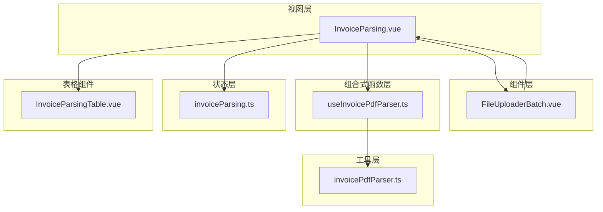
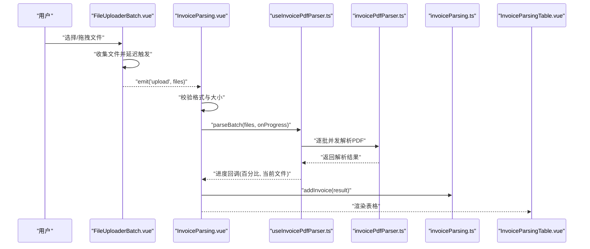
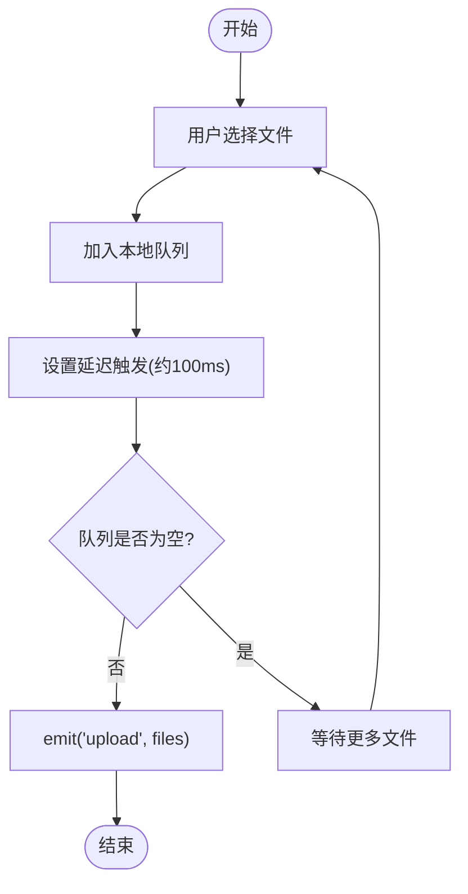
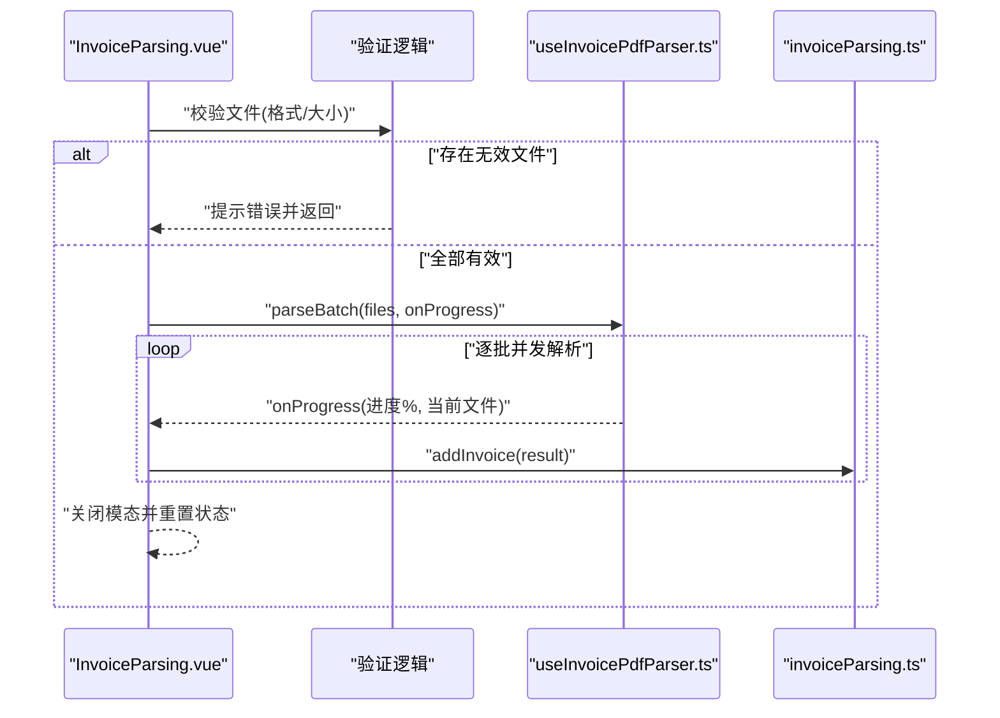
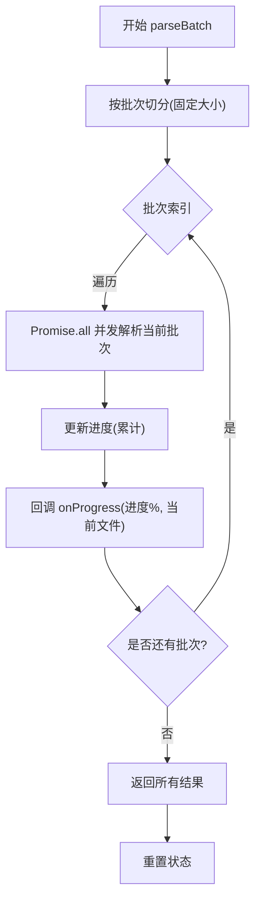
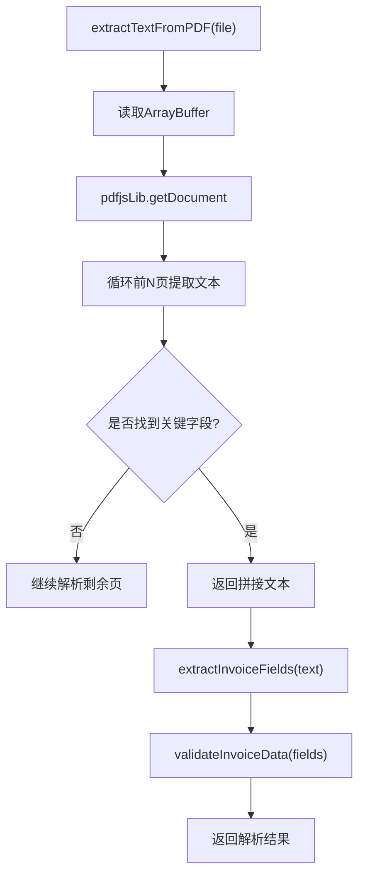
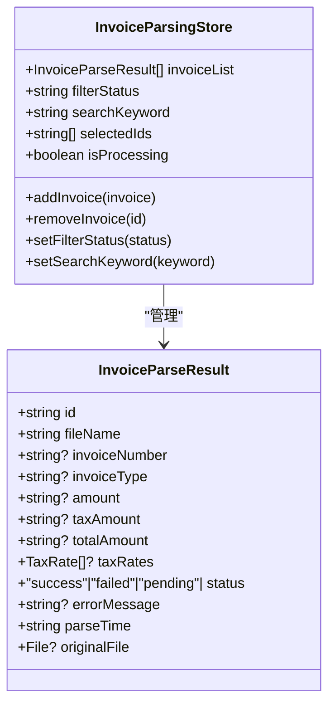
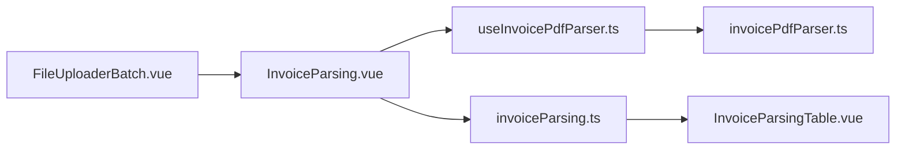

# 批量文件上传

<cite>
**本文引用的文件**
- [FileUploaderBatch.vue](file://src/components/FileUploaderBatch.vue)
- [InvoiceParsing.vue](file://src/views/InvoiceParsing.vue)
- [useInvoicePdfParser.ts](file://src/composables/useInvoicePdfParser.ts)
- [invoicePdfParser.ts](file://src/utils/invoicePdfParser.ts)
- [invoiceParsing.ts](file://src/stores/invoiceParsing.ts)
- [InvoiceParsingTable.vue](file://src/components/InvoiceParsingTable.vue)
- [fileValidator.ts](file://src/utils/fileValidator.ts)
- [useFileParser.ts](file://src/composables/useFileParser.ts)
</cite>

## 目录
1. [简介](#简介)
2. [项目结构](#项目结构)
3. [核心组件](#核心组件)
4. [架构总览](#架构总览)
5. [详细组件分析](#详细组件分析)
6. [依赖关系分析](#依赖关系分析)
7. [性能考虑](#性能考虑)
8. [故障排查指南](#故障排查指南)
9. [结论](#结论)

## 简介
本文件围绕“批量文件上传”能力进行系统化技术文档梳理，重点覆盖以下方面：
- FileUploaderBatch 组件如何支持多文件选择、拖拽上传、文件类型与大小限制
- 上传队列管理与延迟触发机制，避免频繁触发导致的抖动
- 与父级 InvoiceParsing 页面的通信方式，如何传递文件列表并启动解析流程
- 用户交互细节（拖拽上传、文件限制提示）
- 错误处理（非PDF文件拦截、大小超限提示）
- 性能优化策略（分批并发、进度反馈）
- 上传过程中的用户反馈（加载状态、进度提示）

## 项目结构
批量上传功能涉及多个层次的协作：
- 视图层：InvoiceParsing 页面负责展示上传区、解析结果、导出与删除等交互
- 组件层：FileUploaderBatch 提供上传入口与队列管理
- 组合式函数层：useInvoicePdfParser 提供批量解析与进度回调
- 工具层：invoicePdfParser 提供PDF文本提取与字段抽取
- 状态层：Pinia store 管理解析结果集合与筛选、搜索、选中态
- 表格组件：InvoiceParsingTable 展示解析结果并支持分页与动态列

图表来源
- [InvoiceParsing.vue](file://src/views/InvoiceParsing.vue#L1-L120)
- [FileUploaderBatch.vue](file://src/components/FileUploaderBatch.vue#L1-L79)
- [useInvoicePdfParser.ts](file://src/composables/useInvoicePdfParser.ts#L1-L173)
- [invoicePdfParser.ts](file://src/utils/invoicePdfParser.ts#L1-L349)
- [invoiceParsing.ts](file://src/stores/invoiceParsing.ts#L1-L241)
- [InvoiceParsingTable.vue](file://src/components/InvoiceParsingTable.vue#L1-L157)

章节来源
- [InvoiceParsing.vue](file://src/views/InvoiceParsing.vue#L1-L120)
- [FileUploaderBatch.vue](file://src/components/FileUploaderBatch.vue#L1-L79)

## 核心组件
- FileUploaderBatch：提供多文件选择、拖拽上传、类型与数量限制、延迟触发上传队列
- InvoiceParsing：作为父级页面，接收文件列表，执行格式与大小校验，调用批量解析，展示进度与结果
- useInvoicePdfParser：封装批量解析逻辑，支持分批并发与进度回调
- invoicePdfParser：底层PDF解析工具，负责文本提取、字段抽取与数据验证
- invoiceParsing Store：集中管理解析结果、筛选、搜索、选中态与导出数据准备
- InvoiceParsingTable：渲染解析结果，支持动态税率列、分页与删除操作

章节来源
- [FileUploaderBatch.vue](file://src/components/FileUploaderBatch.vue#L1-L79)
- [InvoiceParsing.vue](file://src/views/InvoiceParsing.vue#L1-L120)
- [useInvoicePdfParser.ts](file://src/composables/useInvoicePdfParser.ts#L1-L173)
- [invoicePdfParser.ts](file://src/utils/invoicePdfParser.ts#L1-L349)
- [invoiceParsing.ts](file://src/stores/invoiceParsing.ts#L1-L241)
- [InvoiceParsingTable.vue](file://src/components/InvoiceParsingTable.vue#L1-L157)

## 架构总览
批量上传与解析的整体流程如下：
- 用户在 FileUploaderBatch 中选择或拖拽PDF文件
- FileUploaderBatch 将文件加入本地队列并在短延迟后一次性触发上传事件
- InvoiceParsing 接收文件列表，先做格式与大小校验，再调用批量解析
- useInvoicePdfParser 以固定批次大小并发解析，实时更新进度与当前文件名
- 解析结果写入 Pinia store，页面弹出进度模态并展示结果
- 用户可在表格中查看、筛选、导出或删除解析记录

图表来源
- [FileUploaderBatch.vue](file://src/components/FileUploaderBatch.vue#L49-L67)
- [InvoiceParsing.vue](file://src/views/InvoiceParsing.vue#L188-L232)
- [useInvoicePdfParser.ts](file://src/composables/useInvoicePdfParser.ts#L96-L153)
- [invoicePdfParser.ts](file://src/utils/invoicePdfParser.ts#L97-L129)
- [invoiceParsing.ts](file://src/stores/invoiceParsing.ts#L122-L128)
- [InvoiceParsingTable.vue](file://src/components/InvoiceParsingTable.vue#L1-L157)

## 详细组件分析

### FileUploaderBatch 组件
- 多文件与拖拽支持：通过多选与目录拖拽开关启用
- 类型与数量限制：默认仅接受PDF，最多100个文件
- 队列与延迟触发：内部维护文件数组，使用定时器在短时间内聚合多次选择，避免频繁触发
- 事件发射：当队列中有文件时，一次性发出 upload 事件，携带完整文件列表

图表来源
- [FileUploaderBatch.vue](file://src/components/FileUploaderBatch.vue#L49-L67)

章节来源
- [FileUploaderBatch.vue](file://src/components/FileUploaderBatch.vue#L1-L79)

### 父级页面与通信链路
- 父级页面通过子组件事件接收文件列表
- 在 handleUpload 中进行格式与大小校验（PDF且≤10MB）
- 校验失败时提示错误并终止流程
- 校验通过后启动解析，显示进度模态并实时更新进度与当前文件名
- 解析完成后将结果写入 store，并给出成功/失败统计

图表来源
- [InvoiceParsing.vue](file://src/views/InvoiceParsing.vue#L188-L232)
- [useInvoicePdfParser.ts](file://src/composables/useInvoicePdfParser.ts#L96-L153)
- [invoiceParsing.ts](file://src/stores/invoiceParsing.ts#L122-L128)

章节来源
- [InvoiceParsing.vue](file://src/views/InvoiceParsing.vue#L188-L232)

### 批量解析与进度反馈
- 分批并发：每次处理固定数量（例如10个）为一批，批次间串行、批次内并发
- 进度计算：基于已处理文件数占总数的比例，实时更新百分比与当前文件名
- 异常处理：解析失败时返回失败结果并记录错误信息，不影响其他文件解析
- 状态清理：解析结束后重置处理状态与进度

图表来源
- [useInvoicePdfParser.ts](file://src/composables/useInvoicePdfParser.ts#L96-L153)

章节来源
- [useInvoicePdfParser.ts](file://src/composables/useInvoicePdfParser.ts#L1-L173)

### PDF解析工具链
- 文本提取：使用 pdfjs-lib 读取PDF，优先解析前若干页，若未找到关键字段则继续解析剩余页
- 字段抽取：按预设正则优先级提取发票号码、金额、税额、价税合计与税率
- 数据验证：对发票号码、金额、税额、价税合计与税率范围进行一致性校验
- 错误处理：统一抛出可读错误信息，便于上层展示

图表来源
- [invoicePdfParser.ts](file://src/utils/invoicePdfParser.ts#L97-L129)
- [invoicePdfParser.ts](file://src/utils/invoicePdfParser.ts#L138-L152)
- [invoicePdfParser.ts](file://src/utils/invoicePdfParser.ts#L294-L334)

章节来源
- [invoicePdfParser.ts](file://src/utils/invoicePdfParser.ts#L1-L349)

### 结果存储与表格展示
- Store 管理解析结果，支持按状态筛选、关键词搜索、选中态管理
- 动态列：根据最高税率数量动态生成“税率N”列，适配多税率场景
- 表格交互：支持分页、选择、删除；失败项展示失败原因

图表来源
- [invoiceParsing.ts](file://src/stores/invoiceParsing.ts#L17-L60)
- [invoiceParsing.ts](file://src/stores/invoiceParsing.ts#L122-L239)

章节来源
- [invoiceParsing.ts](file://src/stores/invoiceParsing.ts#L1-L241)
- [InvoiceParsingTable.vue](file://src/components/InvoiceParsingTable.vue#L1-L157)

## 依赖关系分析
- FileUploaderBatch 与 InvoiceParsing：通过自定义事件进行解耦，父级负责业务规则与UI反馈
- InvoiceParsing 与 useInvoicePdfParser：通过组合式函数注入解析能力，便于测试与复用
- useInvoicePdfParser 与 invoicePdfParser：前者负责调度与进度，后者负责具体解析算法
- InvoiceParsing 与 Pinia Store：通过 store 写入解析结果，驱动表格渲染与交互
- Store 与 InvoiceParsingTable：store 的计算属性与方法驱动表格的筛选、搜索与分页

图表来源
- [FileUploaderBatch.vue](file://src/components/FileUploaderBatch.vue#L44-L67)
- [InvoiceParsing.vue](file://src/views/InvoiceParsing.vue#L188-L232)
- [useInvoicePdfParser.ts](file://src/composables/useInvoicePdfParser.ts#L96-L153)
- [invoicePdfParser.ts](file://src/utils/invoicePdfParser.ts#L97-L129)
- [invoiceParsing.ts](file://src/stores/invoiceParsing.ts#L122-L128)
- [InvoiceParsingTable.vue](file://src/components/InvoiceParsingTable.vue#L1-L157)

章节来源
- [InvoiceParsing.vue](file://src/views/InvoiceParsing.vue#L1-L120)
- [useInvoicePdfParser.ts](file://src/composables/useInvoicePdfParser.ts#L1-L173)
- [invoicePdfParser.ts](file://src/utils/invoicePdfParser.ts#L1-L349)
- [invoiceParsing.ts](file://src/stores/invoiceParsing.ts#L1-L241)

## 性能考虑
- 分批并发：固定批次大小（如10）控制并发度，避免内存与CPU峰值过高
- 快速预读：优先解析前几页，若未命中关键字段再扩展到全文，减少不必要的全文扫描
- 进度细粒度：每个文件完成后更新进度，提升用户体验
- 存储与渲染：Pinia store 集中管理，表格按需渲染，支持分页降低DOM压力

章节来源
- [useInvoicePdfParser.ts](file://src/composables/useInvoicePdfParser.ts#L13-L15)
- [useInvoicePdfParser.ts](file://src/composables/useInvoicePdfParser.ts#L117-L140)
- [invoicePdfParser.ts](file://src/utils/invoicePdfParser.ts#L104-L122)
- [InvoiceParsingTable.vue](file://src/components/InvoiceParsingTable.vue#L139-L151)

## 故障排查指南
- 非PDF文件拦截
  - 现象：上传后立即提示格式不正确或超过大小限制
  - 原因：父级页面在 handleUpload 中对文件名后缀与 MIME 类型进行校验，且限制大小为10MB
  - 处理：确保上传PDF文件且大小符合要求
- 大文件解析缓慢
  - 现象：解析进度缓慢或卡顿
  - 原因：PDF页数较多或文本提取耗时
  - 处理：使用浏览器原生PDF解析能力，优先解析前几页；必要时建议拆分文件
- 进度不更新
  - 现象：进度条不动
  - 原因：onProgress 回调未被调用或 UI 未响应
  - 处理：检查回调参数与进度模态绑定；确认 isProcessing 与 currentFile 的响应式更新
- 失败记录过多
  - 现象：解析结果中大量失败
  - 原因：发票字段缺失、金额格式异常或税率不在有效范围
  - 处理：查看失败原因字段，定位模板差异或数据质量问题

章节来源
- [InvoiceParsing.vue](file://src/views/InvoiceParsing.vue#L193-L203)
- [useInvoicePdfParser.ts](file://src/composables/useInvoicePdfParser.ts#L123-L133)
- [invoicePdfParser.ts](file://src/utils/invoicePdfParser.ts#L294-L334)

## 结论
批量文件上传组件通过“组件-页面-组合式函数-工具-状态”的分层设计，实现了：
- 易用的多文件选择与拖拽上传
- 精准的PDF类型与大小限制
- 稳定的上传队列与延迟触发
- 高效的分批并发解析与细粒度进度反馈
- 完整的结果存储与表格展示

该方案在保证用户体验的同时兼顾了性能与可维护性，适合在发票解析等对稳定性与可观测性有较高要求的场景中使用。