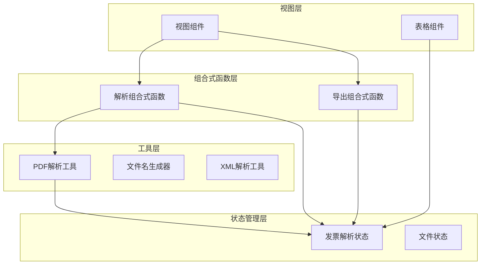
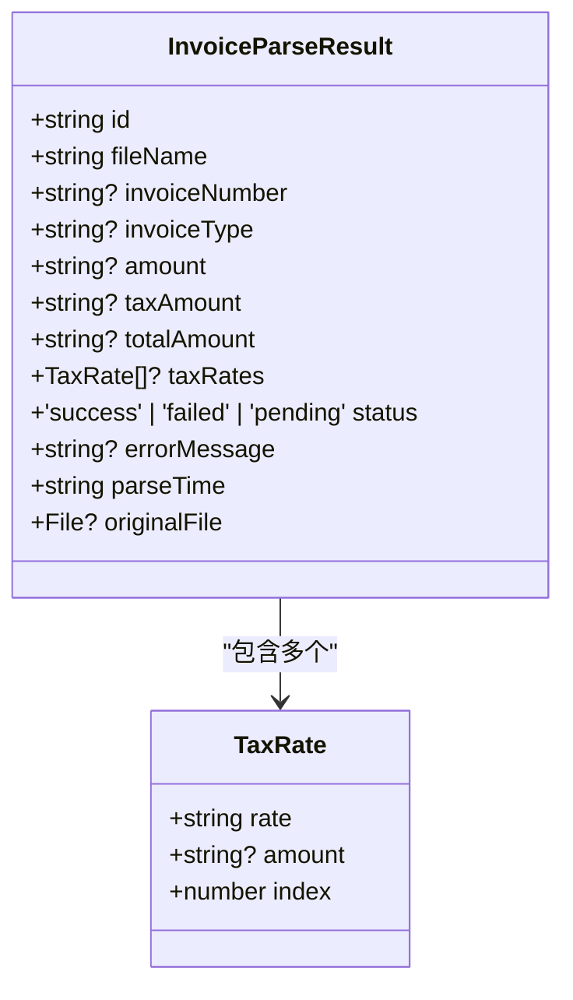
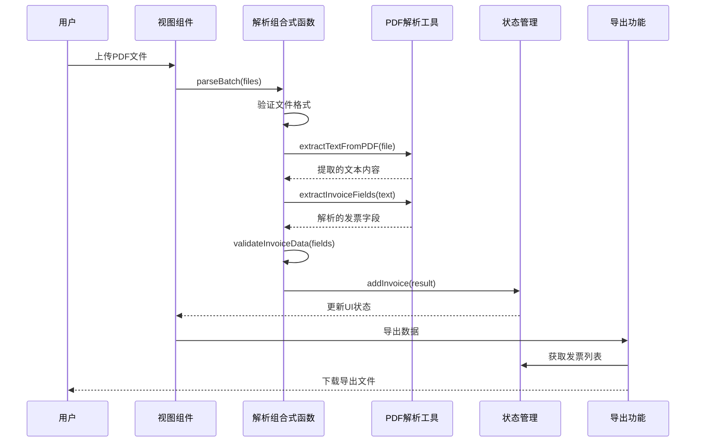
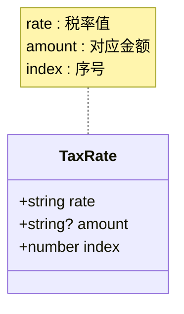
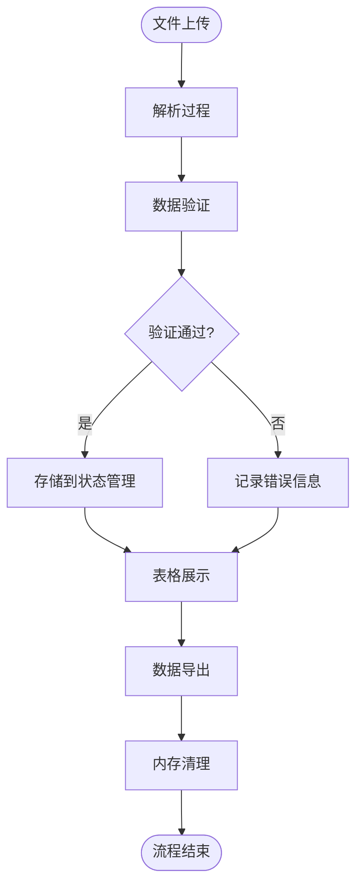
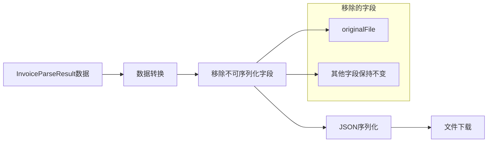
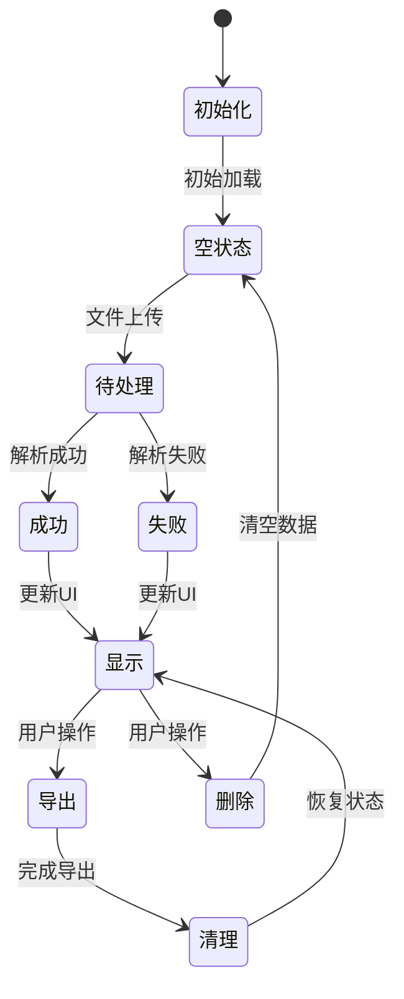
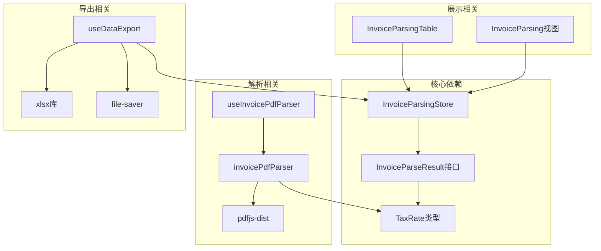

# 数据模型定义

<cite>
**本文档引用的文件**
- [src/stores/invoiceParsing.ts](file://src/stores/invoiceParsing.ts)
- [src/utils/invoicePdfParser.ts](file://src/utils/invoicePdfParser.ts)
- [src/composables/useInvoicePdfParser.ts](file://src/composables/useInvoicePdfParser.ts)
- [src/components/InvoiceParsingTable.vue](file://src/components/InvoiceParsingTable.vue)
- [src/views/InvoiceParsing.vue](file://src/views/InvoiceParsing.vue)
- [src/composables/useDataExport.ts](file://src/composables/useDataExport.ts)
- [src/utils/nameGenerator.ts](file://src/utils/nameGenerator.ts)
</cite>

## 目录
1. [简介](#简介)
2. [项目结构](#项目结构)
3. [核心组件](#核心组件)
4. [架构概览](#架构概览)
5. [详细组件分析](#详细组件分析)
6. [依赖关系分析](#依赖关系分析)
7. [性能考虑](#性能考虑)
8. [故障排除指南](#故障排除指南)
9. [结论](#结论)

## 简介

本文档详细阐述了发票解析系统中的数据模型设计，重点分析InvoiceParseResult接口的结构设计与业务含义。该系统采用Vue 3 + TypeScript + Pinia的状态管理模式，实现了发票PDF文件的智能解析、数据验证、状态管理和响应式更新。

系统的核心数据模型围绕InvoiceParseResult接口构建，该接口定义了发票解析结果的所有关键字段，并通过TaxRate类型支持多税率发票的复杂场景。整个架构采用模块化设计，确保了数据的一致性和可维护性。

## 项目结构

项目采用功能模块化的组织方式，主要分为以下层次：

**图表来源**
- [src/views/InvoiceParsing.vue](file://src/views/InvoiceParsing.vue#L1-L328)
- [src/components/InvoiceParsingTable.vue](file://src/components/InvoiceParsingTable.vue#L1-L157)
- [src/stores/invoiceParsing.ts](file://src/stores/invoiceParsing.ts#L1-L241)

**章节来源**
- [src/views/InvoiceParsing.vue](file://src/views/InvoiceParsing.vue#L1-L328)
- [src/components/InvoiceParsingTable.vue](file://src/components/InvoiceParsingTable.vue#L1-L157)
- [src/stores/invoiceParsing.ts](file://src/stores/invoiceParsing.ts#L1-L241)

## 核心组件

### InvoiceParseResult接口设计

InvoiceParseResult是系统的核心数据模型，定义了发票解析结果的完整结构：

**图表来源**
- [src/stores/invoiceParsing.ts](file://src/stores/invoiceParsing.ts#L17-L31)

### 关键字段定义与业务含义

#### 基础标识字段
- **id**: 唯一标识符，采用时间戳+随机数的组合方式生成，确保全局唯一性
- **fileName**: 原始文件名，保持用户上传时的文件名信息

#### 发票基本信息
- **invoiceNumber**: 发票号码，标准20位数字格式
- **invoiceType**: 发票类型，支持"专票"和"普票"两种类型
- **amount**: 不含税金额，字符串格式便于显示和计算
- **taxAmount**: 税额，支持免税发票的特殊处理
- **totalAmount**: 价税合计，发票的核心金额字段

#### 税务信息
- **taxRates**: 税率列表，支持多税率发票的复杂场景
- **status**: 解析状态，包含成功、失败、待处理三种状态
- **errorMessage**: 错误信息，用于失败状态的详细描述

#### 时间戳与文件引用
- **parseTime**: 解析时间戳，采用ISO 8601格式
- **originalFile**: 原始文件对象，可选字段用于内存管理

**章节来源**
- [src/stores/invoiceParsing.ts](file://src/stores/invoiceParsing.ts#L17-L31)
- [src/composables/useInvoicePdfParser.ts](file://src/composables/useInvoicePdfParser.ts#L37-L91)

## 架构概览

系统采用分层架构设计，确保关注点分离和职责明确：

**图表来源**
- [src/views/InvoiceParsing.vue](file://src/views/InvoiceParsing.vue#L188-L232)
- [src/composables/useInvoicePdfParser.ts](file://src/composables/useInvoicePdfParser.ts#L96-L153)
- [src/stores/invoiceParsing.ts](file://src/stores/invoiceParsing.ts#L122-L128)

## 详细组件分析

### TaxRate类型设计逻辑

TaxRate类型专门设计用于支持多税率发票场景，其设计考虑了以下关键因素：

**图表来源**
- [src/stores/invoiceParsing.ts](file://src/stores/invoiceParsing.ts#L10-L15)

#### 设计特点
- **rate字段**: 存储标准化的税率字符串，如"6%"或"免税"
- **amount字段**: 可选的对应金额，支持多税率下的金额分配
- **index字段**: 用于动态列展示的序号，从1开始递增

#### 多税率发票应用场景
系统能够处理复杂的多税率发票，如：
- 混合商品适用不同税率的商品
- 特殊税务处理的发票
- 免税发票的统一处理

**章节来源**
- [src/stores/invoiceParsing.ts](file://src/stores/invoiceParsing.ts#L10-L15)
- [src/utils/invoicePdfParser.ts](file://src/utils/invoicePdfParser.ts#L224-L234)

### 数据生命周期管理策略

系统采用渐进式数据生命周期管理，重点关注内存优化：

#### 原始文件对象管理
- **originalFile字段**: 可选字段，避免不必要的内存占用
- **自动清理机制**: 导出时自动移除不可序列化的原始文件对象
- **内存释放建议**: 在不需要原始文件时及时清理引用

#### 内存优化策略
- 使用可选字段减少不必要的数据存储
- 导出前进行数据净化，移除不可序列化字段
- 采用响应式状态管理，自动处理数据更新

**章节来源**
- [src/stores/invoiceParsing.ts](file://src/stores/invoiceParsing.ts#L29-L31)
- [src/composables/useDataExport.ts](file://src/composables/useDataExport.ts#L275-L293)

### JSON序列化注意事项

系统在数据导出时采用了专门的序列化策略：

**图表来源**
- [src/composables/useDataExport.ts](file://src/composables/useDataExport.ts#L275-L293)

#### 序列化规则
- 自动移除originalFile字段，避免循环引用问题
- 保持所有其他字段的原始格式
- 确保时间戳格式的兼容性

**章节来源**
- [src/composables/useDataExport.ts](file://src/composables/useDataExport.ts#L275-L293)

### store状态管理与持久化

系统采用Pinia状态管理，实现了完整的数据持久化和响应式更新：

#### 状态管理特性
- **响应式更新**: 自动追踪数据变化并更新UI
- **计算属性**: 智能统计和过滤功能
- **持久化支持**: 数据变更自动保存到状态管理
- **批量操作**: 支持全选、批量删除等高级功能

**章节来源**
- [src/stores/invoiceParsing.ts](file://src/stores/invoiceParsing.ts#L62-L240)

## 依赖关系分析

系统各组件之间的依赖关系清晰明确：

**图表来源**
- [src/stores/invoiceParsing.ts](file://src/stores/invoiceParsing.ts#L1-L241)
- [src/composables/useInvoicePdfParser.ts](file://src/composables/useInvoicePdfParser.ts#L1-L173)
- [src/components/InvoiceParsingTable.vue](file://src/components/InvoiceParsingTable.vue#L1-L157)

**章节来源**
- [src/stores/invoiceParsing.ts](file://src/stores/invoiceParsing.ts#L1-L241)
- [src/composables/useInvoicePdfParser.ts](file://src/composables/useInvoicePdfParser.ts#L1-L173)
- [src/components/InvoiceParsingTable.vue](file://src/components/InvoiceParsingTable.vue#L1-L157)

## 性能考虑

系统在设计时充分考虑了性能优化：

### 并发处理
- **批量解析**: 采用批次处理机制，每批10个文件并发解析
- **进度反馈**: 实时显示解析进度和当前处理文件
- **内存管理**: 及时清理已完成文件的内存引用

### 数据处理优化
- **快速解析**: 默认只解析前3页，提高处理速度
- **智能回退**: 当关键字段缺失时自动解析剩余页面
- **缓存策略**: 利用浏览器缓存机制提升重复访问性能

### UI渲染优化
- **虚拟滚动**: 大数据量时采用虚拟滚动技术
- **懒加载**: 表格列按需动态生成
- **响应式布局**: 适配不同屏幕尺寸

## 故障排除指南

### 常见问题及解决方案

#### 解析失败问题
- **检查文件格式**: 确保上传的是PDF格式文件
- **验证文件大小**: 单个文件不超过10MB限制
- **查看错误详情**: 通过errorMessage字段了解具体失败原因

#### 数据验证问题
- **金额格式**: 确保金额字段为有效的数值格式
- **税率范围**: 税率应在0-100%的有效范围内
- **发票号码**: 验证发票号码是否为20位数字

#### 内存泄漏问题
- **及时清理**: 导出后及时清理originalFile引用
- **监控内存**: 使用浏览器开发者工具监控内存使用情况
- **批量操作**: 避免同时处理过多文件导致内存压力

**章节来源**
- [src/composables/useInvoicePdfParser.ts](file://src/composables/useInvoicePdfParser.ts#L42-L49)
- [src/utils/invoicePdfParser.ts](file://src/utils/invoicePdfParser.ts#L294-L334)

## 结论

本数据模型设计充分体现了现代前端应用的最佳实践，通过精心设计的接口结构和完善的生命周期管理，实现了发票解析系统的高效运行。InvoiceParseResult接口不仅满足了基本的发票信息存储需求，还通过TaxRate类型支持了复杂的多税率场景。

系统的核心优势包括：
- **模块化设计**: 清晰的职责分离和依赖关系
- **性能优化**: 并发处理和内存管理策略
- **用户体验**: 响应式更新和实时进度反馈
- **可维护性**: 类型安全和完整的错误处理机制

该设计为后续的功能扩展和性能优化奠定了坚实的基础，能够适应不断变化的业务需求和技术发展。