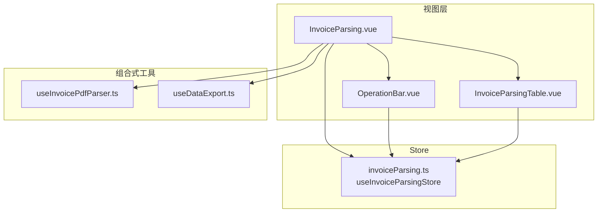
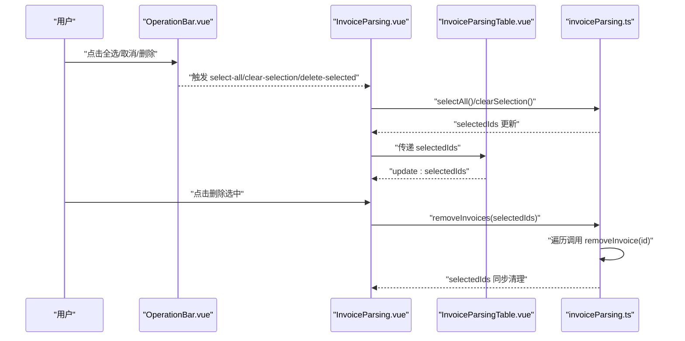
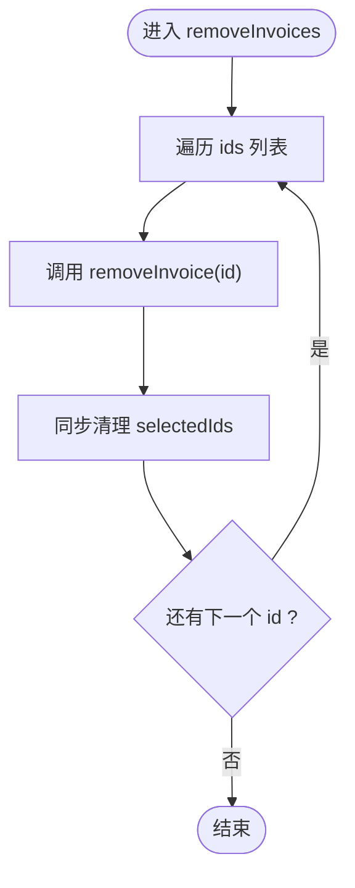
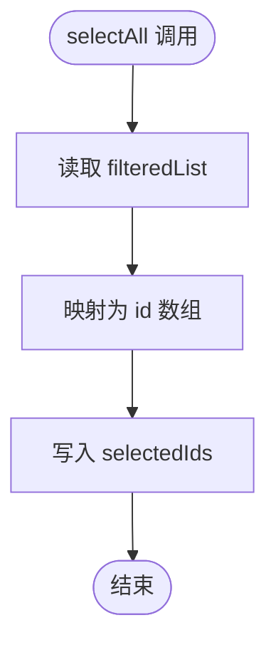
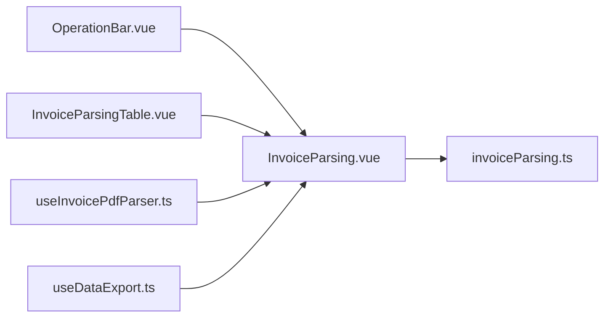

# 操作方法

<cite>
**本文引用的文件**
- [src/stores/invoiceParsing.ts](file://src/stores/invoiceParsing.ts)
- [src/views/InvoiceParsing.vue](file://src/views/InvoiceParsing.vue)
- [src/components/OperationBar.vue](file://src/components/OperationBar.vue)
- [src/components/InvoiceParsingTable.vue](file://src/components/InvoiceParsingTable.vue)
- [src/composables/useInvoicePdfParser.ts](file://src/composables/useInvoicePdfParser.ts)
- [src/composables/useDataExport.ts](file://src/composables/useDataExport.ts)
</cite>

## 目录
1. [简介](#简介)
2. [项目结构](#项目结构)
3. [核心组件](#核心组件)
4. [架构总览](#架构总览)
5. [详细组件分析](#详细组件分析)
6. [依赖关系分析](#依赖关系分析)
7. [性能考量](#性能考量)
8. [故障排查指南](#故障排查指南)
9. [结论](#结论)

## 简介
本文件系统性文档化 invoiceParsing Store 暴露的所有操作方法，涵盖：
- 数据增删改查与状态控制：addInvoice、updateInvoice、removeInvoice、removeInvoices、clearAll
- 选择控制：toggleSelection、selectAll、clearSelection
- 筛选与搜索：setFilterStatus、setSearchKeyword
- 并对每个方法的参数类型、执行逻辑、副作用（尤其是选中状态同步）进行深入说明；同时给出开发环境下的调试日志输出行为；最后结合 OperationBar 组件与视图层调用方式，提供实际使用参考路径。

## 项目结构
该功能围绕 Pinia Store 与多个 Vue 组件协作展开：
- Store 层：集中管理发票解析结果列表、筛选条件、搜索关键字、选中项集合等状态与方法
- 视图层：负责渲染表格、操作栏、上传与导出流程
- 组合式工具：提供 PDF 解析与数据导出能力

图表来源
- [src/views/InvoiceParsing.vue](file://src/views/InvoiceParsing.vue#L1-L328)
- [src/components/OperationBar.vue](file://src/components/OperationBar.vue#L1-L119)
- [src/components/InvoiceParsingTable.vue](file://src/components/InvoiceParsingTable.vue#L1-L157)
- [src/stores/invoiceParsing.ts](file://src/stores/invoiceParsing.ts#L1-L241)
- [src/composables/useInvoicePdfParser.ts](file://src/composables/useInvoicePdfParser.ts#L1-L173)
- [src/composables/useDataExport.ts](file://src/composables/useDataExport.ts#L1-L308)

章节来源
- [src/stores/invoiceParsing.ts](file://src/stores/invoiceParsing.ts#L1-L241)
- [src/views/InvoiceParsing.vue](file://src/views/InvoiceParsing.vue#L1-L328)

## 核心组件
- invoiceParsing Store：定义了完整的状态与方法签名，提供筛选、搜索、选择控制、增删改查等能力
- 视图组件 InvoiceParsing.vue：绑定 Store 的状态与方法，承载上传、删除、导出、筛选与搜索交互
- OperationBar.vue：提供筛选状态与搜索关键字的 UI 控件，向父组件发出事件
- InvoiceParsingTable.vue：NaiveUI 数据表格，支持选择、分页、动态列（多税率）

章节来源
- [src/stores/invoiceParsing.ts](file://src/stores/invoiceParsing.ts#L33-L60)
- [src/views/InvoiceParsing.vue](file://src/views/InvoiceParsing.vue#L17-L85)
- [src/components/OperationBar.vue](file://src/components/OperationBar.vue#L1-L119)
- [src/components/InvoiceParsingTable.vue](file://src/components/InvoiceParsingTable.vue#L1-L157)

## 架构总览
下图展示了从用户交互到 Store 状态变更的端到端流程，重点体现“上下文感知”的全选策略与“事务性”批量删除的实现。

图表来源
- [src/views/InvoiceParsing.vue](file://src/views/InvoiceParsing.vue#L45-L57)
- [src/views/InvoiceParsing.vue](file://src/views/InvoiceParsing.vue#L253-L268)
- [src/stores/invoiceParsing.ts](file://src/stores/invoiceParsing.ts#L158-L164)
- [src/stores/invoiceParsing.ts](file://src/stores/invoiceParsing.ts#L184-L190)
- [src/stores/invoiceParsing.ts](file://src/stores/invoiceParsing.ts#L192-L198)
- [src/components/InvoiceParsingTable.vue](file://src/components/InvoiceParsingTable.vue#L29-L32)

## 详细组件分析

### Store 接口与方法总览
- 状态字段：invoiceList、filterStatus、searchKeyword、selectedIds、isProcessing
- 计算属性：filteredList、successCount、failedCount、totalCount、maxTaxRateCount、selectedInvoices
- 方法：addInvoice、updateInvoice、removeInvoice、removeInvoices、clearAll、toggleSelection、selectAll、clearSelection、setFilterStatus、setSearchKeyword

章节来源
- [src/stores/invoiceParsing.ts](file://src/stores/invoiceParsing.ts#L33-L60)

### addInvoice（添加记录）
- 参数类型：invoice: InvoiceParseResult
- 执行逻辑：将新记录追加到 invoiceList 末尾
- 副作用：无直接副作用
- 开发日志：在开发环境下打印添加记录的日志
- 使用场景：批量解析完成后，将解析结果逐条加入 Store

章节来源
- [src/stores/invoiceParsing.ts](file://src/stores/invoiceParsing.ts#L122-L128)
- [src/views/InvoiceParsing.vue](file://src/views/InvoiceParsing.vue#L214-L217)

### updateInvoice（更新记录）
- 参数类型：id: string, updates: Partial<InvoiceParseResult>
- 执行逻辑：根据 id 查找索引并合并更新字段
- 副作用：无直接副作用
- 开发日志：在开发环境下打印更新记录的日志

章节来源
- [src/stores/invoiceParsing.ts](file://src/stores/invoiceParsing.ts#L130-L139)

### removeInvoice（删除单条记录）
- 参数类型：id: string
- 执行逻辑：从 invoiceList 中移除对应项；同时从 selectedIds 中移除该 id
- 副作用：同步清理选中状态，避免“已删除但仍在选中”的状态不一致
- 开发日志：在开发环境下打印删除记录的日志

章节来源
- [src/stores/invoiceParsing.ts](file://src/stores/invoiceParsing.ts#L141-L156)

### removeInvoices（批量删除）
- 参数类型：ids: string[]
- 执行逻辑：遍历传入的 id 列表，逐个调用 removeInvoice 实现“事务性”删除
- 副作用：每个 id 删除后都会同步清理选中状态，最终 selectedIds 保持与当前列表一致
- 开发日志：在开发环境下打印批量删除条数的日志
- 事务性说明：由于是顺序调用 removeInvoice，若中途出现异常，已删除的部分不会回滚；如需强一致性，可在上层封装统一的 try/catch 并在异常时撤销已执行的操作

图表来源
- [src/stores/invoiceParsing.ts](file://src/stores/invoiceParsing.ts#L158-L164)
- [src/stores/invoiceParsing.ts](file://src/stores/invoiceParsing.ts#L141-L156)

章节来源
- [src/stores/invoiceParsing.ts](file://src/stores/invoiceParsing.ts#L158-L164)

### clearAll（清空全部）
- 参数类型：无
- 执行逻辑：清空 invoiceList 与 selectedIds
- 副作用：重置选中状态，确保界面与状态一致
- 开发日志：在开发环境下打印清空记录的日志

章节来源
- [src/stores/invoiceParsing.ts](file://src/stores/invoiceParsing.ts#L166-L173)

### toggleSelection（切换选中）
- 参数类型：id: string
- 执行逻辑：若 id 已在 selectedIds 中则移除，否则追加
- 副作用：无直接副作用
- 开发日志：无开发日志输出

章节来源
- [src/stores/invoiceParsing.ts](file://src/stores/invoiceParsing.ts#L175-L182)

### selectAll（上下文感知的全选）
- 参数类型：无
- 执行逻辑：将 filteredList 中所有记录的 id 写入 selectedIds
- 上下文感知：基于当前 filterStatus 与 searchKeyword 的筛选结果，仅对可见/匹配的记录进行全选
- 副作用：无直接副作用
- 开发日志：在开发环境下打印全选条数的日志

图表来源
- [src/stores/invoiceParsing.ts](file://src/stores/invoiceParsing.ts#L184-L190)
- [src/stores/invoiceParsing.ts](file://src/stores/invoiceParsing.ts#L71-L91)

章节来源
- [src/stores/invoiceParsing.ts](file://src/stores/invoiceParsing.ts#L184-L190)

### clearSelection（清空选中）
- 参数类型：无
- 执行逻辑：将 selectedIds 置空
- 副作用：无直接副作用
- 开发日志：在开发环境下打印清空选中的日志

章节来源
- [src/stores/invoiceParsing.ts](file://src/stores/invoiceParsing.ts#L192-L198)

### setFilterStatus（设置筛选状态）
- 参数类型：status: string
- 执行逻辑：更新 filterStatus
- 副作用：触发 filteredList 重新计算，影响表格显示与全选范围
- 开发日志：在开发环境下打印设置筛选状态的日志

章节来源
- [src/stores/invoiceParsing.ts](file://src/stores/invoiceParsing.ts#L200-L206)

### setSearchKeyword（设置搜索关键字）
- 参数类型：keyword: string
- 执行逻辑：更新 searchKeyword
- 副作用：触发 filteredList 重新计算，影响表格显示与全选范围
- 开发日志：在开发环境下打印设置搜索关键字的日志（注意：原实现未在 setSearchKeyword 中输出日志）

章节来源
- [src/stores/invoiceParsing.ts](file://src/stores/invoiceParsing.ts#L208-L210)

## 依赖关系分析
- 视图层与 Store 的绑定
  - InvoiceParsing.vue 直接调用 store 的方法与读取计算属性
  - OperationBar.vue 通过事件向上游传递筛选与搜索变更
  - InvoiceParsingTable.vue 通过 v-model 与事件与父组件交互，父组件再写回 store.selectedIds
- 组合式工具
  - useInvoicePdfParser.ts 提供批量解析能力，解析完成后通过 store.addInvoice 注入
  - useDataExport.ts 提供导出能力，按不同模式（全部/成功/选中）取数据

图表来源
- [src/views/InvoiceParsing.vue](file://src/views/InvoiceParsing.vue#L149-L151)
- [src/components/OperationBar.vue](file://src/components/OperationBar.vue#L91-L98)
- [src/components/InvoiceParsingTable.vue](file://src/components/InvoiceParsingTable.vue#L29-L32)
- [src/composables/useInvoicePdfParser.ts](file://src/composables/useInvoicePdfParser.ts#L96-L153)
- [src/composables/useDataExport.ts](file://src/composables/useDataExport.ts#L191-L201)

章节来源
- [src/views/InvoiceParsing.vue](file://src/views/InvoiceParsing.vue#L17-L85)
- [src/components/OperationBar.vue](file://src/components/OperationBar.vue#L1-L119)
- [src/components/InvoiceParsingTable.vue](file://src/components/InvoiceParsingTable.vue#L1-L157)
- [src/composables/useInvoicePdfParser.ts](file://src/composables/useInvoicePdfParser.ts#L1-L173)
- [src/composables/useDataExport.ts](file://src/composables/useDataExport.ts#L1-L308)

## 性能考量
- 批量删除 removeInvoices：当前实现为顺序调用 removeInvoice，复杂度 O(n)，其中 n 为 ids 长度。若需要更强的一致性，可在上层封装统一事务，或在 Store 内部引入批量操作的原子化封装
- 全选 selectAll：基于 filteredList 映射 id，复杂度 O(m)，其中 m 为筛选后列表长度。建议在大量数据时配合分页与虚拟滚动
- 开发日志：Store 中的开发日志仅在 DEV 环境输出，避免生产环境性能开销

章节来源
- [src/stores/invoiceParsing.ts](file://src/stores/invoiceParsing.ts#L158-L164)
- [src/stores/invoiceParsing.ts](file://src/stores/invoiceParsing.ts#L184-L190)

## 故障排查指南
- 删除后仍显示选中
  - 现象：删除某条记录后，UI 仍显示该记录被选中
  - 原因：removeInvoice 会同步清理 selectedIds，若仍出现，检查是否绕过了 store.removeInvoice 或 selectedIds 的写入逻辑
  - 处理：确认调用链路使用 store.removeInvoice 或 store.removeInvoices
- 全选无效或全选范围不对
  - 现象：点击全选后只选中部分或全部不选
  - 原因：selectAll 基于 filteredList，若筛选条件或搜索关键字导致列表为空或不一致，会导致全选范围异常
  - 处理：检查 filterStatus 与 searchKeyword 是否符合预期
- 批量删除未生效
  - 现象：调用 removeInvoices 后记录未删除
  - 原因：ids 列表为空或传入 id 不存在
  - 处理：在调用前校验 ids 非空且存在于 invoiceList 中

章节来源
- [src/stores/invoiceParsing.ts](file://src/stores/invoiceParsing.ts#L141-L156)
- [src/stores/invoiceParsing.ts](file://src/stores/invoiceParsing.ts#L158-L164)
- [src/stores/invoiceParsing.ts](file://src/stores/invoiceParsing.ts#L184-L190)

## 结论
- invoiceParsing Store 提供了完整而清晰的状态与方法体系，覆盖发票解析结果的增删改查、筛选搜索、选择控制与导出场景
- selectAll 的上下文感知设计与 removeInvoices 的批量删除实现，使用户在复杂筛选条件下也能获得一致的交互体验
- 开发环境下的调试日志有助于定位问题，建议在生产环境中关闭冗余日志以保证性能
- 在大规模数据场景下，建议结合分页、虚拟滚动与更严格的事务封装，进一步提升稳定性与性能