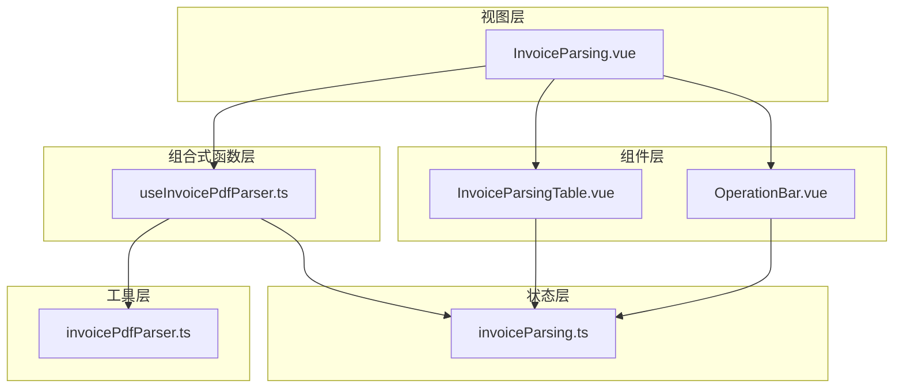
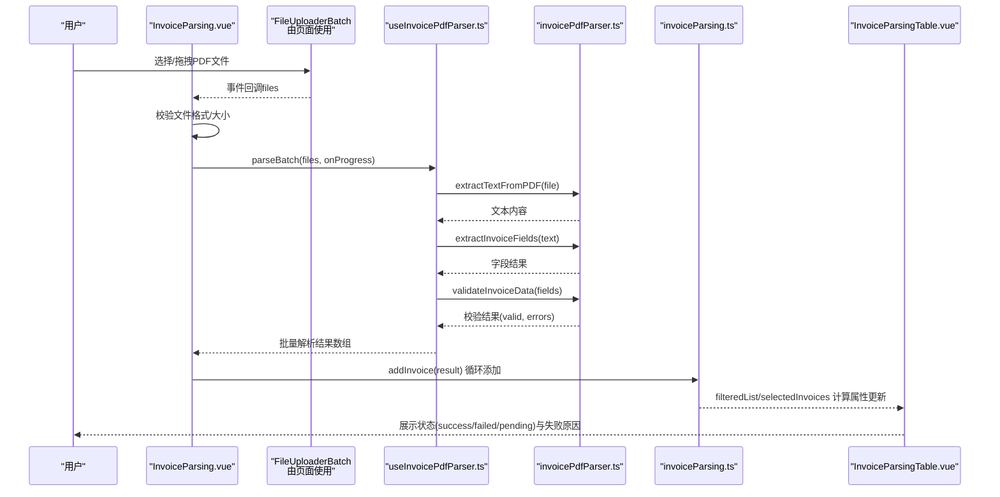
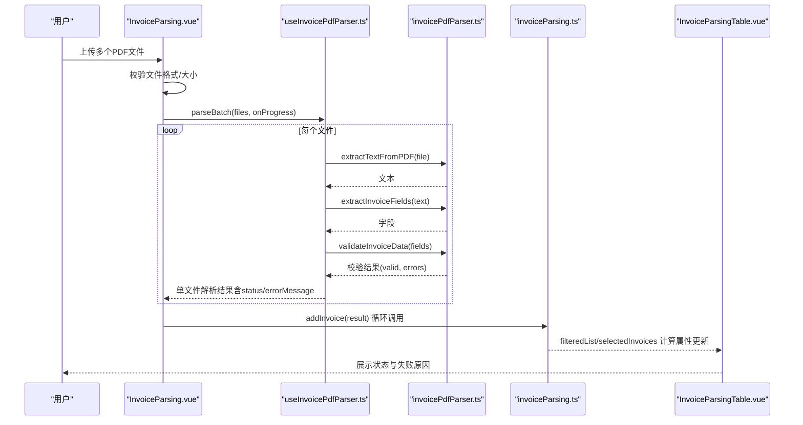

# 数据流与集成

<cite>
**本文引用的文件**
- [useInvoicePdfParser.ts](file://src/composables/useInvoicePdfParser.ts)
- [invoiceParsing.ts](file://src/stores/invoiceParsing.ts)
- [InvoiceParsingTable.vue](file://src/components/InvoiceParsingTable.vue)
- [OperationBar.vue](file://src/components/OperationBar.vue)
- [InvoiceParsing.vue](file://src/views/InvoiceParsing.vue)
- [invoicePdfParser.ts](file://src/utils/invoicePdfParser.ts)
- [fileValidator.ts](file://src/utils/fileValidator.ts)
- [main.ts](file://src/main.ts)
- [package.json](file://package.json)
</cite>

## 目录
1. [简介](#简介)
2. [项目结构](#项目结构)
3. [核心组件](#核心组件)
4. [架构总览](#架构总览)
5. [详细组件分析](#详细组件分析)
6. [依赖关系分析](#依赖关系分析)
7. [性能考量](#性能考量)
8. [故障排查指南](#故障排查指南)
9. [结论](#结论)
10. [附录](#附录)

## 简介
本文件围绕“发票PDF解析”功能，构建从文件上传到解析完成的完整数据流图谱，重点阐述以下内容：
- useInvoicePdfParser 组合式函数如何驱动解析流程，并通过 store 的 addInvoice 和 updateInvoice 方法实现状态变更
- InvoiceParsingTable 组件如何订阅 store 的 filteredList 和 selectedInvoices 等计算属性实现视图更新
- OperationBar 如何通过 store 方法实现批量操作（全选、清空、删除选中、导出）
- 典型交互场景的序列图，展示用户上传文件后状态从 pending 到 success/failure 的转换过程
- 强调错误处理机制（errorMessage 字段）在整个数据流中的传递路径

## 项目结构
该项目采用 Vue 3 + Pinia 的前端架构，围绕“发票解析”功能划分如下层次：
- 视图层：InvoiceParsing.vue 页面承载上传、进度、表格与操作栏
- 组件层：InvoiceParsingTable.vue、OperationBar.vue 等负责 UI 与交互
- 组合式函数层：useInvoicePdfParser.ts 提供解析能力与进度回调
- 工具层：invoicePdfParser.ts 提供 PDF 文本提取、字段提取与校验
- 状态层：invoiceParsing.ts 定义解析结果的 Store，提供 addInvoice/updateInvoice 等方法

图表来源
- [InvoiceParsing.vue](file://src/views/InvoiceParsing.vue#L122-L328)
- [useInvoicePdfParser.ts](file://src/composables/useInvoicePdfParser.ts#L29-L173)
- [invoicePdfParser.ts](file://src/utils/invoicePdfParser.ts#L97-L349)
- [invoiceParsing.ts](file://src/stores/invoiceParsing.ts#L62-L241)
- [InvoiceParsingTable.vue](file://src/components/InvoiceParsingTable.vue#L1-L157)
- [OperationBar.vue](file://src/components/OperationBar.vue#L1-L119)

章节来源
- [InvoiceParsing.vue](file://src/views/InvoiceParsing.vue#L1-L328)
- [useInvoicePdfParser.ts](file://src/composables/useInvoicePdfParser.ts#L1-L173)
- [invoicePdfParser.ts](file://src/utils/invoicePdfParser.ts#L1-L349)
- [invoiceParsing.ts](file://src/stores/invoiceParsing.ts#L1-L241)
- [InvoiceParsingTable.vue](file://src/components/InvoiceParsingTable.vue#L1-L157)
- [OperationBar.vue](file://src/components/OperationBar.vue#L1-L119)

## 核心组件
- useInvoicePdfParser：封装单文件/批量解析、进度回调、状态标记（pending/success/failed）、错误信息收集
- invoiceParsing Store：维护解析结果列表、筛选、搜索、选中集合、批量操作方法
- InvoiceParsingTable：基于 NaiveUI 的数据表格，动态渲染多税率列，显示状态与失败原因
- OperationBar：提供筛选、搜索、全选/清空、删除选中、导出等批量操作
- InvoiceParsing 页面：协调上传、解析、进度展示、结果展示与导出

章节来源
- [useInvoicePdfParser.ts](file://src/composables/useInvoicePdfParser.ts#L29-L173)
- [invoiceParsing.ts](file://src/stores/invoiceParsing.ts#L62-L241)
- [InvoiceParsingTable.vue](file://src/components/InvoiceParsingTable.vue#L1-L157)
- [OperationBar.vue](file://src/components/OperationBar.vue#L1-L119)
- [InvoiceParsing.vue](file://src/views/InvoiceParsing.vue#L122-L328)

## 架构总览
下图展示了从用户上传到解析完成的端到端数据流，包括状态变更与错误传播路径。

图表来源
- [InvoiceParsing.vue](file://src/views/InvoiceParsing.vue#L188-L232)
- [useInvoicePdfParser.ts](file://src/composables/useInvoicePdfParser.ts#L96-L153)
- [invoicePdfParser.ts](file://src/utils/invoicePdfParser.ts#L97-L349)
- [invoiceParsing.ts](file://src/stores/invoiceParsing.ts#L122-L128)
- [InvoiceParsingTable.vue](file://src/components/InvoiceParsingTable.vue#L100-L134)

## 详细组件分析

### useInvoicePdfParser 组合式函数
- 功能职责
  - 单文件解析：执行格式校验、PDF文本提取、字段提取、数据校验，构造包含状态与错误信息的结果对象
  - 批量解析：按批次并发解析，提供进度回调；最终返回结果数组
  - 状态管理：暴露 isProcessing、progress、currentFile，便于 UI 展示解析进度与当前文件
- 关键点
  - 结果对象包含 status（pending/success/failed）与 errorMessage 字段，用于驱动 UI 状态与错误展示
  - 批量解析采用分批并发策略，提升吞吐同时控制内存占用
- 错误处理
  - 文件格式/大小校验阶段抛出错误，统一被捕获并映射为失败结果，确保流程可控

章节来源
- [useInvoicePdfParser.ts](file://src/composables/useInvoicePdfParser.ts#L29-L173)
- [invoicePdfParser.ts](file://src/utils/invoicePdfParser.ts#L97-L349)

### invoiceParsing Store（解析结果状态）
- 数据模型
  - InvoiceParseResult：包含 id、fileName、发票关键字段、状态、错误信息、解析时间等
- 计算属性
  - filteredList：按状态与关键词过滤
  - selectedInvoices：根据 selectedIds 计算选中集合
  - successCount/failedCount/totalCount/maxTaxRateCount：统计与动态列支持
- 方法
  - addInvoice：向列表追加解析结果
  - updateInvoice：按 id 更新部分字段，支持后续状态变更
  - removeInvoice/removeInvoices/clearAll：批量删除与清空
  - 选择与筛选：selectAll/clearSelection/toggleSelection/setFilterStatus/setSearchKeyword

章节来源
- [invoiceParsing.ts](file://src/stores/invoiceParsing.ts#L17-L60)
- [invoiceParsing.ts](file://src/stores/invoiceParsing.ts#L62-L241)

### InvoiceParsingTable 组件
- 功能职责
  - 渲染基础列与动态税率列，根据状态渲染标签颜色
  - 显示失败原因列，当状态为 failed 且存在 errorMessage 时高亮展示
  - 支持分页、滚动宽度自适应、选择行与删除操作
- 与 Store 的订阅关系
  - 通过 props 接收 filteredList、selectedIds、maxTaxRateCount 等，实现响应式更新
  - 通过事件向父组件回传选中项变更与删除请求

章节来源
- [InvoiceParsingTable.vue](file://src/components/InvoiceParsingTable.vue#L1-L157)
- [invoiceParsing.ts](file://src/stores/invoiceParsing.ts#L71-L119)

### OperationBar 组件
- 功能职责
  - 提供状态筛选（全部/成功/失败）与关键词搜索输入
  - 提供全选、清空、删除选中、导出按钮
- 与 Store 的交互
  - 通过 v-model 与事件双向绑定 filterStatus/searchKeyword
  - 通过 emit 触发批量操作（selectAll/clearSelection/delete-selected/export）

章节来源
- [OperationBar.vue](file://src/components/OperationBar.vue#L1-L119)
- [InvoiceParsing.vue](file://src/views/InvoiceParsing.vue#L17-L75)

### 典型交互场景：从上传到状态变更
以下序列图展示用户上传文件后，状态从 pending 到 success/failure 的转换过程，以及 errorMessage 在各环节的传递路径。

图表来源
- [InvoiceParsing.vue](file://src/views/InvoiceParsing.vue#L188-L232)
- [useInvoicePdfParser.ts](file://src/composables/useInvoicePdfParser.ts#L96-L153)
- [invoicePdfParser.ts](file://src/utils/invoicePdfParser.ts#L97-L349)
- [invoiceParsing.ts](file://src/stores/invoiceParsing.ts#L122-L128)
- [InvoiceParsingTable.vue](file://src/components/InvoiceParsingTable.vue#L100-L134)

### 错误处理机制与 errorMessage 传递路径
- 文件校验阶段
  - 页面在上传前进行格式与大小校验，不符合条件直接提示并终止流程
- 解析阶段
  - PDF 文本提取、字段提取、数据校验任一步骤失败，均会捕获异常并构造失败结果，设置 status 为 failed，并将错误信息写入 errorMessage
- Store 层
  - addInvoice 将解析结果写入列表，errorMessage 字段随结果进入 store
  - 计算属性 filteredList 与 selectedInvoices 基于 store 内容派生，从而影响表格渲染
- UI 展示
  - InvoiceParsingTable 在失败状态下高亮显示 errorMessage，帮助用户定位问题

章节来源
- [InvoiceParsing.vue](file://src/views/InvoiceParsing.vue#L193-L203)
- [useInvoicePdfParser.ts](file://src/composables/useInvoicePdfParser.ts#L42-L89)
- [invoicePdfParser.ts](file://src/utils/invoicePdfParser.ts#L125-L128)
- [invoiceParsing.ts](file://src/stores/invoiceParsing.ts#L122-L128)
- [InvoiceParsingTable.vue](file://src/components/InvoiceParsingTable.vue#L116-L125)

## 依赖关系分析
- 运行时依赖
  - pdfjs-dist：用于 PDF 文本提取
  - naive-ui：UI 组件库
  - xlsx/jszip/file-saver：导出与压缩
  - fast-xml-parser：XML 解析（本功能主要聚焦 PDF）
- 构建与类型
  - Vue 3、TypeScript、Vite、Pinia

章节来源
- [package.json](file://package.json#L12-L31)
- [main.ts](file://src/main.ts#L1-L12)

## 性能考量
- 批量解析策略
  - 分批并发：每批 10 个文件，批次间串行、批次内并发，平衡吞吐与资源占用
- 文本提取优化
  - 仅解析前若干页作为快速判断，若未命中关键字段再扩展解析范围
- 动态列渲染
  - 根据 maxTaxRateCount 动态生成列，避免固定列导致的冗余渲染
- 进度反馈
  - 逐文件更新进度，提供实时反馈，减少用户等待焦虑

章节来源
- [useInvoicePdfParser.ts](file://src/composables/useInvoicePdfParser.ts#L13-L153)
- [invoicePdfParser.ts](file://src/utils/invoicePdfParser.ts#L97-L129)
- [invoiceParsing.ts](file://src/stores/invoiceParsing.ts#L105-L114)
- [InvoiceParsingTable.vue](file://src/components/InvoiceParsingTable.vue#L82-L98)

## 故障排查指南
- 常见问题与定位
  - 文件格式/大小不合法：页面上传前校验会提示，检查文件类型与大小限制
  - PDF 文本提取失败：查看工具层日志与错误消息，确认 PDF 是否加密或损坏
  - 字段提取/校验失败：检查发票模板与字段正则匹配，关注 errorMessage 中的具体错误
- Store 与 UI 同步
  - 若表格未更新：确认 filteredList/selectedInvoices 计算属性是否被正确订阅
  - 若删除无效：确认 selectedIds 与 store.selectedIds 是否同步
- 导出失败
  - 检查导出数据源（全部/成功/选中），确认数据非空；查看导出流程日志

章节来源
- [InvoiceParsing.vue](file://src/views/InvoiceParsing.vue#L193-L203)
- [useInvoicePdfParser.ts](file://src/composables/useInvoicePdfParser.ts#L77-L90)
- [invoicePdfParser.ts](file://src/utils/invoicePdfParser.ts#L125-L128)
- [invoiceParsing.ts](file://src/stores/invoiceParsing.ts#L122-L139)
- [InvoiceParsingTable.vue](file://src/components/InvoiceParsingTable.vue#L116-L125)

## 结论
本功能通过 useInvoicePdfParser 与 invoiceParsing Store 的协作，实现了从文件上传到解析完成的完整闭环。其关键特性包括：
- 明确的状态与错误传播路径（status 与 errorMessage）
- 响应式的 UI 订阅（filteredList、selectedInvoices）
- 可扩展的批量操作（全选、清空、删除、导出）
- 面向性能的解析策略与动态列渲染

建议在后续迭代中：
- 增强字段提取的鲁棒性与可配置性
- 提供更丰富的导出格式与模板
- 加强日志与错误上报，便于问题定位

## 附录
- 关键接口与数据结构参考
  - 解析结果模型：InvoiceParseResult（包含状态与错误信息）
  - 计算属性：filteredList、selectedInvoices、successCount/failedCount/totalCount/maxTaxRateCount
  - 组合式函数：parseInvoice、parseBatch、进度回调

章节来源
- [invoiceParsing.ts](file://src/stores/invoiceParsing.ts#L17-L60)
- [invoiceParsing.ts](file://src/stores/invoiceParsing.ts#L71-L119)
- [useInvoicePdfParser.ts](file://src/composables/useInvoicePdfParser.ts#L29-L173)