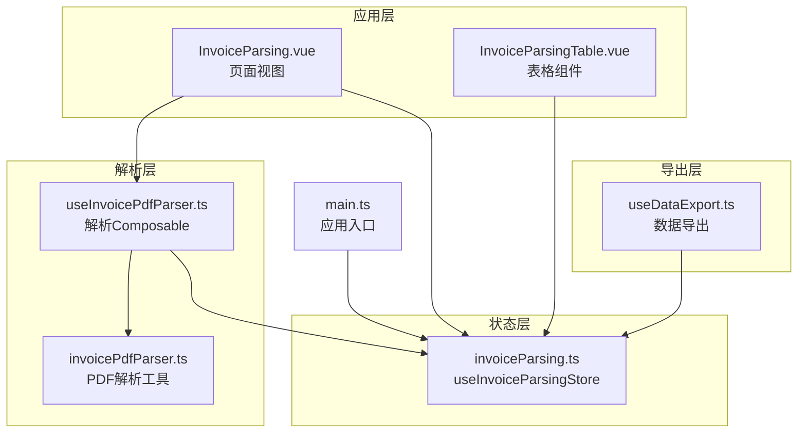
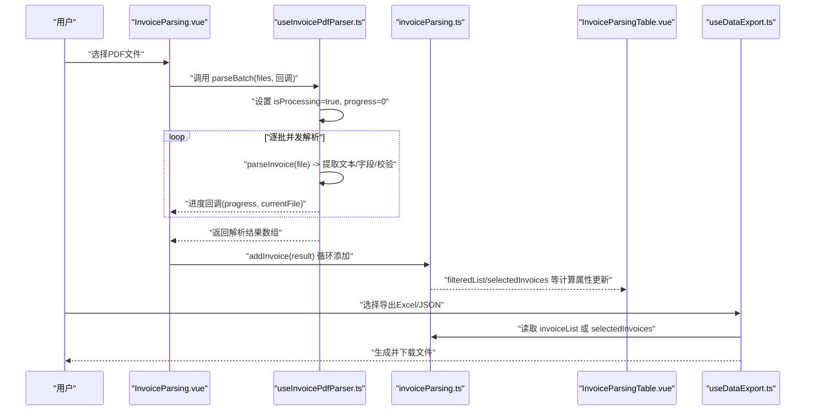
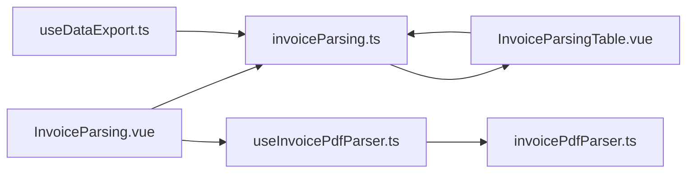

# 状态定义

<cite>
**本文引用的文件**
- [src/stores/invoiceParsing.ts](file://src/stores/invoiceParsing.ts)
- [src/views/InvoiceParsing.vue](file://src/views/InvoiceParsing.vue)
- [src/components/InvoiceParsingTable.vue](file://src/components/InvoiceParsingTable.vue)
- [src/composables/useInvoicePdfParser.ts](file://src/composables/useInvoicePdfParser.ts)
- [src/utils/invoicePdfParser.ts](file://src/utils/invoicePdfParser.ts)
- [src/main.ts](file://src/main.ts)
- [src/composables/useDataExport.ts](file://src/composables/useDataExport.ts)
</cite>

## 目录
1. [简介](#简介)
2. [项目结构](#项目结构)
3. [核心组件](#核心组件)
4. [架构总览](#架构总览)
5. [详细组件分析](#详细组件分析)
6. [依赖关系分析](#依赖关系分析)
7. [性能考量](#性能考量)
8. [故障排查指南](#故障排查指南)
9. [结论](#结论)

## 简介
本文件聚焦于发票解析模块的状态管理，系统性阐述 invoiceParsing store 的核心状态字段设计与实现，包括：
- invoiceList（解析结果列表）
- filterStatus（过滤状态）
- searchKeyword（搜索关键词）
- selectedIds（选中项ID集合）
- isProcessing（处理中标志）

重点解释这些响应式状态如何通过 ref 实现，以及它们在发票解析流程中的作用；结合代码示例路径说明状态初始化过程、类型定义（如 InvoiceParseResult 接口），并描述各状态字段的默认值与其业务含义。同时覆盖开发环境日志输出机制（isDev 判断）对状态变更的追踪能力，以及状态与 UI 组件的数据绑定方式。

## 项目结构
该模块围绕 Pinia Store、Vue 组合式 API 与 Naive UI 组件协作，形成“解析流程—状态管理—UI 展示”的闭环。核心文件分布如下：
- 状态定义与逻辑：src/stores/invoiceParsing.ts
- 页面视图与交互：src/views/InvoiceParsing.vue
- 表格渲染与列动态生成：src/components/InvoiceParsingTable.vue
- 解析流程与进度：src/composables/useInvoicePdfParser.ts
- PDF 文本提取与字段解析：src/utils/invoicePdfParser.ts
- 应用挂载与全局状态注入：src/main.ts
- 数据导出（与 store 数据联动）：src/composables/useDataExport.ts

图表来源
- [src/views/InvoiceParsing.vue](file://src/views/InvoiceParsing.vue#L122-L328)
- [src/components/InvoiceParsingTable.vue](file://src/components/InvoiceParsingTable.vue#L1-L157)
- [src/stores/invoiceParsing.ts](file://src/stores/invoiceParsing.ts#L62-L241)
- [src/composables/useInvoicePdfParser.ts](file://src/composables/useInvoicePdfParser.ts#L29-L173)
- [src/utils/invoicePdfParser.ts](file://src/utils/invoicePdfParser.ts#L1-L349)
- [src/composables/useDataExport.ts](file://src/composables/useDataExport.ts#L1-L200)
- [src/main.ts](file://src/main.ts#L1-L12)

章节来源
- [src/stores/invoiceParsing.ts](file://src/stores/invoiceParsing.ts#L62-L241)
- [src/views/InvoiceParsing.vue](file://src/views/InvoiceParsing.vue#L122-L328)
- [src/components/InvoiceParsingTable.vue](file://src/components/InvoiceParsingTable.vue#L1-L157)
- [src/composables/useInvoicePdfParser.ts](file://src/composables/useInvoicePdfParser.ts#L29-L173)
- [src/utils/invoicePdfParser.ts](file://src/utils/invoicePdfParser.ts#L1-L349)
- [src/composables/useDataExport.ts](file://src/composables/useDataExport.ts#L1-L200)
- [src/main.ts](file://src/main.ts#L1-L12)

## 核心组件
本节聚焦 invoiceParsing store 的核心状态字段与计算属性，说明其类型、默认值、业务含义与在解析流程中的作用。

- 状态字段与默认值
  - invoiceList：初始为空数组，承载解析结果列表。类型为 Ref<InvoiceParseResult[]>。
  - filterStatus：初始值为字符串 "all"，用于控制按状态筛选（全部/成功/失败）。
  - searchKeyword：初始值为空字符串，用于全文检索（文件名、发票号、金额等字段）。
  - selectedIds：初始为空数组，存储当前选中项的 ID 集合。
  - isProcessing：初始值为布尔 false，表示当前是否处于解析处理中。

- 类型定义与业务含义
  - InvoiceParseResult 接口：描述单条解析结果，包含 id、fileName、invoiceNumber、invoiceType、amount、taxAmount、totalAmount、taxRates、status、errorMessage、parseTime、originalFile 等字段。其中 status 为 'success' | 'failed' | 'pending'，parseTime 为 ISO 时间戳。
  - TaxRate 接口：描述多税率，包含 rate（如 "13%"）、amount（可选）、index（序号，用于动态列展示）。

- 计算属性
  - filteredList：基于 filterStatus 与 searchKeyword 的组合过滤结果。
  - successCount / failedCount / totalCount：统计成功/失败/总数。
  - maxTaxRateCount：根据列表中最高税率数量动态调整表格列数。
  - selectedInvoices：根据 selectedIds 与 invoiceList 的交集得到选中项。

- 方法
  - addInvoice/updateInvoice/removeInvoice/removeInvoices/clearAll：增删改查与清空。
  - toggleSelection/selectAll/clearSelection：选择逻辑。
  - setFilterStatus/setSearchKeyword：更新过滤与搜索条件。

章节来源
- [src/stores/invoiceParsing.ts](file://src/stores/invoiceParsing.ts#L17-L60)
- [src/stores/invoiceParsing.ts](file://src/stores/invoiceParsing.ts#L62-L241)

## 架构总览
下图展示从用户上传到解析完成，再到 UI 展示与导出的完整流程，以及状态在其中的流转。

图表来源
- [src/views/InvoiceParsing.vue](file://src/views/InvoiceParsing.vue#L188-L232)
- [src/composables/useInvoicePdfParser.ts](file://src/composables/useInvoicePdfParser.ts#L96-L153)
- [src/stores/invoiceParsing.ts](file://src/stores/invoiceParsing.ts#L122-L173)
- [src/components/InvoiceParsingTable.vue](file://src/components/InvoiceParsingTable.vue#L1-L157)
- [src/composables/useDataExport.ts](file://src/composables/useDataExport.ts#L191-L200)

## 详细组件分析

### 状态字段与初始化
- 初始化位置与默认值
  - 在 store 定义处通过 ref 初始化各状态字段，默认值分别为：空数组、字符串 "all"、空字符串、空数组、布尔 false。
  - 开发环境判断 isDev 用于条件输出日志，便于追踪状态变更。

- 代码示例路径
  - 状态初始化与类型定义：[src/stores/invoiceParsing.ts](file://src/stores/invoiceParsing.ts#L62-L68)
  - 开发环境日志开关：[src/stores/invoiceParsing.ts](file://src/stores/invoiceParsing.ts#L8-L8)

- 业务含义
  - invoiceList：承载解析结果，作为表格渲染的数据源。
  - filterStatus：控制筛选器的当前状态，影响 filteredList 的过滤范围。
  - searchKeyword：提供关键词搜索，提升检索效率。
  - selectedIds：维护多选状态，支持全选/反选/清空。
  - isProcessing：控制 UI 加载态与交互禁用，避免重复提交。

章节来源
- [src/stores/invoiceParsing.ts](file://src/stores/invoiceParsing.ts#L62-L68)
- [src/stores/invoiceParsing.ts](file://src/stores/invoiceParsing.ts#L8-L8)

### 过滤与搜索逻辑
- 过滤逻辑
  - 当 filterStatus 不为 "all" 时，仅保留对应状态的记录。
- 搜索逻辑
  - 当 searchKeyword 非空时，对 fileName、invoiceNumber、amount、totalAmount 进行模糊匹配（忽略大小写）。
- 计算属性 filteredList
  - 结合上述两个条件，返回最终展示列表。

- 代码示例路径
  - 过滤与搜索实现：[src/stores/invoiceParsing.ts](file://src/stores/invoiceParsing.ts#L71-L91)

- UI 绑定
  - 页面中通过 v-model 与事件绑定 filterStatus 与 searchKeyword，实时触发 filteredList 更新。
  - 代码示例路径：[src/views/InvoiceParsing.vue](file://src/views/InvoiceParsing.vue#L19-L41)

章节来源
- [src/stores/invoiceParsing.ts](file://src/stores/invoiceParsing.ts#L71-L91)
- [src/views/InvoiceParsing.vue](file://src/views/InvoiceParsing.vue#L19-L41)

### 选择逻辑与表格绑定
- 选择逻辑
  - toggleSelection：切换某条记录的选中状态。
  - selectAll：基于 filteredList 的 id 列表一次性全选。
  - clearSelection：清空选中。
- 表格绑定
  - InvoiceParsingTable.vue 通过 checked-row-keys 绑定 selectedIds，支持多选。
  - 通过 update:selectedIds 事件回传选中项变化，页面侧将其同步到 store.selectedIds。

- 代码示例路径
  - 选择方法实现：[src/stores/invoiceParsing.ts](file://src/stores/invoiceParsing.ts#L175-L198)
  - 表格组件绑定：[src/components/InvoiceParsingTable.vue](file://src/components/InvoiceParsingTable.vue#L8-L11)
  - 页面事件处理：[src/views/InvoiceParsing.vue](file://src/views/InvoiceParsing.vue#L181-L183)

章节来源
- [src/stores/invoiceParsing.ts](file://src/stores/invoiceParsing.ts#L175-L198)
- [src/components/InvoiceParsingTable.vue](file://src/components/InvoiceParsingTable.vue#L8-L11)
- [src/views/InvoiceParsing.vue](file://src/views/InvoiceParsing.vue#L181-L183)

### 处理中标志与解析流程
- 处理中标志 isProcessing
  - 页面在开始解析前设为 true，解析完成后重置为 false。
  - UI 中用于禁用上传按钮、显示加载态与进度弹窗。
- 解析流程
  - 使用 useInvoicePdfParser.ts 的 parseBatch 并发解析，逐文件更新进度。
  - 解析完成后，逐条调用 store.addInvoice 将结果加入 invoiceList。
  - store 内部通过 isDev 输出日志，便于定位问题。

- 代码示例路径
  - 页面处理上传与进度：[src/views/InvoiceParsing.vue](file://src/views/InvoiceParsing.vue#L188-L232)
  - 解析 Composable 与进度回调：[src/composables/useInvoicePdfParser.ts](file://src/composables/useInvoicePdfParser.ts#L96-L153)
  - store 日志输出：[src/stores/invoiceParsing.ts](file://src/stores/invoiceParsing.ts#L123-L125)

章节来源
- [src/views/InvoiceParsing.vue](file://src/views/InvoiceParsing.vue#L188-L232)
- [src/composables/useInvoicePdfParser.ts](file://src/composables/useInvoicePdfParser.ts#L96-L153)
- [src/stores/invoiceParsing.ts](file://src/stores/invoiceParsing.ts#L123-L125)

### 税率列动态生成与表格列扩展
- 动态列依据
  - maxTaxRateCount 计算列表中最高税率数量，决定动态列数量。
- 表格列扩展
  - baseColumns + dynamicTaxRateColumns + trailingColumns 组成完整列配置。
  - scrollX 根据税率列数量动态计算，保证横向滚动体验。

- 代码示例路径
  - 动态列生成：[src/components/InvoiceParsingTable.vue](file://src/components/InvoiceParsingTable.vue#L82-L98)
  - 最大税率计算：[src/stores/invoiceParsing.ts](file://src/stores/invoiceParsing.ts#L105-L114)

章节来源
- [src/components/InvoiceParsingTable.vue](file://src/components/InvoiceParsingTable.vue#L82-L98)
- [src/stores/invoiceParsing.ts](file://src/stores/invoiceParsing.ts#L105-L114)

### 数据导出与状态联动
- 导出数据来源
  - 支持导出全部、成功记录、选中记录三种模式，分别对应 store.invoiceList、filteredList（status='success'）与 selectedInvoices。
- 导出实现
  - useDataExport.ts 在导出前会检查数据长度，避免空导出；导出后返回结果与文件名。

- 代码示例路径
  - 导出模式选择与数据获取：[src/views/InvoiceParsing.vue](file://src/views/InvoiceParsing.vue#L273-L283)
  - 导出实现与日志：[src/composables/useDataExport.ts](file://src/composables/useDataExport.ts#L191-L200)

章节来源
- [src/views/InvoiceParsing.vue](file://src/views/InvoiceParsing.vue#L273-L283)
- [src/composables/useDataExport.ts](file://src/composables/useDataExport.ts#L191-L200)

## 依赖关系分析
- store 与组件的耦合
  - 页面视图通过 v-model 与事件双向绑定 store 的状态与计算属性，保持高内聚低耦合。
  - 表格组件仅依赖 store 的只读数据与事件回调，避免直接修改 store。
- 解析流程的依赖
  - useInvoicePdfParser.ts 依赖 invoicePdfParser.ts 完成 PDF 文本提取与字段解析。
  - store 依赖解析结果类型 InvoiceParseResult，确保数据结构一致。
- 导出功能的依赖
  - useDataExport.ts 依赖 store 的数据，实现无侵入式导出。

图表来源
- [src/stores/invoiceParsing.ts](file://src/stores/invoiceParsing.ts#L62-L241)
- [src/views/InvoiceParsing.vue](file://src/views/InvoiceParsing.vue#L122-L328)
- [src/components/InvoiceParsingTable.vue](file://src/components/InvoiceParsingTable.vue#L1-L157)
- [src/composables/useInvoicePdfParser.ts](file://src/composables/useInvoicePdfParser.ts#L29-L173)
- [src/utils/invoicePdfParser.ts](file://src/utils/invoicePdfParser.ts#L1-L349)
- [src/composables/useDataExport.ts](file://src/composables/useDataExport.ts#L1-L200)

章节来源
- [src/stores/invoiceParsing.ts](file://src/stores/invoiceParsing.ts#L62-L241)
- [src/views/InvoiceParsing.vue](file://src/views/InvoiceParsing.vue#L122-L328)
- [src/components/InvoiceParsingTable.vue](file://src/components/InvoiceParsingTable.vue#L1-L157)
- [src/composables/useInvoicePdfParser.ts](file://src/composables/useInvoicePdfParser.ts#L29-L173)
- [src/utils/invoicePdfParser.ts](file://src/utils/invoicePdfParser.ts#L1-L349)
- [src/composables/useDataExport.ts](file://src/composables/useDataExport.ts#L1-L200)

## 性能考量
- 批量解析策略
  - 使用固定批次大小（BATCH_SIZE）进行分批并发解析，平衡吞吐与内存占用。
- 进度反馈
  - 逐文件更新进度，提供细粒度的用户体验。
- 表格列动态计算
  - 仅在需要时生成动态列，避免不必要的 DOM 渲染。
- 开发环境日志
  - isDev 控制日志输出，避免生产环境性能损耗。

章节来源
- [src/composables/useInvoicePdfParser.ts](file://src/composables/useInvoicePdfParser.ts#L13-L15)
- [src/composables/useInvoicePdfParser.ts](file://src/composables/useInvoicePdfParser.ts#L116-L136)
- [src/components/InvoiceParsingTable.vue](file://src/components/InvoiceParsingTable.vue#L136-L137)

## 故障排查指南
- 常见问题定位
  - 解析失败：查看 errorMessage 字段与控制台日志；确认文件格式与大小限制。
  - 状态未更新：检查 v-model 与事件绑定是否正确；确认 store 方法调用顺序。
  - 选中状态异常：核对 selectedIds 与 filteredList 的一致性；确认全选/清空逻辑。
- 开发环境日志
  - store 与解析 Composable 均在 isDev 下输出关键日志，便于追踪状态变更与解析过程。
- 代码示例路径
  - store 日志输出：[src/stores/invoiceParsing.ts](file://src/stores/invoiceParsing.ts#L123-L125)
  - 解析 Composable 日志输出：[src/composables/useInvoicePdfParser.ts](file://src/composables/useInvoicePdfParser.ts#L100-L101)

章节来源
- [src/stores/invoiceParsing.ts](file://src/stores/invoiceParsing.ts#L123-L125)
- [src/composables/useInvoicePdfParser.ts](file://src/composables/useInvoicePdfParser.ts#L100-L101)

## 结论
invoiceParsing store 通过 ref 实现的核心状态字段，配合计算属性与方法，构建了清晰、可维护的发票解析状态管理方案。其默认值与业务含义明确，开发环境日志机制完善，UI 绑定简洁直观。结合 useInvoicePdfParser.ts 的解析流程与 useDataExport.ts 的导出能力，形成了从上传、解析、展示到导出的完整闭环，具备良好的扩展性与可维护性。