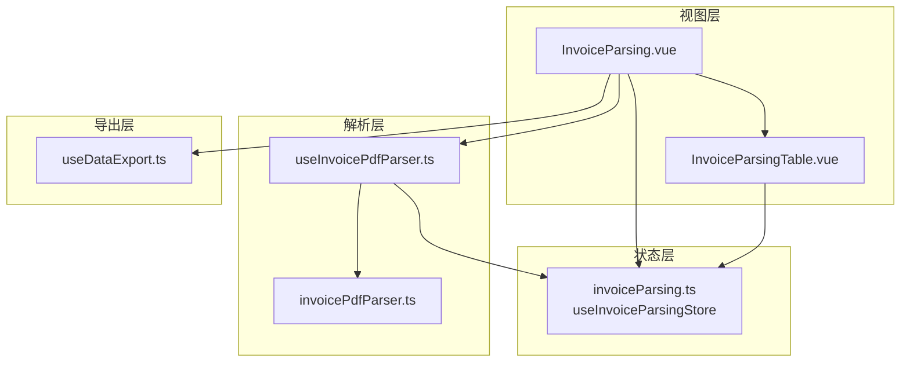
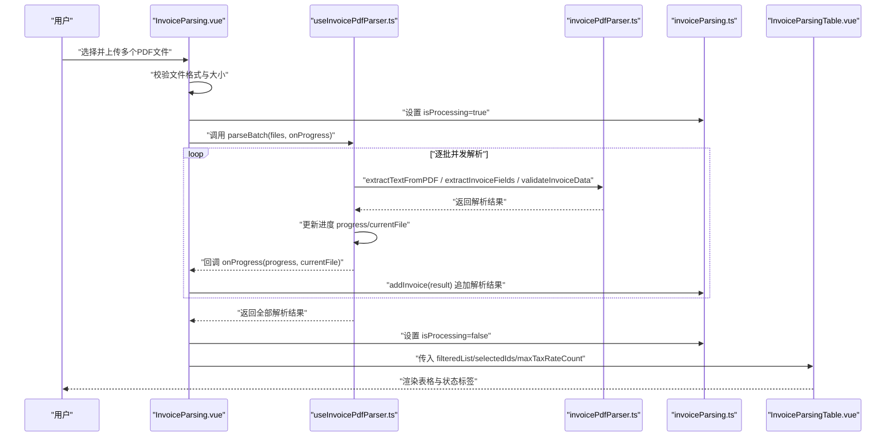
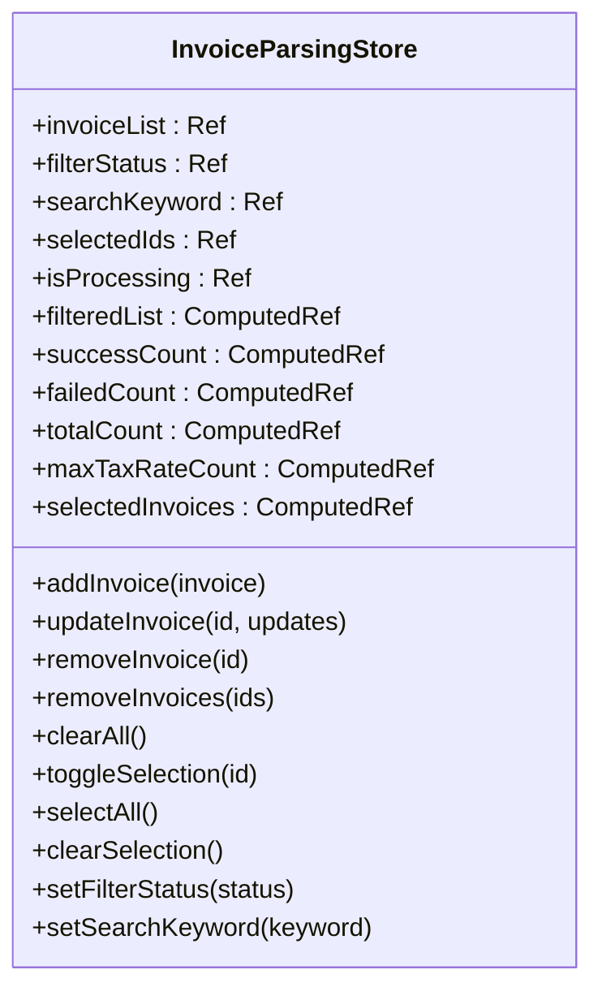
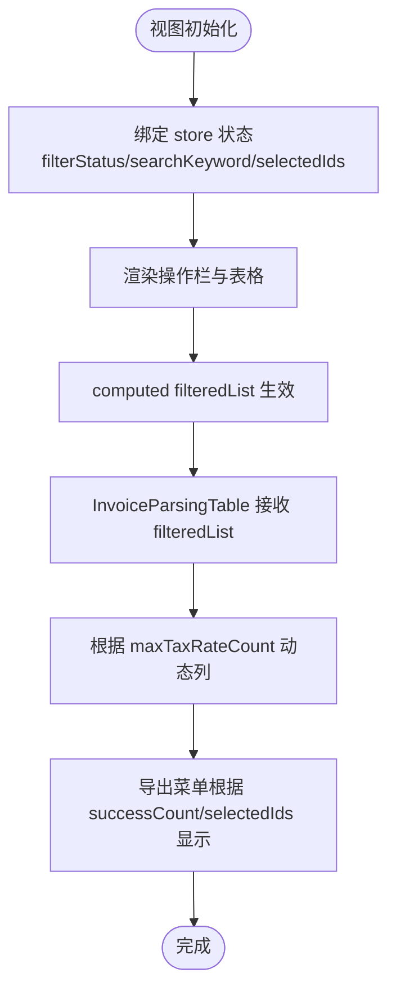
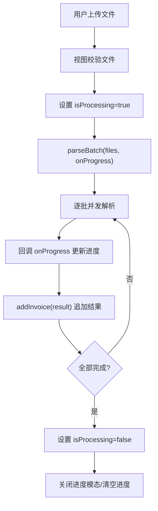
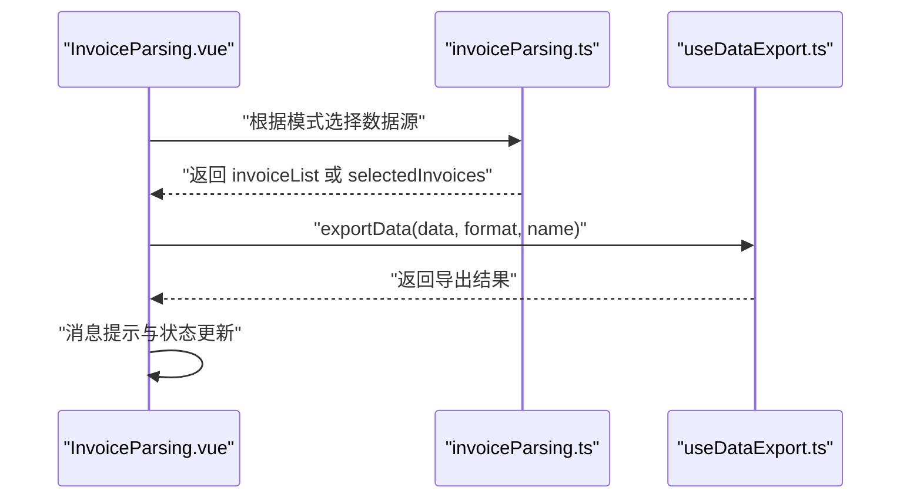
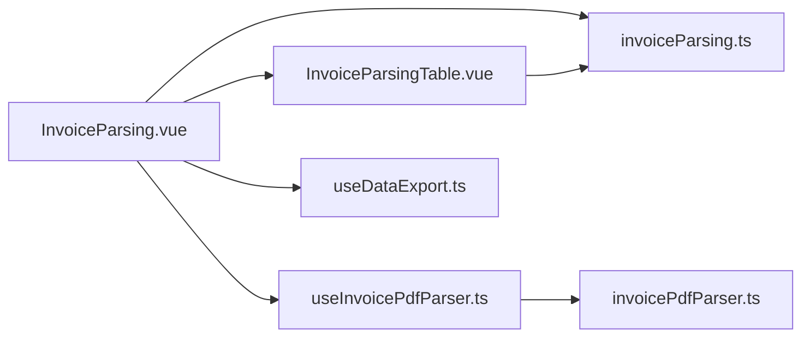

# 状态管理机制

<cite>
**本文引用的文件**
- [src/stores/invoiceParsing.ts](file://src/stores/invoiceParsing.ts)
- [src/views/InvoiceParsing.vue](file://src/views/InvoiceParsing.vue)
- [src/composables/useInvoicePdfParser.ts](file://src/composables/useInvoicePdfParser.ts)
- [src/utils/invoicePdfParser.ts](file://src/utils/invoicePdfParser.ts)
- [src/components/InvoiceParsingTable.vue](file://src/components/InvoiceParsingTable.vue)
- [src/composables/useDataExport.ts](file://src/composables/useDataExport.ts)
- [src/utils/fileValidator.ts](file://src/utils/fileValidator.ts)
</cite>

## 目录
1. [简介](#简介)
2. [项目结构](#项目结构)
3. [核心组件](#核心组件)
4. [架构总览](#架构总览)
5. [详细组件分析](#详细组件分析)
6. [依赖关系分析](#依赖关系分析)
7. [性能考量](#性能考量)
8. [故障排查指南](#故障排查指南)
9. [结论](#结论)

## 简介
本文件系统性阐述 invoiceParsing Store 的状态管理设计，说明其如何通过 Pinia 管理发票解析全过程的状态。重点覆盖：
- 核心状态字段：invoiceList（解析结果列表）、filterStatus（过滤状态）、searchKeyword（搜索关键词）、selectedIds（选中项ID集合）、isProcessing（处理中标志）及其响应式特性
- 计算属性：filteredList、successCount、failedCount、totalCount、maxTaxRateCount、selectedInvoices 的实现逻辑及在 UI 层的消费方式
- 关键方法：addInvoice、updateInvoice、removeInvoice、removeInvoices、clearAll、toggleSelection、selectAll、clearSelection、setFilterStatus、setSearchKeyword 的职责与副作用控制
- 状态流图示例：从文件上传到解析完成的数据流转路径

## 项目结构
该模块围绕“状态中心（Pinia Store）—视图（Vue 组件）—组合式工具（Composable）—工具函数（Utils）”的分层组织展开，形成清晰的职责边界与数据流向。

图表来源
- [src/views/InvoiceParsing.vue](file://src/views/InvoiceParsing.vue#L122-L328)
- [src/stores/invoiceParsing.ts](file://src/stores/invoiceParsing.ts#L62-L241)
- [src/composables/useInvoicePdfParser.ts](file://src/composables/useInvoicePdfParser.ts#L29-L173)
- [src/utils/invoicePdfParser.ts](file://src/utils/invoicePdfParser.ts#L97-L349)
- [src/components/InvoiceParsingTable.vue](file://src/components/InvoiceParsingTable.vue#L1-L157)
- [src/composables/useDataExport.ts](file://src/composables/useDataExport.ts#L39-L209)

章节来源
- [src/views/InvoiceParsing.vue](file://src/views/InvoiceParsing.vue#L1-L328)
- [src/stores/invoiceParsing.ts](file://src/stores/invoiceParsing.ts#L1-L241)

## 核心组件
本节聚焦 invoiceParsing Store 的状态、计算属性与方法，以及它们在视图中的使用方式。

- 状态字段
  - invoiceList：解析结果数组，承载每条发票解析记录
  - filterStatus：当前筛选状态（all/success/failed/pending），用于控制过滤
  - searchKeyword：搜索关键词，支持对文件名、发票号、金额等字段进行模糊匹配
  - selectedIds：当前选中项的 ID 集合，用于表格多选与批量操作
  - isProcessing：全局处理中标志，控制 UI 禁用态与进度显示

- 计算属性
  - filteredList：综合 filterStatus 与 searchKeyword 的筛选结果
  - successCount/failedCount/totalCount：统计成功、失败、总数
  - maxTaxRateCount：根据解析结果动态计算最大税率列数，用于表格列布局
  - selectedInvoices：基于 selectedIds 与 invoiceList 的选中项投影

- 方法
  - addInvoice：向列表追加一条解析结果
  - updateInvoice：按 ID 更新部分字段
  - removeInvoice/removeInvoices/clearAll：单项/批量删除与清空
  - toggleSelection/selectAll/clearSelection：选中项切换与全选
  - setFilterStatus/setSearchKeyword：更新筛选与搜索条件

章节来源
- [src/stores/invoiceParsing.ts](file://src/stores/invoiceParsing.ts#L33-L60)
- [src/stores/invoiceParsing.ts](file://src/stores/invoiceParsing.ts#L71-L119)
- [src/stores/invoiceParsing.ts](file://src/stores/invoiceParsing.ts#L122-L239)

## 架构总览
下图展示了从用户上传到解析完成的完整状态流转过程，以及 Store 在其中的角色与交互。

图表来源
- [src/views/InvoiceParsing.vue](file://src/views/InvoiceParsing.vue#L188-L232)
- [src/composables/useInvoicePdfParser.ts](file://src/composables/useInvoicePdfParser.ts#L96-L153)
- [src/utils/invoicePdfParser.ts](file://src/utils/invoicePdfParser.ts#L97-L349)
- [src/stores/invoiceParsing.ts](file://src/stores/invoiceParsing.ts#L122-L128)
- [src/components/InvoiceParsingTable.vue](file://src/components/InvoiceParsingTable.vue#L1-L157)

## 详细组件分析

### Store：状态、计算属性与方法
- 状态字段
  - invoiceList：Ref<InvoiceParseResult[]>，承载所有解析记录
  - filterStatus：Ref<string>，默认“all”，支持“success/failed/pending”
  - searchKeyword：Ref<string>，空字符串表示无搜索
  - selectedIds：Ref<string[]>，存储选中项 ID
  - isProcessing：Ref<boolean>，控制 UI 禁用态与进度条

- 计算属性
  - filteredList：先按 filterStatus 过滤，再按 searchKeyword 模糊匹配文件名/发票号/金额/价税合计
  - successCount/failedCount/totalCount：基于 invoiceList 的简单过滤统计
  - maxTaxRateCount：遍历 invoiceList，取 taxRates 最大长度，用于动态列生成
  - selectedInvoices：基于 selectedIds 与 invoiceList 的投影

- 方法
  - addInvoice：向 invoiceList 追加一条记录
  - updateInvoice：按 ID 查找并深合并更新
  - removeInvoice：删除单条并同步从 selectedIds 移除
  - removeInvoices：批量委托 removeInvoice
  - clearAll：清空列表与选中项
  - toggleSelection/selectAll/clearSelection：选中项集合的增删改
  - setFilterStatus/setSearchKeyword：更新筛选与搜索条件

图表来源
- [src/stores/invoiceParsing.ts](file://src/stores/invoiceParsing.ts#L33-L60)
- [src/stores/invoiceParsing.ts](file://src/stores/invoiceParsing.ts#L122-L239)

章节来源
- [src/stores/invoiceParsing.ts](file://src/stores/invoiceParsing.ts#L62-L241)

### 视图层：状态消费与交互
- 操作栏与筛选
  - 通过 v-model 绑定 store.filterStatus 与 store.searchKeyword，实时驱动 filteredList
  - 通过 store.successCount/store.failedCount/store.totalCount 动态显示统计
- 表格渲染
  - 传入 store.filteredList、store.selectedIds、store.maxTaxRateCount
  - 表格列根据 maxTaxRateCount 动态生成，确保多税率展示
- 导出功能
  - 根据 selectedIds 或 successCount 控制导出菜单可用性
  - 导出时根据模式选择全部/成功/选中数据

图表来源
- [src/views/InvoiceParsing.vue](file://src/views/InvoiceParsing.vue#L17-L86)
- [src/components/InvoiceParsingTable.vue](file://src/components/InvoiceParsingTable.vue#L82-L137)

章节来源
- [src/views/InvoiceParsing.vue](file://src/views/InvoiceParsing.vue#L1-L328)
- [src/components/InvoiceParsingTable.vue](file://src/components/InvoiceParsingTable.vue#L1-L157)

### 解析流程与状态变更
- 文件上传阶段
  - 视图层校验文件格式与大小后，设置 isProcessing 并打开进度模态
  - 调用 useInvoicePdfParser.parseBatch，逐批并发解析
- 解析阶段
  - 每个文件解析完成后，回调 onProgress 更新进度与当前文件名
  - 将单文件解析结果通过 addInvoice 追加到 store
- 完成阶段
  - 解析结束后重置 isProcessing，关闭进度模态，清空进度与当前文件名
  - filteredList 自动根据 filterStatus 与 searchKeyword 更新

图表来源
- [src/views/InvoiceParsing.vue](file://src/views/InvoiceParsing.vue#L188-L232)
- [src/composables/useInvoicePdfParser.ts](file://src/composables/useInvoicePdfParser.ts#L96-L153)
- [src/stores/invoiceParsing.ts](file://src/stores/invoiceParsing.ts#L122-L128)

章节来源
- [src/views/InvoiceParsing.vue](file://src/views/InvoiceParsing.vue#L188-L232)
- [src/composables/useInvoicePdfParser.ts](file://src/composables/useInvoicePdfParser.ts#L29-L173)

### 导出流程与状态联动
- 导出菜单根据 successCount/selectedIds 决定可用项
- 导出时根据模式选择数据源：全部/成功/选中
- 导出过程中 isExporting 由 useDataExport 控制，避免重复导出

图表来源
- [src/views/InvoiceParsing.vue](file://src/views/InvoiceParsing.vue#L273-L302)
- [src/composables/useDataExport.ts](file://src/composables/useDataExport.ts#L191-L201)
- [src/stores/invoiceParsing.ts](file://src/stores/invoiceParsing.ts#L117-L119)

章节来源
- [src/views/InvoiceParsing.vue](file://src/views/InvoiceParsing.vue#L273-L302)
- [src/composables/useDataExport.ts](file://src/composables/useDataExport.ts#L39-L209)

## 依赖关系分析
- 组件耦合
  - InvoiceParsing.vue 强依赖 useInvoiceParsingStore 与 useInvoicePdfParser
  - InvoiceParsingTable.vue 依赖 store 的 filteredList 与 selectedIds
- 外部依赖
  - pdfjs-dist 用于 PDF 文本抽取
  - xlsx/file-saver 用于 Excel/JSON 导出
- 状态一致性
  - removeInvoice 会同步清理 selectedIds，避免悬挂 ID
  - maxTaxRateCount 与 filteredList 保证表格列数与数据一致

图表来源
- [src/views/InvoiceParsing.vue](file://src/views/InvoiceParsing.vue#L142-L151)
- [src/stores/invoiceParsing.ts](file://src/stores/invoiceParsing.ts#L62-L241)
- [src/composables/useInvoicePdfParser.ts](file://src/composables/useInvoicePdfParser.ts#L29-L173)
- [src/utils/invoicePdfParser.ts](file://src/utils/invoicePdfParser.ts#L97-L349)
- [src/components/InvoiceParsingTable.vue](file://src/components/InvoiceParsingTable.vue#L1-L157)
- [src/composables/useDataExport.ts](file://src/composables/useDataExport.ts#L39-L209)

章节来源
- [src/views/InvoiceParsing.vue](file://src/views/InvoiceParsing.vue#L1-L328)
- [src/stores/invoiceParsing.ts](file://src/stores/invoiceParsing.ts#L1-L241)

## 性能考量
- 批处理与并发
  - useInvoicePdfParser 采用分批并发策略（批次间串行、批次内并发），提升吞吐同时避免内存峰值过高
- 列动态生成
  - maxTaxRateCount 仅在需要时计算，避免每次渲染都做昂贵的遍历
- 进度反馈
  - 逐文件更新进度，提供良好的用户体验；同时避免频繁重渲染
- 导出优化
  - Excel 导出使用 xlsx 的 aoa_to_sheet，减少 DOM 操作；JSON 导出直接序列化，避免额外转换

章节来源
- [src/composables/useInvoicePdfParser.ts](file://src/composables/useInvoicePdfParser.ts#L13-L153)
- [src/components/InvoiceParsingTable.vue](file://src/components/InvoiceParsingTable.vue#L82-L137)
- [src/composables/useDataExport.ts](file://src/composables/useDataExport.ts#L45-L201)

## 故障排查指南
- 解析失败
  - 检查 PDF 是否符合格式与大小限制（10MB）
  - 查看失败原因字段，定位字段提取或验证阶段的问题
- 筛选与搜索无效
  - 确认 filterStatus 与 searchKeyword 是否被正确绑定
  - 检查 filteredList 的实现是否覆盖了状态与关键词
- 选中项异常
  - 删除单条记录后，selectedIds 是否同步清理
  - 全选/清空是否正确更新 selectedIds
- 导出异常
  - 确认导出数据源（全部/成功/选中）是否为空
  - 检查 isExporting 状态，避免重复触发

章节来源
- [src/utils/invoicePdfParser.ts](file://src/utils/invoicePdfParser.ts#L294-L334)
- [src/stores/invoiceParsing.ts](file://src/stores/invoiceParsing.ts#L141-L156)
- [src/views/InvoiceParsing.vue](file://src/views/InvoiceParsing.vue#L273-L302)

## 结论
invoiceParsing Store 通过 Pinia 将发票解析全流程的状态集中管理，结合 Vue 的响应式系统与 Naive UI 的组件能力，实现了从上传、解析、筛选、导出到表格渲染的完整闭环。其设计具备以下特点：
- 状态单一事实源：所有解析结果与用户交互状态集中在 store
- 计算属性解耦：筛选、统计、列布局均通过计算属性实现，降低副作用
- 方法职责清晰：增删改查与选中管理分离，便于维护与扩展
- 性能与体验兼顾：批处理并发、动态列生成、进度反馈与导出优化