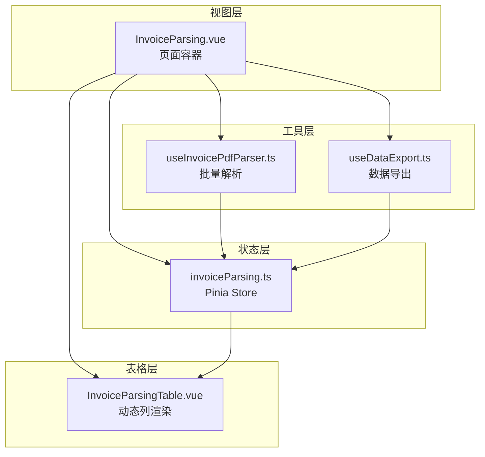
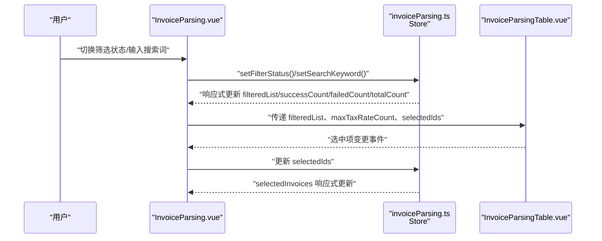
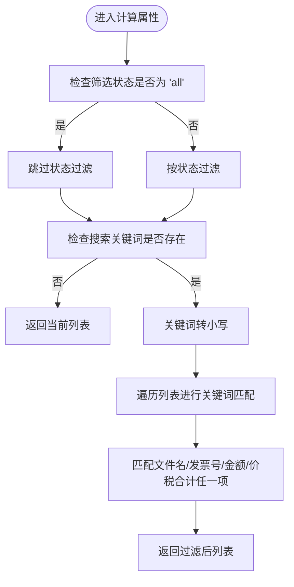
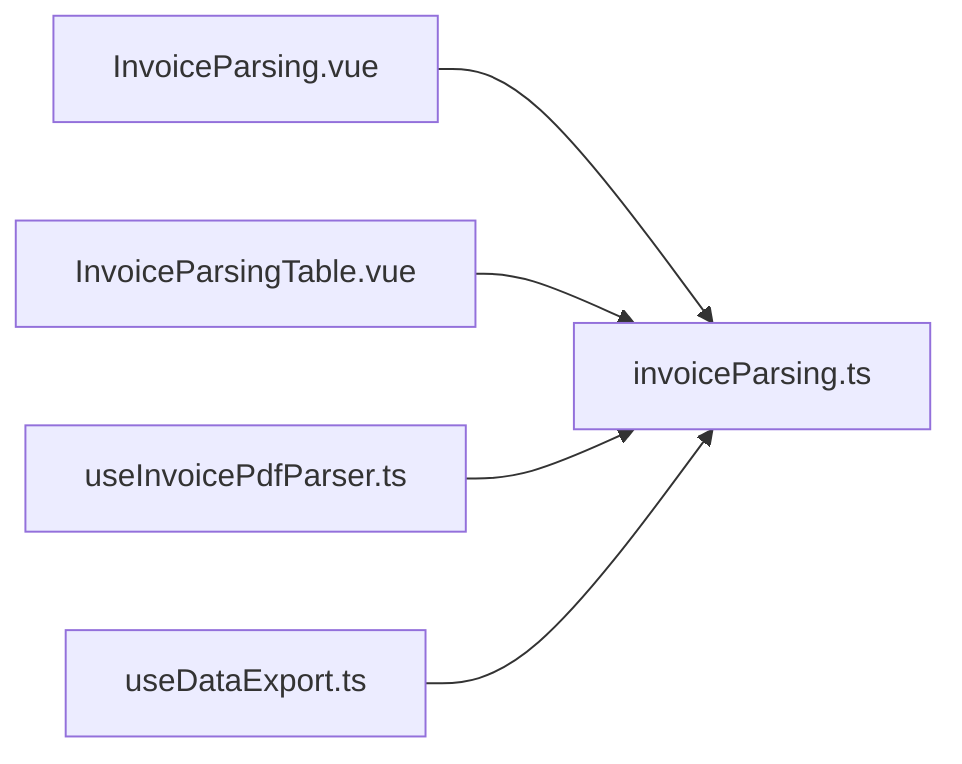

# 计算属性

<cite>
**本文引用的文件**
- [src/stores/invoiceParsing.ts](file://src/stores/invoiceParsing.ts)
- [src/components/InvoiceParsingTable.vue](file://src/components/InvoiceParsingTable.vue)
- [src/views/InvoiceParsing.vue](file://src/views/InvoiceParsing.vue)
- [src/composables/useInvoicePdfParser.ts](file://src/composables/useInvoicePdfParser.ts)
- [src/composables/useDataExport.ts](file://src/composables/useDataExport.ts)
</cite>

## 目录
1. [简介](#简介)
2. [项目结构](#项目结构)
3. [核心组件](#核心组件)
4. [架构总览](#架构总览)
5. [详细组件分析](#详细组件分析)
6. [依赖关系分析](#依赖关系分析)
7. [性能考量](#性能考量)
8. [故障排查指南](#故障排查指南)
9. [结论](#结论)

## 简介
本文件聚焦于发票解析模块中 Pinia Store 的计算属性实现与业务价值，重点解析以下五个计算属性：
- filteredList（过滤后列表）
- successCount（成功数量）
- failedCount（失败数量）
- totalCount（总数）
- maxTaxRateCount（最大税率数）
- selectedInvoices（选中项）

并说明它们如何协同工作以支撑动态表格列渲染、搜索与筛选、统计展示以及批量操作等关键功能；同时给出在 InvoiceParsingTable 组件中的消费方式与响应式更新机制带来的性能优势。

## 项目结构
该模块围绕“状态管理 + 动态表格 + 批量解析”的业务闭环展开：
- 状态层：Pinia Store 管理发票解析结果、筛选状态、搜索关键词、选中项集合等
- 视图层：页面组件负责交互控制、统计展示与事件分发
- 表格层：动态列渲染根据最大税率数自适应扩展
- 工具层：解析与导出能力通过 Composable 提供

图表来源
- [src/views/InvoiceParsing.vue](file://src/views/InvoiceParsing.vue#L1-L328)
- [src/stores/invoiceParsing.ts](file://src/stores/invoiceParsing.ts#L1-L241)
- [src/components/InvoiceParsingTable.vue](file://src/components/InvoiceParsingTable.vue#L1-L157)
- [src/composables/useInvoicePdfParser.ts](file://src/composables/useInvoicePdfParser.ts#L1-L173)
- [src/composables/useDataExport.ts](file://src/composables/useDataExport.ts#L1-L308)

章节来源
- [src/views/InvoiceParsing.vue](file://src/views/InvoiceParsing.vue#L1-L328)
- [src/stores/invoiceParsing.ts](file://src/stores/invoiceParsing.ts#L1-L241)
- [src/components/InvoiceParsingTable.vue](file://src/components/InvoiceParsingTable.vue#L1-L157)
- [src/composables/useInvoicePdfParser.ts](file://src/composables/useInvoicePdfParser.ts#L1-L173)
- [src/composables/useDataExport.ts](file://src/composables/useDataExport.ts#L1-L308)

## 核心组件
本节对六个计算属性进行逐一剖析，涵盖实现逻辑、复杂度、依赖关系与业务价值。

- filteredList（过滤后列表）
  - 实现要点：先按状态过滤，再按关键词搜索（文件名、发票号、金额、价税合计），均执行小写匹配
  - 时间复杂度：O(n)（n 为发票记录数），每次变更触发一次全量过滤
  - 业务价值：为表格提供最终展示数据源，支持“状态+关键词”双条件筛选
  - 依赖：filterStatus、searchKeyword、invoiceList

- successCount（成功数量）
  - 实现要点：统计状态为“成功”的记录数
  - 时间复杂度：O(n)
  - 业务价值：用于顶部统计标签与导出按钮禁用状态判断
  - 依赖：invoiceList

- failedCount（失败数量）
  - 实现要点：统计状态为“失败”的记录数
  - 时间复杂度：O(n)
  - 业务价值：用于顶部统计标签与导出按钮禁用状态判断
  - 依赖：invoiceList

- totalCount（总数）
  - 实现要点：直接返回记录总数
  - 时间复杂度：O(1)
  - 业务价值：用于“全部”统计标签显示
  - 依赖：invoiceList

- maxTaxRateCount（最大税率数）
  - 实现要点：遍历所有记录，取 taxRates 长度的最大值；用于动态列渲染
  - 时间复杂度：O(n)
  - 业务价值：驱动表格动态列生成，确保列数随最高税率数变化而自适应
  - 依赖：invoiceList

- selectedInvoices（选中项）
  - 实现要点：根据 selectedIds 与 invoiceList 的交集过滤
  - 时间复杂度：O(n)
  - 业务价值：为批量导出、批量删除等操作提供数据源
  - 依赖：selectedIds、invoiceList

章节来源
- [src/stores/invoiceParsing.ts](file://src/stores/invoiceParsing.ts#L70-L119)

## 架构总览
下图展示了计算属性在整体架构中的位置与调用链路，强调响应式更新与组件消费方式。

图表来源
- [src/views/InvoiceParsing.vue](file://src/views/InvoiceParsing.vue#L17-L85)
- [src/stores/invoiceParsing.ts](file://src/stores/invoiceParsing.ts#L200-L239)
- [src/components/InvoiceParsingTable.vue](file://src/components/InvoiceParsingTable.vue#L14-L32)

## 详细组件分析

### 计算属性实现与业务价值
- filteredList
  - 双重条件过滤：先按状态过滤，再按关键词搜索，关键词匹配字段包括文件名、发票号、金额、价税合计
  - 业务价值：统一表格数据源，减少视图层重复过滤逻辑，提升一致性与可维护性
  - 性能影响：每次状态或关键词变化都会重新计算，但 O(n) 复杂度在中等规模数据下可接受

- successCount/failedCount/totalCount
  - 三者均为轻量级统计，分别用于“全部/成功/失败”标签计数
  - 业务价值：直观展示解析结果质量与规模，指导后续操作（如导出启用/禁用）

- maxTaxRateCount
  - 动态列渲染支撑：基于最大税率数生成“税率i”列，列宽与滚动宽度随之调整
  - 业务价值：适配不同发票的多税率场景，避免固定列导致的布局问题

- selectedInvoices
  - 批量操作数据源：用于导出选中、删除选中等批量操作
  - 业务价值：简化批量操作的实现，避免在视图层重复构建选中集合

章节来源
- [src/stores/invoiceParsing.ts](file://src/stores/invoiceParsing.ts#L70-L119)
- [src/components/InvoiceParsingTable.vue](file://src/components/InvoiceParsingTable.vue#L82-L98)
- [src/views/InvoiceParsing.vue](file://src/views/InvoiceParsing.vue#L17-L85)

### filteredList 双重条件过滤流程

图表来源
- [src/stores/invoiceParsing.ts](file://src/stores/invoiceParsing.ts#L71-L91)

章节来源
- [src/stores/invoiceParsing.ts](file://src/stores/invoiceParsing.ts#L71-L91)

### maxTaxRateCount 支持动态表格列渲染
- 在表格组件中，maxTaxRateCount 决定动态列数量与列标题（如“税率1”、“税率2”…）
- 表格列宽度与横向滚动区域会随 maxTaxRateCount 线性增长，保证内容完整可见
- 该设计使表格能够自适应不同发票的多税率场景，无需硬编码列数

章节来源
- [src/components/InvoiceParsingTable.vue](file://src/components/InvoiceParsingTable.vue#L82-L98)
- [src/components/InvoiceParsingTable.vue](file://src/components/InvoiceParsingTable.vue#L136-L137)

### 在 InvoiceParsingTable 组件中的消费方式
- 接收参数
  - data：来自 store.filteredList，作为表格数据源
  - selectedIds：来自 store.selectedIds，绑定复选框选中状态
  - maxTaxRateCount：来自 store.maxTaxRateCount，驱动动态列生成
  - loading：来自 store.isProcessing，控制表格加载态
- 事件
  - update:selectedIds：当用户勾选/取消勾选时，向父组件回传新的选中项集合
  - delete：当用户点击删除按钮时，向父组件回传要删除的记录 ID
- 动态列
  - 基础列：序号、文件名、发票号码、发票类型、金额、税额、价税合计
  - 动态列：根据 maxTaxRateCount 生成“税率i”列，渲染对应税率值
  - 末尾列：状态、失败原因、操作（删除）

章节来源
- [src/components/InvoiceParsingTable.vue](file://src/components/InvoiceParsingTable.vue#L22-L32)
- [src/components/InvoiceParsingTable.vue](file://src/components/InvoiceParsingTable.vue#L136-L137)

### 响应式更新机制与性能优势
- 响应式更新
  - store 中的状态（如 invoiceList、filterStatus、searchKeyword、selectedIds）发生变更时，对应的计算属性会自动重新计算
  - 视图层通过 v-model 或 props 接收这些响应式值，实现无侵入的 UI 同步
- 性能优势
  - 无副作用：计算属性只读，避免了在模板中重复执行昂贵逻辑
  - 惰性求值：未被消费的计算属性不会被计算，降低不必要的开销
  - 局部更新：当某一个状态变化时，只有受影响的计算属性重新计算，其他计算属性保持缓存
- 与解析流程的衔接
  - 批量解析完成后，解析结果通过 store.addInvoice 进入状态，随后 filteredList、maxTaxRateCount 等计算属性自动更新，表格与统计信息随之刷新

章节来源
- [src/stores/invoiceParsing.ts](file://src/stores/invoiceParsing.ts#L122-L128)
- [src/views/InvoiceParsing.vue](file://src/views/InvoiceParsing.vue#L208-L232)
- [src/composables/useInvoicePdfParser.ts](file://src/composables/useInvoicePdfParser.ts#L96-L153)

### 实际使用场景示例
- 场景一：按状态筛选 + 关键词搜索
  - 用户在页面顶部切换“全部/成功/失败”，同时输入“发票号/金额/价税合计”关键词
  - filteredList 根据双重条件实时更新，表格仅展示匹配的记录
- 场景二：动态列渲染
  - 当解析结果中存在多税率发票时，maxTaxRateCount 自动增大，表格新增“税率2”、“税率3”等列，确保所有税率信息完整展示
- 场景三：批量导出
  - 用户勾选若干记录后，selectedInvoices 提供选中集合，导出功能据此生成 Excel/JSON 文件
- 场景四：统计与禁用控制
  - 当成功记录为 0 时，导出“成功记录”按钮禁用；当选中项为空时，删除选中按钮禁用

章节来源
- [src/views/InvoiceParsing.vue](file://src/views/InvoiceParsing.vue#L17-L85)
- [src/views/InvoiceParsing.vue](file://src/views/InvoiceParsing.vue#L273-L302)
- [src/components/InvoiceParsingTable.vue](file://src/components/InvoiceParsingTable.vue#L136-L137)

## 依赖关系分析
- 组件耦合
  - InvoiceParsing.vue 依赖 store 的计算属性与方法，负责交互控制与事件分发
  - InvoiceParsingTable.vue 依赖 store 的计算属性与 selectedIds，负责表格渲染与事件回传
- 外部依赖
  - 批量解析：useInvoicePdfParser 提供解析能力，解析结果写入 store
  - 数据导出：useDataExport 根据 store 的 selectedInvoices 或全量数据生成文件

图表来源
- [src/views/InvoiceParsing.vue](file://src/views/InvoiceParsing.vue#L142-L151)
- [src/stores/invoiceParsing.ts](file://src/stores/invoiceParsing.ts#L1-L241)
- [src/components/InvoiceParsingTable.vue](file://src/components/InvoiceParsingTable.vue#L1-L157)
- [src/composables/useInvoicePdfParser.ts](file://src/composables/useInvoicePdfParser.ts#L1-L173)
- [src/composables/useDataExport.ts](file://src/composables/useDataExport.ts#L1-L308)

章节来源
- [src/views/InvoiceParsing.vue](file://src/views/InvoiceParsing.vue#L142-L151)
- [src/stores/invoiceParsing.ts](file://src/stores/invoiceParsing.ts#L1-L241)
- [src/components/InvoiceParsingTable.vue](file://src/components/InvoiceParsingTable.vue#L1-L157)
- [src/composables/useInvoicePdfParser.ts](file://src/composables/useInvoicePdfParser.ts#L1-L173)
- [src/composables/useDataExport.ts](file://src/composables/useDataExport.ts#L1-L308)

## 性能考量
- 计算属性复杂度
  - filteredList、successCount、failedCount、maxTaxRateCount、selectedInvoices 均为 O(n) 或 O(n log n)（取决于内部查找/过滤），在中等规模数据下性能稳定
- 优化建议
  - 若数据量持续增大，可考虑：
    - 对高频搜索字段建立索引（如预处理小写化）
    - 对大数据集采用分页或虚拟滚动
    - 对频繁变更的筛选条件进行防抖
- 响应式更新
  - 通过 Pinia 的响应式系统，计算属性仅在依赖变化时重新计算，避免重复渲染

## 故障排查指南
- 症状：表格列数不正确或缺失
  - 排查：确认 maxTaxRateCount 是否正确计算；检查发票数据中 taxRates 字段是否为空或长度异常
- 症状：搜索无效或结果异常
  - 排查：确认 searchKeyword 是否被正确设置；检查关键词匹配逻辑是否覆盖所需字段
- 症状：选中项无法导出或删除
  - 排查：确认 selectedIds 是否被正确更新；检查 selectedInvoices 是否为空
- 症状：解析后统计不更新
  - 排查：确认解析流程是否调用了 store.addInvoice；检查 isProcessing 状态是否被正确重置

章节来源
- [src/stores/invoiceParsing.ts](file://src/stores/invoiceParsing.ts#L122-L128)
- [src/views/InvoiceParsing.vue](file://src/views/InvoiceParsing.vue#L208-L232)

## 结论
本模块通过一组高内聚、低耦合的计算属性，实现了“状态驱动 UI”的清晰架构：
- filteredList 提供统一的表格数据源，支持双重条件过滤
- successCount/failedCount/totalCount 提供直观的统计信息
- maxTaxRateCount 驱动动态列渲染，适配多税率场景
- selectedInvoices 为批量操作提供数据基础
- 响应式更新机制确保 UI 与数据同步，且具备良好的性能表现

这些计算属性共同构成了发票解析界面的核心数据流，既满足了当前业务需求，也为未来扩展（如更多筛选维度、更复杂的统计指标）提供了良好基础。