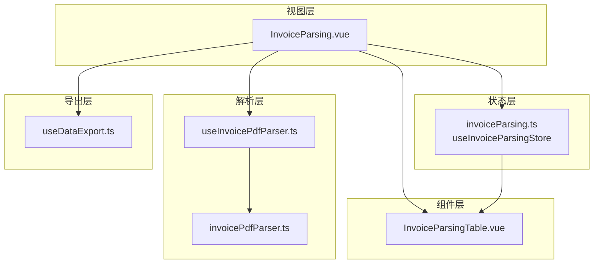
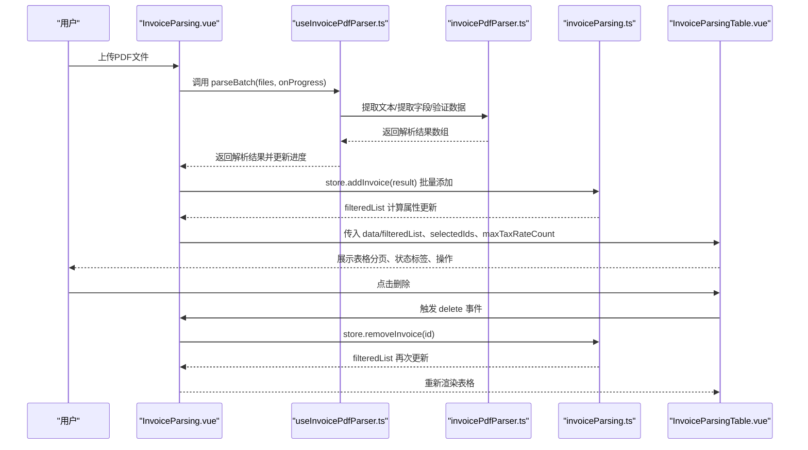
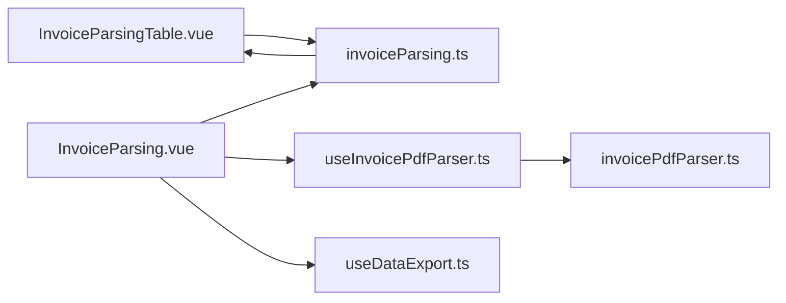

# 解析结果展示

<cite>
**本文引用的文件**
- [InvoiceParsingTable.vue](file://src/components/InvoiceParsingTable.vue)
- [invoiceParsing.ts](file://src/stores/invoiceParsing.ts)
- [InvoiceParsing.vue](file://src/views/InvoiceParsing.vue)
- [useInvoicePdfParser.ts](file://src/composables/useInvoicePdfParser.ts)
- [invoicePdfParser.ts](file://src/utils/invoicePdfParser.ts)
- [useDataExport.ts](file://src/composables/useDataExport.ts)
- [package.json](file://package.json)
</cite>

## 目录
1. [简介](#简介)
2. [项目结构](#项目结构)
3. [核心组件](#核心组件)
4. [架构总览](#架构总览)
5. [组件详细分析](#组件详细分析)
6. [依赖关系分析](#依赖关系分析)
7. [性能考量](#性能考量)
8. [故障排查指南](#故障排查指南)
9. [结论](#结论)
10. [附录](#附录)

## 简介
本文件围绕 InvoiceParsingTable 组件，系统阐述其如何高效展示大量发票解析结果。内容覆盖：
- 表格列布局设计（文件名、发票号、金额、税额、价税合计、动态税率列、状态、失败原因、操作）
- 状态标签渲染逻辑（成功/失败/待处理）
- 交互功能（点击删除单条记录、全选/取消选择、导出）
- 从 invoiceParsing store 订阅 filteredList 实现动态筛选与搜索（基于 filterStatus 和 searchKeyword）
- 性能优化建议（虚拟滚动/分页策略）
- 响应式设计适配与无障碍支持
- 代码示例路径（以源码路径代替具体代码片段）

## 项目结构
该模块位于前端工程的组件层与状态管理层之间，采用 Pinia 管理解析结果状态，并通过 Naive UI 的数据表格组件进行渲染。整体结构如下图所示：

图表来源
- [InvoiceParsing.vue](file://src/views/InvoiceParsing.vue#L1-L328)
- [InvoiceParsingTable.vue](file://src/components/InvoiceParsingTable.vue#L1-L157)
- [invoiceParsing.ts](file://src/stores/invoiceParsing.ts#L1-L241)
- [useInvoicePdfParser.ts](file://src/composables/useInvoicePdfParser.ts#L1-L173)
- [invoicePdfParser.ts](file://src/utils/invoicePdfParser.ts#L1-L349)
- [useDataExport.ts](file://src/composables/useDataExport.ts#L1-L308)

章节来源
- [InvoiceParsing.vue](file://src/views/InvoiceParsing.vue#L1-L328)
- [InvoiceParsingTable.vue](file://src/components/InvoiceParsingTable.vue#L1-L157)
- [invoiceParsing.ts](file://src/stores/invoiceParsing.ts#L1-L241)

## 核心组件
- InvoiceParsingTable.vue：负责渲染解析结果表格，包含列定义、状态标签渲染、分页与交互事件。
- invoiceParsing.ts：Pinia Store，维护解析结果列表、筛选状态、搜索关键词、选中项集合、动态税率列数等，并提供 filteredList 计算属性。
- InvoiceParsing.vue：页面容器，负责上传触发、进度展示、筛选与搜索控制、批量操作与导出。
- useInvoicePdfParser.ts：封装 PDF 解析流程，支持批量解析与进度回调。
- invoicePdfParser.ts：底层 PDF 文本提取与字段抽取工具。
- useDataExport.ts：统一导出接口，支持 Excel 与 JSON 格式。

章节来源
- [InvoiceParsingTable.vue](file://src/components/InvoiceParsingTable.vue#L1-L157)
- [invoiceParsing.ts](file://src/stores/invoiceParsing.ts#L1-L241)
- [InvoiceParsing.vue](file://src/views/InvoiceParsing.vue#L1-L328)
- [useInvoicePdfParser.ts](file://src/composables/useInvoicePdfParser.ts#L1-L173)
- [invoicePdfParser.ts](file://src/utils/invoicePdfParser.ts#L1-L349)
- [useDataExport.ts](file://src/composables/useDataExport.ts#L1-L308)

## 架构总览
下图展示了从用户上传到表格渲染与交互的关键流程：

图表来源
- [InvoiceParsing.vue](file://src/views/InvoiceParsing.vue#L188-L232)
- [useInvoicePdfParser.ts](file://src/composables/useInvoicePdfParser.ts#L96-L153)
- [invoicePdfParser.ts](file://src/utils/invoicePdfParser.ts#L97-L152)
- [invoiceParsing.ts](file://src/stores/invoiceParsing.ts#L122-L128)
- [InvoiceParsingTable.vue](file://src/components/InvoiceParsingTable.vue#L1-L157)

## 组件详细分析

### 表格列布局设计
- 固定列（基础列）：序号、文件名、发票号码、发票类型、金额、税额、价税合计。
- 动态列（税率列）：根据 store.maxTaxRateCount 动态生成“税率1”、“税率2”…，确保不同发票的多税率都能完整显示。
- 末尾列：状态（使用 Naive UI 的 NTag 标签渲染成功/失败/待处理）、失败原因（失败时高亮显示）、操作（删除按钮，固定在右侧）。

渲染细节要点：
- 文本为空时以占位符显示，避免空白列影响视觉。
- 状态列映射中文文案与颜色类型，便于快速识别。
- 操作列固定在右侧，保证在横向滚动时始终可见。

章节来源
- [InvoiceParsingTable.vue](file://src/components/InvoiceParsingTable.vue#L34-L134)
- [invoiceParsing.ts](file://src/stores/invoiceParsing.ts#L105-L114)

### 状态标签渲染逻辑
- 映射规则：success → 成功（绿色），failed → 失败（红色），pending → 待处理（橙色）。
- 失败原因列：仅在状态为 failed 且存在错误信息时显示，否则显示占位符。
- 渲染方式：通过 h 函数创建 NTag/NButton，实现轻量、可组合的 UI 渲染。

章节来源
- [InvoiceParsingTable.vue](file://src/components/InvoiceParsingTable.vue#L105-L126)

### 交互功能实现
- 删除单条记录：表格操作列触发 delete 事件，父组件接收后调用 store.removeInvoice 并提示成功。
- 全选/取消选择：父组件通过 store.selectAll/store.clearSelection 控制选中集合，再回传给表格组件。
- 导出：父组件根据模式（全部/成功/选中）选择数据，调用 useDataExport 导出 Excel 或 JSON。

章节来源
- [InvoiceParsingTable.vue](file://src/components/InvoiceParsingTable.vue#L127-L133)
- [InvoiceParsing.vue](file://src/views/InvoiceParsing.vue#L44-L75)
- [InvoiceParsing.vue](file://src/views/InvoiceParsing.vue#L237-L268)
- [InvoiceParsing.vue](file://src/views/InvoiceParsing.vue#L273-L302)
- [useDataExport.ts](file://src/composables/useDataExport.ts#L191-L201)

### 从 store 订阅 filteredList 实现动态筛选与搜索
- 父组件将 store.filteredList 作为表格数据源传入，表格组件无需关心筛选逻辑。
- 筛选与搜索由 store 内部 computed 实现：
  - filterStatus：支持“全部/成功/失败”，默认“全部”。
  - searchKeyword：对文件名、发票号、金额、价税合计进行模糊匹配（忽略大小写）。
- 选中项同步：表格通过 update:selectedIds 事件将选中 id 数组回传给父组件，父组件写入 store.selectedIds，从而驱动 UI 与导出按钮可用状态。

章节来源
- [InvoiceParsing.vue](file://src/views/InvoiceParsing.vue#L77-L85)
- [invoiceParsing.ts](file://src/stores/invoiceParsing.ts#L71-L91)
- [invoiceParsing.ts](file://src/stores/invoiceParsing.ts#L117-L119)

### 代码示例路径（数据绑定、事件处理与状态同步）
- 表格数据绑定与分页配置
  - [表格数据与分页](file://src/components/InvoiceParsingTable.vue#L2-L11)
  - [分页参数与回调](file://src/components/InvoiceParsingTable.vue#L139-L151)
- 状态列与操作列渲染
  - [状态列渲染](file://src/components/InvoiceParsingTable.vue#L100-L134)
- 事件处理与状态同步
  - [删除事件触发](file://src/components/InvoiceParsingTable.vue#L127-L133)
  - [选中项回传](file://src/components/InvoiceParsingTable.vue#L153-L155)
  - [父组件接收并写回 store](file://src/views/InvoiceParsing.vue#L181-L183)
- 动态列生成
  - [动态税率列生成](file://src/components/InvoiceParsingTable.vue#L82-L98)
  - [最大税率数计算](file://src/stores/invoiceParsing.ts#L105-L114)

章节来源
- [InvoiceParsingTable.vue](file://src/components/InvoiceParsingTable.vue#L1-L157)
- [InvoiceParsing.vue](file://src/views/InvoiceParsing.vue#L178-L183)
- [invoiceParsing.ts](file://src/stores/invoiceParsing.ts#L105-L114)

## 依赖关系分析
- 组件依赖
  - InvoiceParsingTable 依赖 Naive UI 的 NDataTable、NTag、NButton，以及 store 的 filteredList、selectedIds、maxTaxRateCount。
  - InvoiceParsing 页面依赖 store 的 filterStatus、searchKeyword、selectedIds、successCount、failedCount、totalCount 等。
- 工具与解析
  - useInvoicePdfParser 依赖 invoicePdfParser 工具链，负责 PDF 文本提取、字段抽取与数据校验。
- 导出能力
  - useDataExport 依赖 xlsx 与 file-saver，提供 Excel/JSON 导出能力。

图表来源
- [InvoiceParsingTable.vue](file://src/components/InvoiceParsingTable.vue#L1-L157)
- [invoiceParsing.ts](file://src/stores/invoiceParsing.ts#L1-L241)
- [InvoiceParsing.vue](file://src/views/InvoiceParsing.vue#L1-L328)
- [useInvoicePdfParser.ts](file://src/composables/useInvoicePdfParser.ts#L1-L173)
- [invoicePdfParser.ts](file://src/utils/invoicePdfParser.ts#L1-L349)
- [useDataExport.ts](file://src/composables/useDataExport.ts#L1-L308)

章节来源
- [package.json](file://package.json#L12-L22)

## 性能考量
当前实现已具备以下性能特性：
- 分页策略：表格内置分页（每页 20/50/100 条），减少一次性渲染的数据量，提升首屏与滚动性能。
- 动态列优化：仅根据实际存在的最高税率数量生成列，避免冗余列导致的渲染开销。
- 批量解析并发：解析器采用分批并发（批次间串行、批次内并发），降低内存峰值与卡顿风险。
- 进度反馈：解析过程中实时更新进度与当前文件，改善用户体验。

针对超大数据集的进一步优化建议（概念性指导，非现有实现）：
- 虚拟滚动：当数据量超过数千条时，可考虑引入虚拟滚动以显著降低 DOM 节点数量。
- 服务端分页/懒加载：若数据来自后端，可结合服务端分页与懒加载，避免一次性传输过多数据。
- 列宽自适应与固定列：保持固定列数量与宽度，动态列按需展开，减少重排与重绘。
- 缓存与去抖：对搜索关键词输入进行去抖处理，避免频繁触发筛选。

章节来源
- [InvoiceParsingTable.vue](file://src/components/InvoiceParsingTable.vue#L139-L151)
- [useInvoicePdfParser.ts](file://src/composables/useInvoicePdfParser.ts#L13-L14)
- [useInvoicePdfParser.ts](file://src/composables/useInvoicePdfParser.ts#L116-L137)

## 故障排查指南
- 表格无数据显示
  - 检查 store.totalCount 是否为 0，确认是否已上传文件并解析成功。
  - 章节来源: [InvoiceParsing.vue](file://src/views/InvoiceParsing.vue#L15-L96)
- 筛选无效
  - 确认父组件是否正确绑定 store.filterStatus 与 store.searchKeyword，并调用 setFilterStatus 与 setSearchKeyword。
  - 章节来源: [InvoiceParsing.vue](file://src/views/InvoiceParsing.vue#L19-L36)
- 删除无效
  - 确认表格是否触发 delete 事件，父组件是否调用 store.removeInvoice 并提示成功。
  - 章节来源: [InvoiceParsingTable.vue](file://src/components/InvoiceParsingTable.vue#L127-L133), [InvoiceParsing.vue](file://src/views/InvoiceParsing.vue#L237-L248)
- 导出失败
  - 检查导出数据是否为空，确认格式与模式选择是否正确；查看控制台错误信息。
  - 章节来源: [useDataExport.ts](file://src/composables/useDataExport.ts#L118-L127), [useDataExport.ts](file://src/composables/useDataExport.ts#L177-L186)
- 解析异常
  - 检查文件格式与大小限制，确认 PDF 文本提取与字段抽取是否正常；查看解析器日志。
  - 章节来源: [useInvoicePdfParser.ts](file://src/composables/useInvoicePdfParser.ts#L42-L49), [invoicePdfParser.ts](file://src/utils/invoicePdfParser.ts#L97-L129)

## 结论
InvoiceParsingTable 组件通过清晰的列布局、动态列生成与状态标签渲染，实现了对大量发票解析结果的高效展示。配合 Pinia 的 filteredList 计算属性与父组件的筛选/搜索控制，用户可以快速定位目标记录。结合分页与解析器的并发策略，系统在性能与体验上达到良好平衡。对于更大规模数据，建议引入虚拟滚动与服务端分页等进一步优化手段。

## 附录
- 关键实现路径索引
  - [表格列定义与渲染](file://src/components/InvoiceParsingTable.vue#L34-L134)
  - [分页与交互事件](file://src/components/InvoiceParsingTable.vue#L139-L155)
  - [筛选与搜索逻辑](file://src/stores/invoiceParsing.ts#L71-L91)
  - [动态列数量计算](file://src/stores/invoiceParsing.ts#L105-L114)
  - [批量解析流程](file://src/composables/useInvoicePdfParser.ts#L96-L153)
  - [PDF字段抽取与校验](file://src/utils/invoicePdfParser.ts#L138-L152)
  - [导出接口](file://src/composables/useDataExport.ts#L191-L201)