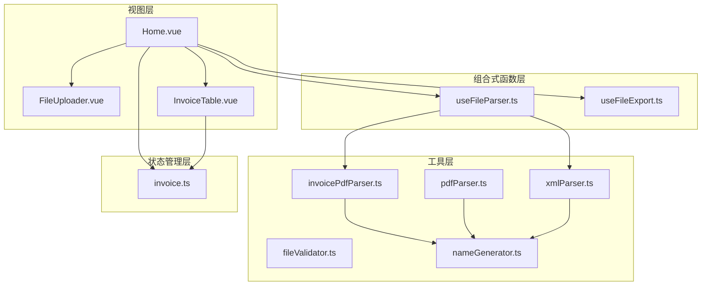
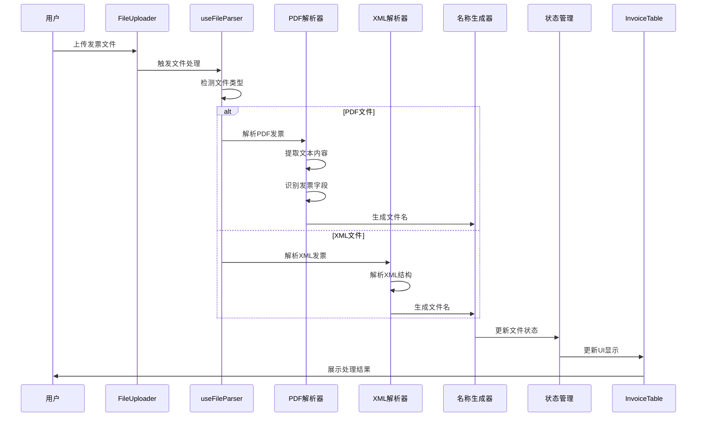
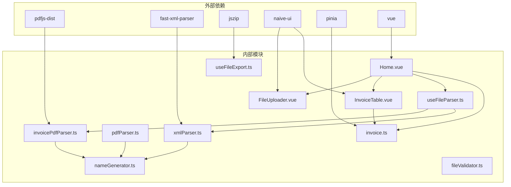

# 发票重命名功能

<cite>
**本文档引用的文件**
- [useFileParser.ts](file://src/composables/useFileParser.ts)
- [invoicePdfParser.ts](file://src/utils/invoicePdfParser.ts)
- [pdfParser.ts](file://src/utils/pdfParser.ts)
- [xmlParser.ts](file://src/utils/xmlParser.ts)
- [nameGenerator.ts](file://src/utils/nameGenerator.ts)
- [invoice.ts](file://src/stores/invoice.ts)
- [FileUploader.vue](file://src/components/FileUploader.vue)
- [InvoiceTable.vue](file://src/components/InvoiceTable.vue)
- [Home.vue](file://src/views/Home.vue)
- [fileValidator.ts](file://src/utils/fileValidator.ts)
- [useFileExport.ts](file://src/composables/useFileExport.ts)
- [README.md](file://README.md)
- [package.json](file://package.json)
</cite>

## 目录
1. [简介](#简介)
2. [项目结构](#项目结构)
3. [核心组件](#核心组件)
4. [架构概览](#架构概览)
5. [详细组件分析](#详细组件分析)
6. [依赖关系分析](#依赖关系分析)
7. [性能考虑](#性能考虑)
8. [故障排除指南](#故障排除指南)
9. [结论](#结论)
10. [扩展接口建议](#扩展接口建议)

## 简介

发票重命名功能是一个基于Vue 3构建的财务工具，专门用于批量处理发票文件并自动重命名。该系统支持PDF和XML格式的发票文件，能够智能提取发票信息（如购买方名称、金额、发票类型等），并通过预定义的命名规则生成规范化的文件名。

该功能的核心价值在于：
- **自动化处理**：无需手动输入发票信息，系统自动解析并生成文件名
- **批量处理**：支持一次处理多个发票文件，提高工作效率
- **标准化命名**：统一的命名规范便于文件管理和检索
- **错误处理**：完善的错误检测和处理机制确保数据质量

## 项目结构

该项目采用模块化架构设计，主要分为以下几个层次：

**图表来源**
- [Home.vue](file://src/views/Home.vue#L1-L247)
- [useFileParser.ts](file://src/composables/useFileParser.ts#L1-L109)
- [invoice.ts](file://src/stores/invoice.ts#L1-L256)

**章节来源**
- [README.md](file://README.md#L1-L41)
- [package.json](file://package.json#L1-L33)

## 核心组件

### 文件解析组合式函数

`useFileParser`是整个发票重命名功能的核心，负责协调不同类型的文件解析工作。

**主要功能**：
- 支持PDF和XML格式文件的解析
- 提供单文件和批量文件解析能力
- 实现进度跟踪和状态管理
- 统一的错误处理机制

**关键特性**：
- **异步处理**：使用Promise和async/await确保非阻塞操作
- **批量处理**：支持10个文件为一批的并发处理
- **进度监控**：实时显示处理进度百分比
- **格式检测**：自动识别文件类型并选择相应的解析器

**章节来源**
- [useFileParser.ts](file://src/composables/useFileParser.ts#L1-L109)

### 发票PDF解析工具

专门针对PDF发票文件的解析工具，提供了强大的文本提取和字段识别能力。

**解析策略**：
- **快速解析**：默认只解析前3页以提高性能
- **智能回退**：如果关键字段未找到，自动解析剩余页面
- **多模式匹配**：使用多种正则表达式模式提高识别准确率
- **数据验证**：严格的字段验证确保数据质量

**支持的字段提取**：
- 发票号码（20位数字）
- 发票类型（专票/普票）
- 金额（不含税金额）
- 税额
- 价税合计
- 税率信息

**章节来源**
- [invoicePdfParser.ts](file://src/utils/invoicePdfParser.ts#L1-L349)

### XML解析工具

为XML格式的发票文件提供解析支持，具有灵活的字段映射机制。

**解析特点**：
- **灵活字段映射**：支持多种可能的字段名称
- **健壮性**：即使XML结构略有差异也能正确解析
- **错误处理**：完善的异常捕获和错误报告

**章节来源**
- [xmlParser.ts](file://src/utils/xmlParser.ts#L1-L141)

### 文件名生成器

实现了智能的文件命名系统，支持多种命名规则和格式化选项。

**命名规则**：
- **当前规则**：`{purchaserName}_{totalAmount}`（购方名称_金额）
- **预留规则**：支持发票类型、开票日期、发票号码等多种组合
- **格式化**：自动处理特殊字符、长度限制等格式问题

**冲突处理**：
- 自动检测重复文件名
- 添加序号后缀避免冲突
- 支持批量文件名生成

**章节来源**
- [nameGenerator.ts](file://src/utils/nameGenerator.ts#L1-L250)

### 状态管理

使用Pinia实现全局状态管理，负责维护文件处理的完整生命周期。

**状态结构**：
- `fileList`: 存储所有处理的发票文件信息
- `filterStatus`: 当前筛选状态（全部/成功/失败）
- `searchKeyword`: 搜索关键词
- `selectedIds`: 选中的文件ID列表
- `isProcessing`: 是否正在处理中

**计算属性**：
- `filteredList`: 基于筛选条件和搜索关键词的过滤结果
- `successCount`: 成功处理的文件数量
- `failedCount`: 失败处理的文件数量
- `totalCount`: 总文件数量

**章节来源**
- [invoice.ts](file://src/stores/invoice.ts#L1-L256)

## 架构概览

发票重命名功能采用分层架构设计，确保各组件职责清晰、耦合度低。

**图表来源**
- [Home.vue](file://src/views/Home.vue#L97-L155)
- [useFileParser.ts](file://src/composables/useFileParser.ts#L22-L66)
- [invoice.ts](file://src/stores/invoice.ts#L106-L151)

## 详细组件分析

### 文件上传组件

FileUploader组件提供了直观的文件上传界面，支持拖拽上传和点击上传两种方式。

**功能特性**：
- **多文件支持**：支持同时上传多个文件
- **目录拖拽**：支持拖拽整个文件夹
- **格式限制**：仅允许PDF和XML格式
- **大小限制**：单个文件不超过10MB
- **数量限制**：最多100个文件

**用户交互**：
- 拖拽区域高亮显示
- 实时显示支持的文件格式
- 提供上传进度反馈

**章节来源**
- [FileUploader.vue](file://src/components/FileUploader.vue#L1-L50)

### 发票表格组件

InvoiceTable组件负责展示处理结果，提供完整的数据可视化和编辑功能。

**表格列设计**：
- **序号**：显示记录在表格中的位置
- **原文件名**：原始发票文件名
- **发票类型**：发票种类（专票/普票）
- **购买方名称**：可编辑的购买方名称
- **金额**：可编辑的金额信息
- **新文件名**：系统生成的规范化文件名
- **状态**：处理状态（成功/失败/待处理）
- **失败原因**：错误信息显示
- **操作**：删除功能

**交互功能**：
- **批量选择**：支持多选操作
- **实时编辑**：可直接在表格中修改发票信息
- **状态标签**：彩色标识不同的处理状态
- **分页显示**：支持大数据量的分页浏览

**章节来源**
- [InvoiceTable.vue](file://src/components/InvoiceTable.vue#L1-L182)

### 主页面控制器

Home.vue作为应用的主控制器，协调各个组件的工作流程。

**核心流程**：
1. **文件验证**：检查文件格式和大小
2. **队列管理**：管理上传文件的处理队列
3. **进度跟踪**：显示处理进度和状态
4. **结果展示**：将处理结果展示给用户
5. **错误处理**：捕获和处理各种异常情况

**状态管理**：
- **处理状态**：控制是否处于文件处理阶段
- **进度显示**：实时更新处理进度
- **消息通知**：向用户反馈处理结果
- **对话框管理**：处理确认删除等交互

**章节来源**
- [Home.vue](file://src/views/Home.vue#L1-L247)

### 错误处理机制

系统实现了多层次的错误处理机制，确保在各种异常情况下都能提供友好的用户体验。

**错误分类**：
- **文件格式错误**：不支持的文件类型
- **文件大小错误**：超过10MB限制
- **解析失败**：PDF或XML解析过程中出现的问题
- **数据验证失败**：提取的数据不符合规范
- **命名冲突**：生成的文件名与其他文件冲突

**处理策略**：
- **即时反馈**：用户操作后立即给出反馈
- **详细错误信息**：提供具体的错误原因
- **优雅降级**：在部分功能失败时不影响整体使用
- **日志记录**：开发模式下记录详细的调试信息

**章节来源**
- [fileValidator.ts](file://src/utils/fileValidator.ts#L57-L72)
- [useFileParser.ts](file://src/composables/useFileParser.ts#L58-L66)

## 依赖关系分析

**图表来源**
- [package.json](file://package.json#L12-L22)
- [Home.vue](file://src/views/Home.vue#L79-L85)

**章节来源**
- [package.json](file://package.json#L1-L33)

## 性能考虑

### 大文件处理优化

系统针对大文件处理进行了专门的优化：

**PDF文件优化**：
- **分页解析**：默认只解析前3页以提高响应速度
- **智能回退**：如果关键字段未在前3页找到，再解析剩余页面
- **内存管理**：及时释放解析过程中使用的内存

**批量处理策略**：
- **分批处理**：每批处理10个文件，避免内存峰值
- **并发控制**：合理控制并发数量，平衡性能和资源消耗
- **进度反馈**：实时显示处理进度，提升用户体验

**缓存机制**：
- **解析结果缓存**：避免重复解析相同文件
- **格式化缓存**：缓存常用的格式化操作结果

### 内存使用优化

**文件读取优化**：
- 使用ArrayBuffer直接读取文件内容
- 避免创建不必要的中间变量
- 及时释放大对象的内存

**字符串处理优化**：
- 使用正则表达式进行高效匹配
- 避免创建大量临时字符串
- 合理使用字符串拼接

## 故障排除指南

### 常见问题及解决方案

**问题1：文件格式不被识别**
- **症状**：上传后显示"不支持的文件格式"
- **原因**：文件不是PDF或XML格式
- **解决**：确认文件格式是否为PDF或XML

**问题2：文件过大无法上传**
- **症状**：显示"文件大小超过限制"
- **原因**：文件超过10MB限制
- **解决**：压缩文件或分割发票

**问题3：PDF解析失败**
- **症状**：PDF文件解析后状态为失败
- **原因**：PDF格式不标准或包含加密
- **解决**：检查PDF文件完整性，尝试重新生成

**问题4：XML解析错误**
- **症状**：XML文件解析失败
- **原因**：XML格式不规范或编码问题
- **解决**：检查XML文件格式，确保编码正确

**问题5：文件名生成失败**
- **症状**：新文件名为空或生成失败
- **原因**：发票信息缺失或格式不正确
- **解决**：在表格中手动填写正确的发票信息

### 调试技巧

**开发模式调试**：
- 在开发环境中可以查看详细的日志信息
- 使用浏览器开发者工具监控网络请求
- 检查控制台是否有JavaScript错误

**性能监控**：
- 监控文件处理时间
- 检查内存使用情况
- 观察UI响应性能

**章节来源**
- [fileValidator.ts](file://src/utils/fileValidator.ts#L57-L72)
- [invoicePdfParser.ts](file://src/utils/invoicePdfParser.ts#L125-L129)

## 结论

发票重命名功能通过精心设计的架构和完善的错误处理机制，为用户提供了一个强大而易用的发票文件处理工具。系统的主要优势包括：

**技术优势**：
- **模块化设计**：清晰的职责分离和低耦合
- **异步处理**：非阻塞的用户体验
- **错误处理**：全面的异常捕获和恢复机制
- **性能优化**：针对大文件和批量处理的专门优化

**用户体验**：
- **直观界面**：简洁明了的操作界面
- **实时反馈**：处理进度和状态的实时显示
- **灵活编辑**：支持手动修改发票信息
- **批量操作**：高效的批量文件处理能力

**扩展性**：
- **命名规则可配置**：支持自定义命名模板
- **解析器可扩展**：易于添加新的文件格式支持
- **状态管理可扩展**：支持更多业务场景的状态管理

该系统为财务工作者提供了一个可靠的发票文件管理解决方案，显著提高了工作效率和文件管理的标准化程度。

## 扩展接口建议

### 自定义命名模板

系统已经提供了灵活的命名规则机制，开发者可以通过以下方式扩展：

**新增命名规则**：
1. 在`NAMING_RULES`对象中添加新的规则定义
2. 实现相应的字段格式化器
3. 在UI中提供规则切换功能

**推荐的命名规则**：
- `{invoiceType}_{purchaserName}_{issueDate}_{totalAmount}`
- `{invoiceCode}_{purchaserName}_{totalAmount}`
- `{purchaserName}_{issueDate}_{invoiceType}`

**章节来源**
- [nameGenerator.ts](file://src/utils/nameGenerator.ts#L34-L60)
- [nameGenerator.ts](file://src/utils/nameGenerator.ts#L228-L235)

### 多格式支持扩展

目前系统支持PDF和XML格式，可以考虑扩展支持：

**新增格式支持**：
- **图片格式**：支持JPG、PNG等扫描版发票
- **Office格式**：支持DOCX、XLSX等办公软件格式
- **电子发票**：支持国家税务总局标准格式

**实现建议**：
- 创建统一的解析器接口
- 实现格式特定的解析器类
- 添加格式检测和路由逻辑

### 高级功能扩展

**批量重命名功能**：
- 支持批量修改文件名
- 提供预览和确认功能
- 支持撤销操作

**智能识别增强**：
- 使用机器学习算法提高识别准确率
- 支持多语言发票识别
- 实现发票信息的自动补全

**章节来源**
- [nameGenerator.ts](file://src/utils/nameGenerator.ts#L196-L225)