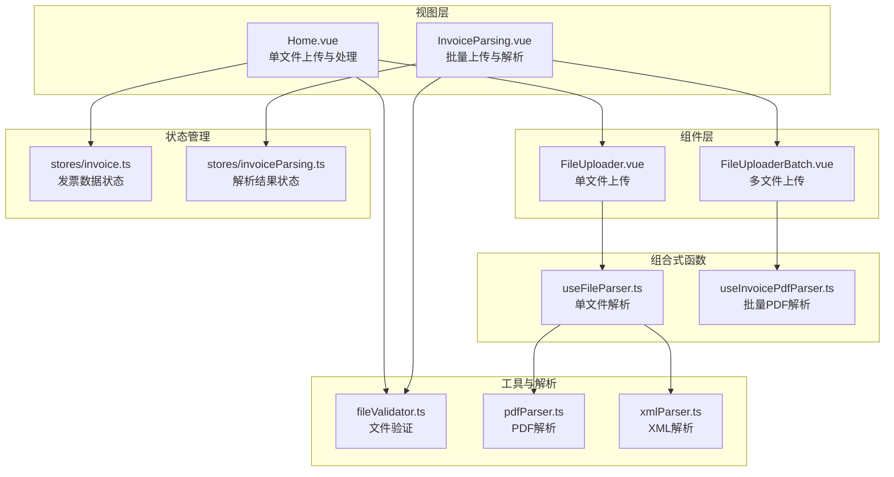
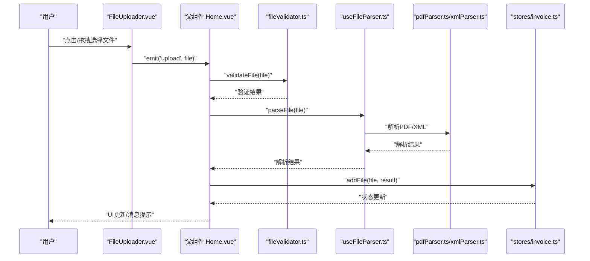
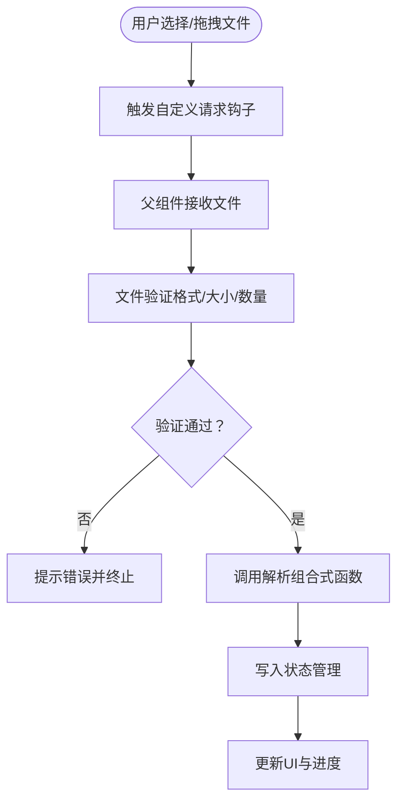
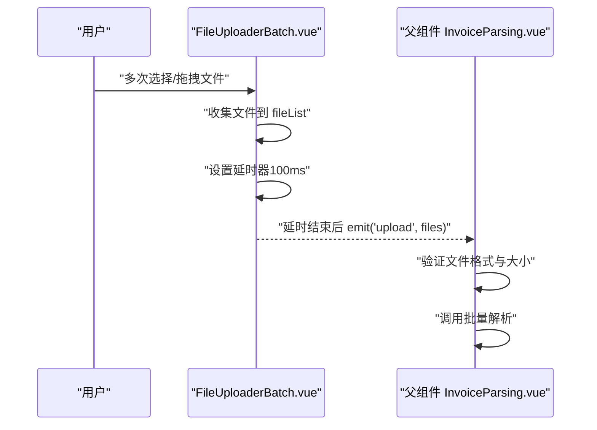
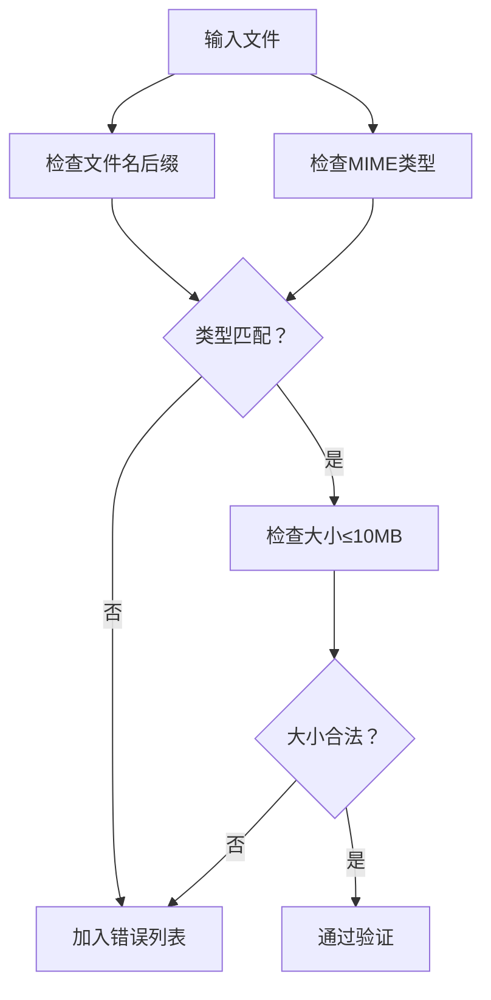
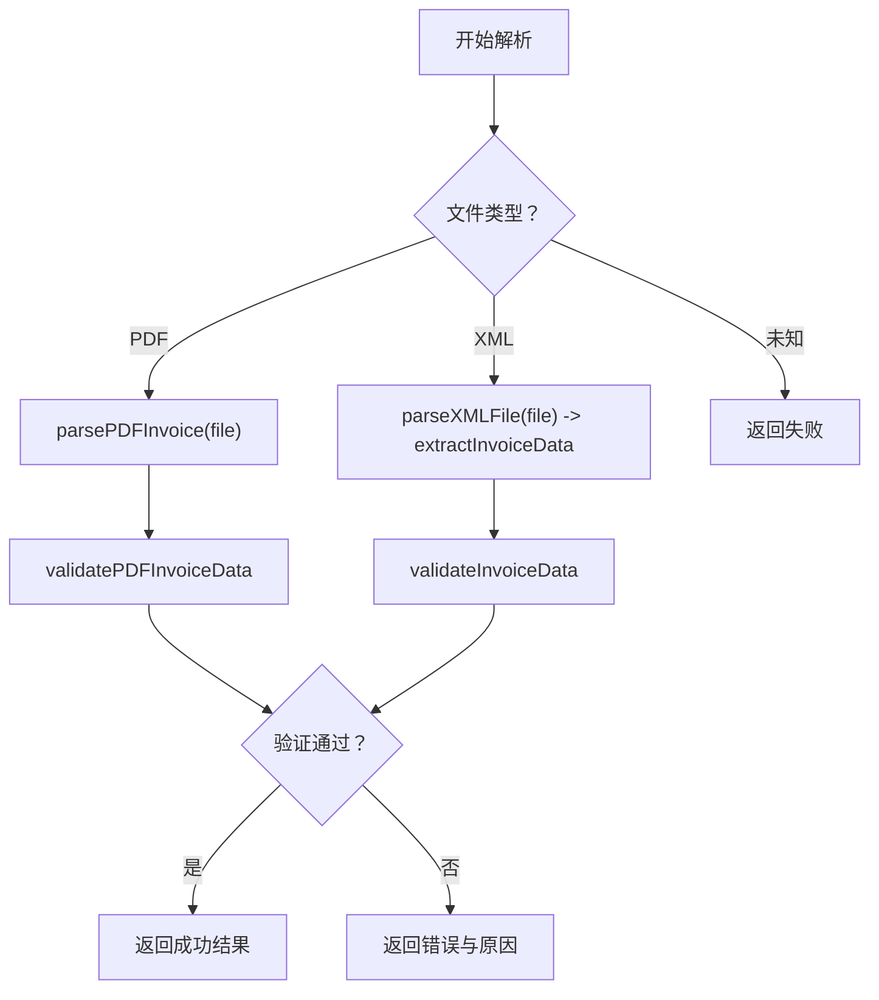
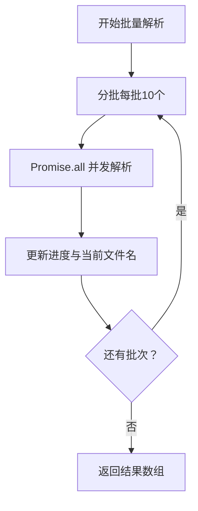
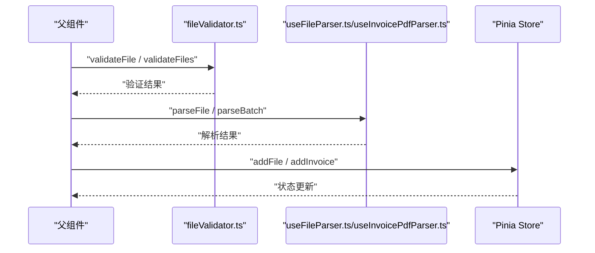
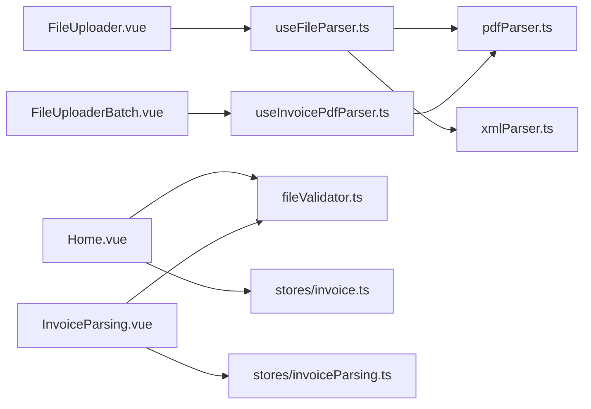

# 文件上传

<cite>
**本文引用的文件**
- [src/components/FileUploader.vue](file://src/components/FileUploader.vue)
- [src/components/FileUploaderBatch.vue](file://src/components/FileUploaderBatch.vue)
- [src/utils/fileValidator.ts](file://src/utils/fileValidator.ts)
- [src/composables/useFileParser.ts](file://src/composables/useFileParser.ts)
- [src/composables/useInvoicePdfParser.ts](file://src/composables/useInvoicePdfParser.ts)
- [src/utils/pdfParser.ts](file://src/utils/pdfParser.ts)
- [src/utils/xmlParser.ts](file://src/utils/xmlParser.ts)
- [src/views/Home.vue](file://src/views/Home.vue)
- [src/views/InvoiceParsing.vue](file://src/views/InvoiceParsing.vue)
- [src/stores/invoice.ts](file://src/stores/invoice.ts)
- [src/stores/invoiceParsing.ts](file://src/stores/invoiceParsing.ts)
- [README.md](file://README.md)
- [package.json](file://package.json)
</cite>

## 目录
1. [简介](#简介)
2. [项目结构](#项目结构)
3. [核心组件](#核心组件)
4. [架构总览](#架构总览)
5. [详细组件分析](#详细组件分析)
6. [依赖关系分析](#依赖关系分析)
7. [性能考虑](#性能考虑)
8. [故障排查指南](#故障排查指南)
9. [结论](#结论)
10. [附录](#附录)

## 简介
本文件围绕“文件上传”功能展开，重点覆盖以下方面：
- FileUploader 组件的实现机制与用户交互流程
- HTML5 File API 的使用与本地 PDF/XML 发票文件读取
- 单文件与多文件上传模式支持
- 拖拽上传与点击选择文件两种交互方式
- 文件类型验证（.pdf 与 .xml）的实现逻辑
- 如何将上传的文件列表传递给父组件
- 上传过程中的状态变化（加载、错误提示）
- 大文件上传的性能优化策略（分批处理、内存管理）
- 扩展接口建议（上传前的文件大小限制、自定义验证规则）

## 项目结构
该项目采用 Vue 3 + Vite + Naive UI + Pinia 的前端技术栈，围绕发票处理构建了两类上传场景：
- 单文件上传与处理（Home 页面）
- 多文件批量上传与解析（InvoiceParsing 页面）

图表来源
- [src/views/Home.vue](file://src/views/Home.vue#L1-L247)
- [src/views/InvoiceParsing.vue](file://src/views/InvoiceParsing.vue#L1-L328)
- [src/components/FileUploader.vue](file://src/components/FileUploader.vue#L1-L50)
- [src/components/FileUploaderBatch.vue](file://src/components/FileUploaderBatch.vue#L1-L79)
- [src/composables/useFileParser.ts](file://src/composables/useFileParser.ts#L1-L109)
- [src/composables/useInvoicePdfParser.ts](file://src/composables/useInvoicePdfParser.ts#L1-L173)
- [src/utils/fileValidator.ts](file://src/utils/fileValidator.ts#L1-L107)
- [src/utils/pdfParser.ts](file://src/utils/pdfParser.ts#L1-L243)
- [src/utils/xmlParser.ts](file://src/utils/xmlParser.ts#L1-L141)
- [src/stores/invoice.ts](file://src/stores/invoice.ts#L1-L256)
- [src/stores/invoiceParsing.ts](file://src/stores/invoiceParsing.ts#L1-L241)

章节来源
- [README.md](file://README.md#L1-L41)
- [package.json](file://package.json#L1-L33)

## 核心组件
- FileUploader.vue：单文件上传组件，支持拖拽与点击选择，内置文件类型与大小限制，通过自定义请求钩子将文件传递给父组件。
- FileUploaderBatch.vue：多文件上传组件，支持目录拖拽，延迟收集文件后一次性触发上传事件，适合批量处理。
- useFileParser.ts：单文件解析组合式函数，支持 PDF/XML 的解析与校验，提供进度反馈与批量分批处理能力。
- useInvoicePdfParser.ts：批量 PDF 解析组合式函数，按批次并发处理，提供进度回调与当前文件名反馈。
- fileValidator.ts：统一的文件验证工具，包含格式、大小、数量限制与批量验证结果。
- pdfParser.ts / xmlParser.ts：底层解析工具，分别负责 PDF 文本抽取与 XML 解析。
- Home.vue / InvoiceParsing.vue：父组件，负责接收上传事件、执行验证、调用解析、更新状态与展示进度。

章节来源
- [src/components/FileUploader.vue](file://src/components/FileUploader.vue#L1-L50)
- [src/components/FileUploaderBatch.vue](file://src/components/FileUploaderBatch.vue#L1-L79)
- [src/composables/useFileParser.ts](file://src/composables/useFileParser.ts#L1-L109)
- [src/composables/useInvoicePdfParser.ts](file://src/composables/useInvoicePdfParser.ts#L1-L173)
- [src/utils/fileValidator.ts](file://src/utils/fileValidator.ts#L1-L107)
- [src/utils/pdfParser.ts](file://src/utils/pdfParser.ts#L1-L243)
- [src/utils/xmlParser.ts](file://src/utils/xmlParser.ts#L1-L141)
- [src/views/Home.vue](file://src/views/Home.vue#L1-L247)
- [src/views/InvoiceParsing.vue](file://src/views/InvoiceParsing.vue#L1-L328)

## 架构总览
文件上传与解析的整体流程如下：
- 用户通过 FileUploader 或 FileUploaderBatch 选择或拖拽文件
- 组件通过 Naive UI 的上传控件触发自定义请求钩子
- 父组件接收文件，进行格式与大小验证
- 调用解析组合式函数进行解析与校验
- 将结果写入 Pinia 状态，更新 UI 与进度

图表来源
- [src/components/FileUploader.vue](file://src/components/FileUploader.vue#L31-L42)
- [src/views/Home.vue](file://src/views/Home.vue#L100-L155)
- [src/utils/fileValidator.ts](file://src/utils/fileValidator.ts#L57-L72)
- [src/composables/useFileParser.ts](file://src/composables/useFileParser.ts#L22-L66)
- [src/utils/pdfParser.ts](file://src/utils/pdfParser.ts#L184-L192)
- [src/utils/xmlParser.ts](file://src/utils/xmlParser.ts#L42-L62)
- [src/stores/invoice.ts](file://src/stores/invoice.ts#L106-L151)

## 详细组件分析

### FileUploader 组件（单文件上传）
- 功能要点
  - 使用 Naive UI 的上传控件，开启多文件与目录拖拽
  - 通过 accept 属性限制为 .pdf 与 .xml
  - 通过自定义请求钩子 handleUpload 触发父组件的 upload 事件
  - 通过 show-file-list=false 控制不显示文件列表，避免重复渲染
- 交互方式
  - 点击选择文件：Naive UI 内置
  - 拖拽上传：directory-dnd 启用目录拖拽
- 父组件接收
  - 父组件监听 @upload，拿到单个 File 对象后进行验证与处理

图表来源
- [src/components/FileUploader.vue](file://src/components/FileUploader.vue#L31-L42)
- [src/views/Home.vue](file://src/views/Home.vue#L100-L155)
- [src/utils/fileValidator.ts](file://src/utils/fileValidator.ts#L57-L72)
- [src/composables/useFileParser.ts](file://src/composables/useFileParser.ts#L22-L66)
- [src/stores/invoice.ts](file://src/stores/invoice.ts#L106-L151)

章节来源
- [src/components/FileUploader.vue](file://src/components/FileUploader.vue#L1-L50)
- [src/views/Home.vue](file://src/views/Home.vue#L100-L155)

### FileUploaderBatch 组件（多文件上传）
- 功能要点
  - 支持多文件与目录拖拽
  - 通过延迟收集（setTimeout）将一批文件合并后一次性触发上传事件
  - 接受 props：accept、disabled、description
- 交互方式
  - 点击/拖拽选择文件，内部维护 fileList，延时触发 emit('upload', files)
- 适用场景
  - 批量上传 PDF 发票，适合 InvoiceParsing 页面

图表来源
- [src/components/FileUploaderBatch.vue](file://src/components/FileUploaderBatch.vue#L49-L71)
- [src/views/InvoiceParsing.vue](file://src/views/InvoiceParsing.vue#L188-L232)

章节来源
- [src/components/FileUploaderBatch.vue](file://src/components/FileUploaderBatch.vue#L1-L79)
- [src/views/InvoiceParsing.vue](file://src/views/InvoiceParsing.vue#L1-L328)

### 文件验证（fileValidator.ts）
- 支持格式
  - application/pdf、text/xml、application/xml
  - 同时支持通过文件名后缀判断 .pdf 与 .xml
- 限制
  - 单文件大小 ≤ 10MB
  - 单次上传文件数量 ≤ 100
- 接口
  - validateFile(file)：返回 { valid, errors }
  - validateFiles(files)：返回 { valid, results, validFiles, invalidCount }

图表来源
- [src/utils/fileValidator.ts](file://src/utils/fileValidator.ts#L38-L72)
- [src/utils/fileValidator.ts](file://src/utils/fileValidator.ts#L77-L106)

章节来源
- [src/utils/fileValidator.ts](file://src/utils/fileValidator.ts#L1-L107)

### 单文件解析（useFileParser.ts）
- 能力
  - 自动识别 PDF/XML 文件类型
  - PDF：调用 pdfParser.ts；XML：调用 xmlParser.ts
  - 统一返回 { success, data, errors, type }
  - 提供 parseFiles 批量解析，按批次并发处理（默认每批 10 个）
- 进度反馈
  - isProcessing、progress 状态
  - 可传入 onProgress 回调，实时更新进度百分比

图表来源
- [src/composables/useFileParser.ts](file://src/composables/useFileParser.ts#L22-L66)
- [src/utils/pdfParser.ts](file://src/utils/pdfParser.ts#L184-L192)
- [src/utils/xmlParser.ts](file://src/utils/xmlParser.ts#L67-L85)

章节来源
- [src/composables/useFileParser.ts](file://src/composables/useFileParser.ts#L1-L109)
- [src/utils/pdfParser.ts](file://src/utils/pdfParser.ts#L1-L243)
- [src/utils/xmlParser.ts](file://src/utils/xmlParser.ts#L1-L141)

### 批量解析（useInvoicePdfParser.ts）
- 场景
  - 针对 PDF 发票的批量解析，适合 InvoiceParsing 页面
- 机制
  - 按批次（默认 10 个）并发解析，批次间串行
  - 提供进度回调，包含当前文件名与整体进度
- 输出
  - 返回 InvoiceParseResult 数组，包含状态、错误信息、解析时间等

图表来源
- [src/composables/useInvoicePdfParser.ts](file://src/composables/useInvoicePdfParser.ts#L96-L153)

章节来源
- [src/composables/useInvoicePdfParser.ts](file://src/composables/useInvoicePdfParser.ts#L1-L173)

### 父组件集成（Home.vue 与 InvoiceParsing.vue）
- Home.vue（单文件）
  - 监听 FileUploader 的 upload 事件
  - 调用 fileValidator.validateFile 进行验证
  - 使用 useFileParser.parseFile 解析，将结果写入 stores/invoice.ts
  - 展示进度模态框与消息提示
- InvoiceParsing.vue（批量）
  - 监听 FileUploaderBatch 的 upload 事件
  - 自行验证文件格式与大小
  - 使用 useInvoicePdfParser.parseBatch 解析，将结果写入 stores/invoiceParsing.ts
  - 展示进度与当前文件名

图表来源
- [src/views/Home.vue](file://src/views/Home.vue#L100-L155)
- [src/views/InvoiceParsing.vue](file://src/views/InvoiceParsing.vue#L188-L232)
- [src/utils/fileValidator.ts](file://src/utils/fileValidator.ts#L57-L106)
- [src/composables/useFileParser.ts](file://src/composables/useFileParser.ts#L71-L100)
- [src/composables/useInvoicePdfParser.ts](file://src/composables/useInvoicePdfParser.ts#L96-L153)
- [src/stores/invoice.ts](file://src/stores/invoice.ts#L106-L151)
- [src/stores/invoiceParsing.ts](file://src/stores/invoiceParsing.ts#L122-L128)

章节来源
- [src/views/Home.vue](file://src/views/Home.vue#L1-L247)
- [src/views/InvoiceParsing.vue](file://src/views/InvoiceParsing.vue#L1-L328)
- [src/stores/invoice.ts](file://src/stores/invoice.ts#L1-L256)
- [src/stores/invoiceParsing.ts](file://src/stores/invoiceParsing.ts#L1-L241)

## 依赖关系分析
- 组件依赖
  - FileUploader.vue 依赖 Naive UI 的上传组件与图标
  - FileUploaderBatch.vue 与 FileUploader.vue 类似，但支持目录拖拽与延迟收集
- 解析依赖
  - useFileParser.ts 依赖 pdfParser.ts 与 xmlParser.ts
  - useInvoicePdfParser.ts 依赖 pdfParser.ts 的底层解析能力
- 验证依赖
  - Home.vue 与 InvoiceParsing.vue 均依赖 fileValidator.ts
- 状态依赖
  - Home.vue 依赖 stores/invoice.ts
  - InvoiceParsing.vue 依赖 stores/invoiceParsing.ts

图表来源
- [src/components/FileUploader.vue](file://src/components/FileUploader.vue#L28-L29)
- [src/components/FileUploaderBatch.vue](file://src/components/FileUploaderBatch.vue#L29-L30)
- [src/composables/useFileParser.ts](file://src/composables/useFileParser.ts#L5-L6)
- [src/composables/useInvoicePdfParser.ts](file://src/composables/useInvoicePdfParser.ts#L6-L10)
- [src/utils/pdfParser.ts](file://src/utils/pdfParser.ts#L4-L8)
- [src/utils/xmlParser.ts](file://src/utils/xmlParser.ts#L4)
- [src/views/Home.vue](file://src/views/Home.vue#L82-L85)
- [src/views/InvoiceParsing.vue](file://src/views/InvoiceParsing.vue#L140-L144)
- [src/stores/invoice.ts](file://src/stores/invoice.ts#L1-L10)
- [src/stores/invoiceParsing.ts](file://src/stores/invoiceParsing.ts#L1-L10)

章节来源
- [package.json](file://package.json#L12-L23)

## 性能考虑
- 分批处理
  - useFileParser.ts 默认每批 10 个文件并发解析，减少主线程阻塞
  - useInvoicePdfParser.ts 同样采用分批并发，批次间串行，避免过度并发导致内存峰值
- 内存管理
  - PDF 解析使用 pdfjs-dist，按页读取文本，避免一次性加载整张 PDF 的内存压力
  - 解析完成后及时释放中间变量，避免长时间持有大对象
- I/O 与 UI 响应
  - 通过进度回调与状态管理，保持 UI 流畅
  - 大文件上传建议在父组件中增加节流/防抖与进度提示
- 文件大小限制
  - 统一限制为 10MB，超出则直接拒绝，避免后续解析失败

章节来源
- [src/composables/useFileParser.ts](file://src/composables/useFileParser.ts#L76-L94)
- [src/composables/useInvoicePdfParser.ts](file://src/composables/useInvoicePdfParser.ts#L13-L14)
- [src/utils/pdfParser.ts](file://src/utils/pdfParser.ts#L31-L65)

## 故障排查指南
- 常见问题
  - 文件格式不支持：检查 accept 与 validateFileFormat 的 MIME 与后缀判断
  - 文件过大：确认 validateFileSize 与组件 max 限制
  - 无法拖拽：确认 directory-dnd 与 accept 设置
  - 解析失败：查看解析组合式函数返回的 errors 字段
- 调试建议
  - 在开发环境下打印中间结果（如文件名、大小、解析文本片段）
  - 使用进度回调观察解析进度与当前文件名
  - 在父组件中捕获异常并提示用户

章节来源
- [src/utils/fileValidator.ts](file://src/utils/fileValidator.ts#L38-L72)
- [src/views/Home.vue](file://src/views/Home.vue#L144-L147)
- [src/views/InvoiceParsing.vue](file://src/views/InvoiceParsing.vue#L223-L231)

## 结论
该文件上传模块通过组件化设计与组合式函数实现了清晰的职责分离：组件负责交互与事件传递，工具与解析函数负责业务逻辑，状态管理负责数据持久化与 UI 更新。通过分批处理与严格的文件验证，系统在保证用户体验的同时兼顾了性能与稳定性。对于扩展需求，可在父组件中增加更严格的验证规则与自定义处理逻辑。

## 附录
- 上传前验证扩展建议
  - 在父组件中增加自定义验证规则（如文件名正则、发票号格式等）
  - 增加上传队列与去重逻辑，避免重复提交
  - 提供暂停/恢复机制，支持中断与续传
- 上传后处理扩展建议
  - 增加文件签名与完整性校验
  - 支持异步上传与断点续传（结合服务端）
  - 提供上传历史与失败重试机制