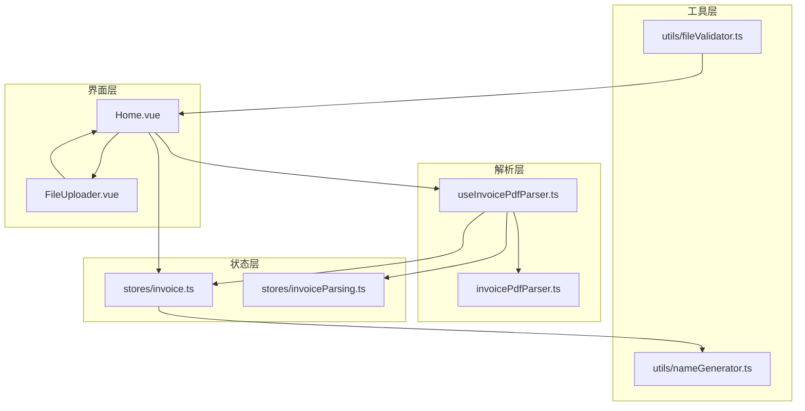
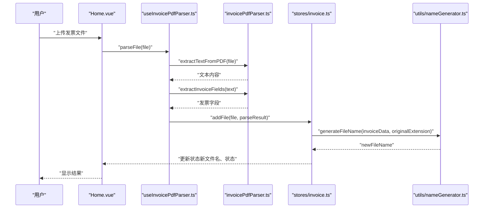
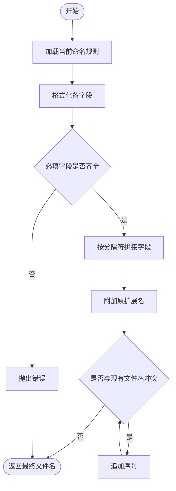
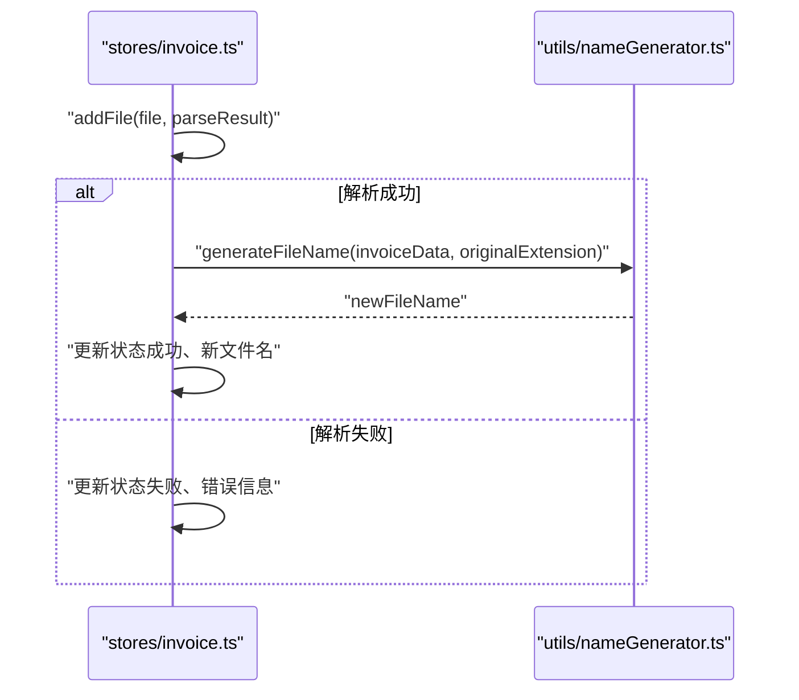
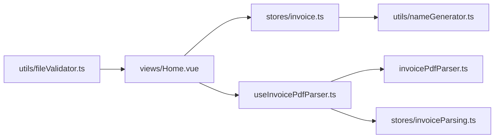

# 文件名生成

<cite>
**本文引用的文件**
- [nameGenerator.ts](file://src/utils/nameGenerator.ts)
- [invoice.ts](file://src/stores/invoice.ts)
- [invoicePdfParser.ts](file://src/utils/invoicePdfParser.ts)
- [useInvoicePdfParser.ts](file://src/composables/useInvoicePdfParser.ts)
- [invoiceParsing.ts](file://src/stores/invoiceParsing.ts)
- [fileValidator.ts](file://src/utils/fileValidator.ts)
- [Home.vue](file://src/views/Home.vue)
- [FileUploader.vue](file://src/components/FileUploader.vue)
- [README.md](file://README.md)
</cite>

## 目录
1. [简介](#简介)
2. [项目结构](#项目结构)
3. [核心组件](#核心组件)
4. [架构总览](#架构总览)
5. [详细组件分析](#详细组件分析)
6. [依赖关系分析](#依赖关系分析)
7. [性能考量](#性能考量)
8. [故障排查指南](#故障排查指南)
9. [结论](#结论)
10. [附录](#附录)

## 简介
本文件聚焦“文件名生成”功能，系统性阐述如何基于发票解析后的结构化数据（如购买方名称、金额、开票日期等）自动生成标准化文件名。文档涵盖：
- nameGenerator 工具如何从发票数据中提取关键字段并应用模板与格式化规则
- 命名模板的配置方式、可定制性与变量占位符
- 在 invoice store 中集成文件名生成逻辑的方式
- 冲突处理与特殊字符清理策略
- 规则扩展性与自定义接口建议
- 生成文件名合法性的验证方法

## 项目结构
围绕文件名生成的关键模块与职责如下：
- utils/nameGenerator.ts：文件名生成与冲突处理的核心工具
- stores/invoice.ts：发票文件列表的状态管理，负责调用文件名生成并将结果写入状态
- utils/invoicePdfParser.ts 与 composables/useInvoicePdfParser.ts：发票PDF解析与批量解析流程，输出结构化发票数据
- stores/invoiceParsing.ts：解析结果的状态管理（与文件名生成解耦）
- utils/fileValidator.ts：文件格式与大小校验（影响后续解析与命名）
- views/Home.vue 与 components/FileUploader.vue：用户交互入口，触发上传与处理流程

图表来源
- [Home.vue](file://src/views/Home.vue#L66-L155)
- [FileUploader.vue](file://src/components/FileUploader.vue#L31-L38)
- [useInvoicePdfParser.ts](file://src/composables/useInvoicePdfParser.ts#L29-L153)
- [invoicePdfParser.ts](file://src/utils/invoicePdfParser.ts#L97-L152)
- [invoice.ts](file://src/stores/invoice.ts#L106-L151)
- [nameGenerator.ts](file://src/utils/nameGenerator.ts#L143-L170)
- [fileValidator.ts](file://src/utils/fileValidator.ts#L57-L72)

章节来源
- [README.md](file://README.md#L1-L41)
- [Home.vue](file://src/views/Home.vue#L66-L155)
- [FileUploader.vue](file://src/components/FileUploader.vue#L31-L38)
- [useInvoicePdfParser.ts](file://src/composables/useInvoicePdfParser.ts#L29-L153)
- [invoicePdfParser.ts](file://src/utils/invoicePdfParser.ts#L97-L152)
- [invoice.ts](file://src/stores/invoice.ts#L106-L151)
- [nameGenerator.ts](file://src/utils/nameGenerator.ts#L143-L170)
- [fileValidator.ts](file://src/utils/fileValidator.ts#L57-L72)

## 核心组件
- nameGenerator 工具
  - 命名规则定义：通过规则名映射到模板、分隔符与字段列表
  - 字段格式化器：对字段进行清洗、截断、格式化（如金额保留两位小数、日期规范化为YYYYMMDD）
  - 文件名生成：根据模板与格式化后的字段拼接生成最终文件名，并保留原扩展名
  - 冲突处理：检测已有文件名，追加序号避免重复
  - 批量生成：遍历发票数据列表，统一处理冲突并返回结果数组
  - 规则切换：运行时切换当前命名规则
- invoice store
  - 接收解析结果，调用文件名生成器生成新文件名
  - 将生成结果写入状态，包含原始文件名、新文件名、状态与错误信息
  - 支持更新购买方名称或金额后重新生成文件名
- 解析流程
  - useInvoicePdfParser：封装单文件与批量解析，提供进度回调
  - invoicePdfParser：从PDF文本中提取发票字段并进行数据验证

章节来源
- [nameGenerator.ts](file://src/utils/nameGenerator.ts#L34-L60)
- [nameGenerator.ts](file://src/utils/nameGenerator.ts#L65-L138)
- [nameGenerator.ts](file://src/utils/nameGenerator.ts#L143-L170)
- [nameGenerator.ts](file://src/utils/nameGenerator.ts#L175-L191)
- [nameGenerator.ts](file://src/utils/nameGenerator.ts#L196-L225)
- [nameGenerator.ts](file://src/utils/nameGenerator.ts#L230-L249)
- [invoice.ts](file://src/stores/invoice.ts#L106-L151)
- [invoice.ts](file://src/stores/invoice.ts#L153-L176)
- [useInvoicePdfParser.ts](file://src/composables/useInvoicePdfParser.ts#L37-L91)
- [invoicePdfParser.ts](file://src/utils/invoicePdfParser.ts#L138-L152)

## 架构总览
文件名生成在整体流程中的位置如下：

图表来源
- [Home.vue](file://src/views/Home.vue#L100-L155)
- [useInvoicePdfParser.ts](file://src/composables/useInvoicePdfParser.ts#L37-L91)
- [invoicePdfParser.ts](file://src/utils/invoicePdfParser.ts#L138-L152)
- [invoice.ts](file://src/stores/invoice.ts#L106-L151)
- [nameGenerator.ts](file://src/utils/nameGenerator.ts#L143-L170)

## 详细组件分析

### nameGenerator 工具
- 命名规则与模板
  - 规则定义：通过规则名映射到模板字符串、分隔符与字段列表
  - 支持的变量占位符：{purchaserName}、{totalAmount}、{issueDate}、{invoiceType}、{invoiceCode}
  - 分隔符：可自定义，如“_”
- 字段格式化器
  - 购买方名称：去除路径非法字符、限制长度、去空白
  - 发票类型：去除“电子发票”字样与括号，保留核心类型
  - 价税合计：数字转浮点并保留两位小数
  - 开票日期：支持“YYYY年M月D日”与常见分隔符，统一格式化为YYYYMMDD
  - 发票号码/销售方名称：简单清洗与去空白
- 文件名生成
  - 依据规则字段顺序拼接，使用分隔符连接
  - 保留原文件扩展名
  - 必填字段缺失时抛出异常
- 冲突处理
  - 提取扩展名，若同名存在则追加“_序号”，直到不冲突
- 批量生成
  - 维护已存在文件名集合，逐条生成并处理冲突
  - 返回每条记录的成功/失败状态与对应信息
- 规则切换与查询
  - 运行时切换当前规则
  - 查询可用规则列表

图表来源
- [nameGenerator.ts](file://src/utils/nameGenerator.ts#L143-L170)
- [nameGenerator.ts](file://src/utils/nameGenerator.ts#L175-L191)

章节来源
- [nameGenerator.ts](file://src/utils/nameGenerator.ts#L5-L26)
- [nameGenerator.ts](file://src/utils/nameGenerator.ts#L34-L60)
- [nameGenerator.ts](file://src/utils/nameGenerator.ts#L65-L138)
- [nameGenerator.ts](file://src/utils/nameGenerator.ts#L143-L170)
- [nameGenerator.ts](file://src/utils/nameGenerator.ts#L175-L191)
- [nameGenerator.ts](file://src/utils/nameGenerator.ts#L196-L225)
- [nameGenerator.ts](file://src/utils/nameGenerator.ts#L230-L249)

### invoice store 集成
- addFile 流程
  - 从解析结果中提取发票类型、购买方名称、价税合计
  - 调用 generateFileName 生成新文件名
  - 将状态（成功/失败）、错误信息、新文件名写入状态
- updateFile 流程
  - 当购买方名称或金额更新时，重新生成文件名并更新状态
- 冲突处理在 store 层未直接体现，但批量生成时会考虑已有文件名集合；单条更新时可结合外部集合进行冲突检查

图表来源
- [invoice.ts](file://src/stores/invoice.ts#L106-L151)
- [nameGenerator.ts](file://src/utils/nameGenerator.ts#L143-L170)

章节来源
- [invoice.ts](file://src/stores/invoice.ts#L106-L151)
- [invoice.ts](file://src/stores/invoice.ts#L153-L176)

### 解析与数据准备
- useInvoicePdfParser
  - 单文件解析：校验文件格式与大小，提取文本，提取字段，验证数据，构建解析结果
  - 批量解析：分批并发处理，提供进度回调
- invoicePdfParser
  - 从PDF文本中提取发票号码、发票类型、不含税金额、税额、价税合计、多税率等
  - 提供数据验证：格式与范围校验，确保金额、税额、税率等数值合理

章节来源
- [useInvoicePdfParser.ts](file://src/composables/useInvoicePdfParser.ts#L37-L91)
- [useInvoicePdfParser.ts](file://src/composables/useInvoicePdfParser.ts#L96-L153)
- [invoicePdfParser.ts](file://src/utils/invoicePdfParser.ts#L138-L152)
- [invoicePdfParser.ts](file://src/utils/invoicePdfParser.ts#L294-L334)

### 文件验证与上传入口
- fileValidator
  - 校验文件格式（PDF/XML）与大小（≤10MB），支持批量校验
- FileUploader
  - 提供拖拽上传与文件选择入口，限制接受类型与数量
- Home
  - 触发上传队列处理，调用解析与存储流程，展示进度与结果

章节来源
- [fileValidator.ts](file://src/utils/fileValidator.ts#L57-L72)
- [fileValidator.ts](file://src/utils/fileValidator.ts#L77-L106)
- [FileUploader.vue](file://src/components/FileUploader.vue#L31-L38)
- [Home.vue](file://src/views/Home.vue#L100-L155)

## 依赖关系分析
- 组件耦合
  - stores/invoice.ts 依赖 utils/nameGenerator.ts 生成文件名
  - views/Home.vue 与 components/FileUploader.vue 作为入口，间接依赖解析与存储
  - 解析层（useInvoicePdfParser.ts 与 invoicePdfParser.ts）与命名层（nameGenerator.ts）解耦
- 外部依赖
  - pdfjs-dist 用于PDF文本提取
  - Naive UI 用于界面交互
- 规则与格式化器的扩展点
  - 新增命名规则：向规则表中添加新条目
  - 新增字段格式化器：向格式化器表中添加新键值对
  - 新增变量占位符：在模板中使用新字段名并在格式化器中处理

图表来源
- [useInvoicePdfParser.ts](file://src/composables/useInvoicePdfParser.ts#L29-L153)
- [invoicePdfParser.ts](file://src/utils/invoicePdfParser.ts#L97-L152)
- [invoice.ts](file://src/stores/invoice.ts#L106-L151)
- [nameGenerator.ts](file://src/utils/nameGenerator.ts#L143-L170)
- [Home.vue](file://src/views/Home.vue#L66-L155)
- [fileValidator.ts](file://src/utils/fileValidator.ts#L57-L72)

## 性能考量
- 解析性能
  - PDF文本提取默认仅解析前若干页，若关键字段未找到再扩展解析剩余页面，平衡准确性与性能
  - 批量解析采用分批并发（批次内并发、批次间串行），降低内存峰值与提升吞吐
- 命名性能
  - 单条生成为 O(n)（n 为规则字段数），冲突处理最坏情况为 O(k)（k 为冲突次数）
  - 批量生成维护已有文件名集合，避免重复冲突检测
- 存储与渲染
  - store 中对文件名与状态的更新为轻量操作，界面渲染由 Vue 响应式驱动

章节来源
- [invoicePdfParser.ts](file://src/utils/invoicePdfParser.ts#L97-L129)
- [useInvoicePdfParser.ts](file://src/composables/useInvoicePdfParser.ts#L96-L153)
- [nameGenerator.ts](file://src/utils/nameGenerator.ts#L196-L225)

## 故障排查指南
- 常见问题与定位
  - 字段缺失或为空：生成器会在必填字段缺失时抛出错误，检查解析结果是否包含所需字段
  - 特殊字符导致文件名非法：格式化器会清理路径非法字符，但仍需注意目标系统对文件名的限制
  - 冲突处理未生效：若在 store 层更新单条记录，未传入已有文件名集合，可能无法检测冲突；建议在批量场景或集中处理时使用批量生成接口
  - 解析失败：检查文件格式与大小限制，确认 PDF 文本提取是否成功
- 建议的排查步骤
  - 打印解析结果（发票类型、购买方名称、价税合计等）
  - 手动调用生成器，传入相同参数，观察错误信息
  - 检查规则表与格式化器是否覆盖所需字段
  - 在批量生成时传入完整的现有文件名集合

章节来源
- [nameGenerator.ts](file://src/utils/nameGenerator.ts#L146-L162)
- [nameGenerator.ts](file://src/utils/nameGenerator.ts#L175-L191)
- [invoice.ts](file://src/stores/invoice.ts#L118-L133)
- [useInvoicePdfParser.ts](file://src/composables/useInvoicePdfParser.ts#L42-L49)
- [fileValidator.ts](file://src/utils/fileValidator.ts#L57-L72)

## 结论
文件名生成模块通过“规则模板 + 字段格式化器”的设计，实现了对发票数据的标准化命名。其优势在于：
- 易扩展：新增规则与格式化器无需改动核心生成逻辑
- 易维护：解析与命名解耦，职责清晰
- 可观测：解析与命名均提供错误信息与状态反馈
在实际工程中，建议：
- 在批量处理时使用批量生成接口并传入现有文件名集合，确保冲突处理一致
- 为不同业务场景提供多套命名规则，便于灵活切换
- 对生成的文件名进行平台兼容性验证（如目标操作系统/云存储的文件名限制）

## 附录

### 命名模板与变量占位符
- 支持的变量占位符
  - {purchaserName}：购买方名称
  - {totalAmount}：价税合计（保留两位小数）
  - {issueDate}：开票日期（格式化为 YYYYMMDD）
  - {invoiceType}：发票类型（去除“电子发票”与括号）
  - {invoiceCode}：发票号码
- 模板示例（来自规则表）
  - “{purchaserName}_{totalAmount}”
  - “{invoiceType}_{purchaserName}_{totalAmount}”
  - “{purchaserName}_{issueDate}_{totalAmount}”
  - “{invoiceCode}_{purchaserName}”

章节来源
- [nameGenerator.ts](file://src/utils/nameGenerator.ts#L34-L60)
- [nameGenerator.ts](file://src/utils/nameGenerator.ts#L65-L138)

### 在 invoice store 中集成文件名生成的实践要点
- 单文件处理
  - 在 addFile 中调用 generateFileName，捕获异常并记录错误信息
  - 将生成的新文件名写入状态，以便后续导出与展示
- 动态更新
  - 在 updateFile 中，当购买方名称或金额变化时，重新生成文件名并更新状态
- 批量处理
  - 使用 generateFileNames 并传入完整现有文件名集合，确保冲突处理一致

章节来源
- [invoice.ts](file://src/stores/invoice.ts#L106-L151)
- [invoice.ts](file://src/stores/invoice.ts#L153-L176)
- [nameGenerator.ts](file://src/utils/nameGenerator.ts#L196-L225)

### 生成规则扩展性与自定义接口建议
- 新增命名规则
  - 在规则表中添加新条目，定义模板、分隔符与字段列表
- 新增字段格式化器
  - 在格式化器表中添加新键值对，处理新字段的清洗与格式化
- 新增变量占位符
  - 在模板中使用新字段名，并在格式化器中实现相应逻辑
- 合法性验证建议
  - 生成后对文件名进行平台兼容性检查（如长度、非法字符）
  - 对最终文件名进行唯一性校验（结合现有文件名集合）

章节来源
- [nameGenerator.ts](file://src/utils/nameGenerator.ts#L34-L60)
- [nameGenerator.ts](file://src/utils/nameGenerator.ts#L65-L138)
- [nameGenerator.ts](file://src/utils/nameGenerator.ts#L230-L249)