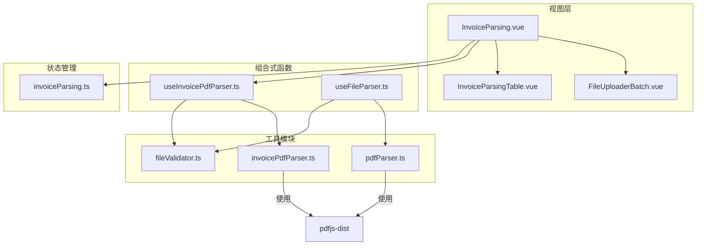
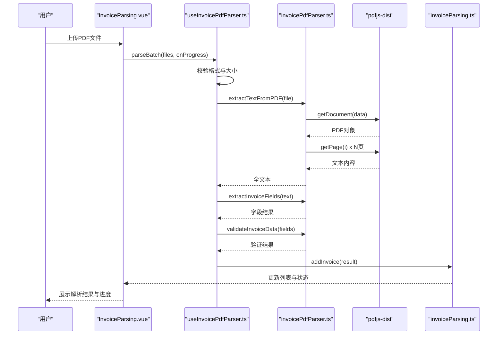
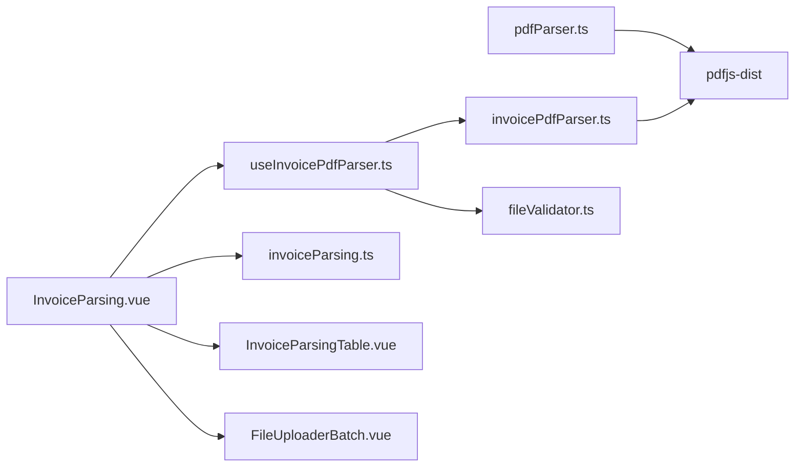
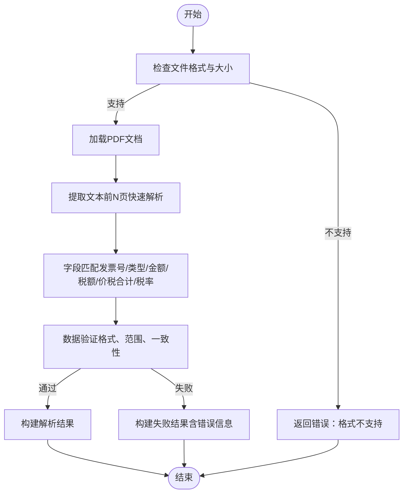

# PDF解析

<cite>
**本文引用的文件**
- [useFileParser.ts](file://src/composables/useFileParser.ts)
- [pdfParser.ts](file://src/utils/pdfParser.ts)
- [invoicePdfParser.ts](file://src/utils/invoicePdfParser.ts)
- [useInvoicePdfParser.ts](file://src/composables/useInvoicePdfParser.ts)
- [fileValidator.ts](file://src/utils/fileValidator.ts)
- [invoiceParsing.ts](file://src/stores/invoiceParsing.ts)
- [InvoiceParsing.vue](file://src/views/InvoiceParsing.vue)
- [FileUploaderBatch.vue](file://src/components/FileUploaderBatch.vue)
- [InvoiceParsingTable.vue](file://src/components/InvoiceParsingTable.vue)
- [package.json](file://package.json)
</cite>

## 目录
1. [简介](#简介)
2. [项目结构](#项目结构)
3. [核心组件](#核心组件)
4. [架构总览](#架构总览)
5. [详细组件分析](#详细组件分析)
6. [依赖关系分析](#依赖关系分析)
7. [性能考量](#性能考量)
8. [故障排查指南](#故障排查指南)
9. [结论](#结论)
10. [附录](#附录)

## 简介
本技术文档围绕基于 pdfjs-dist 的 PDF 发票解析能力展开，重点说明：
- useFileParser 中 parseFile 如何调用 parsePDFInvoice 处理 PDF 文件，并结合 pdfParser 工具实现底层解析。
- PDF 解析过程中的异步加载机制与错误处理策略（格式验证、文件大小限制）。
- 性能优化措施（快速解析前几页、分批并发、进度反馈）。
- 如何从 PDF 发票中提取关键字段（发票号、金额、税额、价税合计、税率等），并说明数据验证逻辑 validatePDFInvoiceData 的实现方式。
- 为开发者提供扩展 PDF 解析规则的指导，包括支持新型发票模板或自定义字段映射的方法。

## 项目结构
该项目采用前端单页应用架构，围绕“视图层 -> 组合式函数 -> 工具模块 -> 状态管理”的分层设计组织代码。与 PDF 解析相关的关键路径如下：
- 视图层：InvoiceParsing.vue 负责上传、解析、展示与导出。
- 组合式函数：useInvoicePdfParser.ts 提供批量解析与进度反馈；useFileParser.ts 提供通用文件解析入口。
- 工具模块：pdfParser.ts 与 invoicePdfParser.ts 实现 PDF 文本提取、字段提取与数据验证。
- 状态管理：invoiceParsing.ts 管理解析结果列表与筛选、搜索、选择等状态。
- 组件：FileUploaderBatch.vue、InvoiceParsingTable.vue 提供上传与表格展示。

图表来源
- [InvoiceParsing.vue](file://src/views/InvoiceParsing.vue#L1-L328)
- [useInvoicePdfParser.ts](file://src/composables/useInvoicePdfParser.ts#L1-L173)
- [useFileParser.ts](file://src/composables/useFileParser.ts#L1-L109)
- [pdfParser.ts](file://src/utils/pdfParser.ts#L1-L243)
- [invoicePdfParser.ts](file://src/utils/invoicePdfParser.ts#L1-L349)
- [fileValidator.ts](file://src/utils/fileValidator.ts#L1-L107)
- [invoiceParsing.ts](file://src/stores/invoiceParsing.ts#L1-L241)

章节来源
- [InvoiceParsing.vue](file://src/views/InvoiceParsing.vue#L1-L328)
- [useInvoicePdfParser.ts](file://src/composables/useInvoicePdfParser.ts#L1-L173)
- [useFileParser.ts](file://src/composables/useFileParser.ts#L1-L109)
- [pdfParser.ts](file://src/utils/pdfParser.ts#L1-L243)
- [invoicePdfParser.ts](file://src/utils/invoicePdfParser.ts#L1-L349)
- [fileValidator.ts](file://src/utils/fileValidator.ts#L1-L107)
- [invoiceParsing.ts](file://src/stores/invoiceParsing.ts#L1-L241)

## 核心组件
- useFileParser：统一的文件解析入口，根据文件后缀区分 PDF/XML，分别调用对应解析器与验证器，返回标准化结果。
- pdfParser：面向早期发票模板的解析器，提供 extractTextFromPDF、extractInvoiceDataFromText、validatePDFInvoiceData。
- invoicePdfParser：面向更复杂发票模板的解析器，提供 extractTextFromPDF、extractInvoiceFields、validateInvoiceData，支持多税率、多金额模式匹配。
- useInvoicePdfParser：封装批量解析、进度反馈、文件校验（格式与大小），并将结果写入 Pinia 状态。
- fileValidator：集中管理支持格式、大小限制与批量校验。
- invoiceParsing：Pinia Store，维护解析结果列表、筛选、搜索、选择等状态。
- 视图组件：InvoiceParsing.vue、FileUploaderBatch.vue、InvoiceParsingTable.vue。

章节来源
- [useFileParser.ts](file://src/composables/useFileParser.ts#L1-L109)
- [pdfParser.ts](file://src/utils/pdfParser.ts#L1-L243)
- [invoicePdfParser.ts](file://src/utils/invoicePdfParser.ts#L1-L349)
- [useInvoicePdfParser.ts](file://src/composables/useInvoicePdfParser.ts#L1-L173)
- [fileValidator.ts](file://src/utils/fileValidator.ts#L1-L107)
- [invoiceParsing.ts](file://src/stores/invoiceParsing.ts#L1-L241)
- [InvoiceParsing.vue](file://src/views/InvoiceParsing.vue#L1-L328)
- [FileUploaderBatch.vue](file://src/components/FileUploaderBatch.vue#L1-L79)
- [InvoiceParsingTable.vue](file://src/components/InvoiceParsingTable.vue#L1-L157)

## 架构总览
PDF 解析流程分为三层：
- 输入层：用户上传 PDF 文件，进行格式与大小校验。
- 解析层：使用 pdfjs-dist 异步加载 PDF，提取文本；随后按模板匹配字段。
- 输出层：验证提取结果，构建统一结构，写入状态并展示。

图表来源
- [InvoiceParsing.vue](file://src/views/InvoiceParsing.vue#L188-L232)
- [useInvoicePdfParser.ts](file://src/composables/useInvoicePdfParser.ts#L96-L153)
- [invoicePdfParser.ts](file://src/utils/invoicePdfParser.ts#L97-L129)
- [invoicePdfParser.ts](file://src/utils/invoicePdfParser.ts#L138-L152)
- [invoicePdfParser.ts](file://src/utils/invoicePdfParser.ts#L294-L334)
- [invoiceParsing.ts](file://src/stores/invoiceParsing.ts#L122-L128)

## 详细组件分析

### useFileParser：通用文件解析入口
- 功能要点
  - 根据文件后缀区分 PDF/XML。
  - PDF：调用 parsePDFInvoice 提取发票数据，再用 validatePDFInvoiceData 验证。
  - XML：先解析 XML，再提取发票数据并验证。
  - 异常捕获：统一返回包含 success、data、errors、type 的结构。
- 关键调用链
  - parseFile -> parsePDFInvoice -> extractTextFromPDF -> pdfjs-dist -> extractInvoiceDataFromText -> validatePDFInvoiceData
- 错误处理
  - 格式不支持时返回 unknown 类型与错误信息。
  - 捕获异常并返回错误消息，保证上层 UI 不崩溃。

章节来源
- [useFileParser.ts](file://src/composables/useFileParser.ts#L22-L66)

### pdfParser：基础发票解析器
- 文本提取
  - 使用 pdfjs-dist 加载 PDF，遍历前若干页提取文本，拼接为全文。
- 字段提取
  - 发票类型：通过正则匹配“电子发票”等关键字。
  - 发票号码：匹配固定长度数字序列。
  - 开票日期：匹配“YYYY年MM月DD日”格式。
  - 购买方/销售方名称：优先匹配带统一社会信用码的公司名称，否则回退到首个公司名称。
  - 金额：优先匹配“价税合计/合计”等关键字，其次回退到末尾附近最后一个金额。
- 数据验证
  - 必填字段：购买方名称、金额。
  - 返回布尔值与错误数组，便于上层判断。

章节来源
- [pdfParser.ts](file://src/utils/pdfParser.ts#L31-L65)
- [pdfParser.ts](file://src/utils/pdfParser.ts#L70-L179)
- [pdfParser.ts](file://src/utils/pdfParser.ts#L184-L192)
- [pdfParser.ts](file://src/utils/pdfParser.ts#L216-L242)

### invoicePdfParser：高级发票解析器
- 文本提取优化
  - 快速解析前 N 页，若未命中关键字段再继续解析剩余页面，兼顾性能与准确性。
- 字段提取（多模式匹配）
  - 发票号码：多种常见格式的正则组合，优先匹配 20 位数字。
  - 发票类型：通过“专票/普票/增值税专用发票/增值税普通发票”等关键字识别，必要时依据发票代码首数字判断。
  - 金额/税额/价税合计：多组正则按优先级匹配，支持多页发票的金额顺序推断。
  - 税率：支持多个税率提取，限定合法税率集合，避免异常值。
- 数据验证
  - 发票号码：必须为 20 位数字。
  - 金额/价税合计：必须为正数。
  - 税额：非负数且不大于价税合计。
  - 税率：必须在合法集合内，或标记为“免税”。

章节来源
- [invoicePdfParser.ts](file://src/utils/invoicePdfParser.ts#L97-L129)
- [invoicePdfParser.ts](file://src/utils/invoicePdfParser.ts#L138-L152)
- [invoicePdfParser.ts](file://src/utils/invoicePdfParser.ts#L159-L167)
- [invoicePdfParser.ts](file://src/utils/invoicePdfParser.ts#L170-L202)
- [invoicePdfParser.ts](file://src/utils/invoicePdfParser.ts#L205-L221)
- [invoicePdfParser.ts](file://src/utils/invoicePdfParser.ts#L224-L234)
- [invoicePdfParser.ts](file://src/utils/invoicePdfParser.ts#L294-L334)

### useInvoicePdfParser：批量解析与进度反馈
- 文件校验
  - 仅允许 PDF，大小不超过 10MB。
- 批量解析
  - 自动分批（默认每批 10 个），批次内并发执行，批次间串行，确保资源可控。
  - 细粒度进度：每个文件完成后更新进度百分比与当前文件名。
- 结果构建
  - 将字段提取与验证结果封装为统一结构，包含状态、错误信息、解析时间等。
- 异常处理
  - 捕获解析异常，返回失败状态与错误信息，不影响其他文件解析。

章节来源
- [useInvoicePdfParser.ts](file://src/composables/useInvoicePdfParser.ts#L37-L91)
- [useInvoicePdfParser.ts](file://src/composables/useInvoicePdfParser.ts#L96-L153)

### fileValidator：文件格式与大小校验
- 支持格式：PDF、XML（含多种 MIME 类型）。
- 大小限制：单文件最大 10MB。
- 批量校验：限制最多 100 个文件，返回通过与失败统计。

章节来源
- [fileValidator.ts](file://src/utils/fileValidator.ts#L38-L72)
- [fileValidator.ts](file://src/utils/fileValidator.ts#L77-L106)

### 视图与状态管理
- InvoiceParsing.vue
  - 上传：FileUploaderBatch.vue 接收文件，触发批量解析。
  - 展示：InvoiceParsingTable.vue 动态渲染字段与税率列，支持筛选、搜索、全选、删除。
  - 导出：通过 useDataExport 导出 Excel/JSON。
- invoiceParsing.ts
  - 维护解析结果列表、筛选状态、搜索关键词、选中 ID、处理状态等。
  - 计算属性：成功/失败/总数、最大税率列数等。

章节来源
- [InvoiceParsing.vue](file://src/views/InvoiceParsing.vue#L188-L232)
- [InvoiceParsing.vue](file://src/views/InvoiceParsing.vue#L273-L302)
- [InvoiceParsingTable.vue](file://src/components/InvoiceParsingTable.vue#L34-L136)
- [invoiceParsing.ts](file://src/stores/invoiceParsing.ts#L71-L114)
- [invoiceParsing.ts](file://src/stores/invoiceParsing.ts#L212-L239)

## 依赖关系分析
- pdfjs-dist：PDF 文档加载与文本提取的核心依赖。
- naive-ui：UI 组件库，用于上传、表格、弹窗等交互。
- pinia：状态管理，保存解析结果与筛选状态。
- fast-xml-parser、xlsx、jszip、file-saver：XML 解析与导出相关依赖。

图表来源
- [pdfParser.ts](file://src/utils/pdfParser.ts#L4-L8)
- [invoicePdfParser.ts](file://src/utils/invoicePdfParser.ts#L5-L13)
- [useInvoicePdfParser.ts](file://src/composables/useInvoicePdfParser.ts#L6-L11)
- [InvoiceParsing.vue](file://src/views/InvoiceParsing.vue#L142-L151)
- [invoiceParsing.ts](file://src/stores/invoiceParsing.ts#L4-L5)
- [InvoiceParsingTable.vue](file://src/components/InvoiceParsingTable.vue#L1-L157)
- [FileUploaderBatch.vue](file://src/components/FileUploaderBatch.vue#L1-L79)

章节来源
- [package.json](file://package.json#L12-L22)

## 性能考量
- 快速解析策略
  - 默认仅解析前 N 页（快速解析阈值），若未命中关键字段再继续解析剩余页面，平衡速度与准确率。
- 并发与批处理
  - 批量解析采用分批并发（每批 10 个），批次间串行，避免内存峰值过高。
- 进度反馈
  - 细粒度进度：每个文件完成后更新进度与当前文件名，提升用户体验。
- 资源控制
  - 文件大小限制（10MB）、文件数量限制（100 个），防止异常输入导致资源耗尽。

章节来源
- [invoicePdfParser.ts](file://src/utils/invoicePdfParser.ts#L16-L16)
- [invoicePdfParser.ts](file://src/utils/invoicePdfParser.ts#L104-L122)
- [useInvoicePdfParser.ts](file://src/composables/useInvoicePdfParser.ts#L13-L14)
- [useInvoicePdfParser.ts](file://src/composables/useInvoicePdfParser.ts#L117-L136)
- [fileValidator.ts](file://src/utils/fileValidator.ts#L12-L16)

## 故障排查指南
- 常见错误与定位
  - “文件格式不支持”：检查文件后缀与 MIME 类型，确保为 PDF 或 XML。
  - “文件大小超过限制（最大10MB）”：压缩文件或拆分文件。
  - “PDF 文本提取失败”：检查 PDF 是否加密、损坏或为空页。
  - “发票信息提取失败/发票字段提取失败”：确认发票模板是否符合现有正则匹配规则。
  - “缺少购买方名称/缺少金额”：验证发票内容是否包含关键字段。
- 日志与调试
  - 开发模式下会输出详细日志（文件名、页数、文本长度、提取结果等），便于定位问题。
- UI 层面
  - 失败记录会在表格中显示“失败原因”，便于用户核对与重试。

章节来源
- [useFileParser.ts](file://src/composables/useFileParser.ts#L58-L65)
- [pdfParser.ts](file://src/utils/pdfParser.ts#L61-L64)
- [pdfParser.ts](file://src/utils/pdfParser.ts#L175-L178)
- [invoicePdfParser.ts](file://src/utils/invoicePdfParser.ts#L125-L128)
- [invoicePdfParser.ts](file://src/utils/invoicePdfParser.ts#L148-L151)
- [useInvoicePdfParser.ts](file://src/composables/useInvoicePdfParser.ts#L77-L90)

## 结论
本项目通过清晰的分层设计与完善的错误处理机制，实现了稳定高效的 PDF 发票解析能力。核心优势包括：
- 基于 pdfjs-dist 的可靠文本提取。
- 面向不同发票模板的双解析器策略（基础版与高级版）。
- 批量解析与进度反馈，兼顾性能与体验。
- 集中化的数据验证与状态管理，便于扩展与维护。

## 附录

### 从 PDF 发票中提取关键字段的流程图

图表来源
- [useInvoicePdfParser.ts](file://src/composables/useInvoicePdfParser.ts#L42-L49)
- [invoicePdfParser.ts](file://src/utils/invoicePdfParser.ts#L97-L129)
- [invoicePdfParser.ts](file://src/utils/invoicePdfParser.ts#L138-L152)
- [invoicePdfParser.ts](file://src/utils/invoicePdfParser.ts#L294-L334)

### 数据验证逻辑（validatePDFInvoiceData）实现要点
- 必填字段：购买方名称、金额。
- 返回布尔值与错误数组，便于上层 UI 显示与处理。
- 与高级解析器的 validateInvoiceData 类似，但字段覆盖范围更窄，适配早期模板。

章节来源
- [pdfParser.ts](file://src/utils/pdfParser.ts#L216-L242)

### 扩展解析规则的实践指南
- 新增发票模板
  - 在 invoicePdfParser.ts 中新增字段提取函数或扩展现有函数，增加新的正则模式与匹配逻辑。
  - 在 extractInvoiceFields 中注册新字段的提取入口。
- 自定义字段映射
  - 在 InvoiceFieldsResult 中添加新字段类型，确保与 UI 表格列一致。
  - 在 validateInvoiceData 中补充相应验证规则。
- 性能优化建议
  - 保持快速解析阈值合理，避免过度解析。
  - 控制正则复杂度，避免回溯爆炸。
  - 批量解析时注意内存占用，必要时降低批大小。
- UI 展示扩展
  - 在 InvoiceParsingTable.vue 中动态生成新列，确保滚动宽度与列宽计算正确。
  - 在 Pinia Store 中维护新字段的状态与计算属性。

章节来源
- [invoicePdfParser.ts](file://src/utils/invoicePdfParser.ts#L76-L88)
- [invoicePdfParser.ts](file://src/utils/invoicePdfParser.ts#L138-L152)
- [invoicePdfParser.ts](file://src/utils/invoicePdfParser.ts#L294-L334)
- [InvoiceParsingTable.vue](file://src/components/InvoiceParsingTable.vue#L82-L98)
- [invoiceParsing.ts](file://src/stores/invoiceParsing.ts#L10-L15)