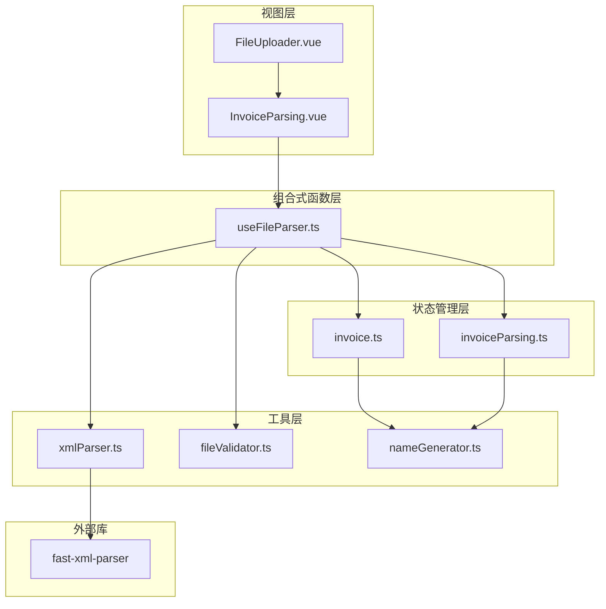
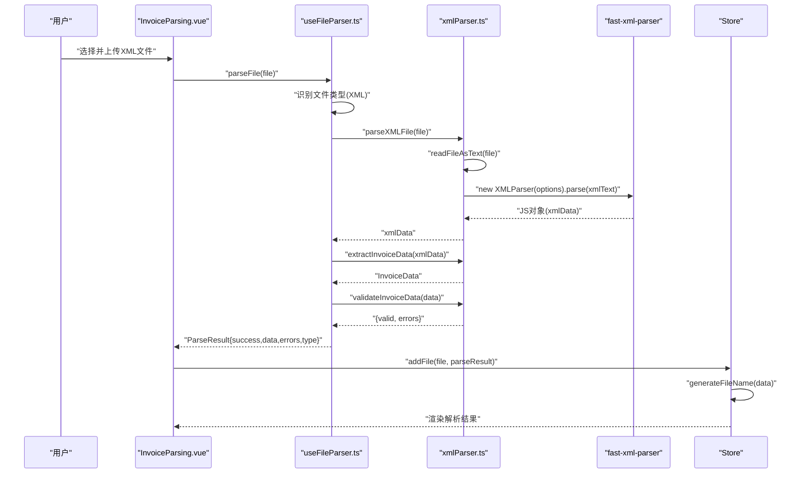
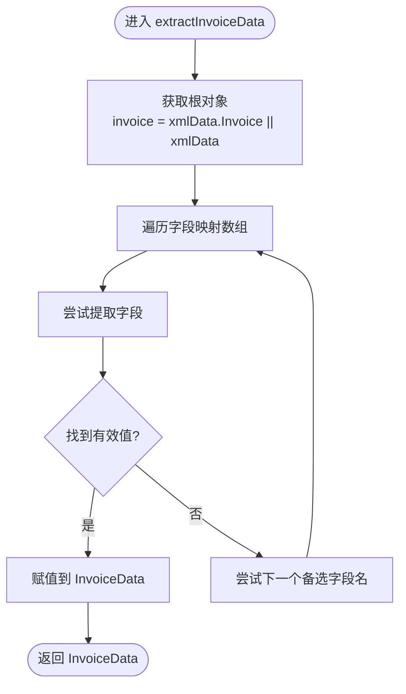
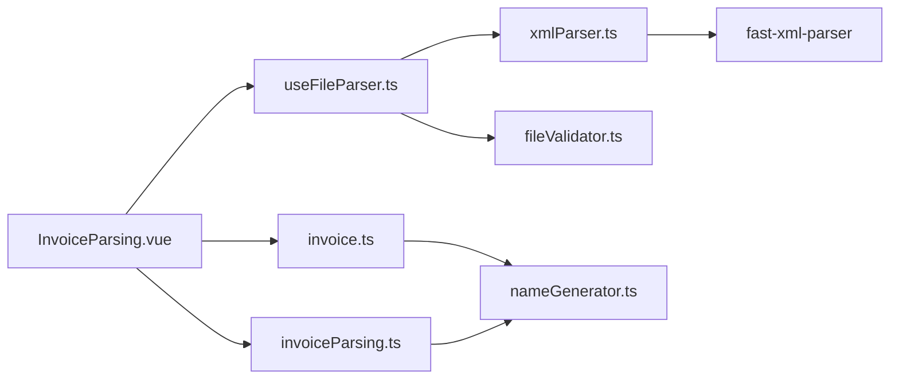
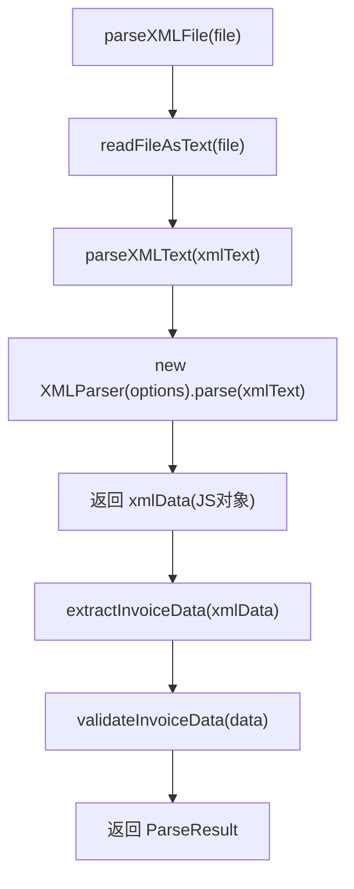

# XML解析

<cite>
**本文引用的文件**
- [useFileParser.ts](file://src/composables/useFileParser.ts)
- [xmlParser.ts](file://src/utils/xmlParser.ts)
- [fileValidator.ts](file://src/utils/fileValidator.ts)
- [nameGenerator.ts](file://src/utils/nameGenerator.ts)
- [invoice.ts](file://src/stores/invoice.ts)
- [invoiceParsing.ts](file://src/stores/invoiceParsing.ts)
- [InvoiceParsing.vue](file://src/views/InvoiceParsing.vue)
- [FileUploader.vue](file://src/components/FileUploader.vue)
- [useInvoicePdfParser.ts](file://src/composables/useInvoicePdfParser.ts)
- [package.json](file://package.json)
</cite>

## 目录
1. [简介](#简介)
2. [项目结构](#项目结构)
3. [核心组件](#核心组件)
4. [架构总览](#架构总览)
5. [详细组件分析](#详细组件分析)
6. [依赖关系分析](#依赖关系分析)
7. [性能考量](#性能考量)
8. [故障排查指南](#故障排查指南)
9. [结论](#结论)
10. [附录](#附录)

## 简介
本技术文档聚焦于使用 fast-xml-parser 库解析发票 XML 文件的实现机制，系统阐述 useFileParser 中 parseFile 函数如何与 xmlParser.ts 中的 parseXMLFile 与 extractInvoiceData 协同工作，完成从 XML 到结构化发票数据的转换；同时说明 validateInvoiceData 的验证机制、错误处理与异常捕获策略，并给出扩展 XML 解析能力的实践建议（如支持新的 XML 发票标准或自定义数据映射规则）。

## 项目结构
本项目采用前端单页应用架构，围绕“发票处理”主题组织模块：
- 组合式函数层：useFileParser 负责统一调度 PDF/XML 文件解析流程
- 工具层：xmlParser 提供 XML 解析、字段提取与校验；nameGenerator 提供文件名生成与格式化
- 状态管理层：invoice 与 invoiceParsing 两个 Pinia Store 管理发票解析结果与 UI 展示
- 视图层：InvoiceParsing.vue 作为主页面承载上传、解析、展示与导出
- 组件层：FileUploader.vue 提供拖拽上传入口

图表来源
- [InvoiceParsing.vue](file://src/views/InvoiceParsing.vue#L1-L328)
- [FileUploader.vue](file://src/components/FileUploader.vue#L1-L50)
- [useFileParser.ts](file://src/composables/useFileParser.ts#L1-L109)
- [xmlParser.ts](file://src/utils/xmlParser.ts#L1-L141)
- [fileValidator.ts](file://src/utils/fileValidator.ts#L1-L107)
- [nameGenerator.ts](file://src/utils/nameGenerator.ts#L1-L250)
- [invoice.ts](file://src/stores/invoice.ts#L1-L256)
- [invoiceParsing.ts](file://src/stores/invoiceParsing.ts#L1-L241)
- [package.json](file://package.json#L12-L23)

章节来源
- [InvoiceParsing.vue](file://src/views/InvoiceParsing.vue#L1-L328)
- [useFileParser.ts](file://src/composables/useFileParser.ts#L1-L109)
- [xmlParser.ts](file://src/utils/xmlParser.ts#L1-L141)
- [fileValidator.ts](file://src/utils/fileValidator.ts#L1-L107)
- [nameGenerator.ts](file://src/utils/nameGenerator.ts#L1-L250)
- [invoice.ts](file://src/stores/invoice.ts#L1-L256)
- [invoiceParsing.ts](file://src/stores/invoiceParsing.ts#L1-L241)
- [package.json](file://package.json#L12-L23)

## 核心组件
- useFileParser：统一入口，区分 PDF/XML 文件类型，调用对应解析器，聚合结果并返回统一的 ParseResult 结构
- xmlParser：封装 fast-xml-parser，提供 parseXMLFile、parseXMLText、extractInvoiceData、validateInvoiceData
- fileValidator：文件格式与大小校验，辅助上传前预检
- nameGenerator：发票字段格式化与文件名生成，支持多命名规则与冲突处理
- invoice/invoiceParsing Store：存储解析结果、状态与 UI 交互所需的数据结构

章节来源
- [useFileParser.ts](file://src/composables/useFileParser.ts#L15-L66)
- [xmlParser.ts](file://src/utils/xmlParser.ts#L42-L141)
- [fileValidator.ts](file://src/utils/fileValidator.ts#L35-L72)
- [nameGenerator.ts](file://src/utils/nameGenerator.ts#L143-L170)
- [invoice.ts](file://src/stores/invoice.ts#L106-L151)
- [invoiceParsing.ts](file://src/stores/invoiceParsing.ts#L18-L31)

## 架构总览
XML 解析流程在前端浏览器环境中执行，不涉及后端服务。整体流程如下：
- 用户上传 XML 文件
- useFileParser 根据文件后缀判断为 XML，调用 parseXMLFile
- parseXMLFile 读取文件文本并交由 fast-xml-parser 解析为 JS 对象
- extractInvoiceData 从 XML 对象中抽取关键发票字段，形成标准化结构
- validateInvoiceData 对必填字段进行校验
- 结果经 useFileParser 返回，Store 接收并生成文件名（如成功）

图表来源
- [InvoiceParsing.vue](file://src/views/InvoiceParsing.vue#L188-L232)
- [useFileParser.ts](file://src/composables/useFileParser.ts#L22-L66)
- [xmlParser.ts](file://src/utils/xmlParser.ts#L42-L141)
- [nameGenerator.ts](file://src/utils/nameGenerator.ts#L143-L170)

## 详细组件分析

### useFileParser：统一解析入口
- 功能职责
  - 识别文件类型（PDF/XML），分别调用对应的解析器
  - 对 PDF：parsePDFInvoice -> validatePDFInvoiceData
  - 对 XML：parseXMLFile -> extractInvoiceData -> validateInvoiceData
  - 统一返回 ParseResult 结构，包含 success、data、errors、type
  - 支持批量解析，按批次并发，提供进度回调
- 关键点
  - 类型判断基于文件名后缀
  - 异常捕获统一包装为 ParseResult，保证上层 UI 稳定
  - 批量解析采用固定批次大小，避免内存压力过大

章节来源
- [useFileParser.ts](file://src/composables/useFileParser.ts#L15-L109)

### xmlParser：XML 解析与数据提取
- 解析器配置
  - 使用 fast-xml-parser，配置忽略属性、声明，保留文本节点名，开启 trim
  - 通过 parseXMLText 将字符串解析为 JS 对象
- 数据提取
  - extractInvoiceData 从顶层 Invoice 或根对象中抽取字段
  - 字段映射采用“备选字段名数组”，提升对不同 XML 结构的兼容性
  - extractField 实现“优先级查找”，遇到非空即返回
- 校验机制
  - validateInvoiceData 校验发票类型、购买方名称、价税合计三项必填字段
  - 返回布尔值与错误列表，便于 UI 展示
- 错误处理
  - 三处 try/catch：文件读取、XML 解析、字段提取
  - 每处抛出带明确上下文的错误消息，便于定位问题

图表来源
- [xmlParser.ts](file://src/utils/xmlParser.ts#L67-L97)

章节来源
- [xmlParser.ts](file://src/utils/xmlParser.ts#L42-L141)

### 文件读取与解析细节
- readFileAsText 使用 FileReader 异步读取文件文本
- parseXMLText 创建 XMLParser 实例并执行 parse
- parseXMLFile 在 parseXMLText 外层包裹错误处理，统一报错

章节来源
- [xmlParser.ts](file://src/utils/xmlParser.ts#L102-L116)
- [xmlParser.ts](file://src/utils/xmlParser.ts#L54-L62)
- [xmlParser.ts](file://src/utils/xmlParser.ts#L42-L49)

### 校验与错误处理策略
- useFileParser
  - 对 PDF/XML 分支分别调用 validateXXX，返回统一 ParseResult
  - 捕获异常，将错误信息放入 errors 数组
- xmlParser
  - parseXMLFile/parseXMLText/extractInvoiceData 内部均 try/catch
  - 抛出带上下文的错误消息，便于定位具体环节
- fileValidator
  - validateFileFormat 支持 PDF/XML 与常见 MIME 类型
  - validateFileSize 限制单文件大小（默认 10MB）

章节来源
- [useFileParser.ts](file://src/composables/useFileParser.ts#L26-L66)
- [xmlParser.ts](file://src/utils/xmlParser.ts#L42-L49)
- [xmlParser.ts](file://src/utils/xmlParser.ts#L54-L62)
- [xmlParser.ts](file://src/utils/xmlParser.ts#L121-L141)
- [fileValidator.ts](file://src/utils/fileValidator.ts#L35-L72)

### 文件名生成与命名规则
- generateFileName 基于命名规则模板与字段格式化器生成最终文件名
- CURRENT_RULE 默认为 purchaser_amount（购方名称_金额）
- 支持多规则切换（setCurrentRule），并提供冲突处理（handleFileNameConflict）
- Store 在 addFile/updateFile 时调用生成逻辑，失败则标记为 failed 并记录错误

章节来源
- [nameGenerator.ts](file://src/utils/nameGenerator.ts#L143-L170)
- [nameGenerator.ts](file://src/utils/nameGenerator.ts#L230-L235)
- [invoice.ts](file://src/stores/invoice.ts#L106-L151)
- [invoiceParsing.ts](file://src/stores/invoiceParsing.ts#L122-L139)

### 视图与交互
- InvoiceParsing.vue 提供上传区、进度模态、结果表格与导出功能
- FileUploader.vue 支持拖拽上传，接受 .pdf/.xml
- Store 提供筛选、搜索、全选、删除、导出等操作

章节来源
- [InvoiceParsing.vue](file://src/views/InvoiceParsing.vue#L1-L328)
- [FileUploader.vue](file://src/components/FileUploader.vue#L1-L50)
- [invoice.ts](file://src/stores/invoice.ts#L72-L91)
- [invoiceParsing.ts](file://src/stores/invoiceParsing.ts#L71-L91)

## 依赖关系分析
- 外部依赖
  - fast-xml-parser：XML 解析核心库
  - naive-ui、vue、pinia 等：UI 与状态管理
- 内部依赖
  - useFileParser 依赖 xmlParser 与 fileValidator
  - Store 依赖 nameGenerator 生成文件名
  - 视图层依赖组合式函数与 Store

图表来源
- [useFileParser.ts](file://src/composables/useFileParser.ts#L4-L6)
- [xmlParser.ts](file://src/utils/xmlParser.ts#L4-L4)
- [fileValidator.ts](file://src/utils/fileValidator.ts#L1-L107)
- [nameGenerator.ts](file://src/utils/nameGenerator.ts#L1-L250)
- [invoice.ts](file://src/stores/invoice.ts#L1-L256)
- [invoiceParsing.ts](file://src/stores/invoiceParsing.ts#L1-L241)
- [InvoiceParsing.vue](file://src/views/InvoiceParsing.vue#L1-L328)

章节来源
- [package.json](file://package.json#L12-L23)
- [useFileParser.ts](file://src/composables/useFileParser.ts#L4-L6)
- [xmlParser.ts](file://src/utils/xmlParser.ts#L4-L4)

## 性能考量
- 批量解析
  - useFileParser 采用固定批次大小（10）并发处理，避免一次性创建过多 Promise
  - 逐批串行、批内并发，兼顾吞吐与资源占用
- XML 解析
  - fast-xml-parser 为高性能解析器，结合合理配置（忽略属性、声明、trim）降低冗余
- 文件读取
  - FileReader 异步读取，避免阻塞主线程
- UI 响应
  - Store 使用 computed 计算属性，减少不必要的重渲染

章节来源
- [useFileParser.ts](file://src/composables/useFileParser.ts#L71-L100)
- [xmlParser.ts](file://src/utils/xmlParser.ts#L29-L37)

## 故障排查指南
- 常见错误与定位
  - XML 文件读取失败：检查文件编码、路径与权限；查看 FileReader 错误回调
  - XML 解析失败：核对 XML 声明、命名空间、标签层级；确认 fast-xml-parser 配置
  - 字段提取失败：确认 XML 结构与字段映射数组是否匹配；必要时扩展备选字段名
  - 校验失败：检查必填字段是否缺失或为空；关注字段格式（如金额需为数字）
- 异常捕获
  - useFileParser 将所有异常包装为 ParseResult，errors 数组包含错误信息
  - Store 在生成文件名失败时，将状态标记为 failed 并记录错误
- 建议
  - 在开发环境打印调试日志，定位具体环节
  - 对于复杂 XML，先输出中间结构（如 xmlData）进行比对

章节来源
- [useFileParser.ts](file://src/composables/useFileParser.ts#L58-L66)
- [xmlParser.ts](file://src/utils/xmlParser.ts#L42-L49)
- [xmlParser.ts](file://src/utils/xmlParser.ts#L54-L62)
- [xmlParser.ts](file://src/utils/xmlParser.ts#L121-L141)
- [invoice.ts](file://src/stores/invoice.ts#L124-L133)

## 结论
本方案以 fast-xml-parser 为核心，结合统一的解析入口与严格的错误处理，实现了稳定可靠的发票 XML 解析流程。通过字段映射与校验机制，确保关键发票字段的提取与质量控制；通过 Store 与命名规则，进一步完善了文件名生成与 UI 展示。对于扩展新标准或自定义映射，建议遵循现有接口契约，保持错误处理与校验的一致性。

## 附录

### XML 结构解析流程（代码级）

图表来源
- [xmlParser.ts](file://src/utils/xmlParser.ts#L42-L62)
- [xmlParser.ts](file://src/utils/xmlParser.ts#L67-L97)
- [xmlParser.ts](file://src/utils/xmlParser.ts#L121-L141)
- [useFileParser.ts](file://src/composables/useFileParser.ts#L22-L66)

### 关键接口与数据模型
- ParseResult：统一返回结构，包含 success、data、errors、type
- InvoiceData：标准化发票字段集合
- ValidationResult：校验结果结构
- Store 数据模型：包含发票解析结果、状态与筛选/搜索逻辑

章节来源
- [useFileParser.ts](file://src/composables/useFileParser.ts#L8-L13)
- [xmlParser.ts](file://src/utils/xmlParser.ts#L15-L27)
- [xmlParser.ts](file://src/utils/xmlParser.ts#L24-L27)
- [invoiceParsing.ts](file://src/stores/invoiceParsing.ts#L18-L31)

### 扩展建议
- 新增 XML 发票标准
  - 在 extractInvoiceData 中增加针对新结构的字段映射数组
  - 如需差异化处理，可在 parseXMLFile 之前加入“标准识别”逻辑
- 自定义数据映射规则
  - 在 nameGenerator.ts 中新增命名规则与字段格式化器
  - 通过 setCurrentRule 切换规则，或在 Store 中按需选择
- 增强健壮性
  - 为不同 XML 版本提供默认值与容错策略
  - 增加更细粒度的日志与错误码，便于诊断

章节来源
- [xmlParser.ts](file://src/utils/xmlParser.ts#L67-L97)
- [nameGenerator.ts](file://src/utils/nameGenerator.ts#L34-L60)
- [nameGenerator.ts](file://src/utils/nameGenerator.ts#L230-L235)