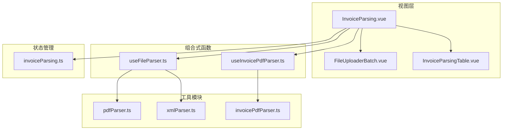
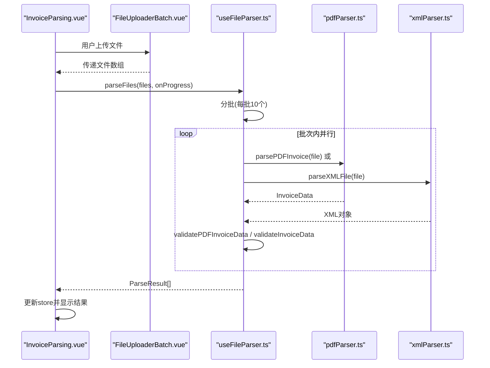
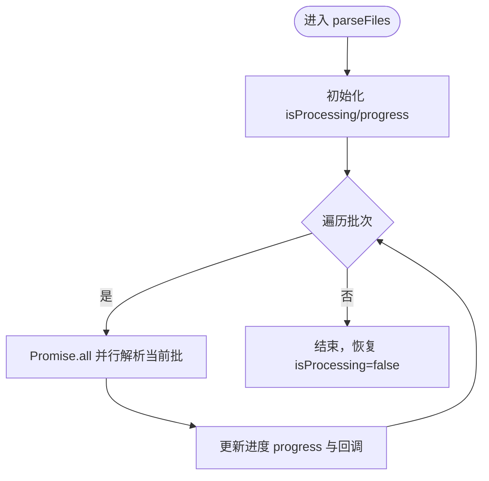
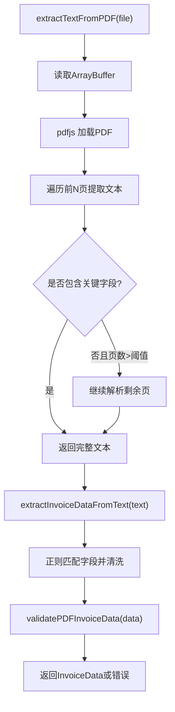
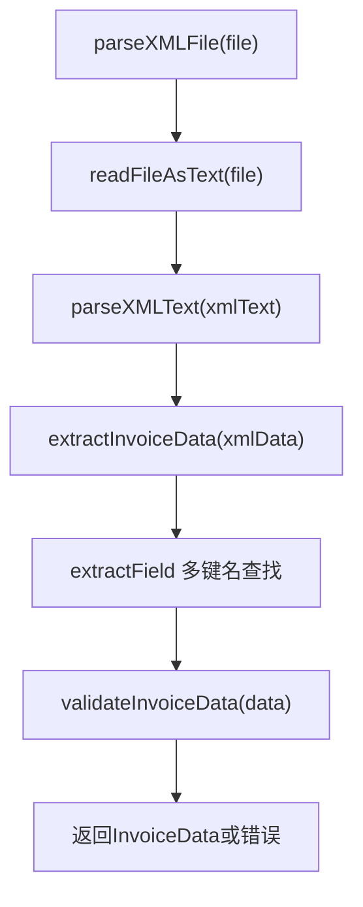
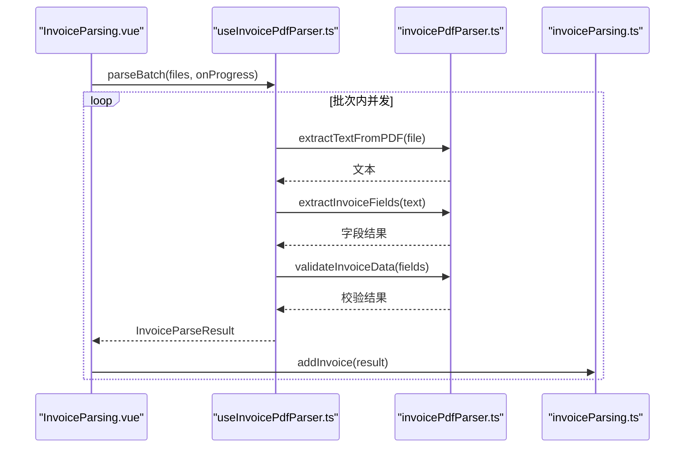
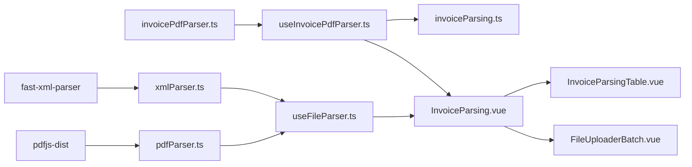

# 文件解析

<cite>
**本文引用的文件**
- [useFileParser.ts](file://src/composables/useFileParser.ts)
- [pdfParser.ts](file://src/utils/pdfParser.ts)
- [xmlParser.ts](file://src/utils/xmlParser.ts)
- [invoicePdfParser.ts](file://src/utils/invoicePdfParser.ts)
- [useInvoicePdfParser.ts](file://src/composables/useInvoicePdfParser.ts)
- [invoiceParsing.ts](file://src/stores/invoiceParsing.ts)
- [InvoiceParsing.vue](file://src/views/InvoiceParsing.vue)
- [FileUploaderBatch.vue](file://src/components/FileUploaderBatch.vue)
- [InvoiceParsingTable.vue](file://src/components/InvoiceParsingTable.vue)
- [package.json](file://package.json)
- [README.md](file://README.md)
</cite>

## 目录
1. [简介](#简介)
2. [项目结构](#项目结构)
3. [核心组件](#核心组件)
4. [架构总览](#架构总览)
5. [详细组件分析](#详细组件分析)
6. [依赖关系分析](#依赖关系分析)
7. [性能考量](#性能考量)
8. [故障排查指南](#故障排查指南)
9. [结论](#结论)
10. [附录](#附录)

## 简介
本文件聚焦于“文件解析”功能，系统性阐述如何通过组合式函数 useFileParser 协调 pdfParser 与 xmlParser 实现 PDF 和 XML 发票文件的解析；详解 parseFile 与 parseFiles 的异步处理机制；说明 PDF 解析基于 pdfjs-dist 抽取文本的流程，以及 XML 解析使用 fast-xml-parser 的实现细节；提供错误处理与进度反馈的实践路径；并给出批量解析的性能优化策略与扩展新发票格式的建议。

## 项目结构
围绕“文件解析”的核心模块分布如下：
- 组合式函数：useFileParser（协调 PDF/XML 解析）、useInvoicePdfParser（PDF发票专用解析与进度）
- 工具模块：pdfParser（基础PDF解析）、xmlParser（XML解析与发票数据抽取）、invoicePdfParser（发票字段抽取与校验）
- 状态管理：invoiceParsing（发票解析结果状态）
- 视图与组件：InvoiceParsing.vue（页面）、FileUploaderBatch.vue（批量上传）、InvoiceParsingTable.vue（结果表格）

图表来源
- [InvoiceParsing.vue](file://src/views/InvoiceParsing.vue#L122-L232)
- [useFileParser.ts](file://src/composables/useFileParser.ts#L15-L108)
- [useInvoicePdfParser.ts](file://src/composables/useInvoicePdfParser.ts#L29-L173)
- [pdfParser.ts](file://src/utils/pdfParser.ts#L1-L243)
- [xmlParser.ts](file://src/utils/xmlParser.ts#L1-L141)
- [invoicePdfParser.ts](file://src/utils/invoicePdfParser.ts#L1-L349)
- [invoiceParsing.ts](file://src/stores/invoiceParsing.ts#L62-L241)

章节来源
- [InvoiceParsing.vue](file://src/views/InvoiceParsing.vue#L1-L328)
- [useFileParser.ts](file://src/composables/useFileParser.ts#L1-L109)
- [useInvoicePdfParser.ts](file://src/composables/useInvoicePdfParser.ts#L1-L173)
- [pdfParser.ts](file://src/utils/pdfParser.ts#L1-L243)
- [xmlParser.ts](file://src/utils/xmlParser.ts#L1-L141)
- [invoicePdfParser.ts](file://src/utils/invoicePdfParser.ts#L1-L349)
- [invoiceParsing.ts](file://src/stores/invoiceParsing.ts#L1-L241)

## 核心组件
- useFileParser：统一协调 PDF/XML 解析，提供 parseFile 与 parseFiles，内置进度与错误处理。
- pdfParser：基于 pdfjs-dist 的 PDF 文本抽取与发票字段提取。
- xmlParser：基于 fast-xml-parser 的 XML 解析与发票字段抽取。
- invoicePdfParser：发票专用字段抽取与严格校验，配合 useInvoicePdfParser 提供批量解析与进度反馈。
- invoiceParsing Store：维护解析结果列表、筛选、搜索、选中状态等。

章节来源
- [useFileParser.ts](file://src/composables/useFileParser.ts#L15-L108)
- [pdfParser.ts](file://src/utils/pdfParser.ts#L184-L242)
- [xmlParser.ts](file://src/utils/xmlParser.ts#L42-L141)
- [invoicePdfParser.ts](file://src/utils/invoicePdfParser.ts#L138-L334)
- [invoiceParsing.ts](file://src/stores/invoiceParsing.ts#L62-L241)

## 架构总览
useFileParser 作为门面，根据文件后缀选择解析器；parseFiles 采用分批 + 并行策略提升吞吐；pdfParser 与 xmlParser 各自封装了文件读取、解析与校验；最终结果由 invoiceParsing Store 管理并在页面展示。

图表来源
- [InvoiceParsing.vue](file://src/views/InvoiceParsing.vue#L188-L232)
- [useFileParser.ts](file://src/composables/useFileParser.ts#L71-L100)
- [pdfParser.ts](file://src/utils/pdfParser.ts#L184-L192)
- [xmlParser.ts](file://src/utils/xmlParser.ts#L42-L62)

## 详细组件分析

### useFileParser 组合式函数
- 功能职责
  - parseFile：根据文件后缀选择解析器，捕获异常并返回统一的 ParseResult 结构。
  - parseFiles：分批（默认每批10个）+ 并行解析，实时更新进度与回调。
- 异步与错误处理
  - try/catch 包裹，统一返回 {success, data, errors, type}。
  - 对未知格式返回 type: 'unknown' 并包含错误信息。
- 进度反馈
  - 通过 progress 响应式变量与 onProgress 回调向外暴露进度百分比。

图表来源
- [useFileParser.ts](file://src/composables/useFileParser.ts#L71-L100)

章节来源
- [useFileParser.ts](file://src/composables/useFileParser.ts#L15-L108)

### PDF 解析（pdfParser）
- 文本抽取流程
  - 读取为 ArrayBuffer -> 加载 PDF -> 遍历前若干页提取文本 -> 若关键字段缺失则继续解析剩余页。
  - 输出完整文本供后续字段提取。
- 发票字段提取
  - 使用正则模式匹配发票类型、发票号码、金额、税额、价税合计、税率等。
  - 对金额进行数值化与范围校验，税率限定在合法集合。
- 校验与错误
  - validatePDFInvoiceData 校验必填字段与格式，返回布尔与错误列表。

图表来源
- [pdfParser.ts](file://src/utils/pdfParser.ts#L31-L65)
- [pdfParser.ts](file://src/utils/pdfParser.ts#L70-L179)
- [pdfParser.ts](file://src/utils/pdfParser.ts#L216-L242)

章节来源
- [pdfParser.ts](file://src/utils/pdfParser.ts#L1-L243)

### XML 解析（xmlParser）
- 流程
  - FileReader 读取为文本 -> fast-xml-parser 解析 -> 提取发票字段（兼容多种字段名）。
- 字段抽取
  - 通过 extractField 在多个候选键名中查找，返回首个非空值。
- 校验
  - validateInvoiceData 校验发票类型、购买方名称、价税合计等必填字段。

图表来源
- [xmlParser.ts](file://src/utils/xmlParser.ts#L42-L62)
- [xmlParser.ts](file://src/utils/xmlParser.ts#L67-L85)
- [xmlParser.ts](file://src/utils/xmlParser.ts#L121-L141)

章节来源
- [xmlParser.ts](file://src/utils/xmlParser.ts#L1-L141)

### 发票专用解析（invoicePdfParser + useInvoicePdfParser）
- invoicePdfParser
  - 更严格的字段抽取与校验，支持多税率提取、免税场景、金额与税率范围校验。
  - 采用“快速解析前N页 + 关键字段缺失再解析剩余页”的策略，兼顾性能与准确性。
- useInvoicePdfParser
  - 提供 parseInvoice 与 parseBatch，支持细粒度进度回调（百分比与当前文件名）。
  - 将解析结果转换为 InvoiceParseResult，包含状态与错误信息，便于 Store 管理。

图表来源
- [InvoiceParsing.vue](file://src/views/InvoiceParsing.vue#L208-L232)
- [useInvoicePdfParser.ts](file://src/composables/useInvoicePdfParser.ts#L96-L153)
- [invoicePdfParser.ts](file://src/utils/invoicePdfParser.ts#L138-L334)
- [invoiceParsing.ts](file://src/stores/invoiceParsing.ts#L122-L128)

章节来源
- [useInvoicePdfParser.ts](file://src/composables/useInvoicePdfParser.ts#L1-L173)
- [invoicePdfParser.ts](file://src/utils/invoicePdfParser.ts#L1-L349)
- [invoiceParsing.ts](file://src/stores/invoiceParsing.ts#L1-L241)

### 页面与组件集成
- InvoiceParsing.vue
  - 接收上传文件，进行格式与大小校验，调用 parseBatch 并接收进度回调。
  - 将结果批量加入 Store，展示成功/失败统计与导出功能。
- FileUploaderBatch.vue
  - 支持目录拖拽与批量上传，延迟触发以合并文件事件。
- InvoiceParsingTable.vue
  - 动态列展示多税率，支持筛选、搜索、分页与删除操作。

章节来源
- [InvoiceParsing.vue](file://src/views/InvoiceParsing.vue#L1-L328)
- [FileUploaderBatch.vue](file://src/components/FileUploaderBatch.vue#L1-L79)
- [InvoiceParsingTable.vue](file://src/components/InvoiceParsingTable.vue#L1-L157)

## 依赖关系分析
- 外部依赖
  - pdfjs-dist：PDF 文本抽取
  - fast-xml-parser：XML 解析
  - naive-ui、vue、pinia、vue-router 等：UI、状态与路由
- 内部依赖
  - useFileParser 依赖 pdfParser 与 xmlParser
  - useInvoicePdfParser 依赖 invoicePdfParser 与 invoiceParsing Store
  - InvoiceParsing.vue 依赖以上组合式函数与组件

图表来源
- [package.json](file://package.json#L12-L22)
- [pdfParser.ts](file://src/utils/pdfParser.ts#L4-L8)
- [xmlParser.ts](file://src/utils/xmlParser.ts#L4-L4)
- [useFileParser.ts](file://src/composables/useFileParser.ts#L5-L6)
- [useInvoicePdfParser.ts](file://src/composables/useInvoicePdfParser.ts#L6-L10)
- [invoicePdfParser.ts](file://src/utils/invoicePdfParser.ts#L5-L7)
- [invoiceParsing.ts](file://src/stores/invoiceParsing.ts#L4-L5)
- [InvoiceParsing.vue](file://src/views/InvoiceParsing.vue#L142-L144)

章节来源
- [package.json](file://package.json#L1-L33)

## 性能考量
- 分批与并行
  - 默认每批10个文件，批次间串行、批次内 Promise.all 并行，平衡内存占用与吞吐。
- 快速解析策略
  - invoicePdfParser 先解析前N页，若未命中关键字段再解析剩余页，减少不必要的全文扫描。
- I/O 与解析分离
  - FileReader 读取为 ArrayBuffer/Text，避免阻塞主线程；解析器内部异步处理。
- 进度反馈
  - 每个文件完成后更新进度，提供细粒度反馈，改善用户体验。

章节来源
- [useFileParser.ts](file://src/composables/useFileParser.ts#L76-L94)
- [useInvoicePdfParser.ts](file://src/composables/useInvoicePdfParser.ts#L13-L14)
- [invoicePdfParser.ts](file://src/utils/invoicePdfParser.ts#L104-L122)

## 故障排查指南
- 常见错误类型
  - 不支持的文件格式：返回 type 为 unknown，并包含错误信息。
  - PDF 文本提取失败：抛出错误并被上层捕获，返回失败结果。
  - XML 解析失败：XML 文本解析异常或字段缺失导致校验失败。
  - 文件读取失败：FileReader onerror 触发，统一报错。
- 建议排查步骤
  - 确认文件后缀与 MIME 类型是否符合预期。
  - 检查文件大小是否超过限制（PDF 最大10MB）。
  - 查看控制台日志（开发模式下会输出详细信息）。
  - 对于 PDF，确认发票版式是否包含关键字段（发票号码、价税合计等）。
  - 对于 XML，确认根节点与字段名是否与抽取逻辑一致。
- 错误处理与回退
  - 统一通过 ParseResult 的 errors 数组返回，便于 UI 展示与用户理解。
  - 对于 PDF，可尝试切换 invoicePdfParser 的抽取策略或正则模式。

章节来源
- [useFileParser.ts](file://src/composables/useFileParser.ts#L50-L65)
- [pdfParser.ts](file://src/utils/pdfParser.ts#L61-L64)
- [xmlParser.ts](file://src/utils/xmlParser.ts#L43-L48)
- [invoicePdfParser.ts](file://src/utils/invoicePdfParser.ts#L125-L128)

## 结论
该文件解析体系以 useFileParser 为核心门面，结合 pdfParser 与 xmlParser 实现对 PDF 与 XML 发票的统一解析；通过分批 + 并行策略与快速解析策略显著提升批量处理性能；借助统一的错误返回与进度回调，提供良好的用户体验。invoicePdfParser 与 useInvoicePdfParser 则进一步强化了发票专用场景下的字段抽取与校验能力，适合在复杂发票格式中使用。

## 附录
- 扩展建议
  - 新增发票格式：新增对应解析器（如 parseXMLFile、extractInvoiceData），并在 useFileParser 中根据后缀选择。
  - 自定义解析规则：在 invoicePdfParser 的正则模式与字段抽取逻辑中增加或调整匹配规则。
  - 多语言/多版式支持：在 invoicePdfParser 中扩展字段抽取与校验逻辑，覆盖不同地区或版式差异。
  - 并发与资源控制：可根据设备性能动态调整批次大小与并发度，避免内存峰值过高。
  - 导出增强：结合现有导出组合式函数，扩展更多格式或字段映射。

章节来源
- [README.md](file://README.md#L1-L41)
- [useFileParser.ts](file://src/composables/useFileParser.ts#L15-L108)
- [invoicePdfParser.ts](file://src/utils/invoicePdfParser.ts#L1-L349)