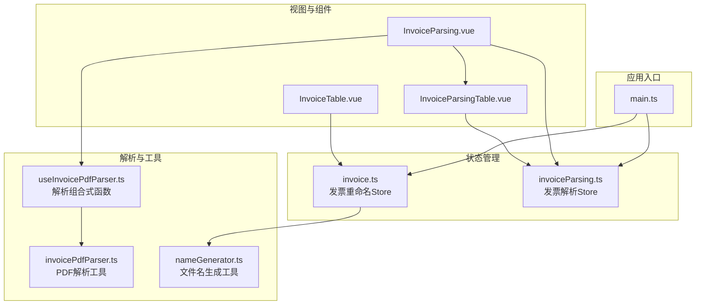
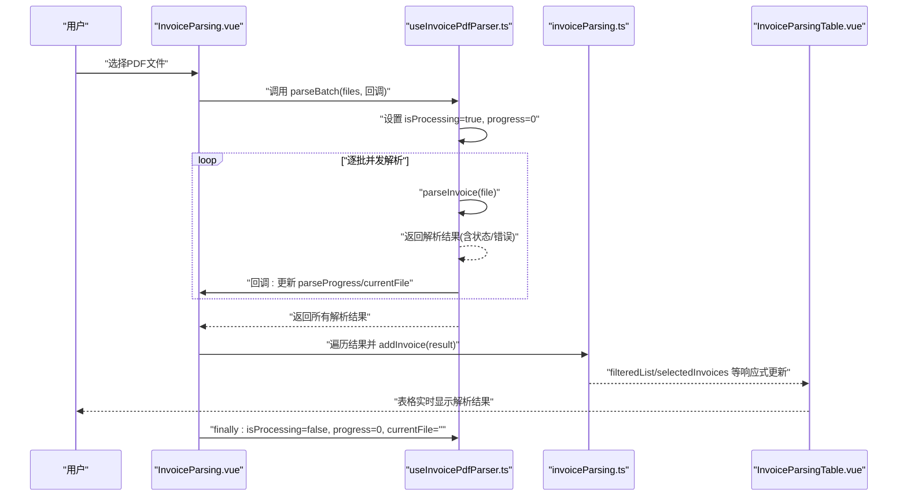
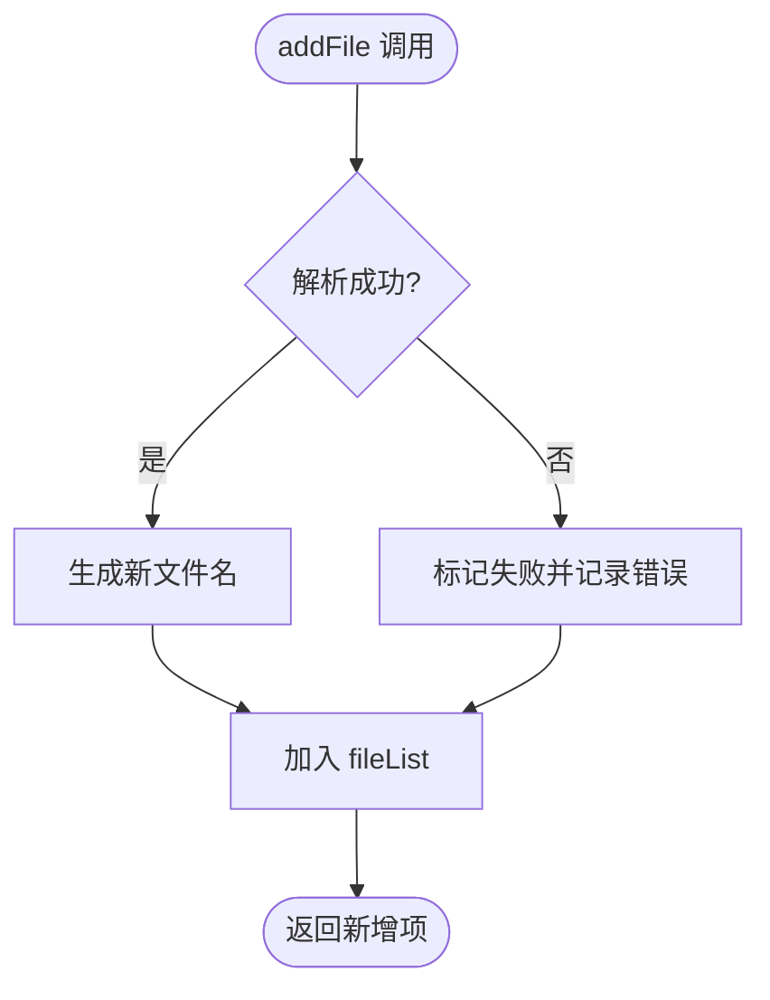
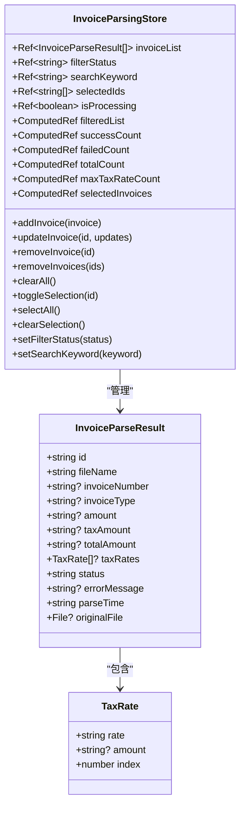
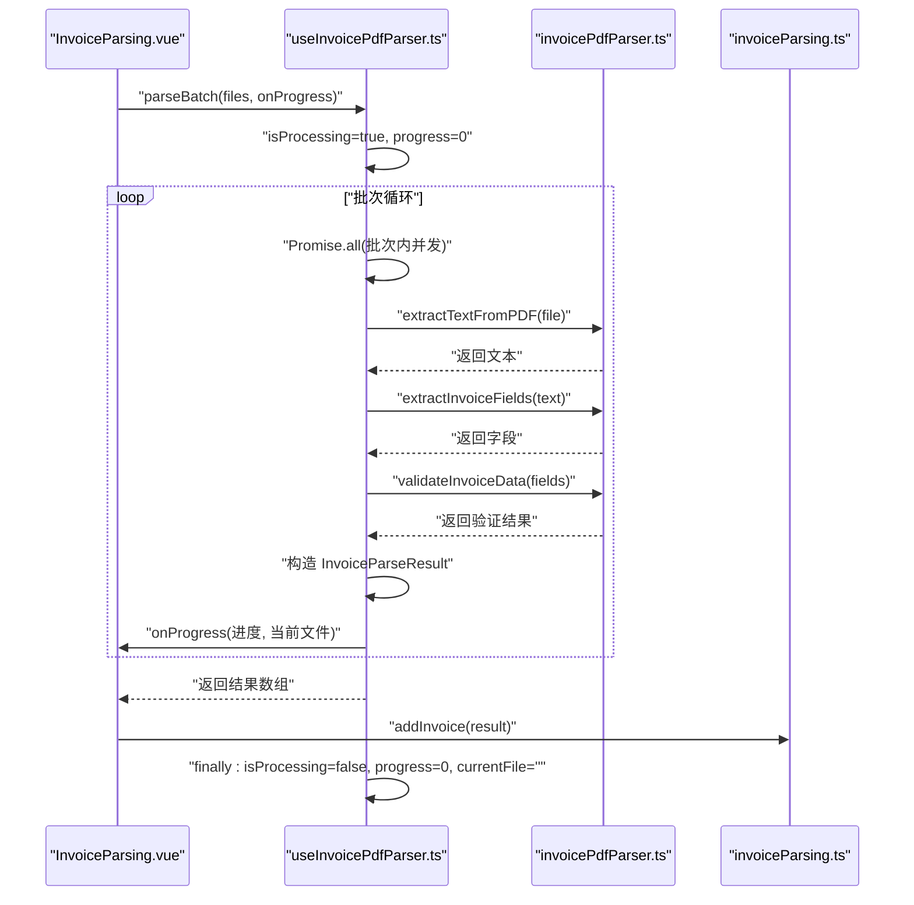
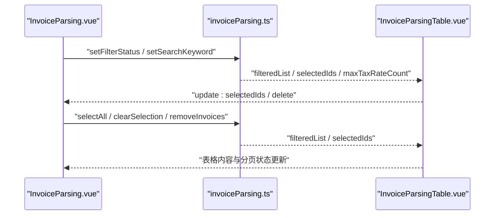
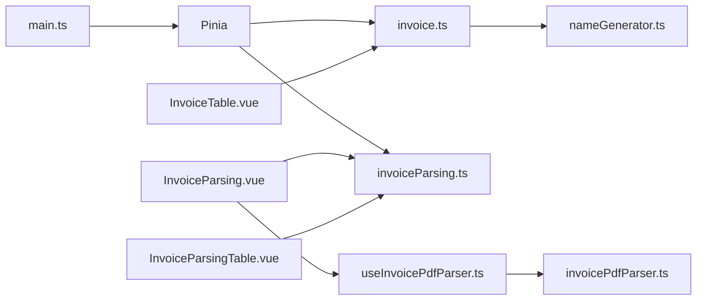

# 状态管理

<cite>
**本文引用的文件**
- [src/stores/invoice.ts](file://src/stores/invoice.ts)
- [src/stores/invoiceParsing.ts](file://src/stores/invoiceParsing.ts)
- [src/composables/useInvoicePdfParser.ts](file://src/composables/useInvoicePdfParser.ts)
- [src/components/InvoiceTable.vue](file://src/components/InvoiceTable.vue)
- [src/components/InvoiceParsingTable.vue](file://src/components/InvoiceParsingTable.vue)
- [src/views/InvoiceParsing.vue](file://src/views/InvoiceParsing.vue)
- [src/utils/invoicePdfParser.ts](file://src/utils/invoicePdfParser.ts)
- [src/utils/nameGenerator.ts](file://src/utils/nameGenerator.ts)
- [src/main.ts](file://src/main.ts)
</cite>

## 目录
1. [简介](#简介)
2. [项目结构](#项目结构)
3. [核心组件](#核心组件)
4. [架构总览](#架构总览)
5. [详细组件分析](#详细组件分析)
6. [依赖关系分析](#依赖关系分析)
7. [性能考量](#性能考量)
8. [故障排查指南](#故障排查指南)
9. [结论](#结论)
10. [附录](#附录)

## 简介
本文件围绕“发票重命名功能”的状态管理进行深入剖析，重点聚焦于 Pinia Store 的设计与实现，涵盖上传文件列表、解析状态、处理进度与结果数据等全局状态的组织方式。文档将详细说明 store 中的关键状态变量（如 fileList、isProcessing、progress）及其响应式更新机制，并通过组合式函数展示组件如何访问与修改 store 状态，以及状态变化如何驱动 UI 更新（例如 InvoiceTable 组件实时显示处理结果）。同时讨论状态持久化策略（如页面刷新后的状态恢复）与错误状态处理机制，并给出扩展 store 功能的建议（如新增状态字段或集成日志记录）。

## 项目结构
本项目采用基于功能模块的组织方式，状态管理集中在 stores 目录，解析逻辑封装在 composables 与 utils 中，视图层通过组件与 store 交互。核心文件包括：
- 状态管理：invoice.ts、invoiceParsing.ts
- 解析组合式函数：useInvoicePdfParser.ts
- 视图与表格组件：InvoiceParsing.vue、InvoiceTable.vue、InvoiceParsingTable.vue
- 工具函数：invoicePdfParser.ts、nameGenerator.ts
- 应用入口：main.ts

图表来源
- [src/main.ts](file://src/main.ts#L1-L12)
- [src/stores/invoice.ts](file://src/stores/invoice.ts#L1-L256)
- [src/stores/invoiceParsing.ts](file://src/stores/invoiceParsing.ts#L1-L241)
- [src/composables/useInvoicePdfParser.ts](file://src/composables/useInvoicePdfParser.ts#L1-L173)
- [src/utils/invoicePdfParser.ts](file://src/utils/invoicePdfParser.ts#L1-L349)
- [src/utils/nameGenerator.ts](file://src/utils/nameGenerator.ts#L1-L250)
- [src/views/InvoiceParsing.vue](file://src/views/InvoiceParsing.vue#L1-L328)
- [src/components/InvoiceTable.vue](file://src/components/InvoiceTable.vue#L1-L182)
- [src/components/InvoiceParsingTable.vue](file://src/components/InvoiceParsingTable.vue#L1-L157)

章节来源
- [src/main.ts](file://src/main.ts#L1-L12)
- [src/stores/invoice.ts](file://src/stores/invoice.ts#L1-L256)
- [src/stores/invoiceParsing.ts](file://src/stores/invoiceParsing.ts#L1-L241)

## 核心组件
本节聚焦于与发票重命名/解析相关的两个 Pinia Store：发票重命名 Store（invoice.ts）与发票解析 Store（invoiceParsing.ts），并说明它们如何协同工作。

- 发票重命名 Store（invoice.ts）
  - 管理“发票重命名”场景下的文件列表、筛选、搜索、选择与计算属性（成功/失败/总数统计）。
  - 关键状态：fileList、filterStatus、searchKeyword、selectedIds、isProcessing。
  - 关键方法：addFile、updateFile、removeFile、removeFiles、clearAll、toggleSelection、selectAll、clearSelection、setFilterStatus、setSearchKeyword。
  - 响应式更新：通过 ref 与 computed 实现，UI 组件订阅这些响应式状态，实现自动刷新。

- 发票解析 Store（invoiceParsing.ts）
  - 管理“发票解析”场景下的解析结果列表、筛选、搜索、选择与计算属性（成功/失败/总数统计、最大税率列数、选中集合）。
  - 关键状态：invoiceList、filterStatus、searchKeyword、selectedIds、isProcessing。
  - 关键方法：addInvoice、updateInvoice、removeInvoice、removeInvoices、clearAll、toggleSelection、selectAll、clearSelection、setFilterStatus、setSearchKeyword。
  - 响应式更新：同样通过 ref 与 computed 实现，UI 组件订阅这些响应式状态，实现自动刷新。

章节来源
- [src/stores/invoice.ts](file://src/stores/invoice.ts#L36-L61)
- [src/stores/invoice.ts](file://src/stores/invoice.ts#L63-L255)
- [src/stores/invoiceParsing.ts](file://src/stores/invoiceParsing.ts#L33-L60)
- [src/stores/invoiceParsing.ts](file://src/stores/invoiceParsing.ts#L62-L240)

## 架构总览
下图展示了从用户上传文件到解析完成并将结果写入 store 的完整流程，以及 UI 如何响应状态变化：

图表来源
- [src/views/InvoiceParsing.vue](file://src/views/InvoiceParsing.vue#L188-L232)
- [src/composables/useInvoicePdfParser.ts](file://src/composables/useInvoicePdfParser.ts#L96-L153)
- [src/stores/invoiceParsing.ts](file://src/stores/invoiceParsing.ts#L122-L139)
- [src/components/InvoiceParsingTable.vue](file://src/components/InvoiceParsingTable.vue#L1-L157)

## 详细组件分析

### 发票重命名 Store（invoice.ts）
该 Store 主要服务于“发票重命名”场景，负责维护文件列表、筛选、搜索、选择与统计，并根据解析结果生成新文件名。

- 关键状态与计算属性
  - fileList：文件项数组，包含原始文件、解析数据、新文件名、状态与错误信息。
  - filterStatus：筛选状态（all/success/failed/pending）。
  - searchKeyword：关键词搜索（原文件名、新文件名、购买方名称）。
  - selectedIds：选中项 ID 列表。
  - isProcessing：是否处于处理中。
  - filteredList：按状态与关键词过滤后的列表。
  - successCount/failedCount/totalCount：统计成功/失败/总数。

- 响应式更新机制
  - fileList、filterStatus、searchKeyword、selectedIds、isProcessing 均为 ref，任何变更都会触发依赖这些状态的计算属性与组件重新渲染。
  - updateFile 在更新购买方名称或金额时会重新生成新文件名并更新状态，确保 UI 即时反映最新文件名。

- 关键方法
  - addFile：根据解析结果生成新文件名，设置状态与错误信息，并推入列表。
  - updateFile：当购买方名称或金额变化时，重新生成文件名并更新状态。
  - removeFile/removeFiles/clearAll：维护列表与选中项同步。
  - toggleSelection/selectAll/clearSelection：维护选中项。
  - setFilterStatus/setSearchKeyword：更新筛选与搜索条件。

图表来源
- [src/stores/invoice.ts](file://src/stores/invoice.ts#L106-L151)
- [src/utils/nameGenerator.ts](file://src/utils/nameGenerator.ts#L143-L170)

章节来源
- [src/stores/invoice.ts](file://src/stores/invoice.ts#L36-L103)
- [src/stores/invoice.ts](file://src/stores/invoice.ts#L105-L176)
- [src/stores/invoice.ts](file://src/stores/invoice.ts#L178-L227)

### 发票解析 Store（invoiceParsing.ts）
该 Store 主要服务于“发票解析”场景，负责维护解析结果列表、动态列（多税率）、筛选、搜索、选择与统计。

- 关键状态与计算属性
  - invoiceList：解析结果数组，包含文件名、发票号、金额、税额、价税合计、多税率、状态与错误信息。
  - filterStatus/searchKeyword/selectedIds/isProcessing：同上。
  - filteredList：按状态与关键词过滤后的列表。
  - successCount/failedCount/totalCount/maxTaxRateCount/selectedInvoices：统计与选中集合。

- 响应式更新机制
  - 通过 ref 与 computed 实现，动态列（maxTaxRateCount）根据解析结果自适应列数，表格宽度随之调整。
  - UI 组件订阅 filteredList、selectedInvoices 等，实现自动刷新。

- 关键方法
  - addInvoice/updateInvoice/removeInvoice/removeInvoices/clearAll：维护列表与选中项同步。
  - toggleSelection/selectAll/clearSelection：维护选中项。
  - setFilterStatus/setSearchKeyword：更新筛选与搜索条件。

图表来源
- [src/stores/invoiceParsing.ts](file://src/stores/invoiceParsing.ts#L18-L31)
- [src/stores/invoiceParsing.ts](file://src/stores/invoiceParsing.ts#L33-L60)
- [src/stores/invoiceParsing.ts](file://src/stores/invoiceParsing.ts#L62-L240)

章节来源
- [src/stores/invoiceParsing.ts](file://src/stores/invoiceParsing.ts#L33-L119)
- [src/stores/invoiceParsing.ts](file://src/stores/invoiceParsing.ts#L121-L210)

### 解析组合式函数（useInvoicePdfParser.ts）
该组合式函数封装了 PDF 发票解析能力，提供单文件与批量解析，并提供进度回调与当前文件名反馈。

- 关键状态
  - isProcessing：是否正在解析。
  - progress：整体进度百分比。
  - currentFile：当前解析的文件名。

- 关键方法
  - parseInvoice：校验文件格式与大小，提取文本、提取字段、验证数据，构建解析结果。
  - parseBatch：分批并发解析，逐文件更新进度与当前文件名，最终汇总结果。

图表来源
- [src/composables/useInvoicePdfParser.ts](file://src/composables/useInvoicePdfParser.ts#L96-L153)
- [src/utils/invoicePdfParser.ts](file://src/utils/invoicePdfParser.ts#L97-L152)
- [src/views/InvoiceParsing.vue](file://src/views/InvoiceParsing.vue#L208-L232)

章节来源
- [src/composables/useInvoicePdfParser.ts](file://src/composables/useInvoicePdfParser.ts#L19-L24)
- [src/composables/useInvoicePdfParser.ts](file://src/composables/useInvoicePdfParser.ts#L37-L91)
- [src/composables/useInvoicePdfParser.ts](file://src/composables/useInvoicePdfParser.ts#L96-L153)

### UI 组件与状态联动
- InvoiceParsing.vue
  - 作为解析页面的容器，持有解析进度与当前文件名，调用 useInvoicePdfParser 完成批量解析，并将结果写入 invoiceParsing Store。
  - 通过 store 的 filteredList、selectedIds、maxTaxRateCount 等响应式状态驱动表格渲染与操作按钮状态。
  - 支持全选、清空选择、删除选中、导出等功能。

- InvoiceParsingTable.vue
  - 基于 Naive UI 的数据表格，动态生成多税率列，根据 maxTaxRateCount 自适应宽度。
  - 支持选择、删除、分页等交互，通过事件向上通知父组件。

- InvoiceTable.vue
  - 用于发票重命名场景的表格，支持编辑购买方名称、金额、新文件名，实时触发 updateFile 更新文件名与状态。

图表来源
- [src/views/InvoiceParsing.vue](file://src/views/InvoiceParsing.vue#L19-L85)
- [src/stores/invoiceParsing.ts](file://src/stores/invoiceParsing.ts#L71-L119)
- [src/components/InvoiceParsingTable.vue](file://src/components/InvoiceParsingTable.vue#L136-L151)

章节来源
- [src/views/InvoiceParsing.vue](file://src/views/InvoiceParsing.vue#L19-L85)
- [src/components/InvoiceParsingTable.vue](file://src/components/InvoiceParsingTable.vue#L82-L136)

## 依赖关系分析
- 应用入口注册 Pinia，使各 Store 可用。
- 解析页面依赖解析组合式函数与解析 Store；解析组合式函数依赖 PDF 解析工具与数据验证。
- 发票重命名 Store 依赖文件名生成工具；表格组件依赖 Store 的响应式状态。

图表来源
- [src/main.ts](file://src/main.ts#L1-L12)
- [src/stores/invoice.ts](file://src/stores/invoice.ts#L1-L256)
- [src/stores/invoiceParsing.ts](file://src/stores/invoiceParsing.ts#L1-L241)
- [src/composables/useInvoicePdfParser.ts](file://src/composables/useInvoicePdfParser.ts#L1-L173)
- [src/utils/invoicePdfParser.ts](file://src/utils/invoicePdfParser.ts#L1-L349)
- [src/utils/nameGenerator.ts](file://src/utils/nameGenerator.ts#L1-L250)
- [src/views/InvoiceParsing.vue](file://src/views/InvoiceParsing.vue#L1-L328)
- [src/components/InvoiceParsingTable.vue](file://src/components/InvoiceParsingTable.vue#L1-L157)
- [src/components/InvoiceTable.vue](file://src/components/InvoiceTable.vue#L1-L182)

章节来源
- [src/main.ts](file://src/main.ts#L1-L12)

## 性能考量
- 批量解析策略：解析组合式函数采用“批次大小 + 批次内并发”的策略，既保证吞吐又避免内存峰值过高。
- 进度反馈：逐文件更新进度，提供细粒度反馈，提升用户体验。
- 动态列适配：根据最大税率数量动态生成列，避免固定列导致的冗余渲染。
- 计算属性缓存：通过 computed 缓存过滤与统计结果，减少重复计算。

章节来源
- [src/composables/useInvoicePdfParser.ts](file://src/composables/useInvoicePdfParser.ts#L13-L14)
- [src/composables/useInvoicePdfParser.ts](file://src/composables/useInvoicePdfParser.ts#L117-L137)
- [src/components/InvoiceParsingTable.vue](file://src/components/InvoiceParsingTable.vue#L82-L98)

## 故障排查指南
- 解析失败
  - 现象：状态为 failed，errorMessage 显示失败原因。
  - 排查：检查文件格式与大小限制、PDF 文本提取是否成功、字段提取与验证逻辑。
  - 相关位置：解析组合式函数与解析工具的错误捕获与返回。

- 文件名生成失败
  - 现象：状态为 failed，errorMessage 显示错误信息。
  - 排查：检查命名规则是否存在、必填字段是否缺失、字段格式化器是否正常。
  - 相关位置：发票重命名 Store 的 addFile 与 updateFile。

- UI 不更新
  - 现象：修改购买方名称或金额后，新文件名未更新。
  - 排查：确认 updateFile 是否被调用、是否触发了响应式更新、表格是否监听了相应状态。
  - 相关位置：InvoiceTable.vue 的输入事件与 emit。

章节来源
- [src/composables/useInvoicePdfParser.ts](file://src/composables/useInvoicePdfParser.ts#L77-L90)
- [src/stores/invoice.ts](file://src/stores/invoice.ts#L124-L133)
- [src/components/InvoiceTable.vue](file://src/components/InvoiceTable.vue#L76-L98)

## 结论
本项目通过 Pinia 将“发票重命名”与“发票解析”两大场景的状态清晰分离，结合组合式函数与工具函数，实现了高内聚、低耦合的状态管理方案。响应式状态与计算属性确保 UI 实时更新，解析组合式函数提供了细粒度的进度反馈与错误处理。通过合理的依赖关系与性能策略，系统在复杂业务场景下仍保持良好的可维护性与用户体验。

## 附录
- 状态持久化策略建议
  - 页面刷新后恢复：可利用浏览器存储（localStorage/sessionStorage）保存关键状态（如 selectedIds、filterStatus、searchKeyword），在应用初始化时恢复。
  - Store 持久化：Pinia 提供插件机制（如持久化插件），可在开发阶段快速验证持久化效果。
  - 注意事项：避免持久化大型文件对象，建议仅持久化必要标识与查询条件。

- 错误状态处理机制
  - 解析失败：统一在解析组合式函数中捕获错误，构造失败结果并写入 store，UI 通过状态与错误信息展示。
  - 文件名生成失败：在 Store 中捕获异常并记录错误，保持状态一致性。

- 扩展 Store 功能建议
  - 新增状态字段：如“解析耗时”、“解析时间戳”、“文件大小”等，丰富统计维度。
  - 集成日志记录：在开发环境输出详细日志，在生产环境可收集错误日志并上报。
  - 导出与导入：支持将当前筛选条件与选中项导出为配置，便于后续复用。

章节来源
- [src/stores/invoice.ts](file://src/stores/invoice.ts#L106-L151)
- [src/stores/invoiceParsing.ts](file://src/stores/invoiceParsing.ts#L122-L139)
- [src/composables/useInvoicePdfParser.ts](file://src/composables/useInvoicePdfParser.ts#L77-L90)