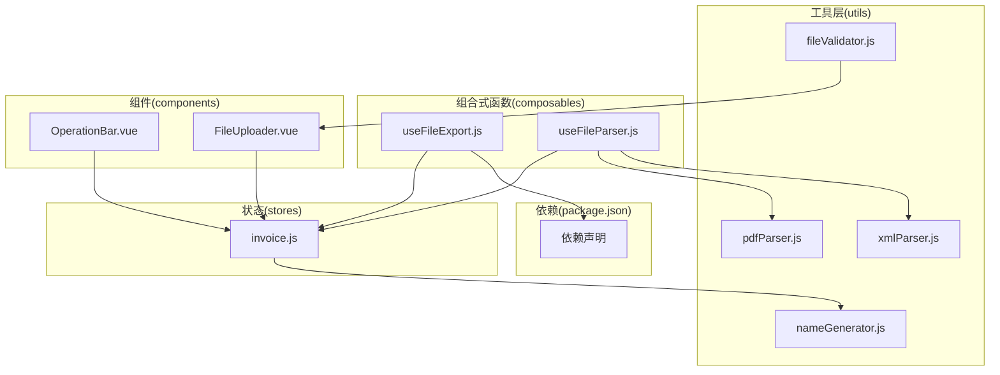
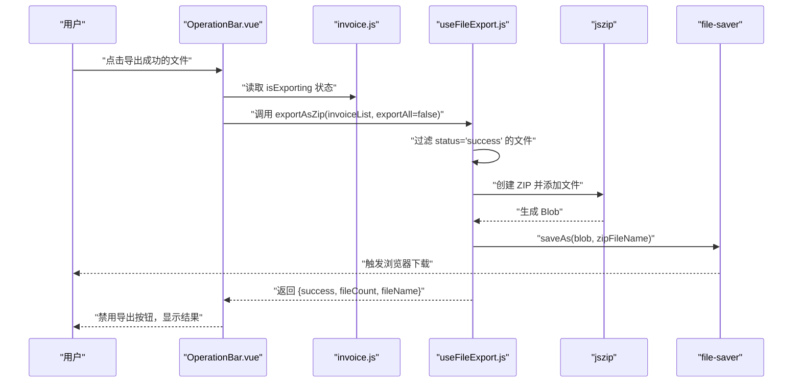
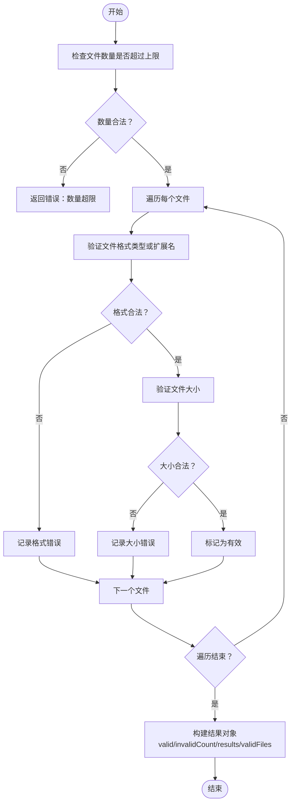
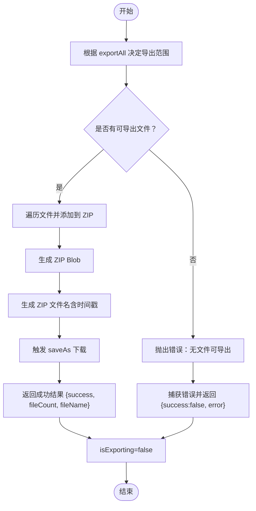
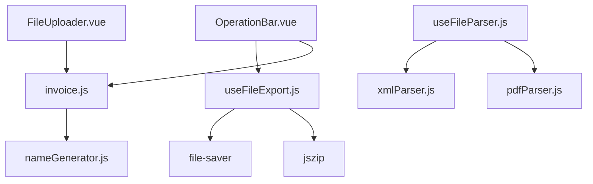

# 工具函数

<cite>
**本文引用的文件**
- [fileValidator.js](file://src/utils/fileValidator.js)
- [useFileExport.js](file://src/composables/useFileExport.js)
- [OperationBar.vue](file://src/components/OperationBar.vue)
- [FileUploader.vue](file://src/components/FileUploader.vue)
- [useFileParser.js](file://src/composables/useFileParser.js)
- [xmlParser.js](file://src/utils/xmlParser.js)
- [pdfParser.js](file://src/utils/pdfParser.js)
- [invoice.js](file://src/stores/invoice.js)
- [nameGenerator.js](file://src/utils/nameGenerator.js)
- [package.json](file://package.json)
</cite>

## 目录
1. [简介](#简介)
2. [项目结构](#项目结构)
3. [核心组件](#核心组件)
4. [架构总览](#架构总览)
5. [详细组件分析](#详细组件分析)
6. [依赖关系分析](#依赖关系分析)
7. [性能考量](#性能考量)
8. [故障排查指南](#故障排查指南)
9. [结论](#结论)
10. [附录](#附录)

## 简介
本章节系统性地梳理并文档化项目中的两类关键工具函数：
- 文件验证工具：用于校验上传文件的格式（PDF/XML）与大小限制，保证输入的有效性。
- 文件导出组合式函数：用于批量导出成功解析的发票文件，基于 jszip 创建 ZIP 压缩包并通过 file-saver 触发浏览器下载。

同时，说明这些工具如何被上层组件（如 OperationBar.vue、FileUploader.vue）调用，并封装了复杂的文件操作逻辑；最后给出扩展建议，帮助开发者添加新的验证规则或导出格式。

## 项目结构
围绕“工具函数”的相关文件分布如下：
- utils：文件验证、XML/PDF 解析、文件名生成等工具
- composables：useFileExport、useFileParser 组合式函数
- components：OperationBar.vue、FileUploader.vue 等 UI 层组件
- stores：invoice.js 状态管理，承载文件列表与导出状态
- package.json：声明外部依赖（jszip、file-saver、pdfjs-dist、fast-xml-parser）



图表来源
- [fileValidator.js](file://src/utils/fileValidator.js#L1-L90)
- [useFileExport.js](file://src/composables/useFileExport.js#L1-L80)
- [OperationBar.vue](file://src/components/OperationBar.vue#L1-L119)
- [FileUploader.vue](file://src/components/FileUploader.vue#L1-L50)
- [useFileParser.js](file://src/composables/useFileParser.js#L1-L102)
- [xmlParser.js](file://src/utils/xmlParser.js#L1-L118)
- [pdfParser.js](file://src/utils/pdfParser.js#L1-L227)
- [invoice.js](file://src/stores/invoice.js#L1-L204)
- [package.json](file://package.json#L1-L26)

章节来源
- [package.json](file://package.json#L1-L26)

## 核心组件
本节聚焦两类工具函数及其职责边界：
- fileValidator.js：提供文件格式与大小的验证能力，支持批量验证并返回详细错误信息。
- useFileExport.js：提供批量导出能力，内部使用 jszip 生成 ZIP，使用 file-saver 触发下载，返回导出结果与错误信息。

章节来源
- [fileValidator.js](file://src/utils/fileValidator.js#L1-L90)
- [useFileExport.js](file://src/composables/useFileExport.js#L1-L80)

## 架构总览
下图展示从用户交互到工具函数再到导出流程的整体调用链路，以及各模块之间的依赖关系。



图表来源
- [OperationBar.vue](file://src/components/OperationBar.vue#L1-L119)
- [invoice.js](file://src/stores/invoice.js#L1-L204)
- [useFileExport.js](file://src/composables/useFileExport.js#L1-L80)

## 详细组件分析

### 文件验证工具：fileValidator.js
该工具提供以下能力：
- 支持格式常量：PDF、XML（含 text/xml 与 application/xml）
- 大小限制常量：默认 10MB
- 文件数量上限：默认 100 个
- 单文件验证：检查类型与扩展名，返回布尔与错误数组
- 批量验证：对文件数组进行逐一验证，返回汇总结果（包含有效/无效计数）



图表来源
- [fileValidator.js](file://src/utils/fileValidator.js#L1-L90)

章节来源
- [fileValidator.js](file://src/utils/fileValidator.js#L1-L90)

### 文件导出组合式函数：useFileExport.js
该组合式函数提供批量导出能力，核心流程如下：
- 输入：发票列表（包含原始文件、新文件名、状态等）
- 过滤策略：默认仅导出 status='success' 的文件；也可传入 exportAll=true 导出全部
- ZIP 生成：使用 jszip 将文件内容写入 ZIP，生成 Blob
- 下载触发：使用 file-saver 的 saveAs 触发浏览器下载
- 返回值：包含导出成功标志、文件数量、文件名；异常时返回错误信息
- 状态：导出过程中 isExporting 为 true，结束后复位



图表来源
- [useFileExport.js](file://src/composables/useFileExport.js#L1-L80)

章节来源
- [useFileExport.js](file://src/composables/useFileExport.js#L1-L80)

### 上层组件调用关系与集成点
- OperationBar.vue
  - 作为操作栏，向父组件发出导出事件；按钮禁用条件依赖 successCount 与 isExporting。
  - 通过 props 接收 isExporting，用于控制导出按钮的 loading 状态。
- FileUploader.vue
  - 使用原生上传组件，设置 accept 为 ".pdf,.xml"，max 为 100，提示支持格式与大小限制。
  - 自定义请求回调 handleUpload，触发自定义 upload 事件，便于上层处理文件。
- invoice.js（状态管理）
  - 维护文件列表、筛选状态、搜索关键字、选中集合等。
  - 导出状态 isExporting 由 useFileExport 返回，供 OperationBar 控制 UI。
  - 导出时从状态中读取发票列表，传递给 useFileExport。

```mermaid
graph LR
OB["OperationBar.vue"] --> |emit('export')| Parent["父组件"]
FU["FileUploader.vue"] --> |emit('upload')| Parent
Parent --> Store["invoice.js"]
Parent --> UFE["useFileExport.js"]
Store --> UFE
UFE --> JSZ["jszip"]
UFE --> FS["file-saver"]
```

图表来源
- [OperationBar.vue](file://src/components/OperationBar.vue#L1-L119)
- [FileUploader.vue](file://src/components/FileUploader.vue#L1-L50)
- [invoice.js](file://src/stores/invoice.js#L1-L204)
- [useFileExport.js](file://src/composables/useFileExport.js#L1-L80)

章节来源
- [OperationBar.vue](file://src/components/OperationBar.vue#L1-L119)
- [FileUploader.vue](file://src/components/FileUploader.vue#L1-L50)
- [invoice.js](file://src/stores/invoice.js#L1-L204)

### 文件解析与命名（补充说明）
虽然本节重点是“工具函数”，但为完整理解导出流程，需了解解析与命名：
- useFileParser.js：按文件后缀判断 PDF 或 XML，分别调用对应解析器，返回解析结果与验证状态。
- xmlParser.js：使用 fast-xml-parser 解析 XML，提取发票字段并验证必填项。
- pdfParser.js：使用 pdfjs-dist 读取 PDF 文本，提取发票字段并验证必填项。
- nameGenerator.js：根据命名规则生成文件名，支持字段格式化与冲突处理。

章节来源
- [useFileParser.js](file://src/composables/useFileParser.js#L1-L102)
- [xmlParser.js](file://src/utils/xmlParser.js#L1-L118)
- [pdfParser.js](file://src/utils/pdfParser.js#L1-L227)
- [nameGenerator.js](file://src/utils/nameGenerator.js#L1-L225)

## 依赖关系分析
- useFileExport.js 显式依赖 jszip 与 file-saver，二者在 package.json 中声明。
- useFileParser.js 依赖 pdfParser.js 与 xmlParser.js，分别处理 PDF 与 XML。
- invoice.js 依赖 nameGenerator.js 生成文件名。
- FileUploader.vue 与 OperationBar.vue 通过事件与状态与 useFileExport.js、invoice.js 协作。



图表来源
- [useFileExport.js](file://src/composables/useFileExport.js#L1-L80)
- [useFileParser.js](file://src/composables/useFileParser.js#L1-L102)
- [pdfParser.js](file://src/utils/pdfParser.js#L1-L227)
- [xmlParser.js](file://src/utils/xmlParser.js#L1-L118)
- [invoice.js](file://src/stores/invoice.js#L1-L204)
- [nameGenerator.js](file://src/utils/nameGenerator.js#L1-L225)
- [FileUploader.vue](file://src/components/FileUploader.vue#L1-L50)
- [OperationBar.vue](file://src/components/OperationBar.vue#L1-L119)
- [package.json](file://package.json#L1-L26)

章节来源
- [package.json](file://package.json#L1-L26)

## 性能考量
- 批量导出时，ZIP 生成与下载均在浏览器端执行，受文件数量与体积影响。建议：
  - 控制单次导出文件数量，避免一次性生成过大的 ZIP。
  - 对大文件采用分批导出策略（可在上层组件增加分批逻辑）。
- 导出过程 isExporting 为 true，UI 应禁用导出按钮，避免重复触发。
- 解析阶段已采用分批并发处理（useFileParser.js），导出阶段应避免再次并发导致内存压力。

[本节为通用指导，无需特定文件引用]

## 故障排查指南
- 导出按钮不可用
  - 检查 OperationBar.vue 的禁用条件：当 successCount 为 0 或 isExporting 为 true 时禁用。
  - 确认 invoice.js 中 isExporting 是否被 useFileExport.js 正确复位。
- 导出失败
  - useFileExport.js 在异常时会返回 { success: false, error }，可在上层组件弹窗提示。
  - 若无文件可导出，会抛出错误，需检查过滤逻辑（exportAll 参数与 status 字段）。
- 文件验证失败
  - fileValidator.js 返回错误数组，包含格式或大小问题；可在上传组件中展示具体错误。
  - 注意 accept 与 max 的设置与验证逻辑保持一致，避免 UI 与逻辑不一致。

章节来源
- [OperationBar.vue](file://src/components/OperationBar.vue#L1-L119)
- [useFileExport.js](file://src/composables/useFileExport.js#L1-L80)
- [fileValidator.js](file://src/utils/fileValidator.js#L1-L90)
- [invoice.js](file://src/stores/invoice.js#L1-L204)

## 结论
- fileValidator.js 为上传环节提供了可靠的格式与大小校验，支持批量验证并返回详细错误，保障后续解析与导出的稳定性。
- useFileExport.js 将 ZIP 生成与下载封装为组合式函数，简化了上层组件的调用复杂度，同时提供导出状态与错误反馈。
- 通过 OperationBar.vue 与 FileUploader.vue 的事件与状态协作，工具函数被自然地嵌入到业务流程中，形成清晰的职责边界。

[本节为总结性内容，无需特定文件引用]

## 附录

### 使用方法与最佳实践
- 使用文件验证
  - 在上传前调用 validateFiles(files)，根据返回的 validFiles 与 invalidCount 决策下一步。
  - 将 validateFileFormat/validateFileSize 单独使用，可针对特定场景定制提示。
- 使用文件导出
  - 在导出按钮点击时调用 exportAsZip(invoiceList, exportAll=false)，等待返回结果并更新 UI。
  - 导出完成后，isExporting 自动复位，可恢复按钮状态。
- 扩展建议
  - 新增验证规则：在 fileValidator.js 中扩展 SUPPORTED_FORMATS、MAX_FILE_SIZE、MAX_FILE_COUNT，或新增更细粒度的校验函数。
  - 新增导出格式：在 useFileExport.js 中扩展导出逻辑（如支持 tar.gz），注意同步更新文件名与 MIME 类型。
  - 新增命名规则：在 nameGenerator.js 中新增规则模板与字段格式化器，并通过 setCurrentRule 切换。
  - 新增解析器：在 useFileParser.js 中新增分支处理新格式，配套解析与验证函数。

[本节为通用指导，无需特定文件引用]