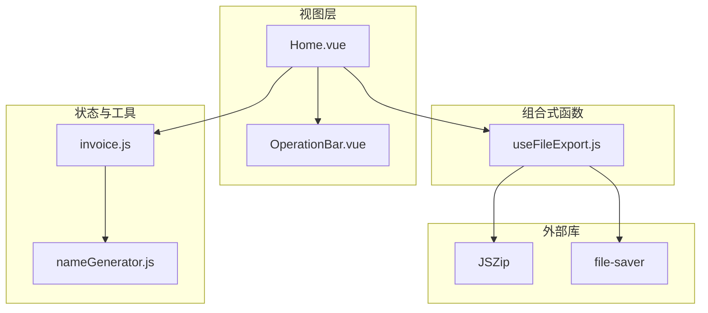
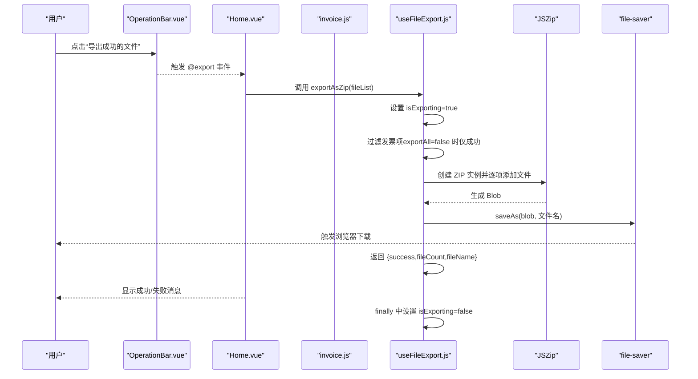
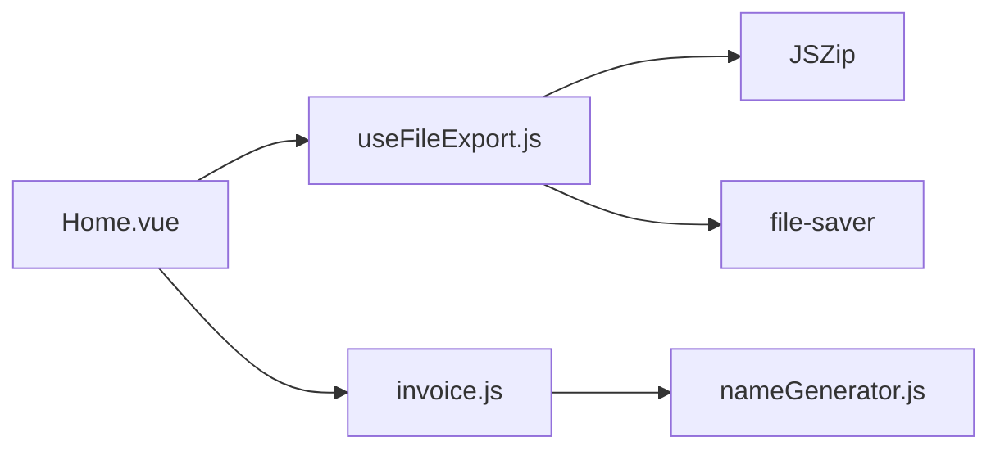

# 文件导出

<cite>
**本文引用的文件**
- [useFileExport.js](file://src/composables/useFileExport.js)
- [OperationBar.vue](file://src/components/OperationBar.vue)
- [Home.vue](file://src/views/Home.vue)
- [invoice.js](file://src/stores/invoice.js)
- [nameGenerator.js](file://src/utils/nameGenerator.js)
- [package.json](file://package.json)
</cite>

## 目录
1. [简介](#简介)
2. [项目结构](#项目结构)
3. [核心组件](#核心组件)
4. [架构总览](#架构总览)
5. [详细组件分析](#详细组件分析)
6. [依赖关系分析](#依赖关系分析)
7. [性能考虑](#性能考虑)
8. [故障排查指南](#故障排查指南)
9. [结论](#结论)
10. [附录](#附录)

## 简介
本文件导出功能围绕组合式函数 useFileExport.js 展开，目标是将发票文件批量打包为 ZIP 并触发浏览器下载。该组合式函数提供：
- isExporting 响应式状态，用于控制 UI 的加载态与禁用态
- exportAsZip 异步导出函数，支持“仅成功”和“全部”两种导出模式
- 内置文件名生成策略与时间戳命名规范
- 完整的错误处理与用户提示

在 OperationBar.vue 中，按钮的 loading 绑定 isExporting，确保导出过程中用户界面不会重复触发；在 Home.vue 中，导出按钮通过事件回调触发导出流程，并基于返回结果进行消息提示。

## 项目结构
与文件导出直接相关的模块分布如下：
- 组合式函数：src/composables/useFileExport.js
- 视图页面：src/views/Home.vue
- 操作栏组件：src/components/OperationBar.vue
- 状态管理：src/stores/invoice.js
- 工具函数：src/utils/nameGenerator.js
- 依赖声明：package.json

图表来源
- [Home.vue](file://src/views/Home.vue#L1-L120)
- [OperationBar.vue](file://src/components/OperationBar.vue#L1-L60)
- [useFileExport.js](file://src/composables/useFileExport.js#L1-L80)
- [invoice.js](file://src/stores/invoice.js#L1-L60)
- [nameGenerator.js](file://src/utils/nameGenerator.js#L1-L40)
- [package.json](file://package.json#L1-L26)

章节来源
- [Home.vue](file://src/views/Home.vue#L1-L120)
- [OperationBar.vue](file://src/components/OperationBar.vue#L1-L60)
- [useFileExport.js](file://src/composables/useFileExport.js#L1-L80)
- [invoice.js](file://src/stores/invoice.js#L1-L60)
- [nameGenerator.js](file://src/utils/nameGenerator.js#L1-L40)
- [package.json](file://package.json#L1-L26)

## 核心组件
- useFileExport.js
  - 提供 isExporting 响应式状态，用于 UI 加载态
  - 提供 exportAsZip(invoiceList, exportAll=false) 异步导出函数
  - 内置 formatDate(date) 生成带时间戳的文件名
- Home.vue
  - 注入 useFileExport，绑定 isExporting 到按钮 loading
  - 监听导出事件，调用 exportAsZip 并根据返回值提示
- OperationBar.vue
  - 导出按钮绑定 :loading="isExporting"，禁用条件为 successCount===0
- invoice.js
  - 维护发票列表、状态、筛选与计算属性，包含成功/失败计数
- nameGenerator.js
  - 生成新文件名的工具，被状态管理在 addFile/updateFile 中使用

章节来源
- [useFileExport.js](file://src/composables/useFileExport.js#L1-L80)
- [Home.vue](file://src/views/Home.vue#L1-L120)
- [OperationBar.vue](file://src/components/OperationBar.vue#L1-L60)
- [invoice.js](file://src/stores/invoice.js#L1-L60)
- [nameGenerator.js](file://src/utils/nameGenerator.js#L1-L40)

## 架构总览
下图展示从用户点击导出按钮到最终下载 ZIP 的端到端流程。

图表来源
- [OperationBar.vue](file://src/components/OperationBar.vue#L30-L52)
- [Home.vue](file://src/views/Home.vue#L200-L216)
- [useFileExport.js](file://src/composables/useFileExport.js#L14-L59)
- [invoice.js](file://src/stores/invoice.js#L1-L60)

## 详细组件分析

### useFileExport.js 组合式函数
- 设计要点
  - 使用 ref(isExporting) 控制 UI 加载态，避免重复提交
  - exportAsZip 接收发票列表与导出模式参数，内部按状态过滤
  - 使用 JSZip 生成 ZIP Blob，再由 file-saver 触发下载
  - 生成带时间戳的文件名，便于区分不同批次导出
  - finally 中统一复位 isExporting，保证 UI 状态一致

- 关键流程（exportAsZip）
  - 输入：发票列表、导出模式（默认仅成功）
  - 过滤：exportAll=false 时仅保留 status==='success' 的条目
  - 边界：若无文件可导出，抛出错误并返回失败结果
  - 命名：成功项使用 newFileName，失败项使用 originalFileName
  - 生成：zip.generateAsync({ type:'blob' }) 异步生成二进制
  - 下载：saveAs(blob, zipFileName) 触发浏览器下载
  - 返回：{ success, fileCount, fileName } 或 { success, error }

- 错误处理
  - 无文件可导出：抛错并返回 { success:false, error:'没有可导出的文件' }
  - 其他异常：捕获后返回 { success:false, error:message }
  - finally：isExporting=false，确保 UI 恢复

- 性能与内存
  - 采用异步生成 Blob，避免阻塞主线程
  - 大量文件时注意浏览器内存占用，建议分批或限制并发

章节来源
- [useFileExport.js](file://src/composables/useFileExport.js#L1-L80)

### OperationBar.vue 中的导出按钮
- 绑定
  - :loading="isExporting"：导出期间按钮处于加载态
  - :disabled="successCount===0"：无成功文件时不启用导出
  - @click="$emit('export')"：向父组件 Home.vue 触发导出事件

- 交互
  - 与 Home.vue 的 handleExport 协作，完成导出与提示

章节来源
- [OperationBar.vue](file://src/components/OperationBar.vue#L30-L52)

### Home.vue 中的导出调用
- 注入 useFileExport，解构出 isExporting 与 exportAsZip
- 监听导出事件：调用 exportAsZip(store.fileList)，根据返回值显示成功/失败消息
- 异常兜底：catch(error) 后统一提示

章节来源
- [Home.vue](file://src/views/Home.vue#L80-L120)
- [Home.vue](file://src/views/Home.vue#L200-L216)

### 状态与数据模型（invoice.js）
- 维护 fileList、filterStatus、searchKeyword、selectedIds、isProcessing
- 计算属性：successCount、failedCount、totalCount
- addFile/updateFile 会生成/更新 newFileName，并维护 status 与 errorMessage
- 为导出提供数据源（fileList）与计数（successCount）

章节来源
- [invoice.js](file://src/stores/invoice.js#L1-L60)
- [invoice.js](file://src/stores/invoice.js#L90-L140)

### 文件名生成（nameGenerator.js）
- generateFileName 根据规则生成新文件名，包含字段格式化与冲突处理
- 在状态管理中被调用，用于更新发票项的新文件名
- 导出时优先使用成功项的新文件名，失败项回退到原始文件名

章节来源
- [nameGenerator.js](file://src/utils/nameGenerator.js#L118-L145)
- [invoice.js](file://src/stores/invoice.js#L90-L140)

## 依赖关系分析
- useFileExport.js 依赖
  - JSZip：用于创建 ZIP 包并生成 Blob
  - file-saver：用于触发浏览器下载
- Home.vue 依赖
  - useFileExport：导出能力
  - useInvoiceStore：数据源与计数
- OperationBar.vue 依赖
  - 通过 props 与 emits 与 Home.vue 通信
- invoice.js 依赖
  - nameGenerator.js：生成新文件名
- package.json
  - 声明 JSZip 与 file-saver 的版本

图表来源
- [Home.vue](file://src/views/Home.vue#L80-L120)
- [useFileExport.js](file://src/composables/useFileExport.js#L1-L80)
- [invoice.js](file://src/stores/invoice.js#L1-L60)
- [nameGenerator.js](file://src/utils/nameGenerator.js#L1-L40)
- [package.json](file://package.json#L1-L26)

章节来源
- [package.json](file://package.json#L1-L26)

## 性能考虑
- 大文件与大量文件
  - JSZip 生成 Blob 为异步，但仍可能占用较多内存。建议在导出前限制数量或分批处理
  - 对于超大文件，可考虑服务端流式压缩或分片上传/下载
- 浏览器兼容性
  - 确保浏览器支持 Blob URL 与 download 属性
- 用户体验
  - 导出期间禁用按钮与设置 loading，避免重复触发
  - 提供进度提示或分批导出选项（可在 UI 层增加分批策略）

[本节为通用建议，无需特定文件来源]

## 故障排查指南
- 无文件可导出
  - 现象：导出失败，返回错误信息
  - 原因：exportAll=false 且成功计数为 0
  - 处理：检查筛选状态与成功计数，或切换导出模式为“全部”
- 导出异常
  - 现象：抛出异常并返回 { success:false, error }
  - 处理：查看具体错误消息，确认发票项数据完整性
- 下载未触发
  - 现象：UI 已完成但未弹出下载
  - 处理：检查浏览器下载权限与拦截设置；确认 file-saver 版本与兼容性

章节来源
- [useFileExport.js](file://src/composables/useFileExport.js#L24-L27)
- [useFileExport.js](file://src/composables/useFileExport.js#L51-L56)
- [Home.vue](file://src/views/Home.vue#L200-L216)

## 结论
useFileExport.js 以简洁的 API 提供了可靠的文件导出能力：通过 isExporting 状态保障 UI 一致性，通过 exportAsZip 支持灵活的导出模式，借助 JSZip 与 file-saver 实现高效的打包与下载。结合 Home.vue 与 OperationBar.vue 的协作，形成完整的导出工作流。对于大规模场景，建议引入分批策略与内存监控，以提升稳定性与用户体验。

[本节为总结，无需特定文件来源]

## 附录

### API 定义与行为
- useFileExport()
  - 返回：{ isExporting, exportAsZip }
- exportAsZip(invoiceList, exportAll=false)
  - 行为：按状态过滤发票项，生成 ZIP Blob，保存为带时间戳的文件名并触发下载
  - 返回：{ success, fileCount, fileName } 或 { success, error }
- isExporting
  - 行为：导出开始设为 true，结束时设为 false
  - UI：绑定至按钮 loading 与禁用态

章节来源
- [useFileExport.js](file://src/composables/useFileExport.js#L1-L80)
- [OperationBar.vue](file://src/components/OperationBar.vue#L30-L52)
- [Home.vue](file://src/views/Home.vue#L200-L216)

### 调用示例（代码片段路径）
- OperationBar.vue 导出按钮
  - [导出按钮模板](file://src/components/OperationBar.vue#L30-L52)
- Home.vue 导出事件处理
  - [事件监听与调用](file://src/views/Home.vue#L10-L25)
  - [handleExport 实现](file://src/views/Home.vue#L200-L216)

### 自定义与扩展建议
- 修改压缩算法
  - 可在 JSZip 生成时传入压缩参数（如 compression、compressionOptions），需评估浏览器兼容性
- 添加密码保护
  - JSZip 支持加密，但需注意浏览器安全策略与兼容性；建议服务端实现更安全的加密方案
- 支持其他归档格式
  - 当前实现固定为 ZIP；如需其他格式，可引入多格式适配器并在 UI 中提供选择
- 增强错误提示
  - 在 UI 层增加“导出失败详情”弹窗，展示每个失败项的原因
- 分批导出
  - 在 Home.vue 中对 fileList 进行分批，逐批调用 exportAsZip 并汇总结果

[本节为扩展建议，无需特定文件来源]