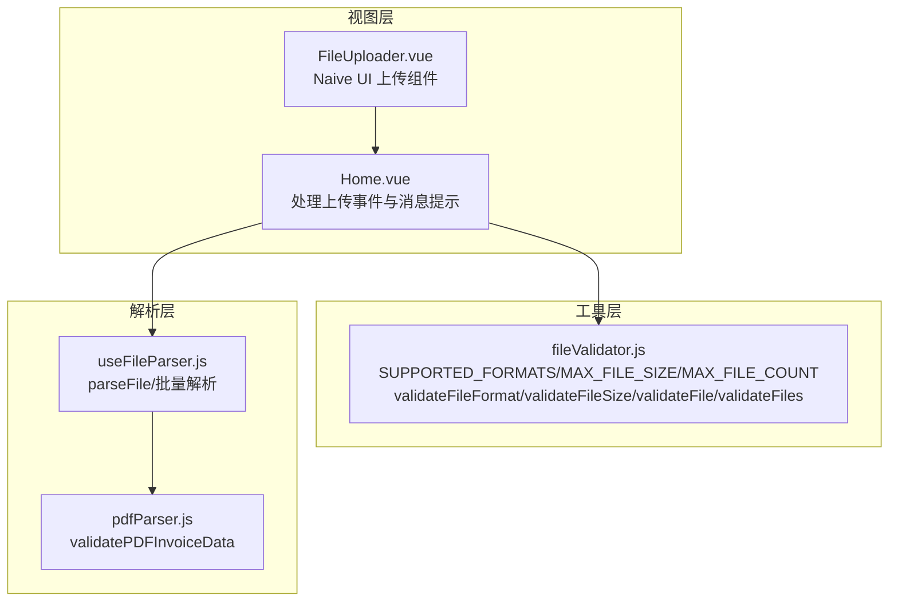
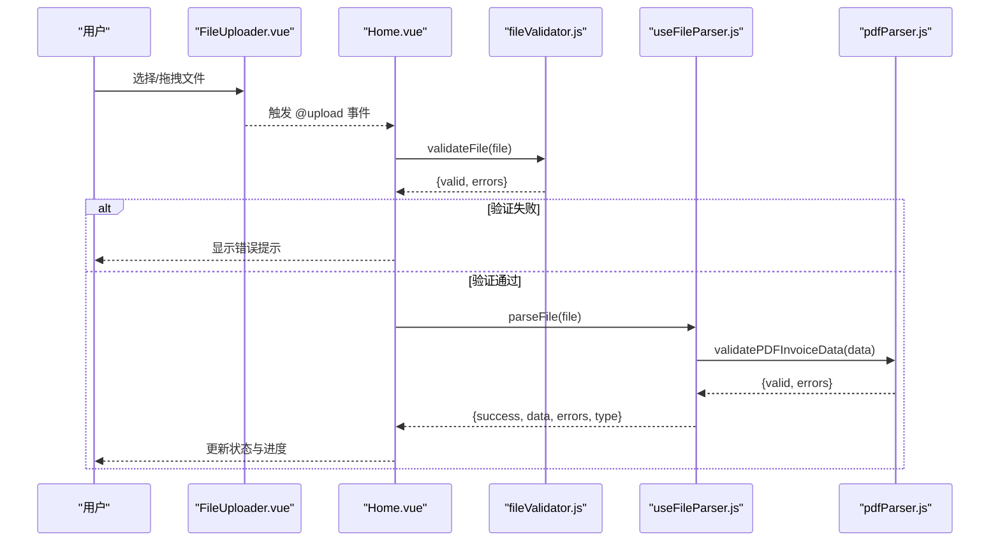
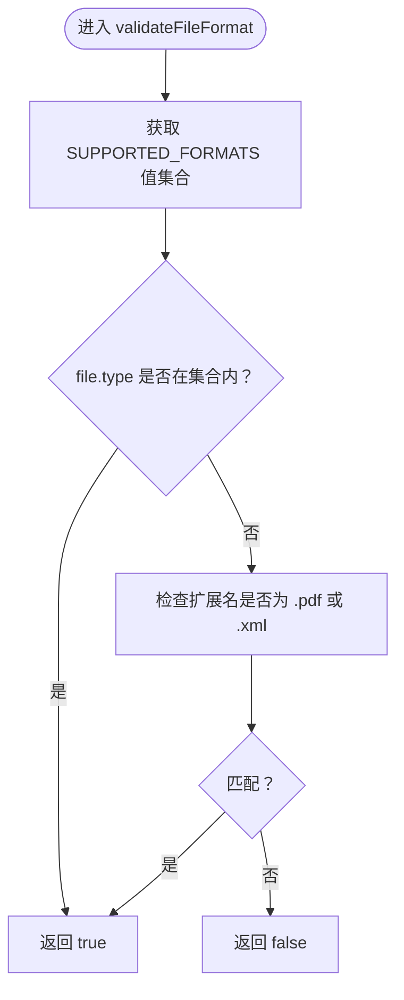
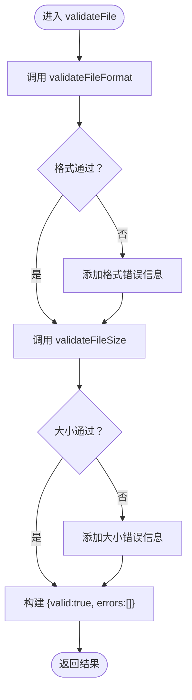
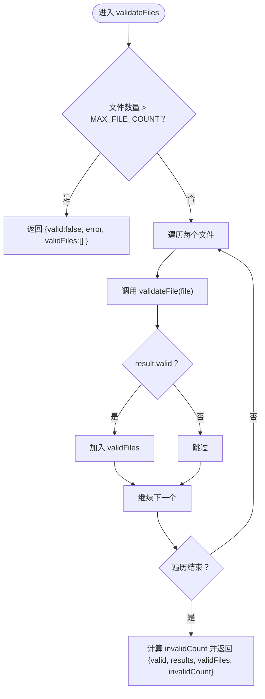
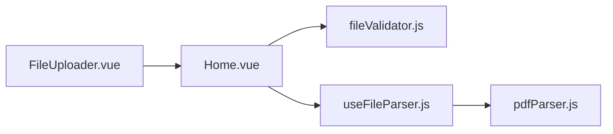

# 文件验证

<cite>
**本文引用的文件**
- [fileValidator.js](file://src/utils/fileValidator.js)
- [FileUploader.vue](file://src/components/FileUploader.vue)
- [Home.vue](file://src/views/Home.vue)
- [useFileParser.js](file://src/composables/useFileParser.js)
- [pdfParser.js](file://src/utils/pdfParser.js)
</cite>

## 目录
1. [简介](#简介)
2. [项目结构](#项目结构)
3. [核心组件](#核心组件)
4. [架构总览](#架构总览)
5. [详细组件分析](#详细组件分析)
6. [依赖关系分析](#依赖关系分析)
7. [性能考量](#性能考量)
8. [故障排查指南](#故障排查指南)
9. [结论](#结论)
10. [附录](#附录)

## 简介
本文件聚焦于 src/utils/fileValidator.js 中的文件验证机制，系统性说明以下内容：
- 常量 SUPPORTED_FORMATS、MAX_FILE_SIZE、MAX_FILE_COUNT 如何控制支持的文件类型（PDF/XML）与上传限制；
- validateFileFormat 如何通过 MIME 类型与文件扩展名双重校验确保格式合规；
- validateFileSize 如何执行 10MB 大小限制检查；
- validateFile 如何整合两项验证并返回结构化错误信息；
- validateFiles 批量验证的实现逻辑，包括数量上限控制、逐个验证、有效文件筛选与结果汇总；
- 在 FileUploader.vue 中的调用示例与验证失败时的用户反馈处理；
- 扩展支持新格式或调整限制参数的方法；
- 浏览器 MIME 类型识别差异等常见问题的应对策略。

## 项目结构
fileValidator.js 位于 src/utils 目录下，作为通用工具模块被视图层 Home.vue 引入并在上传流程中使用；FileUploader.vue 提供上传界面并与验证模块协同工作。



图表来源
- [Home.vue](file://src/views/Home.vue#L82-L115)
- [fileValidator.js](file://src/utils/fileValidator.js#L1-L89)
- [useFileParser.js](file://src/composables/useFileParser.js#L1-L63)
- [pdfParser.js](file://src/utils/pdfParser.js#L179-L226)

章节来源
- [fileValidator.js](file://src/utils/fileValidator.js#L1-L89)
- [FileUploader.vue](file://src/components/FileUploader.vue#L1-L49)
- [Home.vue](file://src/views/Home.vue#L82-L115)

## 核心组件
- 常量定义
  - SUPPORTED_FORMATS：定义受支持的 MIME 类型集合，包含 PDF 与 XML（含两种常见类型）。
  - MAX_FILE_SIZE：单文件大小上限（字节），默认 10MB。
  - MAX_FILE_COUNT：单次上传文件数量上限，默认 100 个。
- 校验函数
  - validateFileFormat：结合 MIME 类型与扩展名判断文件是否为 PDF 或 XML。
  - validateFileSize：比较文件大小与上限。
  - validateFile：整合格式与大小校验，返回结构化结果对象。
  - validateFiles：批量校验，包含数量上限控制、逐个验证、有效文件收集与汇总统计。

章节来源
- [fileValidator.js](file://src/utils/fileValidator.js#L5-L16)
- [fileValidator.js](file://src/utils/fileValidator.js#L21-L28)
- [fileValidator.js](file://src/utils/fileValidator.js#L33-L35)
- [fileValidator.js](file://src/utils/fileValidator.js#L40-L55)
- [fileValidator.js](file://src/utils/fileValidator.js#L60-L89)

## 架构总览
fileValidator.js 作为纯前端验证工具，独立于后端接口，负责在用户上传阶段进行基础约束校验。Home.vue 在收到上传事件后，先调用 validateFile 对单个文件进行验证，再进入解析与存储流程；FileUploader.vue 通过 Naive UI 组件提供上传入口，并设置 accept 与 max 属性以配合前端校验。



图表来源
- [FileUploader.vue](file://src/components/FileUploader.vue#L1-L49)
- [Home.vue](file://src/views/Home.vue#L82-L115)
- [fileValidator.js](file://src/utils/fileValidator.js#L40-L55)
- [useFileParser.js](file://src/composables/useFileParser.js#L1-L63)
- [pdfParser.js](file://src/utils/pdfParser.js#L179-L226)

## 详细组件分析

### 常量与全局配置
- SUPPORTED_FORMATS：包含 PDF 与 XML 的 MIME 类型键值，用于快速匹配。
- MAX_FILE_SIZE：以字节为单位的大小上限，便于与 file.size 直接比较。
- MAX_FILE_COUNT：单次上传文件数量上限，避免一次性提交过多文件导致性能与内存压力。

章节来源
- [fileValidator.js](file://src/utils/fileValidator.js#L5-L16)

### validateFileFormat：格式双重校验
- 逻辑要点
  - 使用 SUPPORTED_FORMATS 的值构建合法类型集合；
  - 判断 file.type 是否属于合法集合；
  - 若不属于，则进一步检查文件扩展名是否为 .pdf 或 .xml（大小写不敏感）；
  - 只要满足其一即视为格式合法。
- 设计意图
  - 同时考虑浏览器报告的 MIME 类型与文件扩展名，提高兼容性与鲁棒性；
  - 通过显式白名单控制支持的格式范围，避免误判。



图表来源
- [fileValidator.js](file://src/utils/fileValidator.js#L21-L28)

章节来源
- [fileValidator.js](file://src/utils/fileValidator.js#L21-L28)

### validateFileSize：大小限制检查
- 逻辑要点
  - 将 file.size 与 MAX_FILE_SIZE 比较，小于等于则通过。
- 性能与复杂度
  - O(1)，无额外分配与循环。

章节来源
- [fileValidator.js](file://src/utils/fileValidator.js#L33-L35)

### validateFile：整合两项验证并返回结构化结果
- 逻辑要点
  - 先调用 validateFileFormat，若失败则追加一条错误信息；
  - 再调用 validateFileSize，若失败则追加一条错误信息；
  - 返回对象包含 valid（布尔）与 errors（数组）两个字段。
- 错误信息设计
  - 面向用户的提示语明确指出“仅支持 PDF 和 XML”“大小超过限制（最大 10MB）”。



图表来源
- [fileValidator.js](file://src/utils/fileValidator.js#L40-L55)

章节来源
- [fileValidator.js](file://src/utils/fileValidator.js#L40-L55)

### validateFiles：批量验证
- 逻辑要点
  - 首先检查文件数量是否超过 MAX_FILE_COUNT，超过则直接返回错误与空的有效文件列表；
  - 遍历每个文件，调用 validateFile 并记录结果；
  - 收集所有通过验证的文件到 validFiles；
  - 返回对象包含：
    - valid：至少存在一个有效文件时为 true；
    - results：每个文件的验证结果；
    - validFiles：有效文件集合；
    - invalidCount：无效文件数量（总数减去有效数）。
- 复杂度
  - 时间复杂度 O(n)，n 为文件数量；
  - 空间复杂度 O(n)，用于保存结果与有效文件列表。



图表来源
- [fileValidator.js](file://src/utils/fileValidator.js#L60-L89)

章节来源
- [fileValidator.js](file://src/utils/fileValidator.js#L60-L89)

### 在 FileUploader.vue 中的调用示例与用户反馈
- 组件行为
  - 使用 Naive UI 的上传组件，设置 accept 为 ".pdf,.xml"，max 为 100，以在 UI 层限制可选文件类型与数量；
  - 通过自定义请求回调触发 upload 事件，将文件传递给上层处理。
- 上层处理（Home.vue）
  - 在 @upload 回调中调用 validateFile 对单个文件进行验证；
  - 若验证失败，使用消息提示组件显示错误信息；
  - 若验证通过，将文件加入处理队列并启动解析流程。

```mermaid
sequenceDiagram
participant U as "用户"
participant F as "FileUploader.vue"
participant H as "Home.vue"
participant V as "fileValidator.js"
U->>F : 选择/拖拽文件
F-->>H : emit('upload', file)
H->>V : validateFile(file)
V-->>H : {valid, errors}
alt 验证失败
H-->>U : message.error(errors.join('; '))
else 验证通过
H-->>U : 继续处理队列与解析
end
```

图表来源
- [FileUploader.vue](file://src/components/FileUploader.vue#L1-L49)
- [Home.vue](file://src/views/Home.vue#L82-L115)
- [fileValidator.js](file://src/utils/fileValidator.js#L40-L55)

章节来源
- [FileUploader.vue](file://src/components/FileUploader.vue#L1-L49)
- [Home.vue](file://src/views/Home.vue#L82-L115)

## 依赖关系分析
- fileValidator.js 与其他模块的耦合
  - 与 Home.vue：Home.vue 直接导入并调用 validateFile 进行前端校验；
  - 与 useFileParser.js：Home.vue 在验证通过后调用 parseFile 进行后续解析；
  - 与 pdfParser.js：解析 PDF 时调用 validatePDFInvoiceData 进一步验证发票数据有效性。
- 外部依赖
  - Naive UI 的上传组件用于 UI 交互与基础限制（accept、max）。



图表来源
- [Home.vue](file://src/views/Home.vue#L82-L115)
- [fileValidator.js](file://src/utils/fileValidator.js#L40-L55)
- [useFileParser.js](file://src/composables/useFileParser.js#L1-L63)
- [pdfParser.js](file://src/utils/pdfParser.js#L179-L226)
- [FileUploader.vue](file://src/components/FileUploader.vue#L1-L49)

章节来源
- [Home.vue](file://src/views/Home.vue#L82-L115)
- [useFileParser.js](file://src/composables/useFileParser.js#L1-L63)
- [pdfParser.js](file://src/utils/pdfParser.js#L179-L226)
- [FileUploader.vue](file://src/components/FileUploader.vue#L1-L49)

## 性能考量
- validateFileFormat：O(1) 时间复杂度，仅进行集合包含判断与字符串后缀匹配；
- validateFileSize：O(1) 时间复杂度，单次数值比较；
- validateFile：O(1) 时间复杂度，两次独立校验；
- validateFiles：O(n) 时间复杂度，n 为文件数量，空间开销 O(n)；
- 建议
  - 对超大文件集合的批量处理，建议在 UI 层限制一次性选择数量（已由 MAX_FILE_COUNT 与组件 max 共同保障）；
  - 避免在主线程中进行耗时操作，解析与导出应异步执行（当前实现已采用异步流程）。

[本节为通用性能讨论，无需特定文件来源]

## 故障排查指南
- 常见问题与对策
  - 浏览器 MIME 类型识别差异
    - 现象：某些浏览器可能将 PDF/XLSX 等文件识别为 application/octet-stream；
    - 应对：validateFileFormat 同时检查扩展名，确保 .pdf/.xml 能被正确识别；
    - 建议：在上传前提示用户检查文件扩展名，或在服务端二次校验（前端仅作友好提示）。
  - 文件大小超过限制
    - 现象：validateFileSize 返回 false；
    - 应对：提示用户压缩文件或拆分文件后再上传。
  - 文件数量超过上限
    - 现象：validateFiles 在进入逐个验证前直接返回错误；
    - 应对：提示用户分批上传或减少单次选择数量。
  - 验证失败的用户反馈
    - Home.vue 在验证失败时使用消息提示组件显示错误信息；
    - 建议：在 UI 层增加更直观的错误图标与文案，提升可发现性。

章节来源
- [fileValidator.js](file://src/utils/fileValidator.js#L21-L28)
- [fileValidator.js](file://src/utils/fileValidator.js#L33-L35)
- [fileValidator.js](file://src/utils/fileValidator.js#L60-L89)
- [Home.vue](file://src/views/Home.vue#L82-L115)

## 结论
fileValidator.js 提供了简洁高效的前端文件验证能力，通过 MIME 类型与扩展名双重校验、统一的大小与数量限制，以及结构化的错误返回，有效提升了用户体验与系统稳定性。结合 Home.vue 的上传处理流程与 FileUploader.vue 的 UI 限制，形成了从前端到解析的完整验证链路。对于新增格式与参数调整，只需修改常量与校验函数即可平滑扩展。

[本节为总结性内容，无需特定文件来源]

## 附录

### 扩展支持新格式或调整限制参数
- 新增格式支持
  - 在 SUPPORTED_FORMATS 中添加新的 MIME 类型键值；
  - 若需扩展扩展名白名单，可在 validateFileFormat 中相应增加后缀判断；
  - 若需扩展解析器，参考 useFileParser.js 的分支逻辑添加对应解析与验证步骤。
- 调整限制参数
  - 修改 MAX_FILE_SIZE 以调整大小上限；
  - 修改 MAX_FILE_COUNT 以调整单次上传数量上限；
  - 同步更新 FileUploader.vue 的 accept 与 max 属性，保持 UI 与逻辑一致。
- 注意事项
  - 新增格式后，建议在 Home.vue 的消息提示文案中同步更新支持格式说明；
  - 若引入服务端校验，前端仅作友好提示，后端仍需进行严格校验。

章节来源
- [fileValidator.js](file://src/utils/fileValidator.js#L5-L16)
- [fileValidator.js](file://src/utils/fileValidator.js#L21-L28)
- [fileValidator.js](file://src/utils/fileValidator.js#L40-L55)
- [FileUploader.vue](file://src/components/FileUploader.vue#L1-L49)
- [useFileParser.js](file://src/composables/useFileParser.js#L1-L63)