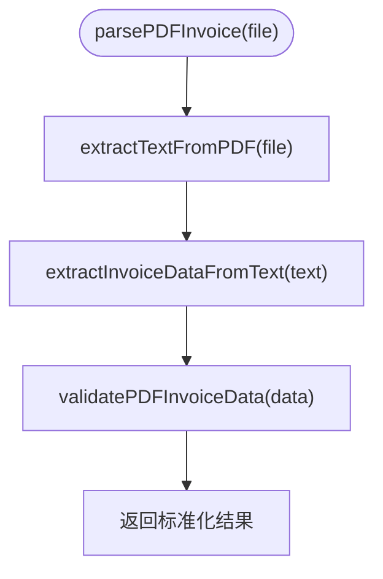

# 开发指南

<cite>
**本文引用的文件**
- [package.json](file://package.json)
- [vite.config.js](file://vite.config.js)
- [index.html](file://index.html)
- [src/main.js](file://src/main.js)
- [src/App.vue](file://src/App.vue)
- [src/components/AppLayout.vue](file://src/components/AppLayout.vue)
- [src/views/Home.vue](file://src/views/Home.vue)
- [src/views/HomePage.vue](file://src/views/HomePage.vue)
- [src/components/FileUploader.vue](file://src/components/FileUploader.vue)
- [src/components/InvoiceTable.vue](file://src/components/InvoiceTable.vue)
- [src/components/OperationBar.vue](file://src/components/OperationBar.vue)
- [src/composables/useFileParser.js](file://src/composables/useFileParser.js)
- [src/composables/useFileExport.js](file://src/composables/useFileExport.js)
- [src/stores/invoice.js](file://src/stores/invoice.js)
- [src/utils/pdfParser.js](file://src/utils/pdfParser.js)
- [src/utils/xmlParser.js](file://src/utils/xmlParser.js)
- [src/utils/nameGenerator.js](file://src/utils/nameGenerator.js)
- [src/utils/fileValidator.js](file://src/utils/fileValidator.js)
</cite>

## 目录
1. [简介](#简介)
2. [项目结构](#项目结构)
3. [核心组件](#核心组件)
4. [架构总览](#架构总览)
5. [详细组件分析](#详细组件分析)
6. [依赖关系分析](#依赖关系分析)
7. [性能与调试建议](#性能与调试建议)
8. [本地开发环境设置](#本地开发环境设置)
9. [编写新功能或修复Bug的标准流程](#编写新功能或修复bug的标准流程)
10. [单元测试建议（未来可加入）](#单元测试建议未来可加入)
11. [故障排查指南](#故障排查指南)
12. [结语](#结语)

## 简介
本指南面向贡献者，帮助你快速搭建本地开发环境，理解应用入口初始化逻辑与 Vite 热重载开发方式，掌握通过 Vite 别名“@”导入模块的约定，以及组件化与组合式 API 的最佳实践。同时提供编写新功能或修复 Bug 的标准流程、性能与调试建议、故障排查方法，以及未来引入单元测试的建议，帮助你高效融入项目开发。

## 项目结构
该项目采用基于 Vue 3 + Vite 的前端工程，采用“按功能域组织”的目录结构：
- src/components：可复用 UI 组件（如布局、上传、表格、操作栏）
- src/views：页面级视图（如首页、发票重命名页）
- src/composables：组合式函数（如文件解析、导出）
- src/stores：状态管理（Pinia Store）
- src/utils：工具模块（如 PDF/XML 解析、文件名生成、校验）
- src/main.js：应用入口
- vite.config.js：构建与开发服务器配置（含别名@）

图表来源
- [src/main.js](file://src/main.js#L1-L10)
- [src/App.vue](file://src/App.vue#L1-L64)
- [src/components/AppLayout.vue](file://src/components/AppLayout.vue#L1-L292)
- [src/views/Home.vue](file://src/views/Home.vue#L1-L236)
- [src/views/HomePage.vue](file://src/views/HomePage.vue#L1-L100)
- [src/components/FileUploader.vue](file://src/components/FileUploader.vue#L1-L50)
- [src/components/InvoiceTable.vue](file://src/components/InvoiceTable.vue#L1-L162)
- [src/components/OperationBar.vue](file://src/components/OperationBar.vue#L1-L119)
- [src/composables/useFileParser.js](file://src/composables/useFileParser.js#L1-L102)
- [src/composables/useFileExport.js](file://src/composables/useFileExport.js#L1-L200)
- [src/stores/invoice.js](file://src/stores/invoice.js#L1-L204)
- [src/utils/pdfParser.js](file://src/utils/pdfParser.js#L1-L227)
- [src/utils/xmlParser.js](file://src/utils/xmlParser.js#L1-L118)
- [src/utils/nameGenerator.js](file://src/utils/nameGenerator.js#L1-L225)
- [src/utils/fileValidator.js](file://src/utils/fileValidator.js#L1-L200)

章节来源
- [package.json](file://package.json#L1-L26)
- [vite.config.js](file://vite.config.js#L1-L18)
- [index.html](file://index.html#L1-L14)

## 核心组件
- 应用入口与初始化
  - main.js 创建 Vue 应用实例，挂载 Pinia，并将 App 根组件挂载到 DOM。
- 布局与导航
  - AppLayout 提供侧边菜单、面包屑、头部与内容区布局；支持折叠与跳转。
- 视图页面
  - HomePage 展示工具卡片，触发导航；Home.vue 实现发票重命名流程（上传、解析、展示、导出）。
- 组合式函数
  - useFileParser：统一解析 PDF/XML，支持进度与批量处理。
  - useFileExport：导出 ZIP 文件（未来可扩展）。
- 状态管理
  - invoice store：维护文件列表、筛选、搜索、选中、处理状态与统计。
- 工具模块
  - pdfParser/xmlParser：PDF 文本提取与发票字段抽取；XML 解析与字段抽取。
  - nameGenerator：按规则生成文件名，处理冲突。
  - fileValidator：上传文件校验（类型、大小等）。

章节来源
- [src/main.js](file://src/main.js#L1-L10)
- [src/App.vue](file://src/App.vue#L1-L64)
- [src/components/AppLayout.vue](file://src/components/AppLayout.vue#L1-L292)
- [src/views/Home.vue](file://src/views/Home.vue#L1-L236)
- [src/views/HomePage.vue](file://src/views/HomePage.vue#L1-L100)
- [src/composables/useFileParser.js](file://src/composables/useFileParser.js#L1-L102)
- [src/composables/useFileExport.js](file://src/composables/useFileExport.js#L1-L200)
- [src/stores/invoice.js](file://src/stores/invoice.js#L1-L204)
- [src/utils/pdfParser.js](file://src/utils/pdfParser.js#L1-L227)
- [src/utils/xmlParser.js](file://src/utils/xmlParser.js#L1-L118)
- [src/utils/nameGenerator.js](file://src/utils/nameGenerator.js#L1-L225)
- [src/utils/fileValidator.js](file://src/utils/fileValidator.js#L1-L200)

## 架构总览
应用采用“页面视图 + 组合式函数 + Pinia Store + 工具模块”的分层架构。页面负责交互与事件编排，组合式函数封装业务逻辑，Store 统一管理状态，工具模块提供底层能力。

图表来源
- [src/views/Home.vue](file://src/views/Home.vue#L1-L236)
- [src/views/HomePage.vue](file://src/views/HomePage.vue#L1-L100)
- [src/components/FileUploader.vue](file://src/components/FileUploader.vue#L1-L50)
- [src/components/OperationBar.vue](file://src/components/OperationBar.vue#L1-L119)
- [src/components/InvoiceTable.vue](file://src/components/InvoiceTable.vue#L1-L162)
- [src/components/AppLayout.vue](file://src/components/AppLayout.vue#L1-L292)
- [src/composables/useFileParser.js](file://src/composables/useFileParser.js#L1-L102)
- [src/composables/useFileExport.js](file://src/composables/useFileExport.js#L1-L200)
- [src/stores/invoice.js](file://src/stores/invoice.js#L1-L204)
- [src/utils/pdfParser.js](file://src/utils/pdfParser.js#L1-L227)
- [src/utils/xmlParser.js](file://src/utils/xmlParser.js#L1-L118)
- [src/utils/nameGenerator.js](file://src/utils/nameGenerator.js#L1-L225)
- [src/utils/fileValidator.js](file://src/utils/fileValidator.js#L1-L200)

## 详细组件分析

### 应用入口与初始化（main.js）
- 初始化步骤
  - 创建 Vue 应用实例
  - 创建并注册 Pinia
  - 挂载根组件到 DOM
- 关键点
  - 通过 index.html 中的 script 引入入口文件
  - Vite 在开发模式下自动热重载

图表来源
- [index.html](file://index.html#L1-L14)
- [src/main.js](file://src/main.js#L1-L10)

章节来源
- [src/main.js](file://src/main.js#L1-L10)
- [index.html](file://index.html#L1-L14)

### 布局与导航（AppLayout.vue）
- 功能要点
  - 侧边菜单与面包屑导航联动
  - 标题动态根据激活菜单项计算
  - 暴露菜单选择处理函数供父组件调用
- 最佳实践
  - 使用 computed 计算标题与面包屑，避免重复渲染
  - 通过 emit 事件向上通知激活键变更

图表来源
- [src/components/AppLayout.vue](file://src/components/AppLayout.vue#L1-L292)

章节来源
- [src/components/AppLayout.vue](file://src/components/AppLayout.vue#L1-L292)

### 发票重命名页面（Home.vue）
- 流程概览
  - 文件上传（FileUploader）触发处理
  - 使用 useFileParser 解析 PDF/XML
  - 将结果写入 Pinia store，驱动表格展示
  - 支持筛选、搜索、批量删除与导出
- 关键交互
  - 进度对话框与处理状态
  - 表格内编辑购买方名称与金额，触发 store 更新
  - 导出成功/失败消息提示

图表来源
- [src/views/Home.vue](file://src/views/Home.vue#L1-L236)
- [src/components/FileUploader.vue](file://src/components/FileUploader.vue#L1-L50)
- [src/composables/useFileParser.js](file://src/composables/useFileParser.js#L1-L102)
- [src/stores/invoice.js](file://src/stores/invoice.js#L1-L204)
- [src/composables/useFileExport.js](file://src/composables/useFileExport.js#L1-L200)

章节来源
- [src/views/Home.vue](file://src/views/Home.vue#L1-L236)
- [src/components/FileUploader.vue](file://src/components/FileUploader.vue#L1-L50)
- [src/composables/useFileParser.js](file://src/composables/useFileParser.js#L1-L102)
- [src/stores/invoice.js](file://src/stores/invoice.js#L1-L204)
- [src/composables/useFileExport.js](file://src/composables/useFileExport.js#L1-L200)

### 组合式函数：useFileParser（文件解析）
- 设计要点
  - 统一解析入口，区分 PDF/XML
  - 支持批量解析与进度回调
  - 返回标准化结果（success、data、errors、type）
- 性能考虑
  - 批量处理采用分批并发（Promise.all），提升吞吐
  - 进度按批次推进，避免频繁重渲染

图表来源
- [src/composables/useFileParser.js](file://src/composables/useFileParser.js#L1-L102)

章节来源
- [src/composables/useFileParser.js](file://src/composables/useFileParser.js#L1-L102)

### 状态管理：invoice store
- 职责
  - 维护文件列表、筛选状态、搜索关键字、选中项
  - 计算过滤后的列表、成功/失败/总数
  - 添加/更新/删除文件，生成新文件名
- 最佳实践
  - 使用 computed 组合筛选与搜索，减少重复计算
  - 更新发票字段时自动重新生成文件名并修正状态

图表来源
- [src/stores/invoice.js](file://src/stores/invoice.js#L1-L204)

章节来源
- [src/stores/invoice.js](file://src/stores/invoice.js#L1-L204)

### 工具模块：PDF 解析（pdfParser.js）
- 能力
  - 读取 PDF 文本（逐页提取）
  - 从文本中抽取发票字段（类型、号码、日期、购买方、销售方、金额）
  - 验证必要字段（购买方名称、金额）
- 调试建议
  - 开发环境下打印中间结果，便于定位字段匹配问题

图表来源
- [src/utils/pdfParser.js](file://src/utils/pdfParser.js#L1-L227)

章节来源
- [src/utils/pdfParser.js](file://src/utils/pdfParser.js#L1-L227)

### 工具模块：XML 解析（xmlParser.js）
- 能力
  - 读取并解析 XML 文本
  - 从多字段名映射中抽取发票字段
  - 验证必填字段
- 扩展建议
  - 根据实际发票 XML 结构细化字段抽取逻辑

章节来源
- [src/utils/xmlParser.js](file://src/utils/xmlParser.js#L1-L118)

### 工具模块：文件名生成（nameGenerator.js）
- 能力
  - 定义命名规则模板与字段格式化器
  - 生成文件名并处理冲突
  - 支持切换规则与查询可用规则
- 最佳实践
  - 保持字段格式化器可配置，便于扩展新规则

章节来源
- [src/utils/nameGenerator.js](file://src/utils/nameGenerator.js#L1-L225)

### 工具模块：文件校验（fileValidator.js）
- 能力
  - 校验文件类型（PDF/XML）、大小、数量等
  - 返回错误信息以便提示用户
- 建议
  - 可扩展为异步校验（如服务端校验）

章节来源
- [src/utils/fileValidator.js](file://src/utils/fileValidator.js#L1-L200)

## 依赖关系分析
- 构建与开发
  - Vite 插件：@vitejs/plugin-vue
  - 别名：@ -> src
  - 开发服务器：端口 3000，自动打开浏览器
- 运行时依赖
  - Vue 3、Naive UI、Pinia、pdfjs-dist、fast-xml-parser、jszip、file-saver、@vicons/ionicons5

图表来源
- [package.json](file://package.json#L1-L26)
- [vite.config.js](file://vite.config.js#L1-L18)

章节来源
- [package.json](file://package.json#L1-L26)
- [vite.config.js](file://vite.config.js#L1-L18)

## 性能与调试建议
- 性能
  - 批量解析采用分批并发，避免主线程阻塞
  - 使用 computed 缓存筛选与搜索结果
  - 表格固定列宽与滚动优化
- 调试
  - 开发模式下打印中间结果，便于定位 PDF/XML 字段抽取问题
  - 使用浏览器开发者工具断点定位组合式函数与 store 的状态变更
  - 通过进度条与消息提示反馈处理状态

[本节为通用建议，无需列出具体文件来源]

## 本地开发环境设置
- 安装与运行
  - 安装依赖：使用包管理器安装依赖
  - 开发模式：启动 Vite 开发服务器，自动打开浏览器
  - 生产构建：打包产物用于预览或部署
- 代码格式化
  - 建议使用 Prettier 或 ESLint（可在后续引入），统一代码风格
- Vite 热重载
  - 修改任意源码后，浏览器自动刷新
  - 若修改入口或配置，需重启开发服务器
- Vite 别名“@”
  - 通过别名“@”导入 src 下模块，避免相对路径过长
  - 示例：import { useFileParser } from '@/composables/useFileParser'

章节来源
- [README.md](file://README.md#L1-L38)
- [vite.config.js](file://vite.config.js#L1-L18)
- [index.html](file://index.html#L1-L14)
- [src/main.js](file://src/main.js#L1-L10)

## 编写新功能或修复Bug的标准流程
- 需求分析
  - 明确页面/组件职责与交互边界
  - 评估是否需要新增组合式函数或工具模块
- 设计与实现
  - 优先使用组合式 API（setup + ref/computed/watch）
  - 组件化：拆分细粒度组件，通过 props/emits 通信
  - 状态集中管理：将共享状态放入 Pinia Store
- 代码规范
  - 使用“@”别名导入模块
  - 保持单一职责，避免在视图中直接耦合工具逻辑
- 测试与验证
  - 在 Home.vue 中验证上传、解析、导出链路
  - 使用浏览器控制台观察日志与错误
- 提交流程
  - 提交前确保无明显错误与警告
  - 附带必要的注释与说明

[本节为流程性建议，无需列出具体文件来源]

## 单元测试建议（未来可加入）
- 测试目标
  - 组合式函数：useFileParser、useFileExport、nameGenerator
  - 工具函数：pdfParser、xmlParser、fileValidator
  - Store：状态变更、筛选与搜索逻辑
- 推荐策略
  - 使用 Vitest + @vue/test-utils
  - 对异步流程（解析、导出）使用 mock 与超时控制
  - 覆盖边界条件（空输入、异常错误、格式不匹配）
- 集成建议
  - 在 package.json 中添加测试脚本
  - CI 中执行测试与覆盖率检查

[本节为未来规划建议，无需列出具体文件来源]

## 故障排查指南
- 常见问题
  - PDF 解析失败：检查 PDF.js worker 配置与文本提取结果
  - XML 解析失败：核对 XML 结构与字段映射
  - 文件名生成失败：检查必填字段与格式化器
  - 导出失败：确认成功文件数量与 ZIP 生成逻辑
- 调试技巧
  - 开启开发模式日志，定位字段抽取与验证阶段
  - 使用浏览器断点查看 store 状态与表格数据
  - 逐步缩小范围：先验证单文件解析，再验证批量流程

章节来源
- [src/utils/pdfParser.js](file://src/utils/pdfParser.js#L1-L227)
- [src/utils/xmlParser.js](file://src/utils/xmlParser.js#L1-L118)
- [src/utils/nameGenerator.js](file://src/utils/nameGenerator.js#L1-L225)
- [src/stores/invoice.js](file://src/stores/invoice.js#L1-L204)

## 结语
本指南提供了从环境搭建到功能开发与调试的完整路径。建议在新增功能时遵循组件化与组合式 API 的最佳实践，合理使用 Pinia 管理状态，并通过日志与断点快速定位问题。随着项目演进，逐步引入单元测试与质量保障流程，将有助于团队协作与长期维护。