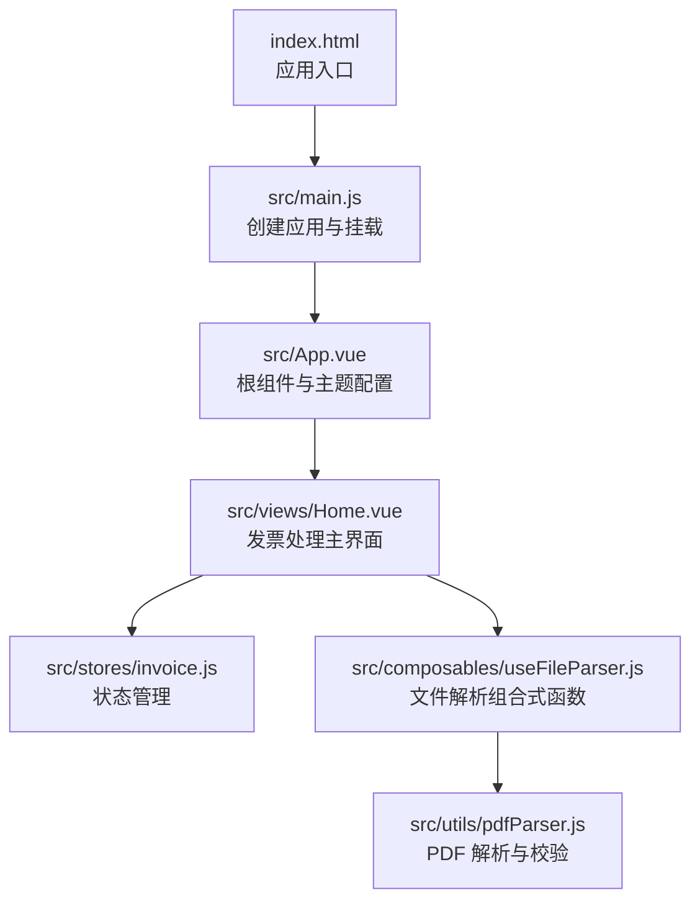
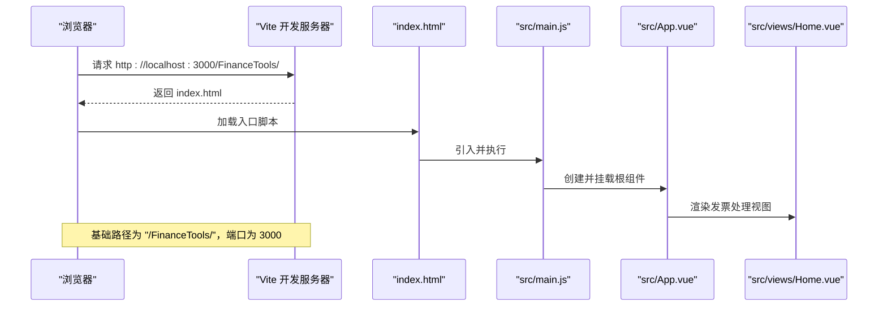
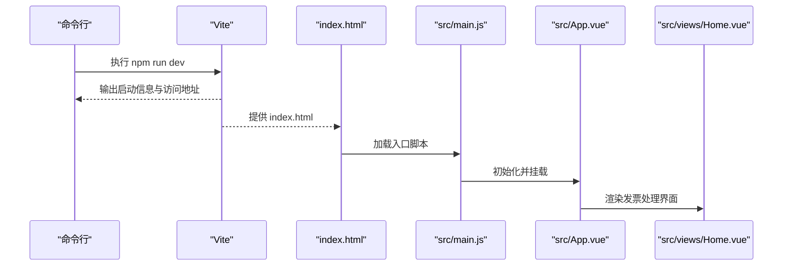
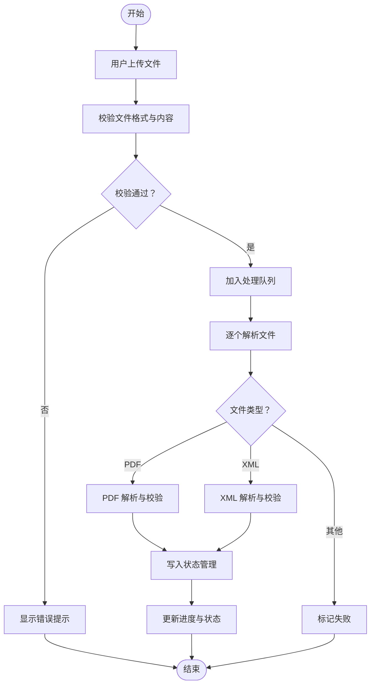
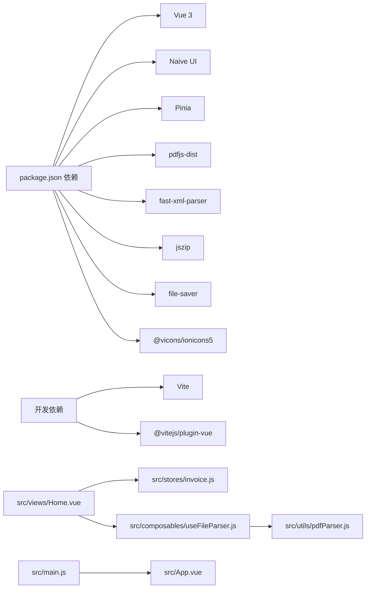

# 快速开始

<cite>
**本文引用的文件**
- [README.md](file://README.md)
- [package.json](file://package.json)
- [vite.config.js](file://vite.config.js)
- [index.html](file://index.html)
- [src/main.js](file://src/main.js)
- [src/App.vue](file://src/App.vue)
- [src/views/Home.vue](file://src/views/Home.vue)
- [src/stores/invoice.js](file://src/stores/invoice.js)
- [src/composables/useFileParser.js](file://src/composables/useFileParser.js)
- [src/utils/pdfParser.js](file://src/utils/pdfParser.js)
</cite>

## 目录
1. [简介](#简介)
2. [项目结构](#项目结构)
3. [核心组件](#核心组件)
4. [架构总览](#架构总览)
5. [详细组件分析](#详细组件分析)
6. [依赖关系分析](#依赖关系分析)
7. [性能与配置建议](#性能与配置建议)
8. [故障排查指南](#故障排查指南)
9. [结论](#结论)
10. [附录](#附录)

## 简介
本指南面向首次接触 FinanceTools 的开发者，帮助你在本地快速搭建并运行项目。你将学会：
- 克隆仓库与安装依赖
- 启动开发服务器
- 理解 package.json 中的脚本用途（dev、build、preview）
- 结合 Vite 配置（端口、基础路径、别名）进行本地访问与部署前准备
- 常见问题的快速定位与解决思路

## 项目结构
FinanceTools 是一个基于 Vue 3 的前端项目，采用 Vite 作为构建与开发工具。核心入口为 HTML 页面与 Vue 应用挂载点，业务逻辑集中在 views、components、stores、composables 与 utils 目录中。

图表来源
- [index.html](file://index.html#L1-L14)
- [src/main.js](file://src/main.js#L1-L10)
- [src/App.vue](file://src/App.vue#L1-L64)
- [src/views/Home.vue](file://src/views/Home.vue#L1-L236)
- [src/stores/invoice.js](file://src/stores/invoice.js#L1-L204)
- [src/composables/useFileParser.js](file://src/composables/useFileParser.js#L1-L102)
- [src/utils/pdfParser.js](file://src/utils/pdfParser.js#L1-L227)

章节来源
- [index.html](file://index.html#L1-L14)
- [src/main.js](file://src/main.js#L1-L10)
- [src/App.vue](file://src/App.vue#L1-L64)
- [src/views/Home.vue](file://src/views/Home.vue#L1-L236)
- [src/stores/invoice.js](file://src/stores/invoice.js#L1-L204)
- [src/composables/useFileParser.js](file://src/composables/useFileParser.js#L1-L102)
- [src/utils/pdfParser.js](file://src/utils/pdfParser.js#L1-L227)

## 核心组件
- 应用入口与挂载
  - HTML 入口负责创建挂载点，并引入应用入口脚本。
  - 应用入口初始化 Vue 与 Pinia，并将根组件挂载到 DOM。
- 根组件与主题
  - 根组件提供全局 UI 主题覆盖与视图切换容器。
- 视图层
  - 发票处理主界面负责文件上传、解析、展示与导出。
- 状态管理
  - 使用 Pinia 管理发票列表、过滤条件、选择状态与处理状态。
- 组合式函数
  - 封装文件解析流程，按类型（PDF/XML）调用对应解析器。
- 工具模块
  - PDF 解析器负责文本提取、发票信息抽取与数据校验。

章节来源
- [index.html](file://index.html#L1-L14)
- [src/main.js](file://src/main.js#L1-L10)
- [src/App.vue](file://src/App.vue#L1-L64)
- [src/views/Home.vue](file://src/views/Home.vue#L1-L236)
- [src/stores/invoice.js](file://src/stores/invoice.js#L1-L204)
- [src/composables/useFileParser.js](file://src/composables/useFileParser.js#L1-L102)
- [src/utils/pdfParser.js](file://src/utils/pdfParser.js#L1-L227)

## 架构总览
下图展示了从浏览器请求到应用渲染的关键路径，以及开发服务器的启动与资源访问方式。

图表来源
- [vite.config.js](file://vite.config.js#L1-L18)
- [index.html](file://index.html#L1-L14)
- [src/main.js](file://src/main.js#L1-L10)
- [src/App.vue](file://src/App.vue#L1-L64)
- [src/views/Home.vue](file://src/views/Home.vue#L1-L236)

## 详细组件分析

### 开发服务器与脚本说明
- npm run dev
  - 启动 Vite 开发服务器，默认监听端口 3000，自动打开浏览器。
  - 适合日常开发与调试。
- npm run build
  - 生产构建，生成静态资源产物，用于部署。
- npm run preview
  - 在本地预览生产构建产物，便于验证打包效果。

章节来源
- [README.md](file://README.md#L12-L30)
- [package.json](file://package.json#L1-L26)
- [vite.config.js](file://vite.config.js#L1-L18)

### Vite 配置要点
- 端口与自动打开
  - server.port 设置为 3000；server.open 为 true，启动后自动打开浏览器。
- 基础路径
  - base 设置为 "/FinanceTools/"，意味着应用需通过该路径访问。
- 路径别名
  - alias["@"] 指向 src 目录，便于在组件中使用相对路径导入。
- 插件
  - 启用 @vitejs/plugin-vue 支持 Vue SFC。

章节来源
- [vite.config.js](file://vite.config.js#L1-L18)

### 应用启动流程

图表来源
- [README.md](file://README.md#L12-L30)
- [vite.config.js](file://vite.config.js#L1-L18)
- [index.html](file://index.html#L1-L14)
- [src/main.js](file://src/main.js#L1-L10)
- [src/App.vue](file://src/App.vue#L1-L64)
- [src/views/Home.vue](file://src/views/Home.vue#L1-L236)

### 发票处理流程（上传与解析）

图表来源
- [src/views/Home.vue](file://src/views/Home.vue#L1-L236)
- [src/composables/useFileParser.js](file://src/composables/useFileParser.js#L1-L102)
- [src/stores/invoice.js](file://src/stores/invoice.js#L1-L204)
- [src/utils/pdfParser.js](file://src/utils/pdfParser.js#L1-L227)

## 依赖关系分析
- 运行时依赖
  - Vue 3、Naive UI、Pinia、pdfjs-dist、fast-xml-parser、jszip、file-saver、@vicons/ionicons5。
- 开发依赖
  - Vite 与 @vitejs/plugin-vue。
- 关键交互
  - views/Home.vue 依赖 stores/invoice.js 与 composables/useFileParser.js。
  - useFileParser.js 再依赖 utils/pdfParser.js 与 utils/xmlParser.js（由其内部导入）。
  - src/main.js 初始化应用与 Pinia，App.vue 提供主题与布局。

图表来源
- [package.json](file://package.json#L1-L26)
- [src/views/Home.vue](file://src/views/Home.vue#L1-L236)
- [src/stores/invoice.js](file://src/stores/invoice.js#L1-L204)
- [src/composables/useFileParser.js](file://src/composables/useFileParser.js#L1-L102)
- [src/utils/pdfParser.js](file://src/utils/pdfParser.js#L1-L227)
- [src/main.js](file://src/main.js#L1-L10)
- [src/App.vue](file://src/App.vue#L1-L64)

章节来源
- [package.json](file://package.json#L1-L26)
- [src/views/Home.vue](file://src/views/Home.vue#L1-L236)
- [src/stores/invoice.js](file://src/stores/invoice.js#L1-L204)
- [src/composables/useFileParser.js](file://src/composables/useFileParser.js#L1-L102)
- [src/utils/pdfParser.js](file://src/utils/pdfParser.js#L1-L227)
- [src/main.js](file://src/main.js#L1-L10)
- [src/App.vue](file://src/App.vue#L1-L64)

## 性能与配置建议
- 端口占用
  - 若 3000 端口被占用，可在 Vite 配置中修改 server.port 或关闭占用进程。
- 基础路径
  - 由于设置了 base 为 "/FinanceTools/"，请务必通过该路径访问应用，避免静态资源 404。
- 资源体积
  - 生产构建后可对比 dist 目录大小，必要时启用压缩与按需加载策略。
- 代理与跨域
  - 如需联调后端接口，可在 Vite 中配置 proxy，避免跨域问题。

章节来源
- [vite.config.js](file://vite.config.js#L1-L18)

## 故障排查指南
- 依赖安装失败
  - 症状：npm install 报错或卡住。
  - 排查：检查网络与镜像源；若为权限问题，使用管理员权限或更换 npm/yarn 源；清理缓存后重试。
- 端口冲突
  - 症状：启动时报端口被占用。
  - 排查：修改 vite.config.js 中的 server.port，或终止占用进程。
- 访问 404 或资源加载失败
  - 症状：页面空白或静态资源 404。
  - 排查：确认访问路径包含 "/FinanceTools/"；检查 base 配置与构建产物目录。
- PDF 解析异常
  - 症状：PDF 文件无法解析或金额缺失。
  - 排查：确认文件为有效发票 PDF；查看控制台错误信息；尝试更换 PDF 版本或打印质量。
- 开发服务器无法热更新
  - 症状：修改代码后页面不刷新。
  - 排查：检查 Vite 插件是否正确安装；确认文件保存成功；重启开发服务器。

章节来源
- [vite.config.js](file://vite.config.js#L1-L18)
- [src/utils/pdfParser.js](file://src/utils/pdfParser.js#L1-L227)
- [src/views/Home.vue](file://src/views/Home.vue#L1-L236)

## 结论
通过本指南，你已掌握 FinanceTools 的本地搭建与运行方法，理解了开发脚本的作用与 Vite 的关键配置。建议在开发过程中：
- 使用 npm run dev 快速迭代
- 使用 npm run build 与 npm run preview 验证生产环境表现
- 遇到问题优先检查端口、基础路径与依赖安装情况

## 附录
- 常用命令参考
  - 安装依赖：npm install
  - 启动开发：npm run dev
  - 生产构建：npm run build
  - 预览构建：npm run preview
- 访问地址
  - 默认：http://localhost:3000/FinanceTools/
- 项目特性
  - 发票文件上传、解析、重命名与导出
  - 支持 PDF 与 XML 格式
  - 基于 Pinia 的状态管理与 Naive UI 的界面组件

章节来源
- [README.md](file://README.md#L12-L30)
- [vite.config.js](file://vite.config.js#L1-L18)
- [src/views/Home.vue](file://src/views/Home.vue#L1-L236)