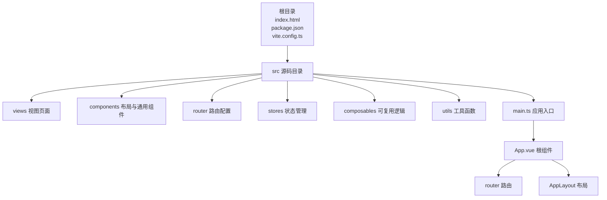

# 快速开始

<cite>
**本文引用的文件**
- [README.md](file://README.md)
- [package.json](file://package.json)
- [vite.config.ts](file://vite.config.ts)
- [index.html](file://index.html)
- [src/main.ts](file://src/main.ts)
- [src/App.vue](file://src/App.vue)
- [src/views/HomePage.vue](file://src/views/HomePage.vue)
- [src/router/index.ts](file://src/router/index.ts)
- [src/components/AppLayout.vue](file://src/components/AppLayout.vue)
</cite>

## 目录
1. [简介](#简介)
2. [项目结构](#项目结构)
3. [安装与运行步骤](#安装与运行步骤)
4. [访问与初始界面](#访问与初始界面)
5. [常见问题排查](#常见问题排查)
6. [结语](#结语)

## 简介
FinanceTools 是一个基于 Vue 3 的财务工具集合，提供发票处理等实用功能。本指南将带你用最短时间完成项目的安装与运行，让你在 5 分钟内看到项目界面并了解基本功能。

## 项目结构
该项目采用前端单页应用架构，核心目录与文件如下：
- 根目录包含项目配置文件与入口 HTML
- src 目录包含源码，包括组件、视图、路由、状态管理与工具函数
- 使用 Vite 作为构建工具，Vue 3 + TypeScript + Naive UI 组合

图表来源
- [index.html](file://index.html#L1-L24)
- [src/main.ts](file://src/main.ts#L1-L12)
- [src/App.vue](file://src/App.vue#L1-L44)
- [src/router/index.ts](file://src/router/index.ts#L1-L40)
- [src/components/AppLayout.vue](file://src/components/AppLayout.vue#L1-L340)

章节来源
- [README.md](file://README.md#L1-L41)
- [package.json](file://package.json#L1-L33)
- [vite.config.ts](file://vite.config.ts#L1-L18)
- [index.html](file://index.html#L1-L24)

## 安装与运行步骤
以下步骤将带你从零开始安装并运行 FinanceTools 项目。所有命令均来自项目文档与配置文件。

- 步骤 1：克隆仓库
  - 在终端中执行克隆命令，将远程仓库下载到本地。
  - 参考来源：[README.md](file://README.md#L15-L20)

- 步骤 2：安装依赖
  - 进入项目目录后，执行依赖安装命令，自动拉取项目所需的所有包。
  - 参考来源：[README.md](file://README.md#L15-L20)，[package.json](file://package.json#L1-L33)

- 步骤 3：启动开发服务器
  - 执行开发模式命令，启动本地开发服务器并自动打开浏览器。
  - 参考来源：[README.md](file://README.md#L22-L33)，[package.json](file://package.json#L6-L11)，[vite.config.ts](file://vite.config.ts#L13-L16)

- 步骤 4：构建生产版本（可选）
  - 执行构建命令，生成可在服务器上部署的静态资源。
  - 参考来源：[README.md](file://README.md#L28-L33)，[package.json](file://package.json#L8-L10)

- 步骤 5：预览生产版本（可选）
  - 启动本地预览服务，验证构建产物是否正确。
  - 参考来源：[README.md](file://README.md#L31-L33)，[package.json](file://package.json#L9-L10)

章节来源
- [README.md](file://README.md#L15-L33)
- [package.json](file://package.json#L6-L11)
- [vite.config.ts](file://vite.config.ts#L13-L16)

## 访问与初始界面
- 访问地址
  - 默认访问地址为 http://localhost:3000。该端口在开发服务器配置中设置。
  - 参考来源：[vite.config.ts](file://vite.config.ts#L13-L16)

- 初始界面
  - 首次进入会看到“首页”视图，展示“财务工具箱”的欢迎信息与工具卡片。
  - 点击“发票重命名”或“发票解析”卡片，即可跳转到对应功能页面。
  - 参考来源：[src/views/HomePage.vue](file://src/views/HomePage.vue#L1-L124)，[src/router/index.ts](file://src/router/index.ts#L7-L32)

- 页面结构
  - 应用根组件负责注入路由与状态管理，并通过布局组件承载内容。
  - 参考来源：[src/main.ts](file://src/main.ts#L1-L12)，[src/App.vue](file://src/App.vue#L1-L44)，[src/components/AppLayout.vue](file://src/components/AppLayout.vue#L1-L104)

章节来源
- [vite.config.ts](file://vite.config.ts#L13-L16)
- [src/views/HomePage.vue](file://src/views/HomePage.vue#L1-L124)
- [src/router/index.ts](file://src/router/index.ts#L7-L32)
- [src/main.ts](file://src/main.ts#L1-L12)
- [src/App.vue](file://src/App.vue#L1-L44)
- [src/components/AppLayout.vue](file://src/components/AppLayout.vue#L1-L104)

## 常见问题排查
- 依赖安装失败
  - 现象：执行安装命令时报错，无法完成依赖下载。
  - 排查要点：
    - 确认网络环境稳定，必要时切换为国内镜像源。
    - 清理缓存后重试安装。
    - 检查 Node.js 版本是否满足项目要求（项目使用较新的依赖，建议使用 LTS 版本）。
  - 参考来源：[package.json](file://package.json#L12-L31)

- 端口被占用
  - 现象：启动开发服务器时提示端口 3000 已被占用。
  - 排查要点：
    - 修改开发服务器端口配置，避免冲突。
    - 关闭占用端口的其他进程后再启动。
  - 参考来源：[vite.config.ts](file://vite.config.ts#L13-L16)

- 浏览器未自动打开
  - 现象：开发服务器已启动但未自动打开浏览器。
  - 排查要点：
    - 检查系统默认浏览器设置。
    - 手动访问 http://localhost:3000。
  - 参考来源：[vite.config.ts](file://vite.config.ts#L15-L16)

- 路由跳转异常
  - 现象：点击菜单或卡片后页面未跳转。
  - 排查要点：
    - 确认路由配置正确，路径与组件映射无误。
    - 检查路由历史模式与基础路径设置。
  - 参考来源：[src/router/index.ts](file://src/router/index.ts#L7-L32)，[vite.config.ts](file://vite.config.ts#L7-L7)

- 生产构建失败
  - 现象：执行构建命令时报错。
  - 排查要点：
    - 先执行类型检查，修复类型错误后再构建。
    - 确保构建脚本与依赖版本兼容。
  - 参考来源：[package.json](file://package.json#L8-L10)，[package.json](file://package.json#L24-L31)

章节来源
- [package.json](file://package.json#L12-L31)
- [vite.config.ts](file://vite.config.ts#L7-L16)
- [src/router/index.ts](file://src/router/index.ts#L7-L32)

## 结语
按照上述步骤，你可以在几分钟内完成 FinanceTools 的安装与运行。项目提供了清晰的首页与工具入口，便于快速体验发票相关功能。遇到问题时，可依据“常见问题排查”逐项检查。随着对项目的熟悉，你可以进一步探索各功能模块与扩展开发。