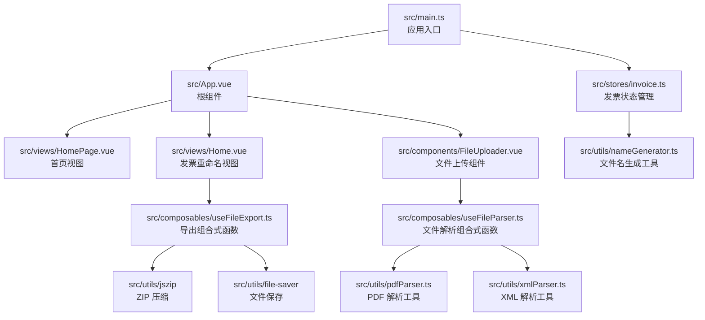
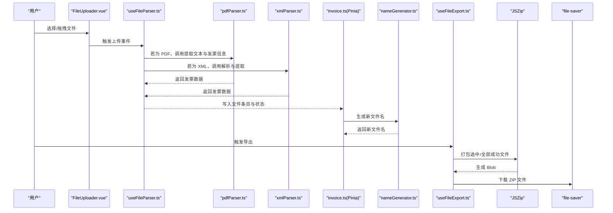
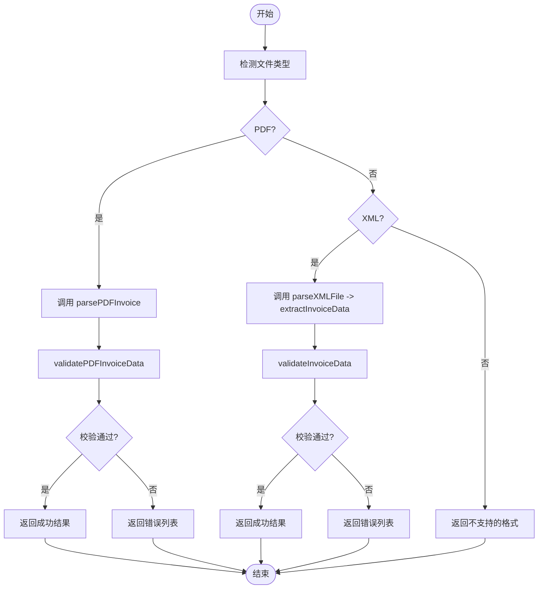
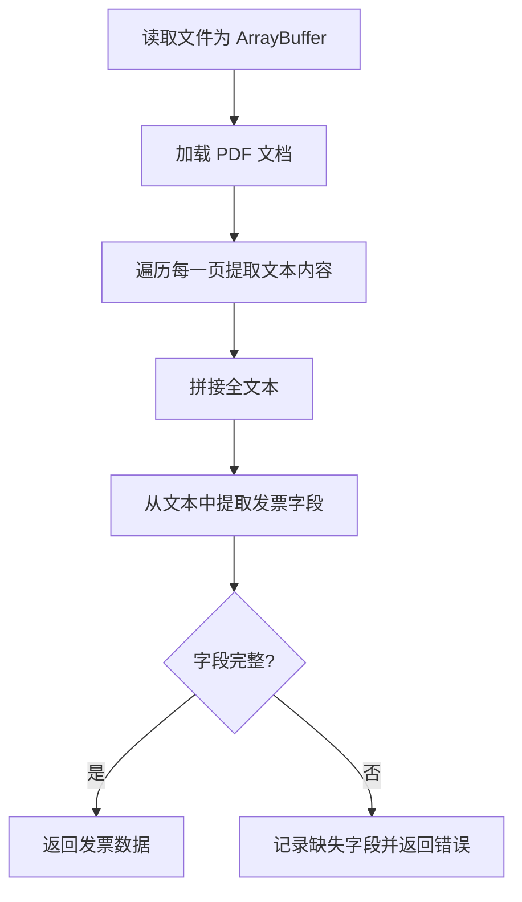
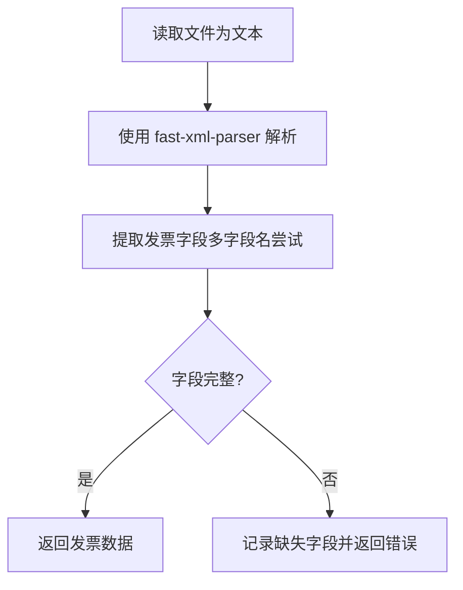
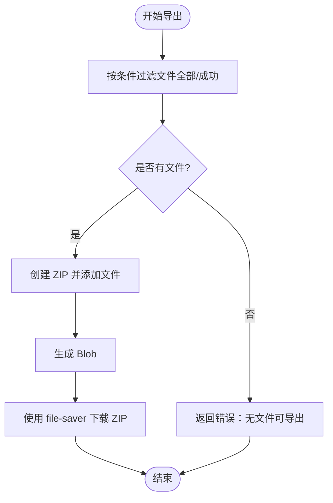
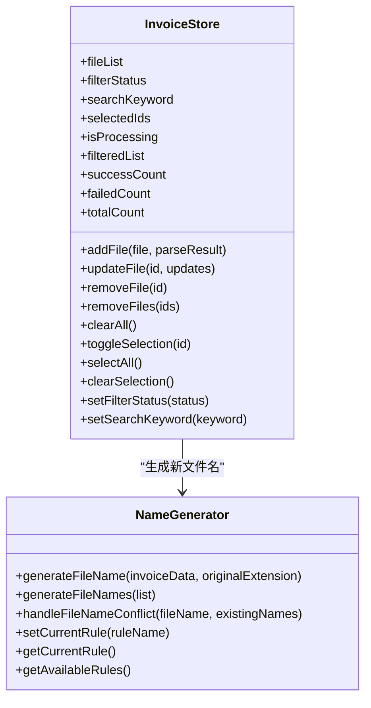

# 技术栈与依赖

<cite>
**本文引用的文件**
- [package.json](file://package.json)
- [vite.config.ts](file://vite.config.ts)
- [tsconfig.json](file://tsconfig.json)
- [src/main.ts](file://src/main.ts)
- [src/App.vue](file://src/App.vue)
- [src/stores/invoice.ts](file://src/stores/invoice.ts)
- [src/composables/useFileParser.ts](file://src/composables/useFileParser.ts)
- [src/utils/pdfParser.ts](file://src/utils/pdfParser.ts)
- [src/utils/xmlParser.ts](file://src/utils/xmlParser.ts)
- [src/composables/useFileExport.ts](file://src/composables/useFileExport.ts)
- [src/utils/nameGenerator.ts](file://src/utils/nameGenerator.ts)
- [src/views/HomePage.vue](file://src/views/HomePage.vue)
- [src/components/FileUploader.vue](file://src/components/FileUploader.vue)
</cite>

## 更新摘要
**变更内容**
- 将项目从 JavaScript 迁移至 TypeScript，所有核心模块已重命名为 `.ts` 或 `.tsx` 文件
- 新增 `tsconfig.json` 配置文件以支持 TypeScript 编译
- 更新构建脚本以包含 `vue-tsc` 类型检查
- 所有模块均使用 TypeScript 类型定义，增强了类型安全和开发体验

## 目录
1. [引言](#引言)
2. [项目结构](#项目结构)
3. [核心组件](#核心组件)
4. [架构总览](#架构总览)
5. [详细组件分析](#详细组件分析)
6. [依赖分析](#依赖分析)
7. [性能考虑](#性能考虑)
8. [故障排查指南](#故障排查指南)
9. [结论](#结论)

## 引言
本文面向开发者与技术评审人员，系统梳理 FinanceTools 项目的技术栈与依赖，重点说明以下方面：
- Vue 3 与组合式 API 的应用范围与职责边界
- Pinia 在项目中的状态管理模式与 Store 设计
- Naive UI 的选型理由与集成方式
- 关键功能依赖：pdfjs-dist（PDF 解析）、fast-xml-parser（XML 解析）、file-saver 与 jszip（导出与 ZIP 压缩）
- 生产依赖版本与功能定位
- Vite 构建工具与 @vitejs/plugin-vue 的配置要点
- 通过代码级图示展示模块间协作关系，帮助快速理解项目技术基础与各库之间的协同工作方式

## 项目结构
项目采用基于功能分层的组织方式：
- 应用入口与根组件：src/main.ts、src/App.vue
- 视图与布局：src/views、src/components
- 组合式函数：src/composables（封装业务流程与复用逻辑）
- 工具模块：src/utils（解析器、命名规则、导出等）
- 状态管理：src/stores（集中管理发票数据）

图表来源
- [src/main.ts](file://src/main.ts#L1-L12)
- [src/App.vue](file://src/App.vue#L1-L64)
- [src/views/HomePage.vue](file://src/views/HomePage.vue#L1-L100)
- [src/components/FileUploader.vue](file://src/components/FileUploader.vue#L1-L50)
- [src/stores/invoice.ts](file://src/stores/invoice.ts#L1-L256)
- [src/composables/useFileParser.ts](file://src/composables/useFileParser.ts#L1-L109)
- [src/utils/pdfParser.ts](file://src/utils/pdfParser.ts#L1-L243)
- [src/utils/xmlParser.ts](file://src/utils/xmlParser.ts#L1-L141)
- [src/utils/nameGenerator.ts](file://src/utils/nameGenerator.ts#L1-L250)
- [src/composables/useFileExport.ts](file://src/composables/useFileExport.ts#L1-L94)

章节来源
- [src/main.ts](file://src/main.ts#L1-L12)
- [src/App.vue](file://src/App.vue#L1-L64)

## 核心组件
- Vue 3 与组合式 API
  - 应用入口通过 createApp 创建实例，并挂载根组件 App.vue
  - 组合式 API 在多个组合式函数与组件中广泛使用，例如 useFileParser、useFileExport、App.vue 中的响应式状态与事件处理
- Pinia 状态管理
  - 在 main.ts 中注册 Pinia，并在 App.vue 中通过 Provider 包裹全局 UI 上下文
  - 发票状态集中在 invoice.ts 的 Pinia Store 中，包含文件列表、过滤条件、选中集合、统计计算与增删改查方法
- Naive UI
  - 作为主要 UI 组件库，提供主题覆盖、消息、对话框、通知等 Provider，统一全局样式与交互体验
  - 在 HomePage.vue、FileUploader.vue 等组件中大量使用其卡片、栅格、图标等组件

章节来源
- [src/main.ts](file://src/main.ts#L1-L12)
- [src/App.vue](file://src/App.vue#L1-L64)
- [src/stores/invoice.ts](file://src/stores/invoice.ts#L1-L256)
- [src/views/HomePage.vue](file://src/views/HomePage.vue#L1-L100)
- [src/components/FileUploader.vue](file://src/components/FileUploader.vue#L1-L50)

## 架构总览
整体架构围绕“文件上传 -> 解析 -> 生成新文件名 -> 导出”的主流程展开，配合 Pinia 管理状态，Naive UI 提供交互界面。

图表来源
- [src/components/FileUploader.vue](file://src/components/FileUploader.vue#L1-L50)
- [src/composables/useFileParser.ts](file://src/composables/useFileParser.ts#L1-L109)
- [src/utils/pdfParser.ts](file://src/utils/pdfParser.ts#L1-L243)
- [src/utils/xmlParser.ts](file://src/utils/xmlParser.ts#L1-L141)
- [src/stores/invoice.ts](file://src/stores/invoice.ts#L1-L256)
- [src/utils/nameGenerator.ts](file://src/utils/nameGenerator.ts#L1-L250)
- [src/composables/useFileExport.ts](file://src/composables/useFileExport.ts#L1-L94)

## 详细组件分析

### 组件一：文件解析组合式函数 useFileParser
- 职责
  - 统一封装 PDF 与 XML 的解析流程，支持单文件与批量解析
  - 统一错误处理与进度反馈
- 关键流程
  - 根据文件后缀判断类型，分别调用 pdfParser 或 xmlParser
  - 对解析结果进行校验，返回 success、data、errors 与 type
  - 批量解析采用分批并发策略，提升吞吐
- 性能与可靠性
  - 使用 Promise.all 并行处理批次，降低总耗时
  - 明确的错误返回，便于上层统一提示

图表来源
- [src/composables/useFileParser.ts](file://src/composables/useFileParser.ts#L1-L109)
- [src/utils/pdfParser.ts](file://src/utils/pdfParser.ts#L1-L243)
- [src/utils/xmlParser.ts](file://src/utils/xmlParser.ts#L1-L141)

章节来源
- [src/composables/useFileParser.ts](file://src/composables/useFileParser.ts#L1-L109)

### 组件二：PDF 解析工具 pdfParser
- 职责
  - 读取 PDF 文件为 ArrayBuffer，逐页提取文本，再从文本中抽取发票字段
  - 提供数据校验，确保生成文件名所需的必要字段存在
- 关键点
  - 通过 pdfjs-dist 加载 PDF 并遍历页面提取文本
  - 使用正则匹配发票类型、发票号码、购买方/销售方名称、价税合计、开票日期等字段
  - 开发模式下输出详细日志，便于调试
- 错误处理
  - 对读取失败、解析失败、字段缺失等情况抛出明确错误信息

图表来源
- [src/utils/pdfParser.ts](file://src/utils/pdfParser.ts#L1-L243)

章节来源
- [src/utils/pdfParser.ts](file://src/utils/pdfParser.ts#L1-L243)

### 组件三：XML 解析工具 xmlParser
- 职责
  - 使用 fast-xml-parser 解析 XML 文本，提取发票字段
  - 提供字段提取的容错策略，尝试多种字段名变体
- 关键点
  - 通过 FileReader 读取文件文本，再交由 XMLParser 解析
  - 从多层级结构中提取发票类型、发票号码、购买方/销售方名称、金额、开票日期等
- 错误处理
  - 对读取失败、解析失败、字段缺失等情况抛出明确错误信息

图表来源
- [src/utils/xmlParser.ts](file://src/utils/xmlParser.ts#L1-L141)

章节来源
- [src/utils/xmlParser.ts](file://src/utils/xmlParser.ts#L1-L141)

### 组件四：文件名生成与导出 useFileExport
- 职责
  - 将选中或全部成功的发票文件打包为 ZIP，并通过 file-saver 下载
  - 生成 ZIP 文件名，包含时间戳
- 关键点
  - 使用 JSZip 动态添加文件并生成 Blob
  - 仅导出状态为 success 的文件，或根据参数导出全部
- 错误处理
  - 对无文件可导出、打包失败等情况返回错误信息

图表来源
- [src/composables/useFileExport.ts](file://src/composables/useFileExport.ts#L1-L94)

章节来源
- [src/composables/useFileExport.ts](file://src/composables/useFileExport.ts#L1-L94)

### 组件五：状态管理与命名规则
- 发票状态管理（invoice.ts）
  - 状态：文件列表、过滤状态、搜索关键字、选中 ID 集合、处理中标志
  - 计算属性：过滤后的列表、成功/失败/总数统计
  - 方法：添加/更新/删除文件、清空、全选/反选、设置过滤与搜索、生成唯一 ID
  - 与命名规则集成：当更新购买方名称或金额时，自动重新生成新文件名
- 命名规则（nameGenerator.ts）
  - 定义多种命名模板与字段格式化器
  - 支持字段必填校验、文件名冲突处理、批量生成与切换规则

图表来源
- [src/stores/invoice.ts](file://src/stores/invoice.ts#L1-L256)
- [src/utils/nameGenerator.ts](file://src/utils/nameGenerator.ts#L1-L250)

章节来源
- [src/stores/invoice.ts](file://src/stores/invoice.ts#L1-L256)
- [src/utils/nameGenerator.ts](file://src/utils/nameGenerator.ts#L1-L250)

## 依赖分析

### 生产依赖（dependencies）
- vue
  - 版本：^3.5.13
  - 作用：应用框架，提供组合式 API、响应式系统与组件模型
- pinia
  - 版本：^2.2.8
  - 作用：轻量级状态管理，集中管理发票数据与全局状态
- naive-ui
  - 版本：^2.40.1
  - 作用：UI 组件库，提供丰富的业务组件与主题覆盖能力
- @vicons/ionicons5
  - 版本：^0.13.0
  - 作用：图标库，为 UI 组件提供图标资源
- pdfjs-dist
  - 版本：^4.9.155
  - 作用：PDF 文本提取与页面解析，支撑发票信息抽取
- fast-xml-parser
  - 版本：^4.5.0
  - 作用：XML 解析，将发票 XML 转换为结构化数据
- file-saver
  - 版本：^2.0.5
  - 作用：浏览器端文件保存，用于下载导出的 ZIP 包
- jszip
  - 版本：^3.10.1
  - 作用：ZIP 压缩，将多个发票文件打包为单个压缩包

章节来源
- [package.json](file://package.json#L11-L20)

### 开发依赖（devDependencies）
- @vitejs/plugin-vue
  - 版本：^5.2.1
  - 作用：Vite 插件，支持 Vue SFC 的热更新与构建
- vite
  - 版本：^6.0.3
  - 作用：现代化构建工具，提供开发服务器、打包与预览能力
- typescript
  - 版本：^5.9.3
  - 作用：JavaScript 的超集，提供静态类型检查
- vue-tsc
  - 版本：^3.1.7
  - 作用：Vue 项目的 TypeScript 类型检查工具
- @types/file-saver
  - 版本：^2.0.7
  - 作用：为 file-saver 提供 TypeScript 类型定义
- @types/node
  - 版本：^24.10.1
  - 作用：为 Node.js API 提供 TypeScript 类型定义

章节来源
- [package.json](file://package.json#L21-L30)

### Vite 构建配置（vite.config.ts）
- 插件
  - 使用 @vitejs/plugin-vue，启用 Vue 单文件组件支持
- 路径别名
  - 将 @ 指向 src 目录，简化导入路径
- 基础路径
  - 设置 base 为 /FinanceTools/，适配部署路径
- 开发服务器
  - 端口：3000
  - 启动后自动打开浏览器
- 其他
  - 保持默认的构建行为，满足本地开发与预览需求

章节来源
- [vite.config.ts](file://vite.config.ts#L1-L18)

### TypeScript 配置（tsconfig.json）
- 编译选项
  - target: ES2020，指定编译目标
  - module: ESNext，支持现代模块系统
  - strict: true，启用严格模式
  - baseUrl: .，设置基础路径
  - paths: {"@/*": ["./src/*"]}，配置路径别名
- 包含文件
  - src/**/*.ts, src/**/*.tsx, src/**/*.vue，包含所有 TypeScript 和 Vue 文件
- 参考配置
  - 引用 tsconfig.node.json，分离构建与运行时配置

章节来源
- [tsconfig.json](file://tsconfig.json#L1-L32)

## 性能考虑
- 解析性能
  - useFileParser 采用分批并发（Promise.all）处理文件，减少总等待时间
  - PDF 解析逐页提取文本，建议控制单文件页数与大小，避免内存压力
- 导出性能
  - JSZip 在浏览器端生成 Blob，建议控制导出文件数量与大小，避免长时间阻塞 UI
- 状态管理
  - Pinia Store 使用 ref/computed，计算属性按需更新，减少不必要的渲染
- UI 渲染
  - Naive UI 组件按需引入，避免全量引入导致体积增大

## 故障排查指南
- PDF 解析失败
  - 现象：解析返回错误或字段缺失
  - 排查：确认 PDF 是否为扫描版、字体嵌入情况；检查 pdfjs-dist 的 worker 配置；查看控制台日志
  - 参考路径：[src/utils/pdfParser.ts](file://src/utils/pdfParser.ts#L1-L243)
- XML 解析失败
  - 现象：XML 解析报错或字段提取为空
  - 排查：确认 XML 结构与编码；检查 fast-xml-parser 的配置；核对字段名映射
  - 参考路径：[src/utils/xmlParser.ts](file://src/utils/xmlParser.ts#L1-L141)
- 导出 ZIP 失败
  - 现象：无法生成或下载 ZIP
  - 排查：确认有可导出文件；检查 JSZip 生成 Blob 的权限；验证 file-saver 的兼容性
  - 参考路径：[src/composables/useFileExport.ts](file://src/composables/useFileExport.ts#L1-L94)
- 状态异常
  - 现象：文件列表、选中状态或统计不正确
  - 排查：检查 invoice.ts 中的增删改方法；确认命名规则更新是否触发新文件名生成
  - 参考路径：[src/stores/invoice.ts](file://src/stores/invoice.ts#L1-L256)、[src/utils/nameGenerator.ts](file://src/utils/nameGenerator.ts#L1-L250)

## 结论
FinanceTools 项目以 Vue 3 + Pinia 为核心，结合 Naive UI 提供一致的交互体验；通过 pdfjs-dist、fast-xml-parser 实现发票数据的多源解析；借助 JSZip 与 file-saver 完成高效导出。Vite 与 @vitejs/plugin-vue 提供了现代化的开发与构建体验。项目已完成从 JavaScript 到 TypeScript 的全面迁移，增强了类型安全性和可维护性。整体架构清晰、模块职责明确，具备良好的可扩展性与维护性。