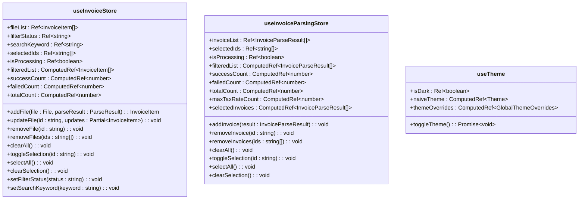

# 技术栈与依赖

<cite>
**本文档引用的文件**  
- [package.json](file://package.json)
- [vite.config.ts](file://vite.config.ts)
- [tsconfig.json](file://tsconfig.json)
- [main.ts](file://src/main.ts)
- [App.vue](file://src/App.vue)
- [index.ts](file://src/router/index.ts)
- [invoice.ts](file://src/stores/invoice.ts)
- [useTheme.ts](file://src/composables/useTheme.ts)
- [pdfParser.ts](file://src/utils/pdfParser.ts)
- [xmlParser.ts](file://src/utils/xmlParser.ts)
- [useFileParser.ts](file://src/composables/useFileParser.ts)
- [invoicePdfParser.ts](file://src/utils/invoicePdfParser.ts)
- [InvoiceParsing.vue](file://src/views/InvoiceParsing.vue)
- [FileUploader.vue](file://src/components/FileUploader.vue)
</cite>

## 目录
1. [项目技术架构概述](#项目技术架构概述)
2. [核心框架与库](#核心框架与库)
3. [关键依赖项及其用途](#关键依赖项及其用途)
4. [状态管理设计](#状态管理设计)
5. [前端路由机制](#前端路由机制)
6. [构建与开发工具](#构建与开发工具)
7. [类型系统与代码质量](#类型系统与代码质量)
8. [文件解析与数据处理](#文件解析与数据处理)

## 项目技术架构概述

FinanceTools项目采用现代化的前端技术栈，基于Vue 3构建响应式用户界面，使用TypeScript增强代码可维护性，并通过Vite实现高效的开发构建流程。项目架构采用组合式API组织逻辑，利用Pinia进行集中式状态管理，通过Vue Router实现前端路由控制。整体架构设计注重模块化、可维护性和用户体验。

**Section sources**
- [package.json](file://package.json#L1-L33)
- [vite.config.ts](file://vite.config.ts#L1-L18)
- [tsconfig.json](file://tsconfig.json#L1-L32)

## 核心框架与库

### Vue 3 组合式API

Vue 3的组合式API在本项目中被广泛应用于构建响应式用户界面。通过`<script setup>`语法糖，开发者能够以更简洁的方式组织组件逻辑，将相关的响应式状态、计算属性和方法组织在一起。这种模式提高了代码的可读性和可维护性，特别是在处理复杂业务逻辑时，能够更好地组织和复用代码。

组合式API的优势体现在多个方面：首先，它解决了选项式API中逻辑分散的问题，将相关功能的代码集中在一起；其次，它提供了更好的类型推断支持，与TypeScript配合更加紧密；最后，它便于逻辑复用，通过自定义组合式函数（composables）实现跨组件的逻辑共享。

**Section sources**
- [App.vue](file://src/App.vue#L16-L23)
- [InvoiceParsing.vue](file://src/views/InvoiceParsing.vue#L122-L303)
- [useTheme.ts](file://src/composables/useTheme.ts#L1-L87)

### Pinia 状态管理

Pinia作为Vue生态系统中的官方状态管理库，在本项目中扮演着核心角色。相比于Vuex，Pinia提供了更简洁的API、更好的TypeScript支持和更直观的模块化设计。项目中使用Pinia创建了多个store来管理不同模块的状态，如发票数据状态、发票解析状态等。

Pinia的设计优势体现在其极简的API设计、自动类型推断、模块化架构和开发工具集成等方面。通过`defineStore`函数，可以轻松创建具有响应式状态、计算属性和方法的store。Pinia的模块化设计允许按功能划分store，避免了单一store过大导致的维护困难问题。



**Diagram sources**
- [invoice.ts](file://src/stores/invoice.ts#L63-L255)
- [useTheme.ts](file://src/composables/useTheme.ts#L21-L85)

**Section sources**
- [main.ts](file://src/main.ts#L1-L12)
- [invoice.ts](file://src/stores/invoice.ts#L4-L255)
- [useTheme.ts](file://src/composables/useTheme.ts#L1-L87)

## 关键依赖项及其用途

### 文件解析依赖

#### pdfjs-dist - PDF解析库

`pdfjs-dist`是Mozilla开发的PDF.js库的分发版本，用于在浏览器中解析和渲染PDF文件。在本项目中，该库被用于解析电子发票PDF文件，提取其中的文本内容和关键字段信息。通过配置worker模式，PDF解析在后台线程中执行，避免阻塞主线程，保证了应用的响应性。

该库的选择理由包括：纯JavaScript实现，无需服务器端支持；支持现代浏览器；提供丰富的API用于文本提取和页面渲染；活跃的社区维护和持续更新。

**Section sources**
- [pdfParser.ts](file://src/utils/pdfParser.ts#L1-L243)
- [invoicePdfParser.ts](file://src/utils/invoicePdfParser.ts#L1-L349)

#### fast-xml-parser - XML解析库

`fast-xml-parser`是一个高性能的XML解析库，用于处理发票相关的XML文件。该库提供了简单易用的API，能够快速将XML文本转换为JavaScript对象，便于后续的数据提取和处理。相比于浏览器内置的DOMParser，该库具有更好的性能和更灵活的配置选项。

在项目中，该库被配置为忽略XML属性、保留文本节点、自动解析数值等，以适应发票数据的处理需求。其轻量级和高性能的特点使其成为处理大量XML发票文件的理想选择。

**Section sources**
- [xmlParser.ts](file://src/utils/xmlParser.ts#L1-L141)

#### xlsx - Excel导出库

`xlsx`库（也称为SheetJS）用于将发票数据导出为Excel文件格式。该库支持多种电子表格格式的读写操作，提供了简洁的API用于创建工作簿、添加工作表和设置单元格数据。在本项目中，用户可以将解析成功的发票记录导出为.xlsx文件，便于在Excel中进一步处理和分析。

选择该库的理由包括：支持广泛的Excel格式；纯JavaScript实现，无需服务器端支持；良好的文档和社区支持；活跃的维护和更新。

**Section sources**
- [useDataExport.ts](file://src/composables/useDataExport.ts)
- [useFileExport.ts](file://src/composables/useFileExport.ts)

### UI组件库

#### naive-ui - UI组件框架

`naive-ui`是一个基于Vue 3的UI组件库，提供了丰富的高质量组件，如按钮、输入框、表格、对话框等。该项目选择naive-ui的原因包括：完全使用TypeScript开发，提供完美的类型支持；设计简洁现代，易于定制；性能优化良好；文档完善且示例丰富。

在项目中，naive-ui的组件被广泛应用于构建用户界面，如使用`NCard`创建卡片容器，`NButton`创建按钮，`NInput`创建输入框，`NTable`创建数据表格等。这些组件不仅提供了良好的用户体验，还大大提高了开发效率。

**Section sources**
- [App.vue](file://src/App.vue#L2-L13)
- [InvoiceParsing.vue](file://src/views/InvoiceParsing.vue#L124-L138)

## 状态管理设计

### Pinia Store架构

项目采用Pinia进行状态管理，设计了多个store来管理不同模块的状态。这种模块化的设计使得状态管理更加清晰和可维护。每个store负责管理特定领域的状态，如发票数据、发票解析结果、用户主题偏好等。

Store的设计遵循了单一职责原则，每个store只关注一个特定的功能领域。Store中包含响应式状态、计算属性和方法，通过组合式API的方式组织，使得状态管理逻辑更加直观和易于理解。


**Diagram sources**
- [InvoiceParsing.vue](file://src/views/InvoiceParsing.vue#L188-L231)
- [useInvoicePdfParser.ts](file://src/composables/useInvoicePdfParser.ts#L96-L145)
- [invoice.ts](file://src/stores/invoice.ts#L106-L151)

**Section sources**
- [invoice.ts](file://src/stores/invoice.ts#L4-L255)
- [invoiceParsing.ts](file://src/stores/invoiceParsing.ts)
- [useInvoicePdfParser.ts](file://src/composables/useInvoicePdfParser.ts#L1-L173)

### 状态管理最佳实践

项目在状态管理方面遵循了多项最佳实践：

1. **状态集中管理**：所有共享状态都存储在Pinia store中，避免了组件间通过props和events传递状态的复杂性。

2. **响应式设计**：利用Vue 3的响应式系统，当store中的状态发生变化时，所有依赖该状态的组件都会自动更新。

3. **计算属性优化**：使用计算属性（computed）派生状态，如过滤后的列表、成功/失败计数等，避免在组件中重复计算逻辑。

4. **方法封装**：将状态变更逻辑封装在store的方法中，确保状态变更的可预测性和可追踪性。

5. **类型安全**：通过TypeScript为store的状态、计算属性和方法提供完整的类型定义，提高代码的可维护性和开发体验。

## 前端路由机制

### Vue Router配置

Vue Router是Vue官方的路由管理器，在本项目中用于实现前端路由控制。通过路由配置，项目实现了多页面应用的体验，用户可以在不同功能页面间导航而无需重新加载整个应用。

路由配置定义了路径与组件的映射关系，包括首页、发票重命名、发票解析等页面。同时配置了通配符路由，用于处理未找到的页面，提升用户体验。

```mermaid
flowchart TD
A[/] --> B[HomePage.vue]
C[/invoice-rename] --> D[InvoiceRename.vue]
E[/invoice-parsing] --> F[InvoiceParsing.vue]
G[/:pathMatch(.*)*] --> H[NotFound.vue]
style A fill:#409EFF,stroke:#333
style C fill:#409EFF,stroke:#333
style E fill:#409EFF,stroke:#333
style G fill:#F56C6C,stroke:#333
```

**Diagram sources**
- [index.ts](file://src/router/index.ts#L7-L32)

**Section sources**
- [main.ts](file://src/main.ts#L6-L11)
- [index.ts](file://src/router/index.ts#L1-L40)
- [App.vue](file://src/App.vue#L8)

### 路由守卫与元信息

项目利用Vue Router的元信息功能为每个路由添加额外信息，如页面标题。这为后续实现动态页面标题、权限控制等功能提供了基础。虽然当前项目未使用路由守卫，但架构上已为未来可能的权限验证、数据预加载等需求做好了准备。

路由的懒加载功能也被配置，虽然在当前小型项目中效果不明显，但在项目规模扩大时能够有效减少初始加载时间，提升用户体验。

## 构建与开发工具

### Vite构建工具

Vite作为现代化的前端构建工具，在本项目中带来了显著的开发效率提升。相比于传统的Webpack，Vite利用浏览器原生ES模块支持，实现了闪电般的开发服务器启动速度和即时的模块热更新。

Vite的配置简洁明了，通过`vite.config.ts`文件进行配置。项目中配置了Vue插件、路径别名（@指向src目录）、基础路径和开发服务器端口等。这些配置使得开发环境更加友好，提高了开发效率。


**Diagram sources**
- [vite.config.ts](file://vite.config.ts#L1-L18)

**Section sources**
- [vite.config.ts](file://vite.config.ts#L1-L18)
- [package.json](file://package.json#L7-L9)

### 开发脚本配置

项目通过package.json中的scripts字段定义了常用的开发命令：

- `dev`：启动开发服务器，提供热更新功能
- `build`：构建生产版本，生成优化的静态资源
- `preview`：预览生产构建结果
- `type-check`：进行类型检查，确保TypeScript类型安全

这些脚本简化了开发流程，开发者只需运行简单的命令即可完成开发、构建和预览等操作。

## 类型系统与代码质量

### TypeScript配置

TypeScript在本项目中发挥了重要作用，增强了代码的可维护性和类型安全。通过`tsconfig.json`文件进行配置，项目启用了严格的类型检查模式，包括严格类型检查、无未使用局部变量、无未使用参数等。

TypeScript的类型系统使得代码更加健壮，能够在开发阶段捕获潜在的错误。接口和类型定义为数据结构提供了清晰的契约，提高了代码的可读性和可维护性。

**Section sources**
- [tsconfig.json](file://tsconfig.json#L1-L32)
- [invoice.ts](file://src/stores/invoice.ts#L11-L34)
- [pdfParser.ts](file://src/utils/pdfParser.ts#L13-L20)

### 类型安全实践

项目在类型安全方面采用了多项实践：

1. **接口定义**：为关键数据结构定义接口，如发票数据、解析结果、状态等。

2. **泛型使用**：在store和组合式函数中使用泛型，提高代码的复用性和类型安全性。

3. **类型推断**：充分利用TypeScript的类型推断能力，减少显式类型注解的冗余。

4. **联合类型**：使用联合类型表示可能的值，如文件状态（'pending' | 'success' | 'failed'）。

5. **类型守卫**：在必要时使用类型守卫函数，确保运行时类型安全。

## 文件解析与数据处理

### 文件解析架构

项目实现了完整的文件解析架构，支持PDF和XML格式的发票文件解析。架构采用分层设计，将文件读取、文本提取、数据解析、验证等步骤分离，提高了代码的可维护性和可测试性。

对于PDF文件，使用pdfjs-dist库提取文本内容，然后通过正则表达式匹配关键字段。对于XML文件，使用fast-xml-parser库将XML转换为JavaScript对象，然后提取所需数据。


**Diagram sources**
- [useFileParser.ts](file://src/composables/useFileParser.ts#L22-L66)
- [pdfParser.ts](file://src/utils/pdfParser.ts#L31-L65)
- [xmlParser.ts](file://src/utils/xmlParser.ts#L42-L46)

**Section sources**
- [useFileParser.ts](file://src/composables/useFileParser.ts#L1-L109)
- [pdfParser.ts](file://src/utils/pdfParser.ts#L1-L243)
- [xmlParser.ts](file://src/utils/xmlParser.ts#L1-L141)

### 组合式函数设计

项目充分利用Vue 3的组合式API，设计了多个可复用的组合式函数（composables），如`useFileParser`、`useInvoicePdfParser`、`useTheme`等。这些函数封装了特定领域的逻辑，可以在多个组件间复用，提高了代码的复用性和可维护性。

组合式函数的设计遵循了单一职责原则，每个函数只关注一个特定的功能领域。通过返回响应式状态和方法，这些函数为使用它们的组件提供了所需的功能，同时保持了逻辑的封装性。