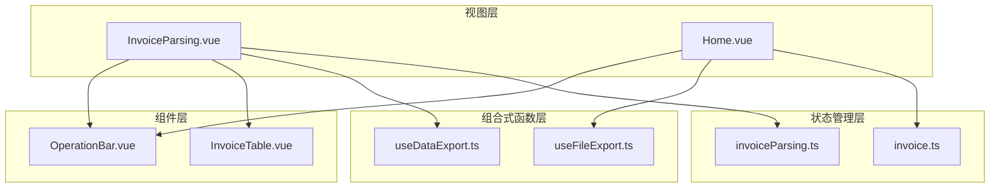
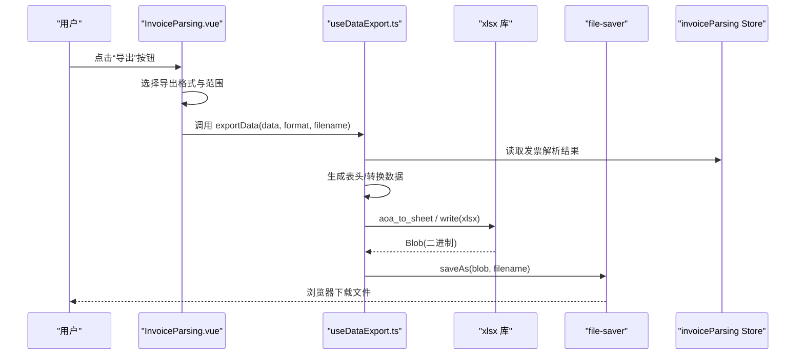
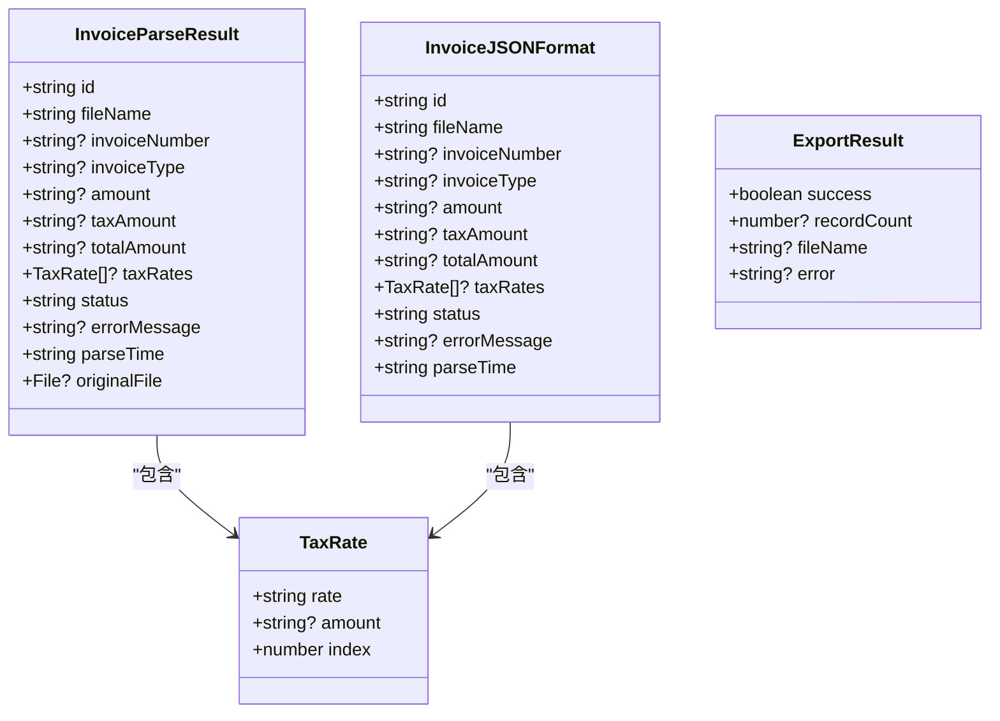
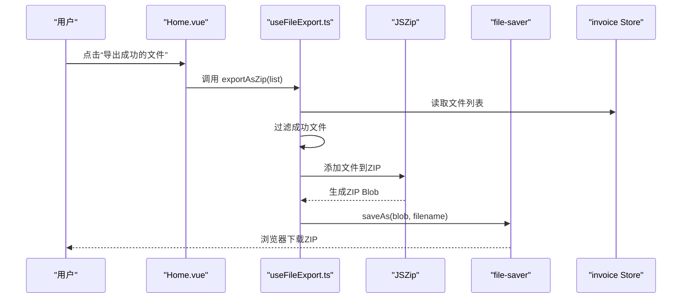
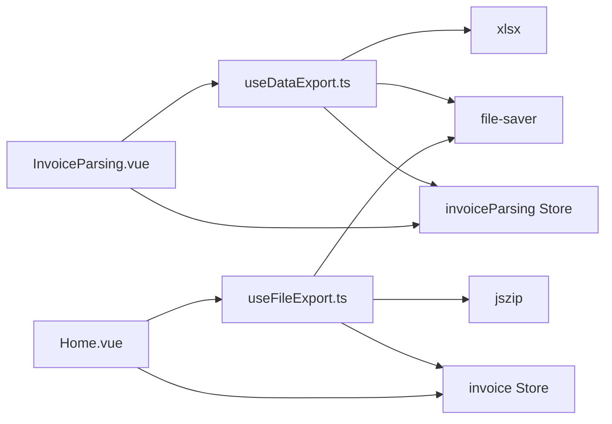

# 数据导出功能

<cite>
**本文引用的文件**
- [useDataExport.ts](file://src/composables/useDataExport.ts)
- [useFileExport.ts](file://src/composables/useFileExport.ts)
- [invoiceParsing.ts](file://src/stores/invoiceParsing.ts)
- [invoice.ts](file://src/stores/invoice.ts)
- [InvoiceParsing.vue](file://src/views/InvoiceParsing.vue)
- [Home.vue](file://src/views/Home.vue)
- [OperationBar.vue](file://src/components/OperationBar.vue)
- [InvoiceTable.vue](file://src/components/InvoiceTable.vue)
- [package.json](file://package.json)
- [README.md](file://README.md)
</cite>

## 目录
1. [简介](#简介)
2. [项目结构](#项目结构)
3. [核心组件](#核心组件)
4. [架构总览](#架构总览)
5. [详细组件分析](#详细组件分析)
6. [依赖关系分析](#依赖关系分析)
7. [性能考量](#性能考量)
8. [故障排查指南](#故障排查指南)
9. [结论](#结论)
10. [附录](#附录)

## 简介
本项目提供发票数据的浏览器端导出能力，支持将解析后的发票数据导出为 Excel（xlsx）与 JSON 两种格式；同时提供文件打包导出能力（ZIP），用于批量下载已成功解析的发票文件。本文档围绕以下目标展开：
- 详细说明数据导出技术实现与使用方式，覆盖 Excel、JSON 等多种格式
- 解释 useDataExport 组合式函数如何将发票数据转换为 xlsx 库可处理的格式
- 解释 useFileExport 如何利用 file-saver 实现浏览器端文件下载
- 提供导出接口调用方法、参数配置（如文件名、格式选项）
- 讨论响应性能优化（如大数据量分块导出思路）
- 提供完整流程示例：从用户点击导出按钮到生成文件
- 讨论安全性考虑（如防止 XSS 注入）与兼容性问题（不同浏览器下载行为差异）

## 项目结构
本项目采用 Vue 3 + Vite + Pinia 的前端架构，导出功能主要分布在以下模块：
- 组合式函数层：useDataExport.ts、useFileExport.ts
- 状态管理层：invoiceParsing.ts（发票解析结果）、invoice.ts（文件重命名结果）
- 视图层：InvoiceParsing.vue（发票解析页面）、Home.vue（文件重命名页面）
- 组件层：OperationBar.vue（操作栏）、InvoiceTable.vue（发票表格）

图表来源
- [InvoiceParsing.vue](file://src/views/InvoiceParsing.vue#L1-L328)
- [Home.vue](file://src/views/Home.vue#L1-L247)
- [OperationBar.vue](file://src/components/OperationBar.vue#L1-L119)
- [InvoiceTable.vue](file://src/components/InvoiceTable.vue#L1-L182)
- [useDataExport.ts](file://src/composables/useDataExport.ts#L1-L308)
- [useFileExport.ts](file://src/composables/useFileExport.ts#L1-L94)
- [invoiceParsing.ts](file://src/stores/invoiceParsing.ts#L1-L241)
- [invoice.ts](file://src/stores/invoice.ts#L1-L256)

章节来源
- [InvoiceParsing.vue](file://src/views/InvoiceParsing.vue#L1-L328)
- [Home.vue](file://src/views/Home.vue#L1-L247)
- [OperationBar.vue](file://src/components/OperationBar.vue#L1-L119)
- [InvoiceTable.vue](file://src/components/InvoiceTable.vue#L1-L182)
- [useDataExport.ts](file://src/composables/useDataExport.ts#L1-L308)
- [useFileExport.ts](file://src/composables/useFileExport.ts#L1-L94)
- [invoiceParsing.ts](file://src/stores/invoiceParsing.ts#L1-L241)
- [invoice.ts](file://src/stores/invoice.ts#L1-L256)

## 核心组件
- useDataExport：负责将发票解析结果导出为 Excel 或 JSON，内部通过 xlsx 与 file-saver 实现
- useFileExport：负责将已解析成功的发票文件打包为 ZIP 并触发下载
- invoiceParsing Store：维护发票解析结果（含多税率、状态、错误信息等）
- Home/InvoiceParsing 页面：提供导出入口与交互控制

章节来源
- [useDataExport.ts](file://src/composables/useDataExport.ts#L1-L308)
- [useFileExport.ts](file://src/composables/useFileExport.ts#L1-L94)
- [invoiceParsing.ts](file://src/stores/invoiceParsing.ts#L1-L241)
- [InvoiceParsing.vue](file://src/views/InvoiceParsing.vue#L1-L328)
- [Home.vue](file://src/views/Home.vue#L1-L247)

## 架构总览
下图展示了从用户点击导出按钮到文件生成的关键流程，包括 Excel/JSON 导出与 ZIP 导出两条路径。

图表来源
- [InvoiceParsing.vue](file://src/views/InvoiceParsing.vue#L270-L302)
- [useDataExport.ts](file://src/composables/useDataExport.ts#L191-L201)
- [invoiceParsing.ts](file://src/stores/invoiceParsing.ts#L1-L241)

## 详细组件分析

### useDataExport 组合式函数
该函数提供统一的导出接口，支持 Excel 与 JSON 两种格式，并内置性能日志与错误处理。

- 主要职责
  - 导出为 Excel：计算最大税率数量、生成动态表头、转换数据为二维数组、创建工作簿、写入 xlsx、生成 Blob 并触发下载
  - 导出为 JSON：转换数据为可序列化格式、格式化 JSON、生成 Blob 并触发下载
  - 统一导出接口：根据 format 参数路由到具体导出逻辑
  - 性能监控：在开发环境下记录耗时
  - 错误处理：捕获异常并返回标准化结果

- 关键实现点
  - 动态表头生成：根据最大税率数量动态扩展“税率N”列
  - 数据转换：Excel 使用二维数组，JSON 移除不可序列化字段
  - 文件名策略：带时间戳的唯一文件名，避免覆盖
  - 下载触发：使用 file-saver.saveAs

- 接口定义与参数
  - exportData(data, format, filename)
    - data: 发票解析结果数组
    - format: 'excel' | 'json'
    - filename: 导出文件基础名，默认为“发票解析结果”
  - 返回值：ExportResult，包含 success、recordCount、fileName、error

- 复杂度与性能
  - Excel 导出：O(n*(m+k))，其中 n 为记录数，m 为固定列数，k 为最大税率数
  - JSON 导出：O(n)，遍历并序列化
  - 大数据量建议：分批导出（见“性能考量”）

- 安全性与兼容性
  - XSS 防护：导出数据来自受控解析结果，未包含 HTML 片段；仍建议对用户输入进行白名单校验
  - 兼容性：file-saver 在主流浏览器表现一致；部分浏览器可能弹出下载确认

章节来源
- [useDataExport.ts](file://src/composables/useDataExport.ts#L1-L308)
- [InvoiceParsing.vue](file://src/views/InvoiceParsing.vue#L270-L302)

#### 类图：导出相关类型与关系

图表来源
- [invoiceParsing.ts](file://src/stores/invoiceParsing.ts#L18-L31)
- [useDataExport.ts](file://src/composables/useDataExport.ts#L14-L34)

### useFileExport 组合式函数
该函数负责将已解析成功的发票文件打包为 ZIP 并触发下载，支持仅导出成功文件或全部文件。

- 主要职责
  - 过滤导出文件：默认仅导出状态为 success 的文件
  - 打包：使用 JSZip 生成 ZIP Blob
  - 下载：使用 file-saver.saveAs

- 关键实现点
  - 文件过滤：exportAll=false 时仅导出成功文件
  - 名称策略：带时间戳的 ZIP 文件名
  - 错误处理：无文件可导出时抛出错误

- 接口定义与参数
  - exportAsZip(invoiceList, exportAll=false)
    - invoiceList: 文件重命名结果数组（包含原始文件对象）
    - exportAll: 是否导出全部文件（含失败）
  - 返回值：ExportResult，包含 success、fileCount、fileName、error

- 兼容性与安全
  - 兼容性：JSZip 与 file-saver 在主流浏览器表现稳定
  - 安全性：仅导出原始文件对象，未做额外校验；建议在上层确保文件来源可信

章节来源
- [useFileExport.ts](file://src/composables/useFileExport.ts#L1-L94)
- [Home.vue](file://src/views/Home.vue#L200-L215)

#### 序列图：ZIP 导出流程

图表来源
- [Home.vue](file://src/views/Home.vue#L200-L215)
- [useFileExport.ts](file://src/composables/useFileExport.ts#L28-L73)
- [invoice.ts](file://src/stores/invoice.ts#L1-L256)

### 发票解析结果存储（invoiceParsing Store）
该 Store 维护发票解析结果，提供筛选、搜索、选中、统计等功能，并计算最大税率数量用于动态列展示。

- 关键字段
  - invoiceList：发票解析结果数组
  - filterStatus/searchKeyword：筛选与搜索条件
  - selectedIds：选中记录 ID
  - maxTaxRateCount：最大税率数量（用于动态列）

- 导出数据来源
  - 导出时根据模式选择全部、成功或选中记录
  - 传入 useDataExport.exportData 的 data 即来自该 Store 的 invoiceList 或其子集

章节来源
- [invoiceParsing.ts](file://src/stores/invoiceParsing.ts#L1-L241)
- [InvoiceParsing.vue](file://src/views/InvoiceParsing.vue#L270-L302)

### 文件重命名结果存储（invoice Store）
该 Store 维护文件重命名结果，包含原始文件对象、新文件名、状态与错误信息，用于 ZIP 导出。

- 关键字段
  - fileList：文件重命名结果数组
  - selectedIds：选中文件 ID
  - successCount/failedCount/totalCount：统计信息

- 导出数据来源
  - 导出时使用 useFileExport.exportAsZip，传入 fileList
  - 默认仅导出状态为 success 的文件

章节来源
- [invoice.ts](file://src/stores/invoice.ts#L1-L256)
- [Home.vue](file://src/views/Home.vue#L200-L215)

### 导出页面与交互
- 发票解析页面（InvoiceParsing.vue）
  - 提供导出下拉菜单：Excel/JSON，支持导出全部、成功、选中三种模式
  - 调用 useDataExport.exportData 执行导出
  - 显示导出进度与结果消息

- 文件重命名页面（Home.vue）
  - 提供操作栏（OperationBar.vue），包含导出按钮
  - 调用 useFileExport.exportAsZip 执行导出
  - 显示进度模态框与结果消息

章节来源
- [InvoiceParsing.vue](file://src/views/InvoiceParsing.vue#L1-L328)
- [Home.vue](file://src/views/Home.vue#L1-L247)
- [OperationBar.vue](file://src/components/OperationBar.vue#L1-L119)

## 依赖关系分析
- 外部依赖
  - xlsx：Excel 写入与工作簿生成
  - file-saver：浏览器端文件下载
  - jszip：ZIP 打包
  - naive-ui：UI 组件库
  - pinia：状态管理
  - vue：框架

- 内部依赖
  - useDataExport 依赖 invoiceParsing Store 的数据
  - useFileExport 依赖 invoice Store 的数据
  - 页面组件通过组合式函数暴露导出能力

图表来源
- [useDataExport.ts](file://src/composables/useDataExport.ts#L1-L308)
- [useFileExport.ts](file://src/composables/useFileExport.ts#L1-L94)
- [InvoiceParsing.vue](file://src/views/InvoiceParsing.vue#L1-L328)
- [Home.vue](file://src/views/Home.vue#L1-L247)
- [package.json](file://package.json#L12-L31)

章节来源
- [package.json](file://package.json#L12-L31)
- [useDataExport.ts](file://src/composables/useDataExport.ts#L1-L308)
- [useFileExport.ts](file://src/composables/useFileExport.ts#L1-L94)
- [InvoiceParsing.vue](file://src/views/InvoiceParsing.vue#L1-L328)
- [Home.vue](file://src/views/Home.vue#L1-L247)

## 性能考量
- Excel 导出复杂度
  - O(n*(m+k))，其中 n 为记录数，m 为固定列数，k 为最大税率数
  - 大数据量建议：分批导出（例如每批 1000 条），并在 UI 中显示进度
- JSON 导出复杂度
  - O(n)，适合大规模数据导出
- 性能监控
  - 开发环境下记录耗时，便于定位瓶颈
- 内存与下载
  - 大文件下载可能占用较多内存，建议在导出前进行数据裁剪或去重
  - 对于超大 Excel，可考虑服务端导出或分片写入

[本节为通用性能指导，无需特定文件来源]

## 故障排查指南
- 常见错误
  - 没有可导出的数据：导出前检查数据源是否为空
  - 导出失败：查看返回的 error 字段，结合控制台日志定位
  - 下载未触发：检查浏览器下载设置与拦截器
- 建议排查步骤
  - 确认导出数据非空且格式正确
  - 在开发环境下观察性能日志
  - 检查 file-saver 与 xlsx/jszip 的版本兼容性
  - 对于 ZIP 导出，确认原始文件对象有效

章节来源
- [useDataExport.ts](file://src/composables/useDataExport.ts#L118-L127)
- [useDataExport.ts](file://src/composables/useDataExport.ts#L177-L186)
- [useFileExport.ts](file://src/composables/useFileExport.ts#L39-L41)

## 结论
本项目通过 useDataExport 与 useFileExport 两个组合式函数，实现了发票数据的浏览器端导出能力。Excel 导出支持动态税率列与列宽设置，JSON 导出提供简洁的结构化数据；ZIP 导出则满足批量文件下载场景。配合状态管理与页面交互，用户可以灵活选择导出范围与格式。建议在生产环境中关注大数据量的分批导出策略与浏览器兼容性，确保良好的用户体验。

[本节为总结性内容，无需特定文件来源]

## 附录

### 使用示例：从点击到生成文件
- 发票解析页面（Excel/JSON）
  - 用户在页面选择导出格式与范围（全部/成功/选中）
  - 页面调用 useDataExport.exportData，传入对应数据与文件名
  - 函数内部生成表头/转换数据、写入 xlsx、生成 Blob 并触发下载
  - 成功后返回记录数与文件名，失败返回错误信息
- 文件重命名页面（ZIP）
  - 用户点击“导出成功的文件”，页面调用 useFileExport.exportAsZip
  - 函数过滤成功文件、打包为 ZIP、触发下载
  - 成功后返回文件数与文件名，失败返回错误信息

章节来源
- [InvoiceParsing.vue](file://src/views/InvoiceParsing.vue#L270-L302)
- [Home.vue](file://src/views/Home.vue#L200-L215)
- [useDataExport.ts](file://src/composables/useDataExport.ts#L191-L201)
- [useFileExport.ts](file://src/composables/useFileExport.ts#L28-L73)

### 安全性与兼容性
- 安全性
  - 导出数据来自解析结果，未包含 HTML；仍建议对用户输入进行白名单校验
  - 避免在导出文件名中注入特殊字符
- 兼容性
  - file-saver 在主流浏览器表现一致；部分浏览器可能弹出下载确认
  - xlsx 与 jszip 的版本需与当前项目依赖匹配

章节来源
- [README.md](file://README.md#L1-L41)
- [package.json](file://package.json#L12-L31)