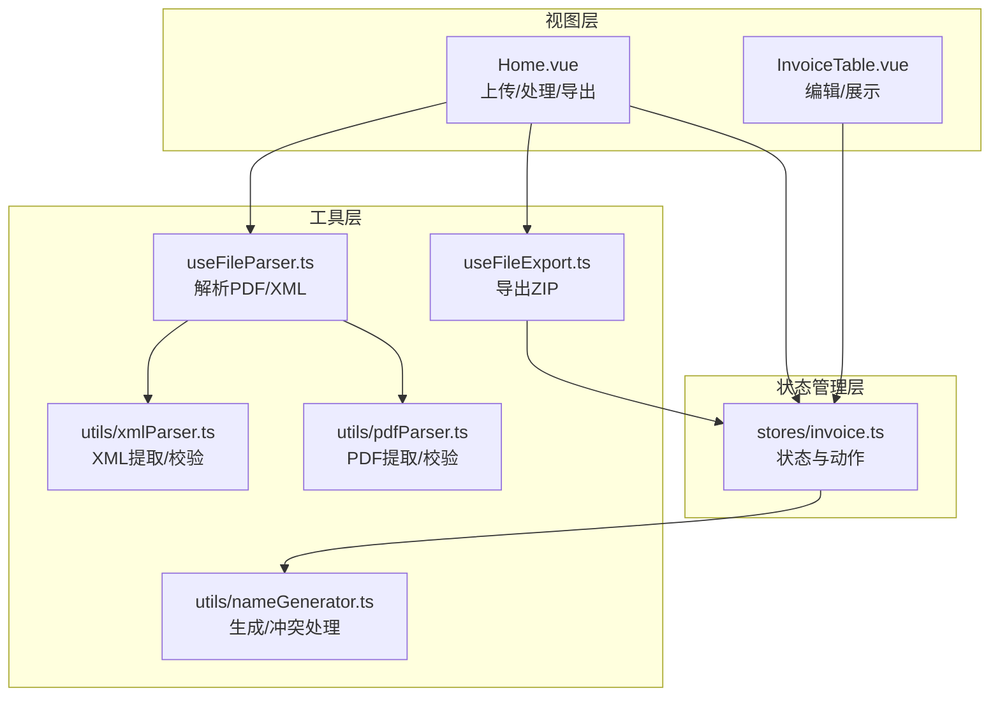
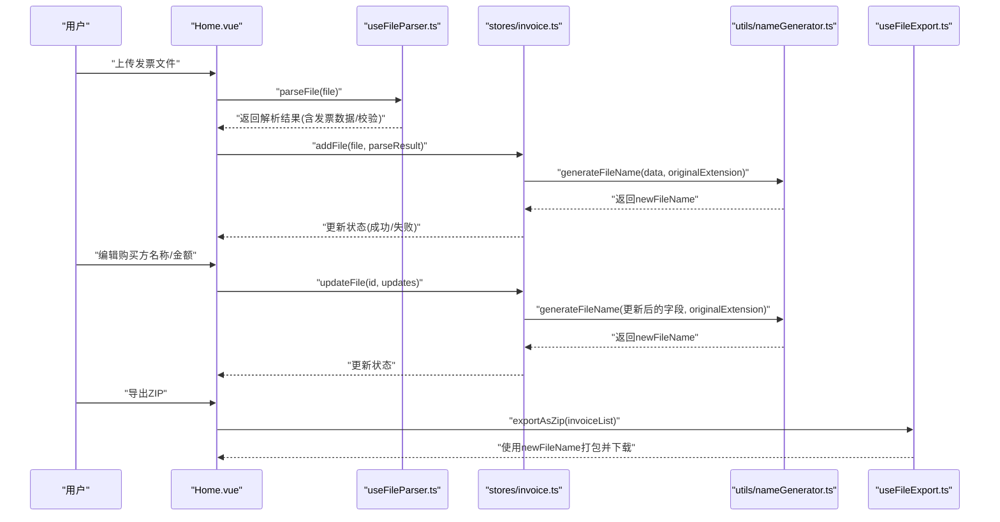
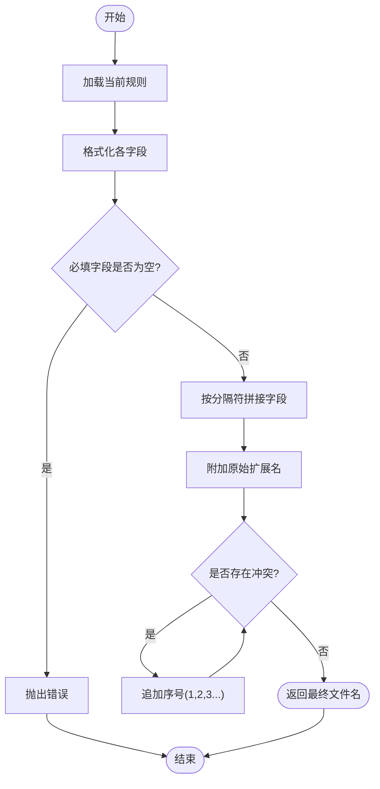
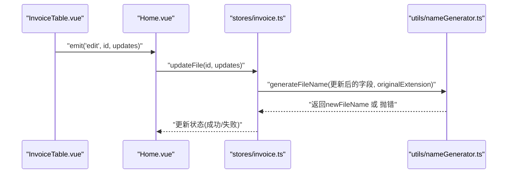
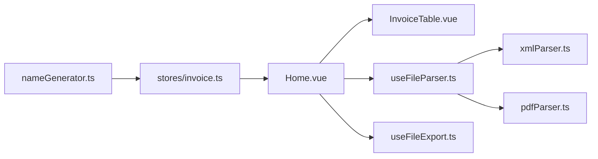

# 文件名生成系统

<cite>
**本文引用的文件**
- [nameGenerator.ts](file://src/utils/nameGenerator.ts)
- [invoice.ts](file://src/stores/invoice.ts)
- [Home.vue](file://src/views/Home.vue)
- [InvoiceTable.vue](file://src/components/InvoiceTable.vue)
- [useFileParser.ts](file://src/composables/useFileParser.ts)
- [useFileExport.ts](file://src/composables/useFileExport.ts)
- [xmlParser.ts](file://src/utils/xmlParser.ts)
- [pdfParser.ts](file://src/utils/pdfParser.ts)
</cite>

## 更新摘要
**变更内容**
- 将原 JavaScript 模块 `nameGenerator.js` 更新为 TypeScript 模块 `nameGenerator.ts`，提升类型安全性与代码健壮性
- 所有相关引用（如状态管理、解析器等）均已适配 TypeScript 类型定义
- 文档中所有文件引用路径已从 `.js` 更新为 `.ts`
- 接口定义（如 `InvoiceData`、`NamingRule`）已通过 TypeScript 接口明确化，增强可维护性

## 目录
1. [简介](#简介)
2. [项目结构](#项目结构)
3. [核心组件](#核心组件)
4. [架构总览](#架构总览)
5. [详细组件分析](#详细组件分析)
6. [依赖分析](#依赖分析)
7. [性能考虑](#性能考虑)
8. [故障排查指南](#故障排查指南)
9. [结论](#结论)
10. [附录](#附录)

## 简介
本文档面向“发票重命名”功能的文件名生成系统，聚焦于 `nameGenerator.ts` 模块的设计与实现，解释其如何依据发票解析结果中的关键字段（如购买方名称、价税合计等）按预设规则生成新文件名；说明字段格式化策略（金额数字处理、日期格式化、特殊字符清理、长度限制等），以及文件名冲突的处理机制（序号追加）。同时阐述该模块与状态管理 Store 的集成方式，使用户在编辑发票信息后能动态更新“新文件名”，并为开发者提供扩展命名规则的接口与最佳实践。

## 项目结构
围绕文件名生成系统的关键文件分布如下：
- utils/nameGenerator.ts：文件名生成与冲突处理的核心实现（已迁移至 TypeScript）
- stores/invoice.ts：状态管理，负责维护发票条目、触发文件名生成与更新（已适配 TypeScript）
- views/Home.vue：上传与处理流程入口，调用解析与导出能力
- components/InvoiceTable.vue：表格展示与编辑交互，触发 Store 更新
- composables/useFileParser.ts：文件解析组合式函数，产出解析结果
- composables/useFileExport.ts：导出 ZIP 组合式函数，使用新文件名进行打包
- utils/xmlParser.ts、utils/pdfParser.ts：发票数据提取与校验

图表来源
- [Home.vue](file://src/views/Home.vue#L1-L236)
- [InvoiceTable.vue](file://src/components/InvoiceTable.vue#L1-L174)
- [invoice.ts](file://src/stores/invoice.ts#L1-L256)
- [useFileParser.ts](file://src/composables/useFileParser.ts#L1-L102)
- [useFileExport.ts](file://src/composables/useFileExport.ts#L1-L80)
- [nameGenerator.ts](file://src/utils/nameGenerator.ts#L1-L250)
- [xmlParser.ts](file://src/utils/xmlParser.ts#L1-L118)
- [pdfParser.ts](file://src/utils/pdfParser.ts#L1-L227)

章节来源
- [Home.vue](file://src/views/Home.vue#L1-L236)
- [InvoiceTable.vue](file://src/components/InvoiceTable.vue#L1-L174)
- [invoice.ts](file://src/stores/invoice.ts#L1-L256)
- [useFileParser.ts](file://src/composables/useFileParser.ts#L1-L102)
- [useFileExport.ts](file://src/composables/useFileExport.ts#L1-L80)
- [nameGenerator.ts](file://src/utils/nameGenerator.ts#L1-L250)
- [xmlParser.ts](file://src/utils/xmlParser.ts#L1-L118)
- [pdfParser.ts](file://src/utils/pdfParser.ts#L1-L227)

## 核心组件
- 文件名生成器（nameGenerator.ts）
  - 规则定义：通过 `NAMING_RULES` 配置模板、分隔符与字段集，当前默认规则为“购买方名称_金额”
  - 字段格式化：针对不同字段提供格式化器，确保生成的文件名合法、可读且符合平台限制
  - 冲突处理：当同一批次中出现重复文件名时，通过追加序号解决
  - 批量生成：支持对多条发票数据批量生成并处理冲突
  - 规则切换：提供切换当前规则的方法，便于开发者扩展与测试
  - 类型安全：使用 TypeScript 接口（`InvoiceData`, `NamingRule`, `GenerateResult`）明确数据结构，提升代码可维护性

- 状态管理（stores/invoice.ts）
  - 在添加文件时，若解析成功则调用生成器生成新文件名；失败则记录错误
  - 在用户编辑购买方名称或金额时，重新计算新文件名并更新状态
  - 维护文件列表、筛选、搜索、选择等状态与计算属性
  - 已使用 TypeScript 类型注解（如 `Ref`, `ComputedRef`, `Partial`）增强类型安全

- 表格与编辑（components/InvoiceTable.vue）
  - 提供输入控件用于编辑购买方名称、金额与新文件名
  - 将编辑事件回传给父组件，由父组件触发 Store 更新
  - 使用 `<script setup lang="ts">` 支持类型推导

- 解析与导出（composables/useFileParser.ts、useFileExport.ts）
  - 解析：分别支持 PDF 与 XML，输出包含发票字段的数据与校验结果
  - 导出：将状态中“成功”的条目按新文件名打包为 ZIP

章节来源
- [nameGenerator.ts](file://src/utils/nameGenerator.ts#L1-L250)
- [invoice.ts](file://src/stores/invoice.ts#L1-L256)
- [InvoiceTable.vue](file://src/components/InvoiceTable.vue#L1-L174)
- [useFileParser.ts](file://src/composables/useFileParser.ts#L1-L102)
- [useFileExport.ts](file://src/composables/useFileExport.ts#L1-L80)

## 架构总览
文件名生成系统在整体流程中的位置如下：

图表来源
- [Home.vue](file://src/views/Home.vue#L1-L236)
- [useFileParser.ts](file://src/composables/useFileParser.ts#L1-L102)
- [invoice.ts](file://src/stores/invoice.ts#L1-L256)
- [nameGenerator.ts](file://src/utils/nameGenerator.ts#L1-L250)
- [useFileExport.ts](file://src/composables/useFileExport.ts#L1-L80)

## 详细组件分析

### 文件名生成器（nameGenerator.ts）
- 规则体系
  - CURRENT_RULE：当前启用的规则键
  - NAMING_RULES：规则集合，每条规则包含模板、分隔符与字段列表
  - 支持的规则示例：购买方名称_金额、发票类型_购买方名称_金额、购买方名称_开票日期_金额、发票号码_购买方名称
- 字段格式化器
  - 购买方名称：去除非法字符、限制长度、去除空白
  - 发票类型：去除“电子发票”字样与括号，保持简洁
  - 价税合计：转为浮点数并保留两位小数
  - 开票日期：支持“YYYY年M月D日”与常见分隔符，统一格式为YYYYMMDD
  - 发票号码：去除前后空白
  - 销售方名称：复用购买方名称格式化逻辑
- 生成流程
  - 读取 CURRENT_RULE 对应规则
  - 对规则涉及的每个字段执行格式化
  - 校验必填字段非空，否则抛出错误
  - 使用分隔符拼接字段得到文件名主体，附加原始扩展名
- 冲突处理
  - 分离文件名与扩展名
  - 若与已有名称冲突，追加“_序号”，直到唯一为止
- 批量生成
  - 遍历发票数据列表，逐条生成并处理冲突，收集结果（成功/失败与错误信息）

图表来源
- [nameGenerator.ts](file://src/utils/nameGenerator.ts#L1-L250)

章节来源
- [nameGenerator.ts](file://src/utils/nameGenerator.ts#L1-L250)

### 状态管理（stores/invoice.ts）
- 添加文件
  - 从解析结果中提取发票类型、购买方名称、价税合计等字段
  - 若解析成功，调用生成器生成新文件名；失败则记录错误信息
  - 将条目加入文件列表并设置状态
- 更新文件
  - 当用户编辑购买方名称或金额时，重新生成新文件名并更新状态
  - 若生成失败，更新状态为失败并记录错误
- 其他能力
  - 维护筛选状态、搜索关键词、选中项、处理状态等
  - 提供增删改查、全选/清空、统计计数等方法

图表来源
- [InvoiceTable.vue](file://src/components/InvoiceTable.vue#L1-L174)
- [Home.vue](file://src/views/Home.vue#L1-L236)
- [invoice.ts](file://src/stores/invoice.ts#L1-L256)
- [nameGenerator.ts](file://src/utils/nameGenerator.ts#L1-L250)

章节来源
- [invoice.ts](file://src/stores/invoice.ts#L1-L256)
- [InvoiceTable.vue](file://src/components/InvoiceTable.vue#L1-L174)
- [Home.vue](file://src/views/Home.vue#L1-L236)

### 解析与导出（useFileParser.ts、useFileExport.ts）
- 解析
  - PDF：读取二进制内容，逐页提取文本，再从文本中抽取发票字段
  - XML：读取文本，解析为对象，提取发票字段
  - 返回统一的解析结果（success/data/errors/type）
- 导出
  - 过滤状态为“成功”的条目，使用新文件名作为目标文件名
  - 生成 ZIP 并下载，提供导出统计信息

章节来源
- [useFileParser.ts](file://src/composables/useFileParser.ts#L1-L102)
- [useFileExport.ts](file://src/composables/useFileExport.ts#L1-L80)
- [xmlParser.ts](file://src/utils/xmlParser.ts#L1-L118)
- [pdfParser.ts](file://src/utils/pdfParser.ts#L1-L227)

## 依赖分析
- 模块耦合
  - nameGenerator.ts 与 invoice.ts：通过 Store 的 addFile 与 updateFile 调用生成器，形成稳定的接口契约
  - Home.vue 与 InvoiceTable.vue：通过事件与 Store 协作，驱动状态变更
  - useFileParser.ts 与解析器：为 Store 提供解析数据，间接影响文件名生成
  - useFileExport.ts：消费 Store 中的状态，决定使用新文件名还是原文件名
- 外部依赖
  - PDF.js：用于 PDF 文本提取
  - JSZip 与 file-saver：用于导出 ZIP
- 规则扩展点
  - NAMING_RULES：新增规则无需修改生成器主流程
  - fieldFormatters：新增字段格式化器即可适配新规则
  - setCurrentRule：运行时切换规则，便于灰度与对比

图表来源
- [nameGenerator.ts](file://src/utils/nameGenerator.ts#L1-L250)
- [invoice.ts](file://src/stores/invoice.ts#L1-L256)
- [Home.vue](file://src/views/Home.vue#L1-L236)
- [InvoiceTable.vue](file://src/components/InvoiceTable.vue#L1-L174)
- [useFileParser.ts](file://src/composables/useFileParser.ts#L1-L102)
- [useFileExport.ts](file://src/composables/useFileExport.ts#L1-L80)
- [xmlParser.ts](file://src/utils/xmlParser.ts#L1-L118)
- [pdfParser.ts](file://src/utils/pdfParser.ts#L1-L227)

## 性能考虑
- 批量生成冲突处理
  - generateFileNames 会逐条生成并检查冲突，时间复杂度近似 O(n^2)（最坏情况），建议在大量文件场景下控制单次处理数量或采用更高效的冲突检测策略（例如先构建哈希表）
- 字段格式化成本
  - 正则替换与字符串截断为常数级操作，对 n 条数据总体开销较小
- 并行解析
  - useFileParser.ts 已采用分批并行处理，减少 UI 阻塞，提升吞吐
- 导出阶段
  - ZIP 生成与下载为异步操作，避免阻塞主线程

## 故障排查指南
- 生成失败：字段缺失或为空
  - 现象：抛出“字段缺失或为空”错误
  - 排查：确认解析结果中对应字段是否正确提取；检查字段格式化器是否将有效值转换为空串
  - 参考路径
    - [nameGenerator.ts](file://src/utils/nameGenerator.ts#L125-L145)
- 规则不存在
  - 现象：抛出“命名规则不存在”错误
  - 排查：确认 CURRENT_RULE 是否存在于 NAMING_RULES；使用 setCurrentRule 切换到可用规则
  - 参考路径
    - [nameGenerator.ts](file://src/utils/nameGenerator.ts#L118-L145)
    - [nameGenerator.ts](file://src/utils/nameGenerator.ts#L202-L211)
- 冲突导致文件名异常
  - 现象：生成的新文件名被追加序号
  - 排查：确认是否存在同名文件；检查扩展名是否正确分离
  - 参考路径
    - [nameGenerator.ts](file://src/utils/nameGenerator.ts#L147-L166)
- 用户编辑后未更新
  - 现象：编辑购买方名称或金额后，新文件名未变化
  - 排查：确认 InvoiceTable.vue 的编辑事件是否正确传递至 Home.vue；Home.vue 是否调用 store.updateFile；Store 的 updateFile 是否触发重新生成
  - 参考路径
    - [InvoiceTable.vue](file://src/components/InvoiceTable.vue#L64-L103)
    - [Home.vue](file://src/views/Home.vue#L158-L163)
    - [invoice.ts](file://src/stores/invoice.ts#L101-L124)
- 导出文件名不符合预期
  - 现象：导出 ZIP 中文件名为原文件名而非新文件名
  - 排查：确认导出逻辑使用的是 newFileName；检查状态中条目的 status 是否为 success
  - 参考路径
    - [useFileExport.ts](file://src/composables/useFileExport.ts#L21-L33)
    - [invoice.ts](file://src/stores/invoice.ts#L19-L39)

章节来源
- [nameGenerator.ts](file://src/utils/nameGenerator.ts#L118-L166)
- [InvoiceTable.vue](file://src/components/InvoiceTable.vue#L64-L103)
- [Home.vue](file://src/views/Home.vue#L158-L163)
- [invoice.ts](file://src/stores/invoice.ts#L101-L124)
- [useFileExport.ts](file://src/composables/useFileExport.ts#L21-L33)

## 结论
文件名生成系统通过清晰的规则定义、稳健的字段格式化与冲突处理机制，实现了对发票文件的自动化重命名。它与状态管理 Store 紧密集成，使得用户在编辑关键字段后能够即时获得新的文件名，从而提升工作流效率与一致性。开发者可通过扩展规则与格式化器轻松适配更多命名需求，并利用现有接口进行测试与灰度发布。模块已迁移至 TypeScript，显著提升了代码的类型安全性和可维护性。

## 附录

### 命名规则与字段格式化一览
- 当前启用规则：购买方名称_金额
- 可用规则：
  - purchaser_amount：购买方名称_金额
  - invoice_purchaser_amount：发票类型_购买方名称_金额
  - purchaser_date_amount：购买方名称_开票日期_金额
  - invoice_code_purchaser：发票号码_购买方名称
- 字段格式化要点：
  - 购买方名称：去除非法字符、限制长度、去除空白
  - 发票类型：去除“电子发票”字样与括号
  - 价税合计：数值标准化，保留两位小数
  - 开票日期：统一为 YYYYMMDD
  - 发票号码：去除空白
  - 销售方名称：复用购买方名称格式化

章节来源
- [nameGenerator.ts](file://src/utils/nameGenerator.ts#L9-L35)
- [nameGenerator.ts](file://src/utils/nameGenerator.ts#L40-L113)

### 扩展命名规则的最佳实践
- 新增规则
  - 在 NAMING_RULES 中添加新规则，指定模板、分隔符与字段列表
  - 如需新字段，为其编写格式化器并加入 fieldFormatters
- 切换规则
  - 使用 setCurrentRule 切换当前规则；通过 getCurrentRule 与 getAvailableRules 辅助调试
- 冲突处理
  - 保持 handleFileNameConflict 的行为一致；在批量生成时注意性能优化
- UI 集成
  - 在 UI 层提供规则切换入口，便于用户选择合适的命名风格

章节来源
- [nameGenerator.ts](file://src/utils/nameGenerator.ts#L9-L35)
- [nameGenerator.ts](file://src/utils/nameGenerator.ts#L147-L200)
- [nameGenerator.ts](file://src/utils/nameGenerator.ts#L202-L250)