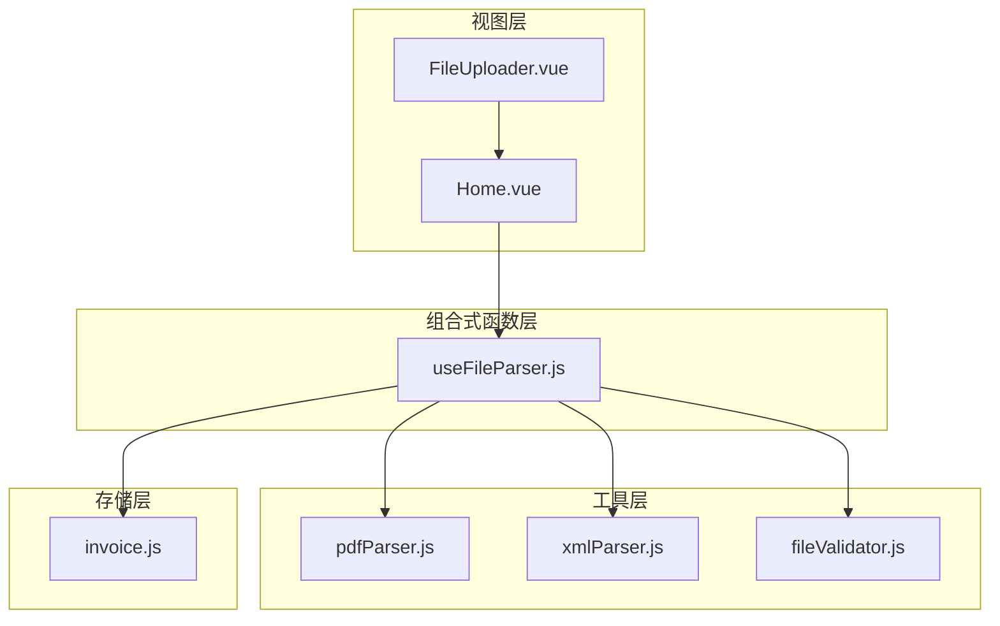
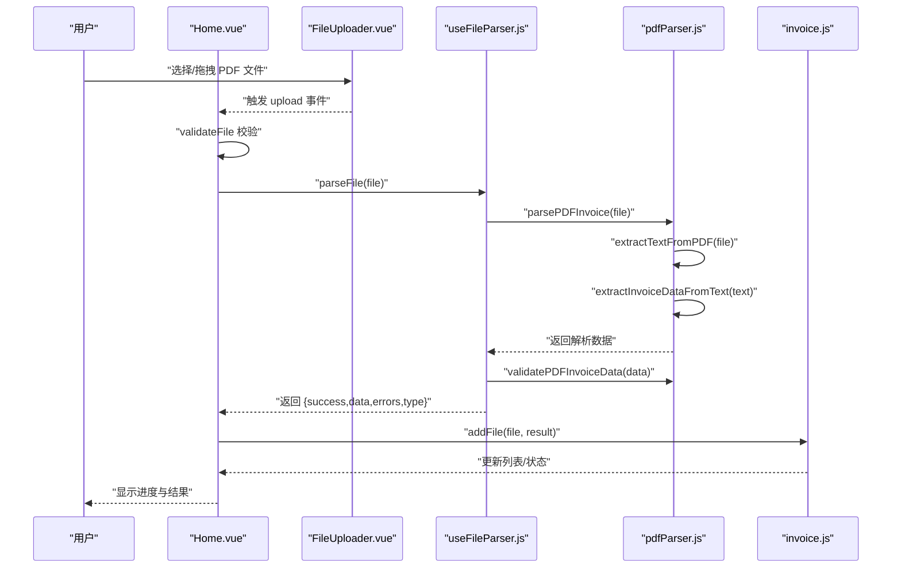
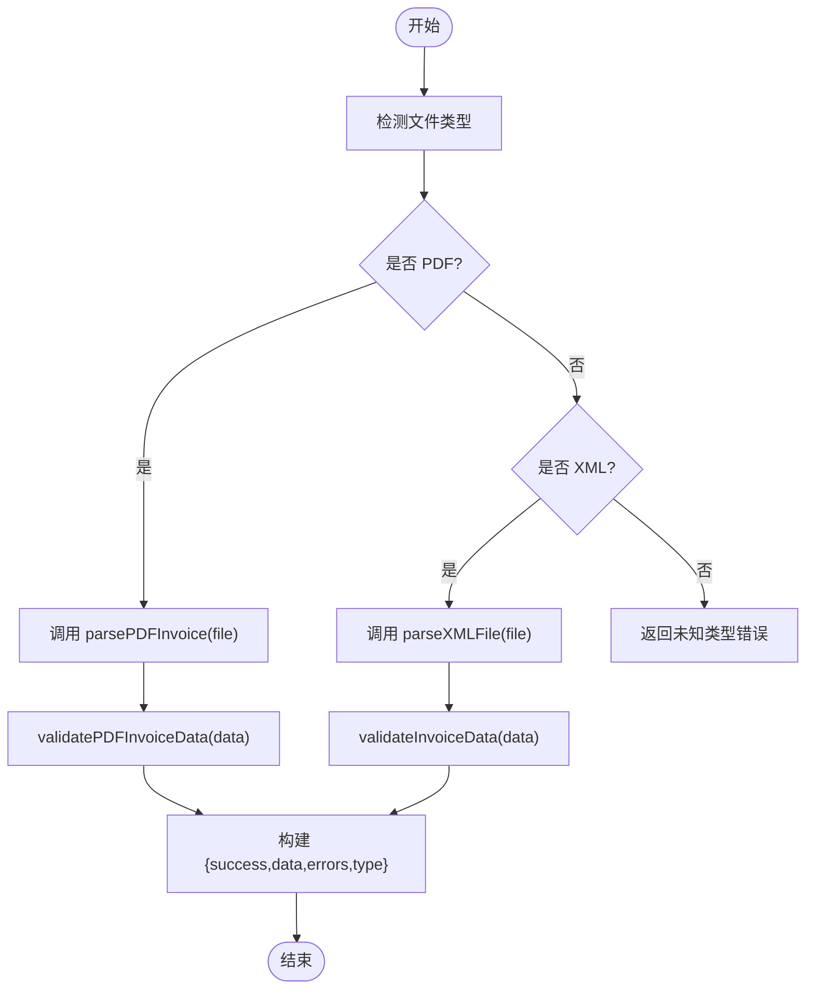
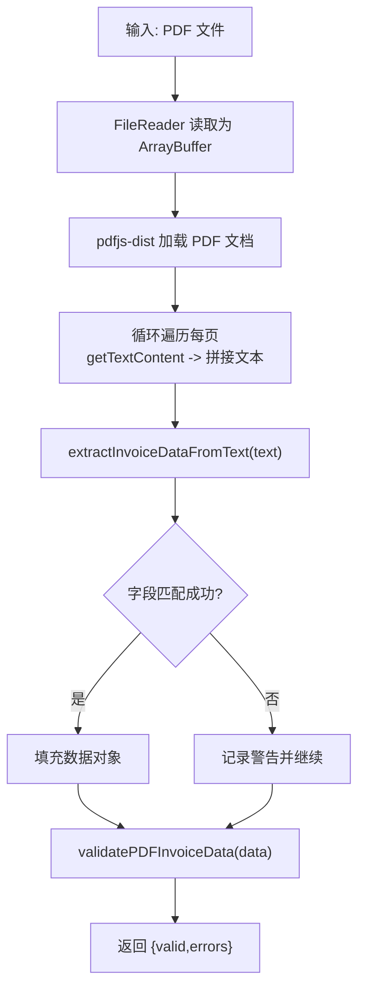
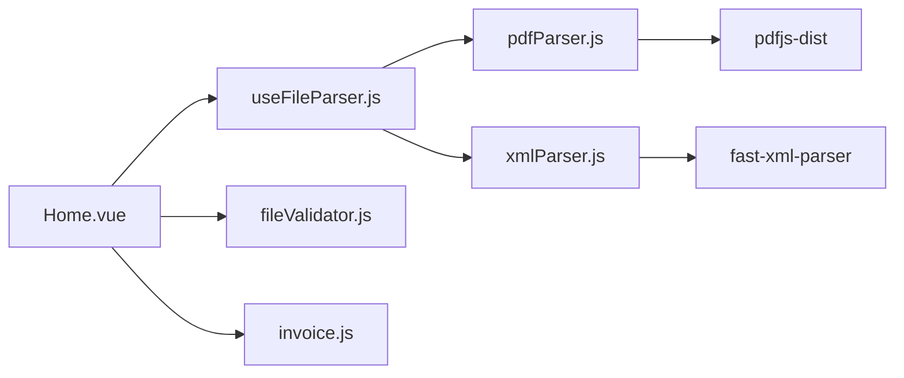

# PDF解析实现

<cite>
**本文引用的文件**
- [useFileParser.js](file://src/composables/useFileParser.js)
- [pdfParser.js](file://src/utils/pdfParser.js)
- [xmlParser.js](file://src/utils/xmlParser.js)
- [fileValidator.js](file://src/utils/fileValidator.js)
- [Home.vue](file://src/views/Home.vue)
- [FileUploader.vue](file://src/components/FileUploader.vue)
- [invoice.js](file://src/stores/invoice.js)
- [package.json](file://package.json)
</cite>

## 目录
1. [简介](#简介)
2. [项目结构](#项目结构)
3. [核心组件](#核心组件)
4. [架构总览](#架构总览)
5. [详细组件分析](#详细组件分析)
6. [依赖关系分析](#依赖关系分析)
7. [性能考量](#性能考量)
8. [故障排查指南](#故障排查指南)
9. [结论](#结论)
10. [附录](#附录)

## 简介
本技术文档围绕发票文件解析能力展开，重点阐述如何在前端环境中使用 pdfjs-dist 库逐页提取 PDF 文本，并通过正则表达式匹配“购买方名称”、“金额”等关键发票字段；同时说明 useFileParser.js 如何调用 parsePDFInvoice 函数处理 PDF 文件，以及 validatePDFInvoiceData 对解析结果进行的校验逻辑。文档还覆盖异步处理机制、错误捕获策略与性能优化建议，并给出扩展支持新型发票模板的实践指导。

## 项目结构
该项目采用 Vue 3 + Vite 的前端工程，围绕“发票重命名”工具链组织模块：
- 组合式函数层：useFileParser.js 负责统一解析入口与批量处理调度
- 工具层：pdfParser.js 实现 PDF 文本提取与发票字段抽取；xmlParser.js 实现 XML 解析与字段抽取
- 视图层：Home.vue 作为主界面，协调上传、解析、展示与导出
- 存储层：invoice.js 管理发票数据的状态与持久化
- 组件层：FileUploader.vue 提供拖拽上传与自定义请求钩子
- 校验层：fileValidator.js 提供文件格式与大小校验

图表来源
- [Home.vue](file://src/views/Home.vue#L1-L236)
- [FileUploader.vue](file://src/components/FileUploader.vue#L1-L50)
- [useFileParser.js](file://src/composables/useFileParser.js#L1-L102)
- [pdfParser.js](file://src/utils/pdfParser.js#L1-L227)
- [xmlParser.js](file://src/utils/xmlParser.js#L1-L118)
- [fileValidator.js](file://src/utils/fileValidator.js#L1-L90)
- [invoice.js](file://src/stores/invoice.js#L1-L204)

章节来源
- [Home.vue](file://src/views/Home.vue#L1-L236)
- [useFileParser.js](file://src/composables/useFileParser.js#L1-L102)
- [pdfParser.js](file://src/utils/pdfParser.js#L1-L227)
- [xmlParser.js](file://src/utils/xmlParser.js#L1-L118)
- [fileValidator.js](file://src/utils/fileValidator.js#L1-L90)
- [invoice.js](file://src/stores/invoice.js#L1-L204)

## 核心组件
- useFileParser.js
  - 提供 parseFile 与 parseFiles 两个入口，分别用于单文件与批量解析
  - 内部根据文件后缀判断 PDF/XML，分别调用 parsePDFInvoice 或 parseXMLFile
  - 统一返回包含 success、data、errors、type 的结果对象
  - 批量解析采用分批并发（每批 10 个）并实时更新进度
- pdfParser.js
  - extractTextFromPDF：使用 pdfjs-dist 读取 PDF，逐页提取文本并拼接
  - extractInvoiceDataFromText：基于正则表达式抽取发票类型、发票代码、购买方名称、销售方名称、价税合计、开票日期
  - parsePDFInvoice：串联文本提取与字段抽取
  - validatePDFInvoiceData：校验必填字段（购买方名称、金额）
- xmlParser.js
  - parseXMLFile/parseXMLText：使用 fast-xml-parser 解析 XML
  - extractInvoiceData：从 XML 数据中抽取发票字段（多字段名备选）
  - validateInvoiceData：校验必填字段（发票类型、购买方名称、价税合计）
- fileValidator.js
  - 校验文件类型（PDF/XML）与大小（≤10MB），并支持批量校验
- Home.vue
  - 与 useFileParser 集成，负责上传、进度展示、结果落盘到 store
- invoice.js
  - 管理发票列表、筛选、搜索、状态变更与文件名生成

章节来源
- [useFileParser.js](file://src/composables/useFileParser.js#L1-L102)
- [pdfParser.js](file://src/utils/pdfParser.js#L1-L227)
- [xmlParser.js](file://src/utils/xmlParser.js#L1-L118)
- [fileValidator.js](file://src/utils/fileValidator.js#L1-L90)
- [Home.vue](file://src/views/Home.vue#L1-L236)
- [invoice.js](file://src/stores/invoice.js#L1-L204)

## 架构总览
下面的序列图展示了从用户上传 PDF 到最终入库的关键流程，包括错误处理与进度反馈。

图表来源
- [Home.vue](file://src/views/Home.vue#L93-L155)
- [useFileParser.js](file://src/composables/useFileParser.js#L15-L59)
- [pdfParser.js](file://src/utils/pdfParser.js#L169-L177)

## 详细组件分析

### useFileParser.js：统一解析入口与批量处理
- 单文件解析 parseFile
  - 依据文件后缀区分 PDF/XML，分别调用 parsePDFInvoice 或 parseXMLFile
  - 对 PDF 调用 validatePDFInvoiceData，对 XML 调用 validateInvoiceData
  - 返回统一结构：{ success, data, errors, type }
- 批量解析 parseFiles
  - 分批并发（每批 10 个），使用 Promise.all 并行处理
  - 实时计算进度百分比并通过回调 onProgress 通知上层
  - 返回所有结果数组，便于后续汇总统计

图表来源
- [useFileParser.js](file://src/composables/useFileParser.js#L15-L59)

章节来源
- [useFileParser.js](file://src/composables/useFileParser.js#L1-L102)

### pdfParser.js：PDF 文本提取与发票字段抽取
- extractTextFromPDF
  - 使用 FileReader 将文件读取为 ArrayBuffer
  - 初始化 pdfjs-dist 的 worker 并加载 PDF 文档
  - 循环遍历每一页，调用 getTextContent 获取文本项并拼接为完整文本
  - 开发模式下输出文件名、大小、页数、文本长度与预览
  - 异常时抛出带明确错误信息的异常
- extractInvoiceDataFromText
  - 字段初始化：发票类型、发票代码、购买方名称、销售方名称、价税合计、开票日期
  - 正则抽取策略
    - 发票类型：匹配“电子发票（…）”或“发票（…）”中的括号内文字
    - 发票代码：匹配“发票号码:”后的连续 20 位以上数字
    - 开票日期：匹配“YYYY年MM月DD日”格式
    - 购买方名称：优先匹配“公司/企业/厂/院/中心/所/分公司”结尾且前后含统一社会信用码前缀的名称；若失败回退到直接匹配公司结尾的名称
    - 销售方名称：在所有公司名称中取第二处出现的公司名
    - 价税合计：优先匹配“价税合计/合计”后带“大写/小写”与货币符号的金额；若失败回退到在“备注”前区域查找最后一个金额
  - 开发模式下输出原始文本、提取结果与警告信息
  - 异常时抛出带明确错误信息的异常
- parsePDFInvoice
  - 串联 extractTextFromPDF 与 extractInvoiceDataFromText
- validatePDFInvoiceData
  - 必填字段校验：购买方名称、金额
  - 返回 { valid, errors }

图表来源
- [pdfParser.js](file://src/utils/pdfParser.js#L16-L49)
- [pdfParser.js](file://src/utils/pdfParser.js#L55-L164)
- [pdfParser.js](file://src/utils/pdfParser.js#L169-L177)
- [pdfParser.js](file://src/utils/pdfParser.js#L201-L226)

章节来源
- [pdfParser.js](file://src/utils/pdfParser.js#L1-L227)

### xmlParser.js：XML 解析与字段抽取
- parseXMLFile/parseXMLText：使用 fast-xml-parser 解析 XML 文本
- extractInvoiceData：从 XML 数据中抽取发票字段，提供多字段名备选（发票类型、发票代码、购买方名称、销售方名称、价税合计、开票日期）
- validateInvoiceData：校验必填字段（发票类型、购买方名称、价税合计）

章节来源
- [xmlParser.js](file://src/utils/xmlParser.js#L1-L118)

### fileValidator.js：文件格式与大小校验
- 支持格式：application/pdf、text/xml、application/xml
- 文件大小限制：≤10MB
- 单次上传数量限制：≤100 个
- 提供单文件与批量校验接口

章节来源
- [fileValidator.js](file://src/utils/fileValidator.js#L1-L90)

### Home.vue：上传与解析集成
- 通过 FileUploader.vue 的自定义请求钩子触发上传事件
- 调用 validateFile 进行前置校验
- 串行处理上传队列，逐个调用 parseFile 并将结果添加到 store
- 展示处理进度与消息提示

章节来源
- [Home.vue](file://src/views/Home.vue#L93-L155)

### invoice.js：发票数据状态管理
- 管理文件列表、筛选、搜索、选中状态
- addFile：根据解析结果生成新文件名或标记失败
- updateFile：当购买方名称或金额更新时重新生成文件名并修正状态
- 提供统计计算（成功/失败/总数）

章节来源
- [invoice.js](file://src/stores/invoice.js#L1-L204)

## 依赖关系分析
- 外部依赖
  - pdfjs-dist：PDF 文本提取与 worker 配置
  - fast-xml-parser：XML 解析
- 内部模块依赖
  - Home.vue 依赖 useFileParser.js、useFileExport.js、fileValidator.js
  - useFileParser.js 依赖 pdfParser.js、xmlParser.js
  - pdfParser.js 依赖 pdfjs-dist 与本地工具函数
  - xmlParser.js 依赖 fast-xml-parser 与本地工具函数
  - invoice.js 依赖 nameGenerator（用于文件名生成）

图表来源
- [Home.vue](file://src/views/Home.vue#L1-L236)
- [useFileParser.js](file://src/composables/useFileParser.js#L1-L102)
- [pdfParser.js](file://src/utils/pdfParser.js#L1-L227)
- [xmlParser.js](file://src/utils/xmlParser.js#L1-L118)
- [package.json](file://package.json#L11-L20)

章节来源
- [package.json](file://package.json#L1-L26)

## 性能考量
- 分页与文本拼接
  - 当前实现逐页提取并拼接为完整文本，适合中小 PDF；对于超大文件可考虑按需分页处理或流式拼接，减少内存峰值
- 并发与批处理
  - 批量解析采用每批 10 个并发，已有效平衡吞吐与资源占用；可根据设备性能调整批次大小
- 正则匹配优化
  - 正则表达式已针对常见格式做了限定（如发票号码至少 20 位、金额清理逗号与空白），可进一步：
    - 为高频字段建立索引或预过滤（如先定位“价税合计”附近区域再匹配金额）
    - 使用更严格的上下文约束（如“公司”前后必须有固定前缀或特定字符）
- Worker 配置
  - 已正确设置 pdfjs-dist 的 workerSrc，确保在浏览器端异步解析；避免主线程阻塞
- I/O 与缓存
  - FileReader 一次性读取为 ArrayBuffer，避免重复 I/O；可在上层增加内存缓存（如最近解析过的文件映射）以加速重复解析

[本节为通用性能建议，无需特定文件引用]

## 故障排查指南
- PDF 文本提取失败
  - 检查文件是否为可读 PDF（非加密、非损坏）
  - 确认 pdfjs-dist worker 配置正确（GlobalWorkerOptions.workerSrc）
  - 关注控制台日志，定位 extractTextFromPDF 抛错位置
- 字段未匹配
  - 开发模式下会输出原始文本与提取结果，可据此调整正则表达式
  - 购买方名称与销售方名称依赖“公司/企业/厂/院/中心/所/分公司”结尾，若模板不同需扩展匹配规则
  - 价税合计优先匹配“价税合计/合计”+“大写/小写”+货币符号，若模板不同可增加备选模式
- 校验失败
  - validatePDFInvoiceData 仅校验购买方名称与金额；若缺失请检查正则是否覆盖到目标模板
- 批量处理卡顿
  - 调整批次大小（默认 10），或在 UI 层增加取消/暂停机制
- 导入错误
  - 确保文件类型与大小满足 fileValidator.js 的限制

章节来源
- [pdfParser.js](file://src/utils/pdfParser.js#L16-L49)
- [pdfParser.js](file://src/utils/pdfParser.js#L55-L164)
- [pdfParser.js](file://src/utils/pdfParser.js#L201-L226)
- [fileValidator.js](file://src/utils/fileValidator.js#L1-L90)

## 结论
本实现以 useFileParser.js 为统一入口，结合 pdfParser.js 的 PDF 文本提取与字段抽取、validatePDFInvoiceData 的必填校验，形成完整的前端发票解析链路。通过分批并发与 worker 异步处理，兼顾了性能与用户体验。正则表达式策略在常见模板上具备较高可用性，但面对多样化发票模板时，建议通过扩展正则或引入 OCR/ML 模型提升识别准确率与鲁棒性。

[本节为总结性内容，无需特定文件引用]

## 附录

### 实际代码片段路径参考
- PDF 文本提取与字段抽取
  - [extractTextFromPDF](file://src/utils/pdfParser.js#L16-L49)
  - [extractInvoiceDataFromText](file://src/utils/pdfParser.js#L55-L164)
- PDF 解析入口与校验
  - [parsePDFInvoice](file://src/utils/pdfParser.js#L169-L177)
  - [validatePDFInvoiceData](file://src/utils/pdfParser.js#L201-L226)
- 统一解析入口与批量处理
  - [parseFile](file://src/composables/useFileParser.js#L15-L59)
  - [parseFiles](file://src/composables/useFileParser.js#L64-L93)
- XML 解析与校验
  - [parseXMLFile/parseXMLText](file://src/utils/xmlParser.js#L19-L39)
  - [extractInvoiceData](file://src/utils/xmlParser.js#L41-L74)
  - [validateInvoiceData](file://src/utils/xmlParser.js#L96-L118)
- 文件校验
  - [validateFileFormat/validateFileSize/validateFile/validateFiles](file://src/utils/fileValidator.js#L21-L89)
- 上传与进度展示
  - [FileUploader.vue](file://src/components/FileUploader.vue#L1-L50)
  - [Home.vue](file://src/views/Home.vue#L93-L155)
- 状态管理
  - [invoice.js](file://src/stores/invoice.js#L54-L99)

### 扩展支持新型发票模板的实践建议
- 调整正则表达式
  - 在 extractInvoiceDataFromText 中新增或细化匹配规则，如增加“价税合计”的多种变体、发票号码的多种格式
  - 为“购买方名称/销售方名称”增加更多上下文约束（如税务登记号前缀、地址关键字等）
- 引入 OCR/ML 模型
  - 对于扫描版 PDF 或复杂布局，可结合 OCR（如 Tesseract.js）先转文本，再进行字段抽取
  - 使用轻量级 NLP 模型（如 ONNX Runtime）进行实体识别，提高字段定位精度
- 模板注册与动态匹配
  - 设计模板注册机制，按发票类型/来源机构加载对应正则集或 ML 模型
  - 为每个模板维护字段映射表与校验规则，便于快速迭代
- 错误恢复与人工干预
  - 对无法自动识别的字段，提供可视化标注与二次编辑入口
  - 记录解析失败样本，持续优化正则与模型

[本节为扩展性建议，无需特定文件引用]