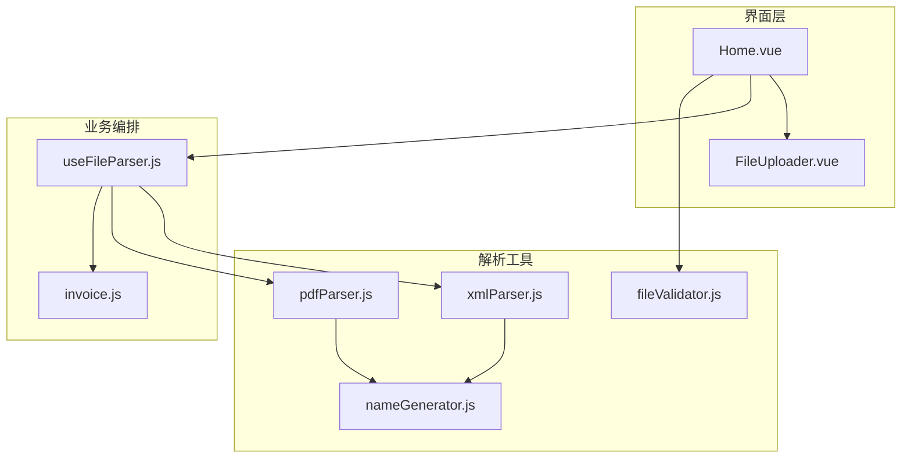
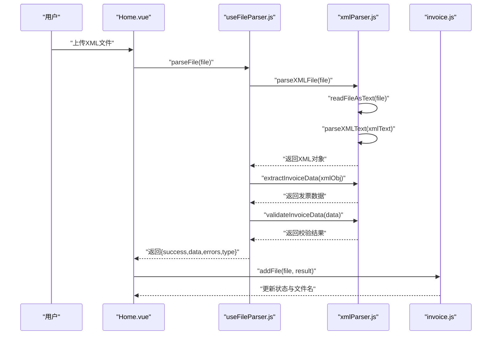
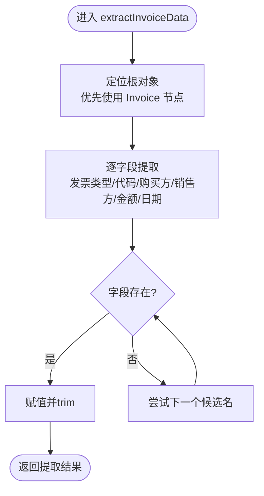
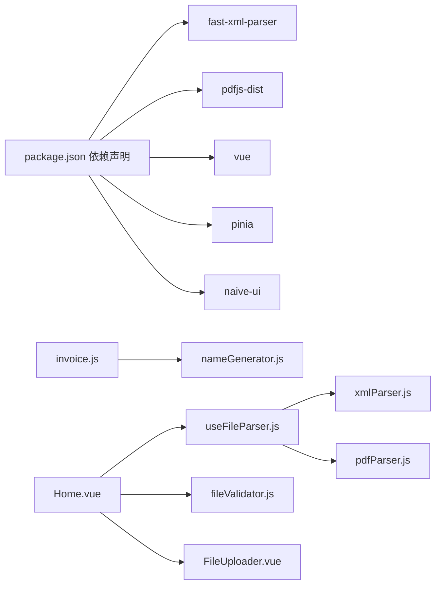

# XML解析实现

<cite>
**本文引用的文件**
- [useFileParser.js](file://src/composables/useFileParser.js)
- [xmlParser.js](file://src/utils/xmlParser.js)
- [pdfParser.js](file://src/utils/pdfParser.js)
- [fileValidator.js](file://src/utils/fileValidator.js)
- [invoice.js](file://src/stores/invoice.js)
- [Home.vue](file://src/views/Home.vue)
- [FileUploader.vue](file://src/components/FileUploader.vue)
- [nameGenerator.js](file://src/utils/nameGenerator.js)
- [package.json](file://package.json)
</cite>

## 目录
1. [简介](#简介)
2. [项目结构](#项目结构)
3. [核心组件](#核心组件)
4. [架构总览](#架构总览)
5. [详细组件分析](#详细组件分析)
6. [依赖关系分析](#依赖关系分析)
7. [性能考量](#性能考量)
8. [故障排查指南](#故障排查指南)
9. [结论](#结论)
10. [附录](#附录)

## 简介
本文件面向高级用户，系统性梳理本仓库中XML发票解析的实现路径与扩展策略。重点覆盖：
- useFileParser.js 如何协调 parseXMLFile 与 extractInvoiceData 完成从XML文件到结构化发票数据的转换；
- xmlParser.js 中基于 fast-xml-parser 的解析流程与字段提取策略；
- validateInvoiceData 对解析结果进行完整性与合法性的校验；
- 不同地区电子发票XML Schema的兼容性处理建议；
- 错误处理与异常反馈机制；
- 面向多行业/多国家XML发票标准的扩展指南。

## 项目结构
围绕“文件解析”这一核心能力，相关模块分布如下：
- 组合式函数：useFileParser.js 负责统一调度 PDF/XML 解析流程；
- 工具函数：xmlParser.js 实现XML解析、字段提取与基础校验；pdfParser.js 提供PDF解析对照参考；
- 状态管理：invoice.js 管理解析结果的持久化与UI展示；
- 视图与上传：Home.vue 与 FileUploader.vue 负责用户交互与文件提交；
- 文件校验：fileValidator.js 控制文件类型与大小；
- 命名规则：nameGenerator.js 将解析后的发票数据映射为规范化文件名。

图表来源
- [Home.vue](file://src/views/Home.vue#L1-L236)
- [FileUploader.vue](file://src/components/FileUploader.vue#L1-L50)
- [useFileParser.js](file://src/composables/useFileParser.js#L1-L102)
- [xmlParser.js](file://src/utils/xmlParser.js#L1-L118)
- [pdfParser.js](file://src/utils/pdfParser.js#L1-L227)
- [fileValidator.js](file://src/utils/fileValidator.js#L1-L90)
- [invoice.js](file://src/stores/invoice.js#L1-L204)
- [nameGenerator.js](file://src/utils/nameGenerator.js#L1-L225)

章节来源
- [Home.vue](file://src/views/Home.vue#L1-L236)
- [FileUploader.vue](file://src/components/FileUploader.vue#L1-L50)
- [useFileParser.js](file://src/composables/useFileParser.js#L1-L102)
- [xmlParser.js](file://src/utils/xmlParser.js#L1-L118)
- [pdfParser.js](file://src/utils/pdfParser.js#L1-L227)
- [fileValidator.js](file://src/utils/fileValidator.js#L1-L90)
- [invoice.js](file://src/stores/invoice.js#L1-L204)
- [nameGenerator.js](file://src/utils/nameGenerator.js#L1-L225)

## 核心组件
- useFileParser.js
  - 统一入口：根据文件后缀选择解析器，串联 parseXMLFile/extractInvoiceData/validateInvoiceData 流程；
  - 批量解析：按批次并发处理，内置进度回调；
  - 异常兜底：捕获解析过程中的错误并返回标准化错误信息。
- xmlParser.js
  - parseXMLFile：将 File 对象读取为文本后交由 fast-xml-parser 解析；
  - parseXMLText：基于 fast-xml-parser 的配置解析XML文本；
  - extractInvoiceData：从XML对象中抽取发票关键字段（发票类型、发票代码/编号、购买方名称、销售方名称、价税合计、开票日期），采用多字段名备选策略；
  - validateInvoiceData：对抽取结果进行基础必填校验。
- invoice.js
  - 将解析结果持久化为文件条目，负责状态、筛选、搜索、批量操作；
  - 在解析成功时调用 nameGenerator 生成规范化文件名。
- fileValidator.js
  - 校验文件类型（PDF/XML）与大小上限，控制单次上传数量。
- nameGenerator.js
  - 定义命名规则模板与字段格式化器，确保生成的文件名符合系统规范。

章节来源
- [useFileParser.js](file://src/composables/useFileParser.js#L1-L102)
- [xmlParser.js](file://src/utils/xmlParser.js#L1-L118)
- [invoice.js](file://src/stores/invoice.js#L1-L204)
- [fileValidator.js](file://src/utils/fileValidator.js#L1-L90)
- [nameGenerator.js](file://src/utils/nameGenerator.js#L1-L225)

## 架构总览
XML发票解析的端到端流程如下：

图表来源
- [Home.vue](file://src/views/Home.vue#L93-L155)
- [useFileParser.js](file://src/composables/useFileParser.js#L15-L60)
- [xmlParser.js](file://src/utils/xmlParser.js#L19-L62)
- [invoice.js](file://src/stores/invoice.js#L54-L99)

## 详细组件分析

### useFileParser.js：文件解析编排
- 功能要点
  - 文件类型识别：依据文件名后缀区分PDF/XML；
  - PDF分支：调用 parsePDFInvoice 与 validatePDFInvoiceData；
  - XML分支：调用 parseXMLFile、extractInvoiceData、validateInvoiceData；
  - 错误处理：捕获异常并返回统一结构，包含 success、data、errors、type。
- 批量解析
  - 分批并发：每批10个文件，Promise.all 并行处理；
  - 进度回调：通过 onProgress 回传百分比，便于UI更新。

章节来源
- [useFileParser.js](file://src/composables/useFileParser.js#L1-L102)

### xmlParser.js：XML解析与字段提取
- 解析配置
  - 使用 fast-xml-parser，配置项包括：是否忽略属性、属性前缀、文本节点名、忽略声明、解析属性值、去除空白等。
- 解析流程
  - parseXMLFile：FileReader 读取为文本，再交由 parseXMLText；
  - parseXMLText：构造 XMLParser 并执行 parse，返回JS对象。
- 字段提取
  - extractInvoiceData：以“多字段名备选”的方式从顶层对象或 Invoice 子节点中抽取关键字段；
  - extractField：遍历候选字段名，命中即返回字符串并去空白。
- 校验
  - validateInvoiceData：检查发票类型、购买方名称、价税合计是否缺失。

图表来源
- [xmlParser.js](file://src/utils/xmlParser.js#L41-L74)

章节来源
- [xmlParser.js](file://src/utils/xmlParser.js#L1-L118)

### invoice.js：解析结果落地与命名
- addFile：根据解析结果设置状态、错误信息与新文件名；
- updateFile：当购买方名称或金额变更时，重新生成文件名；
- 与 nameGenerator.js 协作：基于命名规则模板与字段格式化器生成最终文件名。

章节来源
- [invoice.js](file://src/stores/invoice.js#L54-L124)
- [nameGenerator.js](file://src/utils/nameGenerator.js#L1-L225)

### fileValidator.js：文件级约束
- 类型校验：支持 PDF 与 XML（含 text/xml 与 application/xml）；
- 大小限制：单文件不超过10MB；
- 数量限制：单次最多100个文件；
- 返回结构：valid 与 errors 数组，便于UI提示。

章节来源
- [fileValidator.js](file://src/utils/fileValidator.js#L1-L90)

### Home.vue 与 FileUploader.vue：用户交互
- FileUploader.vue：限制 accept=".pdf,.xml"，支持拖拽上传；
- Home.vue：接收上传事件，先做文件校验，再调用 useFileParser 解析，最后将结果写入 store。

章节来源
- [FileUploader.vue](file://src/components/FileUploader.vue#L1-L50)
- [Home.vue](file://src/views/Home.vue#L1-L236)

## 依赖关系分析
- 外部依赖
  - fast-xml-parser：用于将XML文本解析为JS对象；
  - pdfjs-dist：用于PDF文本提取（作为XML解析的对照参考）；
  - vue/pinia/naive-ui：前端框架与UI库。
- 内部依赖
  - useFileParser.js 依赖 xmlParser.js 与 pdfParser.js；
  - invoice.js 依赖 nameGenerator.js；
  - Home.vue 依赖 useFileParser.js 与 fileValidator.js。

图表来源
- [package.json](file://package.json#L1-L26)
- [useFileParser.js](file://src/composables/useFileParser.js#L1-L102)
- [xmlParser.js](file://src/utils/xmlParser.js#L1-L118)
- [pdfParser.js](file://src/utils/pdfParser.js#L1-L227)
- [invoice.js](file://src/stores/invoice.js#L1-L204)
- [nameGenerator.js](file://src/utils/nameGenerator.js#L1-L225)
- [Home.vue](file://src/views/Home.vue#L1-L236)
- [FileUploader.vue](file://src/components/FileUploader.vue#L1-L50)
- [fileValidator.js](file://src/utils/fileValidator.js#L1-L90)

章节来源
- [package.json](file://package.json#L1-L26)

## 性能考量
- 并发与批处理
  - useFileParser.js 的批量解析采用分批并发（每批10个），可显著提升大批量文件处理效率；
  - 建议在UI层提供进度反馈，避免长时间无响应。
- 解析成本
  - XML解析主要受文件大小与复杂度影响，建议控制单文件大小不超过10MB；
  - 对于超大XML，可考虑分块读取或服务端解析。
- 前端渲染
  - store 中的过滤与搜索为纯前端计算，建议在数据量较大时优化算法或引入虚拟滚动。

章节来源
- [useFileParser.js](file://src/composables/useFileParser.js#L64-L93)
- [fileValidator.js](file://src/utils/fileValidator.js#L12-L14)

## 故障排查指南
- 常见错误与定位
  - 文件读取失败：parseXMLFile/readFileAsText 抛出错误，通常为文件损坏或编码问题；
  - XML解析失败：parseXMLText 抛出错误，常见于XML格式不正确或声明不合规；
  - 字段提取失败：extractInvoiceData 抛出错误，多因XML结构与预期不符；
  - 校验失败：validateInvoiceData 返回错误列表，关注缺失字段提示。
- 异常捕获与反馈
  - useFileParser.js 在 parseFile 中统一捕获异常，返回 {success:false, errors:[...]}；
  - Home.vue 在处理队列时捕获异常并通过消息提示用户；
  - store.addFile 将错误信息写入条目，便于后续查看与重试。
- 建议排查步骤
  - 确认文件类型与大小是否满足要求；
  - 检查XML结构是否包含 Invoice 节点及关键字段；
  - 若字段名不一致，可在 extractInvoiceData 中增加候选名或自定义映射；
  - 对于解析异常，建议在本地打印原始XML文本以便定位。

章节来源
- [useFileParser.js](file://src/composables/useFileParser.js#L15-L60)
- [xmlParser.js](file://src/utils/xmlParser.js#L19-L62)
- [invoice.js](file://src/stores/invoice.js#L54-L99)
- [Home.vue](file://src/views/Home.vue#L120-L155)

## 结论
本实现以 useFileParser.js 为编排中枢，结合 xmlParser.js 的结构化解析与字段提取，配合 store 的结果落盘与命名规则，形成一套完整且可扩展的XML发票解析链路。通过多字段名备选与基础校验，提升了对不同XML结构的兼容性；通过并发批处理与进度反馈，改善了用户体验。对于多行业/多国家XML标准的扩展，建议在 extractInvoiceData 中引入“Schema-感知”的字段映射表，并在 validateInvoiceData 中补充对应Schema的合法性校验。

## 附录

### 数据映射与字段提取逻辑说明
- 关键字段映射
  - 发票类型：尝试 InvoiceType、Type、InvoiceName 等候选名；
  - 发票代码/编号：尝试 InvoiceCode、Code、InvoiceNumber 等候选名；
  - 购买方名称：尝试 PurchaserName、Purchaser、BuyerName 等候选名；
  - 销售方名称：尝试 SellerName、Seller、SellerName 等候选名；
  - 价税合计：尝试 TotalAmount、Total、Amount 等候选名；
  - 开票日期：尝试 IssueDate、Date、InvoiceDate 等候选名。
- 映射策略
  - 采用“候选名优先匹配”，命中即返回；
  - 对提取值统一 trim，保证数据整洁；
  - 未命中则返回 null，交由上层校验决定是否报错。

章节来源
- [xmlParser.js](file://src/utils/xmlParser.js#L41-L74)

### 兼容性处理策略（不同地区/行业XML Schema）
- 字段映射表
  - 建议维护一份“地区/行业 -> 字段映射表”，在 extractInvoiceData 中按来源选择对应映射；
  - 对于未知来源，保留现有候选名策略作为默认兜底。
- 解析配置
  - 根据目标XML的命名空间与属性风格，调整 fast-xml-parser 的解析选项（如 attributeNames、ignoreDeclaration 等）；
  - 对于含命名空间的XML，可在解析后统一处理命名空间前缀。
- 校验增强
  - validateInvoiceData 可扩展为按来源执行不同的校验规则集；
  - 对金额、日期等字段增加格式与范围校验。

章节来源
- [xmlParser.js](file://src/utils/xmlParser.js#L7-L14)
- [xmlParser.js](file://src/utils/xmlParser.js#L41-L74)
- [xmlParser.js](file://src/utils/xmlParser.js#L98-L118)

### 扩展指南：支持其他XML发票标准
- 新增解析器
  - 在 useFileParser.js 中新增分支，根据文件特征（如特定标签、版本号）选择新的解析器；
  - 新解析器需提供 parseXMLFile/extractInvoiceData/validateInvoiceData 三件套。
- 字段映射扩展
  - 在 extractInvoiceData 中增加针对新Schema的候选名集合；
  - 必要时引入正则或DOM查询策略以适配复杂结构。
- 校验规则扩展
  - 在 validateInvoiceData 中增加新Schema的必填字段与格式校验；
  - 对金额、税额、税率等字段增加业务规则校验。
- UI与存储
  - 在 Home.vue 与 invoice.js 中确保新字段能在表格与命名规则中正常显示与使用。

章节来源
- [useFileParser.js](file://src/composables/useFileParser.js#L15-L60)
- [xmlParser.js](file://src/utils/xmlParser.js#L41-L74)
- [xmlParser.js](file://src/utils/xmlParser.js#L98-L118)
- [invoice.js](file://src/stores/invoice.js#L54-L124)