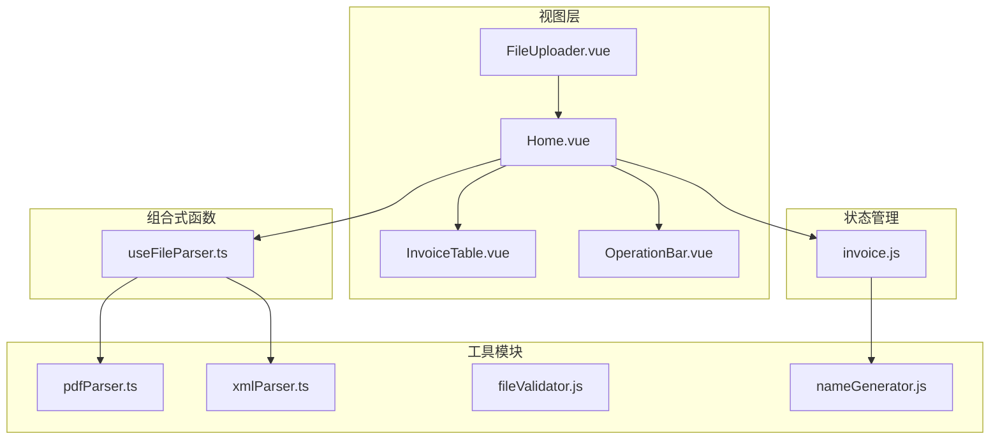
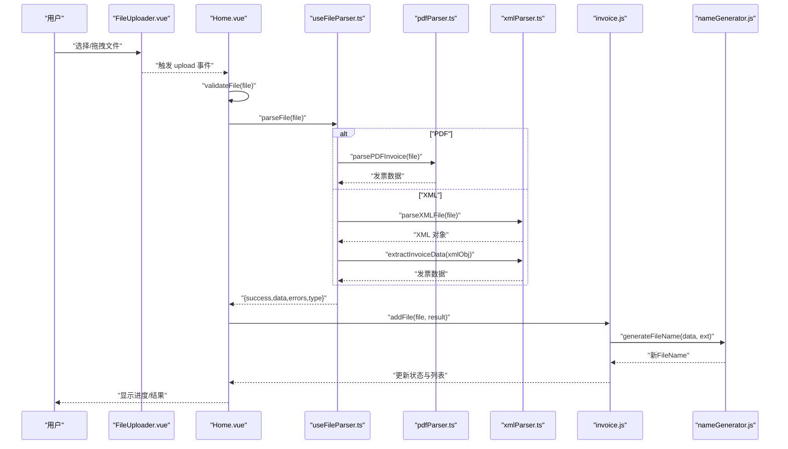
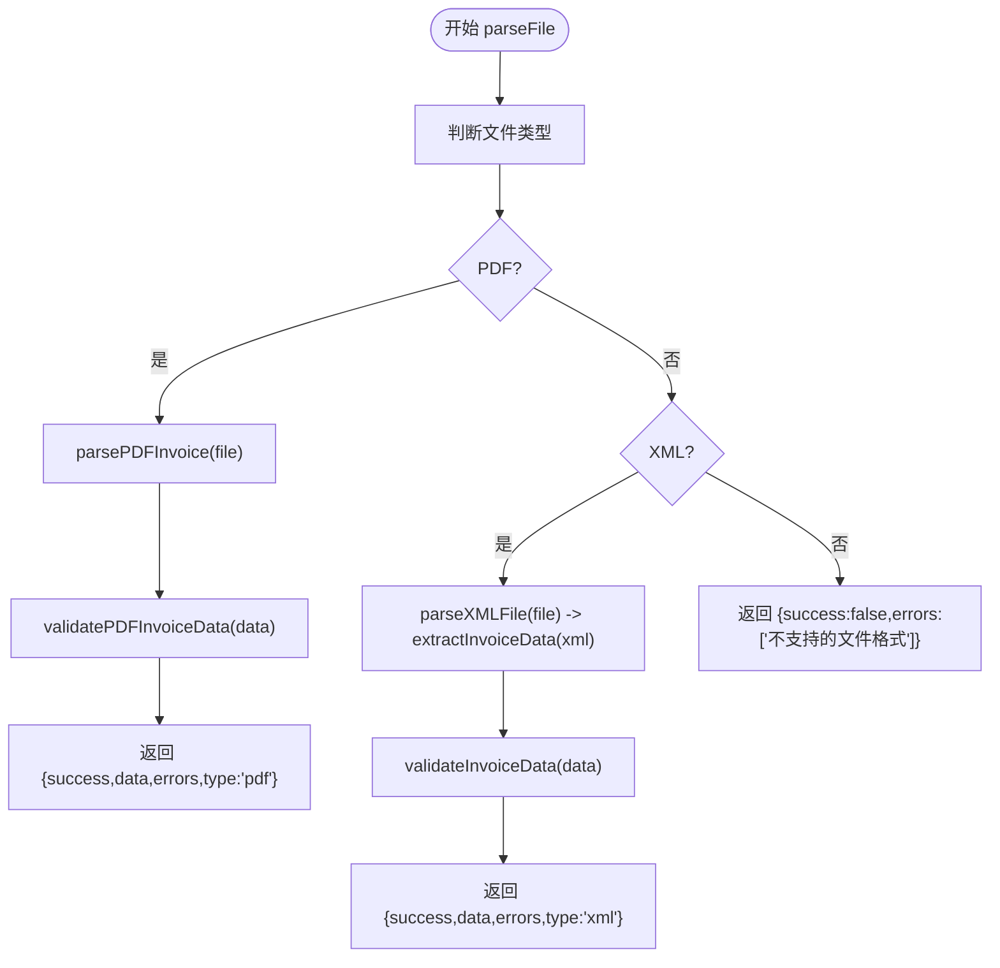
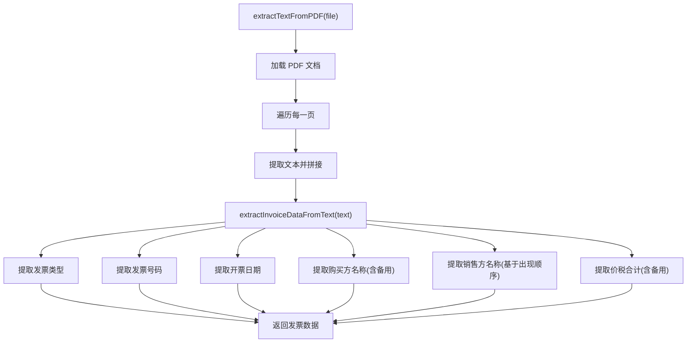
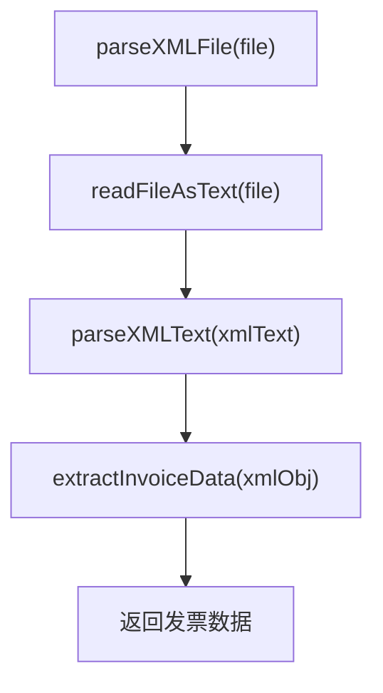
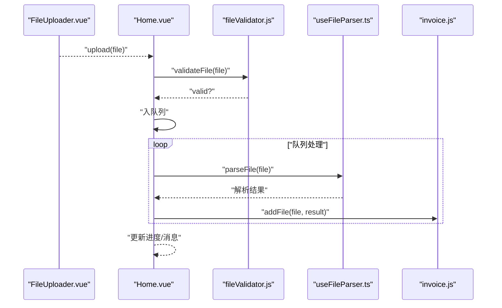
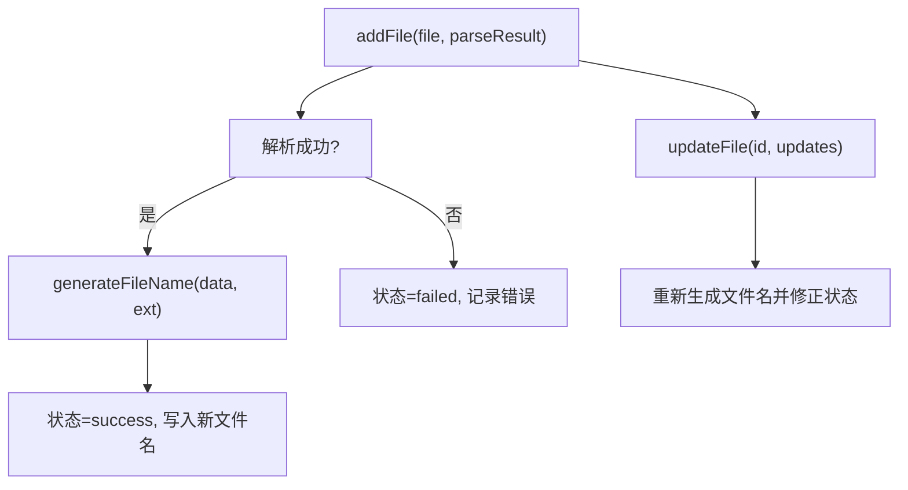
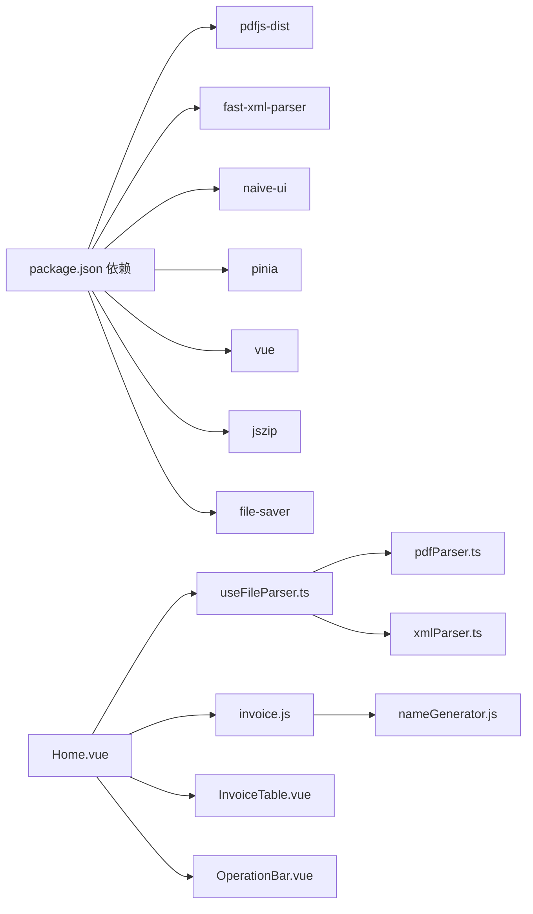

# 文件解析系统

<cite>
**本文引用的文件**
- [useFileParser.ts](file://src/composables/useFileParser.ts)
- [pdfParser.ts](file://src/utils/pdfParser.ts)
- [xmlParser.ts](file://src/utils/xmlParser.ts)
- [FileUploader.vue](file://src/components/FileUploader.vue)
- [Home.vue](file://src/views/Home.vue)
- [invoice.js](file://src/stores/invoice.js)
- [InvoiceTable.vue](file://src/components/InvoiceTable.vue)
- [OperationBar.vue](file://src/components/OperationBar.vue)
- [fileValidator.js](file://src/utils/fileValidator.js)
- [nameGenerator.js](file://src/utils/nameGenerator.js)
- [package.json](file://package.json)
</cite>

## 目录
1. [简介](#简介)
2. [项目结构](#项目结构)
3. [核心组件](#核心组件)
4. [架构总览](#架构总览)
5. [详细组件分析](#详细组件分析)
6. [依赖关系分析](#依赖关系分析)
7. [性能与并发特性](#性能与并发特性)
8. [故障排查指南](#故障排查指南)
9. [结论](#结论)
10. [附录：扩展新解析格式指南](#附录扩展新解析格式指南)

## 简介
本文件解析系统围绕“发票重命名”场景构建，目标是从用户上传的 PDF 或 XML 发票文件中提取关键信息（如发票类型、发票代码、购买方名称、销售方名称、价税合计、开票日期），并基于这些信息生成规范化的文件名。系统采用模块化设计：
- FileUploader 触发上传事件
- Home.vue 作为视图控制器，协调解析与状态更新
- useFileParser.ts 组合式函数负责解析流程编排与并发控制
- pdfParser.ts 与 xmlParser.ts 分别封装 PDF 与 XML 的解析细节
- invoice.js Pinia Store 负责状态管理与文件名生成
- nameGenerator.js 提供文件名生成与冲突处理
- fileValidator.js 提供上传前的格式与大小校验

## 项目结构
系统采用按职责分层的组织方式：
- 视图层：Home.vue、InvoiceTable.vue、OperationBar.vue、FileUploader.vue
- 组合式函数：useFileParser.ts
- 工具模块：pdfParser.ts、xmlParser.ts、fileValidator.js、nameGenerator.js
- 状态管理：invoice.js（Pinia Store）

图表来源
- [Home.vue](file://src/views/Home.vue#L1-L236)
- [useFileParser.ts](file://src/composables/useFileParser.ts#L1-L108)
- [pdfParser.ts](file://src/utils/pdfParser.ts#L1-L243)
- [xmlParser.ts](file://src/utils/xmlParser.ts#L1-L141)
- [invoice.js](file://src/stores/invoice.js#L1-L204)
- [nameGenerator.js](file://src/utils/nameGenerator.js#L1-L225)
- [fileValidator.js](file://src/utils/fileValidator.js#L1-L90)

章节来源
- [Home.vue](file://src/views/Home.vue#L1-L236)
- [useFileParser.ts](file://src/composables/useFileParser.ts#L1-L108)
- [pdfParser.ts](file://src/utils/pdfParser.ts#L1-L243)
- [xmlParser.ts](file://src/utils/xmlParser.ts#L1-L141)
- [invoice.js](file://src/stores/invoice.js#L1-L204)
- [nameGenerator.js](file://src/utils/nameGenerator.js#L1-L225)
- [fileValidator.js](file://src/utils/fileValidator.js#L1-L90)

## 核心组件
- useFileParser.ts：统一解析入口，根据文件后缀选择 PDF 或 XML 解析器，聚合验证结果，支持批量解析与进度反馈。
- pdfParser.ts：基于 pdfjs-dist 读取 PDF 文本，再通过正则提取发票关键字段。
- xmlParser.ts：基于 fast-xml-parser 解析 XML，提取发票字段并进行基础校验。
- Home.vue：上传触发、队列处理、进度展示、错误提示与导出集成。
- invoice.js：Pinia Store，维护文件列表、筛选与搜索、状态变更与文件名生成。
- nameGenerator.js：多规则文件名生成与冲突处理。
- fileValidator.js：上传前格式与大小校验。

章节来源
- [useFileParser.ts](file://src/composables/useFileParser.ts#L1-L108)
- [pdfParser.ts](file://src/utils/pdfParser.ts#L1-L243)
- [xmlParser.ts](file://src/utils/xmlParser.ts#L1-L141)
- [Home.vue](file://src/views/Home.vue#L1-L236)
- [invoice.js](file://src/stores/invoice.js#L1-L204)
- [nameGenerator.js](file://src/utils/nameGenerator.js#L1-L225)
- [fileValidator.js](file://src/utils/fileValidator.js#L1-L90)

## 架构总览
系统采用“视图-组合式函数-工具模块-状态管理”的分层架构。解析流程从 FileUploader 触发，Home.vue 接收文件并进行校验，随后调用 useFileParser.ts 的解析接口，解析完成后将结果写入 Pinia Store，UI 层实时渲染。

图表来源
- [FileUploader.vue](file://src/components/FileUploader.vue#L1-L50)
- [Home.vue](file://src/views/Home.vue#L1-L236)
- [useFileParser.ts](file://src/composables/useFileParser.ts#L1-L108)
- [pdfParser.ts](file://src/utils/pdfParser.ts#L1-L243)
- [xmlParser.ts](file://src/utils/xmlParser.ts#L1-L141)
- [invoice.js](file://src/stores/invoice.js#L1-L204)
- [nameGenerator.js](file://src/utils/nameGenerator.js#L1-L225)

## 详细组件分析

### 组件一：useFileParser.ts（解析编排与并发）
- 功能要点
  - 根据文件名后缀判断类型（PDF/XML），分别调用对应解析器
  - 支持 TypeScript 类型定义，增强类型安全
  - 定义 `ParseResult` 接口，明确返回结构：`success: boolean`, `data: any`, `errors: string[]`, `type: 'pdf' | 'xml' | 'unknown'`
  - PDF：先提取文本，再提取发票字段，最后进行数据校验
  - XML：先解析为对象，再抽取字段，最后进行数据校验
  - 支持批量解析，按批次并发处理，提供进度回调
  - 异常捕获：统一返回 {success, data, errors, type}

**章节来源**
- [useFileParser.ts](file://src/composables/useFileParser.ts#L1-L108)

### 组件二：pdfParser.ts（PDF 文本提取与字段提取）
- 关键流程
  - 使用 pdfjs-dist 读取 PDF，逐页提取文本并拼接
  - 使用正则表达式提取发票类型、发票代码、购买方名称、销售方名称、价税合计、开票日期
  - 提供备用策略：当无法直接匹配时，回退到文本末尾附近查找金额
  - 数据校验：确保购买方名称与金额存在
  - 支持 TypeScript 类型定义，定义 `InvoiceData` 和 `ValidationResult` 接口，提升代码可维护性

**章节来源**
- [pdfParser.ts](file://src/utils/pdfParser.ts#L1-L243)

### 组件三：xmlParser.ts（XML 解析与字段抽取）
- 关键流程
  - 使用 fast-xml-parser 解析 XML 文本为对象
  - 从对象中抽取发票字段，支持多种字段名映射（如 InvoiceType/Type/InvoiceName 等）
  - 数据校验：确保发票类型、购买方名称、价税合计存在
  - 支持 TypeScript 类型定义，定义 `InvoiceData` 和 `ValidationResult` 接口，提升代码可维护性

**章节来源**
- [xmlParser.ts](file://src/utils/xmlParser.ts#L1-L141)

### 组件四：Home.vue（上传与队列处理）
- 关键流程
  - 接收 FileUploader 的上传事件
  - 调用 fileValidator.validateFile 进行格式与大小校验
  - 将文件加入队列，串行处理队列中的文件
  - 调用 useFileParser.parseFile 解析，将结果传给 invoice.js.store.addFile
  - 实时更新进度与消息提示

**章节来源**
- [Home.vue](file://src/views/Home.vue#L1-L236)
- [fileValidator.js](file://src/utils/fileValidator.js#L1-L90)
- [useFileParser.ts](file://src/composables/useFileParser.ts#L1-L108)
- [invoice.js](file://src/stores/invoice.js#L1-L204)

### 组件五：invoice.js（状态管理与文件名生成）
- 关键流程
  - addFile：根据解析结果设置状态、生成新文件名、记录错误信息
  - updateFile：当购买方名称或金额更新时，重新生成文件名并修正状态
  - 提供筛选、搜索、统计等计算属性
  - nameGenerator.generateFileName：按规则生成文件名并处理冲突

**章节来源**
- [invoice.js](file://src/stores/invoice.js#L1-L204)
- [nameGenerator.js](file://src/utils/nameGenerator.js#L1-L225)

### 组件六：UI 组件（InvoiceTable.vue、OperationBar.vue）
- InvoiceTable.vue：展示原始文件名、发票类型、购买方名称、金额、新文件名、状态与失败原因，并允许编辑购买方名称与金额
- OperationBar.vue：提供筛选（全部/成功/失败）、搜索、全选/取消选择、删除选中、导出成功文件

**章节来源**
- [InvoiceTable.vue](file://src/components/InvoiceTable.vue#L1-L162)
- [OperationBar.vue](file://src/components/OperationBar.vue#L1-L119)

## 依赖关系分析
- 外部依赖
  - pdfjs-dist：用于 PDF 文本提取
  - fast-xml-parser：用于 XML 解析
  - naive-ui、vue、pinia：UI 与状态管理框架
  - jszip、file-saver：导出压缩包（在导出组合式函数中使用）
- 内部依赖
  - useFileParser.ts 依赖 pdfParser.ts 与 xmlParser.ts
  - Home.vue 依赖 useFileParser.ts、fileValidator.js、invoice.js
  - invoice.js 依赖 nameGenerator.js
  - UI 组件依赖 Home.vue 与 invoice.js

**图表来源**
- [package.json](file://package.json#L1-L26)
- [Home.vue](file://src/views/Home.vue#L1-L236)
- [useFileParser.ts](file://src/composables/useFileParser.ts#L1-L108)
- [pdfParser.ts](file://src/utils/pdfParser.ts#L1-L243)
- [xmlParser.ts](file://src/utils/xmlParser.ts#L1-L141)
- [invoice.js](file://src/stores/invoice.js#L1-L204)
- [nameGenerator.js](file://src/utils/nameGenerator.js#L1-L225)
- [InvoiceTable.vue](file://src/components/InvoiceTable.vue#L1-L162)
- [OperationBar.vue](file://src/components/OperationBar.vue#L1-L119)

## 性能与并发特性
- 并发策略
  - useFileParser.ts 在批量解析时采用“批次并发 + 进度回调”的方式，批次大小固定为 10，避免一次性创建过多任务导致内存与主线程压力过大
- 异步处理
  - PDF 解析涉及网络资源（worker）与磁盘读取，整体为异步流程，解析结果通过 Promise 返回
  - UI 层通过进度条与消息提示反馈处理状态
- 资源占用
  - PDF 文本提取会遍历每一页，页数越多耗时越长；建议对超大文件进行提示或拆分处理
  - XML 解析为纯内存操作，复杂度与节点数量相关

**章节来源**
- [useFileParser.ts](file://src/composables/useFileParser.ts#L71-L98)
- [pdfParser.ts](file://src/utils/pdfParser.ts#L31-L60)

## 故障排查指南
- 常见问题与定位
  - 不支持的文件格式：检查文件后缀与 MIME 类型，确保为 PDF 或 XML
  - 文件过大：默认限制为 10MB，超出将被拒绝
  - PDF 解析失败：查看 PDF 文本提取阶段的日志与异常堆栈
  - XML 解析失败：检查 XML 结构与编码，确认可被 fast-xml-parser 正确解析
  - 解析成功但字段缺失：检查正则匹配规则与 XML 字段映射是否覆盖实际发票格式
- 错误传播路径
  - FileUploader.vue 仅触发事件，错误主要在 Home.vue 中收集并提示
  - useFileParser.ts 捕获异常并返回统一结构
  - pdfParser.ts/xmlParser.ts 在各阶段抛出明确错误信息
  - invoice.js 在生成文件名失败时记录错误并标记状态为失败

**章节来源**
- [fileValidator.js](file://src/utils/fileValidator.js#L1-L90)
- [Home.vue](file://src/views/Home.vue#L100-L155)
- [useFileParser.ts](file://src/composables/useFileParser.ts#L22-L64)
- [pdfParser.ts](file://src/utils/pdfParser.ts#L61-L64)
- [xmlParser.ts](file://src/utils/xmlParser.ts#L46-L47)
- [invoice.js](file://src/stores/invoice.js#L54-L99)

## 结论
该系统以清晰的分层与职责划分实现了发票文件的解析与重命名功能。PDF 与 XML 两条解析路径分别针对不同格式进行了适配，结合 Pinia 状态管理与 UI 组件，提供了良好的交互体验。通过正则与字段映射的方式，系统具备一定的灵活性，但仍需针对不同发票格式进行持续优化与扩展。核心模块已迁移至 TypeScript，显著增强了类型安全和代码可维护性，为后续功能扩展和维护提供了坚实基础。

## 附录：扩展新解析格式指南
- 目标：为新的发票格式（如其他电子发票标准）增加解析能力
- 步骤
  1. 新增解析器模块
     - 在 utils 下新增解析器文件，例如 newParser.ts，提供：
       - parseNewFile(file)：读取并解析文件
       - extractInvoiceData(obj)：从解析结果中抽取字段
       - validateInvoiceData(data)：校验必填字段
       - 定义 `InvoiceData` 和 `ValidationResult` TypeScript 接口，确保类型一致性
  2. 在 useFileParser.ts 中接入
     - 增加对新格式的类型判断
     - 调用新增解析器并返回统一结构
     - 更新 `ParseResult` 接口中的 `type` 联合类型
  3. 在 Home.vue 中处理
     - 如需支持新格式上传，可在 FileUploader.vue 的 accept 中添加新后缀
     - 确保 UI 与状态更新逻辑无需改动（因为统一通过 useFileParser.ts 与 store）
  4. 测试与验证
     - 准备典型发票样本，验证字段提取准确性
     - 覆盖边界情况（字段缺失、格式差异、编码问题）
  5. 可选：优化
     - 为新格式引入更稳健的字段映射策略（如基于标签层级或属性名的优先级）
     - 增加日志与调试开关，便于定位解析问题

**章节来源**
- [useFileParser.ts](file://src/composables/useFileParser.ts#L1-L108)
- [pdfParser.ts](file://src/utils/pdfParser.ts#L1-L243)
- [xmlParser.ts](file://src/utils/xmlParser.ts#L1-L141)
- [Home.vue](file://src/views/Home.vue#L1-L236)
- [FileUploader.vue](file://src/components/FileUploader.vue#L1-L50)