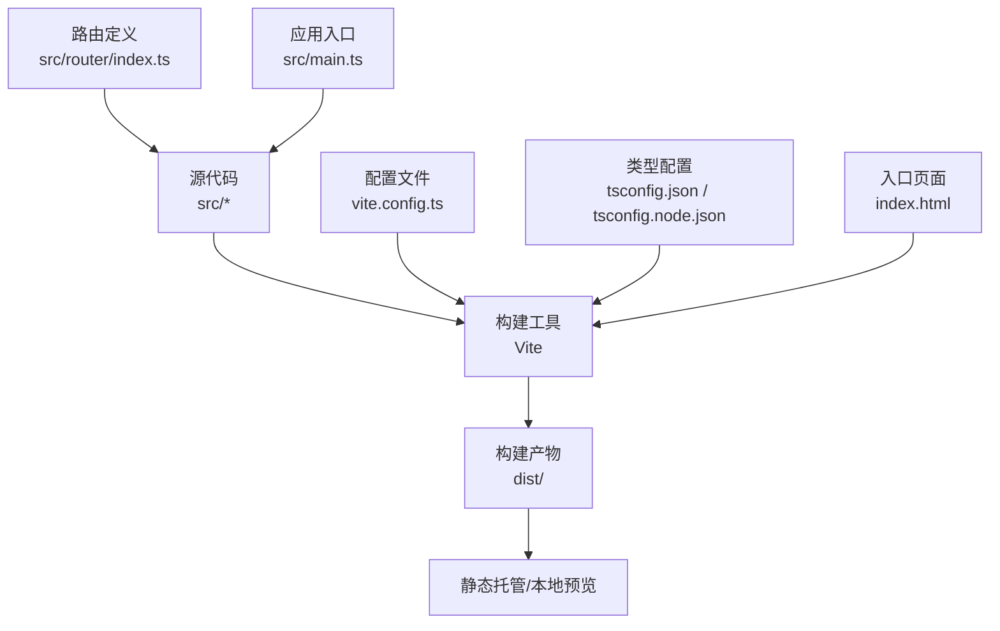
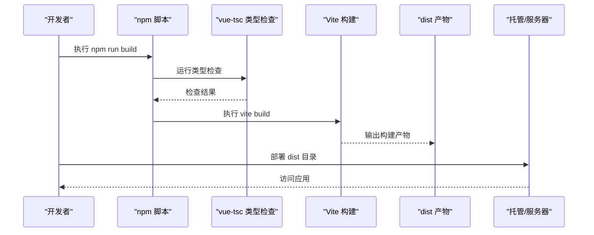
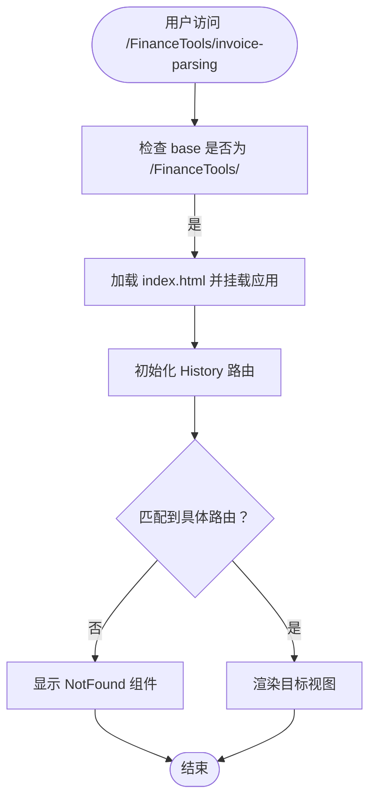
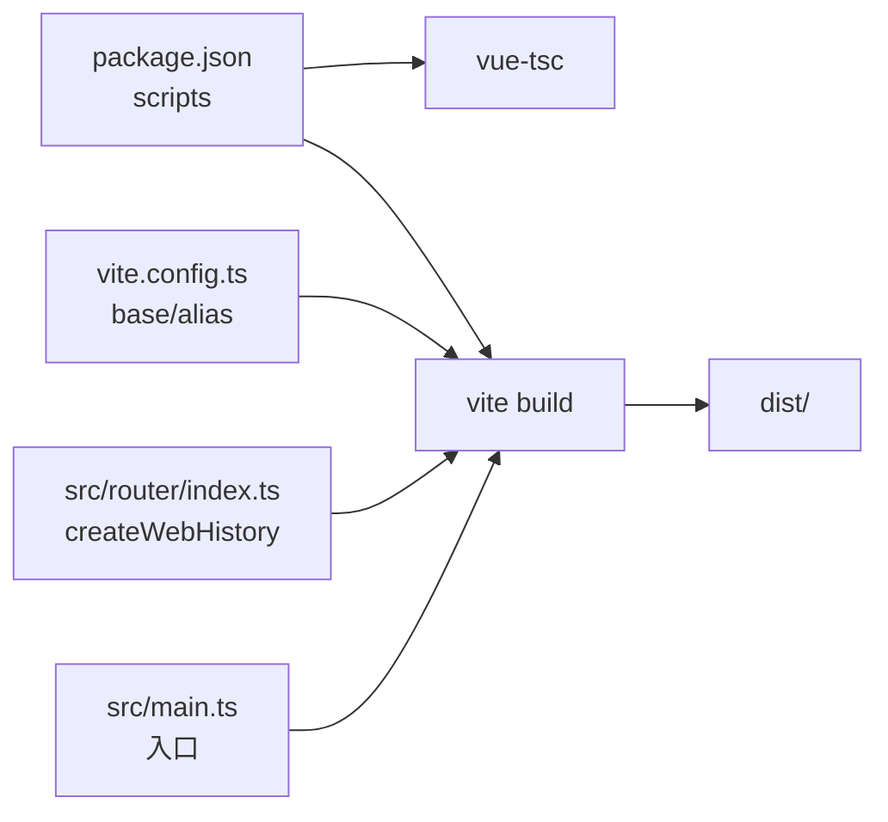

# 构建与部署

<cite>
**本文引用的文件**
- [vite.config.ts](file://vite.config.ts)
- [package.json](file://package.json)
- [tsconfig.json](file://tsconfig.json)
- [tsconfig.node.json](file://tsconfig.node.json)
- [index.html](file://index.html)
- [public/404.html](file://public/404.html)
- [src/router/index.ts](file://src/router/index.ts)
- [src/main.ts](file://src/main.ts)
- [.gitignore](file://.gitignore)
- [README.md](file://README.md)
</cite>

## 目录
1. [简介](#简介)
2. [项目结构](#项目结构)
3. [核心组件](#核心组件)
4. [架构总览](#架构总览)
5. [详细组件分析](#详细组件分析)
6. [依赖关系分析](#依赖关系分析)
7. [性能与构建优化](#性能与构建优化)
8. [部署场景与实践](#部署场景与实践)
9. [故障排查指南](#故障排查指南)
10. [结论](#结论)
11. [附录](#附录)

## 简介
本指南面向运维与开发团队，系统讲解从开发到生产环境的完整构建与部署流程。围绕项目中的 Vite 配置、TypeScript 类型检查与构建脚本、路由与静态资源基路径等关键点，给出可操作的步骤、优化建议与常见问题的解决方案。同时覆盖静态托管（如 GitHub Pages、Vercel）、本地打包运行以及跨平台分发的实践要点，帮助团队高效、稳定地完成发布。

## 项目结构
该项目采用 Vue 3 + Vite + TypeScript 技术栈，使用 Pinia 状态管理与 Naive UI 组件库。前端路由为单页应用（SPA），通过 History 模式实现客户端路由；构建产物默认输出至 dist 目录，开发服务器默认监听 3000 端口。

图表来源
- [vite.config.ts](file://vite.config.ts#L1-L18)
- [tsconfig.json](file://tsconfig.json#L1-L32)
- [tsconfig.node.json](file://tsconfig.node.json#L1-L25)
- [index.html](file://index.html#L1-L24)
- [src/router/index.ts](file://src/router/index.ts#L1-L40)
- [src/main.ts](file://src/main.ts#L1-L12)

章节来源
- [README.md](file://README.md#L1-L41)
- [vite.config.ts](file://vite.config.ts#L1-L18)
- [tsconfig.json](file://tsconfig.json#L1-L32)
- [tsconfig.node.json](file://tsconfig.node.json#L1-L25)
- [index.html](file://index.html#L1-L24)
- [src/router/index.ts](file://src/router/index.ts#L1-L40)
- [src/main.ts](file://src/main.ts#L1-L12)

## 核心组件
- 构建与开发服务器
  - 开发服务器端口与自动打开浏览器：参见 [vite.config.ts](file://vite.config.ts#L13-L16)
  - 基础路径 base：用于子路径部署（如 /FinanceTools/），参见 [vite.config.ts](file://vite.config.ts#L7)
  - 路径别名 @ 指向 src：参见 [vite.config.ts](file://vite.config.ts#L8-L12) 与 [tsconfig.json](file://tsconfig.json#L24-L27)
- 构建脚本与类型检查
  - build 脚本顺序：先执行 vue-tsc 类型检查，再执行 vite build，参见 [package.json](file://package.json#L8)
  - 类型检查独立命令：参见 [package.json](file://package.json#L10)
- 路由与 SPA 支持
  - History 模式路由：参见 [src/router/index.ts](file://src/router/index.ts#L34-L37)
  - 404 页面与 GitHub Pages SPA 重定向：参见 [public/404.html](file://public/404.html#L1-L25) 与 [index.html](file://index.html#L8-L17)
- 入口与应用初始化
  - 应用挂载与插件注册：参见 [src/main.ts](file://src/main.ts#L1-L12)

章节来源
- [vite.config.ts](file://vite.config.ts#L1-L18)
- [package.json](file://package.json#L1-L33)
- [tsconfig.json](file://tsconfig.json#L24-L27)
- [src/router/index.ts](file://src/router/index.ts#L34-L37)
- [public/404.html](file://public/404.html#L1-L25)
- [index.html](file://index.html#L8-L17)
- [src/main.ts](file://src/main.ts#L1-L12)

## 架构总览
下图展示了从开发到生产的整体流程，包括类型检查、构建、产物与部署的关键节点。

图表来源
- [package.json](file://package.json#L6-L11)
- [vite.config.ts](file://vite.config.ts#L7)
- [index.html](file://index.html#L1-L24)

## 详细组件分析

### Vite 配置与开发服务器
- 插件与基础设置
  - 使用 @vitejs/plugin-vue，参见 [vite.config.ts](file://vite.config.ts#L6)
  - 设置 base 为子路径前缀，便于在子目录下部署，参见 [vite.config.ts](file://vite.config.ts#L7)
- 路径别名
  - 将 @ 映射到 src，提升导入便捷性，参见 [vite.config.ts](file://vite.config.ts#L8-L12) 与 [tsconfig.json](file://tsconfig.json#L24-L27)
- 开发服务器
  - 端口 3000，启动后自动打开浏览器，参见 [vite.config.ts](file://vite.config.ts#L13-L16)

章节来源
- [vite.config.ts](file://vite.config.ts#L1-L18)
- [tsconfig.json](file://tsconfig.json#L24-L27)

### 构建脚本与类型检查
- build 脚本顺序
  - 先执行 vue-tsc，再执行 vite build，确保类型安全后再产出构建，参见 [package.json](file://package.json#L8)
- 类型检查独立命令
  - 仅进行类型检查不输出 JS，参见 [package.json](file://package.json#L10)
- 预览命令
  - 在本地预览生产构建效果，参见 [package.json](file://package.json#L9)

章节来源
- [package.json](file://package.json#L6-L11)

### 路由与 SPA 路由刷新 404 解决
- 路由历史模式
  - 使用 createWebHistory，路由基于浏览器 History API，参见 [src/router/index.ts](file://src/router/index.ts#L34-L37)
- 子路径部署与 base
  - base 设置为 /FinanceTools/，确保路由与静态资源路径一致，参见 [vite.config.ts](file://vite.config.ts#L7)
- 404 页面与重定向
  - index.html 中注入脚本，利用 sessionStorage.redirect 实现 SPA 刷新时的重定向，参见 [index.html](file://index.html#L8-L17)
  - public/404.html 提供 GitHub Pages 场景下的重定向逻辑，参见 [public/404.html](file://public/404.html#L1-L25)

图表来源
- [vite.config.ts](file://vite.config.ts#L7)
- [src/router/index.ts](file://src/router/index.ts#L34-L37)
- [index.html](file://index.html#L8-L17)
- [public/404.html](file://public/404.html#L1-L25)

章节来源
- [src/router/index.ts](file://src/router/index.ts#L34-L37)
- [vite.config.ts](file://vite.config.ts#L7)
- [index.html](file://index.html#L8-L17)
- [public/404.html](file://public/404.html#L1-L25)

### 应用入口与依赖注入
- 应用初始化
  - 创建 Vue 应用实例，注册 Pinia 与路由，挂载到 DOM，参见 [src/main.ts](file://src/main.ts#L1-L12)
- 路由与状态
  - 路由在 src/router/index.ts 中集中定义，参见 [src/router/index.ts](file://src/router/index.ts#L1-L40)

章节来源
- [src/main.ts](file://src/main.ts#L1-L12)
- [src/router/index.ts](file://src/router/index.ts#L1-L40)

## 依赖关系分析
- 构建链路
  - package.json 中的 build 脚本串联 vue-tsc 与 vite build，形成“类型检查先行”的构建流程，参见 [package.json](file://package.json#L8)
- 配置耦合
  - vite.config.ts 的 base 与 src/router/index.ts 的 createWebHistory(import.meta.env.BASE_URL) 共同决定应用的运行基址，参见 [vite.config.ts](file://vite.config.ts#L7) 与 [src/router/index.ts](file://src/router/index.ts#L35)
- 资源与别名
  - vite.config.ts 的 alias 与 tsconfig.json 的 paths 保持一致，确保开发与构建阶段的路径解析一致，参见 [vite.config.ts](file://vite.config.ts#L8-L12) 与 [tsconfig.json](file://tsconfig.json#L24-L27)

图表来源
- [package.json](file://package.json#L6-L11)
- [vite.config.ts](file://vite.config.ts#L7-L12)
- [src/router/index.ts](file://src/router/index.ts#L34-L37)
- [src/main.ts](file://src/main.ts#L1-L12)

章节来源
- [package.json](file://package.json#L6-L11)
- [vite.config.ts](file://vite.config.ts#L7-L12)
- [src/router/index.ts](file://src/router/index.ts#L34-L37)
- [src/main.ts](file://src/main.ts#L1-L12)

## 性能与构建优化
以下为通用优化建议，适用于本项目当前的 Vite + Vue 生态。请结合实际业务与监控数据选择性启用：
- 代码分割
  - 合理拆分路由级组件与大型模块，减少首屏体积；在路由层面按需加载组件。
- 资源压缩与 Tree Shaking
  - 使用 Vite 默认的 Rollup 压缩能力；确保模块化写法以提升 Tree Shaking 效果。
- 静态资源优化
  - 对图片、字体等静态资源进行压缩与格式优化；合理设置 base 与资源路径，避免重复请求。
- 预加载与预取
  - 对关键路由或首屏依赖进行预加载；对后续路由进行预取，改善导航体验。
- Source Map
  - 生产环境可关闭或降级 Source Map，平衡调试需求与安全性。
- 构建缓存
  - 使用 Vite 的构建缓存与依赖预构建，缩短二次构建时间。

[本节为通用指导，不直接分析具体文件，故无章节来源]

## 部署场景与实践

### 静态托管（GitHub Pages）
- 基础路径与路由
  - 由于设置了 base 为 /FinanceTools/，需要在 GitHub Pages 中配置自定义域名或子路径仓库，确保访问路径正确。
  - index.html 中已内置 SPA 刷新重定向逻辑，配合 public/404.html 可在刷新时恢复到正确路由。
- 部署步骤
  - 在仓库设置中启用 Pages，选择分支与根目录或 /docs（若使用 docs 分支）。
  - 将构建产物 dist 推送至 Pages 指定分支或目录。
- 注意事项
  - 若使用自定义域名，请确保 base 与 CNAME 配置一致。
  - 刷新 404 问题已在 HTML 中处理，无需额外服务端规则。

章节来源
- [vite.config.ts](file://vite.config.ts#L7)
- [index.html](file://index.html#L8-L17)
- [public/404.html](file://public/404.html#L1-L25)

### Vercel
- 配置要点
  - 将构建输出目录设置为 dist。
  - 设置 Vercel 的 Output Directory 为 dist。
  - 若使用自定义域名，确保与 base 一致。
- SPA 路由
  - Vercel 默认支持 SPA 路由回退，可结合 public/404.html 与 index.html 的重定向逻辑保证刷新正常。

章节来源
- [vite.config.ts](file://vite.config.ts#L7)
- [index.html](file://index.html#L8-L17)
- [public/404.html](file://public/404.html#L1-L25)

### 本地打包运行
- 本地预览
  - 使用 npm run preview 在本地快速验证生产构建效果，参见 [package.json](file://package.json#L9)
- 产物位置
  - 构建产物位于 dist 目录，可通过任意静态服务器（如 http-server、nginx）提供服务。

章节来源
- [package.json](file://package.json#L9)
- [.gitignore](file://.gitignore#L4-L6)

### 跨平台分发（桌面/移动）
- 桌面应用
  - 可结合 Electron 或 Tauri 将 dist 包装为桌面应用，注意 base 与资源路径在打包后的适配。
- 移动端
  - 若计划在移动端使用，建议在构建后进行移动端兼容性测试与资源优化。

[本节为通用指导，不直接分析具体文件，故无章节来源]

## 故障排查指南
- 路由刷新 404
  - 症状：在子路径部署后，刷新页面出现 404。
  - 排查：确认 vite.config.ts 的 base 与实际部署路径一致；确认 index.html 与 public/404.html 的重定向逻辑是否生效。
  - 参考：[vite.config.ts](file://vite.config.ts#L7)、[index.html](file://index.html#L8-L17)、[public/404.html](file://public/404.html#L1-L25)
- 资源路径错误
  - 症状：图片、样式或字体加载失败。
  - 排查：检查 base 设置与资源引用是否相对 base；确认路径别名 @ 的使用是否一致。
  - 参考：[vite.config.ts](file://vite.config.ts#L7-L12)、[tsconfig.json](file://tsconfig.json#L24-L27)
- 类型检查失败导致构建中断
  - 症状：npm run build 失败。
  - 排查：先单独执行 npm run type-check 确认类型错误，修复后再执行构建。
  - 参考：[package.json](file://package.json#L8, file://package.json#L10)
- 开发服务器无法访问
  - 症状：localhost:3000 无法打开。
  - 排查：确认端口占用；检查防火墙；尝试更换端口或禁用自动打开浏览器。
  - 参考：[vite.config.ts](file://vite.config.ts#L13-L16)

章节来源
- [vite.config.ts](file://vite.config.ts#L7-L16)
- [package.json](file://package.json#L8, file://package.json#L10)
- [index.html](file://index.html#L8-L17)
- [public/404.html](file://public/404.html#L1-L25)
- [tsconfig.json](file://tsconfig.json#L24-L27)

## 结论
本项目以 Vite 为核心构建工具，结合 TypeScript 类型检查与 Vue Router History 模式，提供了清晰的开发与构建流程。通过设置 base 与完善的 SPA 重定向机制，可在多种静态托管环境中稳定运行。建议在生产部署前，先在本地预览验证，并根据目标环境调整 base 与资源路径；同时持续关注构建体积与加载性能，按需启用代码分割与资源优化策略。

[本节为总结性内容，不直接分析具体文件，故无章节来源]

## 附录

### 关键配置速览
- 构建与开发
  - 开发服务器端口与自动打开：参见 [vite.config.ts](file://vite.config.ts#L13-L16)
  - 基础路径 base：参见 [vite.config.ts](file://vite.config.ts#L7)
  - 路径别名 @：参见 [vite.config.ts](file://vite.config.ts#L8-L12) 与 [tsconfig.json](file://tsconfig.json#L24-L27)
- 类型检查与构建
  - build 脚本顺序：参见 [package.json](file://package.json#L8)
  - 独立类型检查：参见 [package.json](file://package.json#L10)
  - 本地预览：参见 [package.json](file://package.json#L9)
- 路由与 SPA
  - History 路由：参见 [src/router/index.ts](file://src/router/index.ts#L34-L37)
  - 刷新重定向：参见 [index.html](file://index.html#L8-L17) 与 [public/404.html](file://public/404.html#L1-L25)

章节来源
- [vite.config.ts](file://vite.config.ts#L7-L16)
- [tsconfig.json](file://tsconfig.json#L24-L27)
- [package.json](file://package.json#L8, file://package.json#L9, file://package.json#L10)
- [src/router/index.ts](file://src/router/index.ts#L34-L37)
- [index.html](file://index.html#L8-L17)
- [public/404.html](file://public/404.html#L1-L25)