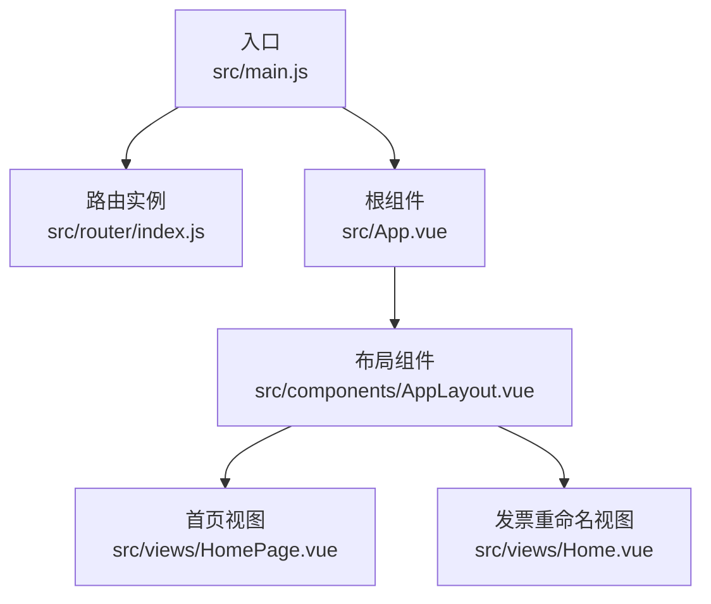
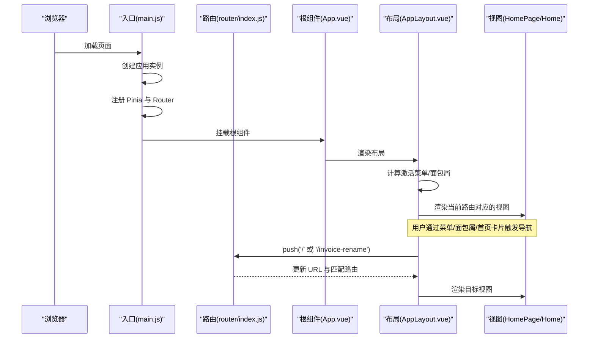
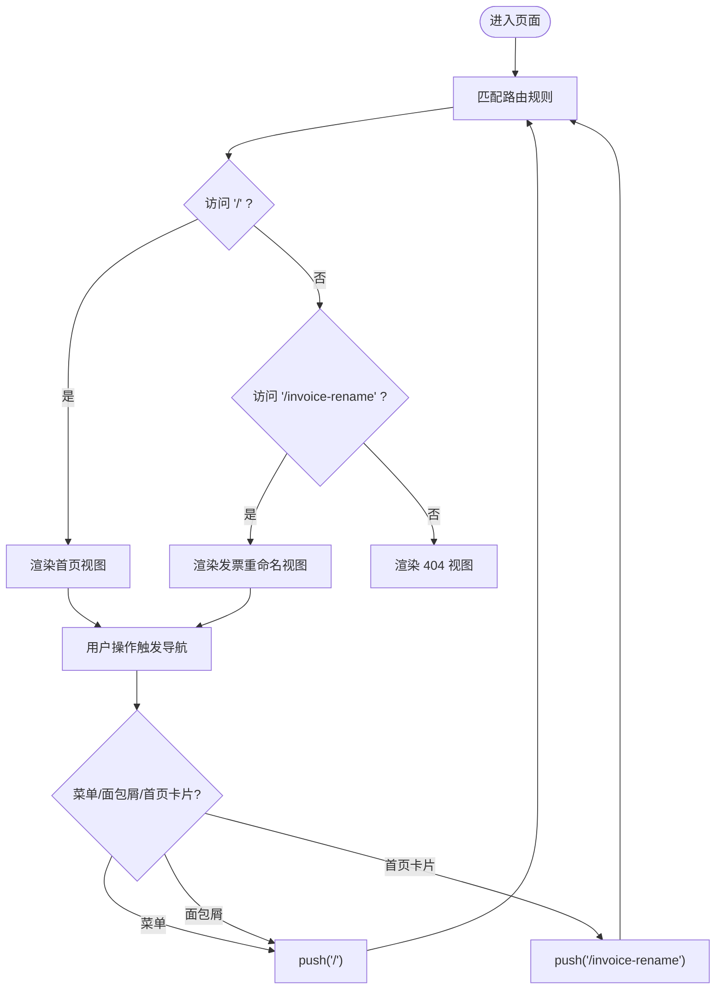
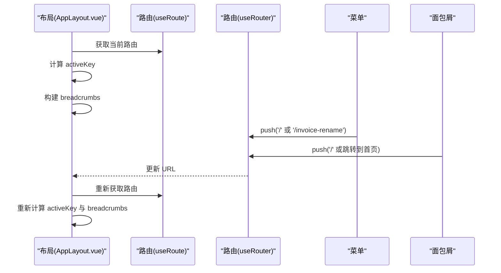
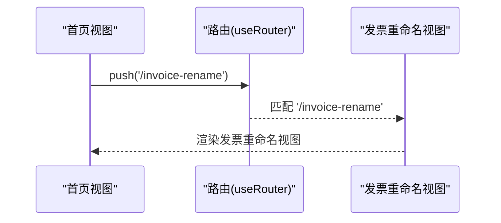
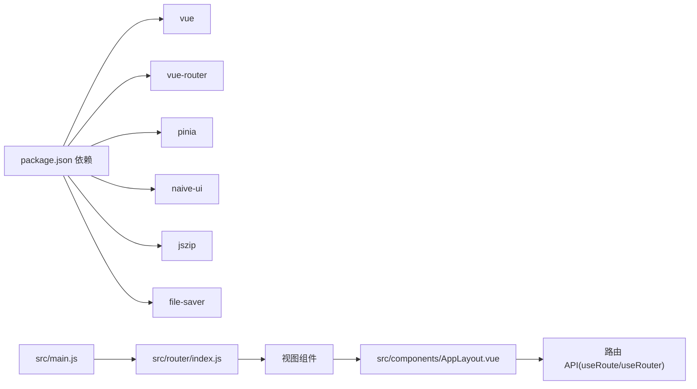

# Vue Router 集成

<cite>
**本文引用的文件**
- [src/main.js](file://src/main.js)
- [src/router/index.js](file://src/router/index.js)
- [src/App.vue](file://src/App.vue)
- [src/components/AppLayout.vue](file://src/components/AppLayout.vue)
- [src/views/HomePage.vue](file://src/views/HomePage.vue)
- [src/views/Home.vue](file://src/views/Home.vue)
- [package.json](file://package.json)
</cite>

## 目录
1. [简介](#简介)
2. [项目结构](#项目结构)
3. [核心组件](#核心组件)
4. [架构总览](#架构总览)
5. [详细组件分析](#详细组件分析)
6. [依赖关系分析](#依赖关系分析)
7. [性能考虑](#性能考虑)
8. [故障排查指南](#故障排查指南)
9. [结论](#结论)

## 简介
本项目采用 Vue 3 + Vue Router + Pinia 的前端技术栈，通过路由配置与应用挂载流程，实现了首页与“发票重命名”功能页的导航与切换。路由以 History 模式运行，结合全局布局组件与视图组件，形成清晰的页面组织与导航体验。

## 项目结构
- 入口与挂载
  - 应用入口负责创建应用实例、注册 Pinia 和 Vue Router，并将根组件挂载到 DOM。
- 路由配置
  - 路由模块集中定义了首页与发票重命名页的路由规则，并统一导出路由实例供入口使用。
- 视图与布局
  - 布局组件提供侧边菜单、面包屑、主题切换与页脚等通用 UI；视图组件承载具体业务逻辑。
- 导航联动
  - 首页卡片点击与布局菜单/面包屑均通过路由 API 进行页面跳转，保证导航一致性。

图表来源
- [src/main.js](file://src/main.js#L1-L12)
- [src/router/index.js](file://src/router/index.js#L1-L33)
- [src/App.vue](file://src/App.vue#L1-L20)
- [src/components/AppLayout.vue](file://src/components/AppLayout.vue#L1-L40)
- [src/views/HomePage.vue](file://src/views/HomePage.vue#L1-L30)
- [src/views/Home.vue](file://src/views/Home.vue#L1-L20)

章节来源
- [src/main.js](file://src/main.js#L1-L12)
- [src/router/index.js](file://src/router/index.js#L1-L33)
- [src/App.vue](file://src/App.vue#L1-L20)

## 核心组件
- 应用入口与挂载
  - 创建应用实例，注册 Pinia 与 Vue Router，最后挂载根组件。
- 路由配置
  - 定义首页与发票重命名页两条路由，并设置通用的 404 页面。
- 布局组件
  - 提供侧边菜单、面包屑、标题、暗色模式切换与页脚；根据当前路由动态计算激活菜单与面包屑路径。
- 视图组件
  - 首页视图提供工具卡片点击跳转；发票重命名视图负责文件上传、解析、展示与导出。

章节来源
- [src/main.js](file://src/main.js#L1-L12)
- [src/router/index.js](file://src/router/index.js#L1-L33)
- [src/components/AppLayout.vue](file://src/components/AppLayout.vue#L140-L250)
- [src/views/HomePage.vue](file://src/views/HomePage.vue#L60-L72)
- [src/views/Home.vue](file://src/views/Home.vue#L1-L40)

## 架构总览
下图展示了应用启动、路由初始化与页面渲染的整体流程，以及导航交互如何驱动页面切换。

图表来源
- [src/main.js](file://src/main.js#L1-L12)
- [src/router/index.js](file://src/router/index.js#L1-L33)
- [src/App.vue](file://src/App.vue#L1-L20)
- [src/components/AppLayout.vue](file://src/components/AppLayout.vue#L140-L250)
- [src/views/HomePage.vue](file://src/views/HomePage.vue#L60-L72)

## 详细组件分析

### 路由配置与导航
- 路由定义
  - 首页路由指向首页视图组件，设置页面标题元信息。
  - 发票重命名路由指向发票重命名视图组件，同样设置页面标题元信息。
  - 通配符路由作为 404 页面，统一处理未匹配路径。
- 历史模式
  - 使用 History 模式，基于浏览器历史记录进行导航。
- 导航触发点
  - 首页视图通过路由 API 跳转至发票重命名页。
  - 布局组件的菜单与面包屑也通过路由 API 进行跳转，确保导航一致。

图表来源
- [src/router/index.js](file://src/router/index.js#L1-L33)
- [src/views/HomePage.vue](file://src/views/HomePage.vue#L60-L72)
- [src/components/AppLayout.vue](file://src/components/AppLayout.vue#L235-L249)

章节来源
- [src/router/index.js](file://src/router/index.js#L1-L33)
- [src/views/HomePage.vue](file://src/views/HomePage.vue#L60-L72)
- [src/components/AppLayout.vue](file://src/components/AppLayout.vue#L235-L249)

### 布局与导航联动
- 激活菜单计算
  - 根据当前路由路径计算激活菜单键值，用于高亮与面包屑构建。
- 面包屑构建
  - 通过菜单选项树查找当前项路径，拼接首页与当前项，形成可点击的面包屑链路。
- 导航行为
  - 菜单选择与面包屑点击分别调用路由 API 进行跳转，首页卡片点击亦同。
- 标题与元信息
  - 路由元信息包含页面标题，布局组件据此展示当前页面标题。

图表来源
- [src/components/AppLayout.vue](file://src/components/AppLayout.vue#L140-L250)

章节来源
- [src/components/AppLayout.vue](file://src/components/AppLayout.vue#L140-L250)

### 视图组件与路由集成
- 首页视图
  - 提供工具卡片点击事件，通过路由 API 推送至发票重命名页。
- 发票重命名视图
  - 作为路由匹配的目标视图，负责文件上传、解析、展示与导出等业务逻辑。

图表来源
- [src/views/HomePage.vue](file://src/views/HomePage.vue#L60-L72)
- [src/router/index.js](file://src/router/index.js#L1-L33)

章节来源
- [src/views/HomePage.vue](file://src/views/HomePage.vue#L60-L72)
- [src/views/Home.vue](file://src/views/Home.vue#L1-L40)

## 依赖关系分析
- 运行时依赖
  - Vue 3、Vue Router、Pinia、Naive UI、JSZip、FileSaver、pdfjs-dist、fast-xml-parser 等。
- 路由相关
  - 入口文件注册 Vue Router；路由模块定义路由表并导出实例；视图与布局组件通过路由 API 进行导航。
- 组件耦合
  - 布局组件与路由紧密耦合，用于菜单与面包屑联动；首页视图与发票重命名视图通过路由解耦，仅通过路由 API 协作。

图表来源
- [package.json](file://package.json#L1-L27)
- [src/main.js](file://src/main.js#L1-L12)
- [src/router/index.js](file://src/router/index.js#L1-L33)
- [src/components/AppLayout.vue](file://src/components/AppLayout.vue#L106-L176)

章节来源
- [package.json](file://package.json#L1-L27)
- [src/main.js](file://src/main.js#L1-L12)
- [src/router/index.js](file://src/router/index.js#L1-L33)
- [src/components/AppLayout.vue](file://src/components/AppLayout.vue#L106-L176)

## 性能考虑
- 路由切换
  - 使用 History 模式，避免哈希模式带来的额外字符开销；路由切换为前端路由，减少网络请求。
- 组件渲染
  - 布局组件与视图组件按需渲染，路由切换时仅渲染目标视图，降低不必要的重绘。
- 导航一致性
  - 通过统一的路由 API 进行导航，避免重复监听或手动 DOM 操作，减少潜在性能问题。

## 故障排查指南
- 路由无法匹配
  - 检查路由表是否包含目标路径；确认通配符路由是否正确配置。
- 导航无效
  - 确认布局组件与视图组件是否正确调用路由 API；检查菜单/面包屑点击事件绑定。
- 生产环境 404
  - 确认服务器已配置支持前端路由回退至 index.html，否则刷新会返回 404。

章节来源
- [src/router/index.js](file://src/router/index.js#L1-L33)
- [src/components/AppLayout.vue](file://src/components/AppLayout.vue#L235-L249)
- [src/views/HomePage.vue](file://src/views/HomePage.vue#L60-L72)

## 结论
本项目通过简洁的路由配置与统一的导航 API，实现了首页与发票重命名页之间的平滑切换。布局组件与视图组件职责清晰，配合 History 模式与 Pinia 状态管理，提供了良好的用户体验与可维护性。后续如需扩展新功能页，只需在路由表中新增条目并复用现有导航机制即可。