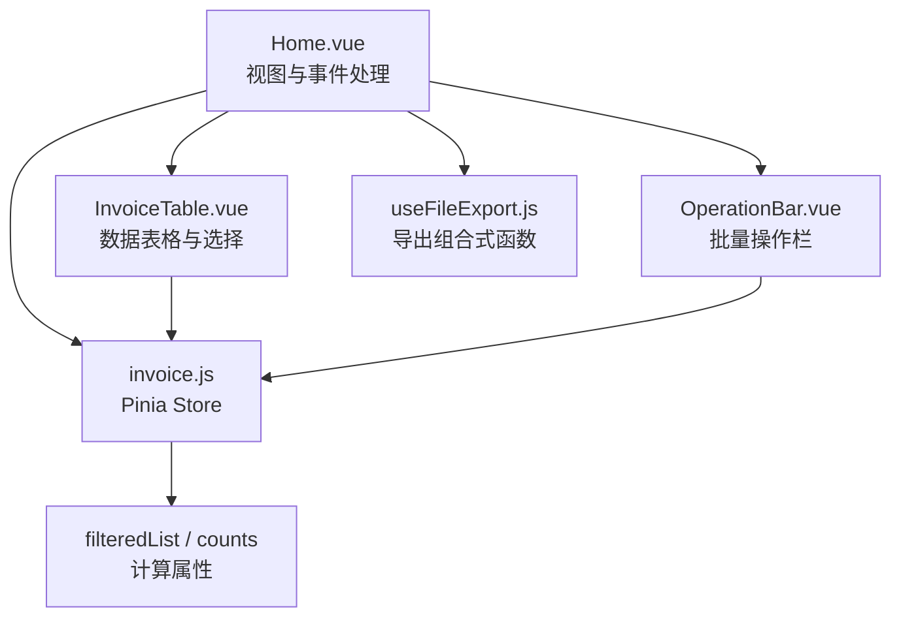
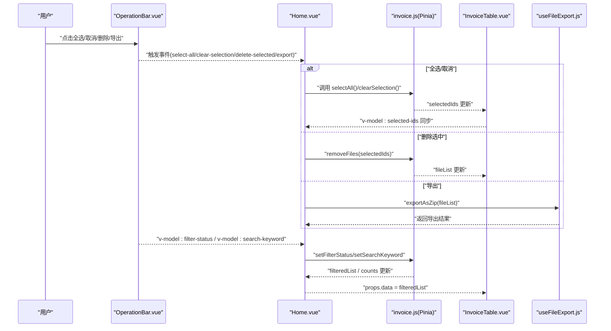
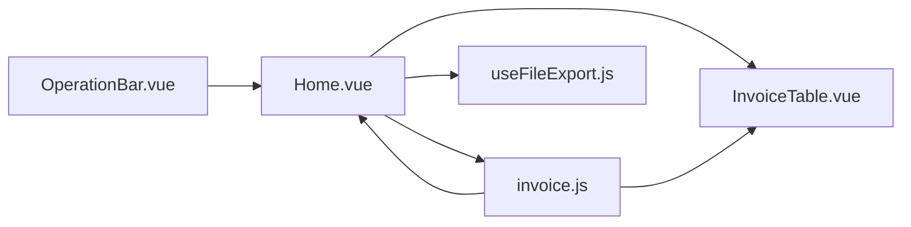

# 批量操作

<cite>
**本文引用的文件**
- [src/components/OperationBar.vue](file://src/components/OperationBar.vue)
- [src/views/Home.vue](file://src/views/Home.vue)
- [src/stores/invoice.js](file://src/stores/invoice.js)
- [src/components/InvoiceTable.vue](file://src/components/InvoiceTable.vue)
- [src/composables/useFileExport.js](file://src/composables/useFileExport.js)
- [README.md](file://README.md)
</cite>

## 目录
1. [简介](#简介)
2. [项目结构](#项目结构)
3. [核心组件](#核心组件)
4. [架构总览](#架构总览)
5. [详细组件分析](#详细组件分析)
6. [依赖关系分析](#依赖关系分析)
7. [性能考量](#性能考量)
8. [故障排查指南](#故障排查指南)
9. [结论](#结论)

## 简介
本节文档围绕“批量操作”主题，系统性梳理 OperationBar.vue 组件提供的批量功能与其内部实现机制，并说明其与 Home.vue、Pinia Store 以及导出组合式函数之间的协作关系。重点包括：
- 状态筛选：全部/成功/失败
- 关键词搜索
- 全选/取消全选
- 批量删除
- 批量导出
- 统计信息展示：总数、成功数、失败数
- 事件驱动与按钮启用/禁用逻辑

## 项目结构
该功能位于前端工程的组件层与状态管理层之间，采用“视图层组件 + Pinia Store + 组合式函数”的分层设计：
- 视图层：Home.vue 展示上传、操作栏、表格与导出流程
- 组件层：OperationBar.vue 提供批量操作 UI；InvoiceTable.vue 提供选择与编辑能力
- 状态层：useInvoiceStore 管理文件列表、筛选条件、选中项与计算属性
- 功能层：useFileExport 提供导出 ZIP 的异步流程

图表来源
- [src/views/Home.vue](file://src/views/Home.vue#L1-L120)
- [src/components/OperationBar.vue](file://src/components/OperationBar.vue#L1-L60)
- [src/stores/invoice.js](file://src/stores/invoice.js#L1-L60)
- [src/components/InvoiceTable.vue](file://src/components/InvoiceTable.vue#L1-L40)
- [src/composables/useFileExport.js](file://src/composables/useFileExport.js#L1-L40)

章节来源
- [README.md](file://README.md#L1-L38)
- [src/views/Home.vue](file://src/views/Home.vue#L1-L120)
- [src/stores/invoice.js](file://src/stores/invoice.js#L1-L60)

## 核心组件
- OperationBar.vue：提供状态筛选、关键词搜索、全选/取消全选、批量删除、批量导出等批量操作入口，并通过 v-model 双向绑定 filterStatus 与 searchKeyword，实时联动 store 中的 filteredList 计算属性，实现动态过滤。
- Home.vue：作为页面容器，负责：
  - 将 store 的状态与计算属性传入 OperationBar.vue
  - 接收并处理 @select-all、@clear-selection、@delete-selected、@export 等事件
  - 调用 store 对应方法或启动导出流程
- invoice.js（Pinia Store）：维护 fileList、filterStatus、searchKeyword、selectedIds 等状态，提供 filteredList、successCount、failedCount、totalCount 等计算属性，以及批量选择、清空选择、删除、导出等方法。
- InvoiceTable.vue：提供选择列与编辑输入，将选中项同步回 store.selectedIds。
- useFileExport.js：封装导出 ZIP 的异步流程，返回 isExporting 状态与 exportAsZip 方法。

章节来源
- [src/components/OperationBar.vue](file://src/components/OperationBar.vue#L1-L119)
- [src/views/Home.vue](file://src/views/Home.vue#L1-L120)
- [src/stores/invoice.js](file://src/stores/invoice.js#L1-L204)
- [src/components/InvoiceTable.vue](file://src/components/InvoiceTable.vue#L1-L162)
- [src/composables/useFileExport.js](file://src/composables/useFileExport.js#L1-L80)

## 架构总览
下图展示了从用户在 OperationBar.vue 上进行批量操作，到 Home.vue 响应事件，再到 Pinia Store 更新状态与计算属性，最终影响 InvoiceTable.vue 展示的完整链路。

图表来源
- [src/components/OperationBar.vue](file://src/components/OperationBar.vue#L1-L60)
- [src/views/Home.vue](file://src/views/Home.vue#L1-L120)
- [src/stores/invoice.js](file://src/stores/invoice.js#L120-L204)
- [src/components/InvoiceTable.vue](file://src/components/InvoiceTable.vue#L1-L60)
- [src/composables/useFileExport.js](file://src/composables/useFileExport.js#L1-L80)

## 详细组件分析

### OperationBar.vue：批量操作栏
- 状态筛选
  - 使用单选按钮组绑定本地状态 localFilterStatus，并通过 update:filterStatus 事件将变更同步至父组件 Home.vue 的 store.filterStatus。
  - 统计标签显示 totalCount、successCount、failedCount，用于直观了解当前筛选条件下的数量分布。
- 关键词搜索
  - 输入框绑定 localSearchKeyword，并通过 update:searchKeyword 事件将关键字同步至 Home.vue 的 store.searchKeyword。
- 全选/取消全选
  - 全选按钮在 totalCount 为 0 时不启用；点击后向父组件发出 select-all 事件，由 Home.vue 调用 store.selectAll。
  - 取消选择按钮在 selectedCount 为 0 时不启用；点击后发出 clear-selection 事件，由 Home.vue 调用 store.clearSelection。
- 批量删除
  - 删除按钮在 selectedCount 为 0 时不启用；点击后发出 delete-selected 事件，Home.vue 弹窗确认后调用 store.removeFiles。
- 批量导出
  - 导出按钮在 successCount 为 0 时不启用；点击后发出 export 事件，Home.vue 调用 useFileExport.exportAsZip 并根据返回结果提示。
- 双向绑定与联动
  - 通过 v-model:filter-status 与 v-model:search-keyword 与 Home.vue 的 store 同步，从而驱动 store.filteredList 计算属性，使表格数据实时更新。

章节来源
- [src/components/OperationBar.vue](file://src/components/OperationBar.vue#L1-L119)

### Home.vue：页面容器与事件处理
- 与 OperationBar.vue 的双向绑定
  - v-model:filter-status 与 v-model:search-keyword 绑定 store.filterStatus 与 store.searchKeyword。
  - :total-count、:success-count、:failed-count、:selected-count、:is-exporting 传入 OperationBar.vue。
- 事件处理
  - @select-all：调用 store.selectAll
  - @clear-selection：调用 store.clearSelection
  - @delete-selected：弹窗确认后调用 store.removeFiles
  - @export：调用 useFileExport.exportAsZip 并根据结果提示
- 表格数据绑定
  - :data="store.filteredList" 将筛选后的数据传递给 InvoiceTable.vue
  - v-model:selected-ids="store.selectedIds" 将表格选择状态同步回 store

章节来源
- [src/views/Home.vue](file://src/views/Home.vue#L1-L120)
- [src/views/Home.vue](file://src/views/Home.vue#L180-L216)

### invoice.js（Pinia Store）：状态与计算属性
- 状态字段
  - fileList：原始文件列表
  - filterStatus：筛选状态（all/success/failed）
  - searchKeyword：搜索关键字
  - selectedIds：选中项 ID 数组
  - isProcessing：处理中标志
- 计算属性
  - filteredList：按 filterStatus 与 searchKeyword 过滤后的列表
  - successCount / failedCount / totalCount：基于 fileList 的统计
- 方法
  - addFile / updateFile / removeFile / removeFiles / clearAll
  - toggleSelection / selectAll / clearSelection
  - setFilterStatus / setSearchKeyword

章节来源
- [src/stores/invoice.js](file://src/stores/invoice.js#L1-L204)

### InvoiceTable.vue：选择与编辑
- 选择列
  - 类型为 selection 的列，通过 @update:checked-row-keys 将选中项 ID 数组回传给父组件，父组件将其写入 store.selectedIds。
- 编辑能力
  - 购买方名称与金额字段以输入框形式提供编辑，编辑后向上抛出 edit 事件，Home.vue 调用 store.updateFile 更新对应项。
- 展示与分页
  - 使用分页配置，支持滚动与列宽设置。

章节来源
- [src/components/InvoiceTable.vue](file://src/components/InvoiceTable.vue#L1-L162)

### useFileExport.js：导出流程
- 导出策略
  - 默认仅导出状态为 success 的文件；ZIP 名称包含时间戳。
- 异步流程
  - 设置 isExporting=true，逐个将文件添加到 JSZip，生成 Blob 并下载，最后恢复 isExporting=false。
  - 返回包含 success、fileCount、fileName 或错误信息的对象。

章节来源
- [src/composables/useFileExport.js](file://src/composables/useFileExport.js#L1-L80)

## 依赖关系分析
- 组件耦合
  - OperationBar.vue 与 Home.vue 通过事件与 v-model 双向绑定耦合，Home.vue 再与 Pinia Store 解耦。
  - Home.vue 与 InvoiceTable.vue 通过 props 与 v-model 双向绑定耦合，实现选择状态同步。
  - Home.vue 与 useFileExport.js 通过组合式函数解耦，导出流程独立于业务逻辑。
- 计算属性依赖
  - filteredList 依赖 filterStatus 与 searchKeyword；totalCount、successCount、failedCount 依赖 fileList。
- 外部依赖
  - JSZip 与 file-saver 用于导出 ZIP；Naive UI 组件库用于界面与交互。

图表来源
- [src/components/OperationBar.vue](file://src/components/OperationBar.vue#L1-L60)
- [src/views/Home.vue](file://src/views/Home.vue#L1-L120)
- [src/stores/invoice.js](file://src/stores/invoice.js#L1-L60)
- [src/components/InvoiceTable.vue](file://src/components/InvoiceTable.vue#L1-L40)
- [src/composables/useFileExport.js](file://src/composables/useFileExport.js#L1-L40)

章节来源
- [src/components/OperationBar.vue](file://src/components/OperationBar.vue#L1-L119)
- [src/views/Home.vue](file://src/views/Home.vue#L1-L120)
- [src/stores/invoice.js](file://src/stores/invoice.js#L1-L204)
- [src/components/InvoiceTable.vue](file://src/components/InvoiceTable.vue#L1-L162)
- [src/composables/useFileExport.js](file://src/composables/useFileExport.js#L1-L80)

## 性能考量
- 过滤复杂度
  - filteredList 在每次 filterStatus 或 searchKeyword 变更时重新计算，时间复杂度为 O(n)；建议在大数据量场景下避免频繁触发搜索与筛选，或考虑分页与虚拟滚动。
- 导出复杂度
  - 导出流程对每个文件执行读取与压缩，时间复杂度近似 O(k)，k 为导出文件数量；ZIP 生成与下载可能阻塞 UI，isExporting 状态用于提示与禁用导出按钮，避免重复触发。
- 选择同步
  - 全选/取消全选直接基于 filteredList 的 ID 列表，避免逐条遍历，提升性能。

[本节为通用性能建议，不直接分析具体文件，故无章节来源]

## 故障排查指南
- 按钮不可用
  - 全选/取消/删除按钮在 selectedCount 为 0 时不启用；导出按钮在 successCount 为 0 时不启用。请检查筛选条件与选中状态。
- 导出失败
  - 若没有可导出的文件，导出会抛出错误；请确认至少存在一个状态为 success 的文件。
- 筛选无效
  - 确认 v-model:filter-status 与 v-model:search-keyword 是否正确绑定到 store；检查 store.filteredList 是否被正确传入表格。
- 删除未生效
  - 确认 @delete-selected 事件已触发 Home.vue 的 handleDeleteSelected，并调用 store.removeFiles；同时检查 selectedIds 是否为空。

章节来源
- [src/components/OperationBar.vue](file://src/components/OperationBar.vue#L28-L52)
- [src/views/Home.vue](file://src/views/Home.vue#L180-L216)
- [src/stores/invoice.js](file://src/stores/invoice.js#L120-L204)
- [src/composables/useFileExport.js](file://src/composables/useFileExport.js#L1-L80)

## 结论
OperationBar.vue 通过 v-model 与事件机制，将用户在操作栏上的批量操作意图高效地传递给 Home.vue 与 Pinia Store，实现了状态筛选、关键词搜索、全选/取消全选、批量删除与批量导出的闭环。配合 useFileExport.js 的异步导出流程与 InvoiceTable.vue 的选择同步，形成了清晰、可扩展且易维护的功能架构。建议在大规模数据场景下进一步优化筛选与导出策略，确保用户体验与性能平衡。