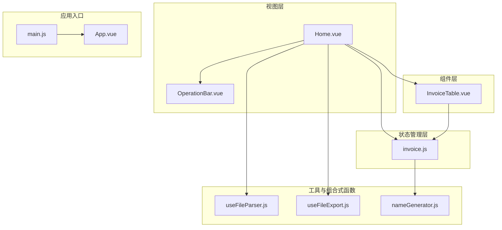
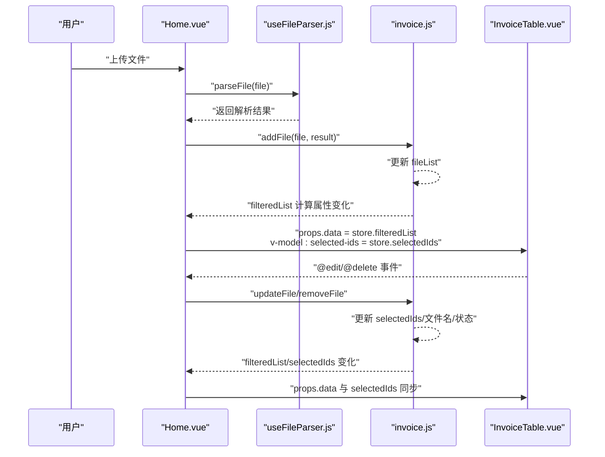
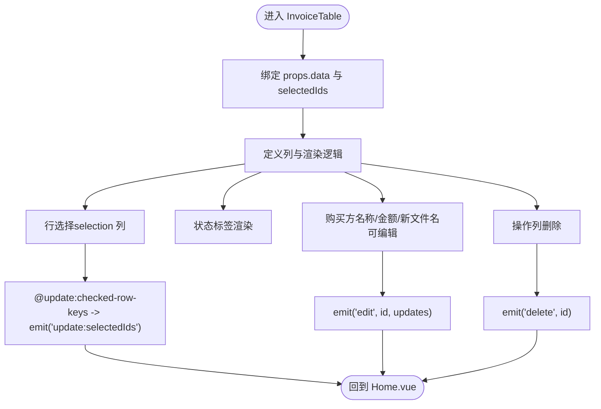
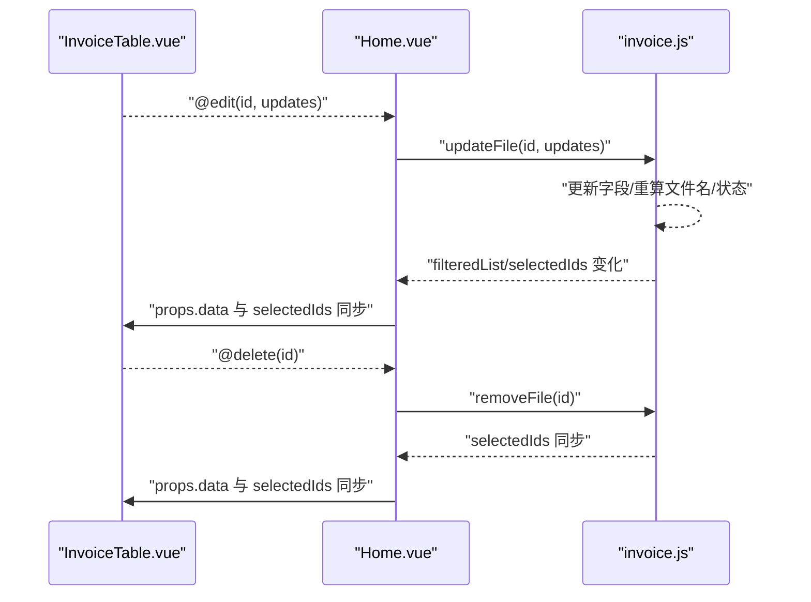
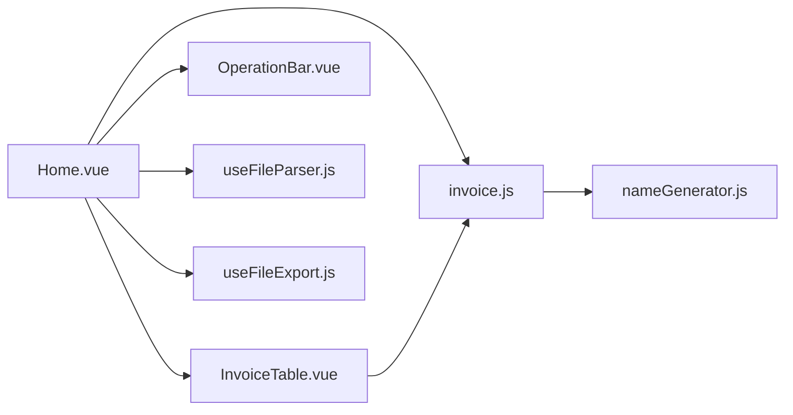

# 数据展示

<cite>
**本文引用的文件**
- [InvoiceTable.vue](file://src/components/InvoiceTable.vue)
- [invoice.js](file://src/stores/invoice.js)
- [Home.vue](file://src/views/Home.vue)
- [nameGenerator.js](file://src/utils/nameGenerator.js)
- [useFileParser.js](file://src/composables/useFileParser.js)
- [useFileExport.js](file://src/composables/useFileExport.js)
- [OperationBar.vue](file://src/components/OperationBar.vue)
- [App.vue](file://src/App.vue)
- [main.js](file://src/main.js)
</cite>

## 目录
1. [简介](#简介)
2. [项目结构](#项目结构)
3. [核心组件](#核心组件)
4. [架构总览](#架构总览)
5. [详细组件分析](#详细组件分析)
6. [依赖关系分析](#依赖关系分析)
7. [性能考虑](#性能考虑)
8. [故障排查指南](#故障排查指南)
9. [结论](#结论)

## 简介
本文件聚焦于发票信息的数据展示机制，围绕 InvoiceTable.vue 组件如何接收来自 Pinia store（invoice.js）的 filteredList 计算属性作为数据源，使用 Naive UI 的表格组件渲染发票列表，并展示原始文件名、购买方名称、金额、新文件名及处理状态等关键字段。文档同时说明表格支持的功能：通过 v-model 绑定 selectedIds 实现行选择；支持对购买方名称与金额字段的手动编辑（触发 @edit 事件）；以及单行删除（@delete 事件）。Home.vue 如何响应这些事件并更新 store 中的状态，亦在文中详述。此外，涵盖表格的响应式布局、空状态处理、加载状态反馈以及与状态管理 store 的响应式同步机制，并给出性能优化建议。

## 项目结构
- 视图层
  - Home.vue：主视图容器，负责上传、进度反馈、空状态、操作栏与表格的集成。
- 组件层
  - InvoiceTable.vue：基于 Naive UI 渲染发票列表，提供行选择、编辑与删除能力。
  - OperationBar.vue：过滤与搜索输入、全选/清空、批量删除与导出按钮。
- 状态管理层
  - invoice.js：基于 Pinia 的发票数据状态管理，包含 fileList、filteredList、selectedIds、计数统计与增删改方法。
- 工具与组合式函数
  - nameGenerator.js：文件名生成与格式化规则。
  - useFileParser.js：文件解析（PDF/XML）与进度控制。
  - useFileExport.js：ZIP 导出功能。
- 应用入口
  - main.js：创建应用并挂载 Pinia。
  - App.vue：全局主题与路由容器。

图表来源
- [Home.vue](file://src/views/Home.vue#L1-L120)
- [InvoiceTable.vue](file://src/components/InvoiceTable.vue#L1-L162)
- [invoice.js](file://src/stores/invoice.js#L1-L204)
- [useFileParser.js](file://src/composables/useFileParser.js#L1-L102)
- [useFileExport.js](file://src/composables/useFileExport.js#L1-L80)
- [nameGenerator.js](file://src/utils/nameGenerator.js#L1-L225)
- [main.js](file://src/main.js#L1-L9)
- [App.vue](file://src/App.vue#L1-L45)

章节来源
- [Home.vue](file://src/views/Home.vue#L1-L120)
- [InvoiceTable.vue](file://src/components/InvoiceTable.vue#L1-L162)
- [invoice.js](file://src/stores/invoice.js#L1-L204)
- [useFileParser.js](file://src/composables/useFileParser.js#L1-L102)
- [useFileExport.js](file://src/composables/useFileExport.js#L1-L80)
- [nameGenerator.js](file://src/utils/nameGenerator.js#L1-L225)
- [main.js](file://src/main.js#L1-L9)
- [App.vue](file://src/App.vue#L1-L45)

## 核心组件
- InvoiceTable.vue
  - 接收来自父组件的 data（即 store.filteredList）与 selectedIds（双向绑定）。
  - 使用 Naive UI 的 NDataTable 渲染列，包括序号、原文件名、发票类型、购买方名称、金额、新文件名、状态、失败原因、操作（删除）。
  - 支持行选择（selection 列）并通过 @update:checked-row-keys 事件将选中键回传给父组件。
  - 对购买方名称、金额、新文件名三列提供可编辑输入框，编辑时通过 @edit 事件向父组件传递 {id, updates}。
  - 单击“删除”按钮通过 @delete 事件通知父组件删除该行。
  - 表格配置了分页与横向滚动宽度，以适配宽表展示。
- invoice.js（Pinia Store）
  - 状态：fileList、filterStatus、searchKeyword、selectedIds、isProcessing。
  - 计算属性：filteredList（按状态与关键词过滤）、successCount、failedCount、totalCount。
  - 方法：addFile（解析后写入 store）、updateFile（编辑字段并触发文件名重算）、removeFile/removeFiles/clearAll、toggleSelection/selectAll/clearSelection、setFilterStatus/setSearchKeyword。
- Home.vue
  - 通过 v-model:filter-status 与 v-model:search-keyword 双向绑定 store 的过滤条件。
  - 将 store.filteredList 作为数据源传给 InvoiceTable。
  - 通过 v-model:selected-ids 双向绑定 store.selectedIds，实现表格行选择与视图联动。
  - 监听 @edit/@delete 事件，调用 store.updateFile/store.removeFile。
  - 空状态：当 store.totalCount 为 0 时显示“还没有上传任何文件”的提示。
  - 加载状态：处理上传队列时显示进度模态框与进度条。
- OperationBar.vue
  - 提供过滤状态与搜索关键词输入，通过 v-model 双向绑定 store.filterStatus 与 store.searchKeyword。
  - 提供全选/清空、批量删除、导出等操作，内部通过 emit 触发对应事件。

章节来源
- [InvoiceTable.vue](file://src/components/InvoiceTable.vue#L1-L162)
- [invoice.js](file://src/stores/invoice.js#L1-L204)
- [Home.vue](file://src/views/Home.vue#L1-L120)
- [OperationBar.vue](file://src/components/OperationBar.vue#L55-L118)

## 架构总览
下图展示了从用户交互到状态更新与表格渲染的端到端流程，包括上传、解析、写入 store、过滤与渲染、编辑与删除等关键环节。

图表来源
- [Home.vue](file://src/views/Home.vue#L100-L155)
- [useFileParser.js](file://src/composables/useFileParser.js#L15-L59)
- [invoice.js](file://src/stores/invoice.js#L54-L124)
- [InvoiceTable.vue](file://src/components/InvoiceTable.vue#L1-L162)

## 详细组件分析

### InvoiceTable.vue 数据展示与交互
- 数据源绑定
  - 通过 :data="store.filteredList" 将 store 的过滤后列表直接作为表格数据源，实现响应式同步。
  - 通过 v-model:selected-ids="store.selectedIds" 将表格的选中行键数组与 store 同步，实现跨组件选择状态共享。
- 列定义与渲染
  - 序号列：自增序号，便于阅读。
  - 原文件名、发票类型：纯展示，带省略与提示。
  - 购买方名称、金额、新文件名：使用 NInput 渲染可编辑单元格，编辑时通过 emit('edit', id, updates) 通知父组件。
  - 状态列：根据状态映射为标签类型（成功/失败/待处理），并以不同颜色标识。
  - 失败原因列：仅在状态为失败且存在错误信息时显示，否则显示占位符。
  - 操作列：提供“删除”按钮，点击后 emit('delete', id)。
- 行选择与分页
  - selection 类型列开启多选；@update:checked-row-keys 回传选中键数组，组件内部通过 emit('update:selectedIds', keys) 与父组件双向绑定。
  - 分页配置 pageSize、pageSizes，支持大小切换。
- 响应式与滚动
  - 设置 :scroll-x 以保证在窄屏设备上仍能横向滚动查看完整列。
  - 外层容器 .table-scroll-container 提供横向滚动，避免表格溢出。

图表来源
- [InvoiceTable.vue](file://src/components/InvoiceTable.vue#L1-L162)

章节来源
- [InvoiceTable.vue](file://src/components/InvoiceTable.vue#L1-L162)

### Home.vue 事件处理与状态同步
- 事件监听
  - @edit：调用 store.updateFile(id, updates)，触发字段更新与文件名重算。
  - @delete：弹出二次确认对话框，确认后调用 store.removeFile(id)。
  - 批量删除：OperationBar.vue 触发 @delete-selected，Home.vue 调用 store.removeFiles(store.selectedIds)。
- 空状态与加载反馈
  - 当 store.totalCount > 0 时渲染卡片与表格；否则显示“还没有上传任何文件”的空状态提示。
  - 上传队列处理期间显示进度模态框与进度条，提升用户体验。
- 响应式同步
  - v-model:filter-status 与 v-model:search-keyword 双向绑定 store 的过滤条件，使 OperationBar 与 store 同步。
  - v-model:selected-ids 双向绑定 store.selectedIds，使表格选择状态与视图一致。

图表来源
- [Home.vue](file://src/views/Home.vue#L157-L178)
- [invoice.js](file://src/stores/invoice.js#L101-L137)

章节来源
- [Home.vue](file://src/views/Home.vue#L1-L236)
- [invoice.js](file://src/stores/invoice.js#L1-L204)

### OperationBar.vue 与过滤/搜索联动
- 通过 v-model:filter-status 与 v-model:search-keyword 双向绑定 store 的 filterStatus 与 searchKeyword。
- 内部维护本地状态并在 props 变化时同步，确保外部修改也能正确反映到 UI。
- 提供 select-all、clear-selection、delete-selected、export 等操作，均通过 emit 触发 Home.vue 的相应处理函数。

章节来源
- [OperationBar.vue](file://src/components/OperationBar.vue#L55-L118)
- [Home.vue](file://src/views/Home.vue#L1-L120)

### 名称生成与格式化（与编辑联动）
- 当用户编辑购买方名称或金额时，store.updateFile 会触发重新生成文件名：
  - 依据 nameGenerator.js 的规则与格式化器，对字段进行清洗与格式化（如去除非法字符、保留两位小数、日期格式化等）。
  - 若生成成功，状态置为“成功”，并清空错误信息；若失败，状态置为“失败”，记录错误信息。
- 该机制确保表格中“新文件名”列与“状态”列实时反映最新计算结果。

章节来源
- [invoice.js](file://src/stores/invoice.js#L101-L137)
- [nameGenerator.js](file://src/utils/nameGenerator.js#L1-L225)

## 依赖关系分析
- 组件耦合
  - Home.vue 与 InvoiceTable.vue 通过 props 与事件解耦：Home.vue 负责状态与业务逻辑，InvoiceTable.vue 负责展示与交互。
  - Home.vue 与 OperationBar.vue 通过 v-model 与事件通信，保持过滤与搜索状态的一致性。
- 外部依赖
  - Naive UI：用于表格、输入、按钮、标签、模态框、进度条等 UI 组件。
  - JSZip 与 file-saver：用于导出 ZIP 包。
  - 解析器：useFileParser.js 根据文件扩展名选择 PDF 或 XML 解析路径。
- 状态依赖
  - store.filteredList 是 Home.vue 与 InvoiceTable.vue 的共同数据源，确保两者对同一份数据集进行渲染与交互。
  - store.selectedIds 在 Home.vue 与 InvoiceTable.vue 之间双向绑定，实现选择状态的跨组件同步。

图表来源
- [Home.vue](file://src/views/Home.vue#L1-L120)
- [InvoiceTable.vue](file://src/components/InvoiceTable.vue#L1-L162)
- [invoice.js](file://src/stores/invoice.js#L1-L204)
- [OperationBar.vue](file://src/components/OperationBar.vue#L55-L118)
- [useFileParser.js](file://src/composables/useFileParser.js#L1-L102)
- [useFileExport.js](file://src/composables/useFileExport.js#L1-L80)
- [nameGenerator.js](file://src/utils/nameGenerator.js#L1-L225)

章节来源
- [Home.vue](file://src/views/Home.vue#L1-L120)
- [InvoiceTable.vue](file://src/components/InvoiceTable.vue#L1-L162)
- [invoice.js](file://src/stores/invoice.js#L1-L204)
- [OperationBar.vue](file://src/components/OperationBar.vue#L55-L118)
- [useFileParser.js](file://src/composables/useFileParser.js#L1-L102)
- [useFileExport.js](file://src/composables/useFileExport.js#L1-L80)
- [nameGenerator.js](file://src/utils/nameGenerator.js#L1-L225)

## 性能考虑
- 大数据量下的虚拟滚动
  - 当前表格未启用虚拟滚动，但已设置 :scroll-x 与外层横向滚动容器，适合中等规模数据展示。
  - 若数据量较大（例如数千条），建议评估 Naive UI 的虚拟滚动能力或采用分页策略，减少一次性渲染的节点数量，从而降低内存占用与重绘成本。
- 渲染优化
  - 列渲染尽量使用轻量级组件（如 NInput）并避免在 render 中创建复杂对象，减少不必要的 VNode 创建。
  - 对频繁更新的列（如购买方名称、金额）可考虑节流/防抖更新，避免高频重算导致的卡顿。
- 计算属性与响应式
  - store.filteredList 为纯计算属性，依赖 fileList、filterStatus、searchKeyword，避免重复计算的关键在于稳定输入与合理拆分。
  - 对搜索关键词的匹配逻辑已做小写化处理，建议在输入侧也做去空格与截断，减少无效匹配。
- 导出与解析
  - 导出时仅导出状态为“成功”的文件，避免打包失败文件；解析采用分批并行处理，提高吞吐量。
  - 若未来需要支持超大规模批量处理，可考虑引入后台任务或 Web Worker，避免阻塞主线程。

[本节为通用性能建议，不直接分析具体文件，故无章节来源]

## 故障排查指南
- 编辑后文件名未更新
  - 检查 store.updateFile 是否被调用，以及 nameGenerator.js 的字段格式化是否满足规则要求（如购买方名称、金额非空）。
  - 若生成失败，状态会变为“失败”，错误信息会显示在“失败原因”列。
- 删除后选中状态未清除
  - 确认 store.removeFile 是否同时从 selectedIds 中移除对应 id。
- 过滤与搜索无效
  - 检查 Home.vue 是否正确将 filterStatus 与 searchKeyword 通过 v-model 绑定到 store。
  - OperationBar.vue 的本地状态是否与 props 同步。
- 导出失败
  - 确认导出时是否存在状态为“成功”的文件；检查 useFileExport.js 的异常分支与错误消息。
- 上传进度不显示
  - 确认 Home.vue 的 isProcessing 与进度模态框状态是否正确更新。

章节来源
- [invoice.js](file://src/stores/invoice.js#L101-L137)
- [nameGenerator.js](file://src/utils/nameGenerator.js#L118-L145)
- [Home.vue](file://src/views/Home.vue#L120-L155)
- [useFileExport.js](file://src/composables/useFileExport.js#L14-L59)

## 结论
InvoiceTable.vue 通过与 Pinia store 的紧密协作，实现了发票列表的高效展示与交互。Home.vue 作为协调者，负责上传、解析、状态更新与事件处理，形成清晰的单向数据流与事件驱动机制。表格具备良好的可编辑性与可选择性，并通过 OperationBar 实现灵活的过滤与搜索。结合 nameGenerator 的自动命名与状态管理，系统在易用性与一致性方面表现良好。针对大数据量场景，建议进一步引入虚拟滚动与更细粒度的性能优化策略，以持续提升用户体验。