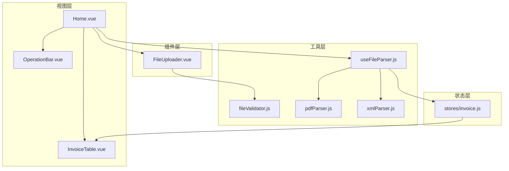
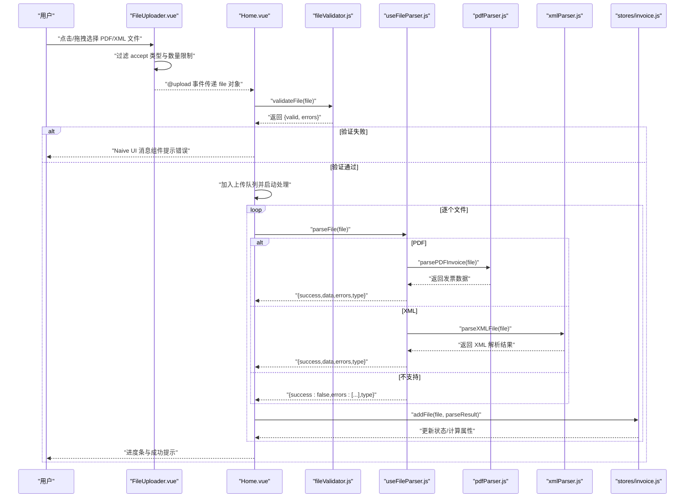
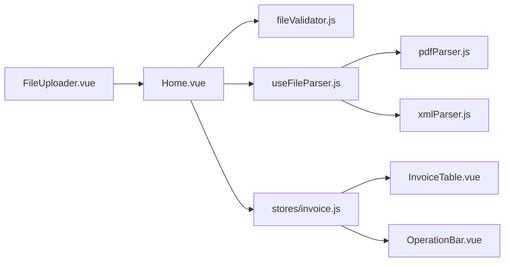

# 文件上传

<cite>
**本文引用的文件**
- [FileUploader.vue](file://src/components/FileUploader.vue)
- [fileValidator.js](file://src/utils/fileValidator.js)
- [Home.vue](file://src/views/Home.vue)
- [useFileParser.js](file://src/composables/useFileParser.js)
- [pdfParser.js](file://src/utils/pdfParser.js)
- [xmlParser.js](file://src/utils/xmlParser.js)
- [invoice.js](file://src/stores/invoice.js)
- [OperationBar.vue](file://src/components/OperationBar.vue)
- [InvoiceTable.vue](file://src/components/InvoiceTable.vue)
</cite>

## 目录
1. [简介](#简介)
2. [项目结构](#项目结构)
3. [核心组件](#核心组件)
4. [架构总览](#架构总览)
5. [详细组件分析](#详细组件分析)
6. [依赖关系分析](#依赖关系分析)
7. [性能考量](#性能考量)
8. [故障排查指南](#故障排查指南)
9. [结论](#结论)

## 简介
本文件围绕“文件上传”功能展开，重点说明以下内容：
- FileUploader.vue 组件如何通过原生 HTML 文件输入控件实现 PDF 和 XML 的批量上传，支持拖拽与点击两种交互方式；
- 上传前的验证流程：调用 fileValidator.js 中的 validateFile 函数进行格式（.pdf/.xml）与大小（≤10MB）校验，并在失败时通过 Naive UI 的消息组件反馈；
- Home.vue 如何监听 @upload 事件接收文件对象并加入处理队列；
- 文件上传状态管理、用户提示设计与后续解析流程的衔接逻辑；
- 常见上传问题（格式不支持、文件损坏、浏览器兼容性等）的处理建议。

## 项目结构
与文件上传相关的核心文件分布如下：
- 组件层：FileUploader.vue（上传入口）、OperationBar.vue（操作栏）、InvoiceTable.vue（结果展示）
- 工具层：fileValidator.js（文件验证）、pdfParser.js（PDF 解析）、xmlParser.js（XML 解析）
- 组合式函数：useFileParser.js（统一解析接口）
- 状态层：stores/invoice.js（文件列表与状态管理）

图表来源
- [Home.vue](file://src/views/Home.vue#L1-L236)
- [FileUploader.vue](file://src/components/FileUploader.vue#L1-L50)
- [fileValidator.js](file://src/utils/fileValidator.js#L1-L90)
- [useFileParser.js](file://src/composables/useFileParser.js#L1-L102)
- [pdfParser.js](file://src/utils/pdfParser.js#L1-L227)
- [xmlParser.js](file://src/utils/xmlParser.js#L1-L118)
- [invoice.js](file://src/stores/invoice.js#L1-L204)
- [OperationBar.vue](file://src/components/OperationBar.vue#L1-L119)
- [InvoiceTable.vue](file://src/components/InvoiceTable.vue#L1-L162)

章节来源
- [Home.vue](file://src/views/Home.vue#L1-L236)
- [FileUploader.vue](file://src/components/FileUploader.vue#L1-L50)

## 核心组件
- FileUploader.vue：提供拖拽与点击两种上传入口，限制可接受的文件类型为 .pdf 与 .xml，最大 100 个文件；通过自定义上传回调将文件对象以事件形式上抛给父组件。
- fileValidator.js：集中定义支持的格式、大小上限与数量上限，并提供单文件与批量验证能力。
- Home.vue：负责接收上传事件、执行前端验证、维护上传队列、驱动解析流程、展示处理进度与最终结果。
- useFileParser.js：统一封装 PDF/XML 的解析与校验逻辑，支持单文件与批量解析。
- pdfParser.js / xmlParser.js：分别实现 PDF 文本抽取与发票字段提取、XML 解析与发票字段提取、以及对应的校验逻辑。
- stores/invoice.js：集中管理文件列表、状态、筛选与搜索、以及文件名生成与更新。

章节来源
- [FileUploader.vue](file://src/components/FileUploader.vue#L1-L50)
- [fileValidator.js](file://src/utils/fileValidator.js#L1-L90)
- [Home.vue](file://src/views/Home.vue#L93-L155)
- [useFileParser.js](file://src/composables/useFileParser.js#L1-L102)
- [pdfParser.js](file://src/utils/pdfParser.js#L1-L227)
- [xmlParser.js](file://src/utils/xmlParser.js#L1-L118)
- [invoice.js](file://src/stores/invoice.js#L1-L204)

## 架构总览
文件上传的端到端流程如下：

图表来源
- [FileUploader.vue](file://src/components/FileUploader.vue#L1-L50)
- [Home.vue](file://src/views/Home.vue#L93-L155)
- [fileValidator.js](file://src/utils/fileValidator.js#L1-L90)
- [useFileParser.js](file://src/composables/useFileParser.js#L1-L102)
- [pdfParser.js](file://src/utils/pdfParser.js#L1-L227)
- [xmlParser.js](file://src/utils/xmlParser.js#L1-L118)
- [invoice.js](file://src/stores/invoice.js#L1-L204)

## 详细组件分析

### FileUploader.vue：上传入口与交互
- 功能要点
  - 使用原生 HTML 文件输入控件，启用多文件与目录拖拽（directory-dnd），限制 accept 为 ".pdf,.xml"，最大 100 个文件，关闭默认文件列表展示。
  - 自定义上传行为（custom-request），将文件对象通过事件上抛给父组件，不进行真实网络上传。
  - 提供拖拽区域与提示文案，明确支持格式与大小限制。
- 交互方式
  - 点击选择：触发系统文件选择器；
  - 拖拽上传：将文件拖入拖拽区域即可。
- 事件与回调
  - 触发 @upload 事件，携带原始 file 对象；
  - onChange 用于监听文件列表变化（当前未做额外处理）。

章节来源
- [FileUploader.vue](file://src/components/FileUploader.vue#L1-L50)

### Home.vue：上传事件监听与处理队列
- 事件监听
  - 在模板中绑定 FileUploader 的 @upload 事件，回调为 handleFileUpload。
- 前端验证
  - 调用 validateFile(file) 进行格式与大小校验；
  - 若验证失败，使用 Naive UI 的消息组件提示错误信息并终止处理。
- 队列与并发
  - 将通过验证的文件加入 uploadQueue；
  - 当 store.isProcessing 为 false 时，启动 processUploadQueue；
  - 遍历队列逐个调用 parseFile(file)，并将结果通过 store.addFile 写入状态。
- 用户提示
  - 展示进度对话框与百分比进度；
  - 成功后提示已处理的文件数量；
  - 失败时记录错误并提示具体文件名与错误信息。
- 与后续流程衔接
  - 解析成功后，store.addFile 会生成新文件名并更新状态；
  - OperationBar 与 InvoiceTable 基于 store 的计算属性与数据进行渲染与交互。

章节来源
- [Home.vue](file://src/views/Home.vue#L93-L155)
- [invoice.js](file://src/stores/invoice.js#L54-L99)

### fileValidator.js：文件验证
- 支持格式
  - PDF：MIME 类型 application/pdf；
  - XML：MIME 类型 text/xml 或 application/xml；
  - 同时允许扩展名为 .pdf/.xml 的文件。
- 大小限制
  - 单文件 ≤ 10MB。
- 数量限制
  - 批量验证时，若文件总数超过 100 个，直接返回错误。
- 返回结构
  - validateFile 返回 { valid, errors }；
  - validateFiles 返回 { valid, results, validFiles, invalidCount }。

章节来源
- [fileValidator.js](file://src/utils/fileValidator.js#L1-L90)

### useFileParser.js：统一解析接口
- 单文件解析
  - 根据文件扩展名判断 PDF 或 XML；
  - PDF：先解析文本，再提取发票字段，最后校验关键字段；
  - XML：解析 XML 文本，提取发票字段，再校验关键字段；
  - 返回统一结构：{ success, data, errors, type }。
- 批量解析
  - 分批（每批 10 个）并行处理，实时更新进度；
  - 最终汇总结果并重置状态。

章节来源
- [useFileParser.js](file://src/composables/useFileParser.js#L1-L102)
- [pdfParser.js](file://src/utils/pdfParser.js#L1-L227)
- [xmlParser.js](file://src/utils/xmlParser.js#L1-L118)

### pdfParser.js / xmlParser.js：解析与校验
- PDF 解析
  - 使用 pdfjs-dist 读取 PDF 文本；
  - 通过正则从文本中提取发票类型、发票号码、购买方、销售方、金额、开票日期等字段；
  - 校验：要求购买方名称与金额存在。
- XML 解析
  - 使用 fast-xml-parser 解析 XML；
  - 从解析结果中提取发票类型、发票代码、购买方、销售方、金额、开票日期等字段；
  - 校验：要求发票类型、购买方名称、金额存在。

章节来源
- [pdfParser.js](file://src/utils/pdfParser.js#L1-L227)
- [xmlParser.js](file://src/utils/xmlParser.js#L1-L118)

### stores/invoice.js：状态管理与文件名生成
- 状态字段
  - fileList：存储每个文件的原始文件、解析结果、新文件名、状态与错误信息；
  - filterStatus、searchKeyword、selectedIds：用于筛选与选择；
  - isProcessing：控制解析流程状态。
- 关键方法
  - addFile：根据解析结果生成新文件名或标记失败，写入状态；
  - updateFile：当编辑购买方或金额时，重新生成文件名并更新状态；
  - 计算属性：filteredList、successCount、failedCount、totalCount。
- 与 UI 的联动
  - OperationBar.vue 与 InvoiceTable.vue 基于 store 的数据与计算属性进行渲染与交互。

章节来源
- [invoice.js](file://src/stores/invoice.js#L1-L204)
- [OperationBar.vue](file://src/components/OperationBar.vue#L1-L119)
- [InvoiceTable.vue](file://src/components/InvoiceTable.vue#L1-L162)

## 依赖关系分析
- 组件耦合
  - FileUploader.vue 仅依赖 Naive UI 组件与本地事件，耦合度低；
  - Home.vue 作为协调者，依赖验证器、解析器与状态管理；
  - 解析器内部依赖 PDF/XML 解析工具与校验逻辑；
  - 状态管理独立于 UI，通过计算属性与方法被 UI 组件消费。
- 外部依赖
  - pdfjs-dist 与 fast-xml-parser；
  - Naive UI 的消息、模态框、进度条等组件。
- 潜在循环依赖
  - 未发现循环依赖；各模块职责清晰，接口边界明确。

图表来源
- [FileUploader.vue](file://src/components/FileUploader.vue#L1-L50)
- [Home.vue](file://src/views/Home.vue#L1-L236)
- [fileValidator.js](file://src/utils/fileValidator.js#L1-L90)
- [useFileParser.js](file://src/composables/useFileParser.js#L1-L102)
- [pdfParser.js](file://src/utils/pdfParser.js#L1-L227)
- [xmlParser.js](file://src/utils/xmlParser.js#L1-L118)
- [invoice.js](file://src/stores/invoice.js#L1-L204)
- [OperationBar.vue](file://src/components/OperationBar.vue#L1-L119)
- [InvoiceTable.vue](file://src/components/InvoiceTable.vue#L1-L162)

## 性能考量
- 并发与批处理
  - 批量解析采用分批并行（每批 10 个），减少长任务阻塞，提升吞吐；
  - 进度按批次推进，避免频繁重绘。
- I/O 与内存
  - PDF 解析需读取整个文件为 ArrayBuffer，注意大文件内存占用；
  - XML 解析读取为文本，注意超大 XML 的内存与解析时间。
- UI 响应
  - 使用进度对话框与百分比显示，避免长时间无反馈；
  - 失败时仅提示具体文件与错误，便于用户定位问题。

[本节为通用性能建议，不直接分析具体文件，故无章节来源]

## 故障排查指南
- 格式不支持
  - 现象：验证阶段返回“格式不支持”错误；
  - 排查：确认文件扩展名为 .pdf/.xml 或 MIME 类型为 application/pdf、text/xml 或 application/xml；
  - 处理：转换为受支持格式或修正文件扩展名。
- 文件大小超限
  - 现象：验证阶段返回“大小超过限制（最大 10MB）”；
  - 排查：检查文件体积；
  - 处理：压缩或拆分文件。
- 文件损坏
  - 现象：PDF 解析报错“文本提取失败”或“解析失败”，XML 报错“解析失败”；
  - 排查：确认文件完整性与编码；
  - 处理：重新生成或修复文件。
- 浏览器兼容性
  - 现象：某些浏览器不支持目录拖拽或特定 MIME 类型识别异常；
  - 排查：确认浏览器版本与安全策略；
  - 处理：降级为点击选择，或引导用户更换浏览器。
- 解析失败
  - 现象：解析成功但校验失败（缺少购买方名称、金额等）；
  - 排查：查看发票字段提取规则与原始文本；
  - 处理：手动修正发票信息或调整解析规则。

章节来源
- [fileValidator.js](file://src/utils/fileValidator.js#L1-L90)
- [pdfParser.js](file://src/utils/pdfParser.js#L1-L227)
- [xmlParser.js](file://src/utils/xmlParser.js#L1-L118)
- [Home.vue](file://src/views/Home.vue#L93-L155)

## 结论
该文件上传功能以 FileUploader.vue 为入口，结合 fileValidator.js 的前端验证、Home.vue 的队列与进度管理、useFileParser.js 的统一解析接口，以及 stores/invoice.js 的状态管理，形成了完整的端侧处理链路。其优势在于：
- 交互友好：支持拖拽与点击，提示明确；
- 前置校验：在进入解析前拦截不合规文件；
- 可观测性：进度对话框与错误提示提升用户体验；
- 可扩展性：解析器与状态管理解耦，便于后续扩展更多格式与功能。

[本节为总结性内容，不直接分析具体文件，故无章节来源]