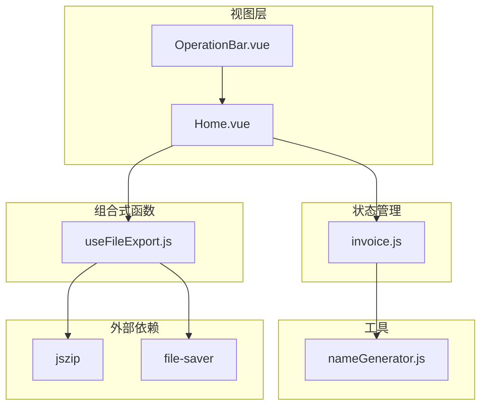
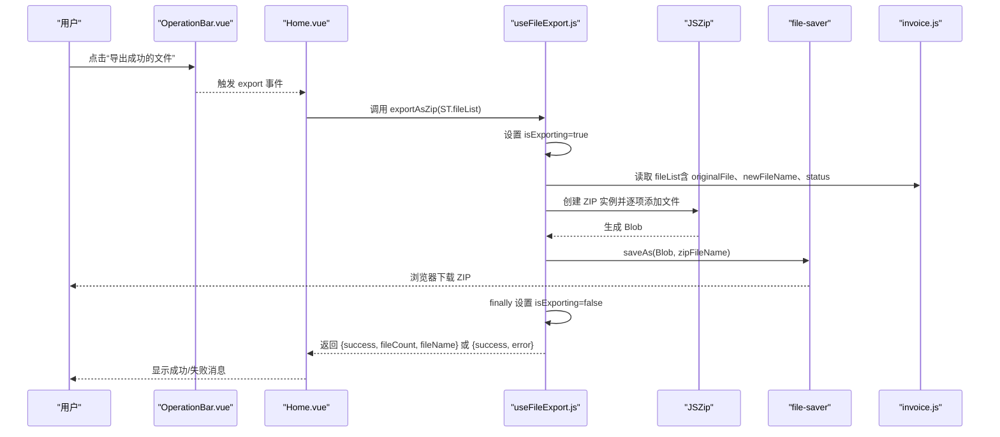
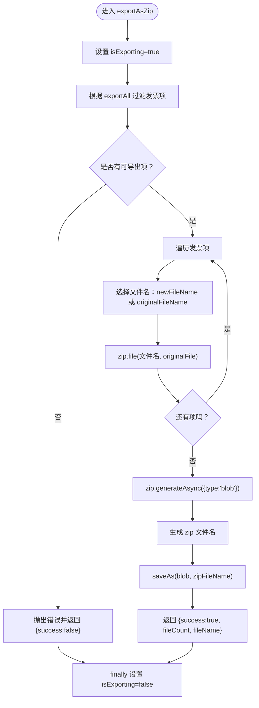
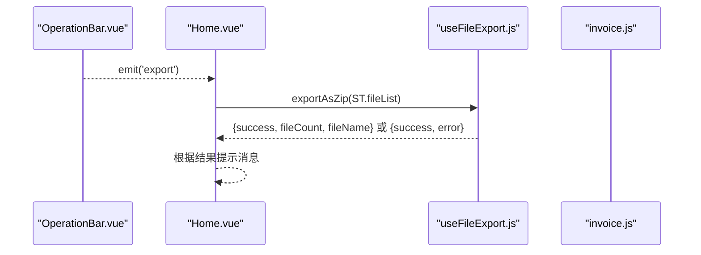
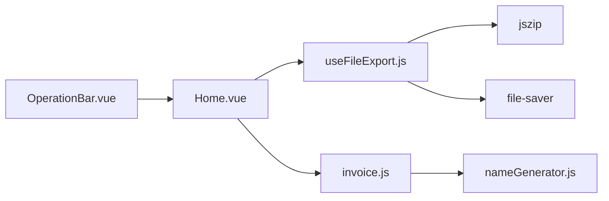

# 文件导出

<cite>
**本文引用的文件**
- [useFileExport.js](file://src/composables/useFileExport.js)
- [Home.vue](file://src/views/Home.vue)
- [OperationBar.vue](file://src/components/OperationBar.vue)
- [invoice.js](file://src/stores/invoice.js)
- [nameGenerator.js](file://src/utils/nameGenerator.js)
- [package.json](file://package.json)
</cite>

## 目录
1. [简介](#简介)
2. [项目结构](#项目结构)
3. [核心组件](#核心组件)
4. [架构总览](#架构总览)
5. [详细组件分析](#详细组件分析)
6. [依赖关系分析](#依赖关系分析)
7. [性能考量](#性能考量)
8. [故障排查指南](#故障排查指南)
9. [结论](#结论)

## 简介
本文件系统性地文档化“文件导出”功能，重点说明组合式函数 useFileExport.js 如何封装基于 jszip 和 file-saver 的 ZIP 压缩与下载逻辑；exportAsZip 方法如何遍历 store 中选中的成功解析的发票项，利用原始 File 对象或重新生成的 Blob 数据，将它们按新文件名添加到 ZIP 包中，并最终触发浏览器下载；isExporting 状态如何在导出过程中被设置，以在 OperationBar 上显示加载状态并防止重复提交；结合 Home.vue 中的 handleExport 方法，展示从用户点击导出按钮到完成下载的完整调用链；最后提供关于导出失败（如内存不足）、大文件处理、浏览器下载策略限制等潜在问题的排查建议。

## 项目结构
围绕“文件导出”的关键文件组织如下：
- 组合式函数：useFileExport.js 封装导出逻辑与状态
- 视图层：Home.vue 调用导出函数并处理返回结果
- UI 控件：OperationBar.vue 展示导出按钮与加载态
- 状态管理：invoice.js 存储发票列表与状态
- 工具：nameGenerator.js 用于生成规范化的新文件名
- 依赖：package.json 中声明 jszip 与 file-saver

图表来源
- [Home.vue](file://src/views/Home.vue#L1-L236)
- [OperationBar.vue](file://src/components/OperationBar.vue#L1-L119)
- [useFileExport.js](file://src/composables/useFileExport.js#L1-L80)
- [invoice.js](file://src/stores/invoice.js#L1-L204)
- [nameGenerator.js](file://src/utils/nameGenerator.js#L1-L225)
- [package.json](file://package.json#L1-L26)

章节来源
- [Home.vue](file://src/views/Home.vue#L1-L236)
- [OperationBar.vue](file://src/components/OperationBar.vue#L1-L119)
- [useFileExport.js](file://src/composables/useFileExport.js#L1-L80)
- [invoice.js](file://src/stores/invoice.js#L1-L204)
- [nameGenerator.js](file://src/utils/nameGenerator.js#L1-L225)
- [package.json](file://package.json#L1-L26)

## 核心组件
- useFileExport.js
  - 提供 isExporting 响应式状态与 exportAsZip 导出方法
  - 使用 JSZip 生成 ZIP，使用 file-saver 触发下载
  - 在导出前后切换 isExporting，用于 UI 加载态与防重复提交
- Home.vue
  - 通过组合式函数注入 isExporting 与 exportAsZip
  - handleExport 调用 exportAsZip 并根据返回结果提示消息
- OperationBar.vue
  - 导出按钮绑定 :loading="isExporting"，禁用条件为 successCount === 0
- invoice.js
  - 存储发票项，包含 originalFile、newFileName、status 等字段
  - 导出时仅选择 status === 'success' 的发票项
- nameGenerator.js
  - 生成规范化的新文件名，供导出时作为 ZIP 内文件名使用

章节来源
- [useFileExport.js](file://src/composables/useFileExport.js#L1-L80)
- [Home.vue](file://src/views/Home.vue#L180-L216)
- [OperationBar.vue](file://src/components/OperationBar.vue#L1-L119)
- [invoice.js](file://src/stores/invoice.js#L1-L204)
- [nameGenerator.js](file://src/utils/nameGenerator.js#L1-L225)

## 架构总览
下图展示了从用户点击导出按钮到下载完成的端到端流程，包括状态流转与关键调用点。

图表来源
- [OperationBar.vue](file://src/components/OperationBar.vue#L1-L119)
- [Home.vue](file://src/views/Home.vue#L180-L216)
- [useFileExport.js](file://src/composables/useFileExport.js#L1-L80)
- [invoice.js](file://src/stores/invoice.js#L1-L204)

## 详细组件分析

### useFileExport.js 组件分析
- 功能职责
  - 管理 isExporting 状态，用于 UI 加载态与防重复提交
  - exportAsZip 接收发票列表与可选参数 exportAll（默认 false），过滤待导出项后打包并下载
- 关键流程
  - 过滤：exportAll 为 true 时导出全部；否则仅导出 status === 'success' 的项
  - 文件名：优先使用 newFileName（成功解析生成），否则回退 originalFileName
  - 打包：将每个发票项的 originalFile 作为原始二进制内容加入 ZIP
  - 生成与下载：生成 Blob 后调用 saveAs 触发浏览器下载
  - 异常处理：捕获错误并返回 {success:false, error}，finally 中复位 isExporting
- 性能与复杂度
  - 时间复杂度 O(n)，n 为导出项数量
  - 内存占用与 ZIP 生成 Blob 的大小直接相关，受浏览器限制
- 代码片段路径
  - [exportAsZip 主流程](file://src/composables/useFileExport.js#L14-L59)
  - [isExporting 状态](file://src/composables/useFileExport.js#L9-L10)
  - [日期格式化辅助函数](file://src/composables/useFileExport.js#L61-L73)

图表来源
- [useFileExport.js](file://src/composables/useFileExport.js#L14-L59)

章节来源
- [useFileExport.js](file://src/composables/useFileExport.js#L1-L80)

### Home.vue 中的 handleExport 调用链
- 用户交互
  - OperationBar.vue 的导出按钮绑定 :loading="isExporting"，禁用条件为 successCount === 0
  - 用户点击后向父组件 Home.vue 触发 export 事件
- 处理逻辑
  - Home.vue 注入 useFileExport 的 isExporting 与 exportAsZip
  - handleExport 调用 exportAsZip(store.fileList)，等待返回结果
  - 根据 result.success 显示成功或失败消息
- 代码片段路径
  - [导出按钮与 isExporting 绑定](file://src/components/OperationBar.vue#L43-L49)
  - [handleExport 调用与消息提示](file://src/views/Home.vue#L200-L216)

图表来源
- [OperationBar.vue](file://src/components/OperationBar.vue#L1-L119)
- [Home.vue](file://src/views/Home.vue#L180-L216)
- [useFileExport.js](file://src/composables/useFileExport.js#L1-L80)
- [invoice.js](file://src/stores/invoice.js#L1-L204)

章节来源
- [Home.vue](file://src/views/Home.vue#L180-L216)
- [OperationBar.vue](file://src/components/OperationBar.vue#L1-L119)

### OperationBar.vue 的加载态与防重复提交
- 加载态
  - 导出按钮绑定 :loading="isExporting"，在导出期间显示加载
- 防重复提交
  - 导出按钮禁用条件为 successCount === 0，避免无成功项时误操作
- 代码片段路径
  - [按钮 loading 与禁用逻辑](file://src/components/OperationBar.vue#L43-L49)

章节来源
- [OperationBar.vue](file://src/components/OperationBar.vue#L1-L119)

### invoice.js 中的发票项结构与导出筛选
- 关键字段
  - originalFile：原始 File 对象，作为 ZIP 内容
  - newFileName：成功解析后生成的新文件名
  - originalFileName：原始文件名
  - status：'success'/'failed'
- 导出筛选
  - exportAsZip 默认仅导出 status === 'success' 的发票项
- 代码片段路径
  - [发票项结构与 addFile 流程](file://src/stores/invoice.js#L54-L99)
  - [exportAsZip 筛选逻辑](file://src/composables/useFileExport.js#L20-L24)

章节来源
- [invoice.js](file://src/stores/invoice.js#L1-L204)
- [useFileExport.js](file://src/composables/useFileExport.js#L14-L24)

### nameGenerator.js 与文件名生成
- 作用
  - 生成规范化的新文件名，供导出时作为 ZIP 内文件名使用
- 导出时的文件名选择
  - exportAsZip 会优先使用 newFileName（当 status === 'success' 时）
- 代码片段路径
  - [generateFileName](file://src/utils/nameGenerator.js#L118-L145)
  - [exportAsZip 文件名选择](file://src/composables/useFileExport.js#L30-L33)

章节来源
- [nameGenerator.js](file://src/utils/nameGenerator.js#L1-L225)
- [useFileExport.js](file://src/composables/useFileExport.js#L30-L33)

## 依赖关系分析
- 外部依赖
  - jszip：创建 ZIP 包与生成 Blob
  - file-saver：触发浏览器下载
- 内部依赖
  - Home.vue 依赖 useFileExport 与 invoice store
  - OperationBar.vue 依赖 Home.vue 并将 isExporting 传入
  - invoice.js 依赖 nameGenerator.js 生成新文件名

图表来源
- [Home.vue](file://src/views/Home.vue#L1-L236)
- [OperationBar.vue](file://src/components/OperationBar.vue#L1-L119)
- [useFileExport.js](file://src/composables/useFileExport.js#L1-L80)
- [invoice.js](file://src/stores/invoice.js#L1-L204)
- [nameGenerator.js](file://src/utils/nameGenerator.js#L1-L225)
- [package.json](file://package.json#L1-L26)

章节来源
- [package.json](file://package.json#L1-L26)
- [useFileExport.js](file://src/composables/useFileExport.js#L1-L80)
- [Home.vue](file://src/views/Home.vue#L1-L236)
- [OperationBar.vue](file://src/components/OperationBar.vue#L1-L119)
- [invoice.js](file://src/stores/invoice.js#L1-L204)
- [nameGenerator.js](file://src/utils/nameGenerator.js#L1-L225)

## 性能考量
- 时间复杂度
  - exportAsZip 为 O(n)，n 为导出项数量，主要开销在 zip.file 与 zip.generateAsync
- 内存与大文件
  - zip.generateAsync({ type:'blob' }) 会在内存中构建 ZIP Blob，大文件或大量文件可能导致内存压力
  - 建议分批导出或限制同时导出的文件数量
- 浏览器限制
  - 不同浏览器对大文件下载有不同限制，可能触发“内存不足”或下载失败
  - 可考虑在导出前进行文件大小与数量校验，或提示用户减少导出范围
- 并发与 UI 卡顿
  - 导出期间 isExporting=true，UI 按钮禁用，避免重复提交
  - 若导出耗时较长，可在 UI 展示进度或提示

[本节为通用性能建议，不直接分析具体文件，故无章节来源]

## 故障排查指南
- 导出失败：没有可导出的文件
  - 现象：抛出错误并返回 {success:false, error}
  - 排查：确认至少有一个 status === 'success' 的发票项
  - 代码片段路径：[错误抛出与返回](file://src/composables/useFileExport.js#L24-L27)
- 导出失败：内存不足或下载异常
  - 现象：zip.generateAsync 或 saveAs 抛错
  - 排查：检查浏览器控制台错误；尝试减少导出文件数量或体积；确认浏览器允许下载
  - 代码片段路径：[生成与下载](file://src/composables/useFileExport.js#L35-L45)
- 导出按钮不可用
  - 现象：导出按钮禁用
  - 排查：确认 successCount > 0；检查 isExporting 是否为 true
  - 代码片段路径：[按钮禁用与加载态](file://src/components/OperationBar.vue#L43-L49)
- 导出文件名异常
  - 现象：ZIP 内文件名为原始名或未按预期命名
  - 排查：确认发票项 status === 'success' 且 newFileName 已生成；检查 nameGenerator 规则
  - 代码片段路径：[文件名选择](file://src/composables/useFileExport.js#L30-L33)，[生成新文件名](file://src/utils/nameGenerator.js#L118-L145)
- 导出范围不符预期
  - 现象：导出了全部文件而非仅成功项
  - 排查：确认 exportAsZip 的 exportAll 参数是否为默认值（false）
  - 代码片段路径：[筛选逻辑](file://src/composables/useFileExport.js#L20-L24)

章节来源
- [useFileExport.js](file://src/composables/useFileExport.js#L14-L59)
- [OperationBar.vue](file://src/components/OperationBar.vue#L1-L119)
- [nameGenerator.js](file://src/utils/nameGenerator.js#L118-L145)

## 结论
useFileExport.js 通过组合式函数的方式，将 ZIP 压缩与下载逻辑集中封装，配合 Home.vue 与 OperationBar.vue 的交互，实现了从用户点击到下载完成的完整闭环。isExporting 状态确保了 UI 加载态与防重复提交，exportAsZip 的筛选与文件名选择保证了导出内容的正确性。针对大文件与浏览器限制，建议采取分批导出、体积与数量校验等策略以提升稳定性与用户体验。